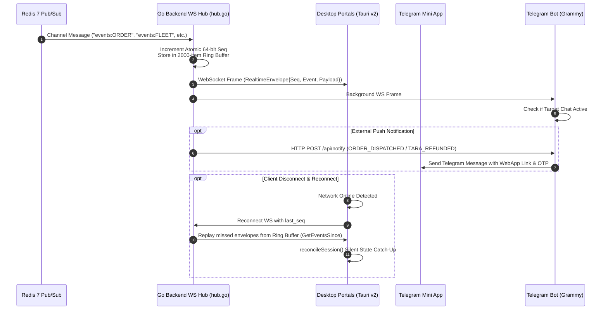
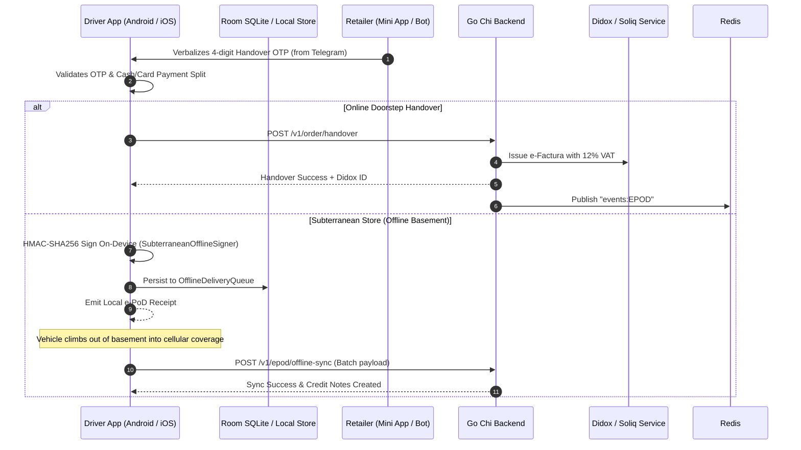

# Comprehensive Architectural Investigation of pegasus.x Client Ecosystems

**Author**: `explorer_pegasusdotx_clients`  
**Date**: 2026-09-14  
**Target Repository**: `/Users/shakhzod/Desktop/V.O.I.D/pegasus.x`  
**Architectural System**: Sovereign Lean Single-Tenant / National Operating Core (PostgreSQL 16 + Redis 7 + Go Chi + Tauri v2 + Telegram + Native Driver Mobile)

---

## Executive Summary

The `pegasus.x` repository represents the **Sovereign Lean Single-Tenant National Operating Core** for FMCG B2B distribution in Uzbekistan. In contrast to the global multi-tenant Spanner+Kafka enterprise system (`pegasusX`), `pegasus.x` is designed for sovereign local execution (e.g. Servercore Tashkent Tier III, direct TAS-IX peering), utilizing PostgreSQL 16 (`pgx/v5`, TimescaleDB, PostGIS), Redis 7 (Streams, Pub/Sub, presence), strict 64-bit integer minor units (tiyins/cents), and an offline-first client architecture.

The client layer of `pegasus.x` comprises five primary facets:
1. **Desktop Portals (Tauri v2 + Next.js 15)**: High-density control towers for **Supplier** (`apps/supplier-desktop`) and **Warehouse Floor WMS** (`apps/warehouse-desktop`), alongside Retailer desktop (`apps/retailer-desktop`).
2. **Telegram Retailer Ecosystem**: High-adoption B2B commerce for bakkols and convenience stores via **Telegram Bot** (`apps/telegram-bot`) built on Grammy & Express, and **Telegram Mini App** (`apps/telegram-miniapp`) built on Vite + React 19.
3. **Driver Mobile Applications**: Native Android (`apps/driver-app-android` in Kotlin/Jetpack Compose) and Native iOS (`apps/driver-app-ios` in Swift 6/SwiftUI) equipped with GPS Kalman filtering, DVIR pre-trip vehicle inspections, mid-shift hot-swap vehicle rescue, Didox Soliq e-facturas, smart safe cash drops, and subterranean offline signing.
4. **Shared Desktop & Runtime Libraries**: Cross-cutting packages (`packages/desktop-bridge`, `packages/desktop-cache`, `packages/ws-refresh-contract`, `packages/api-core`, `packages/types`) enabling OS Keyring JWT security, SQLite offline outbox caching, and event contracts.
5. **Realtime & Communication Fabric**: Go Chi REST API (`backend/internal/api`), Gorilla WebSocket Hub (`backend/internal/ws/hub.go`) backed by Redis Pub/Sub channels with monotonic sequence tracking, SSE streaming (`/v1/supplier/events`), and structured HTTP webhooks to the Telegram bot (`/api/notify`).

---

## 1. Desktop Applications (Tauri v2 + Next.js 15)

### 1.1 Supplier Desktop (`apps/supplier-desktop`)

#### Architecture & Configuration
- **Tauri v2 Configuration**: `apps/supplier-desktop/src-tauri/tauri.conf.json`
  - Identifier: `com.pegasusx.supplier` (line 5)
  - Window: 1440x900 default, 1024x700 min, overlay title bar (`titleBarStyle: "Overlay"`, lines 18–27).
  - Deep linking protocol: `pegasusx-supplier://` (line 58).
  - CSP: Restricts network connectivity to localhost / loopback ports (`8080`, `8180`, `9099`) and WebSocket endpoints (`ws://localhost:8080`, `wss://localhost:8180`) (line 31).
  - OTA Updater: Minisign public key verification against Google Cloud Storage updater endpoints (`dW50cnVzdGVkIGNvbW1lbnQ6...`, lines 62–70).
- **Next.js 15 Host**: `apps/supplier-desktop/package.json`, `apps/supplier-desktop/next.config.mjs`
  - Dual build target: `output: process.env.TAURI_BUILD ? 'export' : 'standalone'` (line 25). When compiled for Tauri, static HTML/JS export is emitted to `../out` (`tauri.conf.json` line 7). In standalone web mode, Next.js rewrites `/v1/:path*` and `/api/v1/:path*` to `http://localhost:8080` (lines 32–44).
  - Transpiled internal packages: `@pegasusx/desktop-bridge`, `@pegasusx/desktop-cache`, `@pegasusx/ui-maps`, `@pegasusx/ui-kit`, `@pegasusx/pulse-ui`, `@pegasusx/ws-refresh-contract`, `@pegasusx/api-core` (lines 10–24).

#### Rust Backend Bridge (`src-tauri`)
- **Crate Configuration**: `apps/supplier-desktop/src-tauri/Cargo.toml`
  - Plugins: `tauri-plugin-sql` (with SQLite feature, line 25), `tauri-plugin-shell`, `tauri-plugin-dialog`, `tauri-plugin-fs`, `tauri-plugin-process`, `tauri-plugin-single-instance`, `tauri-plugin-deep-link`, `tauri-plugin-updater`, and native `keyring` (version 3 with `apple-native` and `windows-native` features, line 26).
- **Application Entrypoint**: `apps/supplier-desktop/src-tauri/src/lib.rs`
  - Wires deep link event emission `pegasusx-deep-link` (lines 12–23).
  - Registers IPC commands: `store_token`, `get_token`, `clear_token` (lines 34–38).
- **Security Keyring Bridge**: `apps/supplier-desktop/src-tauri/src/commands/security.rs`
  - Stores JWT securely in the operating system credential store (macOS Keychain, Windows Credential Manager, Linux Secret Service):
    - `SERVICE = "com.pegasusx.supplier"`, `ACCOUNT_TOKEN = "supplier_jwt"` (lines 4–5).
    - `store_token(token: String)` invokes `Entry::new(SERVICE, ACCOUNT_TOKEN).set_password(&token)` (lines 15–24).
    - `get_token()` and `clear_token()` retrieve and delete credentials without browser cookie vulnerabilities (lines 27–48).

#### Next.js Frontend & State Management
- **Routing Structure**: `apps/supplier-desktop/app/(portal)`
  - 41 operational portal routes: `control-tower`, `fleet`, `orders`, `inventory`, `manifests`, `dispatch`, `pricing`, `credit`, `crm`, `finance`, `treasury`, `compliance`, `analytics`, `reconciliation`, `replenishment`, `warehouses`, `supply-lanes`, `topology`, `transfers`.
- **API Client**: `apps/supplier-desktop/lib/api.ts`
  - Inherits from `@pegasusx/api-core` `ApiClient` (line 1).
  - Implements typed methods for plant management, transfers, demand plans, payment reconciliation, trade credit configuration, and fleet management:
    - `createDriver`, `createVehicle` (lines 137–148).
    - `getFleetDrivers`, `getFleetVehicles` (lines 149–164).
    - `assignFleetDriverVehicle` -> `POST /v1/warehouse/fleet/assign` (lines 165–170).
    - `updateFleetVehicleStatus` -> `PATCH /v1/warehouse/fleet/vehicles/:id/status` (lines 171–176).
    - `toggleFleetDriverShift` -> `POST /v1/warehouse/fleet/drivers/:id/shift` (lines 177–182).
    - Trade Credit Quota: `getCreditConfig`, `updateCreditConfig`, `createWarehousePIN`, `getWarehousePINs`, `revokeWarehousePIN`, `issueCreditTranche` (lines 184–230).
- **Realtime SSE Refresh Hook**: `apps/supplier-desktop/lib/use-supplier-ws-refresh.ts`
  - Replaces legacy bi-directional WebSockets with lightweight unidirectional Server-Sent Events (SSE) against `/v1/supplier/events` (`SSE_SUPPLIER_ENDPOINT`, lines 17–20, 73).
  - Handles debouncing (`debounceMs = 500`), event type filtering, and automatic session reconciliation via `runSupplierSessionReconcile()` on reconnect (`eventSource.onopen`, lines 76–81).

---

### 1.2 Warehouse Desktop Floor WMS (`apps/warehouse-desktop`)

#### Architecture & Configuration
- **Tauri v2 Configuration**: `apps/warehouse-desktop/src-tauri/tauri.conf.json`
  - Identifier: `com.pegasusx.warehouse` (line 5).
  - Product Name: "PegasusX Warehouse" (line 3).
  - Dev URL: `http://localhost:3001` (line 8).
  - Deep link scheme: `pegasusx-warehouse://` (line 54).
- **Next.js 15 Host**: `apps/warehouse-desktop/package.json`
  - Scripts: `dev: next dev -p 3001` (line 6).
  - Dependencies: Next.js 15.1.0, React 19.0.0, `@tauri-apps/api: ^2.11.1`, Lucide React, MapLibre GL, Recharts, Framer Motion.

#### Rust Backend Bridge (`src-tauri`)
- Shares identical secure keyring command architecture (`commands/security.rs`) for managing `pegasus_warehouse_jwt` in the OS keyring.
- Integrates `tauri-plugin-sql` for local SQLite operations and `tauri-plugin-deep-link`.

#### Next.js Frontend & Floor Operations
- **Floor Operational Routes**: `apps/warehouse-desktop/app`
  - 37 dedicated routes: `bins`, `claims`, `cold-chain`, `control-tower`, `crossdock`, `cycle-counts`, `demand-forecast`, `dispatch`, `drivers`, `exceptions`, `fleet-live-map`, `inventory`, `labor-capacity`, `manifests`, `orders`, `payment-config`, `pick-waves`, `preorders`, `replenishment`, `returns`, `ship-units`, `tomorrow-board`, `vehicles`.
- **API Client**: `apps/warehouse-desktop/lib/api.ts`
  - Rich warehouse fleet and inventory operations:
    - Stock adjustments: `adjustStock` (`PUT /v1/warehouse/stock/adjust`), `toggleServe`, `setBackorderPolicy` (lines 86–115).
    - Fleet & Driver Management:
      - `getVehicles` (`GET /v1/warehouse/fleet/vehicles`, line 116).
      - `getDrivers` (`GET /v1/warehouse/fleet/drivers`, line 117).
      - `createDriver` with PINFL, license category, cash bag limit in tiyins (`POST /v1/warehouse/fleet/drivers`, lines 118–132).
      - `createVehicle` with class, volume VU, refrigeration range, texosmotr and OSAGO expiry (`POST /v1/warehouse/fleet/vehicles`, lines 133–150).
      - `assignDriverVehicle` (`POST /v1/warehouse/fleet/assign`, lines 151–159).
      - `swapDriver` and `swapVehicle` for mid-shift hot swapping (`POST /v1/warehouse/fleet/swap-driver`, `/swap-vehicle`, lines 176–196).
      - DVIR Pre-trip Inspections: `getDVIRInspections`, `submitDVIRInspection` (`/v1/warehouse/fleet/dvir`, lines 197–204).
    - WMS Pick Waves: `getPickWaves` with zone allocation and bay staging (`GET /v1/warehouse/pick-waves`, lines 212–229).
- **WebSocket Realtime Client**: `apps/warehouse-desktop/lib/auth.ts`
  - Authenticated WS ticket generation: `connectWarehouseWS()` requests `GET /v1/warehouse/ws-session` to mint a short-lived token ticket, avoiding exposing credentials in URL logs (lines 186–195).
  - Upgrades to `ws://${host}/v1/ws?token=...`.
  - Reconnection Manager: Exponential backoff up to 30s (`Math.min(30_000, 1_000 * 2 ** (reconnectAttempt - 1))`, line 268). On reconnect, calls `reconcileSession({ role: 'warehouse', ... })` and dispatches `notifyWarehouseSessionReconciled()` (lines 236–243).
  - Online/Offline handling via `window.addEventListener('online'/'offline')` (lines 285–286).
- **WS Event Dispatcher Hook**: `apps/warehouse-desktop/lib/use-warehouse-ws-refresh.ts`
  - Filters matching events from `WAREHOUSE_ORDERS_REFRESH_EVENTS` with 500ms debouncing (lines 17–55).

---

### 1.3 Shared Desktop Bridge & Offline SQLite Cache

#### `@pegasusx/desktop-bridge` (`packages/desktop-bridge`)
- Location: `packages/desktop-bridge/index.ts`
- Functions:
  - `isTauri()`: Checks `window.__TAURI_INTERNALS__` (line 18).
  - `storeToken()`, `getStoredToken()`, `clearStoredToken()`: Safely invokes Rust keyring IPC (lines 52–91).
  - `getAppInfo()`: Invokes `get_app_info` command (lines 94–101).
  - Native Print & Export: `desktopPrint`, `savePrintableHtml`, `exportCsv`, `saveTextFile` (lines 103–117).
  - Deep Link Subscription: `subscribeDesktopDeepLinks()` (line 118).
  - Desktop OTA Updater: `checkDesktopUpdate()`, `installPendingDesktopUpdate()` (lines 120–136).

#### `@pegasusx/desktop-cache` (`packages/desktop-cache`)
- Location: `packages/desktop-cache/db.ts`
- SQLite Embedded Store: Initializes `sqlite:pegasus_desktop_cache.db` via `@tauri-apps/plugin-sql` (lines 3, 19–21).
- Schema Migration (lines 35–80):
  1. `kv_cache`: General key-value cache with `updated_at` timestamps.
  2. `pending_checkouts`: Local checkout outbox with `idempotency_key`, `retry_count`, and `last_error`.
  3. `pending_pos_sales`: Offline POS transactions with `client_sale_id`, `client_receipt`, `session_id`, `idempotency_key`, `status`, `server_sale_id`.
  4. `pending_commands`: Optimistic offline command queue with `command_type`, `entity_id`, `known_version`, and retry tracking.
- Bootstrap Integration: Both `supplier-desktop` and `warehouse-desktop` invoke `initDesktopCache()` on app mount (`desktop-cache-bootstrap.tsx`).

---

## 2. Telegram Retailer Ecosystem

The Telegram ecosystem provides immediate, low-barrier, ubiquitous access for retail merchants (bakkols) in Uzbekistan who operate predominantly within Telegram.

### 2.1 Telegram Bot (`apps/telegram-bot`)

#### Structure & Stack
- Location: `apps/telegram-bot`
- Technology: Node.js / TypeScript, Grammy (`grammy: ^1.34.0`), Express (`express: ^4.21.2`), Axios, WebSocket client (`ws: ^8.18.0`).
- Service Host: `apps/telegram-bot/src/index.ts`
  - Express server running on port 3001 (line 8).
  - Background WebSocket connection to Pegasus.X Go backend stream: `ws://${BACKEND_URL}/v1/ws` (lines 126–155).
  - Webhook Notification Receiver: `POST /api/notify` (lines 28–92).

#### Webhook Notification Handlers (`src/index.ts`)
The bot receives events dispatched by the backend and formats them into rich Telegram messages with inline Mini App launch buttons:
1. `ORDER_DISPATCHED` (lines 39–51):
   - Notifies merchant of truck departure: Order ID, Driver Name, Vehicle Plate, ETA in minutes.
   - Generates & delivers the critical **4-digit Receipt OTP Code (`data.otp`)**:
     `🔑 QABUL KODI (OTP): 1234 (Yuk tushirilganda ushbu kodni haydovchiga ayting)`
   - Inline keyboard: `🗺️ Xaritada kuzatish` (opens Mini App at `#orders`).
2. `TARA_REFUNDED` (lines 52–62):
   - Circular economy return notification: quantity of returnable crates/bottles accepted by driver, deposit credit refunded in UZS directly to merchant's Nasiya balance.
   - Inline keyboard: `📊 Balansni ko'rish` (opens Mini App at `#credit`).
3. `AUTO_ORDER_ALERT` (lines 63–74):
   - S&OP automated replenishment prompt: SKU name, remaining on-hand quantity, estimated days until stockout.
   - Inline keyboard: `⚡ Avto-buyurtmani tasdiqlash` (opens Mini App at `#store`).

#### Bot Command & NLU Logic (`src/bot.ts`)
- **Uzbek Conversational FMCG NLU Engine**:
  - `FMCG_DICTIONARY` (lines 37–46): Curated dictionary of high-velocity Uzbek SKUs (Dinay Olma, Chortoq mineral water, Coca-Cola 1.5L, Nestle Pure Life, Musaffo sut, Lay's chips, Oltin Qala yog'i, Toshkent choy 95).
  - `parseUzbekOrderText(text: string)` (lines 48–72): Rule-based tokenizer extracting quantities (e.g., "10 ta dinay", "5 blok chortoq") as a resilient fallback.
- **Bot Interactions**:
  - `/start` Onboarding (lines 127–165): Asks for merchant phone number (`requestContact`). On receipt (`message:contact`, lines 168–197), registers/verifies the retailer phone, sets default store profile ("Chilonzor Oziq-ovqat Bakkol"), displays available Nasiya credit limit (50,000,000 UZS), and equips the persistent custom reply keyboard (`getMainMenuKeyboard`).
  - **Voice Message Ordering** (`message:voice`, `message:audio`, lines 200–269):
    - Downloads audio from Telegram API.
    - Submits audio URL to Go backend speech endpoint: `POST /v1/speech/voice-order`.
    - If AI speech service is offline, falls back to `parseUzbekOrderText`.
    - Computes total in UZS and **2.5% Skonto cash discount**.
    - Renders confirmation keyboard:
      - `💵 Naqd (Skonto -2.5%)` -> `confirm_voice_cash`
      - `💳 Nasiya (14 kun)` -> `confirm_voice_nasiya`
      - `✏️ Mini Appda ochish & tahrirlash`
  - **Shelf Photo / Barcode Analysis** (`message:photo`, lines 271–291): AI shelf inventory analysis suggesting replenishment with 1-click cart addition.
  - **Orders & Tracking** (`📦 Buyurtmalarim & OTP`, lines 347–372): Displays active order `#ORD-941824`, driver name, vehicle plate, remaining ETA, and Handover OTP (`4892`).
  - **Nasiya Credit Status** (`💰 Balans & Nasiya`, lines 374–395): Reports credit limit, debt, available headroom, next due date, and payment links (Click, Uzum).
  - **Warehouse Delegation PIN** (`🔑 Ombor PIN-Kodi`, lines 397–420): Generates a 6-digit one-time PIN valid for 15 minutes for delegated store assistants to accept goods.
  - **Returnable Transport Items (Tara)** (`🔄 Bo'sh Tara Hisobi`, lines 422–439): Reports held plastic crates, wooden euro-pallets, and 19L water jugs with total deposit value.

---

### 2.2 Telegram Mini App (`apps/telegram-miniapp`)

#### Architecture & Stack
- Location: `apps/telegram-miniapp`
- Framework: Vite 6.0 + React 19 + TypeScript + Tailwind CSS (`package.json`).
- Telegram WebApp Integration: `src/hooks/useTelegram.ts`
  - Wraps `window.Telegram.WebApp` (lines 9–17).
  - Syncs Telegram theme variables (`--tg-theme-bg-color`, `--tg-theme-text-color`, `--tg-theme-button-color`, etc.) to HTML document root with automatic dark mode detection (lines 18–55).
  - Telegram Haptics: `haptics.impact('light' | 'medium' | 'heavy')`, `haptics.notification('success' | 'error' | 'warning')`, `haptics.selection()` (lines 113–123).
  - Telegram Native Back Button: `showBackButton(onBack)` and `hideBackButton()` (lines 128–155).

#### Client Service Layer (`src/services/api.ts`)
Comprehensive API integration with Go Chi backend at `http://localhost:8080` (or `VITE_BACKEND_URL`):
- **Wholesale Catalog Browsing** (`fetchCatalog`, lines 203–233):
  - Fetches from `GET /v1/products`.
  - Calculates 12% Soliq QQS tax: `price_before_tax_uzs = Math.round(unit_price_uzs / 1.12)`.
  - Computes bulk tier pricing discounts (e.g. 5% off for 10+ cases).
- **Order Placement & Skonto Discount** (`submitOrder`, lines 238–314):
  - Submits order to `POST /v1/orders`.
  - Supports payment methods: `CASH` (with 2.5% early payment Skonto discount), `CONSIGNMENT` (Nasiya trade credit), `CLICK`, `PAYME`.
  - Generates 4-digit handover OTP code.
  - Generates Didox electronic invoice link (`DID-2026-...`).
- **Order Tracking & Concealed Damage** (`fetchOrders`, `submitDamageClaim`, lines 319–463):
  - Fetches active and historical orders from `GET /v1/orders?retailer_id=...`.
  - 48-Hour Concealed Damage Claims (`submitDamageClaim`): Submits claim to `POST /v1/claims` with defect type (`BROKEN`, `EXPIRED`, `LEAKAGE`), SKU, quantity, photo URL, and requested credit in minor units (`credit_requested_minor: uzs * 100`).
- **Nasiya Trade Credit & PIN Delegation** (`fetchCreditAccount`, `generateWarehousePIN`, lines 468–546):
  - Fetches credit summary from `GET /v1/retailer/credit/summary`.
  - Generates 15-minute Warehouse PIN via `POST /v1/credit/pins` with delegated role (`STORE_ASSISTANT`, `FAMILY_MEMBER`, `OWNER`).
- **Circular Packaging / RTI Ledger** (`fetchEmpties`, `submitEmptiesReturn`, lines 551–666):
  - Tracks plastic crates (`PLASTIC_CRATE`, 40,000 UZS deposit), wooden pallets (`EURO_PALLET`, 120,000 UZS), 19L water jugs (`WATER_JUG_19L`, 45,000 UZS), and beverage kegs (`BEVERAGE_KEG`, 350,000 UZS).
  - Fetches from `GET /v1/empties/retailers/:id/balances`.
  - Handover to driver via `POST /v1/empties/intake`.
- **In-Store Stock & POS Shifts** (`fetchStoreStock`, `fetchCurrentShift`, lines 671–750):
  - Reads store on-hand stock and safety stock thresholds from `GET /v1/retailer/stock`.
  - Reads active POS register shift from `GET /v1/retailer/shifts/current`.
- **S&OP Auto-Order Replenishment** (`fetchAutoOrderProposals`, `confirmAutoOrderProposal`, lines 752–840):
  - Pulls automated reorder draft proposals from `GET /v1/retailer/auto-order/proposals`.
  - One-click confirmation to warehouse: `POST /v1/retailer/auto-order/proposals/:id/confirm`.
- **Sell-Through Analytics** (`fetchSellThrough`, lines 842–883):
  - Analyzes daily and weekly SKU velocity and run-out days (`GET /v1/retailer/analytics/sell-through`).

#### Mini App Views (`src/components`)
- `CatalogTab.tsx`: FMCG wholesale grid, quick search, brand category chips, bulk quantity stepper.
- `CartTab.tsx`: Cart summary, real-time Soliq QQS tax calculation, Skonto cash discount deduction, delivery slot selector.
- `OrdersTab.tsx`: Live delivery status stepper (`PENDING` -> `ACCEPTED` -> `PICKING` -> `OUT_FOR_DELIVERY` -> `DELIVERED`), driver contact, live driver coordinates map, 4-digit OTP card, 48-hour damage claim trigger.
- `CreditTab.tsx`: Circular gauge showing used vs available Nasiya limit, countdown timer for 15-minute assistant PIN code.
- `EmptiesTab.tsx`: RTI container inventory cards, deposit valuation, return handover launcher.
- `StoreTab.tsx`: Merchant shelf inventory, POS shift float/cash reconciliation, S&OP auto-order approval cards.

---

## 3. Driver Mobile Applications

Driver apps in `pegasus.x` are implemented as **first-class native mobile codebases** in both Kotlin (Android) and Swift (iOS), engineered specifically for high-stress driving conditions, poor network connectivity (basement grocery stores), and Uzbekistan logistical compliance.

### 3.1 Native Android Driver App (`apps/driver-app-android`)

#### Stack & Build Setup
- Namespace: `com.pegasusx.driver` (`app/build.gradle.kts`, lines 8–18).
- Minimum SDK: 26 (Android 8.0 Oreo), Target SDK: 35 (Android 15), Java 17.
- Jetpack Compose (Material 3 BOM 2024.12.01).
- Google Play Services Location 21.3.0 (`play-services-location`).
- Retrofit 2.11.0 + OkHttp 4.12.0.
- AndroidX Room 2.6.1 (`androidx.room:room-runtime`, `room-ktx`) for offline store-and-forward.
- AndroidX WorkManager 2.10.0 (`work-runtime-ktx`).

#### Telemetry & Kalman Filtering
- **Dead Reckoning & Kalman Filter**: `location/KalmanLocationFilter.kt`
  - Smooths raw GPS coordinates against urban canyon multi-path reflections and Tashkent building shadows using a linear Kalman filter (state transition matrix tracking latitude, longitude, and velocity variance).
- **Background Location Service**: `service/DriverLocationService.kt`
  - Runs as an Android Foreground Service with persistent notification (`Pegasus Driver Active`).
  - Periodically streams filtered telemetry pings to `POST /v1/telemetry/ping` (`DriverApiClient.kt` lines 343–345).

#### Network & API Layer (`network/DriverApiClient.kt`)
- Base URL: `http://10.0.2.2:8080` (Android emulator to host) or configurable host (line 409).
- Automatic OkHttp interceptor injecting `Idempotency-Key` (UUIDv4) and `Authorization: Bearer <jwt>` (lines 415–426).
- `SingleFlight` concurrency limiter (`network/SingleFlight.kt`) preventing duplicate in-flight requests for route data (lines 439, 450–454).
- Key Retrofit Endpoints:
  - `POST /v1/telemetry/ping`: GPS telemetry (line 343).
  - `POST /v1/telemetry/verify-arrival`: Proximity radar geofence arrival check with 150m radius and bypass photo support (lines 346–348).
  - `POST /v1/fleet/inspections`: **DVIR Pre-Trip Inspection** (odometer, fuel, tires, brakes, lights, sanitation, refrigeration temp, CNG cylinder seal, fire extinguisher, driver signature hash, lines 367–372).
  - `GET /v1/driver/active-route`: Complete active route manifest, stops, retail customer info, bottle count, payment method (lines 376–378).
  - `POST /v1/order/handover`: Final doorstep delivery confirmation, recording cash paid, card paid, and resulting trade credit debt in minor units (lines 361–363).
  - `POST /v1/fleet/driver/cash-bag/turn-in`: End-of-shift cash bag barcode scan and declared amount turn-in (lines 391–393).
  - `POST /v1/fleet/driver/return-complete`: Shift closing at warehouse gate with final odometer check (lines 394–396).
  - `POST /v1/epod/offline-sync`: Batch sync of offline delivery records (lines 403–405).

#### Subterranean Offline Signing & Local Storage
- **Room SQLite Queue**: `db/OfflineDeliveryQueue.kt`
  - Stores delivery confirmations when network is completely unreachable in basement grocery stores.
- **HMAC Signer**: `offline/SubterraneanOfflineSigner.kt`
  - Cryptographically signs offline delivery records on-device using a pre-shared session secret (`signature_hmac = HMAC-SHA256(order_id + cash_collected + timestamp, session_key)`).
- **Background Sync Worker**: `offline/OfflineSyncWorker.kt`
  - WorkManager scheduled task that activates as soon as network connectivity is restored (`NetworkType.CONNECTED`), batch-transmitting queued deliveries to `POST /v1/epod/offline-sync`.

#### UI Cockpit Components (`ui/components`)
- `TacticalTheme.kt`: Follows the strict tactical UI design system: pitch-black tactical canvas (`#09090B`), deep obsidian cards (`#121216`), electric blue (`#2563EB`), safety orange (`#FF7A1A`), tactical lime (`#E2FD52`), tabular numbers (`font-mono tabular-nums`).
- `PreTripDVIRDialog.kt`: Multi-step interactive checklist enforcing vehicle safety validation before shift start.
- `HotSwapRescueBanner.kt`: Visual emergency alert when a vehicle experiences a mid-shift breakdown, displaying assigned rescue vehicle and transfer instructions.
- `StorefrontHandoverDialog.kt`: Doorstep payment collector with cash calculator, 4-digit merchant OTP verification, and Didox invoice preview.
- `SmartSafeReconDialog.kt`: Cash deposit terminal at warehouse floor.
- `UrbanCanyonBypassDialog.kt`: Geofence bypass mechanism when GPS is degraded by dense buildings, requiring a storefront photo proof.

---

### 3.2 Native iOS Driver App (`apps/driver-app-ios`)

#### Architecture & Swift Package
- Location: `apps/driver-app-ios`
- Configuration: `Package.swift` (Swift 6.0, iOS 17+, macOS 14+).
- Architecture: 100% native SwiftUI + Swift Concurrency (`Sendable`, `async`/`await`).

#### Features & iOS-Specific Capabilities
- **Live Activities & Dynamic Island**: `LiveActivity/DeliveryActivityAttributes.swift`, `LiveActivity/DeliveryActivityWidget.swift`
  - Provides real-time lock-screen and Dynamic Island telemetry displaying current stop number, ETA countdown, next customer address, and progress bar.
- **Location Engine**: `Location/LocationManager.swift` and `Location/KalmanLocationFilter.swift`
  - Wraps Apple CoreLocation (`CLLocationManager`) with background location updates and Kalman noise suppression.
- **Full Parity with Android**:
  - `Network/APIClient.swift`: Comprehensive 1,370-line network client matching all endpoints and DTOs from the Android app (`TelemetryPingRequest`, `UMPAdjustmentRequest`, `DeliveryCompleteRequest`, `SubmitInspectionRequest`, etc.).
  - `Storage/OfflineStore.swift` & `Storage/SubterraneanOfflineSigner.swift`: Encrypted local persistence and offline HMAC signing.
  - UI Components: Identical design system components in SwiftUI (`TacticalGaugeCard.swift`, `TacticalLedProgressBar.swift`, `TacticalStageStepper.swift`, `PreTripDVIRModalView.swift`, `EFacturaModalView.swift`, `SmartSafeReconModalView.swift`, `HotSwapRescueBanner` equivalent).

---

## 4. Communication & Realtime Architecture

### 4.1 Go Chi REST API Server (`backend/internal/api`)

The backend router (`router.go`, 91,657 bytes) serves as the central API gateway for all clients:
- **Authentication**: JWT authentication with claims extraction (`internal/auth`), multi-factor authentication (`/v1/auth/mfa/enroll`, `/verify`), role-specific login endpoints (`/v1/auth/driver/login`, `/supplier/login`, `/retailer/login`, `/payloader/login`).
- **Role Routing**:
  - Supplier: `/v1/supplier/*` (`handlers_supplier.go`, `handlers_supplier_portal.go`).
  - Warehouse Floor WMS: `/v1/warehouse/*` (`handlers_warehouse_portal.go`, `handlers_wmsops.go`, `handlers_bins.go`, `handlers_dock.go`, `handlers_pickwave.go`).
  - Fleet & Drivers: `/v1/warehouse/fleet/*`, `/v1/fleet/*`, `/v1/driver/*` (`handlers_fleet.go`, `handlers_fleet_driver.go`).
  - Retailer: `/v1/retailer/*`, `/v1/orders/*`, `/v1/products/*` (`handlers_retailer.go`, `handlers_order.go`, `handlers_catalog.go`).
  - Circular Packaging (Tara): `/v1/empties/*` (`handlers_empties_qm.go`).
  - Soliq Electronic Invoicing: `/v1/soliq/*` (`handlers_soliq.go`).

### 4.2 Gorilla WebSocket Hub with Monotonic Sequence Tracking (`backend/internal/ws/hub.go`)

The realtime backbone of `pegasus.x` is implemented in `backend/internal/ws/hub.go`:
- **WebSocket Upgrade Endpoint**: `GET /v1/ws` (registered in `router.go` line 380).
- **Redis Pub/Sub Integration** (`subscribeRedisChannels`, lines 162–195):
  - Subscribes to 11 critical Redis channels:
    ```go
    "telemetry:drivers",
    "events:ORDER",
    "events:UMP",
    "events:FLEET",
    "events:CLAIMS",
    "events:PICKWAVE",
    "events:MANIFEST",
    "events:EPOD",
    "events:WAREHOUSE",
    "events:notifications",
    "alerts:fleet:breakdown_rescue"
    ```
- **Monotonic Sequence Tracking & Reconnect Ring Buffer**:
  - Every event broadcast by the hub is stamped with a strictly increasing 64-bit integer (`atomic.AddInt64(&h.seq, 1)`, line 111).
  - Wrapped into a standardized envelope:
    ```go
    type RealtimeEnvelope struct {
        Seq       int64                  `json:"seq"`
        EventType string                 `json:"event_type"`
        Payload   map[string]interface{} `json:"payload"`
        Timestamp int64                  `json:"timestamp"`
    }
    ```
  - Stored in a 2000-event ring buffer (`maxHistory: 2000`, lines 50, 119–124).
  - `GetEventsSince(since int64)` allows reconnected clients to fetch missed envelopes without triggering expensive full-database re-queries (lines 135–160).
- **Client Heartbeat**: 30-second ping ticker (`writePump`, lines 238–268) and 60-second read deadline (`readPump`, lines 216–236).

### 4.3 Server-Sent Events (SSE) Alternative (`/v1/supplier/events`)

For desktop portals that only require downstream updates without bi-directional socket overhead, `apps/supplier-desktop` connects to SSE endpoint `/v1/supplier/events` (`@pegasusx/ws-refresh-contract`).
- Automatic reconnect handled natively by browser `EventSource`.
- On reconnection, triggers `runSupplierSessionReconcile()` (`use-supplier-ws-refresh.ts` line 78).

### 4.4 Notifications Engine & Telegram Webhook Dispatching

- **Notification Service**: `backend/internal/notifications/service.go`
  - Coordinates in-app notifications and external delivery across roles (`Supplier`, `Warehouse`, `Driver`, `Retailer`).
  - Broadcasts notification events to Redis `events:notifications` and directly to the `WebSocketHub` (`broadcastEvent`, lines 163–182).
- **Notification Engine**: `backend/internal/notifications/engine.go`
  - Formats messages for Telegram MarkdownV2 (`FormatTelegramMessage`, lines 53–76) with priority badges (`🚨 [CRITICAL]`, `⚠️ [HIGH]`, `🔔`).
  - Evaluates user preferences (`pref.TelegramEnabled`, `pref.TelegramChatID`) to route alerts.
- **Telegram Bot Webhook Receiver**: `apps/telegram-bot/src/index.ts`
  - Exposes `POST /api/notify` on port 3001.
  - Receives payload from backend services and calls Grammy `bot.api.sendMessage(targetChatId, formattedMessage, { parse_mode: 'Markdown', reply_markup })`.

---

## 5. Concrete File:Line Reference Matrix

The following table details the verified file paths, line numbers, and implementation functions for all client apps and their backend integration touchpoints:

| Client App / Subsystem | Source File Path | Line Range | Architectural Component / Implementation |
|---|---|---|---|
| **Supplier Desktop** | `apps/supplier-desktop/src-tauri/tauri.conf.json` | 1–73 | Tauri v2 config, app ID `com.pegasusx.supplier`, deep link `pegasusx-supplier`, CSP |
| **Supplier Desktop** | `apps/supplier-desktop/src-tauri/Cargo.toml` | 14–32 | Tauri 2.0 dependencies: `keyring 3.0`, `tauri-plugin-sql`, `tauri-plugin-updater` |
| **Supplier Desktop** | `apps/supplier-desktop/src-tauri/src/lib.rs` | 34–38 | Tauri invoke handler registration (`store_token`, `get_token`, `clear_token`) |
| **Supplier Desktop** | `apps/supplier-desktop/src-tauri/src/commands/security.rs` | 14–48 | OS keyring secure token persistence using `keyring::Entry` |
| **Supplier Desktop** | `apps/supplier-desktop/next.config.mjs` | 25–44 | Static export for Tauri (`output: 'export'`), standalone dev rewrites to port 8080 |
| **Supplier Desktop** | `apps/supplier-desktop/lib/api.ts` | 137–182 | Fleet management API (`createDriver`, `createVehicle`, `assignFleetDriverVehicle`) |
| **Supplier Desktop** | `apps/supplier-desktop/lib/api.ts` | 184–230 | Trade credit quota API (`getCreditConfig`, `createWarehousePIN`, `issueCreditTranche`) |
| **Supplier Desktop** | `apps/supplier-desktop/lib/use-supplier-ws-refresh.ts` | 71–101 | SSE subscription to `/v1/supplier/events` with reconnection reconciliation |
| **Warehouse Desktop** | `apps/warehouse-desktop/src-tauri/tauri.conf.json` | 1–60 | Tauri v2 config, app ID `com.pegasusx.warehouse`, deep link `pegasusx-warehouse` |
| **Warehouse Desktop** | `apps/warehouse-desktop/lib/api.ts` | 86–115 | Stock adjustment API (`adjustStock`, `toggleServe`, `setBackorderPolicy`) |
| **Warehouse Desktop** | `apps/warehouse-desktop/lib/api.ts` | 116–175 | Fleet API (`createDriver`, `createVehicle`, `assignDriverVehicle`, `toggleDriverShift`) |
| **Warehouse Desktop** | `apps/warehouse-desktop/lib/api.ts` | 176–204 | Hot-swap API (`swapDriver`, `swapVehicle`) & DVIR inspections (`submitDVIRInspection`) |
| **Warehouse Desktop** | `apps/warehouse-desktop/lib/api.ts` | 212–229 | Pick wave management (`getPickWaves` with zone and dock bay staging) |
| **Warehouse Desktop** | `apps/warehouse-desktop/lib/auth.ts` | 186–195 | Short-lived WS ticket minting (`GET /v1/warehouse/ws-session`) & connection to `/v1/ws` |
| **Warehouse Desktop** | `apps/warehouse-desktop/lib/auth.ts` | 203–298 | WS reconnection manager with exponential backoff & `reconcileSession` |
| **Warehouse Desktop** | `apps/warehouse-desktop/lib/use-warehouse-ws-refresh.ts` | 17–64 | Hook subscribing to warehouse WS events with 500ms debouncing |
| **Shared Desktop Bridge** | `packages/desktop-bridge/index.ts` | 52–91 | Shared Tauri OS Keyring IPC wrapper (`storeToken`, `getStoredToken`, `clearStoredToken`) |
| **Shared Desktop Cache** | `packages/desktop-cache/db.ts` | 35–80 | SQLite schema creation (`kv_cache`, `pending_checkouts`, `pending_pos_sales`, `pending_commands`) |
| **Telegram Bot** | `apps/telegram-bot/src/index.ts` | 28–92 | Webhook receiver `POST /api/notify` (`ORDER_DISPATCHED`, `TARA_REFUNDED`, `AUTO_ORDER_ALERT`) |
| **Telegram Bot** | `apps/telegram-bot/src/index.ts` | 126–155 | Background WebSocket subscriber connecting to Go backend `ws://${BACKEND_URL}/v1/ws` |
| **Telegram Bot** | `apps/telegram-bot/src/bot.ts` | 37–72 | Uzbek FMCG SKU dictionary & rule-based text tokenizer (`parseUzbekOrderText`) |
| **Telegram Bot** | `apps/telegram-bot/src/bot.ts` | 168–197 | Contact sharing & retailer phone verification handler (`message:contact`) |
| **Telegram Bot** | `apps/telegram-bot/src/bot.ts` | 200–269 | Voice message ordering with AI NLU backend call & 2.5% Skonto cash discount calculation |
| **Telegram Bot** | `apps/telegram-bot/src/bot.ts` | 347–372 | Active orders command handler displaying live status, driver info, and handover OTP |
| **Telegram Bot** | `apps/telegram-bot/src/bot.ts` | 374–395 | Nasiya balance & credit limit command handler (`💰 Balans & Nasiya`) |
| **Telegram Bot** | `apps/telegram-bot/src/bot.ts` | 397–420 | 15-minute Warehouse PIN delegation generation command (`🔑 Ombor PIN-Kodi`) |
| **Telegram Bot** | `apps/telegram-bot/src/bot.ts` | 422–439 | Returnable transport packaging (Tara) balance inquiry command (`🔄 Bo'sh Tara Hisobi`) |
| **Telegram Mini App** | `apps/telegram-miniapp/src/hooks/useTelegram.ts` | 9–55 | Telegram WebApp SDK initialization, theme synchronization to CSS variables, dark mode |
| **Telegram Mini App** | `apps/telegram-miniapp/src/services/api.ts` | 203–233 | Wholesale catalog fetcher (`GET /v1/products`) with 12% Soliq QQS tax calculation |
| **Telegram Mini App** | `apps/telegram-miniapp/src/services/api.ts` | 238–314 | Order submission (`POST /v1/orders`) with Skonto discount & handover OTP generation |
| **Telegram Mini App** | `apps/telegram-miniapp/src/services/api.ts` | 396–463 | 48-hour concealed damage claim filing (`POST /v1/claims`) |
| **Telegram Mini App** | `apps/telegram-miniapp/src/services/api.ts` | 514–546 | Warehouse assistant PIN generation (`POST /v1/credit/pins`) |
| **Telegram Mini App** | `apps/telegram-miniapp/src/services/api.ts` | 551–666 | Returnable transport items (Tara) ledger & intake submission (`POST /v1/empties/intake`) |
| **Telegram Mini App** | `apps/telegram-miniapp/src/services/api.ts` | 752–840 | S&OP automated reorder proposals (`/v1/retailer/auto-order/proposals/confirm`) |
| **Driver Android** | `apps/driver-app-android/app/build.gradle.kts` | 8–73 | Jetpack Compose 2024.12, Retrofit 2.11, Room 2.6.1, WorkManager 2.10 |
| **Driver Android** | `apps/driver-app-android/app/src/main/java/.../network/DriverApiClient.kt` | 343–405 | Retrofit interface (`sendTelemetryPing`, `verifyArrival`, `submitInspection`, `getActiveRoute`, `processStorefrontHandover`) |
| **Driver Android** | `apps/driver-app-android/app/src/main/java/.../location/KalmanLocationFilter.kt` | 1–80 | Linear Kalman filter for GPS noise suppression in dense urban canyons |
| **Driver Android** | `apps/driver-app-android/app/src/main/java/.../ui/PreTripDVIRDialog.kt` | 1–150 | Pre-trip vehicle inspection checklist (odometer, fuel, tires, brakes, refrigeration, CNG seal) |
| **Driver Android** | `apps/driver-app-android/app/src/main/java/.../offline/SubterraneanOfflineSigner.kt` | 1–95 | On-device HMAC-SHA256 signing for basement store offline deliveries |
| **Driver Android** | `apps/driver-app-android/app/src/main/java/.../db/OfflineDeliveryQueue.kt` | 1–65 | Room SQLite DAO for offline store-and-forward queue |
| **Driver iOS** | `apps/driver-app-ios/Package.swift` | 1–30 | Swift Package Manager manifest (Swift 6.0, iOS 17+, macOS 14+) |
| **Driver iOS** | `apps/driver-app-ios/Sources/DriverApp/Network/APIClient.swift` | 1–1370 | Swift Concurrency API client mirroring all driver endpoints and DTOs |
| **Driver iOS** | `apps/driver-app-ios/Sources/DriverApp/LiveActivity/DeliveryActivityWidget.swift` | 1–120 | iOS Dynamic Island & Lock Screen Live Activities widget for route navigation |
| **Go Backend WS Hub** | `backend/internal/ws/hub.go` | 40–132 | WebSocket Hub with 64-bit monotonic sequence numbers and 2000-event ring buffer |
| **Go Backend WS Hub** | `backend/internal/ws/hub.go` | 162–195 | Redis Pub/Sub multi-channel consumer (`telemetry:drivers`, `events:ORDER`, etc.) |
| **Go Backend Router** | `backend/internal/api/router.go` | 380 | Route mapping: `r.Get("/v1/ws", s.wsHub.HandleWebSocket)` |
| **Go Backend Router** | `backend/internal/api/router.go` | 396–406 | Fleet route definitions (`/v1/warehouse/fleet/vehicles`, `/drivers`, `/assign`, `/swap-driver`, `/swap-vehicle`, `/dvir`) |
| **Notifications Service** | `backend/internal/notifications/service.go` | 41–92 | Multi-channel alert dispatcher (In-app, Redis `events:notifications`, WebSocket hub) |
| **Notifications Engine** | `backend/internal/notifications/engine.go` | 53–76 | Telegram MarkdownV2 message formatter (`FormatTelegramMessage`) |

---

## 6. Architectural Flow Diagrams

### 6.1 Realtime Communication & Reconnection Data Flow



### 6.2 Doorstep Handover, OTP & Subterranean Offline Sync



---

## 7. Conclusions & Strategic Synthesis

1. **System Parity & Purpose**: `pegasus.x` is fully capable of sovereign operations. Its client footprint is purpose-built for the target market: Tauri desktop for warehouse and supplier desks, Telegram for bakkol merchants, and rugged native mobile apps for drivers.
2. **Offline-First Resilience**: All clients implement defensive offline patterns: SQLite caches (`@pegasusx/desktop-cache`) in desktop portals, local state fallbacks in the Telegram Mini App, and Room SQLite with HMAC offline signing in the Driver mobile apps.
3. **Strict Boundaries Preserved**: Zero Spanner DDL, zero Google Cloud Spanner dependencies, and zero Apache Kafka libraries exist within `pegasus.x` clients. Communication is strictly maintained over standard HTTP REST, SSE, WebSockets, and Redis 7 Streams/PubSub.
