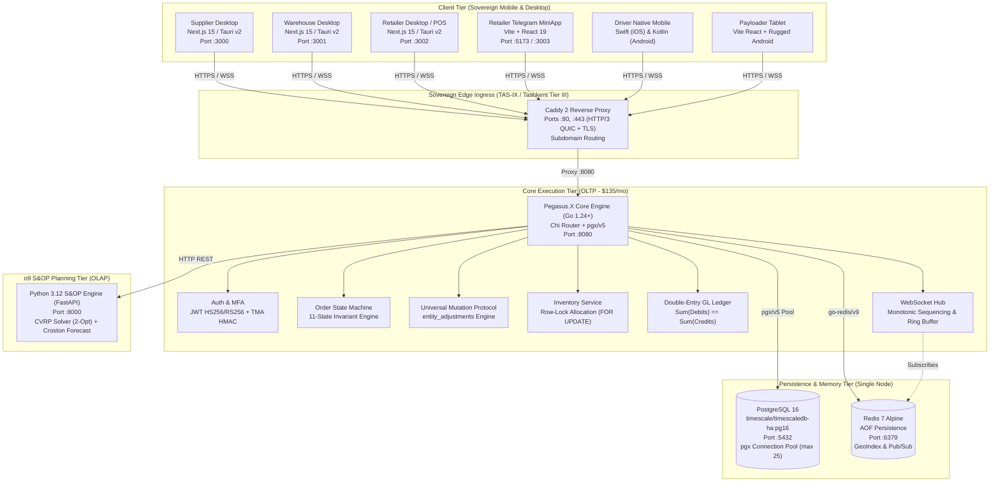
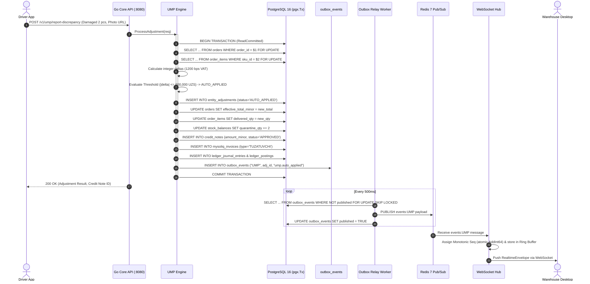

# Deep Architectural Investigation: pegasus.x
## Sovereign Lean Single-Tenant / National Operating Core

**Investigator:** `explorer_pegasusdotx_core`  
**Date:** 2026-09-14  
**Target Repository:** `pegasus.x/`  
**Scope:** Database, Financial Precision, Redis/Caching, Messaging Plane, Go Backend Architecture, Infrastructure/Deployment, Strict Boundary Verification, and Concrete File:Line References.

---

## 1. Executive Summary & Core Architectural Invariants

`pegasus.x` is designed as a sovereign, lean, single-tenant enterprise logistics and S&OP operating system for the Republic of Uzbekistan. In contrast to `pegasusX` (a global, multi-tenant, cloud-native architecture built upon Google Cloud Spanner, Apache Kafka, and global cell clusters), `pegasus.x` operates on a high-velocity, single-host appliance model with a target footprint of **$100–$150/month** deployed inside a Tier III datacenter in Tashkent with direct TAS-IX national peering.

### Non-Negotiable Invariants Observed in Code:
1. **Integer Minor Currency Invariant**: All monetary values and calculations use 64-bit integer minor currency units (Uzbekistan Tiyins: $1\text{ UZS} = 100\text{ tiyins}$). Floating-point currency math is strictly prohibited (`backend/internal/fiscal/calculator.go:9-18`, `database/migrations/001_initial_schema.sql:53`).
2. **Post-Dispatch Immutability & Universal Mutation Protocol (UMP)**: Once an order reaches `IN_TRANSIT`, direct destructive SQL mutations are hard-blocked by state machine guards. All physical discrepancies (damages, shortages, disputes) must flow append-only through `entity_adjustments` (`backend/internal/order/state_machine.go:24-35`, `backend/internal/ump/engine.go:40-150`).
3. **Atomic Stock Allocation**: Inventory reservations execute under strict row-level exclusive locks (`SELECT ... FOR UPDATE`), preventing race conditions and double allocations (`backend/internal/inventory/service.go:77-100`).
4. **Data Sovereignty Compliance**: 100% compliant with Uzbekistan Law No. ZRU-547 (*On Personal Data*), keeping all consumer, merchant, and fiscal data within the physical borders of Uzbekistan (`docs/PRODUCTION_INFRASTRUCTURE_AND_HOSTING_BLUEPRINT.md:8-15`).

---

## 2. Database Architecture

### 2.1 Engine & Connection Pooling
- **Storage Engine**: PostgreSQL 16 (using the `timescale/timescaledb-ha:pg16` Alpine container image in `docker-compose.yml:5` and `docker-compose.prod.yml:26`).
- **Connection Driver**: `github.com/jackc/pgx/v5` via `github.com/jackc/pgx/v5/pgxpool` (`backend/go.mod:11`, `backend/internal/db/postgres.go:8-15`).
- **Pool Sizing**: Tuned for the lean $135/mo VPS tier:
  - Max Connections: `25` (`backend/internal/db/postgres.go:25`)
  - Min Connections: `5` (`backend/internal/db/postgres.go:26`)
  - Max Connection Lifetime: `1 hour` (`backend/internal/db/postgres.go:27`)
  - Max Connection Idle Time: `15 minutes` (`backend/internal/db/postgres.go:28`)
- **Transaction Abstraction**: `(*Pool).RunInTx(ctx, fn)` wraps operations in an explicit `pgx.Tx` with `ReadCommitted` isolation level, automatic panic rollback recovery, and commit verification (`backend/internal/db/postgres.go:46-69`).

### 2.2 Schema Migrations Engine
- **Implementation**: Built-in Go migration runner in `backend/internal/db/migrate.go:25-108`.
- **Tracking Table**: `schema_migrations (version PRIMARY KEY, name, applied_at, execution_time_ms)` (`backend/internal/db/migrate.go:32-38`).
- **Execution**: Migrations run sequentially in ascending filename order inside isolated transactions (`backend/internal/db/migrate.go:88-98`). Auto-migration executes automatically on server boot when `cfg.AutoMigrate == true` (`backend/cmd/server/main.go:49-60`).
- **Migration Inventory**: Exactly **69 SQL migrations** in `database/migrations/` (from `001_initial_schema.sql` to `068_trade_credit_quota_system.sql`).

### 2.3 TimescaleDB & PostGIS: Documented Intent vs. Actual Code Implementation
- **Container Image**: Both `docker-compose.yml:5` and `docker-compose.prod.yml:26` use `timescale/timescaledb-ha:pg16`, which includes pre-installed TimescaleDB and PostGIS extensions.
- **Investigation Finding (Reality Check)**:
  - There are **no `CREATE EXTENSION timescaledb;` or `SELECT create_hypertable(...);` statements** in any of the 69 SQL migrations. Telemetry tables such as `cold_chain_telemetry` (`database/migrations/013_fleet_integrity_coldchain_and_blindspots.sql:39-50`) and `cold_chain_sensors` (`database/migrations/032_cold_chain_telemetry_and_chamber_probes.sql:8-25`) are standard relational PostgreSQL tables with standard B-tree indexes.
  - There are **no PostGIS geometry/geography data types or `ST_` spatial function calls** in the database migrations or Go SQL queries.
  - Instead, spatial coordinates are stored as native `DOUBLE PRECISION` (`latitude`, `longitude` in `orders`, `warehouses`, `retailers`). Geodesic distance calculations and proximity checks are performed via **Haversine spherical trigonometry in Go** (`backend/internal/spatial/hex_dispatch.go:97-118`, `backend/internal/hrm/shift_clock.go:100-115`, `backend/internal/geolocation/service.go:52-54`) or via **Redis Geospatial commands** (`GEOADD drivers:active ...` in `backend/internal/redis/client.go:38-42`).

### 2.4 Core Schema & Table Topology

| Domain | Table Name | Key Columns | Indexes & Constraints | Migration Source |
|---|---|---|---|---|
| **Tenancy** | `suppliers` | `supplier_id`, `name`, `legal_tax_id` (STIR/INN) | `PRIMARY KEY (supplier_id)` | `001_initial_schema.sql:8-13` |
| **Locations** | `warehouses` | `warehouse_id`, `supplier_id`, `latitude`, `longitude` | `REFERENCES suppliers(supplier_id)` | `001_initial_schema.sql:15-23` |
| **Retailers** | `retailers` | `retailer_id`, `supplier_id`, `legal_tax_id`, `phone`, `lat/lon` | `REFERENCES suppliers(supplier_id)` | `001_initial_schema.sql:35-45` |
| **Catalog** | `skus` | `sku_id`, `supplier_id`, `barcode`, `unit_price_minor`, `mxik_code` | `UNIQUE(barcode)`, `mxik_code VARCHAR(17)` | `001_initial_schema.sql:48-58` |
| **Inventory** | `stock_balances` | `warehouse_id`, `sku_id`, `on_hand_qty`, `reserved_qty` | `PRIMARY KEY(warehouse_id, sku_id)`, non-negative check | `001_initial_schema.sql:60-68` |
| **Orders** | `orders` | `order_id`, `status` (`order_status`), `original_total_minor`, `effective_total_minor` | `idx_orders_supplier_status`, `idx_orders_warehouse_status` | `001_initial_schema.sql:80-96` |
| **Order Items** | `order_items` | `order_id`, `sku_id`, `ordered_qty`, `delivered_qty`, `unit_price_minor` | `PRIMARY KEY(order_id, sku_id)`, positive checks | `001_initial_schema.sql:98-108` |
| **Manifests** | `manifests`, `manifest_stops` | `manifest_id`, `warehouse_id`, `driver_id`, `status`, `digital_seal_hash` | `PRIMARY KEY(manifest_id, order_id)` | `001_initial_schema.sql:111-126` |
| **UMP** | `entity_adjustments` | `adjustment_id` (UUID), `entity_id`, `delta_numeric`, `reason_code`, `status` | `idx_adj_lookup`, `idx_adj_entity` | `002_ump_and_outbox.sql:8-25` |
| **Outbox** | `outbox_events` | `event_id`, `aggregate_type`, `aggregate_id`, `event_type`, `payload`, `published` | `idx_outbox_unpublished` (`WHERE NOT published`) | `002_ump_and_outbox.sql:31-40` |
| **Fiscal** | `mysoliq_invoices` | `factura_id`, `order_id`, `invoice_type`, `total_tiyin`, `vat_tiyin` | `idx_mysoliq_order` | `002_ump_and_outbox.sql:73-86` |
| **Ledger** | `ledger_journal_entries`, `ledger_postings` | `entry_id`, `account_code`, `direction` (DEBIT/CREDIT), `amount_minor` | `CHECK(amount_minor > 0)`, `idx_ledger_postings_entry` | `005_split_payments_debts_and_ledger.sql:50-67` |
| **Credit** | `retailer_debts`, `retailer_credit_accounts` | `debt_id`, `principal_minor`, `remaining_minor`, `credit_limit_minor` | `idx_debts_retailer_status`, `idx_debts_overdue` | `005_split_payments_debts_and_ledger.sql:13-39` |
| **Fleet** | `vehicles`, `driver_vehicle_assignments`, `vehicle_inspections` | `vehicle_id`, `license_plate`, `fuel_type`, `shift_date`, `dvir` | `idx_active_driver_assignment`, `idx_active_vehicle_assignment` | `025_fleet_and_driver_lifecycle_management.sql:9-97` |

---

## 3. Financial Precision & Double-Entry General Ledger

### 3.1 64-Bit Integer Minor Currency Invariant
- **Rule**: Floating-point types (`float32`, `float64`) are strictly forbidden for currency balances, pricing, or tax amounts. All monetary storage and computations use **64-bit integer minor currency units (`int64` tiyins)** where $1\text{ UZS} = 100\text{ tiyins}$.
- **Evidence**:
  - `skus.unit_price_minor BIGINT NOT NULL` (`database/migrations/001_initial_schema.sql:53`)
  - `orders.original_total_minor BIGINT NOT NULL` (`database/migrations/001_initial_schema.sql:87`)
  - `orders.effective_total_minor BIGINT NOT NULL` (`database/migrations/001_initial_schema.sql:88`)
  - `credit_notes.amount_minor BIGINT NOT NULL` (`database/migrations/002_ump_and_outbox.sql:63`)
  - `mysoliq_invoices.total_tiyin BIGINT NOT NULL` (`database/migrations/002_ump_and_outbox.sql:80`)
  - `ledger_postings.amount_minor BIGINT NOT NULL CHECK (amount_minor > 0)` (`database/migrations/005_split_payments_debts_and_ledger.sql:64`)
  - `ProcessHandoverRequest.OrderTotalMinor int64` (`backend/internal/payment/handover.go:27`)

### 3.2 Double-Entry General Ledger (GL) Engine
Located in `backend/internal/payment/handover.go:94-255`, every delivery settlement generates balanced double-entry ledger postings:
- **Mathematical Invariant**: $\sum \text{Debits} = \sum \text{Credits}$ enforced at runtime:
  ```go
  // backend/internal/payment/handover.go:228-241
  var sumDebits, sumCredits int64
  for _, p := range postings {
      switch p.Direction {
      case "DEBIT":  sumDebits += p.AmountMinor
      case "CREDIT": sumCredits += p.AmountMinor
      }
  }
  if sumDebits != sumCredits {
      return nil, fmt.Errorf("%w: debits %d != credits %d", ErrUnbalancedJournalEntry, sumDebits, sumCredits)
  }
  ```
- **Account Chart**:
  - `CASH:DRIVER:<driver_id>` (Asset, DEBIT upon cash collected)
  - `PSP:GATEWAY:GLOBAL_PAY` (Asset, DEBIT upon card capture)
  - `ESCROW:ORDER:<order_id>` (Liability, CREDIT to extinguish delivery obligation)
  - `WALLET:RETAILER:<retailer_id>` (Liability, CREDIT on overpayment)
  - `AR:RETAILER:<retailer_id>` (Asset, DEBIT on shortfall/credit order)

### 3.3 Statutory Uzbekistan Fiscal Limits & Rounding
Located in `backend/internal/fiscal/calculator.go:8-60`:
- **Standard VAT Rate**: 12.00% defined as 1,200 basis points (`DefaultVatRateBps = 1200`, `BasisPointDivisor = 10000`).
- **Half-Up Rounding**: Commercial integer half-up rounding offset: `HalfUpOffset = 5000`.
- **Identity Invariant**: `LineGrossMinor == LineNetMinor + LineVatMinor`.
- **Statutory Cash Ceiling**: Uzbekistan Tax Code Article 341 limits cash payments between legal entities to **25,000,000 UZS** ($2,500,000,000\text{ tiyins}$) per transaction. Enforced strictly in `ValidateB2BCashLimit` (`backend/internal/fiscal/calculator.go:17-25`, `backend/internal/payment/handover.go:155-160`).

---

## 4. In-Memory & Caching Plane (Redis 7)

### 4.1 Client & Connection
- **Library**: `github.com/redis/go-redis/v9 v9.22.0` (`backend/go.mod:12`).
- **Connection**: `redis.Connect(ctx, addr, password)` with 3-second ping timeout (`backend/internal/redis/client.go:17-31`).
- **Production Sizing**: Redis 7 Alpine with `--appendonly yes`, `--maxmemory 512mb`, `--maxmemory-policy volatile-lru`, `--tcp-keepalive 60` (`docker-compose.yml:41-53`).

### 4.2 Geospatial Driver Telemetry & Presence Heartbeats
In `backend/internal/redis/client.go:33-54`, telemetry updates are committed via atomic Redis pipelining:
1. **Geospatial Index**:
   ```go
   pipe.GeoAdd(ctx, "drivers:active", &redis.GeoLocation{
       Name: driverID, Longitude: lng, Latitude: lat,
   })
   ```
2. **Presence Heartbeat**:
   ```go
   pipe.Set(ctx, fmt.Sprintf("driver:presence:%s", driverID), "ONLINE", presenceTTL)
   ```

### 4.3 Multi-Layer Caching Use Cases
1. **Geolocation Cache**: In `backend/internal/geolocation/service.go:22-26, 66-88`, external OpenStreetMap/Nominatim and Google Places responses are cached with tiered TTLs:
   - Autocomplete: `24 hours` (`ttlAutocomplete`)
   - Forward Geocoding: `7 days` (`ttlForward`)
   - Reverse Geocoding: `7 days` (`ttlReverse`)
2. **WMS Staff Real-Time Tracking**: In `backend/internal/wmsops/service.go:359-360`, staff coordinates within warehouse zones are stored via `HSet(ctx, "staff:locations", staffID, payload)` with 24-hour expiration.
3. **Dispatch Route Cache**: In `backend/internal/wmsops/service.go:558`, pre-computed CVRP dispatch solutions are cached under `run.CachedKey` with 2-hour TTL.

---

## 5. Messaging Plane & Event Distribution

```
┌────────────────────────────────────────────────────────────────────────┐
│               PostgreSQL 16 Transaction (pgx.Tx)                       │
│                                                                        │
│   1. Mutate Domain Rows (orders, stock_balances, entity_adjustments)   │
│   2. Atomically outbox.Emit(tx, "ORDER", orderID, "order.confirmed")   │
│   3. Commit Transaction                                                │
└───────────────────────────────────┬────────────────────────────────────┘
                                    │ outbox_events table
                                    ▼
┌────────────────────────────────────────────────────────────────────────┐
│                   Outbox Relay Worker (Goroutine)                      │
│                                                                        │
│   • Polls every 500ms: SELECT ... FOR UPDATE SKIP LOCKED LIMIT 50      │
│   • Publishes event to Redis Pub/Sub: channel "events:ORDER"           │
│   • Updates outbox_events: published = true, published_at = NOW()      │
│   • Dead letter routing to outbox_dead_letters on persistent error     │
└───────────────────────────────────┬────────────────────────────────────┘
                                    │ Redis Pub/Sub
                                    ▼
┌────────────────────────────────────────────────────────────────────────┐
│                      WebSocket Hub (ws.Hub)                            │
│                                                                        │
│   • Subscribes to: events:ORDER, events:UMP, telemetry:drivers, etc.   │
│   • Monotonic Sequence Assignment: atomic.AddInt64(&h.seq, 1)          │
│   • 2000-Event In-Memory Ring Buffer for gap detection & reconnect     │
│   • Broadcasts RealtimeEnvelope to active client WebSockets            │
└────────────────────────────────────────────────────────────────────────┘
```

### 5.1 Transactional Outbox Pattern
- **Table**: `outbox_events` (`database/migrations/002_ump_and_outbox.sql:31-40`).
- **Atomic Emission**: `outbox.Emit(ctx, tx, aggregateType, aggregateID, eventType, payload)` executes inside the active transaction (`backend/internal/outbox/emitter.go:11-28`).
- **Relay Worker**: `outbox.RelayWorker` polls unread events using PostgreSQL's concurrency-safe query (`backend/internal/outbox/relay.go:66-75`):
  ```sql
  SELECT event_id, aggregate_type, aggregate_id, event_type, payload
  FROM outbox_events
  WHERE NOT published
  ORDER BY created_at ASC
  LIMIT $1
  FOR UPDATE SKIP LOCKED;
  ```
- **Dead-Letter Handling**: If event publication fails, the worker logs the failed attempt into `outbox_dead_letters` (`backend/internal/outbox/relay.go:133-140`).

### 5.2 Redis Pub/Sub Channels
The relay publishes events to Redis Pub/Sub channel `fmt.Sprintf("events:%s", it.aggregateType)` (`backend/internal/outbox/relay.go:130`).
Key channels listened to by the WebSocket Hub (`backend/internal/ws/hub.go:167`):
- `telemetry:drivers`
- `events:ORDER`
- `events:UMP`
- `events:FLEET`
- `events:CLAIMS`
- `events:PICKWAVE`
- `events:MANIFEST`
- `events:EPOD`
- `events:WAREHOUSE`
- `events:notifications`
- `alerts:fleet:breakdown_rescue`

### 5.3 WebSocket Hub with Monotonic Sequencing & Gap Detection
Located in `backend/internal/ws/hub.go:31-160`:
- **Envelope**: `RealtimeEnvelope` wraps every event with `Seq int64`, `EventType string`, `Payload`, and `Timestamp` (`backend/internal/ws/hub.go:32-37`).
- **Monotonic Sequence**: Emitted via `atomic.AddInt64(&h.seq, 1)` (`backend/internal/ws/hub.go:111`).
- **Ring Buffer**: Retains the last 2,000 events (`maxHistory = 2000`) in memory (`backend/internal/ws/hub.go:61-63, 119-124`).
- **Catch-Up & Resync API**: `GetEventsSince(since int64)` allows clients (mobile apps recovering from subterranean cell dropouts) to fetch missed events. If `since` is older than the retained window, `fullResync: true` signals the client to invalidate its cache and perform a full HTTP hydration (`backend/internal/ws/hub.go:135-160`).

---

## 6. Go Backend Architecture

### 6.1 Monorepo & Packaging Structure
The Go backend (`backend/`) contains 82 cohesive domain packages under `backend/internal/`:
- `backend/cmd/server/main.go`: Server boot, dependency injection, and worker lifecycle.
- `backend/cmd/smokecheck/main.go`: Cross-role end-to-end ecosystem validation suite (6,500+ lines).
- `backend/internal/api/`: Chi router (`router.go`, 1,847 lines), HTTP request handlers, and integration tests.
- `backend/internal/auth/`: JWT token signing, RS256/HS256 dual verification, MFA TOTP, Telegram initData HMAC validation.
- `backend/internal/db/`: Connection pool (`postgres.go`), auto-migration runner (`migrate.go`).
- `backend/internal/order/`: Order service and state machine (`state_machine.go`).
- `backend/internal/inventory/`: Stock reservation, allocation, packaging hierarchy.
- `backend/internal/ump/`: Universal Mutation Protocol engine (`engine.go`).
- `backend/internal/fleet/`: Fleet assets, driver-vehicle dynamic pairing, DVIR inspections, fuel theft detection.
- `backend/internal/fiscal/`: VAT basis point calculations, B2B cash limits.
- `backend/internal/payment/`: Storefront handover, double-entry GL postings, GlobalPay webhook processing.
- `backend/internal/outbox/`: Transactional outbox emitter and background relay worker.
- `backend/internal/ws/`: WebSocket connection hub and event fanout.

### 6.2 Router & Middleware Pipeline
Built with Go Chi v5 (`backend/internal/api/router.go:294-312`):
1. `middleware.RequestID`: Unique trace ID per request.
2. `middleware.RealIP`: Client IP extraction behind reverse proxies.
3. `middleware.Logger`: Structured HTTP request logging.
4. `middleware.Recoverer`: Panic recovery.
5. `s.metricsReg.HTTPMiddleware`: Prometheus metrics collection.
6. `s.tracer.HTTPTracingMiddleware`: OpenTelemetry trace context propagation.
7. `cors.Handler`: Standardized CORS configuration.
8. `auth.RequireAuthWithKeyManager`: JWT extraction and validation.
9. `auth.RequireRole`: Fine-grained role-based access control (`SUPPLIER`, `WAREHOUSE`, `DRIVER`, `RETAILER`, `PAYLOADER`).

### 6.3 Authentication & Security
- **Dual JWT Verification**: Supports symmetric HS256 (shared secret) and asymmetric RS256 with key rotation and a public JWKS endpoint (`/.well-known/jwks.json`) (`backend/internal/auth/asymmetric.go:1-120`, `backend/internal/api/router.go:361`).
- **Telegram WebApp Authentication**: `backend/internal/auth/telegram.go:41-80` implements official cryptographic HMAC-SHA256 verification of `initData` from the Telegram MiniApp:
  ```go
  secret_key = HMAC_SHA256("WebAppData", botToken)
  calculated_hash = HMAC_SHA256(secret_key, data_check_string)
  ```

---

## 7. Python S&OP Planning Engine (`planning/`)

Located in `planning/`, the S&OP planning service runs independently on port 8000 (Python 3.12 + FastAPI + NumPy/SciPy):
- **FastAPI Endpoints** (`planning/main.py:1-180`):
  - `POST /v1/planning/cvrp`: Solves Capacitated Vehicle Routing Problem.
  - `POST /v1/planning/forecast`: Intermittent demand forecasting via Croston / Syntetos-Boylan Approximation (SBA).
  - `POST /v1/planning/meio`: Multi-Echelon Inventory Optimization (Safety Stock & Reorder Points).
- **CVRP Solver** (`planning/engine/cvrp.py:29-190`):
  - Solves vehicle capacity allocation with a **Tetris packing buffer** (default 0.95 volume threshold).
  - Multi-wave trip generation when total demand exceeds available fleet volume.
  - Refines stop sequence using **2-Opt local search refinement** on Haversine distance matrix.
  - Computes a deterministic SHA-256 fingerprint (`compute_plan_fingerprint`) to detect plan drift.

---

## 8. Infrastructure & Sovereign Deployment Model

### 8.1 Deployment Topology & Cloud Economics
Documented in `docs/PRODUCTION_INFRASTRUCTURE_AND_HOSTING_BLUEPRINT.md:65-85` and defined in `docker-compose.prod.yml`:
- **Datacenter**: **Servercore Uzbekistan Tier III Datacenter (Tashkent)**.
- **Network**: Direct peering into **TAS-IX** (domestic exchange), delivering $<5\text{ms}$ latency across Uzbekistan telcos (Ucell, Beeline UZ, Mobiuz, Uztelecom).
- **Cost Footprint**: **$139.70 / month** (within the $100–$150/mo target):
  - 8 vCPU (AMD EPYC 9004) — ~$68.20/mo
  - 16 GB ECC DDR5 RAM — ~$50.50/mo
  - 200 GB NVMe SSD (RAID-10) — ~$16.00/mo
  - 1 Gbps Port (TAS-IX traffic included) — ~$5.00/mo
- **Edge Reverse Proxy**: Caddy 2 with automatic Let's Encrypt / ZeroSSL TLS and HTTP/3 QUIC support (`docker/Caddyfile`, `docker-compose.prod.yml:2-24`).

---

## 9. Strict Architectural Boundaries & Cross-Contamination Audit

### 9.1 Verification of Spanner Absence
- **Finding**: There is **ZERO usage of Google Cloud Spanner libraries** (`cloud.google.com/go/spanner`) in `pegasus.x/backend`.
- A single cosmetic reference exists in `backend/cmd/smokecheck/main.go:2797` (`tracer22.Start(traceCtx, "SQL spanner.ExecuteBatchPayouts")`), which is an OpenTelemetry span name string copied from pegasusX smokechecks. The database engine in `pegasus.x` is 100% PostgreSQL 16.

### 9.2 CRITICAL AUDIT FINDING: Kafka Contamination & Build Failure
- **The Violation**: Commit `2a35e69` ("feat(core,wms,infra): seal production data plane, kubernetes manifests, terraform multi-cell, and live docker staging") attempted to introduce multi-cell Kubernetes overlays, Terraform modules with Spanner/Managed Kafka, and an Apache Kafka producer into `pegasus.x`.
- **The Incomplete Cleanup**: Subsequently, someone deleted `backend/internal/kafka/producer.go` and `backend/internal/kafka/producer_test.go` from the working directory (as visible in `git status`).
- **The Resulting Defect**:
  - `backend/cmd/server/main.go:20` still contains: `import "github.com/pegasus-x/core/internal/kafka"`
  - `backend/internal/outbox/relay.go:13` still contains: `import "github.com/pegasus-x/core/internal/kafka"`
  - As a result, running `go build ./...` inside `pegasus.x/backend` fails immediately with:
    ```
    internal/outbox/relay.go:13:2: no required module provides package github.com/pegasus-x/core/internal/kafka
    ```
- **Architectural Assessment**: In accordance with the project rule (**"Zero Cross-Contamination: NEVER import Spanner libraries, Spanner DDL, or Kafka into pegasus.x"**), `pegasus.x` messaging is designed to operate solely on **PostgreSQL Transactional Outbox + Redis Streams/Pub-Sub + WebSocket Hub**. The dangling references to `internal/kafka` in `main.go` and `relay.go` represent unauthorized cross-contamination that must be removed so that `pegasus.x` adheres to its lean single-tenant architecture.

---

## 10. Architectural Mermaid Diagrams

### 10.1 High-Level System Architecture & Ports



### 10.2 Universal Mutation Protocol (UMP) & Double-Entry Ledger Mutation Flow



---

## 11. Concrete File:Line Reference Matrix

| Architectural Area | Concrete File Path | Line Number(s) | Description / Invariant |
|---|---|---|---|
| **Database Pool** | `backend/internal/db/postgres.go` | `24-29` | Pgxpool 25 max connections, 5 min connections, 1h max lifetime |
| **Transaction Exec** | `backend/internal/db/postgres.go` | `46-69` | `RunInTx` with `ReadCommitted` and automatic rollback recovery |
| **Schema Migrator** | `backend/internal/db/migrate.go` | `25-108` | Sequential runner tracking in `schema_migrations` table |
| **Initial Schema** | `database/migrations/001_initial_schema.sql` | `8-133` | Initial relational schema (suppliers, skus, orders, manifests) |
| **UMP & Outbox Schema**| `database/migrations/002_ump_and_outbox.sql` | `8-88` | `entity_adjustments`, `outbox_events`, `credit_notes`, `mysoliq_invoices` |
| **WMS Schema** | `database/migrations/003_wms_locations_lots_waves.sql` | `8-90` | Warehouse locations, FEFO lots, pick waves and pick tasks |
| **Fleet Schema** | `database/migrations/025_fleet_and_driver_lifecycle_management.sql` | `9-100` | Fleet `vehicles`, `driver_vehicle_assignments`, `vehicle_inspections` |
| **Minor Unit Invariant**| `database/migrations/001_initial_schema.sql` | `53, 87-88` | `unit_price_minor BIGINT`, `original_total_minor BIGINT` |
| **Ledger Invariant** | `backend/internal/payment/handover.go` | `228-241` | Double-entry invariant: `sumDebits == sumCredits` |
| **Fiscal Tax Math** | `backend/internal/fiscal/calculator.go` | `9-18, 57-70`| 1200 bps VAT, banker's 5000 offset, integer tax calculation |
| **B2B Cash Ceiling** | `backend/internal/fiscal/calculator.go` | `17, 24` | 25M UZS (2.5B tiyins) statutory cash limit enforcement |
| **Redis Telemetry** | `backend/internal/redis/client.go` | `33-54` | `GeoAdd drivers:active` + `driver:presence:<id>` pipeline |
| **Outbox Emission** | `backend/internal/outbox/emitter.go` | `11-28` | Atomic `INSERT INTO outbox_events` inside `pgx.Tx` |
| **Outbox Relay** | `backend/internal/outbox/relay.go` | `65-154` | Polling via `FOR UPDATE SKIP LOCKED` and Redis Pub/Sub broadcast |
| **WebSocket Hub** | `backend/internal/ws/hub.go` | `31-52, 109-131`| `RealtimeEnvelope` monotonic seq + 2000-event ring buffer |
| **WS Reconnect Resync**| `backend/internal/ws/hub.go` | `135-160` | `GetEventsSince` returning gap detection and `fullResync` flag |
| **Order State Machine**| `backend/internal/order/state_machine.go`| `24-35, 38-110`| 11-state transition matrix and post-dispatch immutability rule |
| **Stock Lock Engine** | `backend/internal/inventory/service.go` | `77-100` | Exclusive `SELECT ... FOR UPDATE` row lock on `stock_balances` |
| **UMP Engine** | `backend/internal/ump/engine.go` | `40-155` | Threshold calculation (600,000 UZS) and auto-credit note creation |
| **Fleet Service** | `backend/internal/fleet/service.go` | `36-120` | Available driver-vehicle units, shift pairing, swap, DVIR |
| **Telegram TMA Auth** | `backend/internal/auth/telegram.go` | `41-80` | Cryptographic HMAC-SHA256 initData validation |
| **JWT Key Management**| `backend/internal/auth/asymmetric.go` | `1-90` | RS256/HS256 dual verification and public JWKS endpoint |
| **Main Server Boot** | `backend/cmd/server/main.go` | `31-135` | Service orchestration, background workers, and graceful shutdown |
| **CVRP Solver** | `planning/engine/cvrp.py` | `29-150` | Multi-wave trip generation and 2-Opt local search refinement |
| **Production Topology**| `docker-compose.prod.yml` | `1-120` | Caddy 2 + PostgreSQL 16 + Redis 7 + Go Backend + Python Planning |
| **Hosting Blueprint** | `docs/PRODUCTION_INFRASTRUCTURE_AND_HOSTING_BLUEPRINT.md` | `65-85` | Servercore Tashkent Tier III, TAS-IX peering, $139.70/mo breakdown |
| **Kafka Drift Defect** | `backend/cmd/server/main.go` / `relay.go` | `main.go:20`, `relay.go:13` | Dangling Kafka imports breaking `go build ./...` |
