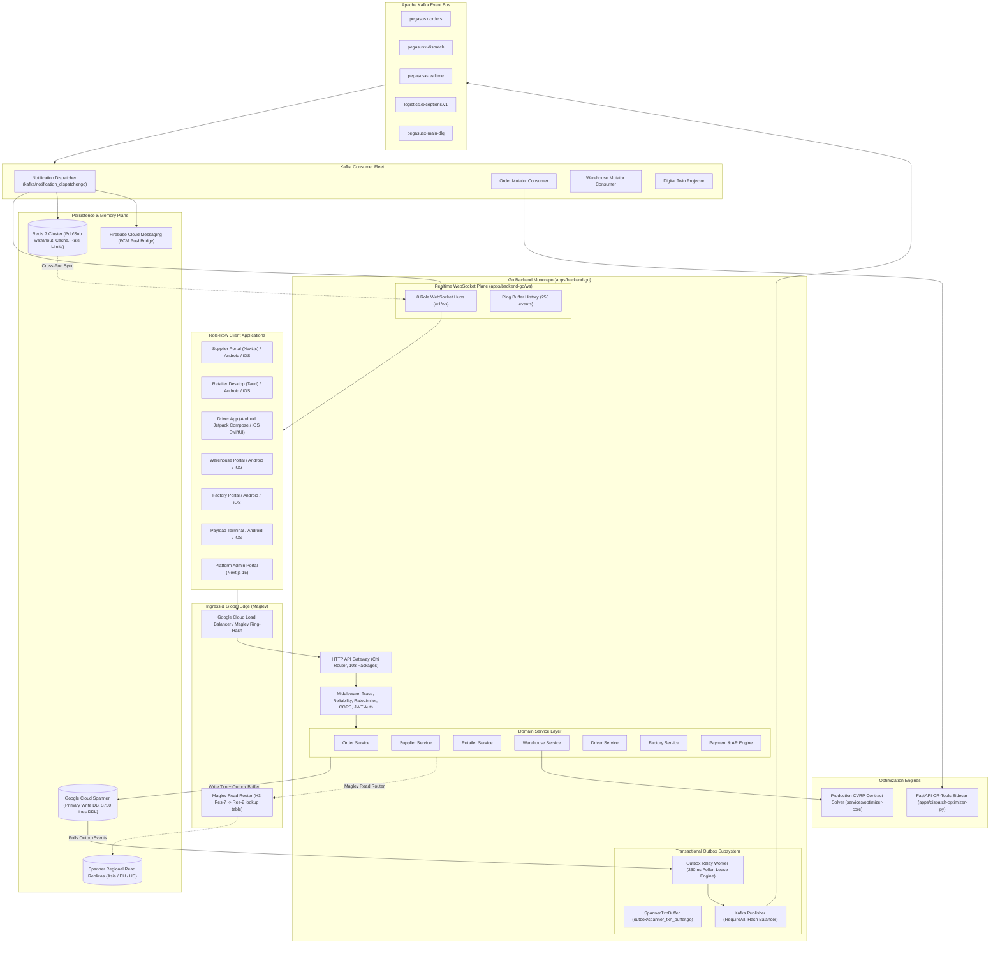
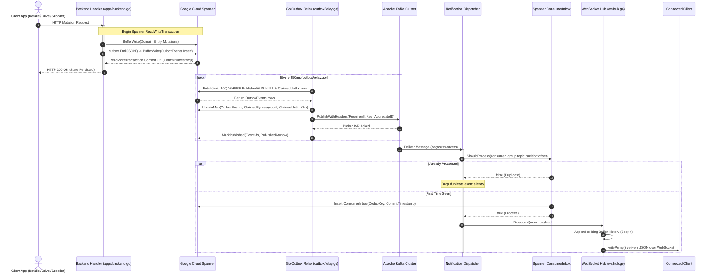

# Deep Architectural Investigation: pegasusX (Global Enterprise Multi-Tenant Cloud Architecture)

**Author:** `explorer_pegasusx_core`  
**Date:** 2026-09-14  
**Workspace:** `/Users/shakhzod/Desktop/V.O.I.D/pegasusX`  
**Focus:** Cloud Spanner DDL, Kafka/Outbox Event Plane, Go Backend Architecture, Multi-Country Global Cells & Maglev Hashing, Google OR-Tools CVRP, Realtime WebSocket Fanout.

---

## 1. Executive Summary

`pegasusX` is a global enterprise, multi-tenant B2B logistics and commerce operating platform engineered for multi-country scale, strict ACID data integrity, and high-frequency real-time event streaming. It anchors its persistence in **Google Cloud Spanner** with a distributed multi-tenant schema spanning **3,749 lines of DDL**, utilizes a **Transactional Outbox Engine** backed by **Apache Kafka** with strict at-least-once delivery and consumer-side deduplication, and organizes backend execution in Go into **108 modular packages** orchestrated by a decomposed bootstrap pipeline.

Global distribution is structured as a **Multi-Country Cell Architecture** (`cell-uz`, `cell-eu`, `cell-us`, `cell-kz`), where database read routing leverages a zero-allocation **Maglev-derived consistent hashing** lookup table mapping Uber H3 spatial indexes to regional read replicas. Vehicle and dispatch route optimization is driven by **Google OR-Tools CVRP (Capacitated Vehicle Routing Problem)** sidecars with time windows, capacity constraints, and Guided Local Search. Realtime delivery to mobile and desktop clients is handled by **8 role-scoped WebSocket Hubs** mounted at `/v1/ws`, synchronized across pods via Redis Pub/Sub and featuring ring-buffered reconnect replay.

---

## 2. Google Cloud Spanner Schema Architecture

### 2.1 Authoritative DDL Overview
The authoritative schema resides at `pegasusX/apps/backend-go/schema/spanner.ddl` (3,749 lines, defining 220+ tables). In Cloud Spanner, tables are horizontally partitioned across distributed servers called "splits". Schema design dictates physical co-location and transaction locality.

### 2.2 Distributed Multi-Tenant Keys (`SupplierId STRING(36)`)
Across all supplier-owned domain tables, `SupplierId STRING(36)` serves as the primary multi-tenant partition key:
- `Suppliers` (`pegasusX/apps/backend-go/schema/spanner.ddl:11-22`): Root entity defined with `PRIMARY KEY (SupplierId)`.
- `SupplierProfiles` (`spanner.ddl:37-69`): `PRIMARY KEY (SupplierId)`.
- `SupplierPricingRules` (`spanner.ddl:84-93`): `PRIMARY KEY (SupplierId)`.
- `Orders` (`spanner.ddl:169-208`): Carries `SupplierId STRING(36) NOT NULL` as a mandatory column with index `Idx_Orders_BySupplierCreated ON Orders(SupplierId, CreatedAt DESC)` (`spanner.ddl:212`).
- `Products` (`spanner.ddl:758-790`): Anchored with `SupplierId STRING(36) NOT NULL`.
- `InventoryLevels` (`spanner.ddl:793-803`): `SupplierId STRING(36) NOT NULL`.
- `SupplierTruckManifests` (`spanner.ddl:901-930`): Primary key includes `SupplierId`.
- `OutboxEvents` (`spanner.ddl:685-697`): Carries `SupplierId STRING(64) NOT NULL` with null-filtered index `Idx_OutboxEvents_Unpublished_BySupplier` (`spanner.ddl:700-701`).

This design guarantees tenant isolation at the query planner level and enables cell-based sharding where tenant queries are constrained to localized splits.

### 2.3 Interleaved Child Tables (`INTERLEAVE IN PARENT ... ON DELETE CASCADE`)
Spanner's `INTERLEAVE IN PARENT` physically stores child rows adjacent to their parent row on the same split, guaranteeing single-split ACID transactions without cross-node two-phase commit latency. Key interleaved hierarchies in `pegasusX`:

| Parent Table | Interleaved Child Table | Primary Key Structure | File & Line Reference |
| :--- | :--- | :--- | :--- |
| `Orders` | `OrderShopClosedLog` | `(OrderId, EventId)` | `spanner.ddl:1710-1718` |
| `Orders` | `OrderLineFiscalSnapshots` | `(OrderId, OrderLineId)` | `spanner.ddl:1743-1754` |
| `Orders` | `OrderPaymentLegs` | `(OrderId, LegId)` | `spanner.ddl:1807-1818` |
| `Orders` | `OrderLineAllocations` | `(OrderId, OrderLineId, WarehouseId)` | `spanner.ddl:2039-2051` |
| `Claims` | `ClaimEvidences` | `(ClaimId, EvidenceId)` | `spanner.ddl:318-329` |
| `WarehouseSupplyRequests` | `WarehouseSupplyRequestItems` | `(RequestId, ItemId)` | `spanner.ddl:540-552` |
| `SupplierTruckManifests` | `ManifestReplanLog` | `(ManifestId, ReplanId)` | `spanner.ddl:931-940` |
| `SupplierTruckManifests` | `ManifestOrders` | `(ManifestId, OrderId)` | `spanner.ddl:959-969` |
| `Regions` | `SubRegions` | `(RegionId, SubRegionId)` | `spanner.ddl:1150-1154` |
| `PickWaves` | `PickWaveItems` | `(WaveId, ItemId)` | `spanner.ddl:1300-1309` |
| `SupplierImportSessions` | `SupplierImportRows` | `(SessionId, RowId)` | `spanner.ddl:1395-1405` |
| `CreditNotes` | `CreditNoteItems` | `(NoteId, ItemId)` | `spanner.ddl:1860-1869` |
| `PriceLists` | `PriceListItems` | `(PriceListId, ItemId)` | `spanner.ddl:1960-1970` |
| `RouteTwins` | `RouteTwinWaypoints` | `(RouteId, WaypointId)` | `spanner.ddl:3030-3037` |
| `RouteTwins` | `RouteTwinEvents` | `(RouteId, EventId)` | `spanner.ddl:3038-3045` |
| `LotRecallCampaigns` | `LotRecallAffectedOrders` | `(CampaignId, OrderId)` | `spanner.ddl:3460-3468` |
| `EvidenceDossiers` | `EvidenceDossierAttachments` | `(DossierId, AttachmentId)` | `spanner.ddl:3600-3610` |

### 2.4 Index Strategy
`spanner.ddl` deploys specialized Spanner index patterns:
1. **Descending Commit Timestamps:** `Idx_SupplierProfiles_ByUpdatedAt ON SupplierProfiles(UpdatedAt DESC)` (`spanner.ddl:71`) and `Idx_Orders_BySupplierCreated ON Orders(SupplierId, CreatedAt DESC)` (`spanner.ddl:212`) allow sub-millisecond reverse-chronological pagination.
2. **NULL_FILTERED Indexes:** Reduces index size by indexing only non-null rows:
   - `UQ_PaymentConfigs_ByWarehouse ON PaymentConfigs(WarehouseId)` (`spanner.ddl:82`)
   - `Idx_OutboxEvents_Unpublished_BySupplier ON OutboxEvents(SupplierId, PublishedAt, CreatedAt)` (`spanner.ddl:700-701`)
   - `Idx_PaymentLedgerEntries_GatewayTypeRef ON PaymentLedgerEntries(Gateway, EntryType, ReferenceId)` (`spanner.ddl:682-683`)
   - `Idx_DemandSignals_BySupplierCreated ON DemandSignals(SupplierId, CreatedAt DESC)` (`spanner.ddl:1789-1790`)
3. **Database-Enforced Financial Idempotency:**
   - `Idx_OrderPaymentLegs_IdempotencyKey ON OrderPaymentLegs(IdempotencyKey)` (`spanner.ddl:1821-1822`) enforces absolute uniqueness across all payment legs at the database engine level.

### 2.5 ReadWriteTransaction & Atomic Outbox Pairing
In `pegasusX`, database mutations and their corresponding event notifications are committed atomically in the same Spanner transaction. This pattern is implemented in `apps/backend-go/outbox/spanner_txn_buffer.go:14-40`:
```go
type SpannerTxnBuffer struct {
    txn    *spanner.ReadWriteTransaction
    events []Event
}
```
When a domain service mutates state:
1. Domain row mutations (`spanner.Insert`, `spanner.UpdateMap`) are buffered onto `txn`.
2. `outbox.EmitJSON(ctx, buf, aggregateType, aggregateID, topic, payload)` (`apps/backend-go/outbox/outbox.go:116`) marshals the payload, injects trace IDs, and buffers an `OutboxEvents` row into `SpannerTxnBuffer`.
3. Before exiting the transaction closure, `buf.Flush(ctx)` buffers all `OutboxEvents` insert mutations onto the same transaction.
4. Spanner commits both the domain entity state change and the outbox event in a single atomic commit timestamp (`spanner.CommitTimestamp`).

---

## 3. Messaging & Event Plane

```
[ Domain Mutation ]
       │
       ▼ (Atomic Spanner RW Txn)
┌────────────────────────────────────────┐
│ Spanner: Domain Row + OutboxEvents Row │
└────────────────────────────────────────┘
       │
       ▼ (Polls every 250ms, Lease Claims ClaimedBy/Until)
┌────────────────────────────────────────┐
│ Go Outbox Relay (outbox/relay.go)       │
└────────────────────────────────────────┘
       │
       ▼ (RequiredAcks: all, Hash on AggregateID)
┌────────────────────────────────────────┐
│ Apache Kafka Cluster                   │
│ - pegasusx-orders                      │
│ - pegasusx-dispatch                    │
│ - pegasusx-realtime                    │
│ - logistics.exceptions.v1              │
│ - logistics.telemetry.v1               │
│ - pegasusx-main                        │
└────────────────────────────────────────┘
       │
       ├──────────────────────────────────────┐
       ▼                                      ▼
┌──────────────────────────────┐     ┌──────────────────────────────────┐
│ Domain Consumers (Order,      │     │ Notification Dispatcher          │
│ Warehouse, Returns, Twin,     │     │ (kafka/notification_dispatcher) │
│ Billing, Claims)             │     └──────────────────────────────────┘
│ With SpannerEventDedup       │                      │
│ (ConsumerInbox idempotency)  │                      ▼
└──────────────────────────────┘     ┌──────────────────────────────────┐
       │                             │ 8 WebSocket Role Hubs            │
       ▼ (Failures > 20)             │ + Push Notifications (FCM)       │
┌──────────────────────────────┐     └──────────────────────────────────┘
│ OutboxDeadLetters / DLQ      │
└──────────────────────────────┘
```

### 3.1 Apache Kafka Event Bus & Topic Taxonomy
Topic definitions and routing are centralized in `apps/backend-go/events/topic_routing.go:9-148`:
- `TopicOrders`: `"pegasusx-orders"` (Order lifecycle, pre-orders, shop-closed logs, settlements, fiscal receipts).
- `TopicDispatch`: `"pegasusx-dispatch"` (Warehouse dispatch locks, truck manifests, freeze locks, driver/vehicle availability).
- `TopicRealtime`: `"pegasusx-realtime"` (Driver GPS locations, ETA updates, dock proximity, commands).
- `TopicExceptions`: `"logistics.exceptions.v1"` (Logistics claims, damaged cargo OS&D, return shipments).
- `TopicTelemetryLogistics`: `"logistics.telemetry.v1"` (Cold-chain temperature, door seal sensor telemetry).
- `TopicMain`: `"pegasusx-main"` (Default fallback and dual-write ingestion topic).

The architecture supports dual-writing and domain topic migration via feature flags `KAFKA_TOPIC_DUAL_WRITE` (`events/topic_routing.go:28`) and `KAFKA_TOPIC_CONSUME_DOMAIN` (`events/topic_routing.go:35`).

### 3.2 Spanner Outbox Table & Lease Engine
The outbox table is defined in `spanner.ddl:685-697`:
- Columns: `EventId STRING(36)`, `AggregateType STRING(64)`, `AggregateId STRING(64)`, `TopicName STRING(128)`, `Payload BYTES(MAX)`, `CreatedAt TIMESTAMP`, `PublishedAt TIMESTAMP`, `ClaimedBy STRING(64)`, `ClaimedUntil TIMESTAMP`, `PublishAttempts INT64`, `SupplierId STRING(64)`.
- Index: `Idx_OutboxEvents_Unpublished ON OutboxEvents(PublishedAt, CreatedAt)` (`spanner.ddl:699`).

The outbox lease engine in `apps/backend-go/outbox/spanner_store.go:88-195` implements distributed coordination across multi-replica backend pods:
1. `Fetch(ctx, limit)`: Runs inside a Spanner `ReadWriteTransaction`.
2. Queries unpublished events where `PublishedAt IS NULL AND (ClaimedUntil IS NULL OR ClaimedUntil < @now)`.
3. Claims rows by updating `ClaimedBy = "relay-" + uuid` and `ClaimedUntil = now + 2m`.
4. Executes `FairInterleave(candidates, limit)` (`apps/backend-go/outbox/fair.go:1-50`) to round-robin event processing across active `SupplierId`s, preventing high-volume suppliers from starving others.

### 3.3 Go Outbox Worker (`apps/backend-go/outbox/relay.go`)
The `Relay` background daemon runs on a 250ms tick interval (`RelayConfig.TickInterval = 250ms`, `relay.go:35-65`):
- `drainOnce(ctx)` (`relay.go:144-220`): Fetches claimed batches, publishes each event via `KafkaPublisher`, and marks succeeded events via `MarkPublished(markCtx, published, now)` (`spanner_store.go:218-249`).
- `watchdogOnce(ctx)` (`relay.go:107-142`): Runs every 30s. Flags stuck events exceeding `StuckThreshold = 60s`.
- Poison Event Handling (`spanner_store.go:255-340`): If publish attempts exceed `MaxTotalAttempts = 20`, `RecordPublishFailures` moves the event atomically into `OutboxDeadLetters` (`spanner.ddl:704-715`) with `LastError` and deletes it from `OutboxEvents`.

### 3.4 Reliability & Delivery Guarantees
- **Publisher Acks:** `apps/backend-go/outbox/kafka_publisher.go:83-89` sets `RequiredAcks = kafka.RequireAll`, `Async = false`, and `Balancer = &kafka.Hash{}`. Partition keys are hashed on the aggregate root ID, preserving strict per-entity FIFO order.
- **Consumer Deduplication:** At-least-once transport is made effectively exactly-once at the consumer layer. `apps/backend-go/kafka/spanner_event_dedup.go:22-54` implements `SpannerEventDedup`, querying and inserting keys into the Spanner `ConsumerInbox` table (`DedupKey STRING(256), ProcessedAt TIMESTAMP`) inside a `ReadWriteTransaction`. If an offset or `event_id` was previously processed, `ShouldProcess` returns `false` and skips execution.
- **DLQ Handler:** `apps/backend-go/kafka/dlq_spanner.go:163-200` inspects failed messages routed to DLQ topics and mutates Spanner state, marking `OptimizationJobs` or `SupplierImportSessions` as `FAILED` and logging into `OutboxDeadLetters`.

---

## 4. Backend Service Architecture (`apps/backend-go/`)

### 4.1 Modularity & Domain Boundaries
The Go backend monorepo contains **108 packages**. Each domain is strictly separated into core logic and HTTP transport:

| Domain | Core Package | Route Adapter Package | Key Responsibilities |
| :--- | :--- | :--- | :--- |
| **Order** | `order` | `orderroutes` | Order state machine, line item allocations, pre-orders, parent order sagas. |
| **Supplier** | `supplier` | `supplierroutes` | Supplier profile, onboarding, catalog sync, bank configs. |
| **Retailer** | `retailer` | `retailerroutes` | Retailer store registration, POS sync, delivery slots, staff actors. |
| **Warehouse** | `warehouse`, `warehouseops` | `warehouseroutes` | Bin locations, pick waves, inventory reservations, auto-dispatch. |
| **Driver** | `driver` | `driverroutes` | Driver shifts, vehicle pairing, manifests, proof of delivery (POD). |
| **Factory** | `factory` | `factoryroutes` | Production schedules, loading bays, bulk transfers. |
| **Payload** | `payload` | `payloaderoutes` | Dock pallet scanning, physical ship units, digital seals. |
| **Dispatch** | `dispatch`, `routing`, `manifest` | `infraroutes` | OSRM/Google Maps geometry, truck manifest manifests, replanning. |
| **Finance** | `ar`, `credit`, `creditnote`, `payment`, `payout` | `creditroutes`, `paymentroutes` | Double-entry payment ledger, escrow holds, chargebacks, dunning. |
| **Tax & Compliance**| `tax`, `soliq`, `compliance` | `taxroutes` | Uzbekistan Soliq EHF integration, VAT calculations, fiscal snapshots. |
| **Digital Twin** | `twin` | `controltowerroutes` | Real-time vehicle telemetry projection, ETA drift calculation. |

### 4.2 Decomposed Bootstrap Pipeline
`apps/backend-go/bootstrap/` separates initialization into clean lifecycle stages:
- `infra.go` (`bootstrap/infra.go:24-222`): Initializes GCS buckets, Redis cache with fail-closed circuit breaker (`setupRedisCache`), idempotency stores (`setupIdempotency`), Spanner outbox store and routing clients (`setupSpannerAndRouting`), Kafka publisher (`setupKafkaPublisher`), and Firebase PushBridge (`setupPushBridge`).
- `services.go` (`bootstrap/services.go:1-164`): Constructs domain services and cross-domain adapters (e.g. `inventoryAdapter`, `notificationReaderAdapter`).
- `workers.go` (`bootstrap/workers.go:42-256`): Instantiates 8 Kafka consumer groups (`notificationConsumer`, `orderEventConsumer`, `warehouseEventConsumer`, `returnsEventConsumer`, `claimsEventConsumer`, `billingTierConsumer`, `partnerEventConsumer`, `twinEventConsumer`) wrapped in `kafka.WithEventDedup`.
- `app.go` (`bootstrap/app.go:1-800`): Builds Chi HTTP router, mounts CORS, request tracing, reliability middleware, and registers 30+ route controllers.
- `runtime_workers.go` (`apps/backend-go/runtime_workers.go:19-200`): Starts 20+ persistent background goroutines (Outbox relay, cache invalidation listener, warehouse auto-dispatch worker, dispatch plan warmer, webhook reconciler, replenishment engine cron, factory planning cron, labor capacity workers, order saga recovery worker, control tower playbook engine, EDI inbound/outbound pollers, and AR dunning workers).

### 4.3 Middleware Pipeline
1. **Request Tracing:** `bootstrap/trace_middleware.go` extracts incoming `X-Trace-Id` headers or mints new UUIDs, injecting them into context and structured logs (`slog`).
2. **Reliability & Panic Recovery:** `bootstrap/reliability_middleware.go:20-150` recovers panics with stack traces, enforces per-route timeout contexts, and provides memory-safe execution.
3. **Rate Limiting:** `bootstrap/redis_rate_limiter.go:25-90` provides sliding-window rate limiting backed by Redis.
4. **CORS Middleware:** `bootstrap/cors_middleware.go:20-60` validates origins against whitelist patterns.

### 4.4 Authentication, Claims & Security Scoping
Authentication and authorization are defined in `apps/backend-go/auth/`:
- **Token Handling:** `auth/jwt.go:1-150` and `auth/keyring.go:1-120` support RSA and HMAC JWT validation with automated key rotation.
- **Claims Identity (`auth/claims.go:1-100`):**
  ```go
  type Claims struct {
      Role         string   `json:"role"`
      UserID       string   `json:"uid"`
      SupplierID   string   `json:"supplier_id,omitempty"`
      RetailerID   string   `json:"retailer_id,omitempty"`
      WarehouseID  string   `json:"warehouse_id,omitempty"`
      FactoryID    string   `json:"factory_id,omitempty"`
      DriverID     string   `json:"driver_id,omitempty"`
      HomeCell     string   `json:"home_cell,omitempty"`
      MarketCode   string   `json:"market_code,omitempty"`
      Permissions  []string `json:"permissions,omitempty"`
  }
  ```
- **Role-Based Access Control:** `auth.RequireRole("SUPPLIER", "ADMIN")` guards routes at the router level.
- **Cell Isolation Guard:** `auth/cell_isolation.go:22-40` (`rejectForeignCell`) inspects the `HomeCell` claim. In production (`CELL_JWT_ENFORCE=true`), any token with a `home_cell` mismatching the node's local cell is rejected with HTTP 401, preventing cross-cell token leakage.

---

## 5. Multi-Country Global Cell Architecture & Algorithms

### 5.1 Global Cell Directory
Cell configuration is defined in `apps/backend-go/auth/cell_directory.go:39-46`:
- `cell-uz`: `api.pegasusx.app` (Status: `shipped`, Live: `true` — active production cell in Uzbekistan / Tashkent).
- `cell-eu`: `api-eu.pegasusx.app` (Status: `planned`, Live: `false` — Europe / Frankfurt).
- `cell-us`: `api-us.pegasusx.app` (Status: `planned`, Live: `false` — United States).
- `cell-kz`: `api-kz.pegasusx.app` (Status: `planned`, Live: `false` — Kazakhstan).

Each cell represents an autonomous deployment containing localized Kubernetes clusters, local Redis presence, regional Spanner replicas, and local Kafka message buses.

### 5.2 Distributed Maglev Consistent Hashing (`spannerrouter`)
To achieve sub-millisecond database reads across global regions without incurring cross-continent latency, `pegasusX` adapts Google's Maglev load balancing algorithm (`pegasus/apps/backend-go/bootstrap/spannerrouter/router.go:1-213`):
- **Core Principle:** Eliminates stateful lookup proxies. Every backend pod builds an in-memory lookup table (`regionCells map[h3.Cell]string`) at package `init()`.
- **H3 Spatial Resolution Mapping:**
  1. Real-time entities carry Uber H3 resolution 7 hexagon cells (~5 km²).
  2. The router parents the cell to resolution 2 (`c.Parent(2)`, ~90,000 km² macro-cells) via bitmask operation taking ~50 ns (`spannerrouter/router.go:206`).
  3. The res-2 cell is looked up in `regionCells`.
- **Regional Replica Selection:**
  - Cells matching Central Asia/Uzbekistan sample points (`Tashkent`, `Samarkand`, `Bukhara`, `Almaty`, `Bishkek`, etc.) map to `"asia"`.
  - Cells matching Europe (`Paris`, `Berlin`, `London`, `Warsaw`, etc.) map to `"eu"`.
  - Cells matching the Americas map to `"us"`.
- **Strict Read-Only Invariant:**
  - `Router.For(h3Cell)` returns the closest regional read replica for queries (`spannerrouter/router.go:166`).
  - `Router.Primary()` strictly handles all `ReadWriteTransaction` writes, outbox relay mutations, and cross-region aggregations (`spannerrouter/router.go:182-189`).

The proximity adapter at `apps/backend-go/proximity/read_router.go:18-78` provides safe fallbacks: `ReadClientForCell`, `ReadClientForRetailer`, and `WarehouseReadClient` query the Maglev router, falling back to `Primary()` if the cell is unknown.

### 5.3 Google OR-Tools CVRP Optimizer
Vehicle routing and warehouse dispatch optimization are decoupled into dedicated solver engines:
1. **Python Sidecar Service (`apps/dispatch-optimizer-py/main.py`):**
   - Built on FastAPI with `ortools.constraint_solver.pywrapcp` and `routing_enums_pb2`.
   - `/pick-path` (`main.py:90-97`): Warehouse picker TSP using `RoutingIndexManager` and `FirstSolutionStrategy.PATH_CHEAPEST_ARC`.
   - `/fleet-route` (`main.py:166-232`): Multi-vehicle CVRP. Features **Multi-Wave Virtual Cloning** (`main.py:148-164`): when total cargo demand exceeds fleet capacity, virtual vehicles are cloned (`math.ceil(total_demand / total_capacity)`), allowing physical trucks to execute multiple delivery waves.
2. **Production Contract Solver (`services/optimizer-core/server/contract_solver.py`):**
   - Implements the formal `pegasusX` optimizer contract (`contract_solver.py:86-358`).
   - Dimensions:
     - Volume capacity with `tetris_buffer = 0.95` (`DEFAULT_TETRIS_BUFFER`, line 16).
     - Travel time and customer service windows (`AddDimensionWithVehicleTransits`, lines 213-224) enforcing `window_open` and `window_close`.
     - Disjunctions with drop penalties (`drop_penalty = 100_000`, line 227) ensuring infeasible stops are cleanly orphaned rather than failing the entire solve.
     - Search heuristics: `FirstSolutionStrategy.PATH_CHEAPEST_ARC` combined with `LocalSearchMetaheuristic.GUIDED_LOCAL_SEARCH` and bounded execution times (2s default).
3. **Kafka Event-Driven Optimizer (`apps/dispatch-optimizer-py/consumer.py`):**
   - Listens on `pegasusx-main` for `DISPATCH_REQUESTED`, runs the OR-Tools VRP solver, and produces `DISPATCH_PLANNED` back to Kafka (`consumer.py:65-87`).

---

## 6. Realtime Data Flow & WebSocket Plane

### 6.1 WebSocket Hub Multiplexing (`apps/backend-go/ws/`)
All real-time communication terminates at `GET /v1/ws` (with SSE fallback at `GET /v1/events`, `ws/handler.go:86-87`). The server maintains **8 distinct role hubs** (`ws/handler.go:42`):
1. `RetailerHub`: Order updates, pricing changes, promotions.
2. `SupplierHub`: Inbound orders, replenishment alerts, manifest approvals.
3. `DriverHub`: Route assignments, stop sequence changes, geofence door unlock triggers.
4. `PayloadHub`: Pallet scans, loading dock seals, loading bay sync.
5. `WarehouseHub`: Pick wave allocations, bin moves, stock reservations.
6. `FactoryHub`: Production run dispatches, inter-facility transfers.
7. `TelemetryHub`: 1Hz Kalman-filtered GPS coordinates from active drivers.
8. `PlatformAdminHub`: System audit logs, security alerts, SLO alerts.

### 6.2 Broadcast & Cross-Pod Fanout Engine (`ws/hub.go`)
- **Local Broadcast:** `Hub.Broadcast(ctx, room, payload)` (`ws/hub.go:242`) delivers the message to all local socket connections subscribed to the room.
- **Cross-Pod Synchronization:** In multi-pod deployments, `hub.publishCrossPod` publishes an envelope `{source, room, payload}` to Redis channel `"ws:<hub>:fanout"`. Peer pods receive the message and fan out to their local connections.
- **Fail-Open Semantics:** A Redis Pub/Sub failure does not disrupt local delivery or return errors to caller handlers (`ws/hub.go:10-13`).
- **Connection Shedding & Protection:** `HubLimits` enforces `MaxPerRoom` and `MaxTotal` (`ws/hub.go:165-193`). When limits are reached, the oldest connections are reaped synchronously.

### 6.3 Reconnect Replay Ring Buffer (`ws/hub.go:285-340`)
Every hub maintains an in-memory ring buffer of recent events per room (`defaultRingBufferSize = 256`, `history map[string][]bufferedEvent`).
When a mobile client reconnects after network loss (e.g. driving through a tunnel):
1. Client passes query parameters `?since_seq=1234` or header `Last-Event-ID: 1234` (`ws/handler.go:90-105`).
2. `Hub.ReplaySince(...)` iterates over the ring buffer and replays all missed events in sequence before resuming live broadcast.

### 6.4 Kafka-to-WebSocket Fanout Bridge (`kafka/notification_dispatcher.go`)
`NotificationDispatcher` serves as the central bridge between backend Kafka events and real-time client delivery:
- Consumes from `TopicOrders`, `TopicDispatch`, `TopicRealtime`, `TopicExceptions`.
- Dispatches to targeted rooms:
  - `supplier:{supplierID}` (`notification_dispatcher.go:927`)
  - `retailer:{retailerID}` (`notification_dispatcher.go:938`)
  - `supplier-promo:{supplierID}` (`notification_dispatcher.go:983`)
  - `driver:{driverID}` (`notification_dispatcher.go:991`)
  - `warehouse:{warehouseID}` (`notification_dispatcher.go:1021`)
  - `factory:{factoryID}` (`notification_dispatcher.go:1032`)
  - `payload:{supplierID}` (`notification_dispatcher.go:1043`)
- Simultaneously dispatches mobile push notifications via Firebase Cloud Messaging (`deps.Push.NotifyActor(...)`) and creates persistent database notifications via `deps.Inbox.CreateNotification(...)`.

---

## 7. End-to-End Data Flow Path (Mutation to Client UI)

```
[Retailer Desktop / Mobile App]
      │
      │ 1. HTTP POST /v1/retailer/orders (with Bearer JWT)
      ▼
[apps/backend-go API Pod]
      │
      │ 2. Trace Middleware (X-Trace-Id) -> Reliability Middleware -> Auth Claims
      │ 3. orderroutes/routes.go -> order.Service.CreateOrder()
      │
      ▼ 4. Spanner ReadWriteTransaction
┌────────────────────────────────────────────────────────────────────────┐
│ - Insert Orders row                                                    │
│ - Insert OrderLineAllocations rows (Interleaved)                       │
│ - Insert OutboxEvents row (EventOrderCreated, topic: pegasusx-orders)  │
│ - Spanner Commits Atomically                                           │
└────────────────────────────────────────────────────────────────────────┘
      │
      │ 5. Spanner Commit Timestamp registered
      ▼
[apps/backend-go Outbox Relay (outbox/relay.go)]
      │
      │ 6. Poller ticks (250ms), claims rows via ClaimedBy/ClaimedUntil
      │ 7. FairInterleave() selects events
      │ 8. KafkaPublisher.Publish() with RequiredAcks: all
      ▼
[Apache Kafka: pegasusx-orders topic]
      │
      ├─────────────────────────────────────────────────┐
      ▼ (Consumer Group: void-notification-dispatcher)  ▼ (Consumer Group: void-order-mutator)
[kafka/notification_dispatcher.go]             [order/event_consumer.go]
      │                                                 │
      │ 9. SpannerEventDedup idempotency check          │ Updates order projections
      │ 10. Parses EventOrderCreated envelope
      │
      ├───────────────────────────────┬───────────────────────────────┐
      ▼                               ▼                               ▼
[Redis Pub/Sub]                 [PushBridge]                    [ConsumerInbox]
Channel "ws:supplier:fanout"    FCM Push to Supplier Mobile     Persistent in-app notification
      │
      ▼
[Supplier WebSocket Hub (ws/hub.go)]
      │
      │ 11. fanoutLocal() to room "supplier:<id>"
      │ 12. Appends to ring buffer history
      ▼
[Supplier Portal (Next.js) / Supplier Mobile App (Android/iOS)]
      │
      │ 13. Socket receives JSON event frame
      │ 14. React Query / Compose state triggers dirty-slice refresh
      ▼
[Supplier Dashboard UI updates live without page reload]
```

---

## 8. Architectural Mermaid Diagrams

### Diagram 1: pegasusX Global Enterprise Multi-Tenant Architecture


### Diagram 2: Transactional Outbox, Kafka Reliability, & Consumer Deduplication


---

## 9. Concrete File:Line Reference Index

| Architectural Component | File Path | Line Range | Description |
| :--- | :--- | :--- | :--- |
| **Spanner DDL Root** | `pegasusX/apps/backend-go/schema/spanner.ddl` | `1-3749` | Authoritative 3,749-line Cloud Spanner schema definition. |
| **Suppliers Root Table** | `pegasusX/apps/backend-go/schema/spanner.ddl` | `11-22` | Multi-tenant root partition table with `SupplierId STRING(36)`. |
| **Orders Table** | `pegasusX/apps/backend-go/schema/spanner.ddl` | `169-208` | Core order entity with `SupplierId`, H3Cell, and status machine. |
| **Interleaved Payment Legs** | `pegasusX/apps/backend-go/schema/spanner.ddl` | `1807-1818` | `OrderPaymentLegs` interleaved in `Orders ON DELETE CASCADE`. |
| **Financial Idempotency Index**| `pegasusX/apps/backend-go/schema/spanner.ddl` | `1821-1822` | `Idx_OrderPaymentLegs_IdempotencyKey` enforcing provider unique keys. |
| **Interleaved Order Allocations**| `pegasusX/apps/backend-go/schema/spanner.ddl`| `2039-2051` | `OrderLineAllocations` interleaved in `Orders ON DELETE CASCADE`. |
| **OutboxEvents Schema** | `pegasusX/apps/backend-go/schema/spanner.ddl` | `685-697` | Transactional outbox table with `ClaimedBy`, `ClaimedUntil`, `PublishAttempts`. |
| **OutboxDeadLetters Schema** | `pegasusX/apps/backend-go/schema/spanner.ddl` | `704-715` | Dead-letter sink for failed outbox events. |
| **ConsumerInbox Schema** | `pegasusX/apps/backend-go/schema/spanner.ddl` | `806-810` | Cross-pod consumer deduplication table. |
| **Outbox Txn Buffer** | `pegasusX/apps/backend-go/outbox/spanner_txn_buffer.go` | `14-40` | Buffers `OutboxEvents` inside active Spanner `ReadWriteTransaction`. |
| **Outbox EmitJSON Helper** | `pegasusX/apps/backend-go/outbox/outbox.go` | `109-143` | Marshals payload, injects trace ID, and generates event UUID. |
| **Outbox Spanner Store & Lease**| `pegasusX/apps/backend-go/outbox/spanner_store.go`| `88-195` | `Fetch` lease engine with `ClaimedUntil` and `FairInterleave`. |
| **Outbox Relay Daemon** | `pegasusX/apps/backend-go/outbox/relay.go` | `69-142` | Background ticker drain loop (250ms) and watchdog. |
| **Kafka Publisher Engine** | `pegasusX/apps/backend-go/outbox/kafka_publisher.go` | `52-94` | Segmentio Kafka writer with `RequireAll` and hash balancer. |
| **Kafka Consumer Dedup** | `pegasusX/apps/backend-go/kafka/spanner_event_dedup.go`| `21-54` | Idempotent transaction guard against `ConsumerInbox`. |
| **Kafka DLQ Spanner Updater** | `pegasusX/apps/backend-go/kafka/dlq_spanner.go` | `163-220` | Archives failed Kafka messages to `OutboxDeadLetters`. |
| **Kafka Topic Routing** | `pegasusX/apps/backend-go/events/topic_routing.go` | `9-148` | Topic taxonomy and dual-write routing rules. |
| **Bootstrap Infrastructure** | `pegasusX/apps/backend-go/bootstrap/infra.go` | `31-194` | Initializes Redis, Spanner outbox, and Kafka publishers. |
| **Bootstrap Background Workers**| `pegasusX/apps/backend-go/bootstrap/workers.go` | `42-256` | Sets up 8 domain Kafka consumers and DLQ writers. |
| **Runtime Background Workers** | `pegasusX/apps/backend-go/runtime_workers.go` | `19-200` | Boots outbox relay, cron schedulers, and recovery workers. |
| **Global Cell Directory** | `pegasusX/apps/backend-go/auth/cell_directory.go` | `39-60` | Canonical catalog of `cell-uz`, `cell-eu`, `cell-us`, `cell-kz`. |
| **Cell Isolation Guard** | `pegasusX/apps/backend-go/auth/cell_isolation.go` | `22-40` | Enforces `HOME_CELL` match in JWT claims. |
| **Maglev Spanner Router** | `pegasus/apps/backend-go/bootstrap/spannerrouter/router.go`| `38-213` | Pre-built H3 res-7 to res-2 lookup table mapping to replicas. |
| **Contextual Read Router** | `pegasus/apps/backend-go/proximity/read_router.go` | `18-78` | Fallback-safe read client selector for warehouse and retailer. |
| **OR-Tools CVRP Sidecar** | `pegasusX/apps/dispatch-optimizer-py/main.py` | `124-232` | FastAPI CVRP with multi-wave virtual vehicle cloning. |
| **OR-Tools Contract Solver** | `pegasusX/services/optimizer-core/server/contract_solver.py`| `86-320`| Multi-depot, time-windowed CVRP with Guided Local Search. |
| **WebSocket Hub Engine** | `pegasusX/apps/backend-go/ws/hub.go` | `57-283` | Central Hub with local broadcast and Redis `"ws:<hub>:fanout"`. |
| **WebSocket Ring Buffer Replay**| `pegasusX/apps/backend-go/ws/hub.go` | `285-340` | Ring buffer storing 256 events for gap-free reconnects. |
| **WebSocket HTTP Upgrade** | `pegasusX/apps/backend-go/ws/handler.go` | `44-88` | Mounts `GET /v1/ws` and `GET /v1/events` with auth claims. |
| **Notification Dispatcher Bridge**| `pegasusX/apps/backend-go/kafka/notification_dispatcher.go`| `65-1070`| Consumes Kafka events and broadcasts to role WebSocket rooms. |
