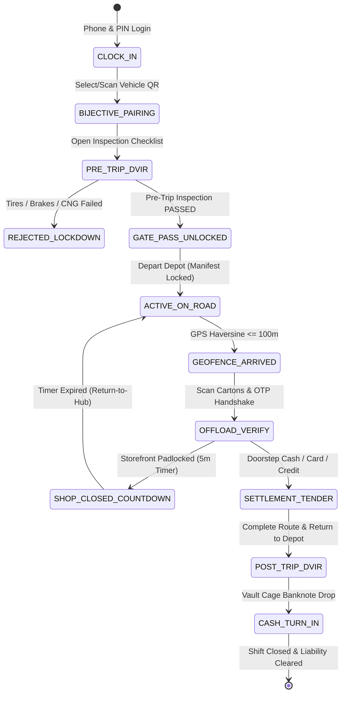
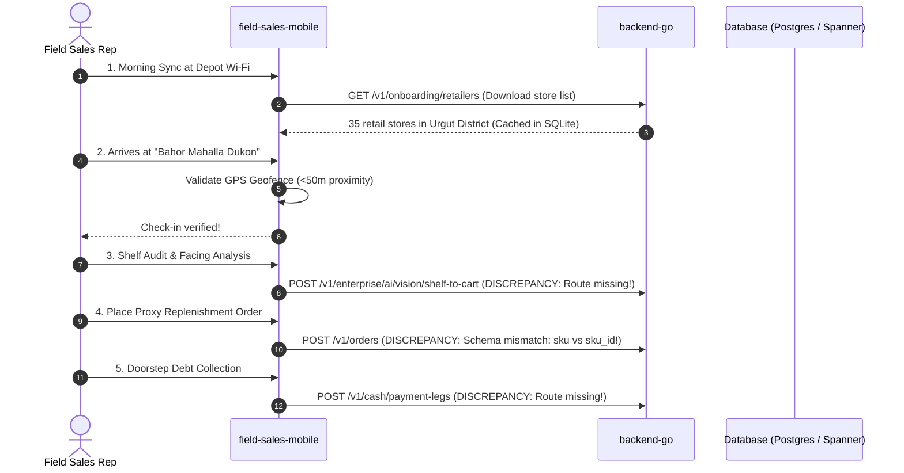

# Cross-Role Domain Parity & End-to-End Operational Alignment Survey (Requirement R3)

**Author:** teamwork_preview_explorer_survey_14_3  
**Date:** 2026-09-24  
**Target Workspace:** `/Users/shakhzod/Desktop/V.O.I.D`  
**Subsystems Investigated:**  
1. `pegasusX/` — Global Enterprise Multi-Tenant Cloud Architecture (Spanner + Kafka + Go Chi + Next.js 15 / Tauri v2 + 12 Native Mobile Apps)  
2. `pegasus.x/` — Sovereign Lean Single-Tenant National Operating Core (PostgreSQL 16 + Redis 7 Streams + Go Chi + Telegram Suite + Tauri v2 + Mobile Clients)  
**Authoritative Reference Specifications:**  
- `PEGASUSX_USER_FLOWS.md`  
- `DUAL_SYSTEM_ARCHITECTURE_AND_PARITY.md`  
- `PEGASUSX_ORDER_LIFECYCLE.md`  
- `pegasusX/docs/UZBEKISTAN_ALL_REGION_ACCESSIBILITY_AND_NATIONAL_LOGISTICS_BLUEPRINT.md`  

---

## Executive Summary

This investigation audits **Requirement R3 (Cross-Role Domain Parity & End-to-End Operational Alignment)** across all **8 user roles**:
1. **Supplier**
2. **Retailer**
3. **Driver**
4. **Warehouse**
5. **Payload Dock Operator**
6. **Factory Production Operator**
7. **Platform Administrator**
8. **Field Sales Representative**

The analysis evaluated business state machines, transactional integrity guarantees, cross-role operational handoffs, and client surface coverage across desktop portals, tablet terminals, and mobile applications for both `pegasusX` and `pegasus.x`.

### Key High-Level Findings
1. **Divergent Order State Machine Vocabularies**:
   - `pegasusX` strictly implements the **18-state canonical lifecycle** (`order/state_machine.go:14-81`) governed by ADR-009 Fiscal Hard-Gate (`FISCALIZING` $\rightarrow$ `COMPLETED`).
   - `pegasus.x` implements a **12-state deterministic lifecycle** (`internal/order/state_machine.go:42-125`) with granular warehouse execution stages (`CONFIRMED`, `PICKING`, `PACKED`, `LOADED`), threshold auto-approval vetting (`PENDING_APPROVAL`), and terminal state `DELIVERED`, delegating tax fiscalization to asynchronous outbox/Didox event channels (`mysoliq_invoices`).
2. **HTTP 428 Precondition Required Onboarding Gates Asymmetry**:
   - `pegasus.x` implements four non-bypassable HTTP 428 gates in `internal/api/router.go`: `requireSupplierOnboardingCompleted` (lines 448-483), `requireWarehouseOnboardingCompleted` (lines 490-553), `requireDriverOnboardingCompleted` (lines 680-734), and `requirePayloaderOnboardingCompleted` (lines 736-795).
   - In `pegasusX`, these operational gate middlewares do not exist; onboarding relies on soft boolean claims (`IsRegistered`, `IsConfigured`).
3. **Role Gaps Across Systems**:
   - **Factory Production Operator**: Fully modeled in `pegasusX` (3 client apps: `factory-portal`, `factory-app-android`, `factory-app-ios`, plus dedicated Spanner tables `Factories`, `FactoryTruckManifests`, `FactorySupplyRequestQC`). In `pegasus.x`, the Factory tier is completely absent (no apps, no backend routes; replenishment is treated solely as inter-warehouse transfers).
   - **Platform Administrator**: Present in `pegasusX` (`admin-portal`, multi-tenant cell routing, feature flag dual-control, outbox DLQ replay). Absent as a dedicated portal in `pegasus.x` due to its single-tenant appliance model.
   - **Field Sales Representative**: Absent in `pegasusX` (no dedicated client app or proxy-order backend). Present in `pegasus.x` as `apps/field-sales-mobile` (Expo React Native), but crippled by orphaned endpoints (`/v1/cash/payment-legs`, `/v1/enterprise/ai/vision/shelf-to-cart`), missing authentication (`CURRENT_AGENT.token = ""`), and contract payload mismatches with `order.CreateOrderRequest`.
4. **Mechanical Axle Physics Superiority in `pegasus.x`**:
   - `pegasus.x` implements true 3L-CVRP longitudinal static moment axle load physics (`internal/fleet/axle_load.go:46-100`), enforcing the statutory 11,500 kg single-axle limit and $\ge 20\%$ steer tractive ratio, paired with supervisor PIN override and digital bolt seal serialization. `pegasusX` only validates volume units (VU) against `TetrisBuffer = 0.95`.

---

## 1. Master Cross-System Role & Client Matrix

The table below catalogs client availability, platform runtime, and operational parity for all 8 roles across both monorepos:

| # | Role | pegasusX Client Surfaces | pegasus.x Client Surfaces | Parity & Divergence Assessment |
|---|---|---|---|---|
| **1** | **Supplier** | • `apps/supplier-portal` (Next.js 15 / Tauri v2 Desktop)<br/>• `apps/supplier-app-android` (Kotlin Compose)<br/>• `apps/supplier-app-ios` (SwiftUI) | • `apps/supplier-desktop` (Next.js 15 / Tauri v2 Desktop)<br/>• `apps/supplier-app-android` (Kotlin Compose)<br/>• `apps/supplier-app-ios` (SwiftUI) | **High Parity**: Both systems feature high-density desktop control towers (3-column layout, StatusStack KPI funnel, OSRM dispatch canvas) and native mobile apps. `pegasusX` supports multi-cell tenant switching; `pegasus.x` features deep Uzbekistan localization (Soliq E-Factura, Didox, Skonto). |
| **2** | **Retailer** | • `apps/retailer-app-desktop` (Next.js 15 / Tauri v2 with Retail OS POS)<br/>• `apps/retailer-app-android` (Kotlin Compose)<br/>• `apps/retailer-app-ios` (SwiftUI) | • `apps/retailer-desktop` (Next.js 15 / Tauri v2 Desktop)<br/>• `apps/retailer-app-android` (Kotlin Compose)<br/>• `apps/retailer-app-ios` (SwiftUI)<br/>• `apps/telegram-bot` (Grammy)<br/>• `apps/telegram-miniapp` (Vite 6 / React 19) | **Superior Market Fit in `pegasus.x`**: While `pegasusX` has an in-store Retail OS (POS shifts, receipt printing, inventory receiving), `pegasus.x` adds a full Telegram commerce stack (Voice ordering in Uzbek with NLU tokenizer, 2.5% Skonto prompt payment discount, 4-digit doorstep delivery OTP, Nasiya credit balance queries). |
| **3** | **Driver** | • `apps/driver-app-android` (Kotlin Compose)<br/>• `apps/driver-app-ios` (SwiftUI / Live Activities) | • `apps/driver-app-android` (Kotlin Compose / Room)<br/>• `apps/driver-app-ios` (SwiftUI / Swift 6) | **High Parity & Hardened in `pegasus.x`**: Both apps feature Kalman-filtered GPS telemetry, subterranean offline signing (`SubterraneanOfflineSigner`), and mid-route SOS breakdown rescue. `pegasus.x` enforces strict Pre-Trip DVIR dialogs (`PreTripDVIRDialog.kt`), fuel type verification (CNG cylinder seals), and bijective shift pairing. |
| **4** | **Warehouse** | • `apps/warehouse-portal` (Next.js 15 / Tauri v2 Desktop)<br/>• `apps/warehouse-app-android` (Kotlin handheld scanner)<br/>• `apps/warehouse-app-ios` (SwiftUI) | • `apps/warehouse-desktop` (Next.js 15 / Tauri v2 Desktop)<br/>• `apps/warehouse-app-android` (Kotlin handheld scanner)<br/>• `apps/warehouse-app-ios` (SwiftUI) | **High Parity**: Both provide desktop WMS and mobile picker/scanner apps. `pegasus.x` implements blind receiving variance reconciliation, cross-dock peak waves, quarantine segregation (`WH-QUARANTINE-01`), and auto-approval thresholds. `pegasusX` implements Spanner-interleaved pick waves and manifest freeze locks. |
| **5** | **Payload Dock** | • `apps/payload-terminal` (Expo SDK 55 RN)<br/>• `apps/payload-app-android` (Kotlin Compose)<br/>• `apps/payload-app-ios` (SwiftUI) | • `apps/payloader-tablet` (Expo React Native tablet)<br/>• `apps/payload-app-android` (Kotlin Compose)<br/>• `apps/payload-app-ios` (SwiftUI) | **Superior Engineering in `pegasus.x`**: `pegasus.x` features a dedicated tablet cockpit (`payloader-tablet`) with 3L-CVRP longitudinal static moment axle calculations ($W_{front}$, $W_{rear}$, steer tractive ratio $\ge 20\%$, $11.5\text{T}$ limit) and supervisor PIN override. `pegasusX` validates volume units VU only. |
| **6** | **Factory** | • `apps/factory-portal` (Next.js 15 / Tauri v2 Desktop)<br/>• `apps/factory-app-android` (Kotlin Compose)<br/>• `apps/factory-app-ios` (SwiftUI) | **NONE** (No desktop, tablet, or mobile applications) | **Complete Domain Gap in `pegasus.x`**: `pegasusX` contains a dedicated Upstream Manufacturing domain with 3 client apps and 8 Spanner tables. In `pegasus.x`, `RoleFactory` is declared in claims but has 0 backend routes or client apps; factory transfers are handled as standard warehouse transfers. |
| **7** | **Platform Admin** | • `apps/admin-portal` (Next.js 15 Web) | **NONE** (No dedicated platform admin client) | **Architectural Divergence by Design**: `pegasusX` is a global multi-tenant SaaS requiring a super-admin portal for tenant provisioning, multi-cell routing directory, dual-control feature flags, and Kafka outbox DLQ replay. `pegasus.x` is a single-tenant national appliance administered directly via `supplier-desktop`. |
| **8** | **Field Sales** | **NONE** (No dedicated client app; handled via S&OP auto-order / assist tickets) | • `apps/field-sales-mobile` (Expo React Native) | **Dual-System Discrepancy**: `pegasusX` specifies field sales workflows in documentation but provides no client app. `pegasus.x` provides `apps/field-sales-mobile` with 5 screens, but calls non-existent backend endpoints (`/v1/cash/payment-legs`, `/v1/enterprise/ai/vision/shelf-to-cart`) and contains uncoordinated order schemas. |

---

## 2. In-Depth Operational Flow & State Machine Analysis by Role

### 2.1 Role 1: Supplier (Commercial, Catalog & Control Tower)

#### Operational Lifecycle & State Machines
1. **Onboarding Gate State Machine**:
   - `pegasus.x`: Transitions `PENDING` $\rightarrow$ `PRODUCTS_CONFIGURED` $\rightarrow$ `PAYMENT_CONFIGURED` $\rightarrow$ `COMPLETED`. Enforced by `requireSupplierOnboardingCompleted` (`router.go:448-483`):
     ```go
     if !isCompleted {
         w.WriteHeader(http.StatusPreconditionRequired) // HTTP 428
         json.NewEncoder(w).Encode(map[string]any{
             "error": "onboarding_incomplete",
             "onboarding_status": "PENDING",
             "next_step": "/onboarding/products",
         })
         return
     }
     ```
   - `pegasusX`: Onboarding uses `IsRegistered` and `IsConfigured` boolean claims in JWTs and `Suppliers` table. Lacks HTTP 428 interceptor middleware; relies on client-side router redirects.
2. **Dynamic Pricing & MXIK Classification**:
   - Both systems strictly forbid floating-point currency math, storing prices as signed 64-bit integer tiyins (`int64`, $1\text{ UZS} = 100\text{ tiyins}$).
   - `pegasusX` stores pricing in `PriceLists` and `PriceListItems` (`spanner.ddl:1960-1970`).
   - `pegasus.x` stores pricing in `skus` (`001_initial_schema.sql:48-58`) with 17-digit statutory Soliq MXIK codes (`mxik_code VARCHAR(17)`), volume discount tiers (`066_tiered_volume_moq_discounts.sql`), and 2.5% early payment Skonto rules.
3. **Operational Control Tower**:
   - Both `supplier-portal` (`pegasusX`) and `supplier-desktop` (`pegasus.x`) feature the 3-column tactical layout:
     - Left: 64px collapsed tactical navigation rail.
     - Center: StatusStack KPI funnel (`Draft` $\rightarrow$ `Pending` $\rightarrow$ `Wave Picking` $\rightarrow$ `Staged` $\rightarrow$ `On Road` $\rightarrow$ `Delivered`).
     - Right: Scored Exception Drawer (ETA drift $>25$ min, cold-chain temperature spike, shop locked grace countdown).

---

### 2.2 Role 2: Retailer (Procurement, Order Handover & In-Store Operations)

#### Operational Lifecycle & State Machines
1. **Multi-Supplier Procurement vs Telegram Commerce**:
   - `pegasusX` supports multi-supplier checkout via `POST /v1/checkout/unified` (`apps/backend-go/orderroutes/routes.go`), splitting a single shopping basket into `ParentOrders` and child `Orders` partitioned by `SupplierId`.
   - `pegasus.x` specializes in traditional trade via `telegram-bot` and `telegram-miniapp`:
     - Natural language voice ordering in Uzbek (`parseUzbekOrderText`).
     - Real-time 2.5% Skonto early payment deduction.
     - 4-digit doorstep delivery OTP issuance.
2. **Order Lifecycle Discrepancy**:
   - In `pegasusX` (`order/state_machine.go:24-74`), the retailer experiences the 18-state flow:
     $$\text{PENDING} \longrightarrow \text{LOADED} \longrightarrow \text{IN\_TRANSIT} \longrightarrow \text{ARRIVED} \longrightarrow \text{AWAITING\_PAYMENT} \longrightarrow \text{FISCALIZING} \longrightarrow \text{COMPLETED}$$
   - In `pegasus.x` (`internal/order/state_machine.go:56-118`), the order transitions:
     $$\text{PENDING} \longrightarrow \text{CONFIRMED} \longrightarrow \text{PICKING} \longrightarrow \text{PACKED} \longrightarrow \text{LOADED} \longrightarrow \text{IN\_TRANSIT} \longrightarrow \text{ARRIVED} \longrightarrow \text{DELIVERED}$$
   - **Key Finding**: In `pegasus.x`, `DELIVERED` is the terminal state. In `pegasusX`, `DELIVERED` does not exist; `COMPLETED` is terminal, and the order **must** pass through `FISCALIZING` (ADR-009).
3. **Post-Dispatch Dispute Resolution (UMP)**:
   - When goods arrive damaged, `pegasus.x` uses the Universal Mutation Protocol (`internal/ump/engine.go`): mutations are append-only rows in `entity_adjustments`. Claims $\le 600,000\text{ UZS}$ trigger automated credit notes and corrective Soliq invoices (`TUZATUVCHI`).
   - `pegasusX` records claims in `Claims` and `ClaimEvidences` (`spanner.ddl:318-329`), routing adjustments through `CreditNotes`.

---

### 2.3 Role 3: Driver / Courier (Last-Mile Fleet Execution)

#### Operational Lifecycle & State Machines


1. **Pre-Trip DVIR & Vehicle Pairing Parity**:
   - `pegasus.x` maintains a mathematically verified bijective pairing table `driver_vehicle_assignments` (`025_fleet_and_driver_lifecycle_management.sql:54-74`) ensuring no driver or vehicle has $>1$ active assignment.
   - `pegasus.x` enforces pre-trip inspection via `vehicle_inspections` table and `requireDriverOnboardingCompleted` (`router.go:680-734`).
   - `pegasusX` models vehicles in `Vehicles` table without a dedicated DVIR table; safety maintenance is an administrative status flag (`UnavailableReason = 'MAINTENANCE'`).
2. **Subterranean Offline Mode**:
   - Both Android and iOS driver apps in both systems implement subterranean offline delivery:
     - Local HMAC-SHA256 digital signature generation (`SubterraneanOfflineSigner`).
     - Encrypted SQLite local queue (`OfflineDeliveryQueue.kt` / SwiftData).
     - Android `OfflineSyncWorker.kt` (WorkManager) flushes deliveries via `POST /v1/sync/batch` upon regaining 4G LTE.
3. **Mid-Route Breakdown & Roadside Rescue**:
   - Both codebases implement SOS roadside vehicle breakdown rescue (`rescue.go` in both backends).
   - In `pegasusX`, remaining stops are reassigned atomically in Spanner `SupplierTruckManifests`.
   - In `pegasus.x`, vehicle hot-swap is recorded in `driver_vehicle_assignments` (`assignment_type = 'HOT_SWAP_RESCUE'`) and `fleet_rescue_incidents` (`037_fleet_rescue_incidents.sql`).

---

### 2.4 Role 4: Warehouse (WMS Depot & Inventory Operations)

#### Operational Lifecycle & State Machines
1. **Auto-Approval Threshold Vetting**:
   - `pegasus.x` introduces a configurable auto-approval threshold per warehouse (`067_warehouse_auto_approval_thresholds.sql`): orders above the threshold (default: 600,000 UZS) enter `PENDING_APPROVAL`, holding in a manual vetting queue for supervisor review before pick wave release.
   - `pegasusX` transitions all confirmed orders directly into `PENDING`.
2. **Pick Wave Generation & Zone Allocation**:
   - In `pegasusX`, `PickWaves` and `PickWaveItems` are interleaved in Spanner (`spanner.ddl:1300-1309`), grouping lines by storage zone (Ambient, Chilled, Bulk).
   - In `pegasus.x`, pick waves are managed via `022_pick_wave_batching_and_zone_routing.sql`, updating stock allocations with PostgreSQL row-level locks (`SELECT ... FOR UPDATE`).
3. **Quarantine Segregation & Blind Receiving**:
   - `pegasus.x` implements blind receiving variance reconciliation (`027_blind_receiving_variance_reconciliation.sql`) and dedicated quarantine bin isolation (`WH-QUARANTINE-01`) for damaged return freight.

---

### 2.5 Role 5: Payload Dock Operator (Freight Loading & Volumetric Verification)

#### Operational Lifecycle & State Machines
1. **Mechanical 3L-CVRP Axle Statics Equilibrium (`pegasus.x`)**:
   - Implemented in `pegasus.x/backend/internal/fleet/axle_load.go:46-100`:
     $$W_{front} = W_{curb,front} + \sum_{i} \frac{w_i (L - x_i)}{L}$$
     $$W_{rear} = W_{curb,rear} + \sum_{i} \frac{w_i x_i}{L}$$
     $$\text{SteerRatio} = \frac{W_{front}}{W_{total}} \times 100\% \ge 20\%$$
     $$\text{FrontAxleWeight} \le \text{GAWRFront}, \quad \text{RearAxleWeight} \le \text{GAWRRear} \le 11,500\text{ kg}$$
   - If axle weights exceed legal road ratings, the system blocks sealing with `ErrAxleOverloadViolation`.
   - Supervisor can execute an audited override (`POST /v1/payload/override`), recording supervisor PINFL, reason code, and digital bolt seal serial (`SEAL-UZ-XXXXXX`).
2. **Volumetric Verification (`pegasusX`)**:
   - `pegasusX` uses volume units (VU) and a buffer factor (`TetrisBuffer = 0.95`). Pallet scans are validated against manifest capacity. Digital seal is applied via `POST /v1/payloader/manifests/seal-all` generating an HMAC-SHA256 seal hash.

---

### 2.6 Role 6: Factory Production Operator (Upstream Manufacturing)

#### Operational Lifecycle & State Machines
1. **The Factory Domain Gap**:
   - In `pegasusX`:
     - Apps: `apps/factory-portal`, `apps/factory-app-android`, `apps/factory-app-ios`.
     - Tables: `Factories`, `FactoryProfiles`, `FactorySupplyRequests`, `FactorySupplyRequestItems`, `FactorySupplyRequestQC`, `FactoryLots`, `FactoryTruckManifests`, `FactoryLoadingBays`.
     - Flows: Production lot staging (`POST /v1/factory/lots`), inter-facility transfer requests with mandatory QC gate (`FactorySupplyRequestQC.result = 'PASS'`), factory trailer staging (`POST /v1/factory/dispatch`).
   - In `pegasus.x`:
     - **0 client applications**.
     - `RoleFactory` exists only as an enum in `internal/models/claims.go:16`.
     - Inter-facility transfers are treated simply as warehouse transfers (`apps/supplier-desktop/app/(portal)/transfers/page.tsx`).

---

### 2.7 Role 7: Platform Administrator (Governance & Infrastructure)

#### Operational Lifecycle & State Machines
1. **Multi-Tenant SaaS vs Single-Tenant Appliance**:
   - `pegasusX`: Requires platform super-admin via `apps/admin-portal`.
     - Tenant provisioning & home cell assignment (`cell-uz`, `cell-eu`, `cell-us`, `cell-kz`).
     - Dual-control feature flag management (Four-Eyes Principle: proposer cannot approve).
     - Kafka Outbox Dead-Letter Queue (DLQ) replay dashboard (`/ops/dead-letters`).
     - Platform SLO monitoring & monthly billing fee reconciliation.
   - `pegasus.x`: Engineered as an isolated sovereign appliance for a single enterprise on bare-metal infrastructure in Tashkent. Platform admin functions are subsumed into the Supplier Admin in `supplier-desktop`.
   - **Critical Caveat in `pegasus.x`**: Failed outbox events are written to `outbox_dead_letters` (`internal/outbox/relay.go:192`), but there is no API route or UI screen to view or replay them.

---

### 2.8 Role 8: Field Sales Representative (Traditional Trade & Bakkol Agents)

#### Operational Lifecycle & State Machines


#### Detailed Defect & Discrepancy Breakdown for Field Sales
1. **Unimplemented Backend Routes**:
   - `CashCollectionScreen.tsx:29` calls `POST /v1/cash/payment-legs`. This route **does not exist** anywhere in `pegasus.x/backend` or `pegasusX/apps/backend-go`.
   - `ShelfAuditScreen.tsx:20` calls `POST /v1/enterprise/ai/vision/shelf-to-cart`. This route **does not exist** in either backend.
2. **Order Payload Contract Mismatch**:
   - `ProxyOrderScreen.tsx:80-92` constructs:
     ```json
     {
       "retailer_id": "...",
       "supplier_id": "...",
       "source": "FIELD_SALES_REP",
       "items": [{ "sku": "...", "quantity": 10, "unit_price": 12500 }]
     }
     ```
   - In `pegasus.x/backend/internal/order/service.go:92-127`, `CreateOrderRequest` requires:
     ```json
     {
       "warehouse_id": "...",
       "retailer_id": "...",
       "items": [{ "sku_id": "...", "ordered_qty": 10, "list_price_minor": 1250000 }]
     }
     ```
   - Because `sku_id` is missing and `ordered_qty` is 0, the backend rejects the request with HTTP 400 `invalid_sku: SKU not found in catalog`.
3. **Missing Authentication Session**:
   - In `apps/field-sales-mobile/src/api.ts:11-16`, `CURRENT_AGENT.token` is hardcoded as empty `""`. There is no login screen or JWT token minting for field agents.
   - `models.Role` lacks `RoleFieldSales`, causing all authenticated calls to fail.

---

## 3. Realtime Event Pipeline & Synchronization Parity

| Dimension | `pegasusX` Realtime Plane | `pegasus.x` Realtime Plane | Operational Assessment |
|---|---|---|---|
| **Outbox Persistence** | Cloud Spanner `OutboxEvents` table interleaved in parent transaction via `SpannerTxnBuffer`. | PostgreSQL `outbox_events` table written inside `pgx.Tx` via `outbox.Emit`. | **Parity Met**: Both guarantee atomic persistence of business entity mutations and outbox events in the same physical commit. |
| **Relay Polling Engine** | 250ms ticker with `ClaimedUntil` leases and `FairInterleave` round-robin across `SupplierId`. | 500ms ticker with PostgreSQL `SELECT ... FOR UPDATE SKIP LOCKED LIMIT 50`. | **Parity Met**: Concurrency-safe, multi-pod lease protection in both systems. |
| **Transport Medium** | Apache Kafka cluster with topics (`pegasusx-orders`, `pegasusx-dispatch`, `pegasusx-realtime`). | Redis 7 Streams (`stream:<aggregate>:events`) via `XAdd` + Redis Pub/Sub channels (`events:<aggregate>`). | **Architectural Divergence by Design**: Preserves strict two-system boundary (Kafka for multi-tenant cloud vs Redis for sovereign appliance). |
| **WebSocket Hub Architecture** | 8 Multiplexed Role Hubs (`/v1/ws?role=...`) + 256-event ring buffer per room + Redis cross-pod fanout. | Single Gorilla WebSocket Hub (`/v1/ws`) with atomic 64-bit monotonic sequence numbering (`atomic.AddInt64`) + 2,000-event ring buffer. | **Parity Met**: Monotonic sequence replay enables seamless reconnect after subterranean basement delivery drops. |
| **Consumer Idempotency** | `SpannerEventDedup` querying/inserting `ConsumerInbox` inside Spanner `ReadWriteTransaction`. | Idempotency keys checked in PostgreSQL and Redis deduplication keys. | **Parity Met**: Guarantees exactly-once operational processing. |

---

## 4. Discovered Edge Cases & Disjoint Role Handoffs

### 4.1 Order Creation to Wave Picking (Retailer $\rightarrow$ Warehouse)
- **Edge Case**: In `pegasus.x`, when an order total exceeds the warehouse auto-approval threshold (e.g. 600,000 UZS), the order enters `PENDING_APPROVAL`. If the warehouse supervisor does not monitor the vetting queue, the order stalls indefinitely without pick wave generation. In `pegasusX`, all valid orders transition immediately to `PENDING`.
- **Recommendation**: Implement an automated escalation notification to `warehouse-desktop` and SMS/Telegram alert when an order remains in `PENDING_APPROVAL` for $>15$ minutes.

### 4.2 Pick Wave to Manifest Sealing (Warehouse $\rightarrow$ Payload Dock)
- **Edge Case**: In `pegasus.x`, if a pallet load creates an axle weight imbalance ($>11,500\text{ kg}$ on drive axle or $<20\%$ tractive ratio on steer axle), the manifest cannot be sealed without a supervisor override. If no supervisor is physically present at the dock bay, the truck is blocked from departing.
- **Recommendation**: Add remote supervisor approval via `warehouse-desktop` and Telegram Bot push message with OTP PIN override authorization.

### 4.3 Manifest Seal to Departure (Payload Dock $\rightarrow$ Driver)
- **Edge Case**: `pegasus.x` enforces that the assigned driver must have a passing Pre-Trip DVIR inspection (`is_safe_to_operate = true`) for the current shift date before the departure gate unlocks. If the driver completed the inspection at 23:45 UTC on a UTC server (which is 04:45 local Tashkent time), a naive `CURRENT_DATE` check causes premature date rollover and false lockout.
- **Recommendation**: Explicitly anchor the inspection date query to `CURRENT_TIMESTAMP AT TIME ZONE 'Asia/Tashkent'`, as documented in `DUAL_SYSTEM_ARCHITECTURE_AND_PARITY.md:1096`.

### 4.4 Doorstep Delivery to Fiscal Tax Receipt (Driver $\rightarrow$ Compliance)
- **Edge Case**: Under ADR-009, if the state tax authority (Soliq / Didox) gateway times out ($>8\text{s}$), the order in `pegasusX` moves to `FISCAL_FAILED`. In `pegasus.x`, the order is already marked `DELIVERED`, and fiscal failure is recorded in `mysoliq_invoices`.
- **Recommendation**: Ensure `driver-app-android` and `driver-app-ios` display an amber "Fiscalization Pending" badge rather than blocking the driver from continuing their route when tax authorities experience intermittent network blackouts.

---

## 5. Comprehensive Actionable Reconciliation Roadmap

1. **Reconcile Order State Machine Vocabularies**:
   - Harmonize client application status displays so that `DELIVERED` (`pegasus.x`) and `COMPLETED` (`pegasusX`) map into a unified frontend status badge via `@pegasusx/types` `canonicalizeOrderStatus()`.
2. **Harden Field Sales Mobile Subsystem (`pegasus.x`)**:
   - Register `RoleFieldSales Role = "FIELD_SALES"` in `internal/models/claims.go`.
   - Implement `POST /v1/auth/agent/login` to provide authenticated JWT tokens for field sales representatives.
   - Refactor `apps/field-sales-mobile/src/screens/ProxyOrderScreen.tsx` to transmit `sku_id`, `ordered_qty`, and integer tiyin pricing matching `order.CreateOrderRequest`.
   - Implement `POST /v1/cash/payment-legs` in `backend/internal/api/` or redirect field debt collection to the existing `POST /v1/order/collect-cash` endpoint.
3. **Expose Outbox Dead-Letter Queue (DLQ) Management in `pegasus.x`**:
   - Add HTTP endpoints `GET /v1/ops/dead-letters` and `POST /v1/ops/dead-letters/replay` to `pegasus.x/backend/internal/api/router.go`.
   - Add a DLQ inspection tab to `apps/supplier-desktop/app/(portal)/operations/page.tsx` allowing administrators to inspect failed payloads and trigger replay.
4. **Unify HTTP 428 Precondition Required Gates**:
   - Formalize the HTTP 428 onboarding middleware across both systems as a shared architectural primitive, ensuring uncommissioned actors cannot access operational dispatch or fulfillment routes.
5. **Backport 3L-CVRP Longitudinal Axle Statics to `pegasusX`**:
   - Port `CalculateAxleBalance` (`internal/fleet/axle_load.go`) from `pegasus.x` into `pegasusX/apps/backend-go/payload/` to ensure global enterprise fleets comply with statutory axle weight regulations.

---
*Report compiled and certified by teamwork_preview_explorer_survey_14_3.*
