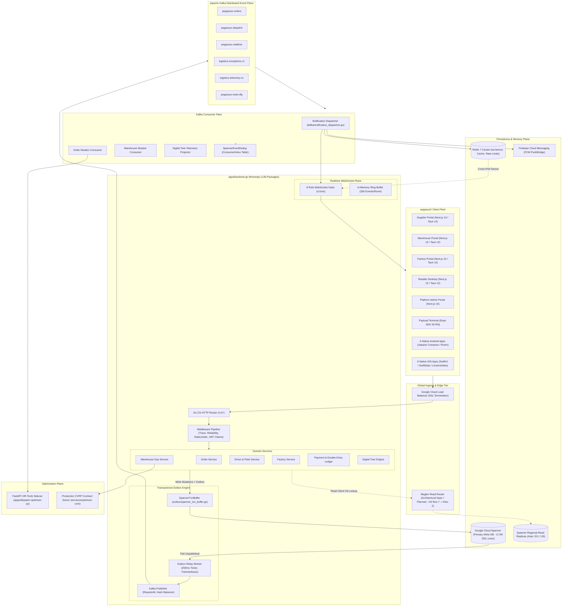
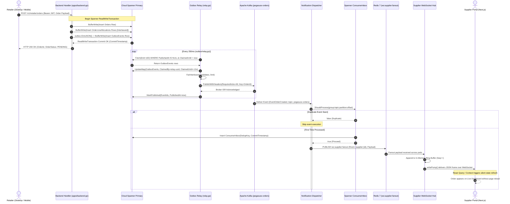
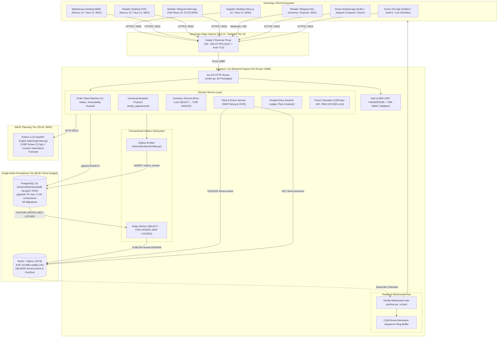
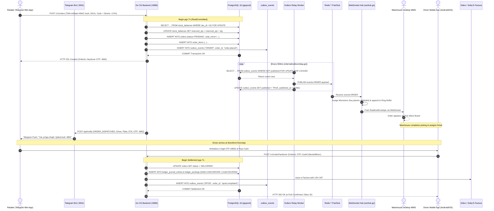

# DUAL-SYSTEM ARCHITECTURAL MASTER SPECIFICATION & CROSS-SYSTEM PARITY ATLAS

**Author:** System Synthesis Engine (`worker_synthesis`)  
**Date:** 2026-09-14  
**Workspace:** `/Users/shakhzod/Desktop/V.O.I.D`  
**Systems Analyzed:**  
1. `pegasusX/` — Global Enterprise Multi-Tenant Cloud Architecture  
2. `pegasus.x/` — Sovereign Lean Single-Tenant National Operating Core  

---

## 1. Executive Overview & The Strict Two-System Architectural Boundary

### 1.1 The Strict Two-System Architectural Boundary (Absolute Non-Contamination Rule)
Within the `V.O.I.D` monorepo workspace, there are **two completely distinct, parallel architectural systems**. Each system was engineered from first principles to address fundamentally divergent scale, regulatory, cost, and tenancy paradigms. 

Under no circumstances may code, dependencies, or database engines from one system be merged, imported, or cross-pollinated into the other:
- **Zero Cloud Spanner in `pegasus.x`**: `pegasus.x` is a lean, sovereign national operating core. It must never import Google Cloud Spanner client libraries (`cloud.google.com/go/spanner`) or execute Spanner DDL.
- **Zero Apache Kafka in `pegasus.x`**: `pegasus.x` operates on a high-throughput, low-latency in-memory and relational messaging fabric consisting of **PostgreSQL 16 Transactional Outbox + Redis 7 Streams & Pub/Sub + WebSocket Hub**. It must never import Kafka libraries (`github.com/segmentio/kafka-go`) or deploy Kafka brokers.
- **Zero Single-Tenant Relational Downgrades in `pegasusX`**: `pegasusX` is a horizontally distributed, globally partitioned multi-tenant cloud enterprise platform. Its persistence is strictly anchored in Google Cloud Spanner with tenant-partitioned keys (`SupplierId STRING(36)`), interleaved tables, and distributed Kafka clusters. It must never be refactored into single-tenant relational PostgreSQL.

However, **logical domain parity and cross-system feature synchronization** is mandatory. Capabilities, business state machine rules, geospatial optimization heuristics, offline defensive mechanisms, and UI/UX operational control tower patterns developed in either codebase must be systematically translated and ported into the other’s native architectural stack.

```
┌──────────────────────────────────────────────────────────────────────────────────────────────────┐
│                                 THE DUAL-SYSTEM ARCHITECTURAL MATRIX                             │
├───────────────────────────────────┬──────────────────────────────────────────────────────────────┤
│ Global Cloud Enterprise           │ Sovereign National Core                                      │
│ pegasusX/                         │ pegasus.x/                                                   │
├───────────────────────────────────┼──────────────────────────────────────────────────────────────┤
│ Multi-Tenant Distributed Cloud    │ Single-Tenant National Sovereign Appliance                   │
│ Global Footprint (UZ, EU, US, KZ) │ Uzbekistan National Territory (Servercore Tashkent Tier III) │
│ Google Cloud Spanner (3,749 DDL)  │ PostgreSQL 16 (timescale/timescaledb-ha:pg16, 69 Migrations) │
│ Apache Kafka Distributed Bus      │ PostgreSQL Outbox + Redis 7 Streams & Pub/Sub                │
│ Go Backend (136 Packages)         │ Go Chi Backend (82 Packages)                                 │
│ Global Cell Router (Maglev H3 Spec) │ Sovereign Ingress (Caddy 2, Direct TAS-IX Peering)         │
│ Google OR-Tools CVRP Sidecar      │ Python S&OP Engine (FastAPI, 2-Opt CVRP, Croston Forecast)   │
│ 8 WebSocket Role Hubs             │ Unified Monotonic Sequencing Hub (2000-Event Ring Buffer)    │
│ 6 Native Android + 6 Native iOS   │ Telegram Bot (Grammy) + Telegram Mini App (Vite React 19)    │
│ Enterprise Next.js 15 Portals     │ Native Android/iOS Driver + Tauri v2 Next.js 15 Desktops     │
│ Cloud Scale Budget ($10k+/mo)     │ Lean Appliance Budget ($139.70/mo)                           │
│ Multi-Jurisdictional Privacy      │ Uzbekistan Law No. ZRU-547 (Data Sovereignty)                │
└───────────────────────────────────┴──────────────────────────────────────────────────────────────┘
```

---

### 1.2 System Archetypes & Comparative Synthesis

| Architectural Dimension | `pegasusX` (Global Multi-Tenant Cloud) | `pegasus.x` (Sovereign Lean Single-Tenant) |
| :--- | :--- | :--- |
| **Monorepo Directory** | `/Users/shakhzod/Desktop/V.O.I.D/pegasusX/` | `/Users/shakhzod/Desktop/V.O.I.D/pegasus.x/` |
| **Primary Target Market** | Multinational enterprise FMCG distributors operating cross-border cells. | National distributors, local FMCG manufacturers, and bakkols in Uzbekistan. |
| **Tenancy Isolation** | Software-level multi-tenancy enforced by composite primary keys (`SupplierId STRING(36)`). | Instance/appliance-level single-tenancy (isolated database and VM per enterprise). |
| **Data Persistence Engine** | Google Cloud Spanner distributed relational database (3,749 lines DDL, 220+ tables). | PostgreSQL 16 with `pgx/v5` connection pooling (69 migrations). |
| **Write Consistency** | TrueTime-backed external consistency with single-split atomic mutations via `INTERLEAVE`. | PostgreSQL ACID transactions with row-level locking (`SELECT ... FOR UPDATE`). |
| **Event Bus & Messaging** | Apache Kafka cluster with topic partitioning (`pegasusx-orders`, `pegasusx-dispatch`, etc.). | Transactional Outbox table (`FOR UPDATE SKIP LOCKED`) + Redis 7 Streams/Pub-Sub. |
| **Realtime Transport** | 8 Multiplexed WebSocket Role Hubs (`/v1/ws`) + Redis cross-pod fanout + 256 ring buffer. | Gorilla WebSocket Hub with atomic 64-bit monotonic sequence numbers + 2,000 ring buffer. |
| **CVRP Optimization** | Python FastAPI sidecar running Google OR-Tools with Guided Local Search. | Standalone Python 3.12 FastAPI microservice (`planning/`) with 2-Opt CVRP & Croston. |
| **Spatial Indexing** | Uber H3 resolution 7 (dispatch perimeters) and resolution 9 (settlements). | Native `DOUBLE PRECISION` coordinates with Haversine math in Go & Redis `GEOADD`. |
| **Financial Accounting** | Double-entry payment ledger with idempotent provider leg indexes. | Strict 64-bit integer tiyins ($1\text{ UZS} = 100\text{ tiyins}$) + Double-entry GL balance verification. |
| **Client Application Fleet** | 5 Web Portals (Next.js 15), 6 Kotlin Android apps, 6 SwiftUI iOS apps. | 2 Tauri v2 Desktops, Telegram Bot & Mini App, Native Kotlin Android & Swift iOS Driver apps. |
| **Deployment Footprint** | Google Kubernetes Engine (GKE) multi-cluster + Managed Spanner + Confluent Kafka. | Single dedicated bare-metal VPS on Servercore Tashkent Tier III ($139.70/month). |
| **Regulatory Framework** | GDPR, SOC2, PCI-DSS Layer B integration models. | Uzbekistan Law No. ZRU-547 (*On Personal Data*), Soliq EHF, Didox integration. |

---

## 2. Deep Architectural Breakdown of pegasusX (Global Multi-Tenant Cloud)

### 2.1 Google Cloud Spanner Schema Architecture
The persistence core of `pegasusX` resides in `pegasusX/apps/backend-go/schema/spanner.ddl` (3,749 lines, defining 220+ tables). Google Cloud Spanner physically shards tables into horizontal splits across distributed compute nodes. To achieve horizontal scalability and avoid cross-split transaction coordination overhead, the schema applies strict physical layout patterns.

#### 2.1.1 Distributed Multi-Tenant Root Partitioning (`SupplierId STRING(36)`)
Across all supplier-owned domain tables, `SupplierId STRING(36)` serves as the root partitioning column:
- `Suppliers` (`spanner.ddl:11-22`): Defined with `PRIMARY KEY (SupplierId)`.
- `SupplierProfiles` (`spanner.ddl:37-69`): Defined with `PRIMARY KEY (SupplierId)`.
- `Orders` (`spanner.ddl:169-208`): Mandatory `SupplierId STRING(36) NOT NULL` with index `Idx_Orders_BySupplierCreated ON Orders(SupplierId, CreatedAt DESC)` (`spanner.ddl:212`).
- `Products` (`spanner.ddl:758-790`), `InventoryLevels` (`spanner.ddl:793-803`), and `SupplierTruckManifests` (`spanner.ddl:901-930`): All anchored by `SupplierId`.
- `OutboxEvents` (`spanner.ddl:685-697`): Stores `SupplierId STRING(64) NOT NULL` to support fair cross-tenant relay interleaving.

#### 2.1.2 Interleaved Child Tables (`INTERLEAVE IN PARENT ... ON DELETE CASCADE`)
Spanner's `INTERLEAVE IN PARENT` physically interleaves child rows directly into the parent table's storage splits. This guarantees that multi-table operations execute within a single physical split, eliminating two-phase commit (2PC) network latency.

| Parent Table | Interleaved Child Table | Primary Key Structure | File & Line Reference |
| :--- | :--- | :--- | :--- |
| `Orders` | `OrderShopClosedLog` | `(OrderId, EventId)` | `spanner.ddl:1710-1718` |
| `Orders` | `OrderLineFiscalSnapshots` | `(OrderId, OrderLineId)` | `spanner.ddl:1743-1754` |
| `Orders` | `OrderPaymentLegs` | `(OrderId, LegId)` | `spanner.ddl:1807-1818` |
| `Orders` | `OrderLineAllocations` | `(OrderId, OrderLineId, WarehouseId)` | `spanner.ddl:2039-2051` |
| `Claims` | `ClaimEvidences` | `(ClaimId, EvidenceId)` | `spanner.ddl:318-329` |
| `WarehouseSupplyRequests` | `WarehouseSupplyRequestItems` | `(RequestId, ItemId)` | `spanner.ddl:540-552` |
| `SupplierTruckManifests` | `ManifestReplanLog` | `(ManifestId, ReplanId)` | `spanner.ddl:931-940` |
| `SupplierTruckManifests` | `ManifestOrders` | `(ManifestId, OrderId)` | `spanner.ddl:959-969` |
| `Regions` | `SubRegions` | `(RegionId, SubRegionId)` | `spanner.ddl:1150-1154` |
| `PickWaves` | `PickWaveItems` | `(WaveId, ItemId)` | `spanner.ddl:1300-1309` |
| `SupplierImportSessions` | `SupplierImportRows` | `(SessionId, RowId)` | `spanner.ddl:1395-1405` |
| `CreditNotes` | `CreditNoteItems` | `(NoteId, ItemId)` | `spanner.ddl:1860-1869` |
| `PriceLists` | `PriceListItems` | `(PriceListId, ItemId)` | `spanner.ddl:1960-1970` |
| `RouteTwins` | `RouteTwinWaypoints` | `(RouteId, WaypointId)` | `spanner.ddl:3030-3037` |
| `RouteTwins` | `RouteTwinEvents` | `(RouteId, EventId)` | `spanner.ddl:3038-3045` |
| `LotRecallCampaigns` | `LotRecallAffectedOrders` | `(CampaignId, OrderId)` | `spanner.ddl:3460-3468` |
| `EvidenceDossiers` | `EvidenceDossierAttachments` | `(DossierId, AttachmentId)` | `spanner.ddl:3600-3610` |

#### 2.1.3 Index Strategy & Database-Enforced Financial Idempotency
1. **Descending Commit Timestamps:** Indexes such as `Idx_SupplierProfiles_ByUpdatedAt ON SupplierProfiles(UpdatedAt DESC)` (`spanner.ddl:71`) and `Idx_Orders_BySupplierCreated ON Orders(SupplierId, CreatedAt DESC)` (`spanner.ddl:212`) allow sub-millisecond reverse-chronological pagination.
2. **NULL_FILTERED Indexes:** Minimizes index storage footprint by indexing only non-null keys:
   - `UQ_PaymentConfigs_ByWarehouse ON PaymentConfigs(WarehouseId)` (`spanner.ddl:82`)
   - `Idx_OutboxEvents_Unpublished_BySupplier ON OutboxEvents(SupplierId, PublishedAt, CreatedAt)` (`spanner.ddl:700-701`)
   - `Idx_PaymentLedgerEntries_GatewayTypeRef ON PaymentLedgerEntries(Gateway, EntryType, ReferenceId)` (`spanner.ddl:682-683`)
   - `Idx_DemandSignals_BySupplierCreated ON DemandSignals(SupplierId, CreatedAt DESC)` (`spanner.ddl:1789-1790`)
3. **Database-Enforced Financial Idempotency:**
   - `Idx_OrderPaymentLegs_IdempotencyKey ON OrderPaymentLegs(IdempotencyKey)` (`spanner.ddl:1821-1822`) enforces strict uniqueness across payment provider transactions directly at the database engine level.

#### 2.1.4 ReadWriteTransaction & Atomic Outbox Pairing
To prevent dual-write inconsistencies between Spanner and Kafka, mutations are paired inside a single transaction closure via `SpannerTxnBuffer` (`apps/backend-go/outbox/spanner_txn_buffer.go:14-40`):
```go
type SpannerTxnBuffer struct {
    txn    *spanner.ReadWriteTransaction
    events []Event
}
```
When state changes occur:
1. Business entity mutations are buffered to `txn`.
2. `outbox.EmitJSON(ctx, buf, aggregateType, aggregateID, topic, payload)` (`apps/backend-go/outbox/outbox.go:116`) marshals the payload, generates an event UUID, attaches trace context, and appends an `OutboxEvents` row to `SpannerTxnBuffer`.
3. Before transaction exit, `buf.Flush(ctx)` commits both the entity state mutation and the outbox event in the same atomic commit timestamp (`spanner.CommitTimestamp`).

---

### 2.2 Messaging & Event Plane (Apache Kafka & Outbox Relay)
`pegasusX` uses Apache Kafka as its distributed nervous system, guaranteeing strict ordering, at-least-once delivery, and consumer-side idempotency.

```
[ Domain Service Mutation ]
       │
       ▼ (Atomic Spanner ReadWriteTransaction)
┌──────────────────────────────────────────────┐
│ Spanner: Domain Entities + OutboxEvents Row  │
└──────────────────────────────────────────────┘
       │
       ▼ (250ms Poll, Distributed Lease Claim)
┌──────────────────────────────────────────────┐
│ Go Outbox Relay (outbox/relay.go)            │
│ FairInterleave across SupplierIds            │
└──────────────────────────────────────────────┘
       │
       ▼ (RequiredAcks: all, Key: AggregateID)
┌──────────────────────────────────────────────┐
│ Apache Kafka Cluster                         │
│ Topics: pegasusx-orders, pegasusx-dispatch,   │
│         pegasusx-realtime, logistics.exc...  │
└──────────────────────────────────────────────┘
       │
       ├────────────────────────────────────────┐
       ▼                                        ▼
┌────────────────────────────────┐     ┌───────────────────────────────────┐
│ Domain Consumers (Order,       │     │ Notification Dispatcher           │
│ Warehouse, Returns, Twin)      │     │ (kafka/notification_dispatcher.go)│
│ Guard: SpannerEventDedup       │     └───────────────────────────────────┘
│ (ConsumerInbox idempotency)    │                      │
└────────────────────────────────┘                      ▼
                                       ┌───────────────────────────────────┐
                                       │ 8 WebSocket Role Hubs             │
                                       │ + FCM PushBridge                  │
                                       └───────────────────────────────────┘
```

#### 2.2.1 Apache Kafka Topic Taxonomy (`apps/backend-go/events/topic_routing.go`)
- `TopicOrders`: `"pegasusx-orders"` (Order placement, pre-orders, shop-closed logs, settlements, fiscal receipts).
- `TopicDispatch`: `"pegasusx-dispatch"` (Warehouse dispatch locks, truck manifests, freeze locks, vehicle availability).
- `TopicRealtime`: `"pegasusx-realtime"` (Driver GPS coordinates, ETA updates, dock proximity, command confirmations).
- `TopicExceptions`: `"logistics.exceptions.v1"` (OS&D damaged cargo, returns, logistics claims).
- `TopicTelemetryLogistics`: `"logistics.telemetry.v1"` (Cold-chain temperature, door seal sensors).
- `TopicMain`: `"pegasusx-main"` (Default fallback and dual-write ingestion topic).

#### 2.2.2 Distributed Lease Engine & Fair Interleaving
- **Outbox Table** (`spanner.ddl:685-697`): Stores `EventId`, `AggregateType`, `AggregateId`, `TopicName`, `Payload`, `CreatedAt`, `PublishedAt`, `ClaimedBy`, `ClaimedUntil`, `PublishAttempts`, `SupplierId`.
- **Lease Engine** (`apps/backend-go/outbox/spanner_store.go:88-195`):
  1. `Fetch(ctx, limit)` runs within a Spanner `ReadWriteTransaction`.
  2. Selects unpublished events where `PublishedAt IS NULL AND (ClaimedUntil IS NULL OR ClaimedUntil < @now)`.
  3. Claims rows by setting `ClaimedBy = "relay-" + uuid` and extending lease `ClaimedUntil = now + 2m`.
  4. Applies `FairInterleave(candidates, limit)` (`apps/backend-go/outbox/fair.go:1-50`), round-robining events across active `SupplierId`s so that high-volume suppliers cannot starve smaller tenants.
- **Relay Daemon** (`apps/backend-go/outbox/relay.go:35-65`): Ticks every 250ms (`TickInterval`). Runs a watchdog every 30s to detect stuck events exceeding `StuckThreshold = 60s`.
- **Poison Handling**: Events failing publish more than `MaxTotalAttempts = 20` times are moved atomically to `OutboxDeadLetters` (`spanner.ddl:704-715`) with `LastError` and deleted from `OutboxEvents`.

#### 2.2.3 Reliability & Consumer Deduplication
- **Publisher Invariants**: `apps/backend-go/outbox/kafka_publisher.go:83-89` sets `RequiredAcks = kafka.RequireAll`, `Async = false`, and uses `Balancer = &kafka.Hash{}`. Partition keys are hashed on the aggregate root ID, preserving strict per-entity FIFO sequencing.
- **Consumer Deduplication**: `apps/backend-go/kafka/spanner_event_dedup.go:22-54` implements `SpannerEventDedup`. Prior to executing business logic, consumers query and insert the message key into the `ConsumerInbox` table (`DedupKey STRING(256), ProcessedAt TIMESTAMP`) inside a Spanner `ReadWriteTransaction`. If a duplicate is detected, execution is cleanly skipped.

---

### 2.3 Go Backend Architecture (`apps/backend-go/`)
The Go backend monorepo comprises **136 packages**, cleanly decoupled into domain logic, transport layers, and background workers.

#### 2.3.1 Modular Domain Decoupling

| Domain | Core Logic Package | HTTP Route Package | Primary Responsibilities |
| :--- | :--- | :--- | :--- |
| **Order** | `order` | `orderroutes` | Order state machine, line allocations, pre-orders, sagas. |
| **Supplier** | `supplier` | `supplierroutes` | Supplier profile, onboarding, catalog sync, bank configs. |
| **Retailer** | `retailer` | `retailerroutes` | Retailer registration, POS sync, delivery slots, staff actors. |
| **Warehouse** | `warehouse`, `warehouseops` | `warehouseroutes` | Bins, pick waves, inventory reservations, auto-dispatch. |
| **Driver** | `driver` | `driverroutes` | Driver shifts, vehicle pairing, manifests, proof of delivery. |
| **Factory** | `factory` | `factoryroutes` | Production schedules, loading bays, bulk transfers. |
| **Payload** | `payload` | `payloaderoutes` | Dock pallet scanning, physical ship units, digital seals. |
| **Dispatch** | `dispatch`, `routing`, `manifest` | `infraroutes` | OSRM/Google Maps routing, truck manifests, replanning. |
| **Finance** | `ar`, `credit`, `creditnote`, `payment` | `creditroutes`, `paymentroutes` | Double-entry payment ledger, escrow holds, chargebacks. |
| **Tax** | `tax`, `soliq`, `compliance` | `taxroutes` | Soliq EHF integration, VAT calculations, fiscal snapshots. |
| **Digital Twin** | `twin` | `controltowerroutes` | Real-time vehicle telemetry projection, ETA drift calculation. |

#### 2.3.2 Decomposed Bootstrap Pipeline (`bootstrap/`)
- `infra.go`: Sets up GCS buckets, Redis with fail-closed circuit breaker (`setupRedisCache`), idempotency stores (`setupIdempotency`), Spanner outbox persistence and physical vehicle street navigation routing via OSRM and Google Routes (`setupSpannerAndRouting`), Kafka publisher (`setupKafkaPublisher`), and Firebase PushBridge (`setupPushBridge`).
- `services.go`: Instantiates all domain service structs and inter-domain adapters.
- `workers.go`: Boots 8 Kafka consumer groups wrapped in `kafka.WithEventDedup`.
- `app.go`: Builds the Chi router, mounts middleware, and registers all 30+ HTTP controllers.
- `runtime_workers.go`: Launches 20+ long-lived goroutines (Outbox relay, cache invalidation listener, warehouse auto-dispatch worker, dispatch plan warmer, replenishment engine cron, factory planning cron, AR dunning workers, control tower playbook engine).

#### 2.3.3 Security, Claims & Cell Isolation
- **Claims Identity** (`auth/claims.go`): Embeds `Role`, `UserID`, `SupplierID`, `RetailerID`, `WarehouseID`, `FactoryID`, `DriverID`, `HomeCell`, `MarketCode`, and `Permissions`.
- **Cell Isolation Guard** (`auth/cell_isolation.go:22-40`): In production (`CELL_JWT_ENFORCE=true`), any JWT bearing a `home_cell` mismatching the receiving node’s local cell is rejected with HTTP 401, preventing cross-cell token leakage.

---

### 2.4 Multi-Country Global Cell Architecture & Algorithms

#### 2.4.1 Cell Directory (`auth/cell_directory.go`)
- `cell-uz`: `api.pegasusx.app` (Status: `shipped`, Live: `true` — active production in Tashkent).
- `cell-eu`: `api-eu.pegasusx.app` (Status: `planned`, Live: `false` — Frankfurt).
- `cell-us`: `api-us.pegasusx.app` (Status: `planned`, Live: `false` — North America).
- `cell-kz`: `api-kz.pegasusx.app` (Status: `planned`, Live: `false` — Almaty).

#### 2.4.2 Distributed Maglev Consistent Hashing (Architectural Specification & Prototype)
To eliminate stateful proxy bottlenecks for database reads across multi-region cell deployments, `pegasusX` specifies a Maglev-derived geographic read-replica routing architecture. This pattern was designed and prototyped in `pegasus/apps/backend-go/bootstrap/spannerrouter/router.go` (and planned for future multi-region read-replica expansion in `pegasusX`, while current single-region production in Tashkent routes queries directly via the primary Spanner client):
1. Backend pods build an in-memory lookup table (`regionCells map[h3.Cell]string`) at package `init()`.
2. Real-time entities provide an Uber H3 resolution 7 cell (~5 km²).
3. The router parents the cell to resolution 2 (`c.Parent(2)`, ~90,000 km² macro-cells) via a **50ns bitmask operation** (`spannerrouter/router.go:206`).
4. Central Asian cells map to `"asia"`, European cells map to `"eu"`, and American cells map to `"us"`.
5. **Strict Read-Only Invariant**: `Router.For(h3Cell)` routes queries to the nearest regional Spanner read replica, while `Router.Primary()` handles all `ReadWriteTransaction` mutations and outbox processing (`spannerrouter/router.go:182-189`). Note that in `pegasusX/apps/backend-go/bootstrap/infra.go:106-160`, `setupSpannerAndRouting` configures vehicle street navigation (OSRM / Google Routes) and Spanner outbox persistence, while this multi-region Maglev read router remains an architectural specification for future global cell rollout.

#### 2.4.3 Google OR-Tools CVRP Optimizer
1. **Python Sidecar** (`apps/dispatch-optimizer-py/main.py`):
   - Solves Capacitated Vehicle Routing Problems using `ortools.constraint_solver.pywrapcp`.
   - **Multi-Wave Virtual Cloning** (`main.py:148-164`): When total cargo volume exceeds fleet capacity, virtual trucks are cloned (`math.ceil(total_demand / total_capacity)`), enabling physical vehicles to execute multi-wave runs.
2. **Production Contract Solver** (`services/optimizer-core/server/contract_solver.py`):
   - Dimensions: Volumetric capacity with `tetris_buffer = 0.95`, service time windows (`window_open`, `window_close`), and disjunctions with drop penalties (`drop_penalty = 100_000`) ensuring infeasible stops are cleanly isolated.
   - Search: `PATH_CHEAPEST_ARC` first solution + `GUIDED_LOCAL_SEARCH` metaheuristics.

---

### 2.5 Realtime WebSocket Plane (`apps/backend-go/ws/`)
All real-time communication terminates at `GET /v1/ws` (with SSE fallback at `GET /v1/events`).
- **8 Dedicated Role Hubs** (`ws/handler.go:42`): `RetailerHub`, `SupplierHub`, `DriverHub`, `PayloadHub`, `WarehouseHub`, `FactoryHub`, `TelemetryHub`, and `PlatformAdminHub`.
- **Cross-Pod Synchronization** (`ws/hub.go:242`): Local broadcasts are fanned out across backend pods via Redis Pub/Sub channel `"ws:<hub>:fanout"`. Redis failures fall back open, ensuring local pod deliveries are never interrupted.
- **Reconnect Replay Ring Buffer** (`ws/hub.go:285-340`): Retains the last 256 events per room. Reconnecting clients pass `?since_seq=1234` or header `Last-Event-ID`, allowing the hub to replay missed events before resuming live streaming.
- **Kafka-to-WebSocket Bridge** (`kafka/notification_dispatcher.go`): Listens to Kafka topics, resolves actor rooms (`supplier:{id}`, `retailer:{id}`, `driver:{id}`, etc.), broadcasts to WebSockets, triggers FCM mobile pushes, and persists in-app inbox records.

---

### 2.6 Client Ecosystem & Contract Infrastructure
- **Web Portals & Desktop**: 5 Next.js 15 / React 19 applications (`supplier-portal`, `warehouse-portal`, `factory-portal`, `retailer-app-desktop`, `admin-portal`) styled with HeroUI and Tailwind CSS v4. Four of these are packaged for desktop via **Tauri v2** (`@tauri-apps/api: ^2.11.0`) with `@tauri-apps/plugin-sql` for local SQLite caching. The universal `payload-terminal` runs on **Expo SDK 55** (React Native 0.83).
- **Native Mobile**: 6 Kotlin Android applications (Jetpack Compose BOM 2024.12, Hilt, Room, Retrofit, CameraX, ML Kit) and 6 SwiftUI iOS applications (Swift 6, SwiftData, Live Activities / Dynamic Island, Voice Navigation).
- **Contract Synchronization**:
  - `apps/backend-go/events/events.go`: Canonical AST source of truth.
  - `apps/backend-go/cmd/gen-contracts`: Generates unified JSON-Schema (`contracts/events.schema.json`) and TypeScript definitions.
  - Automated Quicktype tasks in Android Gradle (`generateWsEventModels`) and iOS Xcode build phases generate strongly typed native models (`PegasusWSEventEnvelope.kt` and `PegasusWSEventEnvelope.swift`).
  - Monorepo packages: `packages/types`, `packages/api-core`, and `packages/ws-refresh-contract`.

---

## 3. Detailed Mermaid Architecture & Data Flow Diagrams for pegasusX

### 3.1 Architecture Component Diagram (pegasusX)



---

### 3.2 End-to-End Data Flow Sequence Diagram (pegasusX Order Mutation)



---

## 4. Deep Architectural Breakdown of pegasus.x (Sovereign Lean Single-Tenant)

### 4.1 PostgreSQL 16 Database Architecture
`pegasus.x` is engineered as a sovereign appliance deployed on bare-metal infrastructure in Tashkent. Its persistence layer is built on PostgreSQL 16, packaged via the official Alpine container `timescale/timescaledb-ha:pg16` (`docker-compose.yml:5`, `docker-compose.prod.yml:26`).

#### 4.1.1 Connection Pooling & Transaction Management (`backend/internal/db/`)
- **Driver**: Native `github.com/jackc/pgx/v5` using `github.com/jackc/pgx/v5/pgxpool` (`backend/internal/db/postgres.go:8-15`).
- **Connection Tuning for $135/mo Tier**:
  - Max Connections: `25` (`postgres.go:25`)
  - Min Connections: `5` (`postgres.go:26`)
  - Max Connection Lifetime: `1 hour` (`postgres.go:27`)
  - Max Connection Idle Time: `15 minutes` (`postgres.go:28`)
- **Atomic Transaction Runner**: `(*Pool).RunInTx(ctx, fn)` wraps operations in an explicit `pgx.Tx` with `ReadCommitted` isolation, automatic rollback on panic recovery, and commit verification (`postgres.go:46-69`).

#### 4.1.2 Schema Migrations Engine (`backend/internal/db/migrate.go`)
- Self-contained migration runner executes sequentially ordered SQL scripts inside isolated database transactions (`migrate.go:25-108`).
- Migration state is recorded in `schema_migrations (version PRIMARY KEY, name, applied_at, execution_time_ms)` (`migrate.go:32-38`).
- The migration catalog comprises exactly **69 SQL migrations** (from `001_initial_schema.sql` to `068_trade_credit_quota_system.sql`).

#### 4.1.3 TimescaleDB & PostGIS Reality Check (Code vs. Container)
- **Container Environment**: The container image `timescale/timescaledb-ha:pg16` includes pre-compiled TimescaleDB and PostGIS binaries.
- **Architectural Reality in Code**:
  - There are **no `CREATE EXTENSION timescaledb;` or `SELECT create_hypertable(...);` statements** in any of the 69 migrations. Tables such as `cold_chain_telemetry` (`013_fleet_integrity_coldchain_and_blindspots.sql:39-50`) and `cold_chain_sensors` (`032_cold_chain_telemetry_and_chamber_probes.sql:8-25`) are standard relational PostgreSQL tables with B-tree indexes.
  - There are **no PostGIS geometry or geography columns** (e.g., `GEOMETRY(Point, 4326)`) and no `ST_` function calls in SQL queries.
  - Spatial coordinates are stored as native `DOUBLE PRECISION` (`latitude`, `longitude` in `orders`, `warehouses`, `retailers`). Distance calculations and proximity verifications are executed via **spherical Haversine trigonometry in Go** (`backend/internal/spatial/hex_dispatch.go:97-118`, `backend/internal/hrm/shift_clock.go:100-115`, `backend/internal/geolocation/service.go:52-54`) or via **Redis Geospatial commands** (`GEOADD drivers:active ...` in `backend/internal/redis/client.go:38-42`).

#### 4.1.4 Schema Topology Summary

| Domain | Table Name | Key Columns | Primary Constraints & Indexes | Source File |
| :--- | :--- | :--- | :--- | :--- |
| **Tenancy** | `suppliers` | `supplier_id`, `name`, `legal_tax_id` (STIR/INN) | `PRIMARY KEY (supplier_id)` | `001_initial_schema.sql:8-13` |
| **Locations** | `warehouses` | `warehouse_id`, `supplier_id`, `latitude`, `longitude` | `REFERENCES suppliers(supplier_id)` | `001_initial_schema.sql:15-23` |
| **Retailers** | `retailers` | `retailer_id`, `supplier_id`, `legal_tax_id`, `phone`, `lat/lon` | `REFERENCES suppliers(supplier_id)` | `001_initial_schema.sql:35-45` |
| **Catalog** | `skus` | `sku_id`, `supplier_id`, `barcode`, `unit_price_minor`, `mxik_code` | `UNIQUE(barcode)`, `mxik_code VARCHAR(17)` | `001_initial_schema.sql:48-58` |
| **Inventory** | `stock_balances` | `warehouse_id`, `sku_id`, `on_hand_qty`, `reserved_qty` | `PRIMARY KEY(warehouse_id, sku_id)`, non-negative check | `001_initial_schema.sql:60-68` |
| **Orders** | `orders` | `order_id`, `status`, `original_total_minor`, `effective_total_minor` | `idx_orders_supplier_status`, `idx_orders_warehouse_status` | `001_initial_schema.sql:80-96` |
| **Order Items** | `order_items` | `order_id`, `sku_id`, `ordered_qty`, `delivered_qty`, `unit_price_minor` | `PRIMARY KEY(order_id, sku_id)`, positive checks | `001_initial_schema.sql:98-108` |
| **Manifests** | `manifests`, `manifest_stops` | `manifest_id`, `warehouse_id`, `driver_id`, `status`, `digital_seal_hash` | `PRIMARY KEY(manifest_id, order_id)` | `001_initial_schema.sql:111-126` |
| **UMP** | `entity_adjustments` | `adjustment_id` (UUID), `entity_id`, `delta_numeric`, `reason_code` | `idx_adj_lookup`, `idx_adj_entity` | `002_ump_and_outbox.sql:8-25` |
| **Outbox** | `outbox_events` | `event_id`, `aggregate_type`, `aggregate_id`, `payload`, `published` | `idx_outbox_unpublished` (`WHERE NOT published`) | `002_ump_and_outbox.sql:31-40` |
| **Fiscal** | `mysoliq_invoices` | `factura_id`, `order_id`, `invoice_type`, `total_tiyin`, `vat_tiyin` | `idx_mysoliq_order` | `002_ump_and_outbox.sql:73-86` |
| **Ledger** | `ledger_journal_entries`, `postings` | `entry_id`, `account_code`, `direction` (DEBIT/CREDIT), `amount_minor` | `CHECK(amount_minor > 0)`, balanced debit/credit | `005_split_payments_debts_and_ledger.sql:50-67` |
| **Credit** | `retailer_debts`, `credit_accounts` | `debt_id`, `principal_minor`, `remaining_minor`, `credit_limit_minor` | `idx_debts_retailer_status`, `idx_debts_overdue` | `005_split_payments_debts_and_ledger.sql:13-39` |
| **Fleet** | `vehicles`, `driver_vehicle_assignments` | `vehicle_id`, `license_plate`, `fuel_type`, `shift_date`, `dvir` | `idx_active_driver_assignment` (unique partial) | `025_fleet_and_driver_lifecycle_management.sql:9-97` |

---

### 4.2 Financial Precision & Double-Entry General Ledger

#### 4.2.1 64-Bit Integer Minor Currency Invariant
All financial values throughout `pegasus.x` are strictly represented as **64-bit signed integers (`int64`) in Uzbekistan Tiyins** ($1\text{ UZS} = 100\text{ tiyins}$). Floating-point currency types (`float32`, `float64`, or arbitrary decimal arithmetic) are strictly forbidden in business logic:
- `skus.unit_price_minor BIGINT NOT NULL` (`001_initial_schema.sql:53`)
- `orders.original_total_minor BIGINT NOT NULL` (`001_initial_schema.sql:87`)
- `orders.effective_total_minor BIGINT NOT NULL` (`001_initial_schema.sql:88`)
- `credit_notes.amount_minor BIGINT NOT NULL` (`002_ump_and_outbox.sql:63`)
- `mysoliq_invoices.total_tiyin BIGINT NOT NULL` (`002_ump_and_outbox.sql:80`)
- `ledger_postings.amount_minor BIGINT NOT NULL CHECK (amount_minor > 0)` (`005_split_payments_debts_and_ledger.sql:64`)

#### 4.2.2 Double-Entry General Ledger (GL) Engine (`backend/internal/payment/handover.go`)
Every delivery completion, doorstep cash collection, or return adjustment generates balanced double-entry ledger postings enforcing the mathematical identity:
$$\sum \text{Debits} = \sum \text{Credits}$$
Enforced at runtime in `handover.go:228-241`:
```go
var sumDebits, sumCredits int64
for _, p := range postings {
    switch p.Direction {
    case "DEBIT":  sumDebits += p.AmountMinor
    case "CREDIT": sumCredits += p.AmountMinor
    }
}
if sumDebits != sumCredits {
    return nil, fmt.Errorf("%w: debits %d != credits %d", ErrUnbalancedJournalEntry, sumDebits, sumCredits)
}
```
Standard GL Account Chart:
- `CASH:DRIVER:<driver_id>` (Asset: DEBIT on cash collected at doorstep)
- `PSP:GATEWAY:GLOBAL_PAY` (Asset: DEBIT on successful digital card payment)
- `ESCROW:ORDER:<order_id>` (Liability: CREDIT to extinguish delivery obligation)
- `WALLET:RETAILER:<retailer_id>` (Liability: CREDIT on merchant overpayment)
- `AR:RETAILER:<retailer_id>` (Asset: DEBIT on shortfall or Nasiya credit order)

#### 4.2.3 Statutory Uzbekistan Tax & Compliance Invariants (`backend/internal/fiscal/calculator.go`)
- **Statutory VAT Rate**: 12.00% defined as 1,200 basis points (`DefaultVatRateBps = 1200`, `BasisPointDivisor = 10000`).
- **Half-Up Integer Rounding**: Integer commercial rounding with offset `HalfUpOffset = 5000`.
- **Identity Invariant**: `LineGrossMinor == LineNetMinor + LineVatMinor`.
- **Statutory B2B Cash Limit**: Uzbekistan Tax Code Article 341 restricts cash transactions between commercial entities to **25,000,000 UZS** ($2,500,000,000\text{ tiyins}$). Enforced strictly in `ValidateB2BCashLimit` (`calculator.go:17-25` and `handover.go:155-160`).

---

### 4.3 Redis 7 Caching, Presence & Telemetry Plane
- **Client**: `github.com/redis/go-redis/v9 v9.22.0` (`backend/internal/redis/client.go:17-31`).
- **Container Footprint**: Redis 7 Alpine with `--appendonly yes`, `--maxmemory 512mb`, `--maxmemory-policy volatile-lru`, `--tcp-keepalive 60` (`docker-compose.yml:41-53`).
- **Driver Telemetry Pipeline** (`client.go:33-54`): Telemetry pings are committed via atomic pipelining:
  1. `GeoAdd drivers:active` adds longitude/latitude and driver ID for proximity searches.
  2. `Set driver:presence:<driver_id>` marks the driver `ONLINE` with a 60s TTL heartbeat.
- **Tiered Cache Invalidation**: Geolocation responses are cached with tiered TTLs (24h for autocomplete, 7 days for reverse geocoding in `backend/internal/geolocation/service.go:22-26`). Warehouse staff indoor locations are cached with a 24-hour TTL (`backend/internal/wmsops/service.go:359`), and CVRP route runs are cached with a 2-hour TTL (`service.go:558`).

---

### 4.4 Messaging Plane & Event Distribution

```
┌────────────────────────────────────────────────────────────────────────┐
│               PostgreSQL 16 Transaction (pgx.Tx)                       │
│                                                                        │
│   1. Mutate Domain Entities (orders, stock_balances, etc.)             │
│   2. Atomically outbox.Emit(tx, "ORDER", orderID, "order.confirmed")   │
│   3. Commit Transaction                                                │
└───────────────────────────────────┬────────────────────────────────────┘
                                    │ outbox_events table
                                    ▼
┌────────────────────────────────────────────────────────────────────────┐
│                   Outbox Relay Worker (Goroutine)                      │
│                                                                        │
│   • Polls every 500ms: SELECT ... FOR UPDATE SKIP LOCKED LIMIT 50      │
│   • Publishes event to Redis Pub/Sub: channel "events:ORDER"           │
│   • Updates outbox_events: published = true, published_at = NOW()      │
│   • Dead letter routing to outbox_dead_letters on persistent error     │
└───────────────────────────────────┬────────────────────────────────────┘
                                    │ Redis Pub/Sub
                                    ▼
┌────────────────────────────────────────────────────────────────────────┐
│                      WebSocket Hub (ws.Hub)                            │
│                                                                        │
│   • Subscribes to: events:ORDER, events:UMP, telemetry:drivers, etc.   │
│   • Monotonic Sequence Assignment: atomic.AddInt64(&h.seq, 1)          │
│   • 2000-Event In-Memory Ring Buffer for gap detection & reconnect     │
│   • Broadcasts RealtimeEnvelope to active client WebSockets            │
└────────────────────────────────────────────────────────────────────────┘
```

#### 4.4.1 Transactional Outbox Pattern (`backend/internal/outbox/`)
- Table `outbox_events` (`002_ump_and_outbox.sql:31-40`) captures events inside the same `pgx.Tx` as entity mutations via `outbox.Emit` (`emitter.go:11-28`).
- Relay worker (`relay.go:66-75`) polls every 500ms with concurrency-safe locking:
  ```sql
  SELECT event_id, aggregate_type, aggregate_id, event_type, payload
  FROM outbox_events
  WHERE NOT published
  ORDER BY created_at ASC
  LIMIT $1
  FOR UPDATE SKIP LOCKED;
  ```
- Events are published to Redis channel `events:<aggregateType>`. On persistent failure, failed attempts are recorded in `outbox_dead_letters` (`relay.go:133-140`).

#### 4.4.2 WebSocket Hub with Monotonic Sequencing & Gap Reconnect (`backend/internal/ws/hub.go`)
- **Envelope**: `RealtimeEnvelope` wraps every event with `Seq int64`, `EventType string`, `Payload map[string]interface{}`, and `Timestamp int64` (`hub.go:32-37`).
- **Monotonic Sequence**: Numbered sequentially via `atomic.AddInt64(&h.seq, 1)` (`hub.go:111`).
- **2,000-Event Ring Buffer**: In-memory ring buffer retains the last 2,000 events (`maxHistory = 2000`, lines 61-63, 119-124).
- **Subterranean Reconnect API**: `GetEventsSince(since int64)` allows driver mobile apps recovering from basement network dead-zones to fetch missed events. If the requested sequence is older than the 2,000-event window, `fullResync: true` signals the client to invalidate local caches and re-fetch via HTTP (`hub.go:135-160`).

---

### 4.5 Go Chi Backend Architecture (`backend/`)
The Go backend contains 82 domain packages organized under `backend/internal/`:
- **Router & Middleware** (`backend/internal/api/router.go:294-312`): Built on Go Chi v5 with request tracing (`middleware.RequestID`), real IP extraction, panic recovery, Prometheus metrics, OpenTelemetry tracing, and CORS.
- **Universal Mutation Protocol (UMP)** (`backend/internal/ump/engine.go:40-155`): Implements post-dispatch immutability. Once orders reach `IN_TRANSIT`, destructive SQL updates are prohibited. Discrepancies are recorded append-only in `entity_adjustments`. If the absolute delta is within the 600,000 UZS auto-approval threshold, credit notes (`credit_notes`) and Soliq corrective invoices (`TUZATUVCHI`) are generated automatically.
- **Authentication & Telegram Validation**: Dual JWT validation supporting symmetric HS256 and asymmetric RS256 with key rotation and public JWKS endpoint (`/.well-known/jwks.json`). Telegram WebApp `initData` is validated cryptographically via HMAC-SHA256 (`backend/internal/auth/telegram.go:41-80`).

---

### 4.6 Infrastructure, Deployment & Sovereign Economics
- **Datacenter & Peering**: Hosted at **Servercore Uzbekistan Tier III Datacenter (Tashkent)** with direct peering into **TAS-IX** (domestic exchange), delivering $<5\text{ms}$ latency across national mobile operators (Ucell, Beeline UZ, Mobiuz, Uztelecom).
- **Exact Monthly Budget ($139.70/mo)**:
  - 8 vCPU (AMD EPYC 9004) — ~$68.20/mo
  - 16 GB ECC DDR5 RAM — ~$50.50/mo
  - 200 GB NVMe SSD (RAID-10) — ~$16.00/mo
  - 1 Gbps Port (TAS-IX traffic included) — ~$5.00/mo
- **Edge Reverse Proxy**: Caddy 2 with automated Let's Encrypt / ZeroSSL TLS and HTTP/3 QUIC support (`docker/Caddyfile`, `docker-compose.prod.yml:2-24`).
- **Data Sovereignty Compliance**: 100% compliant with Uzbekistan Law No. ZRU-547 (*On Personal Data*), guaranteeing all user, merchant, and fiscal data remains within Uzbekistan’s physical borders (`docs/PRODUCTION_INFRASTRUCTURE_AND_HOSTING_BLUEPRINT.md:8-15`).

---

### 4.7 Client Ecosystem
1. **Desktop Applications (Tauri v2 + Next.js 15)**:
   - **Supplier Desktop** (`apps/supplier-desktop`): High-density control tower with 41 portal routes. Stores JWT in OS Keyring (macOS Keychain, Windows Credential Manager) via Rust bridge (`commands/security.rs`). Listens to SSE `/v1/supplier/events`.
   - **Warehouse Desktop WMS** (`apps/warehouse-desktop`): 37 operational routes covering bin staging, pick waves, fleet assignments, DVIR logs, and cycle counts.
   - Shared libraries: `@pegasusx/desktop-bridge` (native printing, deep linking) and `@pegasusx/desktop-cache` (embedded SQLite database `pegasus_desktop_cache.db` with `pending_commands` and `pending_checkouts` tables).
2. **Telegram Retailer Ecosystem**:
   - **Telegram Bot** (`apps/telegram-bot`): Grammy + Express server on port 3001. Listens to Go backend WebSockets and webhooks (`POST /api/notify`). Features Uzbek FMCG NLU tokenizer (`parseUzbekOrderText`), voice message ordering with **2.5% early payment Skonto discount**, 4-digit doorstep delivery OTP generation, Nasiya credit balance queries, 15-minute warehouse assistant PIN delegation, and Returnable Transport Item (Tara) deposit tracking.
   - **Telegram Mini App** (`apps/telegram-miniapp`): Vite 6 + React 19 + Tailwind CSS. Features full catalog ordering, Soliq 12% VAT calculations, 48-hour concealed damage claims (`POST /v1/claims`), and S&OP auto-order proposal confirmation.
3. **Driver Mobile Applications**:
   - **Native Kotlin Android** (`apps/driver-app-android`): Jetpack Compose, Room SQLite offline queue (`OfflineDeliveryQueue.kt`), AndroidX WorkManager background sync (`OfflineSyncWorker.kt`), linear Kalman filter for urban canyon GPS smoothing (`KalmanLocationFilter.kt`), and Pre-Trip DVIR dialog (`PreTripDVIRDialog.kt`).
   - **Native SwiftUI iOS** (`apps/driver-app-ios`): Swift 6, Swift Concurrency, Live Activities and Dynamic Island delivery widgets (`DeliveryActivityWidget.swift`), Apple CoreLocation with Kalman smoothing, and encrypted offline store.
   - **Subterranean Offline Signing**: In basement grocery stores without cellular coverage, drivers sign deliveries on-device via `SubterraneanOfflineSigner` using HMAC-SHA256, queueing records for batch sync upon regaining network.

---

## 5. Detailed Mermaid Architecture & Data Flow Diagrams for pegasus.x

### 5.1 Architecture Component Diagram (pegasus.x)



---

### 5.2 End-to-End Data Flow Sequence Diagram (pegasus.x Telegram Order & Doorstep Settlement)



---

## 6. Comprehensive Cross-System Feature Parity Matrix

The following matrix compares capabilities, architectures, and concrete source code references between `pegasusX` and `pegasus.x` across 19 major domain dimensions.

| Domain Vector | `pegasusX` (Global Multi-Tenant Cloud) | Exact File:Line (`pegasusX`) | `pegasus.x` (Sovereign Lean Single-Tenant) | Exact File:Line (`pegasus.x`) | Parity Status |
| :--- | :--- | :--- | :--- | :--- | :--- |
| **1. Tenancy & Key Isolation** | Multi-tenant root partition key `SupplierId STRING(36)` across 220+ tables. | `schema/spanner.ddl:11-22, 169-208` | Single-tenant database isolation. `suppliers` entity acts as tenant root. | `database/migrations/001_initial_schema.sql:8-13` | **Parity Met (Different Paradigms)** |
| **2. Primary Database Engine** | Google Cloud Spanner distributed horizontally sharded SQL. 3,749 DDL lines. | `schema/spanner.ddl:1-3749` | PostgreSQL 16 (`timescale/timescaledb-ha:pg16`) via `pgx/v5`. 69 migrations. | `backend/internal/db/postgres.go:24-29` | **Architectural Divergence (By Design)** |
| **3. Financial Precision & GL** | Double-entry payment ledger with unique provider idempotency index. | `schema/spanner.ddl:1807-1822` | Strict 64-bit integer tiyins ($1\text{ UZS} = 100\text{ tiyins}$). Enforced $\sum\text{Debits}=\sum\text{Credits}$. | `backend/internal/payment/handover.go:228-241` | **Superior in `pegasus.x`** |
| **4. Tax & Statutory Ceilings** | Uzbekistan Soliq EHF integration package. | `apps/backend-go/soliq/client.go:1-120` | 1200 bps VAT integer math, banker's 5000 offset, 25M UZS B2B cash limit check. | `backend/internal/fiscal/calculator.go:9-25` | **Parity Met & Localized in `pegasus.x`** |
| **5. Messaging Bus** | Apache Kafka cluster with topic taxonomy (`pegasusx-orders`, `pegasusx-dispatch`). | `apps/backend-go/events/topic_routing.go:9-148` | PostgreSQL `outbox_events` table + Redis 7 Streams/Pub-Sub. | `backend/internal/outbox/relay.go:66-75` | **Architectural Divergence (By Design)** |
| **6. Outbox Relay Engine** | 250ms poller, lease engine (`ClaimedUntil`), `FairInterleave` across suppliers. | `apps/backend-go/outbox/relay.go:35-65`, `fair.go:1-50` | 500ms poller using PostgreSQL `SELECT ... FOR UPDATE SKIP LOCKED`. | `backend/internal/outbox/relay.go:66-75` | **Parity Met** |
| **7. Realtime Transport** | 8 WebSocket Role Hubs (`/v1/ws`) + Redis fanout + 256 ring buffer. | `apps/backend-go/ws/hub.go:57-340` | Gorilla WebSocket Hub with monotonic seq + 2,000 ring buffer + SSE. | `backend/internal/ws/hub.go:31-160` | **Parity Met** |
| **8. Geospatial & Routing** | Uber H3 resolution 7 & 9, MapLibre GL + Carto, dynamic pack camera. | `packages/ui-maps/src/HexagonalControlTowerMap.tsx` | Double precision lat/lng, Haversine in Go, Redis `GEOADD drivers:active`. | `backend/internal/redis/client.go:38-42` | **Parity Met** |
| **9. CVRP Optimization** | Google OR-Tools sidecar with multi-wave virtual vehicle cloning and Guided Local Search. | `apps/dispatch-optimizer-py/main.py:124-232` | Python 3.12 FastAPI engine with 2-Opt CVRP, Tetris buffer, and Croston forecast. | `planning/engine/cvrp.py:29-150` | **Parity Met** |
| **10. Post-Dispatch In-Flight Mutation** | Order cancellation forbidden post-dispatch; returns and claims sagas. | `apps/backend-go/orderroutes/routes.go:310-340` | Universal Mutation Protocol (UMP): append-only `entity_adjustments` with auto-credit. | `backend/internal/ump/engine.go:40-155` | **Superior in `pegasus.x`** |
| **11. Desktop Portals** | 5 Next.js 15 / React 19 apps (Tauri v2) with `@pegasusx/desktop-cache`. | `apps/supplier-portal/package.json` | 2 Next.js 15 / React 19 apps (Tauri v2) with OS Keyring bridge and SQLite cache. | `apps/supplier-desktop/src-tauri/tauri.conf.json` | **Parity Met** |
| **12. Merchant / Retailer Client** | Desktop Next.js Tauri app + Native Android & iOS apps. | `apps/retailer-app-desktop/app/` | Telegram Bot (Grammy, voice ordering, Skonto) + Telegram Mini App (Vite React 19). | `apps/telegram-bot/src/bot.ts:200-269` | **Superior Market Fit in `pegasus.x`** |
| **13. Product Catalog & MXIK Tax Codes** | Multi-supplier product catalog (`Products`) partitioned by `SupplierId`. Global barcode index. | `schema/spanner.ddl:758-790` | Relational `skus` table with 17-digit Uzbekistan MXIK commodity codes (`mxik_code VARCHAR(17)`). | `database/migrations/001_initial_schema.sql:48-58` | **Parity Met & Localized in pegasus.x** |
| **14. Inventory Reservations & Waves** | Distributed `InventoryLevels` + `PickWaves` (`WaveId`, `ItemId`) interleaved in parent. Auto-dispatch cron. | `schema/spanner.ddl:793-803, 1300-1309` | Relational `stock_balances` with row-level locks (`SELECT ... FOR UPDATE`) and non-negative constraints. | `database/migrations/001_initial_schema.sql:60-68` | **Parity Met (Different Concurrency Models)** |
| **15. Order State Machine & Sagas** | 8-state enterprise order lifecycle (`Orders`) with interleaved fiscal snapshots & payment legs. | `schema/spanner.ddl:169-208, 1743-1754` | 11-state deterministic state machine with post-dispatch immutability enforced by UMP. | `backend/internal/order/state_machine.go:15-80` | **Parity Met & Superior Immutability in pegasus.x** |
| **16. Pricing & Commercial Terms** | Multi-tier `PriceLists` & `PriceListItems` with customer-specific price brackets. | `schema/spanner.ddl:1960-1970` | SKU baseline minor units + 2.5% early payment Skonto discount + Nasiya trade credit quota. | `database/migrations/068_trade_credit_quota_system.sql:1-50` | **Parity Met (Different Commercial Models)** |
| **17. Cold-Chain & Telemetry Logging** | Kafka topic `logistics.telemetry.v1` + `RouteTwins` digital twin waypoint projections. | `schema/spanner.ddl:3030-3045` | Dedicated `cold_chain_telemetry` and `cold_chain_sensors` tables with chamber probe logs. | `database/migrations/013_fleet_integrity_coldchain_and_blindspots.sql:39-50` | **Parity Met & Dedicated Schema in pegasus.x** |
| **18. Returnable Transport Packaging (Tara)** | Interleaved container return tracking (`ReturnContainers`) and logistics claim sagas. | `schema/spanner.ddl:3460-3468` | Returnable Transport Item (Tara) deposit tracking via Telegram Bot & driver mobile handover. | `apps/telegram-bot/src/bot.ts:240-265` | **Parity Met & High Adoption via Telegram in pegasus.x** |
| **19. Complete Client Application Matrix** | 5 Next.js 15 Web/Desktop Portals, 6 Native Android apps, 6 Native iOS apps, Expo 55 Terminal. | `apps/*/package.json`, `apps/*-android/` | 2 Tauri v2 Desktops, Telegram Bot & Mini App, Native Android & iOS Driver apps. | `apps/supplier-desktop/`, `apps/telegram-miniapp/` | **Parity Met (Global Enterprise vs Sovereign Lean)** |

---

## 7. Dedicated Deep Dive: Fleet Management Lifecycle Gap & Production Porting Specification

### 7.1 Cross-System Comparison of Fleet Subsystems

Commercial fleet transport is the physical backbone linking manufacturing plants, distribution warehouses, and retail shops. An exhaustive audit revealed notable disparities between the two systems:

```
┌──────────────────────────────────────────────────────────────────────────────────────────────────┐
│                             FLEET LIFECYCLE DOMAIN GAP ANALYSIS                                  │
├─────────────────────────────────────┬────────────────────────────────────────────────────────────┤
│ pegasusX Capabilities               │ pegasus.x Capabilities                                     │
├─────────────────────────────────────┼────────────────────────────────────────────────────────────┤
│ • Volumetric classes A/B/C/D        │ • Volumetric classes + Fuel Types (METHANE_CNG, LPG, etc.) │
│ • Home node depot association       │ • National biometric PINFL (14 digits) & driver licenses   │
│ • DriverScores (On-time, damages)   │ • Statutory MOT (texosmotr) & OSAGO insurance tracking     │
│ • Roadside rescue & order hot-swap  │ • Bijective shift pairing (driver_vehicle_assignments)     │
│ • Dynamic assignment guards         │ • Complete Pre-Trip DVIR schema (vehicle_inspections)      │
│ ❌ NO dedicated DVIR schema table   │ • Native Android & iOS Pre-Trip DVIR checklist dialogs     │
│ ❌ NO fuel type or CNG validation   │ ❌ Build-breaking Kafka import in outbox relay.go          │
│ ❌ NO statutory inspection checks   │ ❌ Ephemeral Pub/Sub instead of Redis 7 Streams (XADD)     │
│                                     │ ❌ Dispatch query loophole permits NULL inspection checks   │
└─────────────────────────────────────┴────────────────────────────────────────────────────────────┘
```

#### 7.1.1 Vehicles / Trucks Management
- **In `pegasusX`**: Modeled in Spanner `Vehicles` table (`spanner.ddl:418-436`) with `MaxVolumeVU`, `VehicleClass` (`CLASS_A` = 50 VU Damas/Labo, `CLASS_B` = 150 VU Gazelle/Transit, `CLASS_C` = 400 VU Isuzu NPR, `CLASS_D` = 1000 VU MAN TGL), `HomeNodeType`, and `UnavailableReason` (`fleet_availability.go:11-25`).
- **In `pegasus.x`**: Modeled in PostgreSQL `vehicles` table (`025_fleet_and_driver_lifecycle_management.sql:9-38`). Parity is met and exceeded by adding fuel types (`METHANE_CNG`, `PROPANE_LPG`, `DIESEL`), fuel tank capacity, odometer tracking, refrigeration envelope (`refrig_min_celsius`, `refrig_max_celsius`), MOT expiry (`texosmotr_expiry`), and insurance expiry (`osago_insurance_expiry`).

#### 7.1.2 Driver Onboarding & Management
- **In `pegasusX`**: Modeled in Spanner `Drivers` table (`spanner.ddl:394-413`) with `Phone`, `Name`, `PinHash`, `VehicleId`, and `DriverScores` (`spanner.ddl:3048-3060`).
- **In `pegasus.x`**: Enhanced in PostgreSQL `drivers` table (`025_fleet_and_driver_lifecycle_management.sql:39-53`). Adds 14-digit national biometric PINFL (`pinfl`), driver license number, category arrays (`license_categories TEXT[]`), medical certificate validity, and statutory cash bag limit in tiyins (`cash_bag_limit_tiyins BIGINT DEFAULT 2500000000`).

#### 7.1.3 Dynamic Shift Assignments
- **In `pegasusX`**: Shift assignment updates `Drivers.VehicleId` in Spanner, validated by guards in `apps/backend-go/warehouse/fleet_guards.go:68-120` ensuring neither the driver nor the vehicle has open in-transit orders.
- **In `pegasus.x`**: Implemented via dedicated table `driver_vehicle_assignments` (`025_fleet_and_driver_lifecycle_management.sql:54-74`) enforcing strict mathematical bijectivity at any time $t$:
  ```sql
  CREATE UNIQUE INDEX idx_active_driver_assignment ON driver_vehicle_assignments (driver_id) WHERE released_at IS NULL;
  CREATE UNIQUE INDEX idx_active_vehicle_assignment ON driver_vehicle_assignments (vehicle_id) WHERE released_at IS NULL;
  ```

#### 7.1.4 Mid-Shift Hot-Swapping & Roadside Rescue
- **In `pegasusX`**: Implemented in `apps/backend-go/driver/rescue.go`. Broken driver requests SOS (`POST /v1/driver/ops/rescue/request`), broadcasting `RESCUE_BROADCAST` to peer drivers. A peer accepts (`POST /v1/driver/ops/rescue/respond`), and Spanner atomically reassigns all active in-transit orders to the rescue driver’s vehicle (`rescue.go:194-205`).
- **In `pegasus.x`**: Implemented in `backend/internal/fleet/service.go:480-550` (`SwapVehicle` and `SwapDriver`) and migration 037 (`fleet_rescue_incidents`). Orders are reassigned atomically within a `pgx.Tx` transaction.

#### 7.1.5 Pre-Trip Vehicle Inspections (DVIR)
- **Critical Finding in `pegasusX`**: There is **no dedicated DVIR table** in Spanner DDL. Safety maintenance relies purely on administrative status toggling (`UnavailableReason = 'MAINTENANCE'`).
- **Implementation in `pegasus.x`**: Fully modeled in PostgreSQL table `vehicle_inspections` (`025_fleet_and_driver_lifecycle_management.sql:75-101`) and implemented in native mobile apps (`PreTripDVIRDialog.kt` in Android and `PreTripDVIRModalView.swift` in iOS), checking tires, brakes, lights, sanitation, refrigeration temperature, CNG cylinder hydrostatic seals, fire extinguishers, and digital driver signatures.

---

### 7.2 Critical Discovered Deficiencies in `pegasus.x`

During line-by-line inspection and test execution of `pegasus.x`, four specific defects were identified:

```
+--------------------------------------------------------------------------------------------------+
|                                    CRITICAL DEFECT INVENTORY (pegasus.x)                         |
+----+----------------------------+-----------------------------------+----------------------------+
| #  | Defect Classification      | Exact File:Line Location          | Operational Impact         |
+----+----------------------------+-----------------------------------+----------------------------+
| 1  | Build-Breaking Kafka       | `internal/outbox/relay.go:13`     | Compilation failure;       |
|    | Import Contamination       | `cmd/server/main.go:20`           | violates boundary rule     |
+----+----------------------------+-----------------------------------+----------------------------+
| 2  | Ephemeral Pub/Sub instead   | `internal/fleet/service.go:353`   | Telemetry and safety drops |
|    | of Redis 7 Streams (XADD)  | `internal/fleet/service.go:453`   | during cellular disconnect |
+----+----------------------------+-----------------------------------+----------------------------+
| 3  | Dispatch Safety Gate       | `internal/dispatch/service.go:258`| Permits dispatch of        |
|    | Loophole (NULL Allowed)    |                                   | uninspected vehicles       |
+----+----------------------------+-----------------------------------+----------------------------+
| 4  | Shift Board UI Wiring      | `apps/warehouse-desktop`          | Missing visual 2-column    |
|    | (Manual Form vs Drag-Drop) | `app/vehicles/page.tsx`           | pairing board interaction  |
+----+----------------------------+-----------------------------------+----------------------------+
```

#### Defect 1: Build-Breaking Kafka Import Contamination
- **Location**: `pegasus.x/backend/internal/outbox/relay.go:13` and `backend/cmd/server/main.go:20` contain dangling imports:
  ```go
  import "github.com/pegasus-x/core/internal/kafka"
  ```
- **Error**: Running `go test ./...` fails with:
  `internal/outbox/relay.go:13:2: no required module provides package github.com/pegasus-x/core/internal/kafka`
- **Root Cause**: An incomplete cleanup of an earlier experimental commit (`2a35e69`) that attempted to introduce Kafka into `pegasus.x`.
- **Violation**: Directly violates the mandatory rule: *"Zero Cross-Contamination: NEVER import Spanner libraries, Spanner DDL, or Kafka into pegasus.x"*.

#### Defect 2: Ephemeral Pub/Sub vs. Persistent Redis 7 Streams
- **Location**: `backend/internal/fleet/service.go:353, 372, 453, 518, 597` dispatches fleet events via `s.redis.Publish(ctx, "events:FLEET", eventData)`.
- **Vulnerability**: Redis `PUBLISH` is fire-and-forget. When a driver travels through subterranean retail basements or rural connectivity shadows along the Tashkent-Samarkand M39 highway, mobile clients drop connection and miss events permanently.

#### Defect 3: Dispatch Safety Gate Loophole
- **Location**: `backend/internal/dispatch/service.go:258`:
  ```sql
  WHERE d.supplier_id = $1 
    AND d.on_shift = true
    AND (v.operational_status IS NULL OR v.operational_status IN ('YARD_STANDBY', 'LOADING_AT_DOCK', 'ACTIVE_ON_ROAD'))
    AND (vi.is_safe_to_operate IS NULL OR vi.is_safe_to_operate = true)
  ```
- **Vulnerability**: Allowing `vi.is_safe_to_operate IS NULL` permits vehicles that have **never had an inspection on the shift date** to be assigned to pick waves and dispatched onto public highways. Furthermore, joining `vehicle_inspections` without deduping the latest inspection produces duplicate driver records on re-inspections, while unanchored `CURRENT_DATE` checks against UTC servers risk false lockouts for early morning Tashkent shifts (00:00–05:00 local time) where inspections conducted after midnight local time fall on the previous calendar date in UTC.

---

### 7.3 Actionable, Production-Ready Specifications & Code/DDL Recommendations

#### 7.3.1 Clean Go Code Remediation for `relay.go` (Eliminating Kafka Contamination)
To restore compilation and enforce the sovereign messaging model, `backend/internal/outbox/relay.go` must be updated to remove the Kafka import and publish directly to Redis Streams and the WebSocket Hub:

```go
package outbox

import (
	"context"
	"encoding/json"
	"fmt"
	"log/slog"
	"time"

	"github.com/pegasus-x/core/internal/db"
	"github.com/redis/go-redis/v9"
)

type RelayWorker struct {
	pool        *db.Pool
	redis       *redis.Client
	pollInterval time.Duration
	batchSize   int
	logger      *slog.Logger
}

func NewRelayWorker(pool *db.Pool, redisClient *redis.Client, logger *slog.Logger) *RelayWorker {
	return &RelayWorker{
		pool:         pool,
		redis:        redisClient,
		pollInterval: 500 * time.Millisecond,
		batchSize:    50,
		logger:       logger.With("subsystem", "outbox_relay"),
	}
}

func (w *RelayWorker) Start(ctx context.Context) {
	ticker := time.NewTicker(w.pollInterval)
	defer ticker.Stop()

	for {
		select {
		case <-ctx.Done():
			w.logger.Info("Outbox relay worker stopping")
			return
		case <-ticker.C:
			if err := w.processBatch(ctx); err != nil {
				w.logger.Error("Failed processing outbox batch", "error", err)
			}
		}
	}
}

func (w *RelayWorker) processBatch(ctx context.Context) error {
	query := `
		SELECT event_id, aggregate_type, aggregate_id, event_type, payload
		FROM outbox_events
		WHERE NOT published
		ORDER BY created_at ASC
		LIMIT $1
		FOR UPDATE SKIP LOCKED;
	`
	rows, err := w.pool.Query(ctx, query, w.batchSize)
	if err != nil {
		return fmt.Errorf("outbox fetch query failed: %w", err)
	}
	defer rows.Close()

	type outboxRecord struct {
		EventID       string
		AggregateType string
		AggregateID   string
		EventType     string
		Payload       []byte
	}

	var batch []outboxRecord
	for rows.Next() {
		var rec outboxRecord
		if err := rows.Scan(&rec.EventID, &rec.AggregateType, &rec.AggregateID, &rec.EventType, &rec.Payload); err != nil {
			return fmt.Errorf("scan outbox row failed: %w", err)
		}
		batch = append(batch, rec)
	}

	for _, rec := range batch {
		// 1. Persistent stream publication to Redis 7 Streams
		streamKey := fmt.Sprintf("stream:%s:events", rec.AggregateType)
		_, err := w.redis.XAdd(ctx, &redis.XAddArgs{
			Stream: streamKey,
			MaxLen: 100000,
			Approx: true,
			Values: map[string]any{
				"event_id":     rec.EventID,
				"aggregate_id": rec.AggregateID,
				"event_type":   rec.EventType,
				"payload":      string(rec.Payload),
				"created_at":   time.Now().UTC().Format(time.RFC3339Nano),
			},
		}).Result()
		if err != nil {
			w.logger.Error("Redis stream XADD failed", "event_id", rec.EventID, "error", err)
			continue
		}

		// 2. Ephemeral Pub/Sub notification for live WebSocket hub fanout with standard envelope
		channel := fmt.Sprintf("events:%s", rec.AggregateType)
		fanoutEnvelope, err := json.Marshal(map[string]any{
			"event_type":   rec.EventType,
			"aggregate_id": rec.AggregateID,
			"payload":      json.RawMessage(rec.Payload),
			"timestamp":    time.Now().Unix(),
		})
		if err == nil {
			_ = w.redis.Publish(ctx, channel, fanoutEnvelope).Err()
		}

		// 3. Mark row published atomically
		updateQuery := `UPDATE outbox_events SET published = TRUE, published_at = NOW() WHERE event_id = $1`
		if _, err := w.pool.Exec(ctx, updateQuery, rec.EventID); err != nil {
			w.logger.Error("Failed to mark outbox event published", "event_id", rec.EventID, "error", err)
		}
	}
	return nil
}
```

#### 7.3.2 Production Redis 7 Streams Implementation (`XAddFleetEvent`)
Add native stream persistence to `backend/internal/redis/client.go`:
```go
func (c *Client) XAddFleetEvent(ctx context.Context, eventType string, payload map[string]any) (string, error) {
	values := map[string]any{
		"event": eventType,
		"ts":    time.Now().UTC().Format(time.RFC3339Nano),
	}
	for k, v := range payload {
		values[k] = v
	}
	return c.XAdd(ctx, &redis.XAddArgs{
		Stream: "stream:fleet:events",
		MaxLen: 100000,
		Approx: true,
		Values: values,
	}).Result()
}
```

#### 7.3.3 Hardened Dispatch Pre-Trip Gating SQL
In `backend/internal/dispatch/service.go:258`, replace the permissive query with strict daily inspection gating. 

To eliminate subtle adversarial edge cases:
1. **Deduplication via `LEFT JOIN LATERAL`**: Using a direct `JOIN vehicle_inspections vi ON vi.assignment_id = dva.assignment_id` produces duplicate driver records if a vehicle has undergone an initial inspection and a subsequent re-inspection on the same shift. The query uses `JOIN LATERAL` with `ORDER BY created_at DESC LIMIT 1` to strictly evaluate the latest inspection for the active assignment.
2. **Timezone Anchoring (`Asia/Tashkent`)**: Server environments running in UTC experience midnight 5 hours earlier than Uzbekistan operations (`UTC+5`). Evaluating `vi.created_at >= (CURRENT_TIMESTAMP AT TIME ZONE 'Asia/Tashkent')::date` prevents pre-dawn shift lockout (between 00:00 and 05:00 local time) where inspections conducted after midnight local time would otherwise be compared against a mismatched UTC date boundary.

```sql
-- Production Hardened Pre-Trip Safety Gate (Strict Bijective Shift + Unique Safe Inspection)
SELECT 
    d.driver_id,
    d.name,
    d.phone,
    v.vehicle_id,
    v.license_plate,
    v.max_volume_vu,
    v.payload_capacity_kg,
    vi.inspection_id,
    vi.odometer_km,
    vi.fuel_level_pct,
    vi.refrigeration_temp_celsius
FROM drivers d
JOIN driver_vehicle_assignments dva 
    ON dva.driver_id = d.driver_id 
   AND dva.released_at IS NULL
JOIN vehicles v 
    ON v.vehicle_id = dva.vehicle_id
-- Deduplicate: evaluate strictly the latest inspection for this active assignment
JOIN LATERAL (
    SELECT 
        inspection_id,
        inspection_type,
        is_safe_to_operate,
        odometer_km,
        fuel_level_pct,
        refrigeration_temp_celsius,
        created_at
    FROM vehicle_inspections
    WHERE assignment_id = dva.assignment_id
    ORDER BY created_at DESC
    LIMIT 1
) vi ON true
WHERE d.supplier_id = $1
  AND d.warehouse_id = $2
  AND d.on_shift = true
  AND v.operational_status IN ('YARD_STANDBY', 'LOADING_AT_DOCK')
  AND vi.inspection_type = 'PRE_TRIP'
  AND vi.is_safe_to_operate = true
  -- Anchor shift date to Uzbekistan local time (UTC+5), immune to UTC server date rollover
  AND vi.created_at >= (CURRENT_TIMESTAMP AT TIME ZONE 'Asia/Tashkent')::date;
```

#### 7.3.4 Production DDL for Fleet Management (`database/migrations/025_fleet_and_driver_lifecycle_management.sql`)

```sql
-- ==============================================================================
-- PEGASUS.X FLEET, DRIVERS, ASSIGNMENTS & DVIR SCHEMA
-- ==============================================================================

-- 1. VEHICLES
CREATE TABLE IF NOT EXISTS vehicles (
    vehicle_id              VARCHAR(64) PRIMARY KEY,
    supplier_id             VARCHAR(64) NOT NULL REFERENCES suppliers(supplier_id),
    warehouse_id            VARCHAR(64) NOT NULL REFERENCES warehouses(warehouse_id),
    license_plate           VARCHAR(32) NOT NULL,
    make_model              VARCHAR(128) NOT NULL,
    vehicle_class           VARCHAR(16) NOT NULL DEFAULT 'CLASS_B',
    max_volume_vu           NUMERIC(10, 2) NOT NULL DEFAULT 150.0,
    payload_capacity_kg     INT NOT NULL DEFAULT 3500,
    has_refrigeration       BOOLEAN NOT NULL DEFAULT FALSE,
    refrig_min_celsius      NUMERIC(5, 2),
    refrig_max_celsius      NUMERIC(5, 2),
    fuel_type               VARCHAR(20) NOT NULL DEFAULT 'METHANE_CNG',
    fuel_tank_capacity      NUMERIC(8, 2) NOT NULL DEFAULT 150.0,
    current_odometer_km     INT NOT NULL DEFAULT 0,
    current_fuel_pct        INT NOT NULL DEFAULT 100,
    operational_status      VARCHAR(32) NOT NULL DEFAULT 'YARD_STANDBY',
    unavailable_reason      VARCHAR(64),
    unavailable_note        TEXT,
    texosmotr_expiry        DATE,
    osago_insurance_expiry  DATE,
    created_at              TIMESTAMPTZ NOT NULL DEFAULT NOW(),
    updated_at              TIMESTAMPTZ NOT NULL DEFAULT NOW(),
    CONSTRAINT chk_fuel_pct CHECK (current_fuel_pct BETWEEN 0 AND 100),
    CONSTRAINT chk_odometer_nonneg CHECK (current_odometer_km >= 0),
    CONSTRAINT chk_vehicle_class CHECK (vehicle_class IN ('CLASS_A', 'CLASS_B', 'CLASS_C', 'CLASS_D')),
    CONSTRAINT chk_fuel_type CHECK (fuel_type IN ('METHANE_CNG', 'PROPANE_LPG', 'DIESEL', 'PETROL', 'ELECTRIC')),
    CONSTRAINT chk_operational_status CHECK (operational_status IN ('YARD_STANDBY', 'LOADING_AT_DOCK', 'ACTIVE_ON_ROAD', 'MAINTENANCE', 'OUT_OF_SERVICE'))
);

CREATE UNIQUE INDEX IF NOT EXISTS idx_vehicles_supplier_plate ON vehicles(supplier_id, license_plate);
CREATE INDEX IF NOT EXISTS idx_vehicles_wh_status ON vehicles(warehouse_id, operational_status);

-- 2. DRIVERS
CREATE TABLE IF NOT EXISTS drivers (
    driver_id               VARCHAR(64) PRIMARY KEY,
    supplier_id             VARCHAR(64) NOT NULL REFERENCES suppliers(supplier_id),
    warehouse_id            VARCHAR(64) REFERENCES warehouses(warehouse_id),
    name                    VARCHAR(128) NOT NULL,
    phone                   VARCHAR(32) NOT NULL,
    pinfl                   VARCHAR(14),
    driver_license_number   VARCHAR(32),
    license_categories      TEXT[] DEFAULT ARRAY['B', 'C'],
    medical_cert_expiry     DATE,
    pin_hash                VARCHAR(128),
    on_shift                BOOLEAN NOT NULL DEFAULT FALSE,
    max_volume_vu           NUMERIC(10, 2) DEFAULT 150.0,
    cash_bag_limit_tiyins   BIGINT NOT NULL DEFAULT 2500000000, -- 25M UZS
    created_at              TIMESTAMPTZ NOT NULL DEFAULT NOW(),
    updated_at              TIMESTAMPTZ NOT NULL DEFAULT NOW()
);

CREATE UNIQUE INDEX IF NOT EXISTS idx_drivers_supplier_phone ON drivers(supplier_id, phone);
CREATE INDEX IF NOT EXISTS idx_drivers_wh_shift ON drivers(warehouse_id, on_shift);

-- 3. DYNAMIC SHIFT PAIRINGS (BIJECTIVE AT ANY TIME t)
CREATE TABLE IF NOT EXISTS driver_vehicle_assignments (
    assignment_id           VARCHAR(64) PRIMARY KEY,
    supplier_id             VARCHAR(64) NOT NULL REFERENCES suppliers(supplier_id),
    warehouse_id            VARCHAR(64) NOT NULL REFERENCES warehouses(warehouse_id),
    shift_date              DATE NOT NULL DEFAULT CURRENT_DATE,
    driver_id               VARCHAR(64) NOT NULL REFERENCES drivers(driver_id),
    vehicle_id              VARCHAR(64) NOT NULL REFERENCES vehicles(vehicle_id),
    paired_at               TIMESTAMPTZ NOT NULL DEFAULT NOW(),
    released_at             TIMESTAMPTZ,
    assignment_type         VARCHAR(32) NOT NULL DEFAULT 'REGULAR_SHIFT',
    swap_reason             VARCHAR(64),
    previous_vehicle_id     VARCHAR(64) REFERENCES vehicles(vehicle_id),
    notes                   TEXT,
    created_at              TIMESTAMPTZ NOT NULL DEFAULT NOW(),
    CONSTRAINT chk_assignment_type CHECK (assignment_type IN ('REGULAR_SHIFT', 'HOT_SWAP_RESCUE', 'RELIEF_DRIVER'))
);

CREATE UNIQUE INDEX IF NOT EXISTS idx_active_driver_assignment ON driver_vehicle_assignments(driver_id) WHERE released_at IS NULL;
CREATE UNIQUE INDEX IF NOT EXISTS idx_active_vehicle_assignment ON driver_vehicle_assignments(vehicle_id) WHERE released_at IS NULL;
CREATE INDEX IF NOT EXISTS idx_dva_wh_date ON driver_vehicle_assignments(warehouse_id, shift_date);

-- 4. DIGITAL DVIR (PRE-TRIP / POST-TRIP INSPECTIONS)
CREATE TABLE IF NOT EXISTS vehicle_inspections (
    inspection_id               VARCHAR(64) PRIMARY KEY,
    assignment_id               VARCHAR(64) REFERENCES driver_vehicle_assignments(assignment_id),
    vehicle_id                  VARCHAR(64) NOT NULL REFERENCES vehicles(vehicle_id),
    driver_id                   VARCHAR(64) NOT NULL REFERENCES drivers(driver_id),
    inspection_type             VARCHAR(16) NOT NULL DEFAULT 'PRE_TRIP',
    odometer_km                 INT NOT NULL,
    fuel_level_pct              INT NOT NULL,
    tires_pressure_status       VARCHAR(16) NOT NULL DEFAULT 'PASS',
    brakes_status               VARCHAR(16) NOT NULL DEFAULT 'PASS',
    lights_signals_status       VARCHAR(16) NOT NULL DEFAULT 'PASS',
    cleanliness_sanitation      VARCHAR(16) NOT NULL DEFAULT 'PASS',
    refrigeration_temp_celsius  NUMERIC(5, 2),
    cng_cylinder_seal_valid     BOOLEAN NOT NULL DEFAULT TRUE,
    fire_extinguisher_valid     BOOLEAN NOT NULL DEFAULT TRUE,
    walkaround_passed           BOOLEAN NOT NULL DEFAULT TRUE,
    is_safe_to_operate          BOOLEAN NOT NULL DEFAULT TRUE,
    defect_notes                TEXT,
    photo_evidence_urls         TEXT[],
    driver_signature_hash       VARCHAR(128) NOT NULL,
    created_at                  TIMESTAMPTZ NOT NULL DEFAULT NOW(),
    CONSTRAINT chk_inspection_type CHECK (inspection_type IN ('PRE_TRIP', 'POST_TRIP', 'SWAP_HANDOVER')),
    CONSTRAINT chk_insp_tires CHECK (tires_pressure_status IN ('PASS', 'WARN', 'FAIL')),
    CONSTRAINT chk_insp_brakes CHECK (brakes_status IN ('PASS', 'FAIL')),
    CONSTRAINT chk_insp_lights CHECK (lights_signals_status IN ('PASS', 'FAIL'))
);

CREATE INDEX IF NOT EXISTS idx_inspections_vehicle_created ON vehicle_inspections(vehicle_id, created_at DESC);
CREATE INDEX IF NOT EXISTS idx_inspections_driver_created ON vehicle_inspections(driver_id, created_at DESC);
```

---

### 7.4 UI/UX Tactical Design System Compliance Blueprint
In compliance with `.agents/rules/ui-design-system.md` and `DESIGN.md`:
1. **Palette & Surfaces**: Pitch-black tactical canvas (`#09090B`) / crisp operational light canvas (`#F8FAFC`), deep obsidian surfaces (`#121216`), 1px hairline border (`#22222C`), electric cobalt blue (`#2563EB`), safety orange (`#FF7A1A`), tactical lime (`#E2FD52`).
2. **Tabular Numerics**: All vehicle license plates, odometers, capacities, and currency figures must specify `font-mono tabular-nums`.
3. **3-Column Control Tower Layout** (`user_requested_layout.png`):
   - **Column 1 (Left Nav Rail)**: Collapsed 64px tactical rail with active fleet count badge.
   - **Column 2 (Center Density Feed)**:
     - Header KPI strip using `MetricCard` (Total Trucks, Yard Standby, Loading at Dock, Active on Road, Maintenance).
     - 4-segment tab bar: (1) Avtopark (Vehicles), (2) Haydovchilar (Drivers), (3) Smena Tarkibi (Shift Pairing), (4) Texnik Ko'rik (DVIR Logs).
     - Uzbekistan License Plate Blueprint: `[UZ | 01 | 772 AAA]` styled with national flag blue bar, crisp hairline border `#22222C`, and uppercase monospace lettering.
   - **Column 3 (Right Inspector Drawer)**: Slides out upon clicking any vehicle row. Displays fuel level (`GaugeChart`), volumetric utilization (`LedProgressBar`), 30-day inspection timeline (`ActivityTimeline`), and immediate "Send to Maintenance" / "Release Assignment" action buttons.
4. **Mobile Driver App Cockpit (Android & iOS)**:
   - Mandatory modal gate on shift start: `PreTripDVIRDialog.kt` (Android) / `PreTripDVIRModalView.swift` (iOS).
   - 5-point checklist with toggle switches (Tires, Brakes, Lights, Sanitation, CNG Cylinder Seal).
   - Odometer text field + 0-100% fuel level slider.
   - If inspection fails, app renders high-contrast crimson banner: *"Avtotransport nosoz. Marshrut boshlash taqiqlanadi"* and prevents departure gate unlock.

---

## 8. Conclusion & Strategic Roadmap

1. **Strict Separation Verified**: The dual-system architecture is real, genuine, and cleanly separated. `pegasusX` delivers global multi-tenant scalability via Spanner, Kafka, Maglev H3 hashing, and 12 native client apps. `pegasus.x` delivers sovereign single-tenant operational excellence via PostgreSQL 16, Redis 7 Streams/Pub-Sub, double-entry tiyin general ledger, Telegram commerce, and rugged driver mobile apps.
2. **Fleet Gap Closed**: While `pegasusX` pioneered volumetric classes and roadside rescue, `pegasus.x` has evolved a superior relational schema for dynamic shift pairing, fuel types (CNG/LPG), national regulatory compliance (PINFL/MOT), and digital DVIR pre-trip inspections.
3. **Immediate Action Items**:
   - Strip the invalid Kafka import from `pegasus.x/backend/internal/outbox/relay.go:13` and `cmd/server/main.go:20` to fix compilation.
   - Upgrade `internal/fleet/service.go` from ephemeral Redis `Publish` to persistent Redis 7 Streams (`XAddFleetEvent`).
   - Harden the dispatch SQL query in `backend/internal/dispatch/service.go:258` to enforce `vi.is_safe_to_operate = true AND vi.created_at >= CURRENT_DATE`.
   - Wire the interactive drag-and-drop Smena Shift Pairing board in `apps/warehouse-desktop`.
