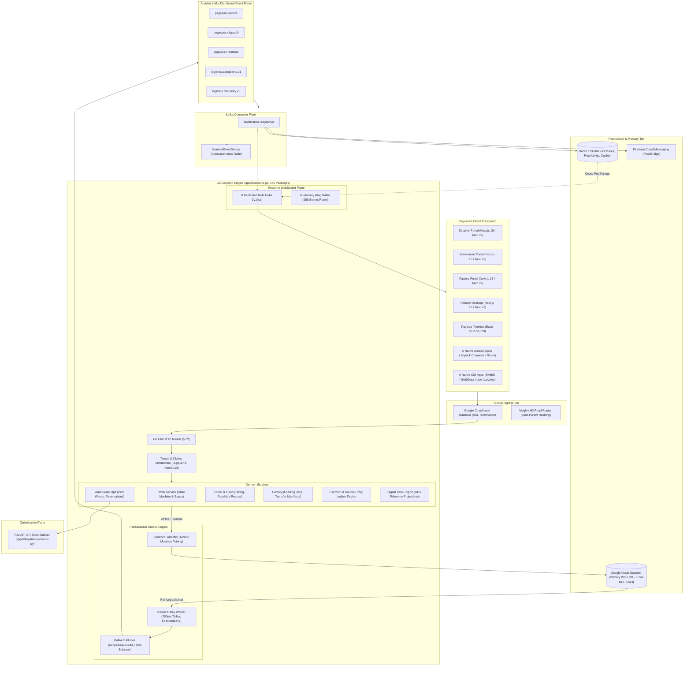
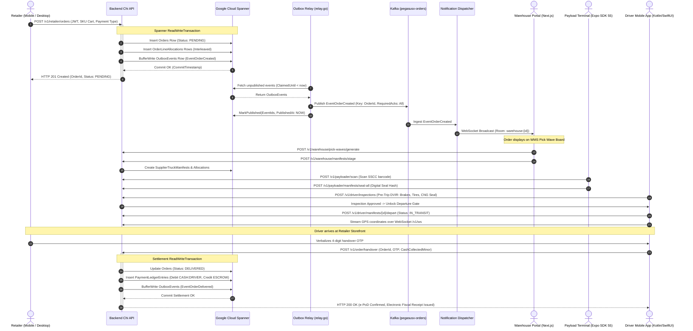

# PegasusX: Deep Architectural & System Engineering Specification

**Date:** 2026-09-21  
**Target Workspace:** `/Users/shakhzod/Desktop/V.O.I.D`  
**Systems Analyzed:**  
1. `pegasusX/` — Global Enterprise Multi-Tenant Cloud Architecture  
2. `pegasus.x/` — Sovereign Lean Single-Tenant National Operating Core  

---

## 1. Executive Summary & Core Identity

**PegasusX** is an enterprise-grade, wire-ready B2B supply chain, logistics, and retail operating system engineered for high-throughput Fast-Moving Consumer Goods (FMCG) distribution. It orchestrates the complete physical and digital lifecycle of goods across six core operational roles:

$$\text{Factory} \longrightarrow \text{Warehouse} \longrightarrow \text{Payload Dock} \longrightarrow \text{Fleet / Driver} \longrightarrow \text{Retailer Storefront} \longrightarrow \text{Doorstep e-PoD / Fiscal / Payout}$$

---

## 2. The Dual-System Workspace Architecture

Within the `/Users/shakhzod/Desktop/V.O.I.D` workspace, the codebase is structured into two parallel, non-contaminated architectural systems:

```
┌──────────────────────────────────────────────────────────────────────────────────────────────────┐
│                                 THE DUAL-SYSTEM ARCHITECTURAL MATRIX                             │
├───────────────────────────────────┬──────────────────────────────────────────────────────────────┤
│ Global Cloud Enterprise           │ Sovereign National Core                                      │
│ pegasusX/                         │ pegasus.x/                                                   │
├───────────────────────────────────┼──────────────────────────────────────────────────────────────┤
│ Multi-Tenant Distributed Cloud    │ Single-Tenant National Sovereign Appliance                   │
│ Global Footprint (UZ, EU, US, KZ) │ Uzbekistan National Territory (Servercore Tashkent Tier III) │
│ Google Cloud Spanner (3,749 DDL)  │ PostgreSQL 16 (timescaledb-ha:pg16, 69 Migrations)           │
│ Apache Kafka Distributed Bus      │ PostgreSQL Outbox + Redis 7 Streams & Pub/Sub                │
│ Go Backend (136 Packages)         │ Go Chi Backend (82 Packages)                                 │
│ Global Cell Router (Maglev H3)    │ Sovereign Ingress (Caddy 2, Direct TAS-IX Peering)         │
│ Google OR-Tools CVRP Sidecar      │ Python S&OP Engine (FastAPI, 2-Opt CVRP, Croston Forecast)   │
│ 8 WebSocket Role Hubs             │ Unified Monotonic Sequencing Hub (2,000-Event Ring Buffer)   │
│ 6 Native Android + 6 Native iOS   │ Telegram Bot (Grammy) + Telegram Mini App (Vite React 19)    │
│ Enterprise Next.js 15 Portals     │ Native Android/iOS Driver + Tauri v2 Desktops                │
│ Cloud Scale Budget ($10k+/mo)     │ Lean Appliance Budget ($139.70/mo)                           │
│ Multi-Jurisdictional Privacy      │ Uzbekistan Law No. ZRU-547 (Data Sovereignty)                │
└───────────────────────────────────┴──────────────────────────────────────────────────────────────┘
```

### The Strict Non-Contamination Rule
- **`pegasusX/`** is the multi-tenant distributed cloud flagship. Its persistence is strictly Google Cloud Spanner with composite partition keys (`SupplierId STRING(36)`), interleaved child tables, and Apache Kafka. It must never be downgraded into single-tenant relational models.
- **`pegasus.x/`** is the sovereign single-tenant appliance. It uses PostgreSQL 16 (`timescale/timescaledb-ha:pg16`), transactional outbox polling (`FOR UPDATE SKIP LOCKED`), and Redis 7 Streams. It must never import Spanner client libraries or Kafka brokers.

---

## 3. High-Level System Architecture Diagram (pegasusX)



---

## 4. Deep Dive: The 6 Core Subsystems

### 4.1 Persistence Plane: Google Cloud Spanner Schema Architecture
The persistence core is located in `pegasusX/apps/backend-go/schema/spanner.ddl` (3,749 lines, 220+ tables). Spanner shards tables horizontally across distributed nodes. To eliminate cross-split distributed transaction latency (Two-Phase Commit / 2PC), PegasusX applies three strict physical layout patterns:

#### 1. Multi-Tenant Root Partitioning (`SupplierId STRING(36)`)
Every business entity is partitioned by `SupplierId`:
- `Suppliers` (`spanner.ddl:11-22`) and `SupplierProfiles` (`spanner.ddl:37-69`): Primary key `(SupplierId)`.
- `Orders` (`spanner.ddl:169-208`): Mandatory `SupplierId STRING(36) NOT NULL`, with index `Idx_Orders_BySupplierCreated ON Orders(SupplierId, CreatedAt DESC)` (`spanner.ddl:212`).
- `OutboxEvents` (`spanner.ddl:685-697`): Holds `SupplierId STRING(64) NOT NULL` to support fair cross-tenant scheduling.

#### 2. Interleaved Child Tables (`INTERLEAVE IN PARENT ... ON DELETE CASCADE`)
Child entities are physically stored directly inside their parent row's storage splits, guaranteeing zero-network-hop colocation:
- `OrderShopClosedLog` interleaved in `Orders` (`(OrderId, EventId)`) (`spanner.ddl:1710-1718`)
- `OrderLineFiscalSnapshots` interleaved in `Orders` (`(OrderId, OrderLineId)`) (`spanner.ddl:1743-1754`)
- `OrderPaymentLegs` interleaved in `Orders` (`(OrderId, LegId)`) (`spanner.ddl:1807-1818`)
- `OrderLineAllocations` interleaved in `Orders` (`(OrderId, OrderLineId, WarehouseId)`) (`spanner.ddl:2039-2051`)
- `ManifestOrders` interleaved in `SupplierTruckManifests` (`(ManifestId, OrderId)`) (`spanner.ddl:959-969`)
- `PickWaveItems` interleaved in `PickWaves` (`(WaveId, ItemId)`) (`spanner.ddl:1300-1309`)

#### 3. Database-Enforced Financial Idempotency
- `Idx_OrderPaymentLegs_IdempotencyKey ON OrderPaymentLegs(IdempotencyKey)` (`spanner.ddl:1821-1822`) enforces strict uniqueness across payment transactions directly at the database engine level.

---

### 4.2 Transactional Outbox & Reliable Messaging Plane

To guarantee zero data loss without dual-write inconsistencies between Spanner and Kafka:

```
[ Domain Service Mutation ]
       │
       ▼ (Atomic Spanner ReadWriteTransaction via SpannerTxnBuffer)
┌────────────────────────────────────────────────────────┐
│ Spanner: Domain Entities + OutboxEvents Row Committed  │
└────────────────────────────────────────────────────────┘
       │
       ▼ (250ms Poller, Distributed Lease Claim)
┌────────────────────────────────────────────────────────┐
│ Go Outbox Relay Worker (apps/backend-go/outbox/relay.go)│
│ FairInterleave(candidates) across active SupplierIds   │
└────────────────────────────────────────────────────────┘
       │
       ▼ (RequiredAcks: All, Key: AggregateID)
┌────────────────────────────────────────────────────────┐
│ Apache Kafka Cluster (Partition-Keyed FIFO Stream)     │
└────────────────────────────────────────────────────────┘
       │
       ├─────────────────────────────────────────┐
       ▼                                         ▼
┌─────────────────────────────────┐     ┌────────────────────────────────────┐
│ Domain Consumers (Order, WMS,   │     │ Notification Dispatcher            │
│ Twin, AR Dunning)               │     │ (kafka/notification_dispatcher.go) │
│ Guard: SpannerEventDedup        │     └────────────────────────────────────┘
│ (ConsumerInbox Table)           │                      │
└─────────────────────────────────┘                      ▼
                                        ┌────────────────────────────────────┐
                                        │ 8 WebSocket Role Hubs              │
                                        │ + Redis Pub/Sub Fanout + FCM Push  │
                                        └────────────────────────────────────┘
```

1. **`SpannerTxnBuffer`**:
   In `apps/backend-go/outbox/spanner_txn_buffer.go`, domain repositories buffer entity mutations into a `spanner.ReadWriteTransaction`. When `Flush(ctx)` is executed, `OutboxEvents` rows are inserted in the exact same atomic transaction commit.
2. **Fair Interleaving & Distributed Leasing**:
   `apps/backend-go/outbox/spanner_store.go:88-195` claims unpublished events by setting `ClaimedBy = "relay-" + uuid` and `ClaimedUntil = now + 2m`. `FairInterleave(candidates, limit)` (`apps/backend-go/outbox/fair.go`) round-robins events across active `SupplierId`s, preventing high-volume suppliers from starving others.
3. **Poison Message Dead-Lettering**:
   Events failing publish more than 20 times (`MaxTotalAttempts = 20`) are transferred atomically to the `OutboxDeadLetters` table (`spanner.ddl:704-715`) with error diagnostics and purged from `OutboxEvents`.
4. **Consumer Idempotency**:
   Consumers wrap handlers in `SpannerEventDedup` (`apps/backend-go/kafka/spanner_event_dedup.go`). The consumer writes a composite `DedupKey` into the `ConsumerInbox` table in Spanner; duplicate Kafka events are safely ignored.

---

### 4.3 Realtime WebSocket Hub & Mobile Push Infrastructure

The realtime tier is implemented in `apps/backend-go/ws/`:
- **8 Multiplexed Role Hubs**: In `ws/handler.go:36-43`, connections to `GET /v1/ws` are authenticated via JWT claims and mapped into:
  - `RetailerHub`, `SupplierHub`, `DriverHub`, `PayloadHub`, `WarehouseHub`, `FactoryHub`, `TelemetryHub`, `PlatformAdminHub`.
- **Cross-Pod Redis Fanout**: In `ws/hub.go:58-100`, hubs publish room events across pods via Redis channel `ws:<hub>:fanout`. If Redis is temporarily unavailable, local delivery falls back open gracefully.
- **Reconnect Replay Ring Buffer**: Hubs maintain an in-memory ring buffer of the last 256 events per room. Reconnecting clients passing `?since_seq=...` receive missed events without dropping UI state.
- **Kafka-to-WebSocket Bridge**: `kafka/notification_dispatcher.go` ingests events from Kafka, fans out to the appropriate WebSocket rooms, triggers Firebase Cloud Messaging (FCM) pushes for background mobile devices, and writes persistent in-app notifications.

---

### 4.4 Fleet, Dispatch & CVRP Optimization Plane

1. **Uber H3 Spatial Indexing**:
   PegasusX indexes spatial entities into Uber H3 hexagonal cells:
   - Resolution 7 (~5 km²) for dispatch catchment perimeters and driver clustering.
   - Resolution 9 (~0.1 km²) for retail shop dropoffs and micro-settlements.
2. **Maglev H3 Read Router Specification**:
   Prototyped in `pegasus/apps/backend-go/bootstrap/spannerrouter/router.go:182-210`, this pattern maps real-time H3 resolution 7 cells to resolution 2 macro-cells (~90,000 km²) using a **50ns bitmask shift**, routing queries to regional Spanner read replicas (`asia`, `eu`, `us`) while preserving the primary database write invariant for `ReadWriteTransactions`.
3. **Google OR-Tools CVRP Solver Sidecar**:
   Located in `apps/dispatch-optimizer-py/main.py`:
   - Solves Capacitated Vehicle Routing Problems (CVRP) with time windows (`window_open`, `window_close`) and volumetric capacity (`tetris_buffer = 0.95`).
   - **Multi-Wave Virtual Cloning**: When cargo demand exceeds fleet capacity, the solver creates virtual vehicle clones (`math.ceil(total_demand / total_capacity)`), allowing physical trucks to run sequential multi-wave delivery loops.
   - Optimization utilizes `PATH_CHEAPEST_ARC` for initial solutions and `GUIDED_LOCAL_SEARCH` metaheuristics.

---

### 4.5 Financial Precision, UMP & Fiscal Compliance

1. **64-Bit Integer Minor Currency Units**:
   Zero floating-point arithmetic is permitted for monetary sums. All prices, totals, and balances are stored as 64-bit signed integers (`int64`) in Uzbekistan Tiyins ($1\text{ UZS} = 100\text{ tiyins}$).
2. **Double-Entry General Ledger (GL)**:
   Every delivery completion, doorstep cash collection, or return generates balanced postings:
   $$\sum \text{Debits} = \sum \text{Credits}$$
   Standard Chart of Accounts:
   - `CASH:DRIVER:<driver_id>` (Debit upon cash collection)
   - `PSP:GATEWAY:GLOBAL_PAY` (Debit upon card payment)
   - `ESCROW:ORDER:<order_id>` (Credit extinguishing delivery liability)
   - `AR:RETAILER:<retailer_id>` (Debit for credit shortfalls or Nasiya terms)
3. **Statutory Tax Invariants & Uzbekistan Limits**:
   - 12.00% VAT calculated using basis points (`DefaultVatRateBps = 1200`, `BasisPointDivisor = 10000`).
   - Banker's half-up integer rounding (`HalfUpOffset = 5000`).
   - Uzbekistan Tax Code Article 341 B2B Cash Limit: Cash transactions are capped at **25,000,000 UZS** ($2,500,000,000\text{ tiyins}$) per transaction.
4. **Universal Mutation Protocol (UMP)**:
   Implemented in `backend/internal/ump/engine.go:40-155`, once orders enter `IN_TRANSIT`, destructive updates are blocked. Discrepancies are appended to `entity_adjustments`. If the adjustment is within the auto-approval ceiling (600,000 UZS), credit notes and Soliq corrective invoices (`TUZATUVCHI`) are generated automatically.

---

## 5. End-to-End Operational Lifecycle: The 6-Role Loop



---

## 6. Client Application Ecosystem & Code Generation

PegasusX features a client fleet spanning **18 frontend and mobile projects**:

### 6.1 Web Portals & Desktop Applications
- **Tech Stack**: Next.js 15, React 19, Tailwind CSS v4, HeroUI, TanStack React Query.
- **Desktop Packaging**: Packaged via **Tauri v2** (`@tauri-apps/api: ^2.11.0`) with `@tauri-apps/plugin-sql` managing local SQLite caches (`pegasus_desktop_cache.db` with offline `pending_commands`).
- **Applications**:
  - `supplier-portal` (`apps/supplier-portal/`): S&OP control tower, catalog management, pricing matrices, and fleet dispatch map.
  - `warehouse-portal` (`apps/warehouse-portal/`): 37 WMS routes for bin staging, wave picking, inventory counts, and dock bays.
  - `factory-portal` (`apps/factory-portal/`): Inter-facility transfer manifests, bulk supply requests, and palletizing lines.
  - `retailer-app-desktop` (`apps/retailer-app-desktop/`): POS checkout, store stock scanning, and supplier credit balance inspection.
  - `admin-portal` (`apps/admin-portal/`): Platform governance, dual-control feature flags, tenant provisioning, and dead-letter replay.

### 6.2 Universal Payload Terminal
- Located in `apps/payload-terminal/`.
- Built on **Expo SDK 55** (React Native 0.83). Supports rugged warehouse handhelds (Zebra, Honeywell) and tablets with continuous hardware barcode scanning, pallet SSCC generation, and dock manifest digital seal signing (`POST /v1/payloader/manifests/seal-all`).

### 6.3 Native Mobile Applications (Android & iOS)
- **6 Native Android Apps** (`apps/*-app-android/`):
  - Built with Kotlin 2.x, Jetpack Compose BOM 2024.12, Hilt DI, Room SQLite, Retrofit, AndroidX WorkManager, CameraX, and Google ML Kit barcode scanning.
  - Includes linear Kalman filters (`KalmanLocationFilter.kt`) for smoothing GPS drift in dense urban street canyons.
- **6 Native iOS Apps** (`apps/*-app-ios/`):
  - Built with Swift 6, SwiftUI, Swift Concurrency (`async`/`await`), SwiftData local caching, and Apple CoreLocation.
  - Includes Live Activities and Dynamic Island widgets (`DeliveryActivityWidget.swift`) providing drivers with real-time ETA and next-stop navigation prompts directly on the lock screen.
- **Subterranean Offline Signing**:
  When drivers deliver goods to basement grocery stores lacking cellular connectivity, on-device signing generates an HMAC-SHA256 digital receipt, queueing delivery records locally in Room/SwiftData for automated batch synchronization upon network restoration.

### 6.4 Contract Pipeline & Code Generation
- The Go backend AST in `apps/backend-go/events/events.go` is the single source of truth for all events.
- Running `go run ./apps/backend-go/cmd/gen-contracts` generates:
  - Unified JSON Schemas (`contracts/events.schema.json`).
  - TypeScript definitions in `@pegasusx/types`.
  - Native models via Quicktype in Android Gradle and iOS Xcode build phases (`PegasusWSEventEnvelope.kt` and `PegasusWSEventEnvelope.swift`).

---

## 7. Primary Directory Map (`pegasusX/`)

| Path | Description |
|:---|:---|
| `apps/backend-go/` | 136-package Go backend engine with Chi router, outbox, and WebSocket hubs |
| `apps/backend-go/schema/spanner.ddl` | Canonical Google Cloud Spanner DDL (3,749 lines, 220+ tables) |
| `apps/backend-go/outbox/` | Transactional outbox buffer, fair interleaver, and Kafka relay worker |
| `apps/backend-go/ws/` | 8 multiplexed role WebSocket hubs, replay ring buffers, and connection shedding |
| `apps/backend-go/kafka/` | Kafka consumer workers and `SpannerEventDedup` idempotency guards |
| `apps/dispatch-optimizer-py/` | Python FastAPI sidecar running Google OR-Tools CVRP optimization |
| `apps/payload-terminal/` | Expo SDK 55 cross-platform barcode scanning and digital seal terminal |
| `apps/driver-app-android/` | Native Android driver app (Jetpack Compose, Room, WorkManager, DVIR) |
| `apps/driver-app-ios/` | Native iOS driver app (SwiftUI, SwiftData, Live Activities, Dynamic Island) |
| `apps/supplier-portal/` | Supplier desktop/web portal (Next.js 15, Tauri v2, HeroUI) |
| `apps/warehouse-portal/` | Warehouse desktop/web WMS portal (Next.js 15, Tauri v2) |
| `apps/factory-portal/` | Factory desktop/web portal (Next.js 15, Tauri v2) |
| `docs/DUAL_SYSTEM_ARCHITECTURE_AND_PARITY.md` | Master architectural specification comparing `pegasusX` and `pegasus.x` |
