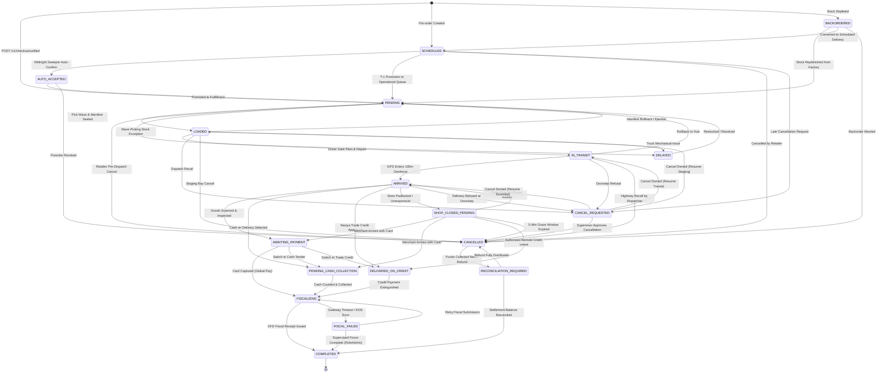
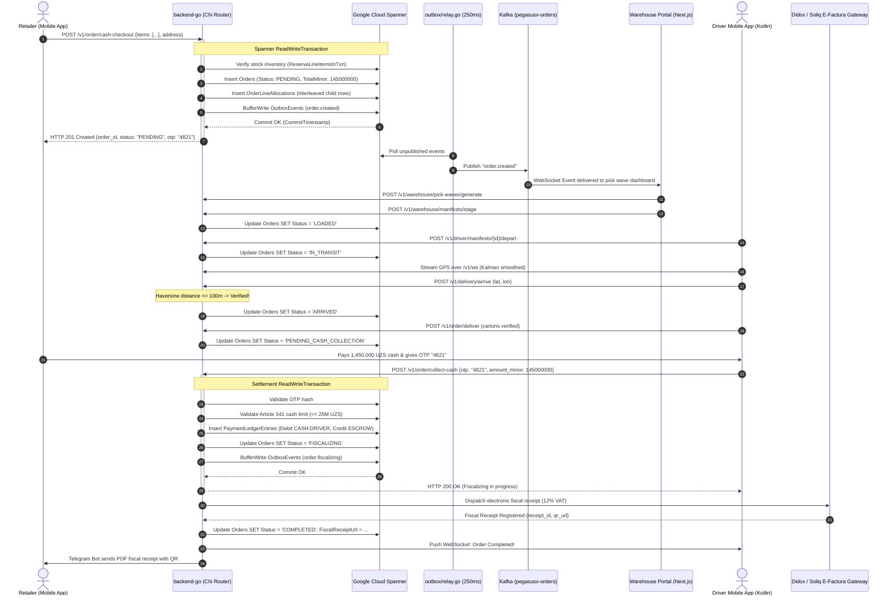

# PegasusX: Exhaustive Order Lifecycle Specification

**Date:** 2026-09-23  
**Target Workspace:** `/Users/shakhzod/Desktop/V.O.I.D`  
**Authoritative Code Sources:**  
- State Constants & Aggregate: [`apps/backend-go/order/service.go`](apps/backend-go/order/service.go)  
- State Machine Transition Graph: [`apps/backend-go/order/state_machine.go`](apps/backend-go/order/state_machine.go)  
- HTTP Routes & Role Middleware: [`apps/backend-go/orderroutes/routes.go`](apps/backend-go/orderroutes/routes.go), [`driverroutes/routes.go`](apps/backend-go/driverroutes/routes.go), [`retailerroutes/routes.go`](apps/backend-go/retailerroutes/routes.go)  
- Outbox Atomicity: [`apps/backend-go/outbox/spanner_txn_buffer.go`](apps/backend-go/outbox/spanner_txn_buffer.go)  
- Schema Definition: [`apps/backend-go/schema/spanner.ddl`](apps/backend-go/schema/spanner.ddl) (`Orders`, `OrderLineAllocations`, `OrderPaymentLegs`, `OrderShopClosedLog`)  

---

## 1. Executive Overview

The **PegasusX Order Lifecycle** is a deterministic, event-driven finite state machine governing B2B Fast-Moving Consumer Goods (FMCG) transactions. Every order transition is bound by three strict architectural guarantees:

1. **Transactional Outbox Atomicity:** State changes in Google Cloud Spanner and their corresponding `OutboxEvents` rows commit inside the exact same `spanner.ReadWriteTransaction` via `SpannerTxnBuffer`.
2. **ADR-009 Fiscal Hard-Gate:** No order may transition directly from an operational delivery state (`ARRIVED`, `AWAITING_PAYMENT`, `PENDING_CASH_COLLECTION`) to `COMPLETED`. An order **MUST** traverse `FISCALIZING`, where an electronic fiscal tax receipt (Uzbekistan Soliq / OFD e-Factura) is verified.
3. **Integer Currency Minor Units:** All financial sums (order line prices, taxes, cash collected, credit balances) are strictly calculated and stored as 64-bit signed integers (`int64` / `BIGINT`) in minor currency units (Uzbekistan Tiyins: $1\text{ UZS} = 100\text{ tiyins}$). Floating-point numbers are prohibited.

---

## 2. Order State Taxonomy (The 18 Canonical States)

From [`apps/backend-go/order/service.go:52-71`](apps/backend-go/order/service.go#L52-L71):

| Status Constant | Code String | Category | Description |
|:---|:---|:---|:---|
| `StatusPending` | `"PENDING"` | Warehouse Queue | Order created, lines reserved in stock inventory, awaiting pick wave assignment. |
| `StatusLoaded` | `"LOADED"` | Depot Staging | Wave picked, packed, and assigned to a truck manifest. |
| `StatusInTransit` | `"IN_TRANSIT"` | Highway Transit | Digital seal verified (`seal-all`); truck has departed depot. |
| `StatusArrived` | `"ARRIVED"` | Doorstep | Driver has arrived within the verified 100m geofence of retailer store. |
| `StatusShopClosedPending` | `"SHOP_CLOSED_PENDING"` | Exception | Storefront locked during business hours; 5-minute grace countdown active. |
| `StatusAwaitingPayment` | `"AWAITING_PAYMENT"` | Settlement | Goods offloaded and verified; awaiting payment tender selection. |
| `StatusPendingCashCollection`| `"PENDING_CASH_COLLECTION"` | Settlement | Cash selected; driver counting physical banknotes at doorstep. |
| `StatusDeliveredOnCredit` | `"DELIVERED_ON_CREDIT"` | Settlement | Goods left on Nasiya trade credit under approved credit limit. |
| `StatusFiscalizing` | `"FISCALIZING"` | Compliance | Payment recorded; electronic fiscal receipt transmission in-flight. |
| `StatusFiscalFailed` | `"FISCAL_FAILED"` | Exception | OFD gateway timeout ($>8\text{s}$) or tax signature failure; awaiting retry. |
| `StatusCompleted` | `"COMPLETED"` | Terminal | Payment settled and tax receipt registered. Immutable terminal state. |
| `StatusCancelled` | `"CANCELLED"` | Terminal | Order cancelled pre-dispatch or terminated post-shop-closed grace timeout. |
| `StatusCancelRequested` | `"CANCEL_REQUESTED"` | Gate | Late cancellation requested mid-transit; requires supervisor adjudication. |
| `StatusReconciliationRequired` | `"RECONCILIATION_REQUIRED"` | Accounting | Cancelled order with previously captured funds requiring ledger refund. |
| `StatusDelayed` | `"DELAYED"` | Warehouse Queue | Temporary warehouse stockout or dock issue; queued for next shift wave. |
| `StatusBackordered` | `"BACKORDERED"` | Pre-Fulfillment | Items out of stock at checkout; awaiting inbound factory transfer. |
| `StatusScheduled` | `"SCHEDULED"` | Planning | Future-dated pre-order awaiting operational promotion date. |
| `StatusAutoAccepted` | `"AUTO_ACCEPTED"` | Planning | Pre-order confirmed by automated replenishment engine; waiting for T-1 day. |

---

## 3. Order Origin & Intake Sources (`OrderSource`)

From [`apps/backend-go/order/service.go:73-84`](apps/backend-go/order/service.go#L73-L84):

- `MANUAL`: Placed directly by retailer via Mobile App, Desktop POS, or Telegram Mini App.
- `MANUAL_PREORDER`: Future-dated booking submitted by merchant for scheduled delivery.
- `AI_PREORDER`: AI demand forecasting engine generated order based on historical sales velocity.
- `BACKORDER`: Automatically created when high-demand catalog items temporarily exhaust warehouse safety stock.
- `AUTO_ORDER`: Touchless autonomous replenishment order triggered by in-store stock sensors and the Croston forecast model.
- `PARTNER_EDI`: Electronic Data Interchange order ingested via AS2 / 1C CommerceML / EDIFACT `ORDERS`.
- `PARTNER_SANDBOX`: Developer sandbox test order.

---

## 4. Complete State Machine Transition Graph

Enforced in [`apps/backend-go/order/state_machine.go:14-81`](apps/backend-go/order/state_machine.go#L14-L81):



---

## 5. Transition Rules & API Trigger Matrix

| From State | To State | HTTP Route | Authorized Roles | Business Rules & Invariants |
|:---|:---|:---|:---|:---|
| `[*] / CART` | `PENDING` | `POST /v1/checkout/unified`<br/>`POST /v1/order/cash-checkout` | `RETAILER` | Atomic stock reservation (`ReserveLineItemsInTxn`). Emits `order.created`. |
| `PENDING` | `LOADED` | `POST /v1/warehouse/manifests/stage` | `WAREHOUSE`, `ADMIN` | Pick wave verified. Interleaves child rows into `SupplierTruckManifests`. |
| `PENDING` | `CANCELLED` | `POST /v1/order/cancel` | `RETAILER`, `ADMIN` | Stock reservations released immediately. Blocked if manifest is freeze-locked. |
| `PENDING` | `DELAYED` | `POST /v1/warehouse/ops/orders/{id}/delay` | `WAREHOUSE_ADMIN` | Staging exception recorded. Reason required. |
| `LOADED` | `IN_TRANSIT` | `POST /v1/driver/manifests/{id}/depart` | `DRIVER`, `FACTORY_DRIVER` | Digital seal verified (`seal-all`). Departure gate pass scanned. |
| `IN_TRANSIT`| `ARRIVED` | `POST /v1/delivery/arrive` | `DRIVER` | Geofence Hard-Gate: Haversine distance from driver GPS to store $\le 100\text{m}$. |
| `ARRIVED` | `SHOP_CLOSED_PENDING` | `POST /v1/delivery/shop-closed` | `DRIVER` | Geo-tagged photo required (`photo_url`). Starts 5-minute countdown grace timer. |
| `SHOP_CLOSED_PENDING` | `CANCELLED` | `worker_shop_closed.go` | Background Worker | Timer expires without merchant response. Order marked for return-to-depot. |
| `ARRIVED` | `AWAITING_PAYMENT` | `POST /v1/order/deliver` | `DRIVER` | Physical barcodes scanned. Carton condition verified intact. |
| `ARRIVED` | `PENDING_CASH_COLLECTION` | `POST /v1/order/deliver` (Method: CASH) | `DRIVER` | Retailer elects to pay physical bank notes at doorstep. |
| `ARRIVED` | `DELIVERED_ON_CREDIT` | `POST /v1/driver/orders/{id}/credit-leave` | `DRIVER` | System verifies `CanLeaveOnCredit` check against debtor credit quota. |
| `PENDING_CASH_COLLECTION` | `FISCALIZING` | `POST /v1/order/collect-cash` | `DRIVER` | Doorstep OTP verified. Cash bag check: total $\le 25,000,000\text{ UZS}$. |
| `AWAITING_PAYMENT` | `FISCALIZING` | `POST /v1/order/complete` | `DRIVER`, `RETAILER` | Global Pay card session captured. Debit `PSP:GATEWAY`, Credit `ESCROW`. |
| `FISCALIZING` | `COMPLETED` | `fiscal/worker.go` | Background Worker | Soliq / Didox e-Factura receipt issued. QR code stored in `Orders`. |
| `FISCALIZING` | `FISCAL_FAILED` | `fiscal/worker.go` | Background Worker | OFD timeout ($>8\text{s}$) or signature error. Order flagged for retry. |
| `FISCAL_FAILED`| `FISCALIZING` | `POST /v1/order/{id}/fiscal/retry` | `DRIVER`, `ADMIN`, `WAREHOUSE_ADMIN`| Re-submits invoice payload with exponential backoff. |
| `FISCAL_FAILED`| `COMPLETED` | `POST /v1/order/{id}/force-complete` | `ADMIN`, `WAREHOUSE_ADMIN` | Supervised bypass. Requires `SupervisorToken` and formal audit reason. |

---

## 6. End-to-End Sequence: The Happy Path (Cash on Delivery)



---

## 7. Critical Edge Cases & Failure Recovery Paths

### 7.1 ADR-009 Fiscal Hard-Gate & Timeout Recovery
- **The Invariant:** Direct transitions from `ARRIVED`, `AWAITING_PAYMENT`, or `PENDING_CASH_COLLECTION` to `COMPLETED` are blocked by `state_machine.go:76-78`.
- **Failure Mode:** If the state tax gateway (Soliq / Didox) times out ($>8\text{s}$) or rejects the electronic digital signature (EDS), the background fiscal worker transitions the order to `FISCAL_FAILED`.
- **Recovery Paths:**
  1. **Automated Retry:** `POST /v1/order/{id}/fiscal/retry` triggers exponential backoff resubmission.
  2. **Emergency Supervised Force-Complete:** If the tax authority network suffers a multi-hour national blackout, `POST /v1/order/{id}/force-complete` allows `ADMIN` or `WAREHOUSE_ADMIN` to finalize the delivery. This endpoint strictly requires a `SupervisorToken` and an audited justification reason (`force_reason`).

### 7.2 The 5-Minute Shop-Closed Protocol
- **Trigger:** Driver arrives at retailer premises, but the shop is shuttered or padlocked.
- **Workflow:**
  1. Driver calls `POST /v1/delivery/shop-closed`, uploading geo-tagged photo evidence of the closed storefront (`photo_url`).
  2. Order enters `SHOP_CLOSED_PENDING`, and Spanner records `ShopClosedAt = NOW()` and `GraceEndsAt = NOW() + 5m`.
  3. The backend sends automated high-priority push notifications and Telegram alerts to the store owner: *"Driver is waiting outside your shop. Delivery will abort in 5:00 minutes."*
  4. **Branch A (Owner Arrives):** If the owner unlocks the store, driver calls `POST /v1/retailer/orders/{id}/shop-closed/respond` with resolution `ACCEPTED`, resuming fulfillment to `ARRIVED` or `AWAITING_PAYMENT`.
  5. **Branch B (Grace Expires):** If the 5-minute timer expires, `worker_shop_closed.go` evaluates credit policy:
     - If the retailer has a pre-authorized unattended credit agreement (`CanLeaveOnCredit` and order $\le 500,000\text{ UZS}$), the driver deposits crates at a designated secure dropsite; status $\rightarrow$ `DELIVERED_ON_CREDIT`.
     - Otherwise, status transitions to `CANCELLED`; cargo remains locked in truck for depot return.

### 7.3 Partial Offload & Discrepancy Accounting
- **Trigger:** Retailer inspects order and finds 2 out of 10 cases damaged or refuses slow-moving SKUs.
- **Workflow:**
  1. Driver taps "Partial Delivery" in mobile app, calling `POST /v1/delivery/partial-offload`.
  2. Driver inputs:
     ```json
     {
       "order_id": "ord_99812",
       "lines": [
         {
           "sku": "SODA-1.5L",
           "delivered_qty": 8,
           "remaining_qty": 2,
           "offload_status": "PARTIAL",
           "offload_reason": "DAMAGED_CARTON"
         }
       ]
     }
     ```
  3. The backend recalculates monetary totals:
     $$\text{TotalDeliveredMinor} = \sum (\text{DeliveredQty} \times \text{UnitPriceMinor})$$
  4. The order's `EffectiveTotalMinor` is updated, and the returned units are automatically scheduled for driver return-to-depot upon shift completion.

### 7.4 Mid-Transit Cancellation Interceptor (`CANCEL_REQUESTED`)
- **Trigger:** Retailer attempts to cancel an order after the truck has already departed the warehouse.
- **Workflow:**
  1. Because manifest freeze-locks prevent instant cancellation post-dispatch, calling `POST /v1/order/cancel` sets status to `CANCEL_REQUESTED`.
  2. This status acts as an operational interceptor, preventing the order from being bricked while alerting the driver's mobile cockpit: *"Cancellation requested by merchant."*
  3. **Resolution:**
     - If the dispatcher authorizes the cancellation, status transitions to `CANCELLED`.
     - If the cancellation is denied (e.g. customized perishable cargo), the order returns safely to its previous active leg (`LOADED`, `IN_TRANSIT`, or `ARRIVED`) via `state_machine.go:56`.

---

## 8. Summary Checklist of Order Lifecyle Invariants

- [x] **No soft completion:** Every order completing delivery MUST touch `FISCALIZING`.
- [x] **No floating-point money:** All prices, totals, and balances are 64-bit integer tiyins.
- [x] **Idempotent transitions:** Calling a state transition with `from == to` returns `200 OK` safely.
- [x] **Strict terminal states:** An order in `COMPLETED` can NEVER transition to any other status.
- [x] **Geofenced arrival:** Driver cannot mark `ARRIVED` beyond 100 meters of the merchant's coordinates.
- [x] **Statutory cash limit:** Doorstep cash collection strictly barred above 25,000,000 UZS.
- [x] **Subterranean signing:** Basement offline deliveries sign on-device via HMAC-SHA256 and sync via WorkManager batch queues without data loss.
