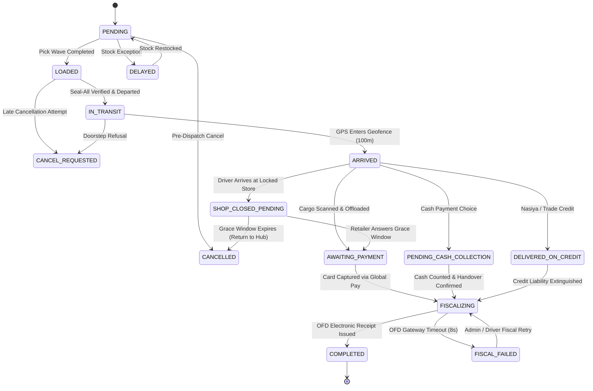
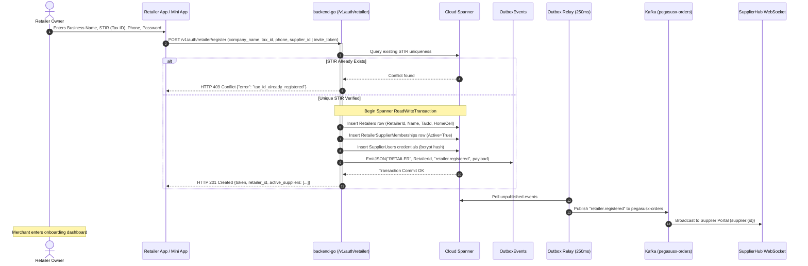
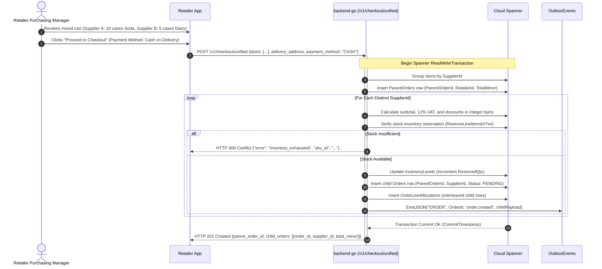
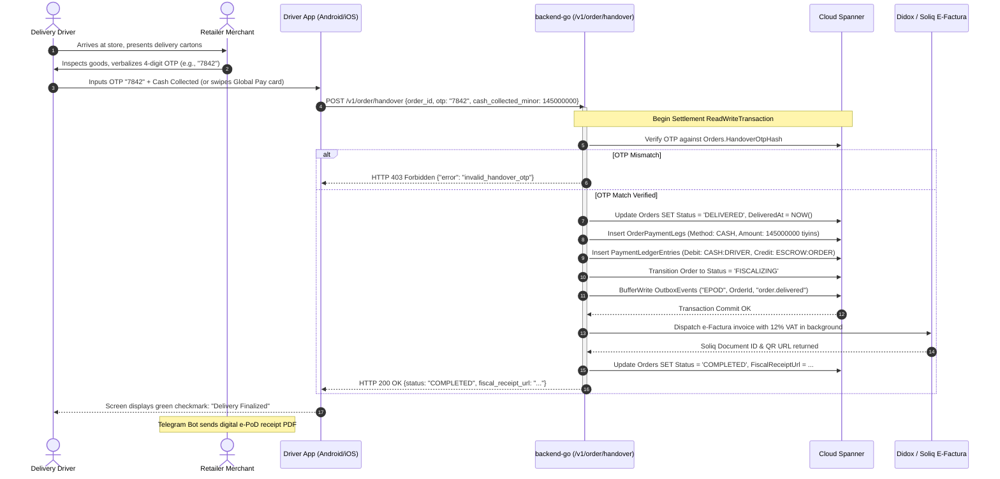
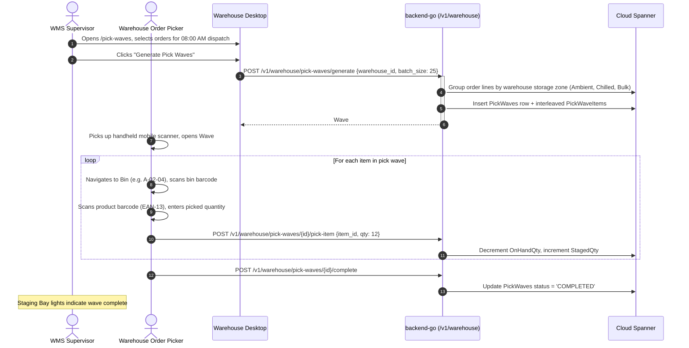
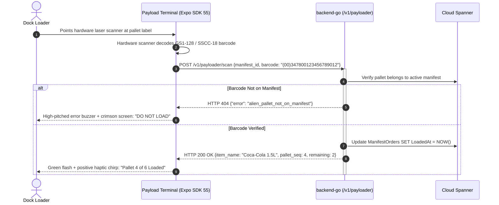
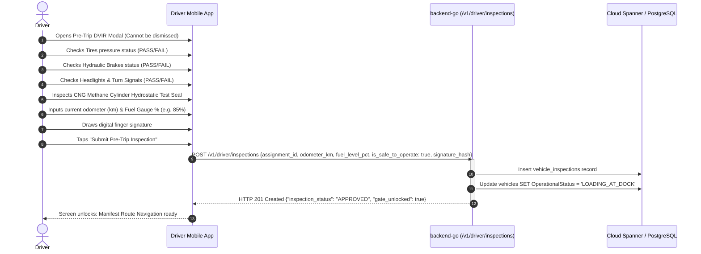

# PegasusX: Exhaustive End-to-End User Flows Specification

**Date:** 2026-09-23  
**Target Workspace:** `/Users/shakhzod/Desktop/V.O.I.D`  
**Authoritative Subsystems:** `pegasusX/` (Cloud Spanner + Kafka + Go Chi + Next.js 15 / Tauri v2 + Native Mobile) and `pegasus.x/` (PostgreSQL 16 + Redis 7 Streams + Telegram Commerce + Native Mobile)

---

## Table of Contents
1. [Architectural State Engine & Global Flow Primitives](#1-architectural-state-engine--global-flow-primitives)
2. [Retailer User Flows (Storefront & In-Store Operations)](#2-retailer-user-flows-storefront--in-store-operations)
   - [Flow R1: Merchant Registration, Multi-Supplier Attachment & Org Switching](#flow-r1-merchant-registration-multi-supplier-attachment--org-switching)
   - [Flow R2: Catalog Discovery, Tiered Pricing & Search](#flow-r2-catalog-discovery-tiered-pricing--search)
   - [Flow R3: Multi-Supplier Cart & Split Checkout (ParentOrders -> Child Orders)](#flow-r3-multi-supplier-cart--split-checkout-parentorders---child-orders)
   - [Flow R4: Pre-Order, Backorder & S&OP Auto-Order Execution](#flow-r4-pre-order-backorder--sop-auto-order-execution)
   - [Flow R5: Live Order Tracking, Proximity Radar & Push Notifications](#flow-r5-live-order-tracking-proximity-radar--push-notifications)
   - [Flow R6: Doorstep Handover, 4-Digit OTP & Payment Settlement (Cash/Card/Credit)](#flow-r6-doorstep-handover-4-digit-otp--payment-settlement-cashcardcredit)
   - [Flow R7: Concealed Damage Claims & UMP Dispute Sagas](#flow-r7-concealed-damage-claims--ump-dispute-sagas)
   - [Flow R8: Retail OS In-Store Management (Inventory, Barcode Receiving, POS & Shifts)](#flow-r8-retail-os-in-store-management-inventory-barcode-receiving-pos--shifts)
3. [Supplier User Flows (Commercial, Pricing & Command Tower)](#3-supplier-user-flows-commercial-pricing--command-tower)
   - [Flow S1: Supplier Onboarding Gate & Payment Gateway Configuration](#flow-s1-supplier-onboarding-gate--payment-gateway-configuration)
   - [Flow S2: Dynamic Product Catalog, VAT & Customer Price Tier Management](#flow-s2-dynamic-product-catalog-vat--customer-price-tier-management)
   - [Flow S3: Realtime Operational Control Tower & Scored Exception Management](#flow-s3-realtime-operational-control-tower--scored-exception-management)
   - [Flow S4: S&OP Replenishment, Croston Demand Forecasting & Digital Brain](#flow-s4-sop-replenishment-croston-demand-forecasting--digital-brain)
   - [Flow S5: Dispatch Run Optimization & Vehicle Fleet Capacity Fitting](#flow-s5-dispatch-run-optimization--vehicle-fleet-capacity-fitting)
   - [Flow S6: Accounts Receivable (AR), Aging Dunning & Payout Batch Settlement](#flow-s6-accounts-receivable-ar-aging-dunning--payout-batch-settlement)
4. [Warehouse (WMS) User Flows (Internal Depot & Stock Execution)](#4-warehouse-wms-user-flows-internal-depot--stock-execution)
   - [Flow W1: Inbound Receiving, PO Verification & Batch/Lot Tracking](#flow-w1-inbound-receiving-po-verification--batchlot-tracking)
   - [Flow W2: Dynamic Bin Location Staging & Putaway Routing](#flow-w2-dynamic-bin-location-staging--putaway-routing)
   - [Flow W3: Order Release & Batch/Zone Pick Wave Execution](#flow-w3-order-release--batchzone-pick-wave-execution)
   - [Flow W4: Packing, Pallet Staging & Cold-Chain Probe Verification](#flow-w4-packing-pallet-staging--cold-chain-probe-verification)
   - [Flow W5: Manifest Staging, Freeze-Lock Enforcement & Loading Bay Pairing](#flow-w5-manifest-staging-freeze-lock-enforcement--loading-bay-pairing)
   - [Flow W6: Inventory Auditing & Blind Cycle Counts](#flow-w6-inventory-auditing--blind-cycle-counts)
5. [Payload Dock Operator User Flows (Physical Freight Integrity)](#5-payload-dock-operator-user-flows-physical-freight-integrity)
   - [Flow P1: Rugged Scanner Authentication & Loading Bay Assignment](#flow-p1-rugged-scanner-authentication--loading-bay-assignment)
   - [Flow P2: Continuous Pallet Barcode Scanning & SSCC-18 Verification](#flow-p2-continuous-pallet-barcode-scanning--sscc-18-verification)
   - [Flow P3: Load Volumetric Validation & Variance Overrides](#flow-p3-load-volumetric-validation--variance-overrides)
   - [Flow P4: Digital Seal Application (Seal-All Cryptographic Lock)](#flow-p4-digital-seal-application-seal-all-cryptographic-lock)
   - [Flow P5: Dockside Discrepancy Reporting & Cargo Rejection](#flow-p5-dockside-discrepancy-reporting--cargo-rejection)
6. [Driver / Courier User Flows (Last-Mile Fleet Execution)](#6-driver--courier-user-flows-last-mile-fleet-execution)
   - [Flow D1: Shift Authentication & Bijective Vehicle Pairing](#flow-d1-shift-authentication--bijective-vehicle-pairing)
   - [Flow D2: Pre-Trip Inspection (DVIR Safety Gate & CNG Cylinder Verification)](#flow-d2-pre-trip-inspection-dvir-safety-gate--cng-cylinder-verification)
   - [Flow D3: Departure Gate Pass & Manifest Lock Release](#flow-d3-departure-gate-pass--manifest-lock-release)
   - [Flow D4: Turn-by-Turn Navigation & Realtime GPS Telemetry Streaming](#flow-d4-turn-by-turn-navigation--realtime-gps-telemetry-streaming)
   - [Flow D5: Doorstep Arrival, Geofence Proximity Unlock & QR Handshake](#flow-d5-doorstep-arrival-geofence-proximity-unlock--qr-handshake)
   - [Flow D6: Physical Cargo Offload: Full vs Partial Offload vs Shop-Closed Grace](#flow-d6-physical-cargo-offload-full-vs-partial-offload-vs-shop-closed-grace)
   - [Flow D7: Doorstep Payment Settlement (Cash Bag, Card Settle, Credit Leave)](#flow-d7-doorstep-payment-settlement-cash-bag-card-settle-credit-leave)
   - [Flow D8: Subterranean Offline Mode (Basement Store Delivery & Batch Sync)](#flow-d8-subterranean-offline-mode-basement-store-delivery--batch-sync)
   - [Flow D9: Mid-Route Roadside Breakdown & SOS Rescue Hot-Swap](#flow-d9-mid-route-roadside-breakdown--sos-rescue-hot-swap)
   - [Flow D10: Post-Trip Inspection, Cash Turn-In & Tara Container Handover](#flow-d10-post-trip-inspection-cash-turn-in--tara-container-handover)
7. [Factory Production Operator User Flows (Upstream Manufacturing)](#7-factory-production-operator-user-flows-upstream-manufacturing)
   - [Flow F1: Finished Goods Production Lot Staging & Barcode Generation](#flow-f1-finished-goods-production-lot-staging--barcode-generation)
   - [Flow F2: Inter-Facility Supply Request Processing & QC Inspection](#flow-f2-inter-facility-supply-request-processing--qc-inspection)
   - [Flow F3: Factory Truck Manifest Staging & Pallet Loading Bay Dispatch](#flow-f3-factory-truck-manifest-staging--pallet-loading-bay-dispatch)
8. [Platform Administrator User Flows (Governance & Infrastructure)](#8-platform-administrator-user-flows-governance--infrastructure)
   - [Flow A1: Multi-Tenant Provisioning & Regional Cell Routing Directory](#flow-a1-multi-tenant-provisioning--regional-cell-routing-directory)
   - [Flow A2: Dual-Control Feature Flag Proposal & Approval](#flow-a2-dual-control-feature-flag-proposal--approval)
   - [Flow A3: Outbox Dead-Letter Queue (DLQ) Replay & Ingestion Recovery](#flow-a3-outbox-dead-letter-queue-dlq-replay--ingestion-recovery)
   - [Flow A4: Platform SLO Monitoring & Billing Fee Schedule Reconciliation](#flow-a4-platform-slo-monitoring--billing-fee-schedule-reconciliation)

---

## 1. Architectural State Engine & Global Flow Primitives

Every user flow in PegasusX is bound by four non-negotiable architectural invariants:

### 1.1 The External Consistency Invariant (Google Cloud Spanner)
All state-mutating operations execute within a Spanner `ReadWriteTransaction`. When an entity changes state, the corresponding `OutboxEvents` mutation is buffered in the exact same transaction via `SpannerTxnBuffer` (`apps/backend-go/outbox/spanner_txn_buffer.go`). Neither writes can commit independently:

$$\text{Commit}(\text{EntityState} \land \text{OutboxEvent}) \equiv \text{TrueTime Atomic Commit}$$

### 1.2 The Strict Monetary Invariant (Zero Floating-Point)
All prices, discounts, line totals, taxes, and ledger balances are strictly computed as signed 64-bit integers (`int64` / `BIGINT`) in minor currency units (Uzbekistan Tiyins: $1\text{ UZS} = 100\text{ tiyins}$). Floating-point currency types (`float32`/`float64`) are barred by AST linting and compile-time CI checks.

### 1.3 The Deterministic Order State Machine
Located in `apps/backend-go/order/state_machine.go`, the 18-state engine controls operational progression:



---

## 2. Retailer User Flows (Storefront & In-Store Operations)

### Flow R1: Merchant Registration, Multi-Supplier Attachment & Org Switching
- **Actors & Clients:** Retailer Store Owner via Desktop Web (`apps/retailer-app-desktop`), Android App (`apps/retailer-app-android`), iOS App (`apps/retailer-app-ios`), or Telegram Mini App (`apps/telegram-miniapp`).
- **Pre-conditions:** Device connected to internet; user possesses valid Uzbekistan SIM phone (`+998`) or valid regional MSISDN.



- **Edge Cases & Failure Modes:**
  - *Invalid Invite Token:* Rejection with `400 invalid_invite_token`.
  - *Seed Tenant Bypass in Production:* If `PEGASUSX_ENV=production`, registration without an explicit `supplier_id` or signed cryptographic invite token fails with `403 direct_registration_disabled`.
  - *Multi-Location Switching:* `POST /v1/auth/retailer/switch-location` validates that the user belongs to the target `location_id` and reissues a JWT with scoped `ActiveLocationID`.

---

### Flow R2: Catalog Discovery, Tiered Pricing & Search
- **Actors & Clients:** Retailer purchasing manager on Desktop or Mobile.
- **Workflow:**
  1. Client queries `GET /v1/catalog/products?supplier_id={id}&page=1&limit=50`.
  2. The backend validates whether the requesting merchant has an active association with the supplier in `RetailerSupplierMemberships`.
  3. Pricing Engine reads customer-specific price brackets:
     - Base price in minor units: `skus.unit_price_minor`.
     - Multi-tier volume discount: `PriceLists` $\bowtie$ `PriceListItems` (`spanner.ddl:1960-1970`) based on historical order volume.
     - Early payment Skonto discount: `2.5%` if settling via prepaid digital card or prompt doorstep cash.
  4. Search queries utilize prefix-indexed matching on EAN-13 barcodes, MXIK commodity codes, and product titles directly in Spanner.

---

### Flow R3: Multi-Supplier Cart & Split Checkout (ParentOrders -> Child Orders)
- **Actors & Clients:** Retailer ordering across 3 different FMCG distributors simultaneously in one shopping session.



- **Edge Cases:**
  - *Mixed Currency Detection:* A multi-supplier cart containing suppliers spanning different country market packs (e.g. Uzbekistan UZS and Kazakhstan KZT) is rejected with `422 mixed_market_pack_cart`.
  - *Inventory Race Condition:* Handled via Spanner row locking; if another buyer claims the remaining stock split, the transaction rolls back cleanly without partial child order creation.

---

### Flow R4: Pre-Order, Backorder & S&OP Auto-Order Execution
- **Actors:** Retailer or Automated S&OP Engine (`planning/`).
- **Workflow:**
  1. In-store inventory drops below safety thresholds calculated by the Croston intermittent forecast engine.
  2. `POST /v1/retailer/settings/auto-order/run` generates a proposal order in `SCHEDULED` status with `OrderSource = "AUTO_ORDER"`.
  3. The retailer receives a push notification on their phone/Telegram Mini App: *"Automated replenishment proposed: 15 cases Cooking Oil. Tap to confirm."*
  4. Upon tapping "Confirm", `POST /v1/orders/confirm-preorder` promotes the order from `SCHEDULED` to `PENDING`, allocating warehouse stock reservations.

---

### Flow R5: Live Order Tracking, Proximity Radar & Push Notifications
- **Actors:** Retailer tracking inbound delivery truck.
- **Workflow:**
  1. The retailer opens the order tracking screen (`/tracking` on Desktop or `TrackingActivity` on Mobile).
  2. The client connects to `GET /v1/ws?role=RETAILER` and joins room `order:{id}`.
  3. As the delivery truck travels, the driver's device streams smoothed GPS coordinates (`KalmanLocationFilter.kt`) to `POST /v1/telemetry/location`.
  4. The Digital Twin engine (`twin/`) calculates ETA drift against the OSRM road geometry.
  5. When the truck breaches the **500m Approach Geofence**, the backend emits `order.approach` via Kafka, triggering:
     - WebSocket live vehicle marker repositioning on the MapLibre GL map canvas.
     - High-priority FCM push notification: *"Your delivery from OOO Samarkand Logistics is 3 minutes away."*
     - Telegram Bot push message containing the 4-digit doorstep handover OTP.

---

### Flow R6: Doorstep Handover, 4-Digit OTP & Payment Settlement (Cash/Card/Credit)
- **Actors:** Retailer Owner + In-Person Delivery Driver at storefront entrance.



---

### Flow R7: Concealed Damage Claims & UMP Dispute Sagas
- **Actors:** Retailer discovering hidden damaged stock inside sealed carton boxes post-delivery.
- **Workflow:**
  1. Within 48 hours of delivery (`ClaimEligibilityWindow = 48 * time.Hour`), retailer opens `/orders/{id}/claims`.
  2. Retailer selects damaged SKU, enters quantity (e.g., 2 broken glass bottles), and uploads photo evidence.
  3. `POST /v1/orders/{id}/claims` triggers the Universal Mutation Protocol (UMP) engine (`backend/internal/ump/engine.go`).
  4. The engine records an append-only row in `entity_adjustments`:
     - If the claim value is $\le 600,000\text{ UZS}$, auto-approval rules trigger immediately:
       - Generates credit note (`credit_notes`).
       - Credits the retailer's trade wallet: `WALLET:RETAILER:{id}`.
       - Dispatches corrective Soliq electronic invoice (`TUZATUVCHI`).
     - If the claim value $> 600,000\text{ UZS}$, the claim is routed to the Supplier Control Tower exception queue for manual adjudication.

---

### Flow R8: Retail OS In-Store Management (Inventory, Barcode Receiving, POS & Shifts)
- **Actors:** Retailer store manager and cashiers using `retailer-app-desktop` / `retailer-app-android`.
- **Workflow:**
  1. **Stock Inbound Receiving:** The store clerk uses the camera scanner to read carton barcodes (`POST /v1/retailer/stock/receive`), converting supplier deliveries directly into retail shelf inventory.
  2. **Local SKU Creation:** For non-distributor local goods (e.g., fresh bread from a local tandir), retailer registers local SKUs via `POST /v1/retailer/local-skus`.
  3. **POS Checkout:** Cashier opens register (`POST /v1/retailer/pos/shifts/start`), scans items, tenders cash or Uzcard/Humo bank cards, and prints domestic fiscal checks via thermal ESC/POS printer.
  4. **Shift Reconciliations:** At the end of the day, the cashier closes register (`POST /v1/retailer/pos/shifts/close`), entering the physical cash drawer tally to record cash drawer variances.

---

## 3. Supplier User Flows (Commercial, Pricing & Command Tower)

### Flow S1: Supplier Onboarding Gate & Payment Gateway Configuration
- **Actors:** Commercial Director / Supplier Admin via `apps/supplier-portal`.
- **Workflow:**
  1. Supplier signs up at `POST /v1/auth/supplier/register` with 9-digit tax ID (STIR), company name, and admin credentials.
  2. System issues JWT with `onboarding_status = 'PENDING'` and `next_step = '/onboarding/products'`.
  3. **Non-Bypassable Onboarding Gate Middleware:** Any request to operational routes (e.g., `GET /v1/supplier/warehouses` or `GET /v1/orders`) is blocked with **HTTP 428 Precondition Required**:
     ```json
     {
       "error": "onboarding_incomplete",
       "onboarding_status": "PENDING",
       "next_step": "/onboarding/products"
     }
     ```
  4. **Step 1 (Catalog Setup):** `POST /v1/supplier/onboarding/products` adds the initial product line, enforcing 17-digit MXIK tax codes, package units, and integer tiyin pricing.
  5. **Step 2 (Payment Gateways):** `POST /v1/supplier/onboarding/payment` configures doorstep Cash on Delivery and Global Pay credentials (`service_id`, `secret_key`, corporate card BIN prefixes).
  6. **Step 3 (Finalization):** `POST /v1/supplier/onboarding/complete` transitions status to `'COMPLETED'`, lifting the HTTP 428 gate and unlocking full platform access.

---

### Flow S2: Dynamic Product Catalog, VAT & Customer Price Tier Management
- **Actors:** Supplier Pricing Analyst.
- **Workflow:**
  1. Supplier uploads catalog updates via bulk Excel import or UI forms (`POST /v1/products`).
  2. MXIK tax classification validator checks the 17-digit commodity code against the Uzbekistan Soliq open database schema.
  3. Price lists are created under `PriceLists`:
     - Standard Tier: 100% list price.
     - Wholesale Tier ($\ge 50$ cases): 92% list price.
     - Key Account (Supermarket Chains): Net 30 payment terms, 88% list price.
  4. When saved, `SpannerTxnBuffer` commits the price changes and emits `catalog.price_updated`, broadcasting cache invalidations across all connected retailer apps.

---

### Flow S3: Realtime Operational Control Tower & Scored Exception Management
- **Actors:** Logistics Dispatch Manager on Desktop Web (`supplier-portal`).
- **Workflow:**
  1. User accesses `/control-tower` rendering the high-density 3-column tactical dashboard.
  2. The center column displays the **StatusStack KPI funnel**:
     $$\text{Draft} \longrightarrow \text{Pending} \longrightarrow \text{Wave Picking} \longrightarrow \text{Staged} \longrightarrow \text{On Road} \longrightarrow \text{Delivered}$$
  3. The right drawer highlights **Scored Operational Exceptions**:
     - *ETA Drift $>25$ mins:* High traffic delay on Tashkent Ring Road.
     - *Cold Chain Temperature Spike:* Truck #4 meat compartment hits $+7^\circ\text{C}$ (threshold $+4^\circ\text{C}$).
     - *Store Locked:* Driver waiting at retail dropoff with countdown timer ticking down the 5-minute grace period.
  4. Dispatcher can trigger immediate playbooks: reassign order to nearby standby vehicle or authorize supervisor payment bypass.

---

### Flow S4: S&OP Replenishment, Croston Demand Forecasting & Digital Brain
- **Actors:** Supply Chain Planner.
- **Workflow:**
  1. The planning engine (`planning/` or `apps/backend-go/planning`) calculates 28-day demand baselines using the Croston intermittent demand model for slow-moving FMCG items.
  2. Evaluates Mean Absolute Percentage Error (MAPE) against historical sales.
  3. The Digital Brain tab (`/planning?tab=brain`) projects stockout dates per warehouse bin.
  4. When a warehouse approaches reorder thresholds, the engine proposes an inter-facility bulk transfer from the primary manufacturing factory.

---

### Flow S5: Dispatch Run Optimization & Vehicle Fleet Capacity Fitting
- **Actors:** Dispatch Operations Specialist.

```mermaid
sequenceDiagram
    autonumber
    actor Dispatcher as Dispatch Planner
    participant Portal as Supplier Portal
    participant API as backend-go (/v1/supplier/dispatch)
    participant Solver as Python OR-Tools Sidecar (:8000)
    participant Spanner as Cloud Spanner

    Dispatcher->>Portal: Selects Warehouse "Sergeli Hub" & Shift "Morning"
    Dispatcher->>Portal: Clicks "Run Vehicle Optimization"
    Portal->>API: POST /v1/supplier/dispatch/preview {warehouse_id, shift_date}
    activate API
    API->>Spanner: Fetch pending orders with H3 resolution 7 coordinates & volume VU
    API->>Spanner: Fetch active inspected vehicles (Class A/B/C/D)
    API->>Solver: POST /api/v1/cvrp/solve {depot, stops, vehicles, tetris_buffer: 0.95}
    activate Solver
    Note over Solver: Google OR-Tools Guided Local Search with Volumetric & Time Window Constraints
    Solver-->>API: Optimized routes {routes: [{vehicle_id, order_ids: [...], total_vu, eta_minutes}]}
    deactivate Solver
    API-->>Portal: HTTP 200 OK (Render interactive Route Review Canvas)
    deactivate API

    Dispatcher->>Portal: Reviews route map, clicks "Approve & Freeze Manifests"
    Portal->>API: POST /v1/supplier/dispatch/execute {plan_id}
    API->>Spanner: Insert SupplierTruckManifests & freeze order allocations
    API-->>Portal: Manifests created; dispatched to warehouse pick floor
```

---

### Flow S6: Accounts Receivable (AR), Aging Dunning & Payout Batch Settlement
- **Actors:** Supplier Chief Financial Officer / Credit Controller.
- **Workflow:**
  1. CFO accesses `/finance/payouts` and `/credit/ar`.
  2. Reviews debtor aging buckets: `Current`, `1-15 Days Overdue`, `16-30 Days Overdue`, `>30 Days (Legal Escalation)`.
  3. For delinquent retailers, system enforces automated credit freezes, preventing new orders until past invoices are settled.
  4. For distributor revenue collection, CFO generates bank payout batches (`POST /v1/supplier/payouts/batches`). The system validates account balances and generates standard Uzbekistan Central Bank electronic payment interchange files (`bank-file` format).

---

## 4. Warehouse (WMS) User Flows (Internal Depot & Stock Execution)

### Flow W1: Inbound Receiving, PO Verification & Batch/Lot Tracking
- **Actors:** Warehouse Inbound Receiver via Desktop WMS (`apps/warehouse-portal`) or Android Scanner (`apps/warehouse-app-android`).
- **Workflow:**
  1. Truck arrives from factory or external supplier. Receiver opens `/transfers` or `/supply-requests`.
  2. Scans Purchase Order (PO) barcode.
  3. Scans each incoming pallet SSCC or master case barcode, recording:
     - Production batch/lot number (`lot_number`).
     - Expiry date (`expiry_date`).
     - Physical temperature probe reading for refrigerated dairy/meat.
  4. Submits receiving checklist (`POST /v1/warehouse/supply-requests/{id}/qc`). If quality passes, stock is committed to `stock_balances` in `STAGING_BAY` status.

---

### Flow W2: Dynamic Bin Location Staging & Putaway Routing
- **Actors:** Forklift Operator.
- **Workflow:**
  1. The WMS calculates optimal storage locations based on SKU velocity (Fast-moving Class A items placed near loading docks; slow-moving Class C items placed on higher vertical racks).
  2. Forklift operator scans pallet license plate, and the terminal displays target putaway bin (e.g. `AISLE-03-RACK-B-SHELF-02`).
  3. Operator navigates to bin, scans bin barcode location tag (`POST /v1/warehouse/ops/inventory/putaway`). Stock location is updated in Spanner.

---

### Flow W3: Order Release & Batch/Zone Pick Wave Execution
- **Actors:** Warehouse Floor Supervisor & Order Pickers.



---

### Flow W4: Packing, Pallet Staging & Cold-Chain Probe Verification
- **Actors:** Packing Station Operator.
- **Workflow:**
  1. Picked totes arrive at packing lines. Packer scans tote barcode.
  2. Verifies carton packaging integrity.
  3. For cold-chain orders (ice cream, frozen poultry), operator inserts Bluetooth/NFC temperature logging data logger into carton (`POST /v1/warehouse/cold-chain/bind-sensor`).
  4. Consolidates cartons onto wooden pallet, prints pallet SSCC-18 shipping label.

---

### Flow W5: Manifest Staging, Freeze-Lock Enforcement & Loading Bay Pairing
- **Actors:** Staging Master.
- **Workflow:**
  1. Pallets are moved into designated departure loading bay (e.g. `BAY-04`).
  2. Staging Master opens `/manifests`, verifies that all child orders are in `LOADED` status.
  3. **Freeze-Lock Enforcement:** 30 minutes before truck departure, the manifest enters `FREEZE_LOCKED`. Any customer cancellation or order editing is hard-blocked:
     `POST /v1/order/cancel` returns `403 freeze_locked_manifest_in_progress`.
  4. Loading bay doors are unlocked for trailer docking.

---

### Flow W6: Inventory Auditing & Blind Cycle Counts
- **Actors:** Quality Control Auditor.
- **Workflow:**
  1. System generates a daily blind cycle count schedule (`/cycle-counts`).
  2. Auditor visits target bin without seeing expected system counts.
  3. Auditor counts physical units and scans items into the mobile app (`POST /v1/warehouse/cycle-counts/record`).
  4. If physical count matches system count within 0% variance, bin is verified.
  5. If variance exists, an audit discrepancy incident is flagged; supervisor approves adjustment, creating an immutable audit trail in `entity_adjustments`.

---

## 5. Payload Dock Operator User Flows (Physical Freight Integrity)

### Flow P1: Rugged Scanner Authentication & Loading Bay Assignment
- **Actors:** Dock Payload Operator using rugged hardware scanner (Zebra TC58 / Honeywell ScanPal) running `apps/payload-terminal` (Expo SDK 55).
- **Workflow:**
  1. Operator scans personal employee badge or enters PIN to authenticate (`POST /v1/auth/payloader/login`).
  2. Selects active loading bay assignment (e.g., `BAY-02 - Truck 01 777 AAA`).
  3. Terminal downloads manifest manifest manifest manifest requirements and volumetric weight thresholds.

---

### Flow P2: Continuous Pallet Barcode Scanning & SSCC-18 Verification
- **Actors:** Payload Dock Loader.



---

### Flow P3: Load Volumetric Validation & Variance Overrides
- **Actors:** Payload Dock Supervisor.
- **Workflow:**
  1. As pallets enter trailer, the terminal continuously sums volume units (VU) and weight (kg).
  2. If cargo dimensions exceed trailer limits (`TetrisBuffer = 0.95`), terminal triggers an over-capacity warning.
  3. Supervisor can inspect load arrangement; if physical placement fits safely, supervisor enters authorization token to record a payload variance override (`POST /v1/payload/override`).

---

### Flow P4: Digital Seal Application (Seal-All Cryptographic Lock)
- **Actors:** Payload Operator + Truck Driver at final trailer door closure.
- **Workflow:**
  1. All assigned pallets are confirmed loaded (100% manifest completion).
  2. Operator physically shuts trailer doors and locks heavy-duty numbered cable bolt seal (e.g. `SEAL-UZ-994821`).
  3. Operator enters seal number into the terminal and taps **"Seal All & Finalize"**.
  4. Terminal calls `POST /v1/payloader/manifests/seal-all` (`apps/backend-go/payloaderoutes`).
  5. The backend generates a SHA-256 digital seal hash binding:
     $$\text{SealHash} = \text{HMAC-SHA256}(\text{ManifestId} \parallel \text{SealNumber} \parallel \text{LoadedOrderIDs} \parallel \text{Timestamp})$$
  6. Spanner commits manifest status to `SEALED`; departure gate pass barcode is rendered on driver's mobile phone.

---

### Flow P5: Dockside Discrepancy Reporting & Cargo Rejection
- **Actors:** Payload Inspector.
- **Workflow:**
  1. If a pallet arrives from the warehouse floor with crushed cartons or torn stretch wrap, inspector refuses to load it.
  2. Inspector taps "Report Defect", snaps photo of damage, and selects reason code: `CRUSHED_BOX` or `TEMPERATURE_EXCURSION`.
  3. Calls `POST /v1/payload/manifest-exception`.
  4. System ejects the affected order lines from the truck manifest, automatically rolling back order status from `LOADED` to `PENDING` so it can be re-picked in a future wave.

---

## 6. Driver / Courier User Flows (Last-Mile Fleet Execution)

### Flow D1: Shift Authentication & Bijective Vehicle Pairing
- **Actors:** Delivery Driver via Native Android App (`apps/driver-app-android`) or Native iOS App (`apps/driver-app-ios`).
- **Workflow:**
  1. Driver logs in via phone number and PIN (`POST /v1/auth/driver/login`).
  2. Driver selects assigned vehicle (e.g., Isuzu NPR `01 777 AAA`) or scans vehicle QR tag on dashboard.
  3. **Bijective Pairing Enforcement:** Backend checks table `driver_vehicle_assignments` (`025_fleet_and_driver_lifecycle_management.sql:54-74`):
     ```sql
     CREATE UNIQUE INDEX idx_active_driver_assignment ON driver_vehicle_assignments (driver_id) WHERE released_at IS NULL;
     CREATE UNIQUE INDEX idx_active_vehicle_assignment ON driver_vehicle_assignments (vehicle_id) WHERE released_at IS NULL;
     ```
     Neither driver nor vehicle can have more than 1 active concurrent assignment at time $t$. If previous driver forgot to clock out, system prompts supervisor hot-swap override.

---

### Flow D2: Pre-Trip Inspection (DVIR Safety Gate & CNG Cylinder Verification)
- **Actors:** Driver conducting physical 5-minute vehicle walkaround.



- **Safety Gate Enforcement:** If driver marks brakes or CNG cylinder as `FAIL`, app triggers crimson lockdown: *"Vehicle defective. Departure gate locked. Report to fleet workshop."*

---

### Flow D3: Departure Gate Pass & Manifest Lock Release
- **Actors:** Driver at warehouse security exit barrier.
- **Workflow:**
  1. Warehouse security guard scans Driver Departure QR pass.
  2. Driver taps **"Start Delivery Route"** (`POST /v1/driver/manifests/{id}/depart`).
  3. Manifest transitions to `ACTIVE_ON_ROAD`; all contained orders transition atomically from `LOADED` to `IN_TRANSIT`.
  4. Background GPS worker begins continuous telemetry streaming.

---

### Flow D4: Turn-by-Turn Navigation & Realtime GPS Telemetry Streaming
- **Actors:** Driver on highway/city streets.
- **Workflow:**
  1. Mobile app runs persistent background service (`OfflineSyncWorker.kt` / CoreLocation).
  2. Collects device GPS coordinates every 3 seconds.
  3. Applies **Linear Kalman Filtering** (`KalmanLocationFilter.kt`) to filter out multipath GPS noise caused by high-rise buildings and Soviet-era dense apartment blocks.
  4. Streams coordinate payloads over WebSocket connection to `/v1/ws?role=DRIVER` (or fallback `POST /v1/telemetry/location`):
     ```json
     {
       "latitude": 41.311081,
       "longitude": 69.240562,
       "speed_kph": 48.5,
       "bearing": 182.0,
       "accuracy_meters": 4.2,
       "battery_pct": 92
     }
     ```
  5. Audio voice engine provides turn-by-turn prompts in Uzbek or Russian language.

---

### Flow D5: Doorstep Arrival, Geofence Proximity Unlock & QR Handshake
- **Actors:** Driver pulling up to retail store storefront.
- **Workflow:**
  1. Driver parks outside grocery store.
  2. Driver taps **"I Have Arrived"** (`POST /v1/delivery/arrive`).
  3. **Geofence Proximity Verification (`proximity/geofence.go`):** Backend calculates Haversine distance between driver GPS and store coordinates registered in `Retailers.Location`:
     - If distance $\le 100\text{ meters}$, arrival is verified; order status transitions to `ARRIVED`.
     - If distance $> 100\text{ meters}$, request is rejected with `400 proximity_required` preventing fraudulent remote deliveries.

---

### Flow D6: Physical Cargo Offload: Full vs Partial Offload vs Shop-Closed Grace
- **Actors:** Driver unloading physical merchandise.
- **Three Branching Execution Paths:**
  1. **Standard Full Offload:** All ordered cartons delivered intact. Driver scans master carton barcode. Status $\rightarrow$ `AWAITING_PAYMENT`.
  2. **Partial Offload (Damaged / Refused Goods):**
     - Retailer rejects 1 crushed box of milk.
     - Driver taps "Partial Delivery" (`POST /v1/delivery/partial-offload`).
     - Enters delivered quantity vs returned quantity.
     - System recalculates order total minor units instantly; the remaining damaged stock is flagged for driver return-to-depot.
  3. **Shop-Closed Grace Period:**
     - Storefront is padlocked shut during working hours.
     - Driver taps "Shop Closed" (`POST /v1/delivery/shop-closed`).
     - App requires geo-tagged photo proof of closed shop doors (`photo_url`).
     - Order enters `SHOP_CLOSED_PENDING`, starting a mandatory **5-minute grace countdown timer**.
     - Automated SMS/Telegram alert sent to store owner. If owner fails to open within grace window, driver departs; order is marked for warehouse return.

---

### Flow D7: Doorstep Payment Settlement (Cash Bag, Card Settle, Credit Leave)
- **Actors:** Driver collecting tender at doorstep.
- **Execution Branches:**
  1. **Doorstep Cash on Delivery (COD):**
     - Driver collects physical bank notes, enters exact amount received (`POST /v1/order/collect-cash`).
     - Cash limit guard enforces Uzbekistan Tax Code Article 341 limit ($\le 25,000,000\text{ UZS}$).
     - Transaction registers cash bag liability against driver: `Debit: CASH:DRIVER:{id}`.
  2. **Digital Card Settlement:**
     - Retailer presents Uzcard or Humo contactless bank card to driver's NFC-enabled phone or external Bluetooth mPOS terminal.
     - Global Pay payment gateway processes authorization; webhooks emit `payment.success`.
  3. **Credit Leave (Nasiya / Trade Credit):**
     - Driver taps "Leave on Credit" (`POST /v1/driver/orders/{id}/credit-leave`).
     - System queries `CanLeaveOnCredit` check against retailer's approved credit limit.
     - If approved, order transitions to `DELIVERED_ON_CREDIT`, debiting Accounts Receivable: `AR:RETAILER:{id}`.

---

### Flow D8: Subterranean Offline Mode (Basement Store Delivery & Batch Sync)
- **Actors:** Driver delivering to underground/basement grocery stores (*padval do'konlar*) with zero cellular reception.
- **Offline Mechanics:**
  1. Mobile app detects network disconnect, switching seamlessly into **Subterranean Offline Mode**.
  2. Driver scans delivery cartons using local camera scanner.
  3. Retailer signs delivery agreement on glass touch screen.
  4. Local `SubterraneanOfflineSigner` computes cryptographic HMAC-SHA256 signature token using symmetric secret key cached on shift start.
  5. The complete delivery transaction payload is committed into local encrypted SQLite database (`OfflineDeliveryQueue.kt` / SwiftData).
  6. When driver climbs up to street level and vehicle reconnects to 4G LTE, Android WorkManager (`OfflineSyncWorker.kt`) triggers `POST /v1/sync/batch`, flushing all pending deliveries to the cloud backend with zero duplicate submissions.

---

### Flow D9: Mid-Route Roadside Breakdown & SOS Rescue Hot-Swap
- **Actors:** Broken-down Driver + Standby Rescue Driver on public highway.

```mermaid
sequenceDiagram
    autonumber
    actor DriverA as Broken Driver (Truck A)
    actor DriverB as Rescue Driver (Truck B)
    participant AppA as Driver App A
    participant AppB as Driver App B
    participant API as backend-go (/v1/driver/ops/rescue)
    participant Spanner as Cloud Spanner

    DriverA->>AppA: Engine fails; taps "SOS Breakdown / Rescue"
    AppA->>API: POST /v1/driver/ops/rescue/request {reason: "ENGINE_BLOWN", lat, lon}
    activate API
    API->>Spanner: Query idle/standby drivers within 15km radius
    API-->>AppB: Push Rescue Alert: "Peer breakdown 4km away. Accept transfer?"
    deactivate API

    DriverB->>AppB: Taps "Accept Rescue Mission"
    AppB->>API: POST /v1/driver/ops/rescue/respond {request_id, action: "ACCEPT"}
    activate API
    Note over API,Spanner: Begin Spanner ReadWriteTransaction
    API->>Spanner: Atomically reassign in-transit orders from Truck A to Truck B
    API->>Spanner: Update SupplierTruckManifests (DriverId = DriverB)
    API->>Spanner: Emit OutboxEvent ("FLEET", ManifestId, "fleet.rescued")
    Spanner-->>API: Transaction Commit OK
    API-->>AppA: Confirmation: "Rescue Truck B dispatched"
    API-->>AppB: Routes & order delivery stops merged into Driver B app
    deactivate API
    Note over DriverA,DriverB: Drivers meet roadside, physically transfer cargo boxes
```

---

### Flow D10: Post-Trip Inspection, Cash Turn-In & Tara Container Handover
- **Actors:** Driver returning to home warehouse depot at end of shift.
- **Workflow:**
  1. Driver parks in return dock bay, taps "End Shift" in mobile app.
  2. Conducts **Post-Trip DVIR Inspection** (`POST /v1/driver/inspections` with `inspection_type = 'POST_TRIP'`), logging final odometer reading and mechanical defects.
  3. Visits warehouse cash cashier cage:
     - Cashier opens `/finance/cash-reconciliation`.
     - System calculates exact physical cash expected based on completed orders.
     - Cashier counts banknotes, taps "Accept Cash Turn-In" (`POST /v1/driver/cash-reconciliations`).
     - General ledger posts offsetting entry: `Debit: CASH:VAULT`, `Credit: CASH:DRIVER:{id}`, zeroing driver personal liability.
  4. Returns empty returnable transport plastic crates (Tara); cashier updates deposit account.

---

## 7. Factory Production Operator User Flows (Upstream Manufacturing)

### Flow F1: Finished Goods Production Lot Staging & Barcode Generation
- **Actors:** Factory Production Supervisor via `apps/factory-portal` (Desktop/Web).
- **Workflow:**
  1. Manufacturing bottling/packaging line completes a production run (e.g. 5,000 cases Tomato Paste).
  2. Supervisor navigates to `/production`, creates a new batch lot (`POST /v1/factory/lots`):
     - SKU ID, Batch Number, Production Date, Expiry Date.
  3. System prints GS1 DataMatrix pallet barcode labels with FNC1 compliance.
  4. Pallets are moved into factory finished-goods staging warehouse.

---

### Flow F2: Inter-Facility Supply Request Processing & QC Inspection
- **Actors:** Factory Logistics Coordinator.
- **Workflow:**
  1. Regional warehouse (e.g. Samarkand Hub) submits bulk replenishment request: 2,000 cases required.
  2. Request appears on factory board (`GET /v1/factory/supply-requests`).
  3. Factory Quality Assurance officer conducts sampling inspection, recording results via `POST /v1/factory/supply-requests/{id}/qc`.
  4. **QC Gate Rule:** Table `FactorySupplyRequestQC` must record `result = 'PASS'`. If QC is missing or failed, attempting to approve the transfer request returns **HTTP 409 Conflict: `qc_inspection_not_passed`**.

---

### Flow F3: Factory Truck Manifest Staging & Pallet Loading Bay Dispatch
- **Actors:** Factory Forklift Team & Inter-City Freight Driver.
- **Workflow:**
  1. Long-haul 20-ton freight trailer arrives at Factory Bay 1.
  2. Coordinator creates factory transfer manifest (`POST /v1/factory/dispatch`):
     - Writes strictly to `FactoryTruckManifests` (never contaminating last-mile `SupplierTruckManifests`).
  3. Pallets are scanned into trailer using factory payload terminal screen.
  4. Security attaches heavy bolt seal, logs seal number (`POST /v1/factory/manifests/{id}/seal`), and releases trailer for inter-city highway transit to regional distribution hub.

---

## 8. Platform Administrator User Flows (Governance & Infrastructure)

### Flow A1: Multi-Tenant Provisioning & Regional Cell Routing Directory
- **Actors:** Platform Super-Admin via `apps/admin-portal`.
- **Workflow:**
  1. Admin logs in with email, password, and mandatory TOTP 2-Factor Authentication (`/v1/auth/admin/login` + `/v1/auth/mfa/verify`).
  2. Navigates to `/tenants`, reviews new enterprise distributor applications.
  3. Approves enterprise tenant (`POST /v1/admin/tenants/{id}/approve`):
     - Allocates global UUID `SupplierId`.
     - Assigns home computing cell in Cell Directory:
       - `cell-uz`: `api.pegasusx.app` (Tashkent GKE cluster)
       - `cell-eu`: `api-eu.pegasusx.app` (Frankfurt GKE cluster)
       - `cell-kz`: `api-kz.pegasusx.app` (Almaty GKE cluster)
     - Binds country Market Pack (currency minor units, fiscal adapter, tax rate).

---

### Flow A2: Dual-Control Feature Flag Proposal & Approval
- **Actors:** 2 Independent Platform Admins (Four-Eyes Principle).
- **Workflow:**
  1. Admin A proposes enabling an experimental automated optimization feature (e.g., `QUANTITY_NEGOTIATION_ENABLED` or `AUTO_ORDER_PLACE_FLIP`) via `POST /v1/admin/feature-flags/propose`.
  2. The proposal is registered in `PENDING_APPROVAL` status; Admin A cannot self-approve.
  3. Admin B inspects proposal rationale on the `/flags` dashboard, verifying safety test soak logs.
  4. Admin B approves proposal (`POST /v1/admin/feature-flags/{id}/approve`).
  5. The feature flag is committed to Spanner; Redis Pub/Sub distributes live configuration changes to all active Go backend pods without restarting containers.

---

### Flow A3: Outbox Dead-Letter Queue (DLQ) Replay & Ingestion Recovery
- **Actors:** Platform SRE / Reliability Engineer.
- **Workflow:**
  1. When downstream Kafka broker partition or third-party bank webhook fails persistently for $>20$ attempts, failed events are moved into `OutboxDeadLetters` (`spanner.ddl:704-715`).
  2. SRE receives PagerDuty alert: `outbox_backlog_high` or `dlq_depth_breached`.
  3. SRE navigates to `/ops/dead-letters` in `admin-portal`.
  4. Inspects failed event payloads, root-cause stack traces, and destination Kafka topics.
  5. Once underlying network issue is restored, SRE clicks **"Replay Dead Letters"** (`POST /v1/admin/ops/dead-letters/replay`):
     - Backend moves records atomically back into `OutboxEvents` with `PublishAttempts = 0`, resuming fair-interleaved Kafka publication.

---

### Flow A4: Platform SLO Monitoring & Billing Fee Schedule Reconciliation
- **Actors:** Platform Operations & Billing Auditor.
- **Workflow:**
  1. SRE monitors real-time Platform Service Level Objectives (SLOs) defined in `PLATFORM_SLOS.md`:
     - Outbox publication lag: $P99 < 500\text{ms}$.
     - Driver GPS WebSocket ingestion: $P99 < 50\text{ms}$.
     - Doorstep fiscal receipt turnaround: $P95 < 3.0\text{s}$.
  2. On the 1st of every month, automated billing cron triggers `POST /v1/admin/billing/run-monthly`.
  3. Evaluates supplier transaction volume against `BillingFeeSchedules` (e.g. 0.5% GMV platform fee or fixed per-order tariff).
  4. Generates formal B2B electronic invoices, distributing billing notifications to supplier accounting departments.
