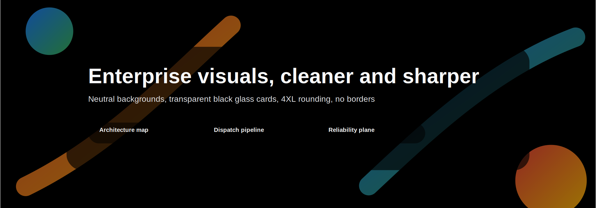

# ATOMOS Investor and Partner Brief

This document is the external audience variant of ATOMOS.

1. For investors, strategic partners, and business stakeholders: this file.
2. For architecture, operations, and implementation depth: [README.md](README.md).

## Executive Brief

ATOMOS is a multi-role logistics operating system designed to coordinate the full execution loop across supplier operations, factories, warehouses, drivers, retailers, and payload terminals.

The product combines:

1. Automation-first dispatch and planning.
2. Real-time execution visibility.
3. Financially safe transaction and reconciliation patterns.
4. Cross-device operations across web, desktop, Android, and iOS.

In practical terms, ATOMOS helps logistics operators move from fragmented tools to one coherent system of action.

## The Business Problem

Most logistics stacks break at handoff boundaries:

1. Planning and execution are disconnected.
2. Dispatch decisions are hard to audit.
3. Manual intervention is slow and expensive.
4. Realtime visibility is inconsistent across teams.
5. Financial and operational events are often out of sync.

The result is margin erosion through delays, empty miles, exception overhead, and support burden.

## The ATOMOS Approach

ATOMOS is built as an execution control plane, not a static dashboard.

Key product characteristics:

1. Automation by default, with policy-bounded human override.
2. Role-specific experiences for each operational persona.
3. Event-driven state progression for consistent cross-system outcomes.
4. Realtime updates that keep every role aligned on actual progress.

## Product Surface Coverage

| Role | Primary Experience | Outcome Focus |
|---|---|---|
| Supplier | Web and desktop operational portals | Throughput, control, exception resolution |
| Factory Admin | Factory-native app and portal workflows | Production-to-network fulfillment |
| Warehouse Admin | Warehouse-native app and portal workflows | Capacity, receiving, dispatch readiness |
| Driver | Native Android and iOS apps | Route execution and delivery completion |
| Retailer | Mobile and desktop retail execution | Ordering, receiving, dispute workflows |
| Payload Teams | Terminal and tablet workflows | Manifest integrity and transfer speed |

## Technology Stack Snapshot

Core technologies used across ATOMOS:

1. Backend and APIs: Go 1.22+, chi router, gRPC, websocket hubs, Kafka outbox relay, Redis invalidation.
2. Data and event plane: Cloud Spanner, Kafka, Redis, and H3 geospatial indexing.
3. Web and desktop: Next.js 15, React 19, Tailwind v4, and Tauri 2 desktop shells.
4. Mobile and terminal: Kotlin + Compose M3, SwiftUI native apps, and Expo payload terminal.
5. Infrastructure and quality: Terraform, GKE, Cloud LB ring-hash, Docker Compose, Playwright, Vitest, Go tests, Gradle, and Xcode.

## Why the Product Is Defensible

1. Operational depth across the entire logistics chain, not a single point tool.
2. Built-in support for mixed automation and operator decisions.
3. Unified cross-role model that reduces process drift.
4. Engineering architecture optimized for high-scale reliability patterns.

## Exceptional Product Features

1. Auto-dispatch intelligence using geospatial batching and capacity-aware assignment.
2. Manual override protection through freeze-lock style controls.
3. Realtime hub model for operations awareness.
4. Reliability-focused event flow for stronger consistency at scale.

## Maglev Traffic Stability

Maglev and Maglev-derived balancing footprint:

1. Edge ingress uses ring-hash affinity keyed by supplier header for stable pod routing.
2. Backend data reads use a Maglev-derived lookup-table routing pattern for regional read selection.
3. Internal optimizer traffic supports xDS service-mesh load balancing when enabled.

## Value Flywheel

```mermaid
%%{init: {"theme":"base","themeVariables":{"darkMode":true,"background":"#191622","primaryColor":"#232136","primaryTextColor":"#E1E1E6","primaryBorderColor":"#78D1E1","secondaryColor":"#2A2338","secondaryTextColor":"#E1E1E6","secondaryBorderColor":"#988BC7","tertiaryColor":"#1F3026","tertiaryTextColor":"#E1E1E6","tertiaryBorderColor":"#67E480","lineColor":"#E1E1E6","textColor":"#E1E1E6","mainBkg":"#232136","nodeBorder":"#78D1E1","clusterBkg":"#232136","clusterBorder":"#988BC7","titleColor":"#E1E1E6","edgeLabelBackground":"#232136","noteBkgColor":"#232136","noteTextColor":"#E1E1E6","noteBorderColor":"#988BC7"},"themeCSS":".edgeLabel text,.label text,.nodeLabel{fill:#E1E1E6 !important;color:#E1E1E6 !important;} .edgeLabel rect{fill:#232136 !important;opacity:1 !important;}"}}%%
flowchart LR
  A[Higher planning accuracy] --> B[Faster route execution]
  B --> C[Lower exception and support cost]
  C --> D[Higher service reliability]
  D --> E[Customer retention and expansion]
  E --> F[More operational data]
  F --> A
```

## Partnership Opportunities

Potential partner profiles:

1. Supplier networks and distribution operators.
2. Retail chains with distributed receiving points.
3. Last-mile and mixed-fleet delivery operators.
4. Infrastructure and payment partners integrating into logistics workflows.

Typical partnership outcomes:

1. Faster operational digitization with fewer disconnected tools.
2. Better delivery SLA performance and exception response.
3. Improved transparency for finance and operations leadership.

## Commercialization Lenses

The platform supports multiple commercialization motions:

1. Enterprise subscription for control-plane software access.
2. Usage-based pricing components tied to operational volume.
3. Premium modules for advanced analytics and optimization workflows.
4. Integration and deployment services for enterprise onboarding.

## Risk Framing and Mitigation

| Risk Category | Typical Concern | ATOMOS Mitigation Direction |
|---|---|---|
| Adoption complexity | Multi-role rollout friction | Role-specific surfaces and staged rollout paths |
| Operational trust | Fear of black-box automation | Operator override plus auditable decision flow |
| Data consistency | Mismatch between state and events | Transaction-safe event architecture patterns |
| Scale pressure | Performance at growth milestones | Control-plane design with reliability guardrails |

## Current Position and Next Steps

Near-term focus areas for market execution:

1. Expand pilot deployments across role-complete environments.
2. Package measurable value stories around dispatch efficiency and reliability.
3. Deepen partner integrations around payment and ecosystem workflows.
4. Continue hardening enterprise-grade observability and governance.

## Contact and Technical Due Diligence

1. Business and partnership discussions: use this brief as the starting narrative.
2. Technical due diligence: review [README.md](README.md) for architecture and operations depth.
3. Architecture visual: [pegasus/docs/assets/architecture-overview.svg](pegasus/docs/assets/architecture-overview.svg).
4. Auto-dispatch visual: [pegasus/docs/assets/autodispatch-pipeline.svg](pegasus/docs/assets/autodispatch-pipeline.svg).
5. Reliability visual: [pegasus/docs/assets/reliability-control-plane.svg](pegasus/docs/assets/reliability-control-plane.svg).
6. Maglev visual: [pegasus/docs/assets/maglev-load-balancers.svg](pegasus/docs/assets/maglev-load-balancers.svg).
7. Core hero visual: [pegasus/docs/assets/omni-hero-banner.svg](pegasus/docs/assets/omni-hero-banner.svg).
8. Divider visual: [pegasus/docs/assets/omni-section-divider.svg](pegasus/docs/assets/omni-section-divider.svg).
9. Code-surface visual: [pegasus/docs/assets/omni-code-surface.svg](pegasus/docs/assets/omni-code-surface.svg).
10. Tech-stack matrix: [pegasus/docs/assets/techstack-glass-matrix.svg](pegasus/docs/assets/techstack-glass-matrix.svg).
11. Tech-stack compact: [pegasus/docs/assets/techstack-glass-compact.svg](pegasus/docs/assets/techstack-glass-compact.svg).
