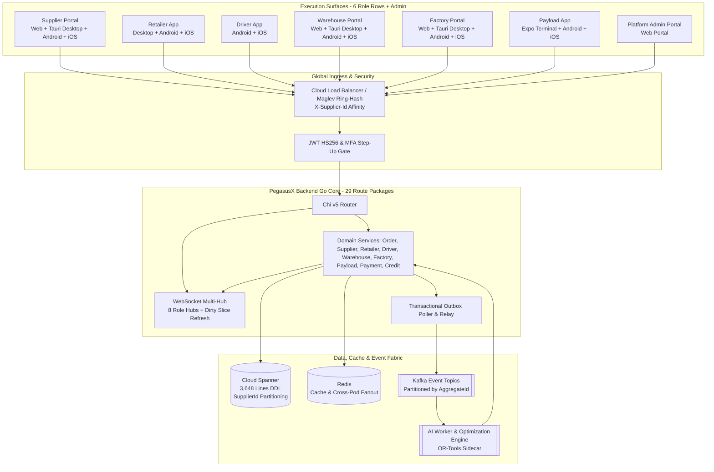
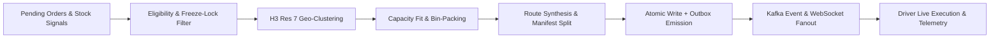
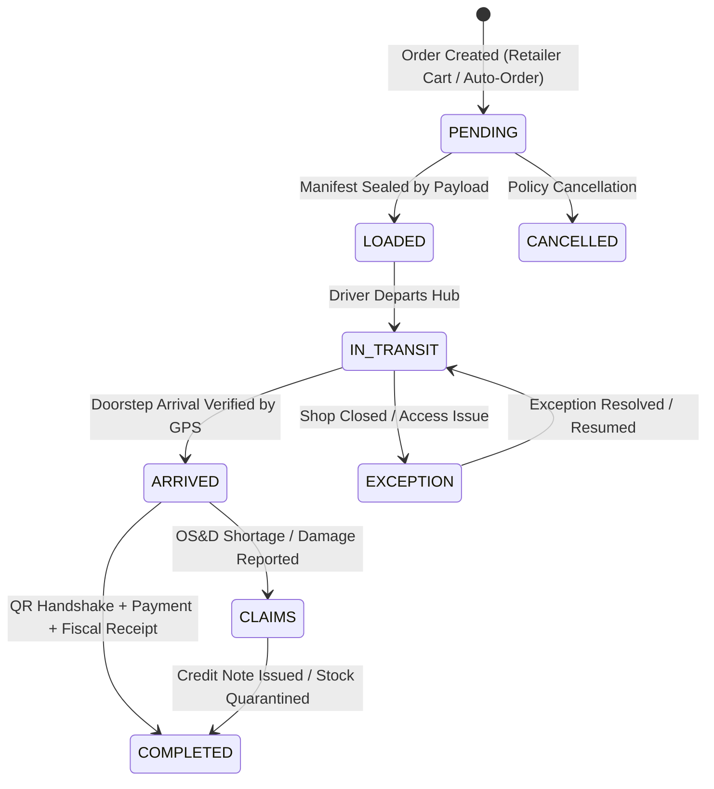

<p align="center">
  
</p>

<h1 align="center">ATOMOS (PegasusX)</h1>

<p align="center">
  <strong>Enterprise Logistics Operating System & Multi-Role Autonomous Supply Chain Platform</strong>
</p>

---

> **PATH / SoT DIRECTIVE (2026-08-20):** Canonical product tree and living codebase is **`pegasusX/`** (the legacy `pegasus/` directory is an archived reference/port source only).  
> **Final Goal & Destination:** [`.agents/memory/GOAL.md`](.agents/memory/GOAL.md) — [`GLOBAL_SCALE_PROGRAM.md`](pegasusX/docs/GLOBAL_SCALE_PROGRAM.md) + [`GLOBAL_SCALE_LOCAL_ECOSYSTEM.md`](pegasusX/docs/GLOBAL_SCALE_LOCAL_ECOSYSTEM.md) + [`FULL_SYSTEM_PARITY_AND_ECOSYSTEM_MASTER_PLAN.md`](pegasusX/docs/FULL_SYSTEM_PARITY_AND_ECOSYSTEM_MASTER_PLAN.md).  
> **Documentation Map:** [`pegasusX/docs/DOCS_SOURCE_OF_TRUTH.md`](pegasusX/docs/DOCS_SOURCE_OF_TRUTH.md).  
> **Role Parity Matrix:** [`pegasusX/docs/ROLE_ROW_PARITY_MATRIX.md`](pegasusX/docs/ROLE_ROW_PARITY_MATRIX.md).  
> **Class A Coverage:** [`pegasusX/docs/PROD_ECOSYSTEM_GOAL.md`](pegasusX/docs/PROD_ECOSYSTEM_GOAL.md).

ATOMOS (PegasusX) is an enterprise-grade logistics operating system that coordinates supplier, factory, warehouse, driver, retailer, and payload operations across web, desktop, and native mobile surfaces with strict data-plane consistency and local-first execution.

The platform is built for high-consequence physical operations where route sequencing, payment integrity, geofence rules, transactional outbox messaging, and telemetry accuracy remain coherent under extreme concurrency.

---

## Table of Contents

- [Executive Summary](#executive-summary)
- [Architecture Overview](#architecture-overview)
- [Multi-Tenancy & Data Model](#multi-tenancy--data-model)
- [Backend Services & 29 Route Packages](#backend-services--29-route-packages)
- [Role-to-Surface Matrix & Client Applications](#role-to-surface-matrix--client-applications)
- [Shared Packages & Client Contracts](#shared-packages--client-contracts)
- [Auto-Dispatch & Proximity Intelligence](#auto-dispatch--proximity-intelligence)
- [State Machines & Lifecycle Contracts](#state-machines--lifecycle-contracts)
- [Reliability & Transactional Outbox Control Plane](#reliability--transactional-outbox-control-plane)
- [Repository Topology](#repository-topology)
- [Quick Start & Local Environment](#quick-start--local-environment)
- [Run and Build Commands](#run-and-build-commands)
- [Testing & Quality Gates](#testing--quality-gates)
- [Engineering Doctrine](#engineering-doctrine)
- [Documentation Index](#documentation-index)

---

## Executive Summary

ATOMOS applies a zero-trust, event-driven control-plane architecture to real-world physical logistics execution.

**Core System Qualities:**
1. **True Multi-Tenancy**: Complete tenant isolation by `SupplierId STRING(36)` across all core Spanner entities with request-scoped JWT claims and `ParentOrders` multi-supplier cart partitioning.
2. **Transactional State Atomicity**: Database mutations and event emissions are executed atomically in Cloud Spanner Read-Write transactions via the Transactional Outbox pattern (`OutboxEvents` and `OutboxDeadLetters`).
3. **Local-First Geospatial Intelligence**: H3 hexagonal hierarchical spatial indexing (Resolution 7) for neighborhood clustering, warehouse catchment resolution, and proximity routing.
4. **Realtime Multi-Hub WebSocket Hub**: 8 role-dedicated WebSocket hubs backed by Redis pub-sub with automatic reconnection, session reconciliation, and low-latency client dirty-slice refreshing.
5. **Multi-Platform Client Parity**: Production-grade client applications across Web/Desktop (Next.js 15 App Router + Tauri 2), Android (Kotlin 2.x + Jetpack Compose + Room), iOS (Swift 6 + SwiftUI + SwiftData), and Payload (React Native + Expo SDK 55).

**Business-Critical Invariants:**
1. **Order Lifecycle Integrity**: `PENDING -> LOADED -> IN_TRANSIT -> ARRIVED -> COMPLETED` (with explicit exception, claims, and return branches).
2. **Financial Correctness**: Integer minor units for all monetary amounts, double-entry compatible ledger events, pay-at-delivery cash/credit reconciliation, and honest PSP execution.
3. **Route Truthfulness**: Live GPS telemetry streaming (`/v1/ws?sv=2`) with dead-reckoning interpolation, speed deviation monitoring, and audio navigation cue announcers.
4. **Scope & Role Safety**: Role, supplier, and warehouse scopes are extracted strictly from cryptographic JWT claims, never trusted from request payloads.
5. **Replay & Idempotency Safety**: Idempotency key middleware on all mutating endpoints (`idempotency.ts`) preventing duplicate external side effects.

---

## Architecture Overview


```mermaid
flowchart TD
   subgraph Clients[Execution Surfaces - 6 Role Rows + Admin]
      SP[Supplier Portal\nWeb + Tauri Desktop + Android + iOS]
      RP[Retailer App\nDesktop + Android + iOS]
      DP[Driver App\nAndroid + iOS]
      WP[Warehouse Portal\nWeb + Tauri Desktop + Android + iOS]
      FP[Factory Portal\nWeb + Tauri Desktop + Android + iOS]
      PP[Payload App\nExpo Terminal + Android + iOS]
      AP[Platform Admin Portal\nWeb Portal]
   end

   subgraph Ingress[Global Ingress & Security]
      LB[Cloud Load Balancer / Maglev Ring-Hash\nX-Supplier-Id Affinity]
      JWT[JWT HS256 & MFA Step-Up Gate]
   end

   subgraph Backend[PegasusX Backend Go Core - 29 Route Packages]
      CHI[Chi v5 Router]
      DOM[Domain Services: Order, Supplier, Retailer, Driver, Warehouse, Factory, Payload, Payment, Credit]
      WS[WebSocket Multi-Hub\n8 Role Hubs + Dirty Slice Refresh]
      OUTBOX[Transactional Outbox Poller & Relay]
   end

   subgraph DataPlane[Data, Cache & Event Fabric]
      SPN[(Cloud Spanner\n3,648 Lines DDL\nSupplierId Partitioning)]
      RED[(Redis\nCache & Cross-Pod Fanout)]
      KAF[[Kafka Event Topics\nPartitioned by AggregateId]]
      AI[[AI Worker & Optimization Engine\nOR-Tools Sidecar]]
   end

   SP & RP & DP & WP & FP & PP & AP --> LB
   LB --> JWT --> CHI
   CHI --> DOM
   CHI --> WS
   DOM --> SPN
   DOM --> RED
   DOM --> OUTBOX
   OUTBOX --> KAF
   KAF --> AI
   AI --> DOM
   DOM --> WS
```

---

## Multi-Tenancy & Data Model

The authoritative database schema resides at `pegasusX/apps/backend-go/schema/spanner.ddl` (3,648 lines).

### Key Architectural Characteristics:
1. **Supplier Isolation (`SupplierId STRING(36)`)**:
   - Every core supplier-owned table enforces `SupplierId STRING(36) NOT NULL` (e.g., `Suppliers`, `Orders`, `SupplierProfiles`, `SupplierPricingRules`, `SupplierPromotions`, `Warehouses`, `Factories`, `SupplierTruckManifests`).
   - Tenant isolation is enforced at the handler level via `auth.RequireTenant()` middleware and Spanner query filters.
2. **Multi-Supplier Cart Partitioning (`ParentOrders`)**:
   - The `ParentOrders` table (`spanner.ddl:221-239`) enables retailers to submit multi-supplier checkout carts within the same market pack, splitting into isolated per-supplier child orders atomically.
3. **Dual Manifest Planes**:
   - Factory transfers operate on `FactoryTruckManifests` (`spanner.ddl:884-930`).
   - Last-mile deliveries operate on `SupplierTruckManifests` (`spanner.ddl:798-840`).
   - Manifest planes are kept strictly separated to avoid cross-domain coupling.
4. **Transactional Outbox Engine**:
   - `OutboxEvents` table (`spanner.ddl:679-697`) records every business event in the same RW transaction as state mutations.
   - `OutboxDeadLetters` table (`spanner.ddl:698-709`) captures failed deliveries for manual or automated replay via the Platform Admin console.

---

## Backend Services & 29 Route Packages

The backend Go core (`pegasusX/apps/backend-go/main.go`) mounts 29 modular route packages:

| # | Route Package | Base Mount Point | Domain Responsibilities |
|---|---|---|---|
| 1 | `supplierroutes` | `/v1/supplier/*`, `/v1/auth/supplier/*` | Registration, profile, topology, fleet, pricing, inventory import, AI recommendations, CRM, S&OP. |
| 2 | `retailerroutes` | `/v1/retailer/*`, `/v1/auth/retailer/*`, `/v1/pos/*` | Multi-org auth, Retail OS, Store Stock, POS sales/holds, shifts, sections, assist tickets, auto-order. |
| 3 | `warehouseroutes` | `/v1/warehouse/*`, `/v1/warehouses/*` | WMS bins/lots, pick waves, cycle counts, temperature cold-chain, dispatch preview/execute/rescue. |
| 4 | `driverroutes` | `/v1/driver/*`, `/v1/fleet/*`, `/v1/delivery/*` | Driver auth, missions, route geometry, cash turn-in, doorstep verification, rescue requests. |
| 5 | `factoryroutes` | `/v1/factory/*`, `/v1/factories/*` | Factory management, loading-bay manifests, supply requests, stock transfers, QC fulfillment. |
| 6 | `payloadroutes` | `/v1/payload/*`, `/v1/payloader/*` | Loading ledger scanning, ship-units, barcode labels, seal-all, variance approvals. |
| 7 | `orderroutes` | `/v1/order/*`, `/v1/compliance/*` | Order creation, state transitions, branded receipts (HTML/PDF), claims adjudication, timeline. |
| 8 | `paymentroutes` | `/v1/checkout/*`, `/v1/payment/*` | B2B unified checkout, payment ledger, chargeback & reversals, payer management. |
| 9 | `creditroutes` | `/v1/retailer/credit-*`, `/v1/supplier/credit-*`, `/v1/supplier/ar/*` | Credit profile, credit policy relationships, AR invoices, aging summaries, dunning worker. |
| 10 | `cashreconroutes` | `/v1/driver/cash-reconciliations`, `/v1/supplier/cash-reconciliations` | Cash bag turn-in, variance recording, reconciliation write-offs. |
| 11 | `creditnoteroutes` | `/v1/supplier/credit-notes/*`, `/v1/warehouse/reverse-logistics/*` | Manual and auto credit notes, reverse logistics receiving. |
| 12 | `returnsroutes` | `/v1/returns/*`, `/v1/catalog/barcode/*`, `/v1/driver/return-goods` | Inbound return sessions, barcode lookups, return receipt confirmations. |
| 13 | `partner` | `/partner/v1/*`, `/v1/admin/partner-keys/*` | B2B Partner API, OAuth client_credentials, AS2 receive, EDI documents (INVOIC/PRICAT/REMADV), 1C adapters. |
| 14 | `platformroutes` | `/v1/platform/*`, `/v1/user/device-token`, `/v1/auth/session` | Client policies, market packs, cells, media upload tickets, tenant registration. |
| 15 | `platformadmin` | `/v1/platform-admin/*` | Tenant management, feature flag dual-control, audit trails, outbox dead-letter replay. |
| 16 | `featureflags` | `/v1/platform-admin/flags/*` | Dual-control flag evaluation, pending override approvals, audit logging. |
| 17 | `mfa` | `/v1/platform-admin/mfa/*` | TOTP enrollment, confirmation, verification, and step-up enforcement. |
| 18 | `controltowerroutes` | `/v1/control-tower/*` | Scored exceptions, playbooks, execution runs, automated evaluation. |
| 19 | `demandroutes` | `/v1/demand/*` | Demand signal ingest, adjustments, POS demand flywheel integration. |
| 20 | `laborcapacityroutes`| `/v1/labor-capacity/*` | Driver scores, zone capacities, driver availability scheduling. |
| 21 | `etaroutes` | `/v1/etas/*` | Realtime route ETAs, stop ETAs, recalculation triggers. |
| 22 | `globalproductsroutes`| `/v1/global-products/*`, `/v1/admin/product-match-queue/*` | Master global catalog, product offers, match queue resolution. |
| 23 | `catalogroutes` | `/v1/catalog/*`, `/v1/products` | Public catalog browsing, category taxonomy, supplier product listings. |
| 24 | `pulseroutes` | `/v1/*/pulse` | Role-tailored live pulse feeds (retailer, supplier, warehouse, driver, payload, factory). |
| 25 | `taxroutes` | `/v1/admin/tax-regimes/*` | Tax regime versioning and rate definitions. |
| 26 | `telemetryroutes` | `/v1/driver/location`, `/v1/driver/location/batch` | High-frequency driver GPS ingest, Redis caching, throttled outbox bus emit. |
| 27 | `updateroutes` | `/v1/updates/ios/*`, `/v1/updates/desktop/*` | OTA updates (iOS manifest.plist, desktop updater.json). |
| 28 | `storageroutes` | `/dossiers/*` | Compliance dossier creation and evidence attachment vault. |
| 29 | `infraroutes` | `/healthz`, `/ready`, `/metrics`, `/v1/health` | Liveness/readiness probes, Prometheus metrics exporter. |

*(Also mounted: `entityresolutionroutes`, `webhookroutes`, `deliveryroutes`, `ws`).*

---

## Role-to-Surface Matrix & Client Applications

All 6 role rows plus Platform Admin have complete, compiled, production-structured implementations with real API integration:

| Role Row | Platforms | Stack | Directory Path |
|---|---|---|---|
| **Supplier** | Web Portal + Tauri Desktop<br/>Android<br/>iOS | Next.js 15 + React 19 + Tailwind v4<br/>Kotlin + Jetpack Compose<br/>SwiftUI (Swift 6) | `pegasusX/apps/supplier-portal`<br/>`pegasusX/apps/supplier-app-android`<br/>`pegasusX/apps/supplier-app-ios` |
| **Retailer** | Desktop<br/>Android<br/>iOS | Next.js 15 + Tauri 2 Shell<br/>Kotlin + Jetpack Compose + Room<br/>SwiftUI + SwiftData | `pegasusX/apps/retailer-app-desktop`<br/>`pegasusX/apps/retailer-app-android`<br/>`pegasusX/apps/retailer-app-ios` |
| **Driver** | Android<br/>iOS | Kotlin + Jetpack Compose + Room<br/>SwiftUI + SwiftData + CoreLocation | `pegasusX/apps/driver-app-android`<br/>`pegasusX/apps/driver-app-ios` |
| **Warehouse** | Web Portal + Tauri Desktop<br/>Android<br/>iOS | Next.js 15 + React 19<br/>Kotlin + Jetpack Compose<br/>SwiftUI | `pegasusX/apps/warehouse-portal`<br/>`pegasusX/apps/warehouse-app-android`<br/>`pegasusX/apps/warehouse-app-ios` |
| **Factory** | Web Portal + Tauri Desktop<br/>Android<br/>iOS | Next.js 15 + React 19<br/>Kotlin + Jetpack Compose<br/>SwiftUI | `pegasusX/apps/factory-portal`<br/>`pegasusX/apps/factory-app-android`<br/>`pegasusX/apps/factory-app-ios` |
| **Payload** | Tablet Terminal<br/>Android Tablet<br/>iOS iPad | React Native + Expo (SDK 55)<br/>Kotlin + Jetpack Compose<br/>SwiftUI | `pegasusX/apps/payload-terminal`<br/>`pegasusX/apps/payload-app-android`<br/>`pegasusX/apps/payload-app-ios` |
| **Platform Admin**| Web Console | Next.js 15 + React 19 | `pegasusX/apps/admin-portal` |

---

## Shared Packages & Client Contracts

The applications are backed by shared TypeScript, Kotlin, and Swift packages located in `pegasusX/packages/`:

- **`@pegasusx/types`**: 6,682 lines of strongly typed TypeScript contracts, DTOs, problem details (RFC 7807), and event payloads.
- **`@pegasusx/api-client`**: Unified HTTP client SDK wrapping all 29 route domains with automatic token refresh, exponential backoff with jitter (`reconnect.ts`), and session reconciliation (`session-reconcile.ts`).
- **`@pegasusx/ws-refresh-contract`**: Canonical WebSocket event refresh dictionary and granular UI slice dirty-state mappers (`dashboardDirtySlice()`).
- **`@pegasusx/desktop-bridge`**: Tauri IPC bridge for native printing, deep linking, file exports, and auto-updates.
- **`@pegasusx/desktop-cache`**: Local SQLite key-value persistence and offline transaction queues.
- **`@pegasusx/ui-kit`**: Cross-portal UI design system primitives (`KpiStat`, `StatusStack`, `HealthStrip`, `PortalPrimitives`).
- **`mobile-android-kit` & `mobile-ios-kit`**: Shared native mobile networking, offline mutation queues, and retry mechanisms.

---

## Auto-Dispatch & Proximity Intelligence

The auto-dispatch engine operates at the intersection of demand signals, H3 geospatial clustering, and vehicle capacity fitting:


```mermaid
flowchart LR
   A[Pending Orders & Stock Signals] --> B[Eligibility & Freeze-Lock Filter]
   B --> C[H3 Res 7 Geo-Clustering]
   C --> D[Capacity Fit & Bin-Packing]
   D --> E[Route Synthesis & Manifest Split]
   E --> F[Atomic Write + Outbox Emission]
   F --> G[Kafka Event & WebSocket Fanout]
   G --> H[Driver Live Execution & Telemetry]
```

1. **Manual by Default**: Warehouse operators select truck and orders with live capacity preview.
2. **Optional Worker Automation**: `auto_dispatch_enabled` runs the optimization engine periodically.
3. **Neighborhood Cohesion**: Orders are grouped into H3 Resolution 7 cells and adjacency rings to eliminate zig-zag routing.
4. **Capacity Safety**: Product volume units (VU) are checked against truck `MaxVolumeVU`, cleanly splitting oversized orders.
5. **No Orphan Orders**: Orders without available capacity remain safely `UNDISPATCHED` for subsequent runs.

---

## State Machines & Lifecycle Contracts


```mermaid
stateDiagram-v2
   [*] --> PENDING: Order Created (Retailer Cart / Auto-Order)
   PENDING --> LOADED: Manifest Sealed by Payload
   LOADED --> IN_TRANSIT: Driver Departs Hub
   IN_TRANSIT --> ARRIVED: Doorstep Arrival Verified by GPS
   ARRIVED --> COMPLETED: QR Handshake + Payment + Fiscal Receipt

   PENDING --> CANCELLED: Policy Cancellation
   IN_TRANSIT --> EXCEPTION: Shop Closed / Access Issue
   EXCEPTION --> IN_TRANSIT: Exception Resolved / Resumed
   ARRIVED --> CLAIMS: OS&D Shortage / Damage Reported
   CLAIMS --> COMPLETED: Credit Note Issued / Stock Quarantined
```

---

## Reliability & Transactional Outbox Control Plane

| Invariant | Implementation Mechanism | Enforcement Point |
|---|---|---|
| **Mutation-Event Atomicity** | Spanner Read-Write transaction writing entity row + `OutboxEvents` row | `outbox.EmitJSON` inside `spanner.ReadWriteTransaction` |
| **Replay-Safe Processing** | Deterministic aggregate version checks and unique event IDs | Kafka consumer idempotency handlers |
| **Cache Invalidation Coherence**| Post-commit Redis pub-sub invalidation message | `cache.InvalidateDashboardKey` |
| **Realtime Continuity** | Multi-hub WebSocket with local memory fallback if Redis is disrupted | `ws/hub.go` fail-open fanout |
| **Surge Load Shedding** | Priority guard and token bucket rate limits on critical paths | `ratelimit` middleware |

---

## Repository Topology

```text
V.O.I.D/
├── README.md                                # Root Master Architecture Document (this file)
├── PegasusX_Reality_Report.README.md        # Document Source of Truth Index & Word Status
├── archive/
│   └── docx/                                # Archived Frozen Word Exports (.docx)
├── pegasusX/                                # AUTHORITATIVE CODEBASE ROOT
│   ├── apps/
│   │   ├── backend-go/                      # Core Go Backend Service (29 Route Packages)
│   │   ├── ai-worker/                       # Python AI & Optimization Worker (OR-Tools)
│   │   ├── admin-portal/                    # Next.js Platform Admin Web Portal
│   │   ├── supplier-portal/                 # Next.js + Tauri Supplier Portal & Desktop App
│   │   ├── supplier-app-android/            # Kotlin Jetpack Compose Supplier App
│   │   ├── supplier-app-ios/                # Swift SwiftUI Supplier App
│   │   ├── retailer-app-desktop/            # Next.js + Tauri Retailer Desktop App
│   │   ├── retailer-app-android/            # Kotlin Jetpack Compose Retailer App
│   │   ├── retailer-app-ios/                # Swift SwiftUI Retailer App
│   │   ├── driver-app-android/              # Kotlin Jetpack Compose Driver App
│   │   ├── driver-app-ios/                  # Swift SwiftUI Driver App
│   │   ├── warehouse-portal/                # Next.js + Tauri Warehouse Portal & Desktop App
│   │   ├── warehouse-app-android/          # Kotlin Jetpack Compose Warehouse App
│   │   ├── warehouse-app-ios/              # Swift SwiftUI Warehouse App
│   │   ├── factory-portal/                  # Next.js + Tauri Factory Portal & Desktop App
│   │   ├── factory-app-android/            # Kotlin Jetpack Compose Factory App
│   │   ├── factory-app-ios/                # Swift SwiftUI Factory App
│   │   ├── payload-terminal/                # Expo / React Native Payload Terminal
│   │   ├── payload-app-android/            # Kotlin Jetpack Compose Payload Tablet App
│   │   └── payload-app-ios/                # Swift SwiftUI Payload iPad App
│   ├── packages/
│   │   ├── types/                           # Shared TypeScript Types & Contracts
│   │   ├── api-client/                      # Unified Client SDK (All 29 Domains)
│   │   ├── ws-refresh-contract/             # WebSocket Event Contracts & UI Slice Rules
│   │   ├── desktop-bridge/                  # Tauri IPC Bridge (Print, Updater, DeepLink)
│   │   ├── desktop-cache/                   # SQLite Desktop Offline Storage
│   │   ├── ui-kit/                          # Shared Design System Component Library
│   │   ├── mobile-android-kit/              # Native Android Shared Kit
│   │   └── mobile-ios-kit/                  # Native iOS Shared Kit
│   ├── contracts/                           # JSON Schema, OpenAPI, and Event Specs
│   ├── docs/                                # Architecture Specs, Roadmaps, and Protocols
│   ├── infra/                               # Terraform, Kubernetes Manifests, Docker Compose
│   └── tests/                               # End-to-End Integration & Verification Suites
└── pegasus/                                 # LEGACY REFERENCE / PORT SOURCE ONLY
```

---

## Quick Start & Local Environment

### Prerequisites
- **Go**: 1.22+
- **Node.js**: 20+ (with `pnpm`)
- **Docker & Docker Compose**: 24+
- **Android SDK / Xcode**: For mobile development

### 1. Launch Local Infrastructure
```bash
cd pegasusX/infra
docker compose -f docker-compose.sandbox.yml up -d
```

### 2. Run Backend Go Service
```bash
cd pegasusX/apps/backend-go
go run .
```

### 3. Run Web / Desktop Portals
```bash
# Supplier Portal (Web / Tauri)
cd pegasusX/apps/supplier-portal && pnpm dev

# Retailer Desktop App
cd pegasusX/apps/retailer-app-desktop && pnpm tauri:dev

# Warehouse Portal
cd pegasusX/apps/warehouse-portal && pnpm dev

# Factory Portal
cd pegasusX/apps/factory-portal && pnpm dev

# Platform Admin Console
cd pegasusX/apps/admin-portal && pnpm dev
```

### 4. Run Mobile Apps
```bash
# Payload Terminal (Expo)
cd pegasusX/apps/payload-terminal && pnpm start

# Android Apps (Driver / Retailer / Supplier / Warehouse / Factory / Payload)
cd pegasusX/apps/driver-app-android && ./gradlew :app:assembleDebug

# iOS Apps (Driver / Retailer / Supplier / Warehouse / Factory / Payload)
cd pegasusX/apps/driver-app-ios && xcodebuild -scheme driverappios -destination 'platform=iOS Simulator,name=iPhone 16' build
```

---

## Testing & Quality Gates

### Backend Unit & Integration Tests
```bash
cd pegasusX/apps/backend-go
go test ./... -v
```

### Automated End-to-End SSMR Smoke Check
```bash
cd pegasusX/apps/backend-go
go test -v ./cmd/ssmr-smokecheck/
```

### Client Workspace Unit Test Suites (Vitest)
```bash
# Run all web & desktop client test suites
pnpm --filter @pegasusx/supplier-portal test
pnpm --filter @pegasusx/retailer-app-desktop test
pnpm --filter @pegasusx/warehouse-portal test
pnpm --filter @pegasusx/factory-portal test
pnpm --filter @pegasusx/admin-portal test
pnpm --filter @pegasusx/desktop-bridge test
pnpm --filter @pegasusx/desktop-cache test
cd pegasusX/apps/payload-terminal && pnpm test
```

---

## Engineering Doctrine

1. **Domain Isolation**: Route handlers remain thin adapters parsing parameters, authenticating claims, and delegating to domain packages.
2. **Deterministic Tenancy**: Requests without a verified `SupplierId` fail-closed with HTTP 401/403.
3. **Atomic Writes**: Any state change that triggers an event must write the event to `OutboxEvents` in the same Spanner transaction.
4. **Honest Product Boundaries**: Deprecated or unintegrated endpoints explicitly return RFC 7807 HTTP 410 (`audit_unwired`, `feature_disabled`) rather than mocking false success.
5. **Multi-Platform Parity**: Every role capability is reflected across all target surfaces for that role with zero mock facades.

---

## Documentation Index

- [Documentation Source of Truth (`DOCS_SOURCE_OF_TRUTH.md`)](pegasusX/docs/DOCS_SOURCE_OF_TRUTH.md)
- [Global Scale Program (`GLOBAL_SCALE_PROGRAM.md`)](pegasusX/docs/GLOBAL_SCALE_PROGRAM.md)
- [Global Scale Local Ecosystem (`GLOBAL_SCALE_LOCAL_ECOSYSTEM.md`)](pegasusX/docs/GLOBAL_SCALE_LOCAL_ECOSYSTEM.md)
- [Full System Parity & Ecosystem Master Plan (`FULL_SYSTEM_PARITY_AND_ECOSYSTEM_MASTER_PLAN.md`)](pegasusX/docs/FULL_SYSTEM_PARITY_AND_ECOSYSTEM_MASTER_PLAN.md)
- [Role-Row Parity Matrix (`ROLE_ROW_PARITY_MATRIX.md`)](pegasusX/docs/ROLE_ROW_PARITY_MATRIX.md)
- [Role Features Docs vs Code (`ROLE_FEATURES_DOCS_VS_CODE.md`)](pegasusX/docs/ROLE_FEATURES_DOCS_VS_CODE.md)
- [Production Readiness Sequence (`PROD_READINESS_SEQUENCE.md`)](pegasusX/docs/PROD_READINESS_SEQUENCE.md)
- [Living Scorecard (`session-2026-08-13/SCORECARD.md`)](pegasusX/docs/session-2026-08-13/SCORECARD.md)
