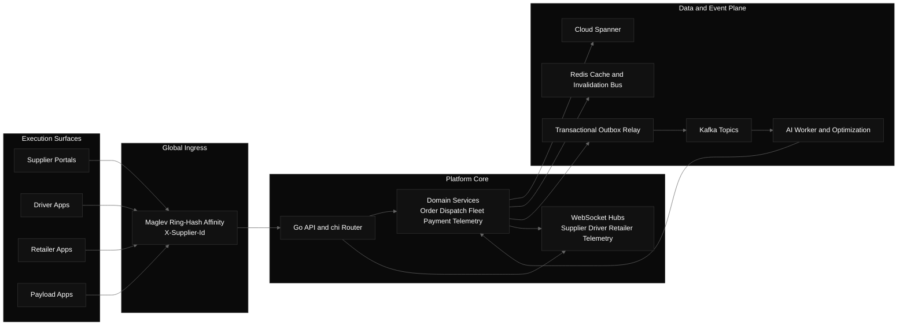
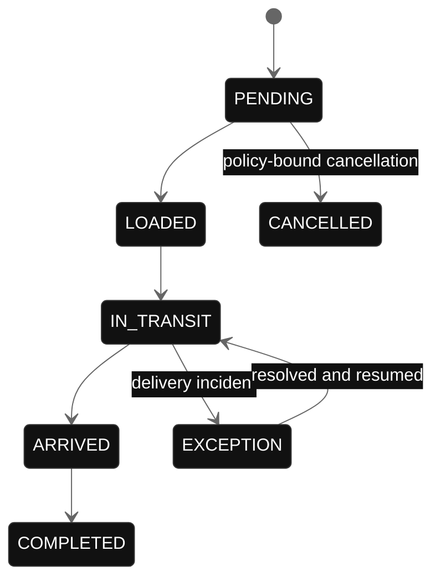
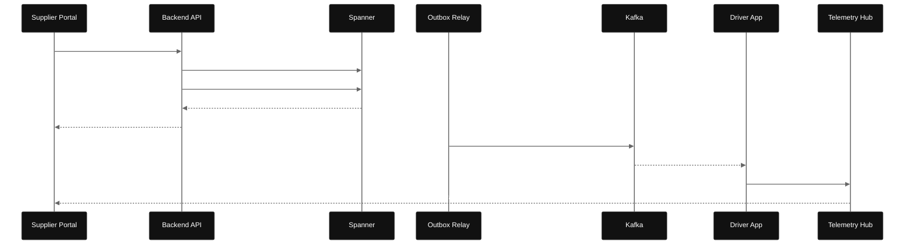

<p align="center">
  
</p>

<h1 align="center">ATOMOS</h1>

<p align="center">
  <strong>Enterprise Logistics Operating System</strong>
</p>


---

> **PATH / SoT WARNING (2026-08-12):** Canonical product tree is **`pegasusX/`** (not legacy `pegasus/`).  
> Planning docs: [`pegasusX/docs/DOCS_SOURCE_OF_TRUTH.md`](pegasusX/docs/DOCS_SOURCE_OF_TRUTH.md) · [`PROD_ECOSYSTEM_GOAL.md`](pegasusX/docs/PROD_ECOSYSTEM_GOAL.md) · gap register + master alignment under `pegasusX/docs/session-2026-08-07/`.  
> Frozen Reality Report `.docx` files are historical only.

ATOMOS is an enterprise-grade logistics operating system that coordinates supplier, factory, warehouse, driver, retailer, and payload operations across web, desktop, and native mobile surfaces.

The platform is built for high-consequence physical operations where route sequencing, payment integrity, geofence rules, and telemetry accuracy must remain coherent under high concurrency.

**Document variants:**

1. Engineering master document — this file.
2. Investor and partner narrative — [README-investors.md](README-investors.md).

---

## Table of Contents

- [Executive Summary](#executive-summary)
- [Architecture Overview](#architecture-overview)
- [Maglev Load Balancing Coverage](#maglev-load-balancing-coverage)
- [Exceptional Capabilities](#exceptional-capabilities)
- [Auto-Dispatch Deep Dive](#auto-dispatch-deep-dive)
- [State Machines and Lifecycle Contracts](#state-machines-and-lifecycle-contracts)
- [Reliability Control Plane](#reliability-control-plane)
- [Security and Role Integrity](#security-and-role-integrity)
- [Role to Surface Matrix](#role-to-surface-matrix)
- [Technology Stack and Platforms](#technology-stack-and-platforms)
- [Repository Topology](#repository-topology)
- [Quick Start](#quick-start)
- [Run and Build Commands](#run-and-build-commands)
- [Testing and Quality Gates](#testing-and-quality-gates)
- [Observability and Operations](#observability-and-operations)
- [Engineering Doctrine](#engineering-doctrine)
- [Documentation and Diagram Assets](#documentation-and-diagram-assets)

---

## Executive Summary

ATOMOS applies a control-plane architecture to real-world logistics execution.

**Core system qualities:**

1. Automation-first operations with policy-bounded human override.
2. Atomic state and event consistency using transactional outbox.
3. Geospatial dispatch intelligence using H3 cell clustering and capacity fitting.
4. Real-time execution visibility through role-scoped websocket hubs.
5. Cross-surface product coherence across web, desktop, Android, and iOS clients.

**Business-critical invariants:**

1. Order lifecycle integrity: `PENDING -> LOADED -> IN_TRANSIT -> ARRIVED -> COMPLETED`.
2. Financial correctness: double-entry compatible event-driven payment progression.
3. Route truthfulness: telemetry reflects planned vs actual execution.
4. Role safety: scope is resolved from claims, never trusted from request bodies.
5. Replay safety: version gates and idempotency guard against duplicate side effects.

---

## Architecture Overview

### Logical Architecture


```mermaid
%%{init: {"theme":"base","themeVariables":{"darkMode":true,"background":"#000000","primaryColor":"#111111","primaryTextColor":"#FFFFFF","primaryBorderColor":"#333333","secondaryColor":"#111111","secondaryTextColor":"#FFFFFF","secondaryBorderColor":"#333333","tertiaryColor":"#111111","tertiaryTextColor":"#FFFFFF","tertiaryBorderColor":"#333333","lineColor":"#666666","textColor":"#FFFFFF","mainBkg":"#111111","nodeBorder":"#333333","clusterBkg":"#0A0A0A","clusterBorder":"#222222","titleColor":"#FFFFFF","edgeLabelBackground":"#111111","actorBkg":"#111111","actorBorder":"#333333","actorTextColor":"#FFFFFF","actorLineColor":"#666666","signalColor":"#666666","signalTextColor":"#FFFFFF","labelBoxBkgColor":"#111111","labelBoxBorderColor":"#333333","labelTextColor":"#FFFFFF","loopTextColor":"#FFFFFF","activationBkgColor":"#1A1A1A","activationBorderColor":"#333333","sequenceNumberColor":"#000000"},"themeCSS":".edgeLabel text,.label text,.stateLabel text,.messageText,.nodeLabel{fill:#FFFFFF !important;color:#FFFFFF !important;} rect,.actor,.note,.labelBox,.edgeLabel rect{stroke:#333333 !important;stroke-width:1px !important;rx:12px !important;ry:12px !important;} .edgeLabel rect{fill:#111111 !important;opacity:1 !important;} .cluster > rect{fill:#0A0A0A !important;stroke:#222222 !important;} .messageLine0,.messageLine1,.loopLine{stroke:#666666 !important;}"}}%%
flowchart LR
   subgraph Clients[Execution Surfaces]
      SP[Supplier Portals]
      DP[Driver Apps]
      RP[Retailer Apps]
      PP[Payload Apps]
   end

   subgraph Ingress[Global Ingress]
      MAG[Maglev Ring-Hash Affinity\nX-Supplier-Id]
   end

   subgraph Core[Platform Core]
      API[Go API and chi Router]
      DOM[Domain Services\nOrder Dispatch Fleet Payment Telemetry]
      HUB[WebSocket Hubs\nSupplier Driver Retailer Telemetry]
   end

   subgraph Plane[Data and Event Plane]
      SPN[Cloud Spanner]
      RED[Redis Cache and Invalidation Bus]
      KAF[Kafka Topics]
      OBX[Transactional Outbox Relay]
      AI[AI Worker and Optimization]
   end

   SP --> MAG
   DP --> MAG
   RP --> MAG
   PP --> MAG
   MAG --> API

   API --> DOM
   API --> HUB
   DOM --> SPN
   DOM --> RED
   DOM --> OBX
   OBX --> KAF
   KAF --> AI
   AI --> DOM
   DOM --> HUB
```

### Architecture Principles

1. Stateless service pods for clean scaling and safe rolling deploys.
2. Strong write consistency, stale-read options for read-heavy surfaces.
3. Event and state atomicity via outbox pattern in write transactions.
4. Partition-key ordering by aggregate identifier for deterministic consumers.
5. Degraded-mode tolerance where local user experience continues when possible.

---

## Maglev Load Balancing Coverage

Implemented Maglev or Maglev-derived load balancer paths:

1. Edge ingress ring-hash affinity at the global external backend service using `X-Supplier-Id`.
2. Backend Spanner read routing with a Maglev-derived pre-built lookup table pattern.
3. Internal optimizer gRPC xDS path (mesh-balanced), gated by `OPTIMIZER_GRPC_ADDR`.

**Current activation status:**

1. Edge ring-hash is configured in infrastructure.
2. Spanner read-router runtime currently boots in single-region mode (`NewSingleRegion`) unless multiregion activation is wired.
3. xDS optimizer path is active only when env-gated in deployment.

**Implementation map:**

| Component | Path |
|-----------|------|
| Edge ring-hash infrastructure | `pegasusX/infra/terraform/networking.tf` |
| Maglev-derived read-router engine | `pegasusX/apps/backend-go/bootstrap/spannerrouter/router.go` |
| Current single-region boot mode | `pegasusX/apps/backend-go/bootstrap/new.go` |
| xDS gRPC load-balanced client path | `pegasusX/apps/backend-go/internal/rpc/optimizergrpc/client.go` |
| xDS gRPC optimizer server endpoint | `pegasusX/apps/ai-worker/grpc_server.go` |

**Operational note:** Warehouse sibling reroute is operational load balancing logic, not Maglev ring-hash.

---

## Exceptional Capabilities

| Capability | Technical Approach | Outcome |
|---|---|---|
| Auto-dispatch optimization | H3 geo-batching + capacity fit + route synthesis | Fewer empty miles and faster load-to-delivery cycles |
| Human override safety | Freeze-lock protocol for manual intervention windows | Operators can intervene without AI race conditions |
| Event consistency | Spanner RW transaction + outbox event row + relay | Prevents ghost state and missing downstream events |
| Realtime operations | Role-scoped hubs with Redis cross-pod relay | Shared live context across control surfaces |
| Payment correctness | Idempotent webhooks + versioned transitions + ledger-safe semantics | Financially auditable settlement flows |
| Execution telemetry | Planned vs actual route visibility with deviation signal | Faster intervention on delivery drift |
| Scale resilience | Priority guard, rate limiting, circuit breakers | Better tail behavior under burst load |
| Cross-role coherence | Shared contracts, role-specific clients, synchronized rollout protocol | Reduced product fragmentation |

---

## Auto-Dispatch Deep Dive

### Dispatch Pipeline


```mermaid
%%{init: {"theme":"base","themeVariables":{"darkMode":true,"background":"#000000","primaryColor":"#111111","primaryTextColor":"#FFFFFF","primaryBorderColor":"#333333","secondaryColor":"#111111","secondaryTextColor":"#FFFFFF","secondaryBorderColor":"#333333","tertiaryColor":"#111111","tertiaryTextColor":"#FFFFFF","tertiaryBorderColor":"#333333","lineColor":"#666666","textColor":"#FFFFFF","mainBkg":"#111111","nodeBorder":"#333333","clusterBkg":"#0A0A0A","clusterBorder":"#222222","titleColor":"#FFFFFF","edgeLabelBackground":"#111111"},"themeCSS":".edgeLabel text,.label text,.stateLabel text,.messageText,.nodeLabel{fill:#FFFFFF !important;color:#FFFFFF !important;} .edgeLabel rect{fill:#111111 !important;opacity:1 !important;}"}}%%
flowchart LR
   A[Demand and inventory signals] --> B[Eligibility filter\nstatus payment lock]
   B --> C[H3 geo batching]
   C --> D[Capacity fit engine]
   D --> E[Route synthesis and split]
   E --> F[Policy and scope guard]
   F --> G[Atomic write + outbox emit]
   G --> H[Kafka and websocket fanout]
   H --> I[Driver execution]
   I --> J[Telemetry feedback and re-plan]
```

### How It Works

**Warehouse admin (primary):** operator selects truck + orders → capacity check → neighborhood-aware assignment → DRAFT manifest → payloader seal → driver execution.

**Optional policy:** warehouses may enable `auto_dispatch_enabled` in settings so a backend worker periodically runs the same smart-assign engine without operator confirmation.

1. Signals are ingested from pending order queues, stock thresholds, and SLA windows.
2. Eligibility filtering removes blocked entities (freeze-locked, unpaid, out-of-scope).
3. Orders are clustered by H3 cell and adjacency ring to preserve geographic cohesion (**neighborhood**).
4. Capacity fitting maps clusters to available drivers and vehicles using load-aware assignment (product VU × qty vs truck `MaxVolumeVU`).
5. Oversized manifests are split while preserving route integrity; orders with no truck space remain **undispatched** (not abandoned).
6. Mutations are committed with outbox events in the same transaction.
7. Fanout updates telemetry hubs and role-specific clients.
8. Deviations and exceptions feed the next optimization cycle.

### Why This Is Different

1. **Manual dispatch is the default warehouse UX** — truck + order selection, not a single "auto" button.
2. Smart assignment is assistive math (H3 + bin-pack + TSP); ai-worker is optional, not required.
3. Manual selection is supported with capacity warnings and full auditability.
4. Dispatch decisions are evented and traceable end-to-end.
5. Route progress is measured against actual execution, not static plan assumptions.

---

## State Machines and Lifecycle Contracts

### Order Lifecycle


```mermaid
%%{init: {"theme":"base","themeVariables":{"darkMode":true,"background":"#000000","primaryColor":"#111111","primaryTextColor":"#FFFFFF","primaryBorderColor":"#000000","secondaryColor":"#111111","secondaryTextColor":"#FFFFFF","secondaryBorderColor":"#000000","tertiaryColor":"#111111","tertiaryTextColor":"#FFFFFF","tertiaryBorderColor":"#000000","lineColor":"#666666","textColor":"#FFFFFF","mainBkg":"#111111","nodeBorder":"#333333","clusterBkg":"#111111","clusterBorder":"#000000","titleColor":"#FFFFFF","edgeLabelBackground":"#111111","stateBkg":"#111111","stateBorder":"#333333","stateTextColor":"#FFFFFF","noteBkgColor":"#111111","noteTextColor":"#FFFFFF","noteBorderColor":"#333333"},"themeCSS":".edgeLabel text,.label text,.stateLabel text,.messageText,.nodeLabel{fill:#FFFFFF !important;color:#FFFFFF !important;} rect,.actor,.note,.labelBox,.edgeLabel rect{stroke:#333333 !important;rx:12px !important;ry:12px !important;} .edgeLabel rect{fill:#111111 !important;opacity:1 !important;} .messageLine0,.messageLine1,.loopLine{stroke:#666666 !important;} .stateGroup circle,.stateGroup rect,.statediagram-state rect{stroke:#333333 !important;}"}}%%
stateDiagram-v2
   [*] --> PENDING
   PENDING --> LOADED
   LOADED --> IN_TRANSIT
   IN_TRANSIT --> ARRIVED
   ARRIVED --> COMPLETED

   PENDING --> CANCELLED: policy-bound cancellation
   IN_TRANSIT --> EXCEPTION: delivery incident
   EXCEPTION --> IN_TRANSIT: resolved and resumed

   classDef omniState fill:#111111,stroke:#333333,color:#FFFFFF,stroke-width:1px
   class PENDING,LOADED,IN_TRANSIT,ARRIVED,COMPLETED,CANCELLED,EXCEPTION omniState
```

### Delivery Sequence and Control Points


```mermaid
%%{init: {"theme":"base","themeVariables":{"darkMode":true,"background":"#000000","primaryColor":"#111111","primaryTextColor":"#FFFFFF","primaryBorderColor":"#333333","secondaryColor":"#111111","secondaryTextColor":"#FFFFFF","secondaryBorderColor":"#333333","tertiaryColor":"#111111","tertiaryTextColor":"#FFFFFF","tertiaryBorderColor":"#333333","lineColor":"#666666","textColor":"#FFFFFF","mainBkg":"#111111","nodeBorder":"#333333","clusterBkg":"#111111","clusterBorder":"#333333","titleColor":"#FFFFFF","edgeLabelBackground":"#111111","actorBkg":"#111111","actorBorder":"#333333","actorTextColor":"#FFFFFF","actorLineColor":"#666666","signalColor":"#666666","signalTextColor":"#FFFFFF","labelBoxBkgColor":"#111111","labelBoxBorderColor":"#333333","labelTextColor":"#FFFFFF","loopTextColor":"#FFFFFF","activationBkgColor":"#1A1A1A","activationBorderColor":"#333333","sequenceNumberColor":"#000000"},"themeCSS":".edgeLabel text,.label text,.stateLabel text,.messageText,.nodeLabel{fill:#FFFFFF !important;color:#FFFFFF !important;} rect,.actor,.note,.labelBox,.edgeLabel rect{stroke:#333333 !important;rx:12px !important;ry:12px !important;} .edgeLabel rect{fill:#111111 !important;opacity:1 !important;} .messageLine0,.messageLine1,.loopLine{stroke:#666666 !important;}"}}%%
sequenceDiagram
   participant Portal as Supplier Portal
   participant API as Backend API
   participant DB as Spanner
   participant Outbox as Outbox Relay
   participant Kafka as Kafka
   participant Driver as Driver App
   participant Telemetry as Telemetry Hub

   Portal->>API: Trigger dispatch for eligible orders
   API->>DB: RW transaction for assignment and manifest mutation
   API->>DB: Write outbox event row in same transaction
   DB-->>API: Commit success
   API-->>Portal: Accepted with updated assignment
   Outbox->>Kafka: Publish ORDER_ASSIGNED and ROUTE_CREATED
   Kafka-->>Driver: Assignment consumer fanout
   Driver->>Telemetry: Route progression updates
   Telemetry-->>Portal: Live operational state
```

---

## Reliability Control Plane

### Reliability Invariants

| Invariant | Why It Matters | Enforced By |
|---|---|---|
| Mutation-event atomicity | No split-brain between database and event consumers | RW transaction + outbox write |
| Replay-safe consumers | Duplicate event deliveries do not corrupt state | Version gating + idempotency checks |
| Cache coherence | Reads do not stay stale after writes | Post-commit invalidation publish |
| Realtime continuity | Local websocket users still receive updates during pub-sub turbulence | Fail-open local fanout |
| Upstream failure isolation | External outages do not collapse core flows | Circuit breaker + bounded retry |
| Load shedding discipline | Critical paths remain alive under spikes | Priority guard + token bucket limits |

---

## Security and Role Integrity

Security posture is zero-trust at the handler boundary and policy-strict inside domain flows.

1. Role and node scope is resolved from signed claims.
2. Mutation endpoints do not trust supplier_id, factory_id, or warehouse_id from request body.
3. Webhooks validate signature before body parse and before any database writes.
4. Idempotency keys prevent duplicate external side effects.
5. Websocket subscriptions are auth-bound and room-scoped.
6. Structured logs carry trace_id for end-to-end forensic stitching.

**Role naming note:** The Supplier Portal is implemented in code with ADMIN JWT naming compatibility. Product user identity remains SUPPLIER for operational semantics.

---

## Role to Surface Matrix

| Role | Surface | Stack | Path |
|---|---|---|---|
| SUPPLIER | Supplier Portal (web + Tauri desktop) | Next.js 15 + React 19 + Tailwind v4 | `pegasusX/apps/supplier-portal` |
| PLATFORM_ADMIN | Admin console (web only) | Next.js | `pegasusX/apps/admin-portal` |
| DRIVER | Android | Kotlin + Jetpack Compose | `pegasusX/apps/driver-app-android` |
| DRIVER | iOS | SwiftUI | `pegasusX/apps/driver-app-ios` |
| RETAILER | Android | Kotlin + Jetpack Compose | `pegasusX/apps/retailer-app-android` |
| RETAILER | iOS | SwiftUI | `pegasusX/apps/retailer-app-ios` |
| RETAILER | Desktop | Next.js + Tauri shell | `pegasusX/apps/retailer-app-desktop` |
| PAYLOAD | Terminal | Expo + React Native | `pegasusX/apps/payload-terminal` |
| PAYLOAD | iOS tablet | SwiftUI | `pegasusX/apps/payload-app-ios` |
| PAYLOAD | Android tablet | Kotlin + Jetpack Compose | `pegasusX/apps/payload-app-android` |
| FACTORY_ADMIN | Portal (web + desktop shell) | Next.js + Tailwind v4 | `pegasusX/apps/factory-portal` |
| FACTORY_ADMIN | Android | Kotlin + Jetpack Compose | `pegasusX/apps/factory-app-android` |
| FACTORY_ADMIN | iOS | SwiftUI | `pegasusX/apps/factory-app-ios` |
| WAREHOUSE_ADMIN | Portal (web + desktop shell) | Next.js + Tailwind v4 | `pegasusX/apps/warehouse-portal` |
| WAREHOUSE_ADMIN | Android | Kotlin + Jetpack Compose | `pegasusX/apps/warehouse-app-android` |
| WAREHOUSE_ADMIN | iOS | SwiftUI | `pegasusX/apps/warehouse-app-ios` |

---

## Technology Stack and Platforms

<table>
   <tr>
      <td><strong>Backend Core</strong><br/>Go 1.22+, chi router, gRPC, websocket hubs</td>
      <td><strong>Event Fabric</strong><br/>Kafka, transactional outbox relay, Redis invalidation</td>
      <td><strong>Data Core</strong><br/>Google Cloud Spanner, H3 indexing, index-backed reads</td>
      <td><strong>Web Control</strong><br/>Next.js 15, React 19, Tailwind v4, Tauri 2 shells</td>
   </tr>
   <tr>
      <td><strong>Native Mobile</strong><br/>Kotlin + Compose M3, SwiftUI, Expo payload terminal</td>
      <td><strong>Infra Plane</strong><br/>Terraform, GKE, Cloud LB ring-hash, Docker Compose</td>
      <td><strong>Quality Gate</strong><br/>go test, go vet, Playwright, Vitest, Gradle, Xcode</td>
      <td><strong>Operational Model</strong><br/>Role-scoped APIs, realtime telemetry, audit-safe transitions</td>
   </tr>
</table>

---

## Repository Topology

```text
V.O.I.D/
├── README.md
├── pegasusX/
│   ├── apps/
│   │   ├── backend-go/
│   │   ├── ai-worker/
│   │   ├── admin-portal/
│   │   ├── factory-portal/
│   │   ├── warehouse-portal/
│   │   ├── retailer-app-desktop/
│   │   ├── driver-app-android/
│   │   ├── driverappios/
│   │   ├── retailer-app-android/
│   │   ├── retailer-app-ios/
│   │   ├── payload-terminal/
│   │   ├── payload-app-ios/
│   │   ├── payload-app-android/
│   │   ├── factory-app-android/
│   │   ├── factory-app-ios/
│   │   ├── warehouse-app-android/
│   │   └── warehouse-app-ios/
│   ├── packages/
│   │   ├── api-client/
│   │   ├── config/
│   │   ├── optimizer-contract/
│   │   ├── types/
│   │   ├── ui-kit/
│   │   └── validation/
│   ├── docs/
│   ├── infra/
│   └── tests/
```

---

## Quick Start

### Prerequisites

1. Docker and Docker Compose
2. Go 1.22+
3. Node.js 20+
4. Xcode for iOS builds
5. Android Studio for Android builds

### Bootstrap Local Infrastructure

```bash
cd pegasus
docker compose up -d
```

### Initialize Spanner Emulator and Seed Data

```bash
cd pegasus
make spanner-init
make seed
```

### Build and Run Backend

```bash
cd pegasusX/apps/backend-go
go build ./...
go run .
```

---

## Run and Build Commands

### Core Environment

```bash
cd pegasus
make env-up
make env-status
make env-down
```

### Web and Desktop Surfaces

```bash
cd pegasusX/apps/admin-portal && npm run dev
cd pegasusX/apps/admin-portal && npm run tauri:dev
cd pegasusX/apps/factory-portal && npm run dev
cd pegasusX/apps/warehouse-portal && npm run dev
cd pegasusX/apps/retailer-app-desktop && npm run tauri:dev
```

### Mobile Surfaces

```bash
cd pegasusX/apps/payload-terminal && npm run start
cd pegasusX/apps/driver-app-android && ./gradlew :app:assembleDebug
cd pegasusX/apps/retailer-app-android && ./gradlew :app:assembleDebug
cd pegasusX/apps/payload-app-android && ./gradlew :app:assembleDebug
```

### Desktop Scripts from Monorepo Root

```bash
cd pegasus
npm run desktop:admin:dev
npm run desktop:factory:dev
npm run desktop:warehouse:dev
npm run desktop:retailer:dev
```

---

## Testing and Quality Gates

### Backend

```bash
cd pegasusX/apps/backend-go
go test ./...
go vet ./...
go build ./...
```

### Workspace E2E

```bash
cd pegasus
npm run test:e2e
npm run test:e2e:admin
npm run test:e2e:retailer
npm run test:e2e:factory
npm run test:e2e:warehouse
npm run test:e2e:api
npm run test:e2e:cross
```

### Version Drift Guard

```bash
cd pegasus
npm run versionscan:scan
npm run versionscan:enforce
```

---

## Observability and Operations

Operational telemetry is designed for incident triage, execution debugging, and audit reconstruction.

1. Structured JSON logs with request-level trace_id propagation.
2. Websocket and event-chain observability for route-level execution timelines.
3. Consumer lag and failure visibility for asynchronous pipelines.
4. Priority-based request shedding under surge conditions.
5. Event replay detection through version and idempotency enforcement.

### Recommended Incident Drill Path

1. Capture trace_id from ingress request.
2. Follow mutation commit in backend logs.
3. Confirm outbox publish and Kafka consumer apply.
4. Verify websocket room broadcast and client acknowledgment.
5. Compare expected and actual state in operational surface.

---

## Engineering Doctrine

This repository follows a systems doctrine focused on correctness under load and cross-surface coherence.

1. Domain packages own business logic. Route packages remain thin.
2. `main.go` is lifecycle orchestration, not business implementation.
3. Mutation handlers follow strict shape: auth gate → validate → transaction → outbox → invalidate cache → structured response.
4. Any role feature must ship coherently across all client surfaces for that role.
5. Additive contract evolution is required to protect older client versions.

---

## Documentation and Diagram Assets

**Primary docs:**

| Document | Path |
|----------|------|
| Barcode Scanning | `pegasusX/docs/BARCODE_SCANNING.md` |
| Cloud Run to GKE Cutover Runbook | `pegasusX/docs/CLOUD_RUN_TO_GKE_CUTOVER_RUNBOOK.md` |
| Maglev Read Router Rollout | `pegasusX/docs/MAGLEV_READ_ROUTER_ROLLOUT.md` |
| E2E Test Protocol | `pegasus/E2E_TEST_PROTOCOL.md` |

---

<p align="center">
  
</p>

<p align="center">
  <sub>ATOMOS is designed as an execution-grade logistics system, not a demo dashboard. The architecture choices in this repository prioritize deterministic operations, high-scale resilience, and role-accurate workflows from first principles.</sub>
</p>
