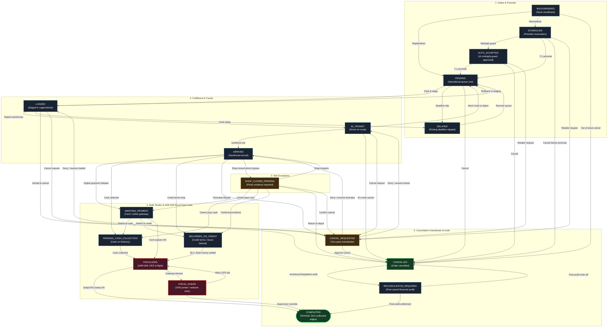

# Canonical State Machine Graph: Order Lifecycle

This document specifies the authoritative Order State Machine for the Pegasus system, strictly codified in [`pegasusX/apps/backend-go/order/state_machine.go`](file:///Users/shakhzod/Desktop/V.O.I.D/pegasusX/apps/backend-go/order/state_machine.go) and [`pegasusX/apps/backend-go/order/graph.go`](file:///Users/shakhzod/Desktop/V.O.I.D/pegasusX/apps/backend-go/order/graph.go).

Every order transition is validated against this graph prior to database mutation in Cloud Spanner, and recorded into the immutable [`OrderStatusTransitions`](file:///Users/shakhzod/Desktop/V.O.I.D/pegasusX/apps/backend-go/order/status_timeline.go) audit log.

---

## 1. Canonical State Machine Graph (Mermaid)

---

## 2. Transition Matrix & Guardrail Rulebook

| # | Current State (`from`) | Permitted Next States (`to`) | Trigger / Actor | Invariant / Guardrail Enforcement |
|:---:|:---|:---|:---|:---|
| **1** | `SCHEDULED` | `AUTO_ACCEPTED`, `PENDING`, `CANCELLED`, `CANCEL_REQUESTED` | AI Midnight Guard / Scheduler / Retailer | Preorders cannot be picked directly (`LOADED` blocked). Must promote to `PENDING` at T-1 window. |
| **2** | `AUTO_ACCEPTED` | `PENDING`, `CANCELLED`, `CANCEL_REQUESTED` | Midnight Job / Retailer | Confirmed preorder awaiting warehouse morning wave dispatch. |
| **3** | `BACKORDERED` | `PENDING`, `SCHEDULED`, `CANCELLED` | Inventory Replenishment Worker | Reactivates into active operational queue once stock is secured or rescheduled. |
| **4** | `PENDING` | `LOADED`, `DELAYED`, `CANCELLED` | Warehouse Packer / WMS | Root operational queue state. Delay occurs if picking window slips. |
| **5** | `DELAYED` | `PENDING` | Dispatch Recovery Engine | Slipped orders can only recover back to `PENDING` to re-enter dispatch staging. |
| **6** | `LOADED` | `IN_TRANSIT`, `PENDING`, `DELAYED`, `CANCELLED`, `CANCEL_REQUESTED` | Driver / Dock Worker / Retailer | Order staged in vehicle. Can rollback to `PENDING` if vehicle is swapped or unloading is required. |
| **7** | `IN_TRANSIT` | `ARRIVED`, `PENDING`, `CANCELLED`, `CANCEL_REQUESTED` | Driver GPS / Route Abort Engine | `ARRIVED` is gated by geofence or supervised proximity bypass. Aborting route rolls order back to `PENDING`. |
| **8** | `ARRIVED` | `AWAITING_PAYMENT`, `PENDING_CASH_COLLECTION`, `DELIVERED_ON_CREDIT`, `SHOP_CLOSED_PENDING`, `CANCEL_REQUESTED` | Driver / Retailer POS | **ADR-009 Fiscal Hard-Gate:** Direct transition to `COMPLETED` is strictly prohibited. |
| **9** | `SHOP_CLOSED_PENDING` | `AWAITING_PAYMENT`, `PENDING_CASH_COLLECTION`, `DELIVERED_ON_CREDIT`, `ARRIVED`, `CANCEL_REQUESTED`, `CANCELLED` | Driver / Retailer Contact / Dispatcher | Requires geo-timestamped photo evidence of storefront before transition. Can reopen to `ARRIVED` or resolve tender. |
| **10** | `AWAITING_PAYMENT` | `FISCALIZING`, `PENDING_CASH_COLLECTION`, `DELIVERED_ON_CREDIT` | Retailer Payment Gateway / Driver | Digital payment gateway (Uzum / Payme / Card). Switching tenders permitted before capture. |
| **11** | `PENDING_CASH_COLLECTION`| `FISCALIZING` | Driver Cash Handover | Physical cash collected. Moves immediately to OFD fiscalization. |
| **12** | `DELIVERED_ON_CREDIT` | `FISCALIZING` | Accounting / Settlement Sweeper | **§9.1 Credit Invariant:** Non-terminal state. Bypasses immediate cash, but moves to `FISCALIZING` only once money/promissory note settles. |
| **13** | `FISCALIZING` | `COMPLETED`, `FISCAL_FAILED` | Soliq OFD Fiscal Service | Active submission to national tax registry. Success leads to terminal `COMPLETED`. |
| **14** | `FISCAL_FAILED` | `FISCALIZING`, `COMPLETED` | Retry Worker / Supervisor Override | OFD printer/service timeout. Allows automatic background retry or role-gated supervisor manual completion. |
| **15** | `CANCEL_REQUESTED` | `CANCELLED`, `LOADED`, `IN_TRANSIT`, `ARRIVED` | Retailer / Dispatcher Resolution | **Anti-Brick Safeguard:** If cancellation is denied or retracted, the order safely resumes from its previous operational leg (`LOADED`, `IN_TRANSIT`, or `ARRIVED`). |
| **16** | `CANCELLED` | `RECONCILIATION_REQUIRED` | Inventory Auditor / WMS Sweeper | Inventory restock and refund reconciliation audit loop. |
| **17** | `RECONCILIATION_REQUIRED`| `COMPLETED`, `CANCELLED` | Financial Audit Lead | Settles post-cancellation chargebacks or inventory write-offs. |
| **18** | `COMPLETED` | *(None — Terminal)* | Terminal State | Zero outbound edges. Any transition attempt returns `ErrInvalidStatusTransition`. |

*(Note: Identity transitions `current == next` are universally permitted as no-op idempotency calls).*

---

## 3. Key Invariants & Enforcements

1. **ADR-009 Fiscal Hard-Gate**: Neither `ARRIVED`, `AWAITING_PAYMENT`, `PENDING_CASH_COLLECTION`, nor `DELIVERED_ON_CREDIT` can directly jump to `COMPLETED`. They must pass through `FISCALIZING`.
2. **Credit Leave-Behind (§9.1)**: `DELIVERED_ON_CREDIT` is a non-terminal operational state. Delivery of goods has occurred, but financial settlement is open. Force-complete cannot be executed while in credit status. The settlement collector must record real fiat receipt, which triggers `FISCALIZING` before the order can close.
3. **Anti-Brick Handshake Safeguard**: Denying a `CANCEL_REQUESTED` event safely returns the order to `LOADED`, `IN_TRANSIT`, or `ARRIVED` to prevent deadlocking orders.
4. **Shop Closed Protocol**: Requires GPS proximity and driver photo evidence before moving to `SHOP_CLOSED_PENDING`.
5. **Idempotency**: All `from == to` calls succeed without state mutation.
