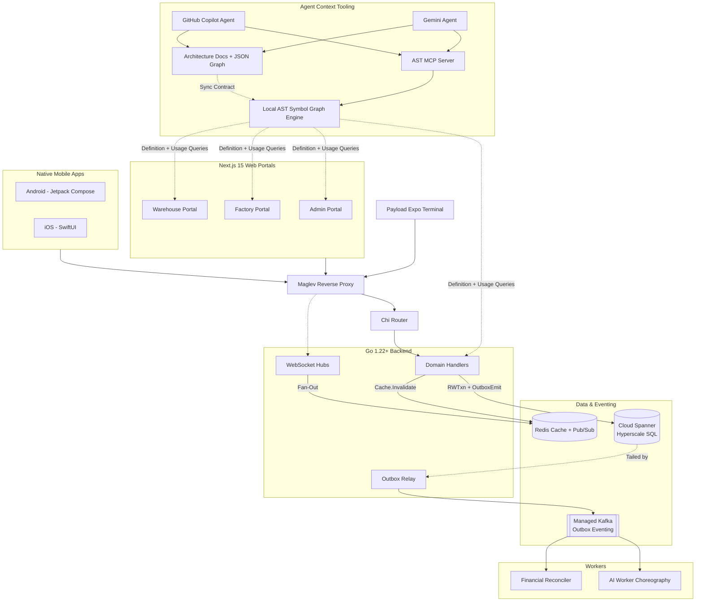

# V.O.I.D. Architecture & Topology

Use this map to understand how pieces connect before executing any end-to-end task.

## Implementation Rules
1. **The Outbox Primitive**: All entity creation and state transitions must write a domain row AND an `OutboxEvents` row in the same Spanner `ReadWriteTransaction`. DO NOT use direct `writer.WriteMessages` for entity CRUD.
2. **Version Gating**: All updates use optimistic concurrency (`If-Match: <version>`). Consumer events use the same version checking.
3. **Priority Guard**: Rate limiting and load shedding are enforced at the Maglev + Router layer. Keep handlers stateless and fast.

## Runtime Contract Notes
- **Legacy order detail surface**: `GET /v1/orders/{id}`, `GET /v1/orders/{id}/events`, `PATCH /v1/orders/{id}/status`, and `PATCH /v1/orders/{id}/state` are delegated from `pegasus/apps/backend-go/main.go` into `pegasus/apps/backend-go/order/legacy_orders.go` via `order.HandleLegacyOrdersPath`.
- **Cross-client compatibility**: The GET detail handler returns an additive superset payload so the same route can hydrate driver iOS, driver Android, and retailer desktop order detail views without emulator-only inspection, while `GET /v1/orders/{id}/events` exposes the scoped `OrderEvents` audit timeline for the supplier order drawer.
- **Patch compatibility**: The legacy PATCH handler accepts either `status` or `state` in the request body and accepts both `/status` and `/state` path aliases while clients converge on a single field name.
- **Supplier geo-planning surface**: `pegasus/apps/backend-go/proximityroutes/routes.go` now composes `GET /v1/supplier/serving-warehouse`, `GET /v1/supplier/geo-report`, `GET /v1/supplier/zone-preview`, `POST /v1/supplier/warehouses/validate-coverage`, and `GET /v1/supplier/warehouse-loads` instead of leaving that cluster inline in `main.go`.
- **Supplier geo-planning parity**: the current supplier portal consumers are `app/supplier/geo-report/page.tsx`, `app/supplier/warehouses/CoverageEditor.tsx`, and `components/warehouse/CoverageMap.tsx`, while `serving-warehouse` and `warehouse-loads` remain supplier-facing backend support paths for coverage and load planning.
- **Supplier self-service surface**: `pegasus/apps/backend-go/supplierroutes/routes.go` now composes `POST /v1/supplier/configure`, `POST /v1/supplier/billing/setup`, `GET/PUT /v1/supplier/profile`, `PATCH /v1/supplier/shift`, `GET/POST/DELETE /v1/supplier/payment-config`, `GET/POST/DELETE /v1/supplier/gateway-onboarding`, and `POST /v1/supplier/payment/recipient/register` instead of leaving that block inline in `main.go`.
- **Supplier self-service parity**: current portal consumers span `app/setup/billing/page.tsx`, `app/supplier/profile/page.tsx`, `app/supplier/payment-config/page.tsx`, `hooks/useSupplierShift.tsx`, and supplier profile readers in product-management screens, so this route family stays one supplier-scoped contract across onboarding, billing, profile, and gateway setup.
- **Warehouse ops compatibility surface**: `pegasus/apps/backend-go/warehouse/inventory.go`, `pegasus/apps/backend-go/warehouse/staff.go`, and `pegasus/apps/backend-go/warehouse/vehicles.go` expose additive compatibility fields for the warehouse portal, warehouse iOS, and warehouse Android clients.
- **Warehouse inventory compatibility**: `GET/PATCH /v1/warehouse/ops/inventory` accepts both `q` and `search`, accepts either `sku_id` or `product_id` on mutation, and returns both `inventory` and `items` collections with `sku_id` plus `product_id` aliases.
- **Warehouse staff and vehicle compatibility**: `POST /v1/warehouse/ops/staff` accepts an optional PIN and returns the effective one-time PIN, while warehouse vehicle payloads expose both `max_volume_vu` and `capacity_vu`, a derived `status` field, and an additive `unavailable_reason` field for native client parity.
- **Warehouse fleet control parity**: `PATCH /v1/warehouse/ops/drivers/{id}/assign-vehicle` and `PATCH /v1/warehouse/ops/vehicles/{id}` now drive the warehouse portal drivers or vehicles tables plus the warehouse iOS and warehouse Android fleet screens from the same contract. Vehicle availability changes also gate dispatch preview on `Vehicles.IsActive` so inactive trucks stay out of warehouse auto-dispatch.
- **Warehouse vehicle unavailable-reason parity**: `Vehicles.UnavailableReason` is schema-backed in Spanner and flows through the warehouse portal, warehouse iOS, and warehouse Android vehicle screens so every client both displays the persisted reason and chooses from the same additive reason set when disabling a truck.
- **Warehouse live contract**: `pegasus/apps/backend-go/warehouse/supply_requests.go` and `pegasus/apps/backend-go/warehouse/dispatch_lock.go` emit post-commit `SUPPLY_REQUEST_UPDATE` and `DISPATCH_LOCK_CHANGE` frames through `pegasus/apps/backend-go/ws/warehouse_hub.go` on `/ws/warehouse`. Current subscribers are the warehouse portal supply-request and dispatch-lock pages plus the warehouse iOS and warehouse Android dispatch screens.
- **Warehouse live client resilience**: `pegasus/apps/warehouse-portal/lib/auth.ts`, `pegasus/apps/warehouse-app-ios/WarehouseApp/Services/WarehouseRealtimeClient.swift`, and `pegasus/apps/warehouse-app-android/app/src/main/java/com/pegasus/warehouse/data/remote/WarehouseRealtimeClient.kt` now auto-reconnect after transient drops and expose reconnecting or offline state so warehouse dispatch surfaces do not silently freeze.
- **Warehouse dispatch mutation parity**: warehouse portal detail and lock screens plus warehouse iOS and warehouse Android dispatch surfaces now consume the same create or cancel supply-request and acquire or release dispatch-lock endpoints, keeping dispatch control parity across the warehouse role row.

## Agent Context Rules
1. **MCP First**: Before any technical task, call native MCP tools `void_ast_index`, `void_ast_definition`, `void_ast_usages`, and `void_ast_graph`.
2. **Script Fallback**: If MCP tools are unavailable, run `npm --prefix pegasus run ast:index`, `ast:def`, `ast:refs`, and `ast:graph` for the target symbol.
3. **Dual Read Mandatory**: Agent retrieval is complete only after symbol graph queries plus architecture docs and technology inventory docs are read.
4. **Codebase-First Mandatory**: Runtime code paths are the primary source of truth. Documentation is mandatory for validation and synchronization, but never a replacement for code-level definition/usage/graph retrieval.
5. **Prompt Verification Gate**: Before implementation, classify request risk (`safe`, `risky`, `production-breaking`, `scope-conflict`). If not `safe`, propose the safer approach first.
6. **Dual Sync Mandatory**: If architecture, dependencies, services, or integrations change, update the full sync set in one change set:
    - `.github/ACT.md`
    - `.github/copilot-instructions.md`
    - `.github/gemini-instructions.md`
    - `pegasus/context/architecture.md`
    - `pegasus/context/architecture-graph.json`
    - `pegasus/context/technology-inventory.md`
    - `pegasus/context/technology-inventory.json`
7. **ACT Mandatory**: Follow `.github/ACT.md`; challenge unsafe plans and enforce Spanner, Kafka, Redis, Terraform, Maglev, and hyper-scale readiness checks before execution.
8. **One-Eye Guard Suite Mandatory**: PRs must pass `contract_guard_mcp.py`, `architecture_guard_mcp.py`, `design_system_guard_mcp.py`, `production_safety_guard.py`, `visual_test_intelligence_guard.py`, and `security_guard.py`.
9. **Uniform Codebase-First Enforcement**: MCP-facing one-eye guards (`contract_guard_mcp.py`, `architecture_guard_mcp.py`, `design_system_guard_mcp.py`) enforce codebase-first weighting where trigger-scoped codebase changes must be greater than or equal to context-doc sync changes.
