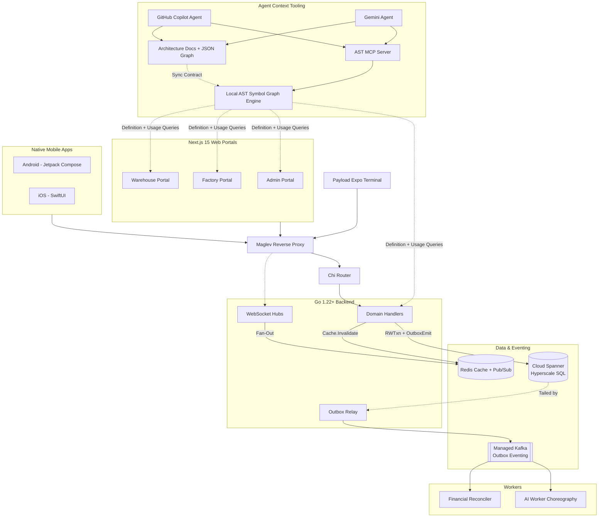

# V.O.I.D. Architecture & Topology

Use this map to understand how pieces connect before executing any end-to-end task.

## Implementation Rules
1. **The Outbox Primitive**: All entity creation and state transitions must write a domain row AND an `OutboxEvents` row in the same Spanner `ReadWriteTransaction`. DO NOT use direct `writer.WriteMessages` for entity CRUD.
2. **Version Gating**: All updates use optimistic concurrency (`If-Match: <version>`). Consumer events use the same version checking.
3. **Priority Guard**: Rate limiting and load shedding are enforced at the Maglev + Router layer. Keep handlers stateless and fast.

## Runtime Contract Notes
- **Shared order compatibility surface**: `pegasus/apps/backend-go/orderroutes/routes.go` now composes `GET /v1/orders`, `GET /v1/order/refunds`, `GET /v1/orders/{id}`, `GET /v1/orders/{id}/events`, `PATCH /v1/orders/{id}/status`, and `PATCH /v1/orders/{id}/state`, with detail/action handling delegated into `pegasus/apps/backend-go/order/legacy_orders.go` via `order.HandleLegacyOrdersPath`.
- **Cross-client compatibility**: The GET detail handler returns an additive superset payload so the same route can hydrate driver iOS, driver Android, and retailer desktop order detail views without emulator-only inspection, while `GET /v1/orders/{id}/events` exposes the scoped `OrderEvents` audit timeline for the supplier order drawer.
- **Patch compatibility**: The legacy PATCH handler accepts either `status` or `state` in the request body and accepts both `/status` and `/state` path aliases while clients converge on a single field name.
- **Retailer role-row surface**: `pegasus/apps/backend-go/retailerroutes/routes.go` now composes `GET /v1/retailer/analytics/{expenses,detailed}`, `POST /v1/{orders/request-cancel,order/cash-checkout,order/card-checkout,retailer/shop-closed-response}`, `GET/POST/DELETE /v1/retailer/family-members*`, `POST /v1/retailer/orders/{confirm-ai,reject-ai}`, `POST /v1/orders/{edit-preorder,confirm-preorder}`, `GET/POST /v1/retailer/cart/sync`, `GET/POST /v1/retailer/suppliers*`, `GET/PUT /v1/retailer/profile`, `GET /v1/retailers/{retailerID}/orders`, `GET /v1/retailer/{tracking,cards,pending-payments,active-fulfillment}`, `POST /v1/retailer/card/{initiate,confirm,deactivate,default}`, `PATCH|GET /v1/retailer/settings/auto-order*`, and `GET /v1/ws/retailer` instead of leaving that retailer contract slab inline in `main.go`.
- **Retailer mutation and realtime parity**: `POST /v1/order/create` and `POST /v1/order/cancel` are mounted through `retailerroutes` with idempotency guards, while retailer notification WebSocket frames carry additive top-level `order_id`, `state`, `new_state`, and `old_state` aliases so desktop, Android, and iOS can refresh live order/payment views without parsing the persistent-inbox payload string.
- **Retailer role-row parity**: current consumers span `pegasus/apps/retailer-app-desktop` supplier, analytics, tracking, saved-card, pending-payment, and order-detail flows plus the richer iOS and Android retailer order, fulfillment, tracking, and auto-order settings surfaces, so route ownership now centralizes the shared retailer read, payment, settings, and realtime contract before DTO sync across the three retailer clients.
- **Supplier geo-planning surface**: `pegasus/apps/backend-go/proximityroutes/routes.go` now composes `GET /v1/supplier/serving-warehouse`, `GET /v1/supplier/geo-report`, `GET /v1/supplier/dispatch-audits`, `GET /v1/supplier/zone-preview`, `POST /v1/supplier/warehouses/validate-coverage`, and `GET /v1/supplier/warehouse-loads` instead of leaving that cluster inline in `main.go`.
- **Supplier geo-planning parity**: the current supplier portal consumers are `app/supplier/geo-report/page.tsx`, `app/supplier/warehouses/CoverageEditor.tsx`, `components/warehouse/CoverageMap.tsx`, and the supplier homepage `components/dashboard/OrphanAlertsCell.tsx`; `dispatch-audits` is the indexed read-side feed for the coverage-alerts tile, while `serving-warehouse` and `warehouse-loads` remain supplier-facing backend support paths for coverage and load planning.
- **Supplier self-service surface**: `pegasus/apps/backend-go/supplierroutes/routes.go` now composes `POST /v1/supplier/configure`, `POST /v1/supplier/billing/setup`, `GET/PUT /v1/supplier/profile`, `PATCH /v1/supplier/shift`, `GET/POST/DELETE /v1/supplier/payment-config`, `GET/POST/DELETE /v1/supplier/gateway-onboarding`, and `POST /v1/supplier/payment/recipient/register` instead of leaving that block inline in `main.go`.
- **Supplier self-service parity**: current portal consumers span `app/setup/billing/page.tsx`, `app/supplier/profile/page.tsx`, `app/supplier/payment-config/page.tsx`, `hooks/useSupplierShift.tsx`, and supplier profile readers in product-management screens, so this route family stays one supplier-scoped contract across onboarding, billing, profile, and gateway setup.
- **Supplier warehouse-ops surface**: `pegasus/apps/backend-go/supplierroutes/routes.go` now also composes `GET /v1/supplier/org/members`, `POST /v1/supplier/org/members/invite`, `PUT/DELETE /v1/supplier/org/members/{id}`, `GET/POST /v1/supplier/staff/payloader`, `POST /v1/supplier/staff/payloader/{id}/rotate-pin`, `GET /v1/supplier/warehouse-staff`, `PATCH /v1/supplier/warehouse-staff/{id}`, `GET/POST /v1/supplier/warehouses`, `GET/PUT/DELETE /v1/supplier/warehouses/{id}`, `POST /v1/supplier/warehouses/{id}/coverage`, and `GET /v1/supplier/warehouse-inflight-vu` instead of leaving that supplier-ops block inline in `main.go`.
- **Supplier warehouse coverage save parity**: `POST /v1/supplier/warehouses/{id}/coverage` now persists the polygon-derived H3 set through the same warehouse spatial outbox and cache-refresh path as warehouse coordinate edits, closing the previously unwired `CoverageEditor.tsx` save action while keeping the portal consumers (`app/supplier/org/page.tsx`, `app/supplier/staff/page.tsx`, `app/supplier/warehouses/page.tsx`, `app/supplier/warehouses/WarehouseStaffPanel.tsx`, `app/supplier/warehouses/CoverageEditor.tsx`, and `components/factory/FactoryNetworkMap.tsx`) on one supplier warehouse-ops contract.
- **Supplier catalog-pricing surface**: `pegasus/apps/backend-go/suppliercatalogroutes/routes.go` now composes `GET /v1/supplier/products/upload-ticket`, `GET/POST /v1/supplier/products`, `GET/PUT/DELETE /v1/supplier/products/{sku_id}`, `GET/POST /v1/supplier/pricing/rules`, `DELETE /v1/supplier/pricing/rules/{tier_id}`, `GET/POST /v1/supplier/pricing/retailer-overrides`, and `DELETE /v1/supplier/pricing/retailer-overrides/{id}` instead of leaving that supplier catalog-pricing cluster inline in `main.go`.
- **Supplier catalog-pricing parity**: current portal consumers span `components/SupplierProductForm.tsx`, `components/SupplierPromotionForm.tsx`, `app/supplier/products/page.tsx`, `app/supplier/products/[sku_id]/page.tsx`, `app/supplier/catalog/page.tsx`, `app/supplier/pricing/page.tsx`, and `app/supplier/pricing/retailer-overrides/page.tsx`, so products, discount tiers, and per-retailer overrides now register as one extracted supplier portal contract.
- **Supplier logistics surface**: `pegasus/apps/backend-go/supplierlogisticsroutes/routes.go` now composes `GET /v1/supplier/picking-manifests`, `GET /v1/supplier/picking-manifests/orders`, `GET /v1/supplier/manifests`, `GET /v1/supplier/manifests/{id}`, `POST /v1/supplier/manifests/{id}/{start-loading|seal|inject-order}`, `POST /v1/payload/manifest-exception`, `GET /v1/supplier/manifest-exceptions`, `POST /v1/supplier/manifests/{auto-dispatch|dispatch-recommend|manual-dispatch}`, `GET /v1/supplier/manifests/waiting-room`, `GET /v1/supplier/fleet-volumetrics`, `POST /v1/supplier/dispatch-queue`, and `GET /v1/supplier/dispatch-preview` instead of leaving that supplier fulfillment block inline in `main.go`.
- **Supplier logistics parity**: current portal consumers span `app/supplier/manifests/page.tsx`, `app/supplier/manifest-exceptions/page.tsx`, `app/supplier/dispatch/page.tsx`, and the supplier orders dispatch trigger in `app/supplier/orders/page.tsx`, while the payloader still uses `POST /v1/payload/manifest-exception`; the extracted composer preserves that shared manifest contract without changing handler ownership in `backend-go/supplier`.
- **Payload loading surface**: `POST /v1/auth/payloader/login`, `GET /v1/payloader/{trucks,orders}`, `POST /v1/payloader/recommend-reassign`, the shared `GET /v1/supplier/manifests*` and `POST /v1/supplier/manifests/{id}/{start-loading|seal|inject-order}` lifecycle paths, `POST /v1/payload/{manifest-exception,seal}`, `GET /v1/user/notifications`, and `/v1/ws/payloader` together form one payload role-row contract for the Expo terminal plus payload iOS and payload Android clients.
- **Payload access parity**: the shared supplier manifest routes, payload manifest-exception route, and `/v1/ws/payloader` realtime path now admit `PAYLOADER` alongside supplier or admin callers where payload apps already depend on those paths, so the three payload clients and supplier logistics stay on one manifest contract.
- **Payload realtime parity**: `/v1/ws/payloader` now carries both `PUSH` notification envelopes and typed `PAYLOAD_SYNC` refresh envelopes (`channel=SYNC`) so Expo, iOS, and Android payload clients can refresh the active manifest slice on external manifest overrides without rendering blank notifications. Draft creation plus supplier-side `start-loading`, `inject-order`, `seal`, and `manifest-exception` mutations now emit that sync signal atomically with the manifest write.
- **Supplier insights surface**: `pegasus/apps/backend-go/supplierinsightsroutes/routes.go` now composes `GET/PUT /v1/supplier/country-overrides`, `GET/DELETE /v1/supplier/country-overrides/{code}`, `GET /v1/supplier/analytics/{velocity,demand/today,demand/history,transit-heatmap,throughput,load-distribution,node-efficiency,sla-health,revenue,top-retailers}`, `GET /v1/supplier/financials`, and `GET /v1/supplier/crm/retailers*` instead of leaving that supplier insight block inline in `main.go`.
- **Supplier insights parity**: current portal consumers span `app/supplier/country-overrides/page.tsx`, `app/supplier/analytics/page.tsx`, `app/supplier/analytics/demand/page.tsx`, `app/supplier/dashboard/page.tsx`, `hooks/useAnalytics.ts`, `hooks/useAdvancedAnalytics.ts`, and `app/supplier/crm/page.tsx`, so analytics, financials, CRM, and supplier country override settings now register as one extracted read-side contract.
- **Supplier CRM contact parity**: supplier CRM list/detail responses now include additive retailer `email` alongside the existing phone and value fields, so `app/supplier/crm/page.tsx` can render the contact drawer without falling back to an empty mail link.
- **Supplier operations surface**: `pegasus/apps/backend-go/supplieroperationsroutes/routes.go` now composes `GET/POST /v1/supplier/fleet/drivers`, `GET/PATCH/POST /v1/supplier/fleet/drivers/{id}`, `GET/POST /v1/supplier/fleet/vehicles`, `GET/PATCH/DELETE /v1/supplier/fleet/vehicles/{id}`, `POST /v1/supplier/fulfillment/pay`, `GET /v1/supplier/returns`, `POST /v1/supplier/returns/resolve`, `GET /v1/supplier/quarantine-stock`, and `POST /v1/inventory/reconcile-returns` instead of leaving that supplier operations block inline in `main.go`.
- **Supplier operations parity**: current portal consumers span `app/supplier/fleet/page.tsx`, the legacy supplier driver read on `app/page.tsx`, `app/supplier/returns/page.tsx`, and `app/supplier/depot-reconciliation/page.tsx`; the extracted composer preserves the existing fulfillment-pay error mapping and reverse-logistics handlers while lifting route ownership out of `main.go`.
- **Supplier planning surface**: `pegasus/apps/backend-go/supplierplanningroutes/routes.go` now composes `GET/POST /v1/supplier/delivery-zones`, `PUT/DELETE /v1/supplier/delivery-zones/{id}`, `GET/POST /v1/supplier/factories`, `GET/PATCH/DELETE /v1/supplier/factories/{id}`, `GET /v1/supplier/factories/{recommend-warehouses,optimal-assignments}`, `GET /v1/supplier/geocode/reverse`, `GET /v1/supplier/retailers/locations`, `GET/POST /v1/supplier/supply-lanes`, `GET/PATCH/DELETE /v1/supplier/supply-lanes/{id}`, `GET/PUT /v1/supplier/network-mode`, `GET /v1/supplier/network-analytics`, `POST /v1/supplier/replenishment/{kill-switch,pull-matrix,predictive-push}`, `GET /v1/supplier/replenishment/audit`, and `GET/POST /v1/supplier/warehouses/{territory-preview,apply-territory}` instead of leaving that planning and replenishment block inline in `main.go`.
- **Supplier planning parity**: this extracted surface now keeps the supplier map/planning contract together across delivery-zone setup, supplier→factory planning, reverse geocode, retailer map overlays, supply-lane optimization, replenishment controls, and territory reassignment while leaving the cron startup in `main.go`.
- **Supplier factory metadata parity**: supplier factory create, list, detail, and factory-profile responses now persist and return additive `h3_index` and `product_types` fields so `app/supplier/factories/page.tsx`, `components/factory/CreateFactoryWizard.tsx`, and the supplier planning overview stop relying on UI-only defaults for geospatial identity and factory category tags.
- **Supplier supply-lane mutation parity**: supply-lane update, transit-refresh, and deactivate actions now resolve the organisation supplier scope through `claims.ResolveSupplierID()` instead of the supplier user id, and plain lane edits accept `PATCH` as published by the planning contract. This keeps `app/supplier/supply-lanes/page.tsx` and future planning clients from getting success-shaped no-ops on organisation-scoped tokens.
- **Warehouse ops compatibility surface**: `pegasus/apps/backend-go/warehouse/inventory.go`, `pegasus/apps/backend-go/warehouse/staff.go`, and `pegasus/apps/backend-go/warehouse/vehicles.go` expose additive compatibility fields for the warehouse portal, warehouse iOS, and warehouse Android clients.
- **Warehouse inventory compatibility**: `GET/PATCH /v1/warehouse/ops/inventory` accepts both `q` and `search`, accepts either `sku_id` or `product_id` on mutation, and returns both `inventory` and `items` collections with `sku_id` plus `product_id` aliases.
- **Warehouse staff and vehicle compatibility**: `POST /v1/warehouse/ops/staff` accepts an optional PIN and returns the effective one-time PIN, while warehouse vehicle payloads expose both `max_volume_vu` and `capacity_vu`, a derived `status` field, and an additive `unavailable_reason` field for native client parity.
- **Warehouse fleet control parity**: `PATCH /v1/warehouse/ops/drivers/{id}/assign-vehicle` and `PATCH /v1/warehouse/ops/vehicles/{id}` now drive the warehouse portal drivers or vehicles tables plus the warehouse iOS and warehouse Android fleet screens from the same contract. Vehicle availability changes also gate dispatch preview on `Vehicles.IsActive` so inactive trucks stay out of warehouse auto-dispatch.
- **Warehouse vehicle unavailable-reason parity**: `Vehicles.UnavailableReason` is schema-backed in Spanner and flows through the warehouse portal, warehouse iOS, and warehouse Android vehicle screens so every client both displays the persisted reason and chooses from the same additive reason set when disabling a truck.
- **Warehouse driver and dispatch reason parity**: warehouse driver payloads now carry `vehicle_is_active` and `vehicle_unavailable_reason`, while dispatch preview returns both `available_drivers` and additive `unavailable_drivers` compatibility lists so portal, iOS, and Android can explain why an assigned truck is out instead of silently hiding the driver.
- **Warehouse live contract**: `pegasus/apps/backend-go/warehouse/supply_requests.go` and `pegasus/apps/backend-go/warehouse/dispatch_lock.go` emit post-commit `SUPPLY_REQUEST_UPDATE` and `DISPATCH_LOCK_CHANGE` frames through `pegasus/apps/backend-go/ws/warehouse_hub.go` on `/ws/warehouse`. Current subscribers are the warehouse portal supply-request and dispatch-lock pages plus the warehouse iOS and warehouse Android dispatch screens.
- **Warehouse live client resilience**: `pegasus/apps/warehouse-portal/lib/auth.ts`, `pegasus/apps/warehouse-app-ios/WarehouseApp/Services/WarehouseRealtimeClient.swift`, and `pegasus/apps/warehouse-app-android/app/src/main/java/com/pegasus/warehouse/data/remote/WarehouseRealtimeClient.kt` now auto-reconnect after transient drops and expose reconnecting or offline state so warehouse dispatch surfaces do not silently freeze.
- **Warehouse dispatch mutation parity**: warehouse portal detail and lock screens plus warehouse iOS and warehouse Android dispatch surfaces now consume the same create or cancel supply-request and acquire or release dispatch-lock endpoints, keeping dispatch control parity across the warehouse role row.

## Agent Context Rules
1. **MCP First**: Before any technical task, call native MCP tools `void_ast_index`, `void_ast_definition`, `void_ast_usages`, and `void_ast_graph`.
2. **Script Fallback**: If MCP tools are unavailable, run `npm --prefix pegasus run ast:index`, `ast:def`, `ast:refs`, and `ast:graph` for the target symbol.
3. **Dual Read Mandatory**: Agent retrieval is complete only after symbol graph queries plus architecture docs and technology inventory docs are read.
4. **Codebase-First Mandatory**: Runtime code paths are the primary source of truth. Documentation is mandatory for validation and synchronization, but never a replacement for code-level definition/usage/graph retrieval.
5. **Prompt Verification Gate**: Before implementation, classify request risk (`safe`, `risky`, `production-breaking`, `scope-conflict`). If not `safe`, propose the safer approach first.
6. **Dual Sync Mandatory**: If architecture, dependencies, services, or integrations change, update the full sync set in one change set:
    - `.github/ACT.md`
    - `.github/copilot-instructions.md`
    - `.github/gemini-instructions.md`
    - `pegasus/context/architecture.md`
    - `pegasus/context/architecture-graph.json`
    - `pegasus/context/technology-inventory.md`
    - `pegasus/context/technology-inventory.json`
7. **ACT Mandatory**: Follow `.github/ACT.md`; challenge unsafe plans and enforce Spanner, Kafka, Redis, Terraform, Maglev, and hyper-scale readiness checks before execution.
8. **One-Eye Guard Suite Mandatory**: PRs must pass `contract_guard_mcp.py`, `architecture_guard_mcp.py`, `design_system_guard_mcp.py`, `production_safety_guard.py`, `visual_test_intelligence_guard.py`, and `security_guard.py`.
9. **Uniform Codebase-First Enforcement**: MCP-facing one-eye guards (`contract_guard_mcp.py`, `architecture_guard_mcp.py`, `design_system_guard_mcp.py`) enforce codebase-first weighting where trigger-scoped codebase changes must be greater than or equal to context-doc sync changes.
- **Supplier core surface**: `pegasus/apps/backend-go/suppliercoreroutes/routes.go` now composes `GET /v1/supplier/dashboard`, `GET /v1/supplier/earnings`, `GET/PATCH /v1/supplier/inventory`, `GET /v1/supplier/inventory/audit`, `GET /v1/supplier/orders`, and `POST /v1/supplier/orders/vet` instead of leaving the dashboard, earnings, inventory, and supplier-order vetting block inline in `main.go`.
- **Supplier core parity**: the extracted composer keeps the supplier dashboard metrics call on `order.OrderService`, the supplier earnings analytics handler, inventory management handlers, and the order-vetting workflow together as one core portal contract; after this pass, `main.go` no longer registers any `/v1/supplier/*` routes inline.
- **Supplier inventory compatibility parity**: `supplier.HandleInventory` now honors the mounted root `PATCH /v1/supplier/inventory` contract and publishes additive `sku_id`/`product_name` aliases on both inventory and audit rows, keeping `app/supplier/inventory/page.tsx` aligned without dropping the legacy `product_id`/`sku_name` keys.
