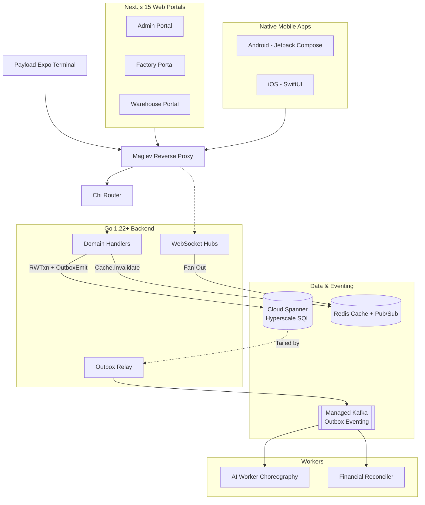

# V.O.I.D. Architecture & Topology

Use this map to understand how pieces connect before executing any end-to-end task.

## Implementation Rules
1. **The Outbox Primitive**: All entity creation and state transitions must write a domain row AND an `OutboxEvents` row in the same Spanner `ReadWriteTransaction`. DO NOT use direct `writer.WriteMessages` for entity CRUD.
2. **Version Gating**: All updates use optimistic concurrency (`If-Match: <version>`). Consumer events use the same version checking.
3. **Priority Guard**: Rate limiting and load shedding are enforced at the Maglev + Router layer. Keep handlers stateless and fast.