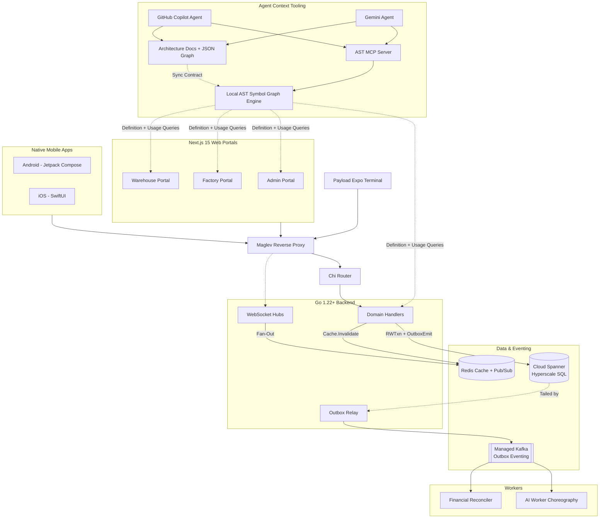

# V.O.I.D. Architecture & Topology

Use this map to understand how pieces connect before executing any end-to-end task.

## Implementation Rules
1. **The Outbox Primitive**: All entity creation and state transitions must write a domain row AND an `OutboxEvents` row in the same Spanner `ReadWriteTransaction`. DO NOT use direct `writer.WriteMessages` for entity CRUD.
2. **Version Gating**: All updates use optimistic concurrency (`If-Match: <version>`). Consumer events use the same version checking.
3. **Priority Guard**: Rate limiting and load shedding are enforced at the Maglev + Router layer. Keep handlers stateless and fast.

## Agent Context Rules
1. **MCP First**: Before any technical task, call native MCP tools `void_ast_index`, `void_ast_definition`, `void_ast_usages`, and `void_ast_graph`.
2. **Script Fallback**: If MCP tools are unavailable, run `npm --prefix pegasus run ast:index`, `ast:def`, `ast:refs`, and `ast:graph` for the target symbol.
3. **Dual Read Mandatory**: Agent retrieval is complete only after symbol graph queries plus architecture docs and technology inventory docs are read.
4. **Prompt Verification Gate**: Before implementation, classify request risk (`safe`, `risky`, `production-breaking`, `scope-conflict`). If not `safe`, propose the safer approach first.
5. **Dual Sync Mandatory**: If architecture, dependencies, services, or integrations change, update the full sync set in one change set:
    - `.github/ACT.md`
    - `.github/copilot-instructions.md`
    - `.github/gemini-instructions.md`
    - `pegasus/context/architecture.md`
    - `pegasus/context/architecture-graph.json`
    - `pegasus/context/technology-inventory.md`
    - `pegasus/context/technology-inventory.json`
6. **ACT Mandatory**: Follow `.github/ACT.md`; challenge unsafe plans and enforce Spanner, Kafka, Redis, Terraform, Maglev, and hyper-scale readiness checks before execution.