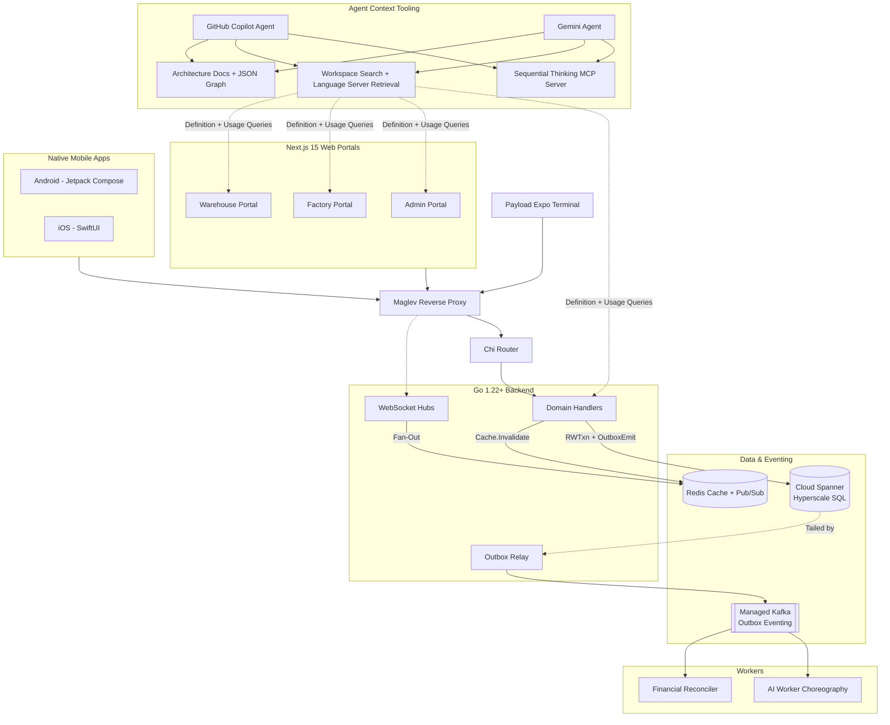

# V.O.I.D. Architecture & Topology

Use this map to understand how pieces connect before executing any end-to-end task.

```mermaid
graph TD
    %% Core Infrastructure
    Maglev[Maglev Reverse Proxy]
    Router[Chi Router]

    subgraph Data & Eventing
        Spanner[(Cloud Spanner\nHyperscale SQL)]
        Redis[(Redis Cache + Pub/Sub)]
        Kafka[[Managed Kafka\nOutbox Eventing]]
    end

    subgraph Backend [Go 1.22+ Backend]
        Handlers[Domain Handlers]
        WSHubs[WebSocket Hubs]
        OutboxRelay[Outbox Relay]
    end

    subgraph Workers
        AIWorker[AI Worker Choreography]
        Reconciler[Financial Reconciler]
    end

    %% Web Clients
    subgraph Web [Next.js 15 Web Portals]
        AP[Admin Portal]
        FP[Factory Portal]
        WP[Warehouse Portal]
    end

    %% Mobile Clients
    subgraph Mobile [Native Mobile Apps]
        Droid[Android - Jetpack Compose]
        iOS[iOS - SwiftUI]
    end

    %% Terminal Clients
    Terminal[Payload Expo Terminal]

    %% Agent Context Tooling
    subgraph AgentContext [Agent Context Tooling]
        Copilot[GitHub Copilot Agent]
        Gemini[Gemini Agent]
        SeqThinking[Sequential Thinking MCP Server]
        Retrieval[Workspace Search + Language Server Retrieval]
        ArchDocs[Architecture Docs + JSON Graph]
    end

    %% Wiring
    Web --> Maglev
    Mobile --> Maglev
    Terminal --> Maglev

    Copilot --> SeqThinking
    Gemini --> SeqThinking
    Copilot --> Retrieval
    Gemini --> Retrieval
    Copilot --> ArchDocs
    Gemini --> ArchDocs
    
    Maglev --> Router
    Maglev -.-> WSHubs
    
    Router --> Handlers
    Handlers -->|RWTxn + OutboxEmit| Spanner
    Handlers -->|Cache.Invalidate| Redis
    WSHubs -->|Fan-Out| Redis
    
    Spanner -.->|Tailed by| OutboxRelay
    OutboxRelay --> Kafka

    Retrieval -.Definition + Usage Queries.-> Handlers
    Retrieval -.Definition + Usage Queries.-> AP
    Retrieval -.Definition + Usage Queries.-> FP
    Retrieval -.Definition + Usage Queries.-> WP
    
    Kafka --> AIWorker
    Kafka --> Reconciler
```

## Implementation Rules
1. **The Outbox Primitive**: All entity creation and state transitions must write a domain row AND an `OutboxEvents` row in the same Spanner `ReadWriteTransaction`. DO NOT use direct `writer.WriteMessages` for entity CRUD.
2. **Version Gating**: All updates use optimistic concurrency (`If-Match: <version>`). Consumer events use the same version checking.
3. **Priority Guard**: Rate limiting and load shedding are enforced at the Maglev + Router layer. Keep handlers stateless and fast.

## Runtime Contract Notes
- **Warehouse import anomaly queue analytics parity**: `pegasus/apps/backend-go/warehouse/analytics.go` now returns additive `import_anomaly_queue` on `GET /v1/warehouse/ops/analytics` by scanning warehouse-scoped staged import validation errors from `SupplierImportStagedRows`; `pegasus/apps/warehouse-portal/app/analytics/page.tsx` now renders Import Anomaly Queue telemetry beside Import Freshness; and warehouse native clients (`pegasus/apps/warehouse-app-android` + `pegasus/apps/warehouse-app-ios`) now decode and render both `import_freshness` and `import_anomaly_queue` with additive top-product quantity compatibility (`total_qty`/`total_sold`).
- **Task 1.3 native contract bridge**: `pegasus/apps/backend-go/cmd/gen-contracts/main.go` now emits canonical JSON-Schema contracts (`-mode json-schema|all`, `-schema-out`) into `pegasus/contracts/events.schema.json`, and native role-row builds now consume that artifact through quicktype generation hooks (`apps/{driver-app-android,retailer-app-android,factory-app-android,warehouse-app-android,payload-app-android}/app/build.gradle.kts` preBuild tasks `generateEventSchema` + `generateWsEventModels`, `apps/{driverappios,retailer-app-ios}/*.xcodeproj/project.pbxproj` script phases, and `apps/{payload-app-ios,warehouse-app-ios}/project.yml` preBuildScripts) to emit Kotlin and Swift websocket envelope models from one backend-owned schema source.
- **Task 1.4 desktop-to-native handshake bridge**: `pegasus/apps/backend-go/ws/command_registry.go` now persists verified websocket command lifecycles (`INITIATED -> DISPATCHED -> RECEIVED -> SETTLED`) on Redis keyspace `ws:cmdreg:*` (`cache.TTLWSCommandRegistry=24h`) with local fail-open fallback; `pegasus/apps/backend-go/userroutes/routes.go` now mounts `POST /v1/ws/command/dispatch` and `POST /v1/ws/ack`; `pegasus/apps/backend-go/ws/driver_hub.go` now decorates outbound driver websocket payloads with additive `command_id` + `command_state`; supplier realtime receives `COMMAND_DISPATCHED`/`COMMAND_RECEIVED`/`COMMAND_SETTLED`; and driver native clients (`pegasus/apps/driver-app-android/.../DriverWebSocket.kt`, `pegasus/apps/driverappios/driverappios/{Services/APIClient.swift,Views/PaymentWaitingView.swift,Views/ShopClosedWaitingView.swift}`) now emit best-effort ACKs through `/v1/ws/ack`. Shared contract artifacts now include typed command lifecycle payloads in `pegasus/contracts/events.schema.json` and `pegasus/packages/types/ws-events.ts`.
- **Phase 2.1 Envelope Guard**: `pegasus/apps/backend-go/ws/envelope_guard.go` now centralizes websocket outbound schema guards by event type, including per-event minimum schema requirements, additive-field downgrade rules, and incompatible fallback substitution to `SYSTEM_APP_OUTDATED`; role hubs in `pegasus/apps/backend-go/ws/{driver,retailer,payloader,supplier,warehouse,factory}_hub.go` now resolve per-connection schema version from `sv` query/header handshakes and route writes through guarded emit paths so relay and local fanout stay version-safe. `pegasus/apps/backend-go/kafka/notification_dispatcher.go` now stamps additive `schema_version` metadata on v2 websocket notification frames. Driver native wait-state consumers (`pegasus/apps/driver-app-android/.../DriverWebSocket.kt`, `pegasus/apps/driver-app-android/.../{PaymentWaitingViewModel.kt,ShopClosedWaitingViewModel.kt}`, `pegasus/apps/driverappios/driverappios/Views/{PaymentWaitingView.swift,ShopClosedWaitingView.swift}`) now connect with `sv=2` and treat `SYSTEM_APP_OUTDATED` as a blocking upgrade-required state.
- **S-level dynamic billing metering**: `schema/spanner.ddl` + `migrations/migrations.go` now provision `BillingMeterEvents` (idempotency keyed by `OrderId`) and sharded `BillingSupplierMeters`/`BillingGlobalMeters` counters. `kafka/billing_tier_worker.go` now consumes `ORDER_FINALIZED` via `internal/services/billing/meter_worker.go`, resolves order+invoice context from Spanner, updates supplier/global counters inside one `ReadWriteTransaction`, and applies milestone-driven fee updates by writing `SystemConfig.platform_fee_basis_points` (`billing_milestone_order_count`, `billing_milestone_step_basis_points`, `billing_min_fee_basis_points`, `billing_last_milestone_index`) plus outbox event `FEE_RATE_ADJUSTED`; order split and treasury ledger math now read runtime basis points, and `/v1/treasury/ledger` exposes additive `billing_history` + `billing_milestone` telemetry consumed by `admin-portal/app/treasury/page.tsx`.
- **Dynamic delivery handshake settlement flow**: `schema/spanner.ddl` + `migrations/migrations.go` now provision additive `DeliverySessions` and immutable `DeliverySessionAdjustments` audit rows (including supplier-scoped indexes); `order/delivery_handshake.go` now owns `VerifyHandshake` and `UpdateOrderDuringDelivery` (JWT/plain-token compatibility, geofence verification, reconciliation audit persistence, and outbox `DELIVERY_SESSION_UPDATED`), `deliveryroutes/routes.go` now mounts `POST /v1/delivery/{verify-handshake,update-order-during-delivery}` with driver-claim binding, `order/service.go#ConfirmOffload` now transitions sessions to `SETTLEMENT_AWAIT` and emits `SETTLEMENT_REQUIRED`, `order/service.go#CompleteOrder` now enforces delivery-session settlement lock state before completion, settlement clear hooks in `payment/session.go#SettleSession` and `order/service.go#CollectCash` now advance matching sessions to `FINAL_SETTLEMENT` with `PaymentClearedAt`, and retailer websocket fanout now emits additive `SETTLEMENT_REQUIRED` alongside legacy `PAYMENT_REQUIRED` for compatibility.
- **Dynamic delivery handshake retailer consumption parity**: retailer desktop `apps/retailer-app-desktop/components/PaymentModal.tsx` now accepts `SETTLEMENT_REQUIRED` and applies `DELIVERY_SESSION_UPDATED` amount deltas in-modal, retailer iOS `apps/retailer-app-ios/retailerapp/reatilerapp/Services/RetailerWebSocket.swift` now maps `SETTLEMENT_REQUIRED` into payment-required flow and maps `DELIVERY_SESSION_UPDATED` into order refresh signaling, and retailer Android websocket/view-model consumers (`apps/retailer-app-android/app/src/main/java/com/pegasus/retailer/data/api/RetailerWebSocket.kt`, `apps/retailer-app-android/app/src/main/java/com/pegasus/retailer/ui/navigation/NavigationViewModel.kt`, `apps/retailer-app-android/app/src/main/java/com/pegasus/retailer/ui/screens/orders/OrdersViewModel.kt`) now consume both events for modal-state and order-refresh convergence.
- **Dynamic delivery settlement fanout and state-alignment closure**: `kafka/notification_dispatcher.go` now handles `DELIVERY_SESSION_UPDATED` and projects additive settlement/session fields (`amount`, `original_amount`, `adjusted_amount`, `fee_basis_points`, `fee_amount`, `currency`, `session_id`, `invoice_id`) onto websocket notification frames to keep retailer payment consumers synchronized under Kafka fanout paths, and `order/service.go#ActiveFulfillments` now includes `AWAITING_PAYMENT` with legacy `AWAITING_GLOBAL_PAYNT` compatibility to keep active-payment rows visible during state-transition convergence.
- **Dynamic delivery dispute escalation closure**: `treasury/settlement.go#HandleInvoiceStatusOverride` now emits transactional-outbox `DELIVERY_DISPUTED` when invoice custody transitions into `DISPUTED` (with additive order/session/supplier/driver/retailer context), and `kafka/notification_dispatcher.go` now consumes `DELIVERY_DISPUTED` for supplier realtime + inbox fanout so manual settlement-review paths are event-complete.
- **Supplier inventory import staging surface**: `schema/spanner.ddl` and `migrations/migrations.go` now provision additive `InventoryImportSessions` and interleaved `InventoryImportRows` for supplier-scoped bulk import staging; `supplier/imports.go` now persists `GET|POST /v1/supplier/inventory/import`, `GET /v1/supplier/inventory/import/upload-ticket`, `GET /v1/supplier/inventory/import/{session}`, `GET /v1/supplier/inventory/import/{session}/rows`, `PATCH /v1/supplier/inventory/import/{session}/mapping`, `POST /v1/supplier/inventory/import/{session}/approve`, `POST /v1/supplier/inventory/import/{session}/apply`, and `GET /v1/supplier/inventory/import/{session}/status` with supplier and warehouse scope enforcement; admin portal now exposes supplier import wizard surfaces in both `app/supplier/inventory/import/page.tsx` and `app/inventory/import/page.tsx` linked from inventory entry points with drag/drop direct upload, uploaded-signal bridging, and processing scanner/skeleton states. Phase-2 compatibility now adds `SupplierImportSessions`, interleaved `SupplierImportStagedRows`, and `SupplierImportMapping` plus supplier-scoped repository+route stubs in `suppliercoreroutes/imports.go` mounted on `/v1/supplier/inventory/imports` (`POST /`, `GET /{id}`, `POST /{id}/mapping`, `POST /{id}/approve`, `POST /{id}/apply`) for sandboxed staged-ingest workflows; phase-6 atomic apply now gates sessions on `APPROVED|APPLYING`, filters approved staged rows, upserts additive `is_new_product` catalog entries in `SupplierProducts`, dual-writes quantity deltas to `SupplierInventory` and `SupplierInventoryV2`, journals `InventoryAuditLog` with reason `BULK_IMPORT`, finalizes sessions to idempotent `APPLIED`, and writes `FAILED` + `error_summary` on non-conflict failures; phase-3 signed-upload bridge now issues deterministic GCS PUT tickets (`imports/{supplier_id}/{session_id}/raw.xlsx`), writes `INITIALIZED` before ingress, enforces 50MB upload size ceilings, and adds `POST /v1/supplier/inventory/imports/{id}/uploaded` to transition `UPLOADED` and emit outbox `INVENTORY_IMPORT_UPLOADED` on `inventory.import.events`; phase-4 AI mapping worker now consumes that event in `apps/ai-worker/import_worker.go`, claims sessions into `DISCOVERING`, streams first-50-row samples from GCS, runs provider-agnostic mapping (`packages/ai-bridge` `InventoryMapper` + Vertex Gemini token-counting provider with deterministic/fallback header logic), writes `DISCOVERED` or `MAPPING_REQUIRED` plus anomaly summaries to `SupplierImportSessions`/`SupplierImportMapping`, and emits `INVENTORY_IMPORT_STATUS_UPDATE` for supplier websocket `IMPORT_STATUS` fanout. Phase-7 freshness wiring now emits websocket `INVENTORY_SYNC_COMPLETE` frames from `suppliercoreroutes/imports.go` after apply commit to both `ws.SupplierHub` and affected `ws.WarehouseHub` channels (session, row-count, timestamp, warehouse/product IDs), and supplier/warehouse inventory UIs consume that frame for immediate refresh plus transient pulse feedback.
- **Supplier import analytics attribution convergence**: `suppliercoreroutes/routes.go` now returns structured `410 Gone` deprecation payloads for legacy `/v1/supplier/inventory/import*` aliases, always pointing callers to canonical `/v1/supplier/inventory/imports` routes; supplier analytics in `apps/admin-portal/app/supplier/analytics/page.tsx` now hydrates warehouses via `GET /v1/supplier/warehouses`, scopes `GET /v1/supplier/analytics/revenue` with optional `warehouse_id`, and renders additive `import_session` context messaging; import finalize in `apps/admin-portal/app/inventory/import/page.tsx` now redirects to `/supplier/analytics` with `import_session` and optional single-warehouse focus when apply affects exactly one warehouse.
- **Supplier import warehouse-attribution freshness**: `schema/spanner.ddl` + `migrations/migrations.go` now provision additive fact table `SupplierImportAnalyticsFacts` keyed by `(supplier_id, warehouse_id, fact_date, sku_id)` with supplier-date and warehouse-date indexes; `suppliercoreroutes/imports.go#ApplyImportSession` now records deterministic per-apply fact upserts (`applied_rows`, `quantity_delta`, `session_count`, `last_session_id`, `last_applied_at`) in the same transaction as inventory dual-writes; `warehouse/analytics.go` now projects additive `import_freshness` on `GET /v1/warehouse/ops/analytics`; and `apps/warehouse-portal/app/analytics/page.tsx` now renders warehouse-scoped freshness telemetry.
- **InventoryV2 runtime activation**: `supplier/inventory.go` and `warehouse/inventory.go` now prefer warehouse-scoped `SupplierInventoryV2` quantities with legacy `SupplierInventory` fallback, unified checkout in `order/unified_checkout.go` now mirrors effective stock decrements into `SupplierInventoryV2` for warehouse-assigned plans, and supplier/factory restock flows (`supplier/{reconcile,returns,vetting}` plus `factory/{transfers,force_receive}` receive paths) now mirror additive stock updates into `SupplierInventoryV2` when warehouse context is available.
- **InventoryV2 read convergence**: replenishment/planning read paths now resolve warehouse inventory from `SupplierInventoryV2` first with legacy fallback: `replenishment/engine.go#getWarehouseStock`, `factory/look_ahead.go#fetchWarehouseInventory`, `factory/predictive_push.go` projected breach scans, and `warehouse/dashboard.go` low-stock KPI count logic.
- **Autonomous routing fallback**: `factory/network_optimizer.go#SelectOptimalFactoryWithTelemetry` now falls back to nearest active supplier factory when no active `SupplyLanes` candidate exists for supplier plus warehouse scope, applies additive `Factories.ProductTypes` product-aware preference when explicit mappings are present, and uses warehouse `PrimaryFactoryId`/`SecondaryFactoryId` fallback when coordinates are unavailable.
- **Checkout warehouse tie-break determinism**: `proximity/warehouse_resolver.go` now ranks candidate warehouses by H3 grid distance and applies Redis-backed round-robin tie-breaks across equal-ring candidates (`wh:rr:<supplierId>:<retailerCell>`) for both grid-cell and Spanner resolver paths; when Redis is unavailable, tie handling falls back to deterministic lexical warehouse ordering.
- **Settlement-locality bootstrap**: `schema/spanner.ddl` + `migrations/migrations.go` now add additive `MasterInvoices.SettlementTarget`, `Warehouses.PaymentConfigId`, and `SupplierInventoryV2` (`SupplierId,WarehouseId,ProductId` key + `H3Cell`). Invoice writes in unified checkout and order card/cash flows now persist settlement target values (`GLOBAL_SUPPLIER`, `LOCAL_WAREHOUSE`, `MIXED_WAREHOUSE`), warehouse CRUD now carries `payment_config_id`, warehouse ops payment-config reads prefer warehouse-scoped credentials, and vault order credential resolution now follows `Warehouses.PaymentConfigId -> SupplierPaymentConfigs.WarehouseId -> supplier default` fallback.
- **Replenishment notification pipeline coverage**: `pegasus/apps/backend-go/kafka/notification_dispatcher.go` now consumes `REPLENISHMENT_LOCK_ACQUIRED`, `REPLENISHMENT_LOCK_RELEASED`, `STOCK_THRESHOLD_BREACH`, and `LOOK_AHEAD_COMPLETED` with supplier-channel fanout. Producer coverage is complete for lock, stock-threshold, and look-ahead completion events via `factory/replenishment_lock.go`, `factory/pull_matrix.go`, and `factory/look_ahead.go`.
- **Structured logging tranche**: runtime logging in `analytics/`, `sync/`, `replenishment/`, `treasury/`, and `vault/` now uses `log/slog` structured events, and tranche-1 cache infrastructure paths (`cache/redis.go`, `cache/pubsub.go`, `cache/invalidate.go`, `cache/middleware.go`, `cache/warehouse_load.go`, `cache/warehouse_geo.go`, `cache/priority.go`, `cache/circuitbreaker.go`) are now aligned to the same structured observability baseline.
- **Shared order compatibility surface**: `pegasus/apps/backend-go/orderroutes/routes.go` now composes `GET /v1/orders`, `GET /v1/orders/line-items/history`, `GET /v1/order/refunds`, `GET /v1/orders/{id}`, `GET /v1/orders/{id}/events`, `PATCH /v1/orders/{id}/status`, `PATCH /v1/orders/{id}/state`, and migrated legacy execution/compatibility mounts (`/v1/order/{deliver,validate-qr,confirm-offload,complete,collect-cash,refund,amend}`, `/v1/routes`, `/v1/prediction/create`, `/v1/vehicle/*`), with detail/action handling delegated into `pegasus/apps/backend-go/order/legacy_orders.go` via `order.HandleLegacyOrdersPath`.
- **Post-request async safety**: migrated `orderroutes` fire-and-forget maintenance calls (delivery-token invalidation and auto-release truck checks) now run on detached request context (`context.WithoutCancel`) bounded by timeout instead of raw `context.Background()` so request-scope metadata is preserved and unbounded background execution is avoided.
- **Realtime and infra split**: `pegasus/apps/backend-go/telemetryroutes/routes.go` owns `/ws/{telemetry,fleet}`, `pegasus/apps/backend-go/warehouseroutes/routes.go` owns `/ws/warehouse`, `pegasus/apps/backend-go/catalogroutes/routes.go` owns legacy `/v1/products`, `pegasus/apps/backend-go/infraroutes/routes.go` is infra-only for `GET /v1/health`, and `pegasus/apps/backend-go/authroutes/routes.go` conditionally mounts development-only `/debug/mint-token`.
- **Telemetry durability bridge**: `pegasus/apps/backend-go/telemetry/hub.go` keeps the additive JSON WebSocket contract for current driver/admin clients, derives or forwards `trace_id`, and hands best-effort journal events to `pegasus/apps/backend-go/telemetryaudit/journal.go`; `pegasus/apps/backend-go/telemetryaudit/sink.go` consumes Kafka topic `pegasus-telemetry-raw` and writes replay-safe rows into Spanner table `DriverTelemetry` keyed by `TraceId`.
- **Checkout and driver availability event closure**: `pegasus/apps/backend-go/order/unified_checkout.go` emits `ORDER_VALIDATION_FAILED`, `PAYMENT_CLEARED`, and `ORDER_FINALIZED` through `kafka.TopicMain` instead of the stale `topic.orders.v1`; `pegasus/apps/backend-go/fleet/driver_api.go` writes `DRIVER_AVAILABILITY_CHANGED` through `outbox.EmitJSON` inside the same driver availability `ReadWriteTransaction` and only uses `kafka.EmitNotification` as post-commit UX fanout.
- **Unified checkout currency context resolution**: `pegasus/apps/backend-go/order/unified_checkout.go` now resolves supplier-effective currency through `countrycfg.Service` and writes that currency additively to `MasterInvoices`, `Orders`, `OrderLineItems`, and checkout outbox payloads; the current invoice model remains single-currency and returns `422` when one checkout payload spans suppliers with different effective currencies.
- **Payment session currency normalization**: `pegasus/apps/backend-go/payment/session.go` now honors `CreateSessionRequest.Currency` (uppercased with `UZS` fallback), and `RetryPaymentSession` preserves the previous session currency instead of forcing `UZS`.
- **Regional substrate bootstrap**: `pegasus/apps/backend-go/schema/spanner.ddl` and `pegasus/apps/backend-go/migrations/migrations.go` now provision `Regions` + `RegionalConfigs` with additive nullable `RegionId` links on `Suppliers`, `Warehouses`, and `Retailers`; `pegasus/apps/backend-go/countrycfg/regions.go` now resolves supplier/default region lookups and regional overrides, and `pegasus/apps/backend-go/bootstrap/new.go` seeds `UZ-DEFAULT` at startup.
- **Payment provider resolver seam**: `pegasus/apps/backend-go/payment/gateway_client.go` delegates through `pegasus/apps/backend-go/payment/provider.go` (`NewProviderClient`) with normalized support for `GLOBAL_PAY`, `ADYEN`, and `CASH`; `ADYEN` now resolves to an official SDK-backed adapter in `pegasus/apps/backend-go/payment/adyen.go` using `github.com/adyen/adyen-go-api-library/v21` Payment Links hosted checkout, and supplier onboarding metadata in `pegasus/apps/backend-go/vault/capabilities.go` includes additive `ADYEN` capability fields.
- **Provider execution-path enforcement**: session lifecycle paths in `pegasus/apps/backend-go/payment/session.go` (`CreateSession`, `CreateAttempt`, `BindProviderCheckout`, `RetryPaymentSession`) normalize/validate gateways via `NewProviderClient`; checkout URL generators in `pegasus/apps/backend-go/payment/gateway_client.go` fail closed for unsupported or unavailable providers; `pegasus/apps/backend-go/payment/webhooks.go` validates session gateway compatibility through the provider resolver before Global Pay settlement; `pegasus/apps/backend-go/order/service.go` now initializes and binds Adyen hosted checkout URLs in card checkout flow, while direct Adyen charge/refund operations remain explicitly unsupported via `ErrAdyenDirectOperationUnsupported`.
- **Webhook route composition parity**: `pegasus/apps/backend-go/webhookroutes/routes.go` now mounts `POST /v1/webhooks/{global-pay,stripe,adyen}` behind shared priority/log middleware wrappers; `pegasus/apps/backend-go/payment/adyen_webhook.go` uses signature-first HMAC verification and idempotency guards before settlement/failure processing.
- **Region query-scope enforcement**: `pegasus/apps/backend-go/auth/region_scope.go` introduces `RequireRegionScopeWithClient` plus `AppendRegionFilter*` helpers, and supplier/warehouse role-route composers (`supplierroutes`, `suppliercore*`, `suppliercatalog*`, `supplierinsights*`, `supplierlogistics*`, `supplieroperations*`, `supplierplanning*`, `proximityroutes`, `warehouseroutes`) now inject that middleware so `region_id` query filters are validated against effective SUPPLIER/ADMIN/WAREHOUSE scope before handler execution.
- **Region-filtered read adoption**: `auth.AppendRegionFilter` is now applied on supplier-scoped treasury reads (`pegasus/apps/backend-go/treasury/{service.go,settlement.go}` for `/v1/treasury/cash-holdings` and `/v1/supplier/settlement-report`), supplier logistics picking-manifest reads (`pegasus/apps/backend-go/supplier/manifests.go` for `/v1/supplier/picking-manifests*`), expanded warehouse ops reads (`pegasus/apps/backend-go/warehouse/{dashboard.go,orders.go,dispatch.go,crm.go,returns.go,analytics.go,treasury.go,financials.go}` for `/v1/warehouse/ops/{dashboard,orders,orders/{id},dispatch/preview,crm,returns,analytics,treasury,financials}`), and warehouse demand-forecast order-side reads (`pegasus/apps/backend-go/warehouse/demand.go` for `/v1/warehouse/demand/forecast`) by joining `Retailers` and filtering on `Retailers.RegionId` when scoped `region_id` is present.
- **Refund and chargeback currency compatibility**: `pegasus/apps/backend-go/payment/refund.go` and `pegasus/apps/backend-go/paymentroutes/routes.go` now accept additive `amount`/`currency` alongside legacy `amount_uzs`; refunds validate requested currency against settled session currency and return additive `amount` + `currency` fields, while `pegasus/apps/backend-go/payment/chargeback.go` persists `LedgerAnomalies.Currency` from runtime input/session currency instead of hardcoded UZS.
- **Treasury/reconciliation read-model currency parity**: `pegasus/apps/backend-go/admin/reconciliation.go` now returns additive `currency` (with `UZS` fallback for legacy anomaly rows), and `pegasus/apps/backend-go/treasury/service.go` now returns additive `currency` on `/v1/treasury/cash-holdings` report + row payloads (default `UZS`); admin-portal consumers in `app/reconciliation/page.tsx` and `app/treasury/{chargebacks,refunds,cash-holdings}/page.tsx` now render explicit currency while keeping legacy `amount_uzs` request compatibility.
- **Chi wildcard prefix migration (phase-3 tranche)**: `pegasus/apps/backend-go/adminroutes/routes.go`, `pegasus/apps/backend-go/fleetroutes/routes.go`, `pegasus/apps/backend-go/factoryroutes/routes.go`, and `pegasus/apps/backend-go/warehouseroutes/routes.go` now mount prefix-dispatch paths on chi wildcards (`/v1/admin/country-configs/*`, `/v1/fleet/{drivers,trucks,route}/*`, `/v1/factory/{transfers,manifests,staff,supply-requests}/*`, `/v1/warehouse/{transfers,replenishment/insights,supply-requests,ops/{drivers,vehicles,staff,orders}}/*`) instead of `http.DefaultServeMux`, preserving compatibility while shrinking the bridge surface.
- **Runtime mux convergence**: `pegasus/apps/backend-go/main.go` now runs chi as the sole runtime mux (the `r.Mount("/", http.DefaultServeMux)` bridge is removed) and `pegasus/apps/backend-go/analytics/metrics.go` registers both `/metrics` and `/v1/metrics` on the same chi surface through a shared `routeRegistrar` contract.
- **Cross-client compatibility**: The GET detail handler returns an additive superset payload so the same route can hydrate driver iOS, driver Android, and retailer desktop order detail views without emulator-only inspection, while `GET /v1/orders/{id}/events` exposes the scoped `OrderEvents` audit timeline for the supplier order drawer.
- **Patch compatibility**: The legacy PATCH handler accepts either `status` or `state` in the request body and accepts both `/status` and `/state` path aliases while clients converge on a single field name.
- **SMS completion tenant hardening**: `/v1/delivery/sms-complete` now validates `driver_phone` against the `Orders.DriverId` assignment inside the same transaction instead of a global phone lookup, preventing cross-tenant phone collisions from completing the wrong order.
- **Retailer role-row surface**: `pegasus/apps/backend-go/retailerroutes/routes.go` now composes `GET /v1/retailer/analytics/{expenses,detailed}`, `POST /v1/{orders/request-cancel,order/cash-checkout,order/card-checkout,retailer/shop-closed-response}`, `GET/POST/DELETE /v1/retailer/family-members*`, `POST /v1/retailer/orders/{confirm-ai,reject-ai}`, `POST /v1/orders/{edit-preorder,confirm-preorder}`, `GET/POST /v1/retailer/cart/sync`, `GET/POST /v1/retailer/suppliers*`, `GET/PUT /v1/retailer/profile`, `GET /v1/retailers/{retailerID}/orders`, `GET /v1/retailer/{tracking,cards,pending-payments,active-fulfillment}`, `POST /v1/retailer/card/{initiate,confirm,deactivate,default}`, `PATCH|GET /v1/retailer/settings/auto-order*`, and `GET /v1/ws/retailer` instead of leaving that retailer contract slab inline in `main.go`.
- **Driver role-row surface**: `pegasus/apps/backend-go/driverroutes/routes.go` now composes `GET /v1/driver/{earnings,history,availability,pending-collections,profile,manifest-gate,manifest}`, legacy `GET /v1/fleet/manifest`, and `GET /v1/ws/driver` so Android and iOS driver clients share one mounted driver contract instead of mixing `main.go` and route-package ownership; both clients also send deterministic `Idempotency-Key` headers on high-consequence driver mutations (`/v1/order/deliver`, `/v1/order/confirm-offload`, `/v1/order/complete`, `/v1/order/collect-cash`, `/v1/delivery/arrive`) for replay-safe retries.
- **Driver dual-node parity**: `/v1/auth/driver/login` and `/v1/driver/profile` now expose additive home-node metadata (`home_node_type`, `home_node_id`, `driver_mode`, plus factory node fields) so one driver app pair can run both factory-transfer and warehouse-delivery execution loops from JWT/home-node scope instead of splitting into separate driver apps.
- **Driver multitenant login hardening**: `/v1/auth/driver/login` now resolves all phone matches and authenticates against PIN-hash matches within the candidate set; when multiple tenant candidates match the same phone+PIN tuple, login returns explicit ambiguity unless the caller provides optional `supplier_id` for disambiguation.
- **Factory role-row parity**: `factoryroutes` owns the expanded factory contract (`/v1/factory/{dashboard,profile,analytics/overview,transfers*,manifests*,fleet*,staff*,dispatch,supply-requests*}`) plus `GET /v1/ws/factory`, while factory portal shell hydrates `/v1/factory/profile`, Android/iOS clients expose additive advanced-factory service endpoints, and factory mutations now emit additive realtime envelopes (`FACTORY_SUPPLY_REQUEST_UPDATE`, `FACTORY_TRANSFER_UPDATE`, `FACTORY_MANIFEST_UPDATE`, `FACTORY_OUTBOX_FAILED`) through `ws/factory_hub` with stable `trace_id` keys; portal, Android, and iOS now actively subscribe to those websocket events with polling/manual refresh preserved as fallback.
- **Factory multitenant login hardening**: `/v1/auth/factory/login` now resolves all phone matches and authenticates across candidate rows, returning explicit ambiguity for same-phone multi-tenant collisions unless optional `supplier_id` or `factory_id` is supplied to pin tenant scope.
- **Factory/Warehouse mutation idempotency**: `POST /v1/factory/dispatch`, `PATCH /v1/factory/supply-requests/{id}`, `POST|DELETE /v1/warehouse/dispatch-lock`, and `PATCH /v1/warehouse/supply-requests/{id}` now wrap their handlers in `idempotency.Guard` so client retries replay the original response instead of double-firing dispatch jobs, supply-request state transitions, or dispatch-lock acquire/release races with the AI worker.
- **Warehouse dashboard DTO canonicalisation**: backend `warehouse.DashboardData` returns canonical fields `drivers_idle`, `total_drivers`, `total_vehicles`, `low_stock_count`, and `fleet_status` as `[]{status,count}`. Both `warehouse-app-android` (`WarehouseModels.kt::DashboardData` + `FleetStatusEntry`) and `warehouse-app-ios` (`WarehouseModels.swift::DashboardData` + `FleetStatusEntry`, `Int64`) are realigned to consume the canonical shape after a previously silent name+type drift (`idle_drivers` / `low_stock_items` / `vehicles` / `Map<String,Int>` / `Int`).
- **Retailer mutation and realtime parity**: `POST /v1/order/create` and `POST /v1/order/cancel` are mounted through `retailerroutes` with idempotency guards, while retailer notification WebSocket frames carry additive top-level `order_id`, `state`, `new_state`, and `old_state` aliases so desktop, Android, and iOS can refresh live order/payment views without parsing the persistent-inbox payload string.
- **Retailer cart sync realtime parity**: `POST /v1/retailer/cart/sync` now emits `CART_SYNC_UPDATED` over `ws/retailer` after transaction commit, and retailer desktop (`lib/cart.tsx`), iOS (`CartManager` + `CartView`), and Android (`CartViewModel`) now hydrate from `GET /v1/retailer/cart/sync` on that signal to keep cross-device cart state converged.
- **Retailer AI confirmation and reassignment event integrity**: `POST /v1/retailer/orders/{confirm-ai,reject-ai}` now writes `AI_ORDER_CONFIRMED` and `AI_ORDER_REJECTED` through `outbox.EmitJSON` inside the same `Orders` transaction as `AiPendingConfirmation` state changes, and `kafka/notification_dispatcher.go` now fans out `ORDER_REASSIGNED` to affected retailer recipients (resolved by `LookupRetailerIDsForOrders`) so desktop, iOS, and Android order/tracking surfaces refresh when delivery ownership changes.
- **Supplier reassignment parity**: `order/service.go#ReassignRoute` now emits additive `supplier_id` in `ORDER_REASSIGNED` outbox payloads, `kafka/notification_dispatcher.go` resolves supplier recipients through payload plus `LookupSupplierIDsForOrders` fallback, and admin-portal supplier dashboard (`app/page.tsx`), supplier orders (`app/supplier/orders/page.tsx`), and fleet (`app/fleet/page.tsx`) now refresh on `ORDER_REASSIGNED` hybrid invalidation.
- **Retailer inbox settlement parity**: retailer desktop inbox refresh logic now treats `SETTLEMENT_REQUIRED` and `DELIVERY_SESSION_UPDATED` as inbox-invalidating events, iOS/Android notification inbox icon mappings now classify `ORDER_REASSIGNED`, `SETTLEMENT_REQUIRED`, and `DELIVERY_SESSION_UPDATED`, and shared `packages/types/ws-events.ts` now includes additive contract coverage for `ORDER_REASSIGNED`, `SETTLEMENT_REQUIRED`, `DELIVERY_SESSION_UPDATED`, and `CART_SYNC_UPDATED`.
- **Retailer Android background push parity**: `apps/retailer-app-android/.../PegasusFirebaseMessagingService.kt` now maps `SETTLEMENT_REQUIRED` and `DELIVERY_SESSION_UPDATED` to explicit fallback titles/bodies, preserving settlement/session-update alert visibility when websocket delivery is unavailable.
- **Retailer role-row parity**: current consumers span `pegasus/apps/retailer-app-desktop` supplier, analytics, tracking, saved-card, pending-payment, and order-detail flows plus the richer iOS and Android retailer order, fulfillment, tracking, and auto-order settings surfaces; desktop and iOS order-list fetches now converge on `GET /v1/retailers/{retailerID}/orders` while retaining additive compatibility fallbacks.
- **Retailer payment event compatibility**: retailer desktop payment modal and iOS `RetailerWebSocket` now accept both canonical payment events (`PAYMENT_*`) and legacy GlobalPay alias events (`GLOBAL_PAYNT_*`) for required/settled/failed/expired transitions, aligning websocket payment handling across desktop, Android, and iOS.
- **Supplier geo-planning surface**: `pegasus/apps/backend-go/proximityroutes/routes.go` now composes `GET /v1/supplier/serving-warehouse`, `GET /v1/supplier/geo-report`, `GET /v1/supplier/dispatch-audits`, `GET /v1/supplier/zone-preview`, `POST /v1/supplier/warehouses/validate-coverage`, and `GET /v1/supplier/warehouse-loads` instead of leaving that cluster inline in `main.go`.
- **Supplier geo-planning parity**: the current supplier portal consumers are `app/supplier/geo-report/page.tsx`, `app/supplier/warehouses/CoverageEditor.tsx`, `components/warehouse/CoverageMap.tsx`, and the supplier homepage `components/dashboard/OrphanAlertsCell.tsx`; `dispatch-audits` is the indexed read-side feed for the coverage-alerts tile, while `serving-warehouse` and `warehouse-loads` remain supplier-facing backend support paths for coverage and load planning.
- **Supplier self-service surface**: `pegasus/apps/backend-go/supplierroutes/routes.go` now composes `POST /v1/supplier/configure`, `POST /v1/supplier/billing/setup`, `GET/PUT /v1/supplier/profile`, `PATCH /v1/supplier/shift`, `GET/POST/DELETE /v1/supplier/payment-config`, `GET/POST/DELETE /v1/supplier/gateway-onboarding`, and `POST /v1/supplier/payment/recipient/register` instead of leaving that block inline in `main.go`.
- **Supplier self-service parity**: current portal consumers span `app/setup/billing/page.tsx`, `app/supplier/profile/page.tsx`, `app/supplier/payment-config/page.tsx`, `hooks/useSupplierShift.tsx`, and supplier profile readers in product-management screens, so this route family stays one supplier-scoped contract across onboarding, billing, profile, and gateway setup.
- **Supplier warehouse-ops surface**: `pegasus/apps/backend-go/supplierroutes/routes.go` now also composes `GET /v1/supplier/org/members`, `POST /v1/supplier/org/members/invite`, `PUT/DELETE /v1/supplier/org/members/{id}`, `GET/POST /v1/supplier/staff/payloader`, `POST /v1/supplier/staff/payloader/{id}/rotate-pin`, `GET /v1/supplier/warehouse-staff`, `PATCH /v1/supplier/warehouse-staff/{id}`, `GET/POST /v1/supplier/warehouses`, `GET/PUT/DELETE /v1/supplier/warehouses/{id}`, `POST /v1/supplier/warehouses/{id}/coverage`, and `GET /v1/supplier/warehouse-inflight-vu` instead of leaving that supplier-ops block inline in `main.go`.
- **Supplier/factory provisioning tenant hardening**: supplier and warehouse driver creation (`POST /v1/supplier/fleet/drivers`, `POST /v1/warehouse/ops/drivers`) plus factory staff creation/register (`POST /v1/factory/staff`, `POST /v1/auth/factory/register`) now enforce duplicate-phone checks within supplier scope (`SupplierId`) instead of global collisions.
- **FACTORY_ADMIN warehouse-scope hardening**: supplier warehouse-scoped routes now inject `auth.RequireWarehouseScopeWithClient(d.Spanner)` from route composers (`supplierroutes`, `suppliercatalogroutes`, `supplierinsightsroutes`, `supplierlogisticsroutes`, `supplieroperationsroutes`, `supplierplanningroutes`, and `warehouseroutes`) so `SupplierRole=FACTORY_ADMIN` can only access warehouses linked through `Warehouses.PrimaryFactoryId` / `SecondaryFactoryId`; out-of-scope `warehouse_id` overrides return `403`, and multi-warehouse scopes without explicit `warehouse_id` return `400`.
- **Supplier warehouse coverage save parity**: `POST /v1/supplier/warehouses/{id}/coverage` now persists the polygon-derived H3 set through the same warehouse spatial outbox and cache-refresh path as warehouse coordinate edits, closing the previously unwired `CoverageEditor.tsx` save action while keeping the portal consumers (`app/supplier/org/page.tsx`, `app/supplier/staff/page.tsx`, `app/supplier/warehouses/page.tsx`, `app/supplier/warehouses/WarehouseStaffPanel.tsx`, `app/supplier/warehouses/CoverageEditor.tsx`, and `components/factory/FactoryNetworkMap.tsx`) on one supplier warehouse-ops contract.
- **Supplier catalog-pricing surface**: `pegasus/apps/backend-go/suppliercatalogroutes/routes.go` now composes `GET /v1/supplier/products/upload-ticket`, `GET/POST /v1/supplier/products`, `GET/PUT/DELETE /v1/supplier/products/{sku_id}`, `GET/POST /v1/supplier/pricing/rules`, `DELETE /v1/supplier/pricing/rules/{tier_id}`, `GET/POST /v1/supplier/pricing/retailer-overrides`, and `DELETE /v1/supplier/pricing/retailer-overrides/{id}` instead of leaving that supplier catalog-pricing cluster inline in `main.go`.
- **Supplier catalog-pricing parity**: current portal consumers span `components/SupplierProductForm.tsx`, `components/SupplierPromotionForm.tsx`, `app/supplier/products/page.tsx`, `app/supplier/products/[sku_id]/page.tsx`, `app/supplier/catalog/page.tsx`, `app/supplier/pricing/page.tsx`, and `app/supplier/pricing/retailer-overrides/page.tsx`, so products, discount tiers, and per-retailer overrides now register as one extracted supplier portal contract.
- **Supplier logistics surface**: `pegasus/apps/backend-go/supplierlogisticsroutes/routes.go` now composes `GET /v1/supplier/picking-manifests`, `GET /v1/supplier/picking-manifests/orders`, `GET /v1/supplier/manifests`, `GET /v1/supplier/manifests/{id}`, `POST /v1/supplier/manifests/{id}/{start-loading|seal|inject-order}`, `POST /v1/payload/manifest-exception`, `GET /v1/supplier/manifest-exceptions`, `POST /v1/supplier/manifests/{auto-dispatch|dispatch-recommend|manual-dispatch}`, `GET /v1/supplier/manifests/waiting-room`, `GET /v1/supplier/fleet-volumetrics`, `POST /v1/supplier/dispatch-queue`, and `GET /v1/supplier/dispatch-preview` instead of leaving that supplier fulfillment block inline in `main.go`.
- **Supplier logistics parity**: current portal consumers span `app/supplier/manifests/page.tsx`, `app/supplier/manifest-exceptions/page.tsx`, `app/supplier/dispatch/page.tsx`, and the supplier orders dispatch trigger in `app/supplier/orders/page.tsx`, while the payloader still uses `POST /v1/payload/manifest-exception`; the extracted composer preserves that shared manifest contract without changing handler ownership in `backend-go/supplier`.
- **Payload loading surface**: `POST /v1/auth/payloader/login`, `GET /v1/payloader/{trucks,orders}`, `POST /v1/payloader/recommend-reassign`, `POST /v1/payload/seal`, and `GET /v1/ws/payloader` now mount through `payloaderroutes`; shared `GET /v1/supplier/manifests*`, `POST /v1/supplier/manifests/{id}/{start-loading|seal|inject-order}`, and `POST /v1/payload/manifest-exception` remain in `supplierlogisticsroutes`, while `POST /v1/delivery/missing-items` (driver+payloader), `POST /v1/fleet/reassign`, and `/v1/user/{device-token,notifications*}` remain adjacent payload contracts in `deliveryroutes`, `fleetroutes`, and `userroutes`.
- **Payload missing-items compatibility parity**: `POST /v1/delivery/missing-items` now accepts additive payload-terminal compatibility input (`items` alias for `missing_items`) and supports `source=PAYLOAD_TERMINAL` empty-item review flags without forcing SKU-level amendments, so terminal countdown reports no longer fail request-shape validation while driver/payloader itemized flows keep the original amendment path.
- **Payload access parity**: the shared supplier manifest routes, payload manifest-exception route, and `/v1/ws/payloader` realtime path now admit `PAYLOADER` alongside supplier or admin callers where payload apps already depend on those paths, so the three payload clients and supplier logistics stay on one manifest contract.
- **Payload realtime parity**: `/v1/ws/payloader` now carries both `PUSH` notification envelopes and typed `PAYLOAD_SYNC` refresh envelopes (`channel=SYNC`) so Expo, iOS, and Android payload clients can refresh the active manifest slice on external manifest overrides without rendering blank notifications. Draft creation plus supplier-side `start-loading`, `inject-order`, `seal`, and `manifest-exception` mutations now emit that sync signal atomically with the manifest write.
- **Simulation harness surface**: `pegasus/apps/backend-go/simroutes/routes.go` now composes `/v1/internal/sim/{start,stop,status}` instead of leaving that ADMIN-only cluster inline in `main.go`.
- **Simulation harness parity**: handler ownership remains in `pegasus/apps/backend-go/simulation/handler.go`, route registration is `chi`-native (no new `http.DefaultServeMux` mounts), and boot-time gating still depends on `app.Simulation` being armed only when `SIMULATION_ENABLED=true`.
- **Supplier insights surface**: `pegasus/apps/backend-go/supplierinsightsroutes/routes.go` now composes `GET/PUT /v1/supplier/country-overrides`, `GET/DELETE /v1/supplier/country-overrides/{code}`, `GET /v1/supplier/analytics/{velocity,demand/today,demand/history,transit-heatmap,throughput,load-distribution,node-efficiency,sla-health,revenue,top-retailers}`, `GET /v1/supplier/financials`, and `GET /v1/supplier/crm/retailers*` instead of leaving that supplier insight block inline in `main.go`.
- **Supplier insights parity**: current portal consumers span `app/supplier/country-overrides/page.tsx`, `app/supplier/analytics/page.tsx`, `app/supplier/analytics/demand/page.tsx`, `app/supplier/dashboard/page.tsx`, `hooks/useAnalytics.ts`, `hooks/useAdvancedAnalytics.ts`, and `app/supplier/crm/page.tsx`, so analytics, financials, CRM, and supplier country override settings now register as one extracted read-side contract.
- **Supplier CRM contact parity**: supplier CRM list/detail responses now include additive retailer `email` alongside the existing phone and value fields, so `app/supplier/crm/page.tsx` can render the contact drawer without falling back to an empty mail link.
- **Supplier operations surface**: `pegasus/apps/backend-go/supplieroperationsroutes/routes.go` now composes `GET/POST /v1/supplier/fleet/drivers`, `GET/PATCH/POST /v1/supplier/fleet/drivers/{id}`, `GET/POST /v1/supplier/fleet/vehicles`, `GET/PATCH/DELETE /v1/supplier/fleet/vehicles/{id}`, `POST /v1/supplier/fulfillment/pay`, `GET /v1/supplier/returns`, `POST /v1/supplier/returns/resolve`, `GET /v1/supplier/quarantine-stock`, and `POST /v1/inventory/reconcile-returns` instead of leaving that supplier operations block inline in `main.go`.
- **Supplier operations parity**: current portal consumers span `app/supplier/fleet/page.tsx`, the legacy supplier driver read on `app/page.tsx`, `app/supplier/returns/page.tsx`, and `app/supplier/depot-reconciliation/page.tsx`; the extracted composer preserves the existing fulfillment-pay error mapping and reverse-logistics handlers while lifting route ownership out of `main.go`.
- **Supplier planning surface**: `pegasus/apps/backend-go/supplierplanningroutes/routes.go` now composes `GET/POST /v1/supplier/delivery-zones`, `PUT/DELETE /v1/supplier/delivery-zones/{id}`, `GET/POST /v1/supplier/factories`, `GET/PATCH/DELETE /v1/supplier/factories/{id}`, `GET /v1/supplier/factories/{recommend-warehouses,optimal-assignments}`, `GET /v1/supplier/geocode/reverse`, `GET /v1/supplier/retailers/locations`, `GET/POST /v1/supplier/supply-lanes`, `GET/PATCH/DELETE /v1/supplier/supply-lanes/{id}`, `GET/PUT /v1/supplier/network-mode`, `GET /v1/supplier/network-analytics`, `POST /v1/supplier/replenishment/{kill-switch,pull-matrix,predictive-push}`, `GET /v1/supplier/replenishment/audit`, and `GET/POST /v1/supplier/warehouses/{territory-preview,apply-territory}` instead of leaving that planning and replenishment block inline in `main.go`.
- **Supplier planning parity**: this extracted surface now keeps the supplier map/planning contract together across delivery-zone setup, supplier→factory planning, reverse geocode, retailer map overlays, supply-lane optimization, replenishment controls, and territory reassignment while leaving the cron startup in `main.go`.
- **Supplier factory metadata parity**: supplier factory create, list, detail, and factory-profile responses now persist and return additive `h3_index` and `product_types` fields so `app/supplier/factories/page.tsx`, `components/factory/CreateFactoryWizard.tsx`, and the supplier planning overview stop relying on UI-only defaults for geospatial identity and factory category tags.
- **Supplier supply-lane mutation parity**: supply-lane update, transit-refresh, and deactivate actions now resolve the organisation supplier scope through `claims.ResolveSupplierID()` instead of the supplier user id, and plain lane edits accept `PATCH` as published by the planning contract. This keeps `app/supplier/supply-lanes/page.tsx` and future planning clients from getting success-shaped no-ops on organisation-scoped tokens.
- **Warehouse ops compatibility surface**: `pegasus/apps/backend-go/warehouse/inventory.go`, `pegasus/apps/backend-go/warehouse/staff.go`, and `pegasus/apps/backend-go/warehouse/vehicles.go` expose additive compatibility fields for the warehouse portal, warehouse iOS, and warehouse Android clients.
- **Warehouse treasury invoice currency parity**: `pegasus/apps/backend-go/warehouse/treasury.go` now returns additive per-invoice `currency` and `amount_uzs` alias compatibility on `/v1/warehouse/ops/treasury?view=invoices` (while preserving `amount`), and warehouse portal plus warehouse iOS/Android treasury invoice views now render invoice currency dynamically instead of hardcoded `UZS`.
- **Warehouse inventory compatibility**: `GET/PATCH /v1/warehouse/ops/inventory` accepts both `q` and `search`, accepts either `sku_id` or `product_id` on mutation, and returns both `inventory` and `items` collections with `sku_id` plus `product_id` aliases.
- **Warehouse staff and vehicle compatibility**: `POST /v1/warehouse/ops/staff` accepts an optional PIN and returns the effective one-time PIN, while warehouse vehicle payloads expose both `max_volume_vu` and `capacity_vu`, a derived `status` field, and an additive `unavailable_reason` field for native client parity.
- **Warehouse fleet control parity**: `PATCH /v1/warehouse/ops/drivers/{id}/assign-vehicle` and `PATCH /v1/warehouse/ops/vehicles/{id}` now drive the warehouse portal drivers or vehicles tables plus the warehouse iOS and warehouse Android fleet screens from the same contract. Vehicle availability changes also gate dispatch preview on `Vehicles.IsActive` so inactive trucks stay out of warehouse auto-dispatch.
- **Warehouse vehicle unavailable-reason parity**: `Vehicles.UnavailableReason` is schema-backed in Spanner and flows through the warehouse portal, warehouse iOS, and warehouse Android vehicle screens so every client both displays the persisted reason and chooses from the same additive reason set when disabling a truck.
- **Warehouse driver and dispatch reason parity**: warehouse driver payloads now carry `vehicle_is_active` and `vehicle_unavailable_reason`, while dispatch preview returns both `available_drivers` and additive `unavailable_drivers` compatibility lists so portal, iOS, and Android can explain why an assigned truck is out instead of silently hiding the driver.
- **Warehouse supplier-scope aggregate hardening**: supplier warehouse aggregate driver-count reads now include explicit `Drivers.SupplierId` predicates alongside warehouse/home-node filters, preventing cross-tenant contamination if legacy rows ever violate warehouse ownership invariants.
- **Warehouse live contract**: `pegasus/apps/backend-go/warehouse/supply_requests.go` and `pegasus/apps/backend-go/warehouse/dispatch_lock.go` emit post-commit `SUPPLY_REQUEST_UPDATE` and `DISPATCH_LOCK_CHANGE` frames through `pegasus/apps/backend-go/ws/warehouse_hub.go` on `/ws/warehouse`. Current subscribers are the warehouse portal supply-request and dispatch-lock pages plus the warehouse iOS and warehouse Android dispatch screens.
- **Warehouse live client resilience**: `pegasus/apps/warehouse-portal/lib/auth.ts`, `pegasus/apps/warehouse-app-ios/WarehouseApp/Services/WarehouseRealtimeClient.swift`, and `pegasus/apps/warehouse-app-android/app/src/main/java/com/pegasus/warehouse/data/remote/WarehouseRealtimeClient.kt` now auto-reconnect after transient drops and expose reconnecting or offline state so warehouse dispatch surfaces do not silently freeze.
- **Warehouse dispatch mutation parity**: warehouse portal detail and lock screens plus warehouse iOS and warehouse Android dispatch surfaces now consume the same create or cancel supply-request and acquire or release dispatch-lock endpoints, keeping dispatch control parity across the warehouse role row.
- **Warehouse dispatch-lock scope hardening**: dispatch-lock release/list paths now enforce strict warehouse/factory scope from JWT claims and return `403` for out-of-scope lock mutations; invalid `lock_type` now returns `400` instead of silently defaulting.
- **Warehouse restricted-state UX parity**: warehouse portal and native dispatch clients now map `403` responses for dispatch and lock actions to explicit permission-denied state messaging, preventing generic or silent failure treatment on scoped operators.

## Agent Context Rules
1. **Targeted Retrieval First**: Before any technical task, use `file_search` or `grep_search` to locate the owning entry point.
2. **Usage-Aware Retrieval**: Use `read_file` for the owning implementation and nearest dependency boundary, then `vscode_listCodeUsages` or `semantic_search` when symbol blast radius matters.
3. **Dual Read Mandatory**: Agent retrieval is complete only after the relevant code paths plus architecture docs and technology inventory docs are read.
4. **Codebase-First Mandatory**: Runtime code paths are the primary source of truth. Documentation is mandatory for validation and synchronization, but never a replacement for code-level retrieval and usage checks.
5. **Prompt Verification Gate**: Before implementation, classify request risk (`safe`, `risky`, `production-breaking`, `scope-conflict`). If not `safe`, propose the safer approach first.
6. **Dual Sync Mandatory**: If architecture, dependencies, services, or integrations change, update the full sync set in one change set:
    - `.github/ACT.md`
    - `.github/copilot-instructions.md`
    - `.github/gemini-instructions.md`
    - `pegasus/context/architecture.md`
    - `pegasus/context/architecture-graph.json`
    - `pegasus/context/technology-inventory.md`
    - `pegasus/context/technology-inventory.json`
7. **ACT Mandatory**: Follow `.github/ACT.md`; challenge unsafe plans and enforce Spanner, Kafka, Redis, Terraform, Maglev, and hyper-scale readiness checks before execution.
8. **One-Eye Guard Suite Mandatory**: PRs must pass `contract_guard_mcp.py`, `architecture_guard_mcp.py`, `design_system_guard_mcp.py`, `production_safety_guard.py`, `visual_test_intelligence_guard.py`, and `security_guard.py`.
9. **Uniform Codebase-First Enforcement**: MCP-facing one-eye guards (`contract_guard_mcp.py`, `architecture_guard_mcp.py`, `design_system_guard_mcp.py`) enforce codebase-first weighting where trigger-scoped codebase changes must be greater than or equal to context-doc sync changes.
- **Supplier core surface**: `pegasus/apps/backend-go/suppliercoreroutes/routes.go` now composes `GET /v1/supplier/dashboard`, `GET /v1/supplier/earnings`, `GET/PATCH /v1/supplier/inventory`, `GET /v1/supplier/inventory/audit`, `GET /v1/supplier/orders`, and `POST /v1/supplier/orders/vet` instead of leaving the dashboard, earnings, inventory, and supplier-order vetting block inline in `main.go`.
- **Supplier core parity**: the extracted composer keeps the supplier dashboard metrics call on `order.OrderService`, the supplier earnings analytics handler, inventory management handlers, and the order-vetting workflow together as one core portal contract; after this pass, `main.go` no longer registers any `/v1/supplier/*` routes inline.
- **Supplier inventory compatibility parity**: `supplier.HandleInventory` now honors the mounted root `PATCH /v1/supplier/inventory` contract and publishes additive `sku_id`/`product_name` aliases on both inventory and audit rows, keeping `app/supplier/inventory/page.tsx` aligned without dropping the legacy `product_id`/`sku_name` keys.
