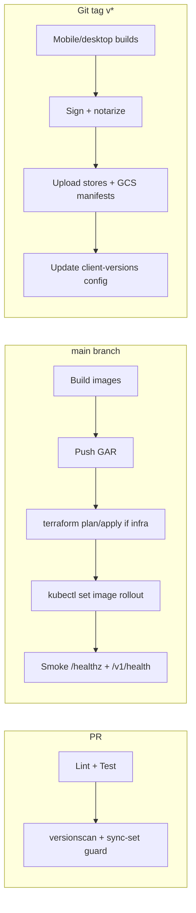

# V.O.I.D. Production Deployment & Smart-Update Plan

**Status:** Planning document — engine-first, UI second  
**Audience:** Engineering / ops  
**Last updated:** 2026-06-05  
**Scope:** Monorepo at `pegasus/` — separate deployables, GCP-first, cross-role real-time sync, enterprise update governance

---

## 1. Executive Summary

The Pegasus logistics engine is **architecturally production-capable** but **not yet operationally hardened** for tens-of-millions scale without closing P0/P1 gaps. The real-time spine (Kafka → notification dispatcher → WebSocket hubs → native clients) exists and is wired for most SUPPLIER/DRIVER/RETAILER flows. Gaps concentrate in:

- **Ops blockers:** health probe mismatch, missing ai-worker Dockerfile, dual deploy workflows, secrets/SA manifests, managed Kafka not in Terraform
- **Sync gaps:** warehouse/factory Kafka notifications do not fan out to their WS hubs; FCM fallback is retailer-only; offline mutation queue is driver-only
- **Update system:** schema-version gating exists (`SYSTEM_APP_OUTDATED`); **no** store OTA, Tauri updater, or backend min-client-version API yet
- **Client parity:** desktop (Tauri) and web portals intentionally carry more operator surface area; native mobile is feature-subset by design but must not drift on **contract** (API, WS events, auth)

**Recommendation:** Ship the **running engine** in three waves — (A) ops unblockers, (B) real-time/sync hardening, (C) smart-update platform — before a coordinated UI polish pass across all surfaces.

---

## 2. Monorepo Strategy — Source vs Deploy

### 2.1 What the monorepo is for

| Concern | Monorepo role |
|--------|----------------|
| **Source of truth** | One Git repo (`pegasus/`) holds backend, ai-worker, all clients, shared types, Terraform, K8s manifests |
| **Contract sync** | `packages/types`, `contracts/events.schema.json`, `cmd/gen-contracts`, CI `versionscan.py` prevent silent drift |
| **Local dev** | `docker-compose.yml` + `Makefile` emulate Spanner, Kafka, Redis, Firebase Auth |
| **CI** | Build/test everything; push **separate container images** per service |

### 2.2 What gets deployed separately

| Deployable | Artifact | Target (GCP-first) |
|-----------|----------|-------------------|
| **backend-go** | Docker image `pegasus-gateway` | GKE Deployment (`infra/k8s/backend/`) behind global HTTPS LB |
| **ai-worker** | Docker image (needs Dockerfile) | GKE sidecar pod with optimizer Rust (`infra/k8s/ai-worker/`) |
| **admin-portal** | Static export or Node SSR | Firebase App Hosting / Cloud Run / GCS+CDN bucket |
| **factory-portal** | Same | Separate hostname + CDN |
| **warehouse-portal** | Same | Separate hostname + CDN |
| **retailer-app-desktop** | Tauri `.msi` / `.dmg` / `.AppImage` | Microsoft Store, direct download, optional Sparkle (macOS) |
| **Native mobile (×10)** | AAB/APK, IPA | Play Store, App Store |
| **payload-terminal** | Expo build | EAS + optional self-hosted update manifest |
| **Terraform** | `terraform apply` | GCS state bucket `gs://void-terraform-state` |

**Rule:** Git stores code once; **runtime is N independent rollouts** with shared API contract version pins.

### 2.3 Repo hosting

- **Primary:** GitHub (or GitLab) private repo — enables WIF → GCP deploy (`ci.yml` pattern).
- **Not** deployed from the website URL. The website hosts **binaries and update manifests**, not the Git tree.
- **Artifacts:** Google Artifact Registry (`asia-south1-docker.pkg.dev/...`) for containers; GCS buckets for portal static assets, Tauri update JSON, and optional APK sideload mirrors.

---

## 3. Google Cloud Target Architecture

```
                    ┌─────────────────────────────────────┐
                    │  Cloud DNS + Global HTTPS LB        │
                    │  api.void.pegasus.uz                │
                    │  admin / factory / warehouse *.uz   │
                    └──────────────┬──────────────────────┘
                                   │
              ┌────────────────────┼────────────────────┐
              │                    │                    │
     ┌────────▼────────┐  ┌────────▼────────┐  ┌───────▼───────┐
     │ GKE void-cluster│  │ Cloud CDN       │  │ Secret Manager│
     │ backend (2-100) │  │ portal static   │  │ JWT, gateways │
     │ ai-worker KEDA  │  │ Tauri manifests │  │ FCM, Spanner  │
     └────────┬────────┘  └─────────────────┘  └───────────────┘
              │
     ┌────────┼────────┬──────────────┬─────────────┐
     │        │        │              │             │
  Spanner  Memorystore  Managed Kafka   GCS        Firebase
  (ledger)  (Redis)    (TBD provision) buckets    Auth/FCM
```

**Existing Terraform:** `infra/terraform/` — VPC, Spanner, Redis, GKE, KEDA, LB, Armor, observability.  
**Missing / incomplete:** Managed Kafka provisioning, GAR repo resource, LB↔GKE NEG/Ingress glue, K8s Secret + ServiceAccount YAML, ai-worker image build.

**Interim path:** `docs/CLOUD_RUN_TO_GKE_CUTOVER_RUNBOOK.md` — Cloud Run gateway exists in Terraform but production target is GKE.

---

## 4. Engine Readiness Audit

### 4.1 Ready today

| Layer | Evidence |
|-------|----------|
| HTTP API | 25+ `*routes` packages on chi; role-scoped auth |
| Transactions | Spanner RW txns + outbox on critical paths (orders, payments, fleet, manifests) |
| Events | `pegasus-logistics-events`, freeze-locks, demand-forecast; notification dispatcher ~90 handlers |
| WebSockets | 7 role hubs + telemetry; Redis Pub/Sub cross-pod relay; envelope guard v1/v2 |
| Payments | Stripe, Adyen, Global Pay webhooks — signature-first + idempotency |
| Local dev | Full emulator stack |
| Contract CI | `versionscan.py`, sync-set guards, one-eye guards |

### 4.2 P0 — block production cutover

| # | Issue | Fix |
|---|-------|-----|
| 1 | K8s/CI probe `GET /healthz` but backend only registers `/v1/health` | Add `/healthz` alias in `infraroutes` OR retarget all probes |
| 2 | No `ai-worker` Dockerfile; CI build context wrong for backend image | Monorepo-root Docker build; add `apps/ai-worker/Dockerfile` |
| 3 | `void-backend-secrets` + WI ServiceAccount not in repo | ExternalSecrets / bootstrap job + `k8s/serviceaccount.yaml` |
| 4 | Managed Kafka not provisioned | Confluent Cloud / Strimzi on GKE / Pub/Sub migration decision |
| 5 | `MIGRATE_ON_BOOT=true` default — multi-pod DDL race | Set `false` in prod; run `cmd/migrate` in deploy pipeline |
| 6 | Dual deploy workflows (`deploy.yml` vs `deploy-production.yml`) | Consolidate on WIF + GKE rolling update |

### 4.3 P1 — enterprise hardening (pre-scale)

| # | Issue | Impact |
|---|-------|--------|
| 1 | Cache invalidation ~25 call sites vs hundreds of mutations | Stale dashboards under multi-pod load |
| 2 | Priority guard only on payment/webhook routes | Spanner pool exhaustion under burst |
| 3 | Circuit breakers only on optimizer gRPC | Payment/FCM/Telegram cascade failures |
| 4 | Notification dispatcher: no WS push for `WAREHOUSE_ADMIN` / factory-scoped roles | Warehouse/factory apps miss Kafka-driven realtime |
| 5 | FCM fallback retailer-only in dispatcher | Driver/supplier mobile offline from push |
| 6 | `/v1/sync/batch` driver-only | Retailer/warehouse offline writes not drained server-side |
| 7 | Retailer mobile WS missing `?sv=2` | Settlement/command events may block or downgrade |
| 8 | `sync/batch.go` emits Kafka post-commit (not outbox) | Ghost sync events on partial failure |
| 9 | `/v1/admin/nuke` no prod kill-switch | Catastrophic if ADMIN JWT compromised |
| 10 | Global Pay GET webhook skips Basic Auth | Replay/probe surface |

### 4.4 P2 — debt (ship with tracking)

- `main.go` 964 lines / `cron.go` 1307 lines (extraction ongoing)
- `@pegasus/api-client` only on admin-portal; other portals hand-roll fetch
- `ORDER_REROUTED` event scaffolding unwired
- Native driver/payload models not in `packages/types`
- WS path inconsistency: `/ws/warehouse` vs `/v1/ws/*`

---

## 5. Real-Time Data Flow Matrix

### 5.1 Canonical path

```
Mutation handler
  → Spanner RW txn + outbox.EmitJSON
  → outbox.Relay → Kafka TopicMain
  → notification_dispatcher (parallel consumers)
      → Spanner Notifications inbox
      → WebSocket Hub.Broadcast(room, payload)
      → Redis Pub/Sub → peer pods
      → (optional) FCM / Telegram
  → Client refetch or WS handler
```

### 5.2 Role → transport coverage

| Role | WS Hub | Room key | Kafka→WS | FCM fallback | Offline queue |
|------|--------|----------|----------|--------------|---------------|
| SUPPLIER | SupplierHub | `supplier:{id}` | Yes | No | Catchup/delta only |
| DRIVER | DriverHub + Telemetry | `driver:{id}` | Yes | No | **Full** (`/v1/sync/batch`) |
| RETAILER | RetailerHub | `retailer:{id}` | Yes | **Yes** | Read-stale; no batch upload |
| WAREHOUSE_ADMIN | WarehouseHub | `warehouse:{id}` | **Partial** (handler-direct only) | No | WS reconnect + refetch |
| FACTORY_ADMIN | FactoryHub | `factory:{id}` | **Partial** (handler-direct) | No | WS reconnect + refetch |
| PAYLOAD | PayloaderHub | `payloader:{supplierId}` | Yes | No | Terminal-scoped |

### 5.3 Cross-client sync doctrine (per role)

When a feature ships for a role, **every client in the row** must:

1. Share API + WS contract (`packages/types`, gen-contracts regen)
2. Subscribe to the same hub room or FCM channel
3. Handle `SYSTEM_APP_OUTDATED` / min-version if schema changes
4. Implement loading / empty / offline / stale / permission states
5. Pass `versionscan.py` + manual gap-hunter on the role row

**Intentional asymmetry (product, not bug):** Supplier admin portal and retailer desktop expose denser operator UI (treasury, analytics, bulk import). Mobile native apps are execution-focused. **Contract** must still align; **feature count** may differ if gated by `platform_config` or role capability flags.

---

## 6. Smart Update System — Design

### 6.1 Goals

1. **Recommend update** when client is behind minimum supported version
2. **Force update** when security or breaking schema requires it
3. **No data interruption** — drain in-flight WS, flush offline queues, defer restart until safe idle point
4. **Per-surface channels:** App Store, Play Store, Microsoft Store, website direct download, Tauri in-app updater

### 6.2 Three-layer version model

| Layer | Purpose | Owner |
|-------|---------|-------|
| **App release** | `versionName` / `CFBundleShortVersionString` / Tauri `version` | Per-app build |
| **API contract** | `X-Client-Version` + `X-Client-Platform` headers on REST | Backend middleware |
| **WS schema** | `?sv=2` query + `SYSTEM_APP_OUTDATED` frame | `ws/envelope_guard.go` (exists) |

### 6.3 Backend: Client Version Registry (to build)

**New read endpoint (public or authed):**

```
GET /v1/platform/client-versions
```

Response shape (additive):

```json
{
  "v": 1,
  "surfaces": {
    "driver-android": {
      "latest": "2.4.0",
      "min_supported": "2.2.0",
      "force_update_below": "2.0.0",
      "download_url": "https://downloads.void.pegasus.uz/driver/android/latest",
      "store_url": "https://play.google.com/store/apps/details?id=...",
      "release_notes_url": "https://void.pegasus.uz/changelog/driver-android/2.4.0"
    },
    "retailer-desktop": { "...": "..." }
  }
}
```

**Storage:** `settings/platform_config` Spanner row or GCS JSON manifest updated by release pipeline (not hardcoded in binary).

**Middleware:** On mutating routes, if `X-Client-Version < min_supported` → `426 Upgrade Required` with ProblemDetail linking to store/manifest.

### 6.4 Per-platform update mechanics

| Platform | Mechanism | Force update | Safe restart |
|----------|-----------|--------------|--------------|
| **Android** | Play In-App Updates API (flexible/immediate) + FCM data `FORCE_UPDATE` | Immediate mode blocks UI; flexible completes download then prompts restart | Flush WorkManager `OfflineSyncWorker` before restart; WS disconnect grace |
| **iOS** | App Store only (no sideload OTA for store builds) | `ITMS` link + blocking modal when API returns 426 | `URLSession` finish in-flight; persist SwiftData; reconnect after upgrade |
| **Tauri desktop** | [Tauri Updater](https://v2.tauri.app/plugin/updater/) + signed manifest JSON on CDN | `minSupportedVersion` in manifest | Close WS; complete pending Tauri invoke calls; restart via updater |
| **Next.js portals** | Deploy static assets; **no user restart** — cache-bust via hashed bundles | N/A | Service worker optional; WS auto-reconnect on deploy |
| **Expo payload-terminal** | EAS Update or self-hosted `expo-updates` manifest URL | `runtimeVersion` pin | Terminal idle gate (no active manifest scan) |

### 6.5 “Smart update” state machine (native clients)

```
IDLE → CHECK_VERSION (on launch + every 6h + WS SYSTEM_APP_OUTDATED)
  → if current >= latest: stay
  → if current < latest && >= min: SOFT_PROMPT (dismissible)
  → if current < min_supported: HARD_BLOCK (store/deep link only)
  → if current < force_update_below: FORCE_BLOCK

Before restart:
  1. Set local flag update_pending
  2. Stop accepting new user actions (UI overlay)
  3. Await WS drain OR timeout 30s
  4. Flush offline queue (driver) / persist cart (retailer)
  5. Call platform updater / open store
```

**Backend cooperation:** Emit `SYSTEM_APP_OUTDATED` on WS when schema guard blocks an event — **already implemented** for driver v2 clients. Extend to all native WS connections with consistent `?sv=` handshake.

### 6.6 Website download URL pattern

```
https://downloads.void.pegasus.uz/
  manifests/
    driver-android.json      # version, sha256, url, min_supported
    retailer-desktop.json    # Tauri updater signature block
    latest.yml               # Tauri generic (per platform)
  releases/
    driver-android/2.4.0/app-release.apk
    retailer-desktop/1.2.0/Pegasus-Retailer_1.2.0_x64.msi
```

Manifests are **JSON at stable URLs** — clients poll `GET /v1/platform/client-versions` which redirects or embeds these URLs. **Not** stored in Git at runtime; CI publishes to GCS on tag.

---

## 7. Deployment Pipeline (Target State)

### 7.1 CI/CD stages



### 7.2 Environment promotion

| Env | Cluster / project | Data |
|-----|-------------------|------|
| **dev** | Local docker-compose | Emulators |
| **staging** | GKE namespace `void-staging` | Spanner staging instance |
| **prod** | GKE namespace `void-system` | Spanner prod + regional replicas |

Secrets: GCP Secret Manager → External Secrets Operator → `void-backend-secrets`.

### 7.3 Rollback

- **Backend / ai-worker:** `kubectl rollout undo deployment/backend`
- **Portals:** CDN previous artifact generation (versioned GCS prefixes)
- **Mobile/desktop:** Cannot rollback installed binaries — forward-fix only; maintain `min_supported` ladder

---

## 8. Implementation Phases

### Phase A — Ops unblockers (1–2 sprints)

- [ ] Fix `/healthz` probe alignment
- [ ] Add ai-worker Dockerfile; fix Docker build context to monorepo root
- [ ] K8s ServiceAccount + ExternalSecrets manifests
- [ ] Consolidate deploy workflows; document env vars in runbook
- [ ] `MIGRATE_ON_BOOT=false` in prod; migrate job in pipeline
- [ ] Provision Kafka (managed) + wire `KAFKA_BROKER_ADDRESS`

### Phase B — Engine hardening (2–4 sprints)

- [ ] Notification dispatcher → WarehouseHub + FactoryHub branches
- [ ] Retailer mobile WS `?sv=2` parity with driver
- [ ] Expand cache.Invalidate on hot mutation paths
- [ ] Global priority guard middleware on chi router
- [ ] Circuit breakers on payment + FCM + Telegram clients
- [ ] Convert `sync/batch.go` to outbox pattern
- [ ] Remove or env-gate `/v1/admin/nuke`
- [ ] Adopt `@pegasus/api-client` on factory/warehouse/retailer-desktop portals

### Phase C — Smart update platform (2–3 sprints)

- [ ] `GET /v1/platform/client-versions` + `platform_config` storage
- [ ] HTTP 426 middleware for below-min clients
- [ ] GCS manifest publish step in release workflow
- [ ] Tauri updater plugin on 4 desktop apps
- [ ] Android Play In-App Updates integration (driver + retailer)
- [ ] iOS force-update modal + App Store deep link
- [ ] Expo Updates for payload-terminal (if OTA needed between store releases)
- [ ] Native client safe-restart state machine

### Phase D — UI polish (after engine green)

- Per-role UI pass with **UI Freeze** lifted per explicit Boss approval
- Feature parity decisions documented per surface (desktop-only vs mobile)

---

## 9. Can This Be Implemented?

**Yes.** The codebase already contains ~70% of the enterprise spine:

- Transactional outbox, WS hubs with cross-pod relay, schema envelope guard, notification dispatcher, Terraform/GKE scaffolding, contract scanning CI

**What does not exist yet** and must be built:

- Client version registry API + release manifest publishing
- Platform-specific updater integrations (Tauri, Play, store deep links)
- Warehouse/factory Kafka→WS notification routing
- Broader offline sync beyond driver
- Ops glue (health, secrets, Kafka, single deploy path)

**Best practices alignment:**

| Practice | Status |
|----------|--------|
| Monorepo, polyglot, separate deployables | Industry standard (Google, Uber, Nx/Turborepo pattern) |
| GCP GKE + Spanner + Memorystore + global LB | Matches existing Terraform intent |
| Kafka outbox for state changes | Implemented; finish adoption on remaining paths |
| WS schema versioning + `SYSTEM_APP_OUTDATED` | Implemented; extend client coverage |
| Tauri signed updater manifests on CDN | Standard for self-hosted desktop |
| Play In-App Updates / App Store versioning | Platform-standard; no custom OTA on iOS store builds |
| `426 Upgrade Required` + min-client middleware | Common for mobile API backends (Stripe, banking apps) |

---

## 10. Immediate Next Actions (Boss decision)

1. **Approve Phase A** as first merge target — unblocks any GCP deploy smoke test
2. **Choose Kafka provider** (Confluent Cloud vs Strimzi on GKE) — blocks ai-worker scale testing
3. **Confirm hostname plan** (`api.void.pegasus.uz`, portal subdomains, `downloads.void.pegasus.uz`)
4. **Confirm store strategy** — Play/App Store/MS Store account readiness vs website-only beta period

After Phase A+B are green, UI work across all apps can proceed on a stable, synchronized engine.

---

## Appendix A — File Reference Index

| Area | Path |
|------|------|
| Terraform | `pegasus/infra/terraform/` |
| K8s manifests | `pegasus/infra/k8s/` |
| Backend bootstrap | `pegasus/apps/backend-go/bootstrap/` |
| WS hubs | `pegasus/apps/backend-go/ws/` |
| Kafka events | `pegasus/apps/backend-go/kafka/events.go` |
| Notification dispatcher | `pegasus/apps/backend-go/kafka/notification_dispatcher.go` |
| Shared types | `pegasus/packages/types/` |
| CI | `.github/workflows/ci.yml`, `deploy.yml` |
| Local dev | `pegasus/docker-compose.yml`, `pegasus/Makefile` |
| GKE cutover | `pegasus/docs/CLOUD_RUN_TO_GKE_CUTOVER_RUNBOOK.md` |
| Contract scan | `pegasus/scripts/versionscan.py` |
