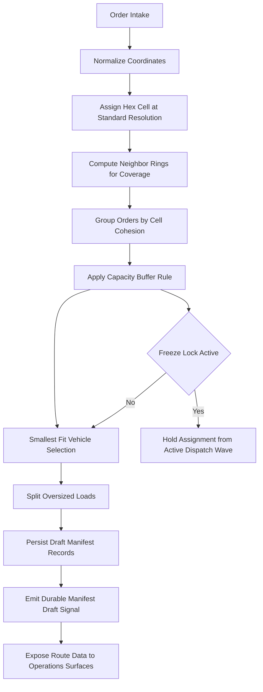
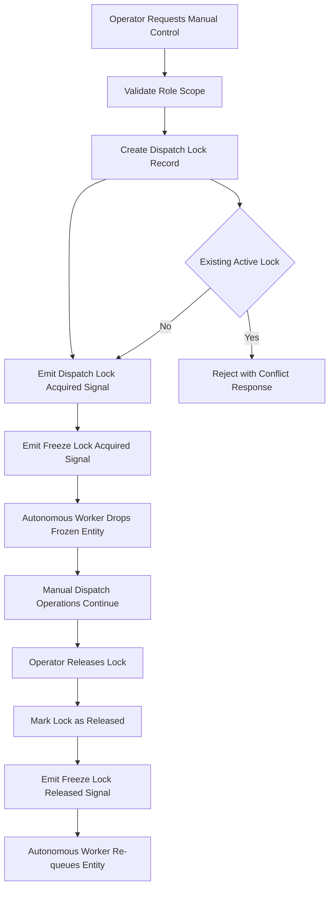
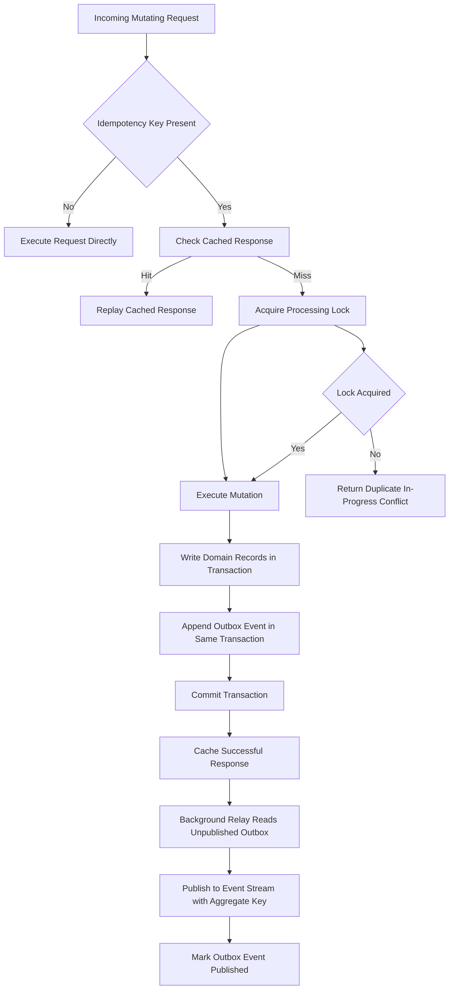
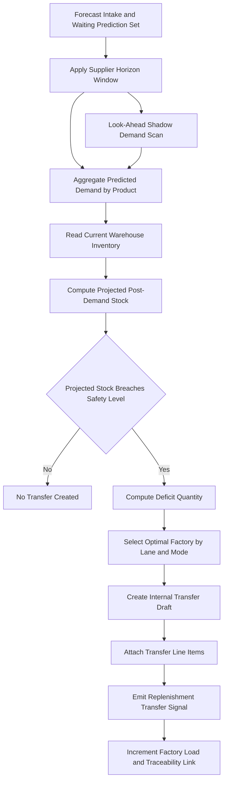

# Patent Core Algorithms

Batch: Batch 01 - Supplier Web Core
Figure Namespace: Global

## Figure B1-A: H3 Hexagon Grid Dispatch System
Caption: Hex-cell indexed dispatch planning that transforms order geography into capacity-constrained route assignments and draft manifests.

Operational Notes:
- Spatial indexing uses hex-cell identity to avoid broad-distance scans.
- Vehicle matching follows a safety buffer policy before assignment finalization.
- Oversized shipments are segmented into manageable chunks before persistence.

## Figure B1-B: Freeze Lock and Manual Override State Machine
Caption: Operator intervention lock workflow that prevents automatic reassignment during manual dispatch governance.

Operational Notes:
- Scope derivation binds lock authority to authenticated node context.
- Manual lock state preserves human authority during route sequencing overrides.
- Release signaling restores optimization eligibility without historical loss.

## Figure B1-C: Payloader Idempotency and Transactional Outbox
Caption: Dual integrity path where mutating actions are replay-safe at the interface layer and atomically published through durable event relay.

Operational Notes:
- Interface deduplication prevents duplicate mutation side effects from retries.
- Outbox co-commit prevents divergence between state storage and event publication.
- Aggregate-key publication maintains per-entity ordering in downstream consumers.

## Figure B1-D: Predictive Preorder Demand Engine
Caption: Forecast-informed replenishment workflow that transforms waiting demand signals into preemptive internal transfer orders.

Operational Notes:
- Safety horizon and threshold logic are evaluated before physical shortage occurs.
- Transfer generation remains node-aware through lane selection and mode constraints.
- Linked traceability supports downstream auditing from demand signal to replenishment order.
