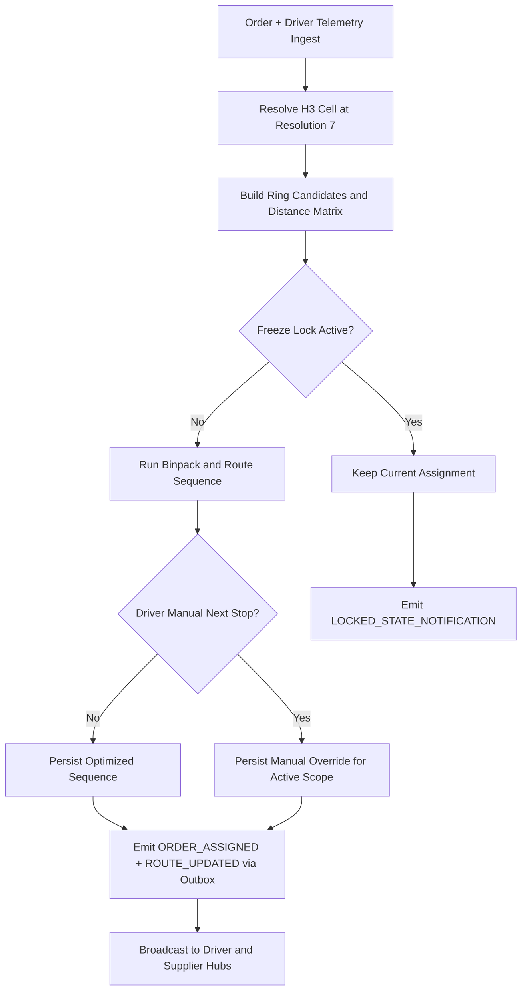
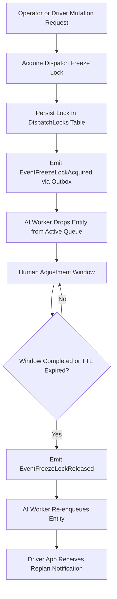
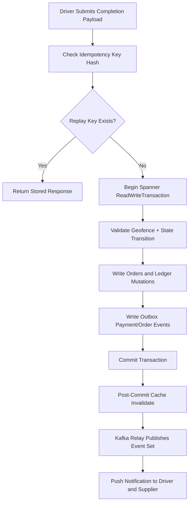
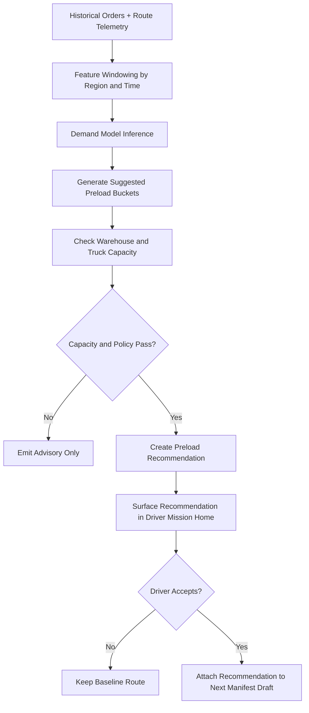

# Batch 02A - Driver Mobile Core Algorithms

## 1. H3 Dispatch With Driver Override Guard

Driver clients consume the same route lineage while preserving policy-safe manual override behavior.

## 2. Freeze Lock Cooperation Across Human and AI Dispatch

Freeze locks prevent race conditions where optimization would overwrite human intervention mid-mission.

## 3. Idempotent Delivery Completion With Outbox Atomicity

This flow guarantees no ghost completion states and no duplicate settlement side effects.

## 4. Predictive Preorder Demand Assist for Driver Readiness

Preorder assist remains advisory until accepted under role-policy constraints.
