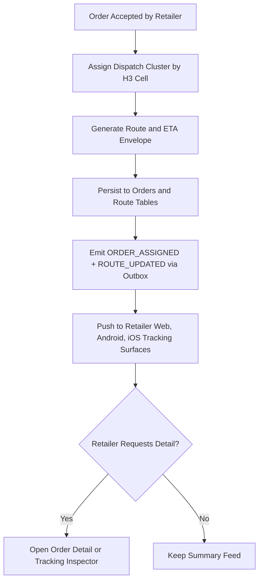
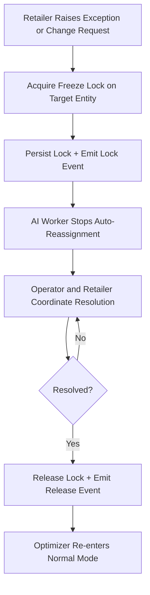
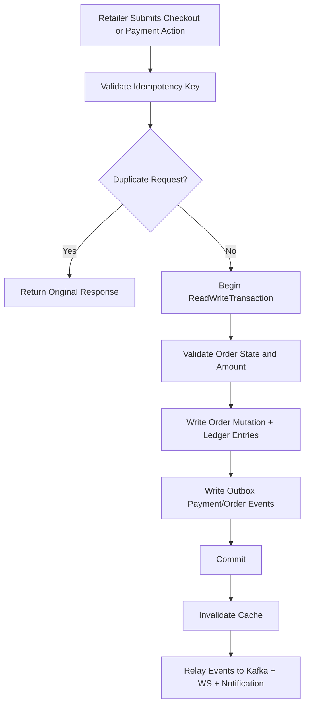
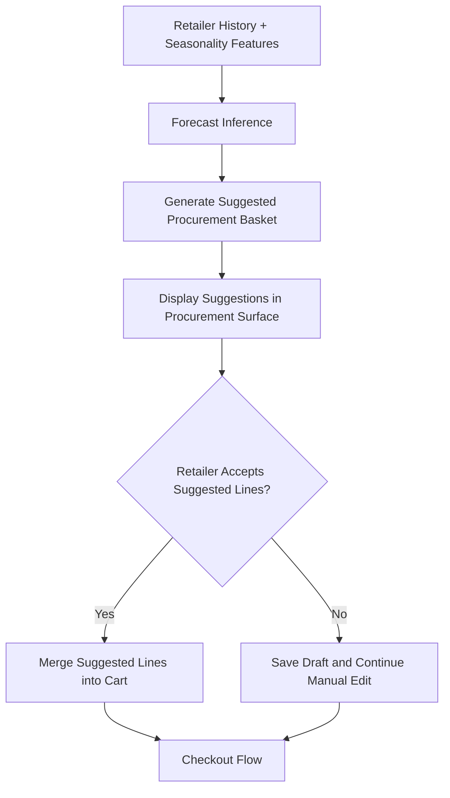

# Batch 02B - Retailer Multi-Surface Core Algorithms

## 1. H3 Dispatch Visibility for Retailer Tracking

Retailer clients receive a single route truth from backend while preserving per-platform presentation differences.

## 2. Freeze Lock-Aware Manual Intervention

This pattern prevents auto-dispatch from overriding in-flight exception handling.

## 3. Idempotent Checkout and Payment Finalization

No duplicate request can produce duplicate financial effects.

## 4. Predictive Preorder and Procurement Assist

Prediction remains assistive; retailer remains the approving actor.
