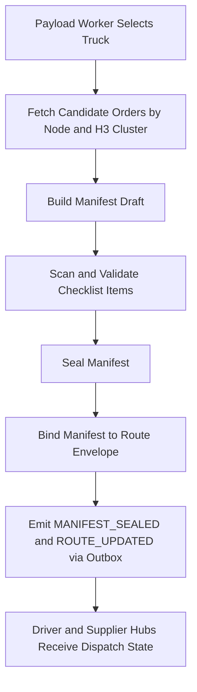
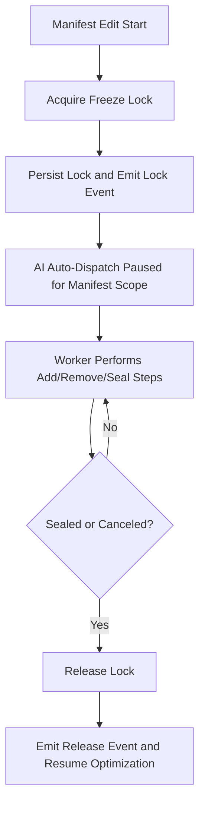
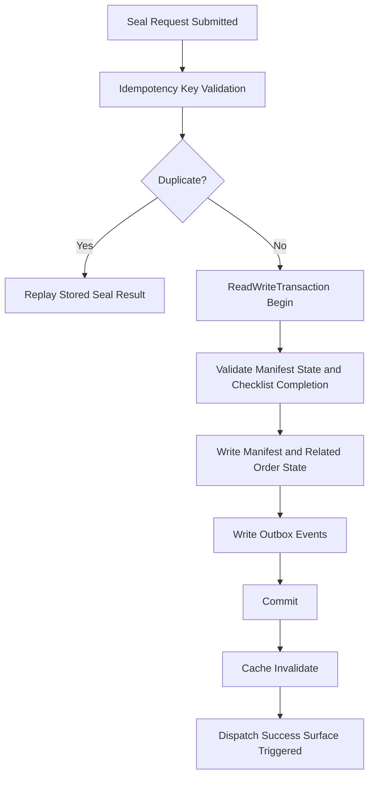
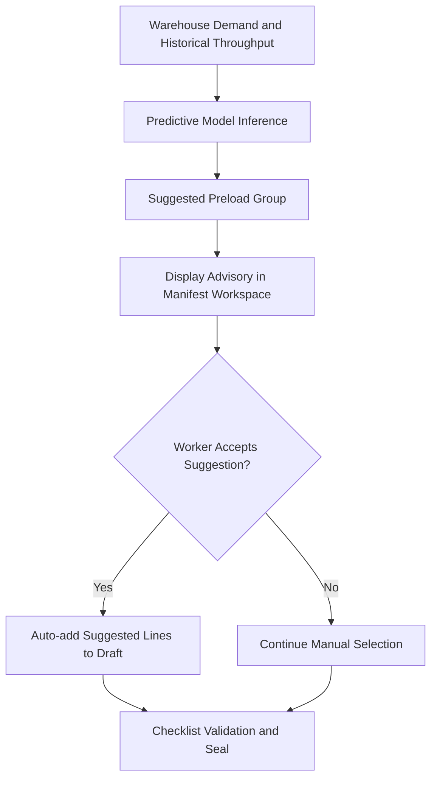

# Batch 02C - Payload Surface Core Algorithms

## 1. H3-Aware Manifest Loading and Dispatch Route Binding

Payload execution links physical loading to route-level digital state continuity.

## 2. Freeze Lock Around Manifest Mutation Window

The freeze lock prevents background optimization from changing in-flight payload composition.

## 3. Idempotent Seal and Dispatch Success Finalization

This prevents duplicate sealing and inconsistent manifest lifecycle transitions.

## 4. Predictive Preload Assistance for Payload Operations

Prediction support remains non-blocking and subordinate to worker confirmation.
