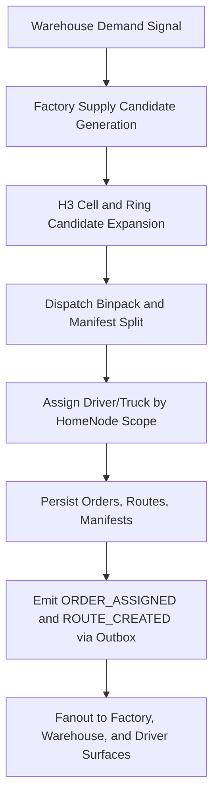
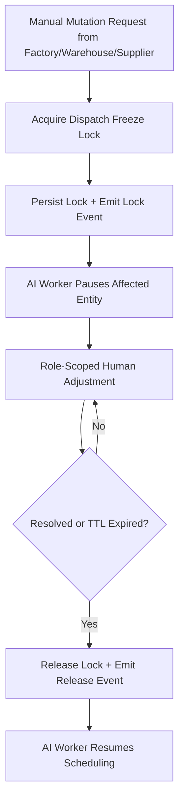
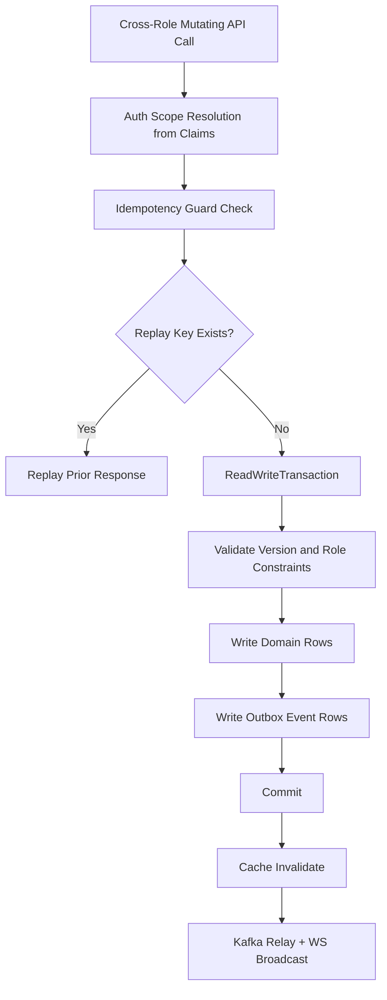
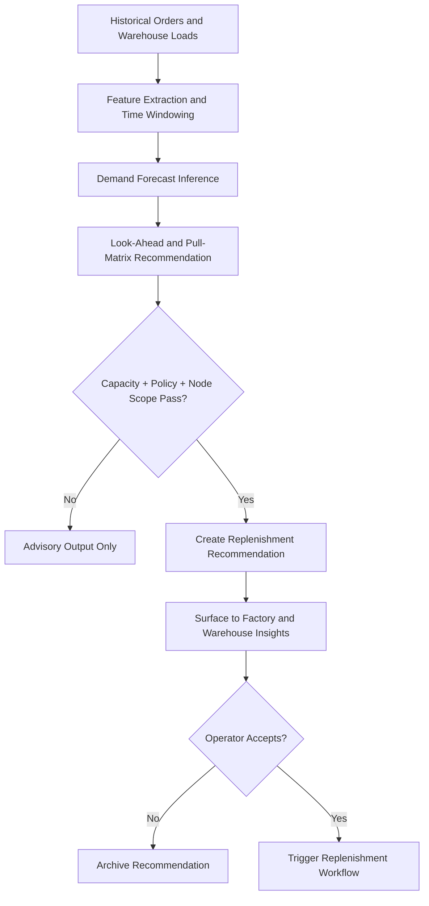

# Batch 02D - Cross-Role Backend Core Algorithms

## 1. H3 Dispatch and Inter-Node Assignment Across Factory and Warehouse

Cross-role dispatch preserves home-node constraints while coordinating supply movement from factories to warehouses.

## 2. Freeze Lock Protocol for Human Overrides in Cross-Role Operations

Freeze locks provide deterministic control transfer between automation and human operators.

## 3. Idempotent Mutations With Transactional Outbox for Cross-Role APIs

This pattern prevents ghost entities and duplicate side effects under retries.

## 4. Predictive Demand and Replenishment Engine Across Nodes

Forecast outputs remain assistive and policy-gated before becoming operational mutations.
