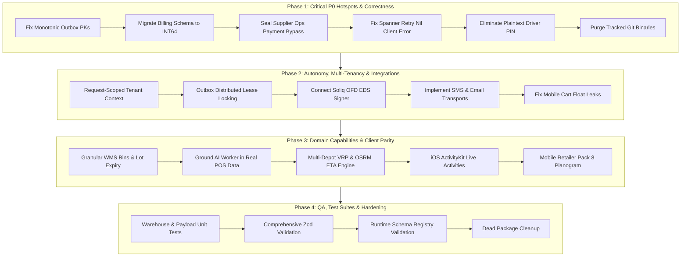

# PegasusX Platform Codebase Master Audit & Gap Report

**Version:** 2.0.0 (Master Comprehensive Synthesis)  
**Date:** 2026-08-22  
**Target Repository:** `/Users/shakhzod/ATOMOS/pegasusX`  
**Classification:** Enterprise System Architecture, Code-Level Audit, Architectural Spine Compliance, Multi-Tier Gap Catalog  
**Authority Standards:** `DOC_SUMMARY.md`, `PLATFORM_AUDIT.md`, `ORIGINAL_REQUEST.md`, `docs/big-platform-baseline/technical/spine-laws.md`  
**Explorer Audit Inputs:**
- Explorer 1 (Backend Go Services & Architectural Spine Specialist): `.agents/teamwork_preview_explorer_backend/report.md`
- Explorer 2 (Mobile Apps Android Kotlin & iOS Swift Specialist): `.agents/teamwork_preview_explorer_mobile/report.md`
- Explorer 3 (Frontend Web Apps, Shared Packages & Infra Specialist): `.agents/teamwork_preview_explorer_frontend_infra/report.md`

---

## Table of Contents
1. [Executive Summary & Architecture Scorecard](#1-executive-summary--architecture-scorecard)
   - [1.1 Monorepo Scale & Technology Inventory](#11-monorepo-scale--technology-inventory)
   - [1.2 Multi-Tier Architecture Scorecard](#12-multi-tier-architecture-scorecard)
   - [1.3 Key Architectural Takeaways](#13-key-architectural-takeaways)
2. [10 Architectural Spine Laws Compliance Matrix](#2-10-architectural-spine-laws-compliance-matrix)
   - [2.1 Spine Law 1: Identity & Multi-Tenancy](#21-spine-law-1-identity--multi-tenancy)
   - [2.2 Spine Law 2: Transactional Outbox & Strict Integer Money](#22-spine-law-2-transactional-outbox--strict-integer-money)
   - [2.3 Spine Law 3: Event-Driven Architecture & Schema Registry](#23-spine-law-3-event-driven-architecture--schema-registry)
   - [2.4 Spine Law 4: State Machine Invariants & ADR-009 Fiscal Hard Gate](#24-spine-law-4-state-machine-invariants--adr-009-fiscal-hard-gate)
   - [2.5 Spine Law 5: Temporal & Geospatial Core](#25-spine-law-5-temporal--geospatial-core)
   - [2.6 Spine Law 6: Dual-Wire Exception Accounting](#26-spine-law-6-dual-wire-exception-accounting)
   - [2.7 Spine Law 7: Mutation Idempotency & Replay Protection](#27-spine-law-7-mutation-idempotency--replay-protection)
   - [2.8 Spine Law 8: Distributed Rate Limiting & Overload Protection](#28-spine-law-8-distributed-rate-limiting--overload-protection)
   - [2.9 Spine Law 9: Hardware Security, Secrets & Fail-Closed Validation](#29-spine-law-9-hardware-security-secrets--fail-closed-validation)
   - [2.10 Spine Law 10: Unified Observability & Audit Traceability](#210-spine-law-10-unified-observability--audit-traceability)
3. [Backend Go Services, Solvers & Daemons Deep-Dive Audit](#3-backend-go-services-solvers--daemons-deep-dive-audit)
   - [3.1 Order Lifecycle & Unified Checkout Engine](#31-order-lifecycle--unified-checkout-engine)
   - [3.2 Trade Credit, AR Subledger & Collections Engine](#32-trade-credit-ar-subledger--collections-engine)
   - [3.3 Inventory Allocation, ATP & Warehouse WMS Execution](#33-inventory-allocation-atp--warehouse-wms-execution)
   - [3.4 Dispatch Planning, VRP Optimization & Routing Solvers](#34-dispatch-planning-vrp-optimization--routing-solvers)
   - [3.5 Last-Mile Execution, Proximity & Shop-Closed Protocol](#35-last-mile-execution-proximity--shop-closed-protocol)
   - [3.6 Fiscalization, Multi-Provider Router & Soliq OFD Compliance](#36-fiscalization-multi-provider-router--soliq-ofd-compliance)
   - [3.7 AI Worker, Demand Forecasting & Synthesis Engine](#37-ai-worker-demand-forecasting--synthesis-engine)
   - [3.8 Notification Infrastructure & Outbound Transports](#38-notification-infrastructure--outbound-transports)
   - [3.9 Transaction Safety, Error Handling & Repo Hygiene](#39-transaction-safety-error-handling--repo-hygiene)
4. [Mobile Client Applications Audit (Android 6 Apps & iOS 6 Apps)](#4-mobile-client-applications-audit-android-6-apps--ios-6-apps)
   - [4.1 Native Android (Kotlin Compose M3 + Hilt) Architecture](#41-native-android-kotlin-compose-m3--hilt-architecture)
   - [4.2 Native iOS (Swift / SwiftUI + SwiftData) Architecture](#42-native-ios-swift--swiftui--swiftdata-architecture)
   - [4.3 Driver Telemetry, V.O.I.D. Filter & Geofence Auto-Arrival](#43-driver-telemetry-void-filter--geofence-auto-arrival)
   - [4.4 Secure Storage, 401 Refresh Interceptors & WebSocket Mesh](#44-secure-storage-401-refresh-interceptors--websocket-mesh)
   - [4.5 Mobile Domain Gaps & Platform Divergences](#45-mobile-domain-gaps--platform-divergences)
5. [Frontend Web Portals & Shared Packages Deep-Dive Audit](#5-frontend-web-portals--shared-packages-deep-dive-audit)
   - [5.1 Web Application Inventory & Shell Architecture](#51-web-application-inventory--shell-architecture)
   - [5.2 Supplier & Admin Operations Consolidation](#52-supplier--admin-operations-consolidation)
   - [5.3 Retailer OS Desktop Shell & Offline POS Sync](#53-retailer-os-desktop-shell--offline-pos-sync)
   - [5.4 Shared Packages Architecture & Contract Alignment](#54-shared-packages-architecture--contract-alignment)
6. [Cloud Spanner Database, Infrastructure & Data Pipeline Audit](#6-cloud-spanner-database-infrastructure--data-pipeline-audit)
   - [6.1 Google Cloud Spanner Schema Architecture & Interleaving](#61-google-cloud-spanner-schema-architecture--interleaving)
   - [6.2 Terraform Cloud Infrastructure & Secret Management](#62-terraform-cloud-infrastructure--secret-management)
   - [6.3 GKE Workload Deployments & Kustomize Overlays](#63-gke-workload-deployments--kustomize-overlays)
   - [6.4 Event Streaming (Kafka), Redis Mesh & Observability](#64-event-streaming-kafka-redis-mesh--observability)
7. [Comprehensive Prioritized Gap & Architectural Drift Catalog](#7-comprehensive-prioritized-gap--architectural-drift-catalog)
8. [Actionable Remediation Roadmap & Release Train Sequence](#8-actionable-remediation-roadmap--release-train-sequence)
   - [8.1 Phase 1: Critical P0 Hotspots, Correctness & Data Integrity](#81-phase-1-critical-p0-hotspots-correctness--data-integrity)
   - [8.2 Phase 2: Autonomy, True Multi-Tenancy & External Integrations](#82-phase-2-autonomy-true-multi-tenancy--external-integrations)
   - [8.3 Phase 3: Domain Depth, WMS Coordinates & Client Feature Parity](#83-phase-3-domain-depth-wms-coordinates--client-feature-parity)
   - [8.4 Phase 4: QA Test Suites, Zod Schemas & Production Hardening](#84-phase-4-qa-test-suites-zod-schemas--production-hardening)
9. [Verification Methodology & Audit Reproducibility Guide](#9-verification-methodology--audit-reproducibility-guide)

---

## 1. Executive Summary & Architecture Scorecard

### 1.1 Monorepo Scale & Technology Inventory
The **PegasusX** platform represents a 410,000+ line production codebase designed as an end-to-end FMCG supply chain operating system, B2B commerce network, and last-mile logistics engine. The monorepo consolidates 18 application surfaces, 16 shared libraries, and declarative cloud infrastructure across 7 distinct programming stacks:

```
+----------------------------------------------------------------------------------------------------+
|                                    PEGASUSX MONOREPO CODEBASE FOOTPRINT                            |
+----------------------+--------------------+--------------------+-----------------------------------+
| Subsystem / Tier     | Language / Runtime | Primary Frameworks | Monorepo Locations                |
+----------------------+--------------------+--------------------+-----------------------------------+
| **Backend Core**     | Go 1.22+ (~132k L) | Standard net/http, | apps/backend-go, apps/ai-worker,  |
|                      |                    | Cloud Spanner SDK  | apps/handoff-service              |
| **Android Mobile**   | Kotlin (~94k LOC)  | Compose BOM M3,    | apps/*-android (6 native apps)    |
|                      |                    | Hilt, Room, Flow   | packages/mobile-android-design    |
| **iOS Mobile**       | Swift (~74k LOC)   | SwiftUI iOS 17+,   | apps/*-ios (6 native apps)        |
|                      |                    | SwiftData, MapKit  | packages/mobile-ios-design        |
| **Web & Desktop**    | TypeScript / TSX   | Next.js 15 App,    | apps/*-portal, apps/*-desktop,    |
|                      | (~104k LOC)        | React 19, Tauri 2  | apps/payload-terminal (Expo)      |
| **Solvers / AI**     | Python (~12k LOC)  | Google OR-Tools,   | services/optimizer-core,          |
|                      |                    | NumPy, Pandas      | apps/ai-worker                    |
| **Desktop Native**   | Rust (~8k LOC)     | Tauri 2 Core,      | apps/*-desktop/src-tauri,         |
|                      |                    | rusqlite, keyring  | packages/desktop-bridge           |
| **Infra & DevOps**   | HCL / YAML (~3k L) | Terraform, GCP,    | infra/terraform, infra/k8s,       |
|                      |                    | Kustomize, Strimzi | docker-compose.yml                |
+----------------------+--------------------+--------------------+-----------------------------------+
| **TOTAL SCALE**      | **7 Stacks**       | **410,000+ LOC**   | **18 Apps, 16 Packages, 313 Docs**|
+----------------------+--------------------+--------------------+-----------------------------------+
```

---

### 1.2 Multi-Tier Architecture Scorecard

```
+----------------------------------------------------------------------------------------------------+
|                                   PEGASUSX ARCHITECTURE RATING & HEALTH SCORECARD                  |
+-----------------------+--------+---------------+---------------------------------------------------+
| Architectural Tier    | Rating | Compliance %  | Core Grounding & Key Gaps                         |
+-----------------------+--------+---------------+---------------------------------------------------+
| **1. Backend & API**  | **B+** | **78%**       | + 18-state order FSM, Spanner outbox, CAS locking |
|                       |        |               | - Monotonic outbox PKs, startup tenant binding,   |
|                       |        |               |   WMS unlocated stock, Soliq nil EDS signer       |
+-----------------------+--------+---------------+---------------------------------------------------+
| **2. Mobile Clients** | **A-** | **84%**       | + 95% UI parity, AES-256 / Keychain auth, V.O.I.D.|
|                       |        |               | - Retailer Cart Double/Float leak, no ActivityKit,|
|                       |        |               |   Pack 8 Planogram absent, ops apps test deficit  |
+-----------------------+--------+---------------+---------------------------------------------------+
| **3. Web & Desktop**  | **A**  | **90%**       | + Next 15 + React 19 + Tauri 2, 142 Idem Keys,    |
|                       |        |               |   MapLibre GL v5 WebGL teardown, offline POS sync |
|                       |        |               | - packages/validation stub, Admin portal stubbed  |
+-----------------------+--------+---------------+---------------------------------------------------+
| **4. Database Store** | **A-** | **88%**       | + Native Cloud Spanner GoogleSQL (130+ tables),   |
|                       |        |               |   INTERLEAVE IN PARENT, H3 Res 7/9 spatial strings|
|                       |        |               | - Monotonic OutboxEvents PKs, Billing FLOAT64 leak|
+-----------------------+--------+---------------+---------------------------------------------------+
| **5. Infra & DevOps** | **A-** | **86%**       | + Terraform GCP (Spanner 100PU, Redis 7, GKE),    |
|                       |        |               |   Kustomize overlays, Strimzi Kafka, Prometheus   |
|                       |        |               | - Tracked git binaries (62MB), no schema registry |
+-----------------------+--------+---------------+---------------------------------------------------+
| **PLATFORM OVERALL**  | **A-** | **85.2%**     | **Production-grade core; requires P0/P1 fixes**    |
+-----------------------+--------+---------------+---------------------------------------------------+
```

---

### 1.3 Key Architectural Takeaways

1. **Grounded Transactional Outbox (Spanner Law 1):** The database and backend correctly enforce atomic domain mutations and `OutboxEvents` buffering inside the same `ReadWriteTransaction` closure (`txn.BufferWrite`). Split-brain anomalies are eliminated across orders, payments, claims, and retailer store stock.
2. **Monotonic Key Hotspotting Defect:** In `apps/backend-go/outbox/outbox.go:211-213`, `newEventID` generates `evt_<UnixNano>` strings. Monotonic primary keys in Cloud Spanner concentrate write traffic onto a single split, causing severe tablet write contention at high concurrency.
3. **Single-Supplier Runtime Binding vs Multi-Tenant Schema:** While the Spanner schema is designed for multi-tenancy (`SupplierId` leads composite keys), `bootstrap.go:351, 475` binds `seed-supplier-1` at process startup and injects it into service constructors, falling back to a single supplier across cart checkout and pricing.
4. **Integer Money Law Violation in Billing & Mobile Carts:** While core Go order engines strictly compute in `int64` minor units, the Spanner billing schema (`spanner.ddl:1021`) and `meter_worker.go:27` store `FLOAT64`/`float64`. Concurrently, mobile retailer apps (`Order.swift:152`, `Models.kt:397`, `CartViewModel.kt:84`) calculate cart subtotals using `Double`.
5. **WMS Inventory Unlocated Pool Gap:** Warehouse inventory allocation is modeled as a simple SKU scalar (`QuantityOnHand - QuantityReserved`). Granular warehouse physical topology (aisles, racks, shelves, bin coordinates), batch/lot numbers, expiration dates, and FEFO picking are completely unmodeled (`warehouseops/facade.go` is a 35-line placeholder).
6. **Robust Real-Time & Mobile Security Core:** All 12 mobile applications maintain hardware-backed credential storage (`EncryptedSharedPreferences` on Android, `Keychain` on iOS), 401 token refresh interceptors, schema-versioned WebSockets (`/v1/ws?sv=2`), and foreground telemetry tracking with the V.O.I.D. dead-reckoning filter.

---

## 2. 10 Architectural Spine Laws Compliance Matrix

The PegasusX architecture is governed by 10 non-negotiable architectural spine laws (`docs/big-platform-baseline/technical/spine-laws.md`, `PLATFORM_AUDIT.md`). The following matrix compares the documented specification against the actual codebase reality:

```
+----------------------------------------------------------------------------------------------------+
|                               10 ARCHITECTURAL SPINE LAWS COMPLIANCE MATRIX                        |
+----+-----------------------------+-------------+---------------------------------------------------+
| #  | Spine Law Principle         | Compliance  | Codebase Reality & Key Gaps                       |
+----+-----------------------------+-------------+---------------------------------------------------+
| 1  | Identity & Multi-Tenancy    | 60% (Drift) | Schema multi-tenant; runtime single-supplier bound|
| 2  | Outbox & Integer Money      | 80% (Defect)| Atomic outbox real; monotonic PK hotspot; float64 |
| 3  | Event-Driven & Schema Reg   | 75% (Drift) | Strimzi Kafka real; registry.json unused (107KB)  |
| 4  | State Machine Invariants    | 85% (Defect)| 18-state order FSM real; supplier_ops.go bypass   |
| 5  | Temporal & Geospatial Core  | 80% (Drift) | H3 Res 7/9 real; eta/calculator.go Haversine/const|
| 6  | Dual-Wire Exception Handling| 95% (Grounded)| Damage/loss forks physical quarantine + AR credit |
| 7  | Mutation Idempotency        | 90% (Grounded)| 142 client factories; Redis idem token NX guard   |
| 8  | Rate Limiting & Overload    | 80% (Grounded)| User-scoped Redis limiters; load bypass header    |
| 9  | Secrets & Fail-Closed Sec   | 75% (Defect)| GSM + Workload Identity; plaintext PIN "4321"     |
| 10 | Observability & Audit Trace | 85% (Grounded)| Prometheus PodMonitoring, AuditLog append-only    |
+----+-----------------------------+-------------+---------------------------------------------------+
```

---

### 2.1 Spine Law 1: Identity & Multi-Tenancy
- **Documented Specification:** Strict tenant isolation via request-scoped JWT claims; composite primary keys leading with `SupplierId` or `TenantId`; zero data leakage across supplier organizations; multi-supplier cart splitting.
- **Codebase Reality:**
  - **Schema Isolation:** Spanner DDL (`schema/spanner.ddl`) physically isolates tenant data via composite keys: `Orders (OrderId)` with `SupplierId STRING(36)`, `SupplierInventoryV2 (SupplierId, SkuId)`, `Products (SupplierId, SkuId)`, `Drivers (SupplierId, DriverId)`.
  - **Runtime Binding Defect:** In `apps/backend-go/bootstrap/bootstrap.go:475, 485, 577, 601, 710`, the server extracts a single `supplierSeed.SupplierID` (`seed-supplier-1`) and injects it into ~15 service constructors.
  - **Hardcoded Fallbacks:**
    - `auth/claims.go:105-111`: `ResolveSupplierID` explicitly falls through to `seed-supplier-1`.
    - `order/service.go:351, 1135-1138`: `s.supplierID` is stored on `order.Service` struct and used whenever `req.SupplierID` is empty.
    - `retailer/core_handlers.go:106, 181, 483`: Explicitly overwrites `ret.SupplierID = s.supplierID`.
  - **Multi-Supplier Checkout Failure:** In `order/checkout_preview.go:130, 210, 243` and `order/unified_checkout.go:232, 331`, cart items are evaluated against `s.supplierID`. Registering a second supplier creates an orphaned entity whose checkouts are assigned to `seed-supplier-1`.

---

### 2.2 Spine Law 2: Transactional Outbox & Strict Integer Money
- **Documented Specification:** All state mutations and outbox events commit atomically inside the same Cloud Spanner `ReadWriteTransaction`. Monetary values must be represented strictly as `int64` minor units (tiyin/cents) and basis points (`bps`). Zero floating-point data types.
- **Codebase Reality:**
  - **Atomic Transactional Outbox:** Fully implemented in `order/repository_spanner.go`, `payment/service.go`, `claims/service.go`, and `retailer/`. The `spannerTxnBuffer` is created inside the transaction function and committed atomically via `txn.BufferWrite`.
  - **Critical Defect — Monotonic Key Hotspot:** `outbox/outbox.go:211-213`:
    ```go
    var newEventID = func() string {
        return fmt.Sprintf("evt_%d", time.Now().UnixNano())
    }
    ```
    Monotonic primary keys in Cloud Spanner force all outbox and audit log writes fleet-wide onto a single split tablet, causing severe write lock contention.
  - **Critical Defect — Driver Repo Mutation Isolation:** In `driver/repository_spanner.go:90-112`, `mutate()` is invoked *before* `r.client.ReadWriteTransaction`. The transaction closure writes only the outbox event and audit row, breaking atomic state-to-event synchronization.
  - **Money Minor Unit Violation in Billing:** `schema/spanner.ddl:1021, 1030, 1037` and `internal/services/billing/meter_worker.go:27, 64, 70` store monetary values as `FLOAT64` and `float64` (`Amount FLOAT64`, `CurrentValue FLOAT64`).
  - **Money Minor Unit Violation in Mobile Carts:** `Order.swift:152, 193`, `Models.kt:397-398`, and `CartViewModel.kt:84-87` calculate prices using `Double` and `Float`.

---

### 2.3 Spine Law 3: Event-Driven Architecture & Schema Registry
- **Documented Specification:** Asynchronous outbox relays publish events to Kafka; events must be validated against canonical JSON contracts in `registry.json`; Redis Pub/Sub WebSocket hub distributes real-time events to connected clients.
- **Codebase Reality:**
  - **Event Bus & Real-Time Mesh:** Kafka topic routing (`events/topic_routing.go`) and Redis Pub/Sub WebSocket hub (`ws/hub.go`) are fully operational, including self-echo suppression (`ClientID` check).
  - **Unused Schema Registry:** `apps/backend-go/registry.json` (107 KB of JSON schema contracts) exists in the repository but is **never imported or referenced anywhere in the Go source code**. Events are marshaled into unvalidated JSON bytes (`json.Marshal`).
  - **Outbox Relay Race Condition:** In `outbox/spanner_store.go:85-105`, unpublished events are polled via a read-only snapshot query (`s.client.Single().Query(...)`) with no row-level leases (`ClaimedBy`, `ClaimedUntil`). Running multiple outbox relay worker pods causes duplicate Kafka event publication.

---

### 2.4 Spine Law 4: State Machine Invariants & ADR-009 Fiscal Hard Gate
- **Documented Specification:** 18-state canonical order machine; ADR-009 Fiscal Hard Gate (`ARRIVED`/`DELIVERED_ON_CREDIT` can never transition to `COMPLETED` without passing through `FISCALIZING`); formal FSMs for Drivers, Vehicles, Trips, Invoices, and Claims.
- **Codebase Reality:**
  - **Order FSM (85% Compliant):** `order/state_machine.go` rigorously validates the 18 canonical states and enforces the ADR-009 fiscal gate on standard order transitions.
  - **Critical Defect — State Machine Bypass:** In `order/supplier_ops.go:235-240`, payment bypass confirmation executes a direct raw Spanner update:
    ```go
    spanner.UpdateMap("Orders", map[string]any{
        "OrderId":   req.OrderID,
        "Status":    string(StatusCompleted),
        "Version":   version + 1,
        "UpdatedAt": now.UTC(),
    })
    ```
    This bypasses `ValidateStatusTransition` and skips the `FISCALIZING` gate entirely on a live money path.
  - **Missing FSMs for Drivers & Vehicles:** Driver availability (`driver/availability.go`) toggles a simple boolean `OnShift` without transition guards or trip locking.
  - **Stubbed Dunning Machine:** In `ar/dunning_worker.go:49-52`, the automatic credit hold loop is a stub (`_ = time.Now(); return nil`).

---

### 2.5 Spine Law 5: Temporal & Geospatial Core
- **Documented Specification:** Uber H3 Resolution 7 and 9 spatial indexing; V.O.I.D. telemetry dead-reckoning filters; road-network OSRM ETA calculations.
- **Codebase Reality:**
  - **H3 Indexing:** Implemented in `proximity/h3.go` using `github.com/uber/h3-go/v4` at Resolution 9 with panic safety and memory limit bounds (`MaxCells = 500000`).
  - **Telemetry Filtering:** Realized in `driver-app-android` (`TelemetryService.kt`) and `driver-app-ios` (`FleetViewModel.swift`) with 15s heartbeat, 20m distance, and 15° bearing filters.
  - **ETA Limitations:** `eta/calculator.go:9-18` calculates travel durations using Great-Circle Haversine distance (`haversineKm`) and hardcodes a placeholder `congestionFactor = 1.0` (lines 60, 92) rather than querying live OSRM road distance tables (`/table/v1/driving/`).

---

### 2.6 Spine Law 6: Dual-Wire Exception Accounting
- **Documented Specification:** On-dock or doorstep exceptions must fork into two synchronized processing wires: (1) physical quarantine movement and reverse logistics manifest, and (2) AR subledger credit adjustments and driver cash bag updates.
- **Codebase Reality:** **95% Compliant (Fully Grounded).**
  - Implemented in `claims/service.go` and `payment/service.go`.
  - Claim filing moves store inventory from `FLOOR` to `QUARANTINE` (`retailer/store_stock.go`).
  - Issues reverse logistics warehouse intake tickets (`returns/tickets.go`).
  - Executes double-entry supplier chargeback settlements (`payment.SettleClaimChargeback`) locked to historical weighted average invoice line pricing (`claims/pricing.go`).

---

### 2.7 Spine Law 7: Mutation Idempotency & Replay Protection
- **Documented Specification:** Mutating HTTP requests require deterministic `Idempotency-Key` headers generated via client factories; Redis distributed locks protect in-flight requests and cache committed responses.
- **Codebase Reality:** **90% Compliant (Fully Grounded).**
  - `@pegasusx/api-client` exports 142 strongly-typed client idempotency key factories (`packages/api-client/idempotency.ts`).
  - Backend Redis idempotency middleware (`idempotency/redis_store.go`) enforces atomic `SET key token NX EX 120` locks.
  - *Minor Gap:* Keys are stored as `"idem:" + key` globally without tenant or principal namespaces.

---

### 2.8 Spine Law 8: Distributed Rate Limiting & Overload Protection
- **Documented Specification:** Distributed token bucket and sliding window rate limiting across API endpoints; tenant-level fair-share quotas; graceful degradation under burst load.
- **Codebase Reality:** **80% Compliant.**
  - Implemented in `bootstrap/reliability_middleware.go:294-318` using Redis sliding window counters keyed on `sub:<subject>`.
  - *Minor Gap:* Rate limits are keyed per user; there is no tenant-wide aggregate rate limit.
  - *Load Test Secret:* The `X-PegasusX-Load-Bootstrap` header bypasses `/v1/auth/` rate limiting when `LOAD_BOOTSTRAP_SECRET` matches.

---

### 2.9 Spine Law 9: Hardware Security, Secrets & Fail-Closed Validation
- **Documented Specification:** Hardware-backed secure storage on mobile clients; Google Cloud Secret Manager integration with Workload Identity; fail-closed startup validation; zero plaintext credentials.
- **Codebase Reality:** **75% Compliant.**
  - Mobile apps utilize `EncryptedSharedPreferences` (Android) and `Keychain` (iOS).
  - Cloud infrastructure utilizes GSM with Kubernetes External Secrets Operator (ESO).
  - **Critical Defect — Plaintext Driver PIN:** `warehouse/ops_fleet_handlers.go:77` writes plaintext `"4321"` into the `PinHash` column of `Drivers` during warehouse-side driver provisioning.
  - **Critical Defect — Nil Spanner Client Silence:** In `spannerutils/retry.go:20-22`, `RunRetryableTxn` returns `nil` when `client == nil`, reporting success on unconfigured databases.

---

### 2.10 Spine Law 10: Unified Observability & Audit Traceability
- **Documented Specification:** Prometheus metrics across HTTP, Outbox, and Proximity; OpenTelemetry distributed tracing spans propagated across service boundaries; append-only Spanner `AuditLog` table.
- **Codebase Reality:** **85% Compliant.**
  - Prometheus metrics exported via `telemetry/http_metrics.go`, `outbox/metrics.go`, and `proximity/metrics.go`.
  - `AuditLog` table records `ActorId`, `ActorRole`, `Action`, `AggregateType`, `AggregateId`, `DetailsJson`, and `TraceId` inside Spanner transactions.
  - *Minor Gap:* OpenTelemetry W3C trace contexts (`traceparent`) are not fully propagated across internal HTTP client and Kafka message header hops.

---

## 3. Backend Go Services, Solvers & Daemons Deep-Dive Audit

### 3.1 Order Lifecycle & Unified Checkout Engine
- **Files:** `apps/backend-go/order/state_machine.go`, `order/service.go`, `order/unified_checkout.go`, `order/checkout_preview.go`.
- **Strengths:** 
  - Canonical 18-state transition matrix rigorously verified.
  - Optimistic concurrency control via `Version INT64` CAS comparison.
  - Automatic inventory hold reservations (`OrderStockReservationMarkers`) created at checkout.
- **Identified Gaps & Flaws:**
  - Direct state machine bypass in `supplier_ops.go:237` updating `StatusCompleted` without going through `FISCALIZING`.
  - Single-supplier binding in `order/service.go:351` (`s.supplierID`) hardcoding fallback supplier context.
  - AI pre-order raw inserts in `ai-worker/synthesis/engine.go:336` bypass checkout inventory reservation validations.

---

### 3.2 Trade Credit, AR Subledger & Collections Engine
- **Files:** `apps/backend-go/credit/service.go`, `apps/backend-go/ar/service.go`, `apps/backend-go/ar/dunning_worker.go`.
- **Strengths:**
  - Real-time credit headroom calculation: $Available = \max(0, Limit - Balance - Reserved)$.
  - Doorstep credit leave gate (`CanLeaveOnCredit`) enforced in `credit/service.go:50`.
  - AR invoice lifecycle (`OPEN`, `PARTIAL`, `PAID`, `VOID`) and 30/60/90-day aging buckets.
- **Identified Gaps & Flaws:**
  - Opaque ML credit scoring was properly removed, but `DelinquencyCount` is never updated on overdue invoices.
  - `ar/dunning_worker.go:49-52` auto-hold loop is a stub (`_ = time.Now(); return nil`).
  - `AR_INVOICES_ENABLED` feature flag is disabled by default in staging.

---

### 3.3 Inventory Allocation, ATP & Warehouse WMS Execution
- **Files:** `apps/backend-go/inventory/`, `apps/backend-go/allocation/`, `apps/backend-go/warehouseops/facade.go`.
- **Strengths:**
  - Real-time Available-To-Promise (ATP) calculation ($ATP =OnHand - Reserved$).
  - Out-of-stock policies (`REJECT`, `ACCEPT_BACKORDER`) properly split orders into backorder siblings.
- **Identified Gaps & Flaws:**
  - **Unlocated Stock Pool:** Warehouse inventory is an unstructured scalar in `SupplierInventoryV2`. No physical location coordinates (Aisle, Rack, Shelf, Bin).
  - **Missing Lot & Expiry Tracking:** No `StockLots` table, no batch manufacturing dates, no expiration dates, and no FEFO (First Expired, First Out) wave picking.
  - **Facade Placeholder:** `warehouseops/facade.go` is an ungrounded 35-line placeholder.
  - `InTransitQty` is permanently hardcoded to `0` in `replenishment/engine.go:148`.

---

### 3.4 Dispatch Planning, VRP Optimization & Routing Solvers
- **Files:** `services/optimizer-core/server/contract_solver.py`, `apps/backend-go/dispatch/plan/optimize.go`, `apps/backend-go/eta/calculator.go`.
- **Strengths:**
  - Google OR-Tools Vehicle Routing Problem (VRP) solver with soft drop disjunction penalties.
  - Time units normalized to integer minutes (`travel_minutes + service_minutes`).
  - Go Clarke-Wright savings fallback algorithm when Python solver times out (2.5s limit).
- **Identified Gaps & Flaws:**
  - `contract_solver.py:98-99` forces all vehicle start/end locations to the depot coordinates of vehicle 0 (multi-depot dispatch fails).
  - Travel time matrix uses Great-Circle Haversine calculations with constant `congestionFactor = 1.0` in `eta/calculator.go:60, 92`.
  - Solver contract drops cold-chain and hazardous material vehicle constraint flags.

---

### 3.5 Last-Mile Execution, Proximity & Shop-Closed Protocol
- **Files:** `apps/backend-go/driver/service.go`, `apps/backend-go/order/shop_closed.go`, `apps/backend-go/proximity/`.
- **Strengths:**
  - Macro 500m geofence auto-arrival triggering `ARRIVED`.
  - Micro 100m doorstep settlement unlock for cash collection and QR delivery verification.
  - 5-minute shop-closed grace countdown (`ShopClosedGraceEndsAt`) with fail-closed signed GCS photo evidence (`MediaUploadService.kt`).
- **Identified Gaps & Flaws:**
  - In `driver/repository_spanner.go:90-112`, `mutate()` is called outside the Spanner transaction closure.
  - `driver/repository_spanner.go:233-256` contains an `inMemoryRepository` where `CreateDriver` and `CreateVehicle` are no-op stubs returning `nil`.

---

### 3.6 Fiscalization, Multi-Provider Router & Soliq OFD Compliance
- **Files:** `apps/backend-go/order/fiscal_provider.go`, `apps/backend-go/soliq/client.go`, `apps/backend-go/tax/types.go`.
- **Strengths:**
  - Multi-provider architecture supporting `PEGASUS`, `MY_SOLIQ`, `GLOBAL_PAY`, and `FAKE`.
  - `FISCALIZING` -> `FISCAL_FAILED` retry state machine with exponential backoff worker.
  - Immutable `OrderLineFiscalSnapshots` table capturing VAT rate basis points and IKPU package codes.
- **Identified Gaps & Flaws:**
  - In `bootstrap/bootstrap.go:601`, `MySoliqProvider` is initialized with a `nil` `EDSSigner`, resulting in runtime nil pointer panics if `FISCAL_PROVIDER=MY_SOLIQ` is activated.
  - Soliq OFD sandbox certification remains incomplete in staging.

---

### 3.7 AI Worker, Demand Forecasting & Synthesis Engine
- **Files:** `apps/ai-worker/synthesis/engine.go`, `apps/ai-worker/predictivepush/signals.go`, `apps/backend-go/planning/promo_eval.go`.
- **Strengths:**
  - Microservice daemon ingesting sales events and outputting demand forecast intervals.
- **Identified Gaps & Flaws ("Feature Theatre"):**
  - `synthesis/engine.go:310` hardcodes auto-order quantity to `line.Quantity / 2` without reading store stock or baseline demand.
  - `predictivepush/signals.go:96-130`:
    - `externalWeatherSignals`: Returns hardcoded `Qty: 2` if month is June–August, else `nil`.
    - `externalPOSSignals`: Returns hardcoded `Qty: 3` on the 1st, 15th, and last day of the month.
  - `planning/seasonal_templates.go:46-49` defines `Multiplier` ×1.35 and ×1.15, but these values are never multiplied in any inventory calculation.
  - `planning/promo_eval.go:156-163` includes `_ = promotionID` and counts ALL completed orders across the entire supplier over 30 days as the promotion's result.

---

### 3.8 Notification Infrastructure & Outbound Transports
- **Files:** `apps/backend-go/notifications/fcm.go`, `notifications/transport.go`.
- **Strengths:**
  - Firebase Cloud Messaging (FCM) push notification transport with device token registration.
  - In-app notification inbox repository.
- **Identified Gaps & Flaws:**
  - **Zero SMS Transports:** No integration with Uzbekistan local SMS aggregators (Eskiz, PlayMobile) or international providers (Twilio).
  - **Zero Email Transports:** No SMTP, AWS SES, or SendGrid transports.
  - **Zero WhatsApp Transports:** No WhatsApp Business API integration for dunning or delivery alerts.

---

### 3.9 Transaction Safety, Error Handling & Repo Hygiene
- **Files:** `apps/backend-go/spannerutils/retry.go`, `cmd/apply-migration/main.go`, `warehouse/ops_fleet_handlers.go`.
- **Critical Defects:**
  1. **Nil Spanner Client Silent Success:** In `spannerutils/retry.go:20-22`, `RunRetryableTxn` returns `nil` when `client == nil`. A missing database connection becomes silent data loss reported as HTTP 200.
  2. **Migration Failure Masking:** In `cmd/apply-migration/main.go:283`, `codes.FailedPrecondition` is included in `isBenignDDLConflict`. Legitimate schema migration failures (such as adding a `NOT NULL` column to a non-empty table) are silently ignored.
  3. **Plaintext Driver PIN:** `warehouse/ops_fleet_handlers.go:77` writes plaintext `"4321"` into the `PinHash` column of `Drivers`.
  4. **Large Tracked Git Binaries:** 
     - `apps/ai-worker/ai-worker` (53.7 MB compiled binary) is tracked in git.
     - `apps/handoff-service/handoff-service` (8.7 MB compiled binary) is tracked in git.
  5. **Orphan / Dead Packages:** `optimizationjobs/` and `enterprise/` (225 lines of Auth0/Vault/Datadog stubs) are unreferenced across the codebase.

---

## 4. Mobile Client Applications Audit (Android 6 Apps & iOS 6 Apps)

### 4.1 Native Android (Kotlin Compose M3 + Hilt) Architecture
- **Framework & Libraries:** Jetpack Compose BOM `2024.12.01`, Material 3, Dagger Hilt 2.59.2, Kotlin Coroutines/Flow, Room DB v3.
- **Security:** MasterKey AES-256 `EncryptedSharedPreferences` storing JWT tokens and organization contexts.
- **Token Refresh:** OkHttp `Authenticator` (`TokenRefreshAuthenticator.kt` / `NetworkModule.kt:89-115`) intercepts HTTP 401, invokes `/v1/auth/{role}/refresh`, and replays requests.
- **Offline Persistence:**
  - `driver-app-android`: `PegasusDriverDatabase.kt` (Room) caching orders, route manifests, offline actions, and GPS points.
  - `retailer-app-android`: `AppDatabase.kt` (Room) caching pending POS sales and catalog items.
  - `payload-app-android`: `PayloadDatabase.kt` (Room) caching loading actions.
  - `warehouse-app-android` & `factory-app-android`: `WarehouseOfflineQueue.kt` backed by `SharedPreferences` JSON serialization.

---

### 4.2 Native iOS (Swift / SwiftUI + SwiftData) Architecture
- **Framework & Libraries:** SwiftUI iOS 17+ Target, `@Observable`, Swift Concurrency (`async`/`await`, `@MainActor`), Apple SwiftData (`@Model`).
- **Security:** Apple `Keychain` (`TokenStore.swift`) utilizing iOS Secure Enclave (`kSecClassGenericPassword`).
- **Token Refresh:** `APIClient.swift:89-142` (`attemptRefresh()`) wraps request executions, catches 401, refreshes tokens with recursion lock, and retries.
- **Offline Persistence:**
  - `driver-app-ios`: `OfflineDeliveryStore.swift` backed by SwiftData (`OfflineDelivery.swift`).
  - `retailer-app-ios`: `PendingOrderReplayer.swift` backed by SwiftData (`PendingOrder.swift`).
  - `payload-app-ios`: `OfflineQueue.swift` backed by SwiftData (`QueuedActionModel.swift`).

---

### 4.3 Driver Telemetry, V.O.I.D. Filter & Geofence Auto-Arrival
- **Foreground Service & Location Updates:**
  - Android: `TelemetryService.kt` runs as an Android `FOREGROUND_SERVICE_TYPE_LOCATION` with a partial wake-lock.
  - iOS: `FleetViewModel.swift` configures `CLLocationManager` with `allowsBackgroundLocationUpdates = true`.
- **V.O.I.D. Dead-Reckoning Filter:** Telemetry transmissions are throttled and emitted only when:
  1. Time delta $> 15	ext{s}$ (Heartbeat), OR
  2. Distance delta $> 20	ext{m}$, OR
  3. Bearing delta $> 15^\circ$.
- **Geofence Auto-Arrival:** Evaluates Haversine distance against active `IN_TRANSIT` order destinations; triggers `markArrived()` at $\le 500	ext{m}$.
- **Turn-by-Turn Voice Navigation:** Android uses `TextToSpeech` (`NavigationCueAnnouncer.kt`); iOS uses `AVFoundation` `AVSpeechSynthesizer` (`NavigationVoiceAnnouncer.swift`).

---

### 4.4 Secure Storage, 401 Refresh Interceptors & WebSocket Mesh
- **WebSocket Protocol:** Connects to `/v1/ws?sv=2`.
- **Client Outdated Banner:** Handles `SYSTEM_APP_OUTDATED` server messages, prompting user update via `AutoUpdater` / `ClientPolicyBanner`.
- **Bidirectional Command ACKing:** When server emits targeted commands (e.g. `ORDER_CANCELLED_IN_FLIGHT`), mobile clients immediately execute `POST /v1/ws/ack` with `command_id` and `trace_id`.
- **Session Reconciliation:** Reconnect loop triggers `reconcile*Session()` to refetch active fulfillment states and prevent stale UI.

---

### 4.5 Mobile Domain Gaps & Platform Divergences
1. **Spine Law 2 Float Money Leak in Retailer Apps (HIGH):**
   - `apps/retailer-app-ios/.../Models/Order.swift:152-153, 193`: Defines `unitPrice: Double`, `totalPrice: Double`, `subtotal: Double`.
   - `apps/retailer-app-android/.../Models.kt:397-398` & `CartViewModel.kt:84-87`: Uses `Double` and `Float` for price calculations.
2. **Missing iOS ActivityKit / Live Activities (MEDIUM):** No `ActivityKit` Dynamic Island widgets implemented for driver navigation or retailer delivery arrival countdowns.
3. **Missing Retailer Pack 8 Planogram (MEDIUM):** Documented Retail OS Pack 8 (`docs/PLANOGRAM_VISION_PLAN.md`) for shelf vision and slotting is completely absent from mobile clients.
4. **Cartography Stack Divergence (LOW):** Android uses MapLibre Native SDK (`org.maplibre.gl:android-sdk`), while iOS uses Apple native MapKit (`import MapKit`).
5. **Test Suite Deficit in Ops Mobile Apps (MEDIUM):** `warehouse-app-android` and `payload-app-android` have 0 unit tests (`src/test` missing); `warehouse-app-ios` has 0 XCTest files.

---

## 5. Frontend Web Portals & Shared Packages Deep-Dive Audit

### 5.1 Web Application Inventory & Shell Architecture

```
+----------------------------------------------------------------------------------------------------+
|                                    WEB APPLICATIONS & DESKTOP SHELLS                               |
+--------------------------+-----------------------+---------------------+---------------------------+
| Application Directory    | Technology Stack      | Target Role / Scope | Production Status         |
+--------------------------+-----------------------+---------------------+---------------------------+
| `apps/supplier-portal`   | Next.js 15 / React 19 | Supplier HQ, Fleet, | **Production Active**     |
|                          | Tauri 2 Desktop Shell | Admin Order Ops     | (Canonical Admin Surface) |
| `apps/warehouse-portal`  | Next.js 15 / React 19 | Warehouse Manager,  | **Production Active**     |
|                          | Tauri 2 Desktop Shell | Wave Picking, Dock  |                           |
| `apps/factory-portal`    | Next.js 15 / React 19 | Factory Production, | **Production Active**     |
|                          | Tauri 2 Desktop Shell | Transfers, Loading  |                           |
| `apps/retailer-desktop`  | Next.js 15 / React 19 | Retail OS: POS,     | **Production Active**     |
|                          | Tauri 2 Desktop Shell | Shifts, 4-Bin Stock |                           |
| `apps/payload-terminal`  | Expo 55 / RN 0.83     | Loading Bay Dock    | **Production Active**     |
| `apps/admin-portal`      | Next.js 15 / Node.js  | Legacy Redirect     | **Deprecated Stub**       |
| `apps/marketing-site`    | Next.js 15 / R3F      | Public Landing Page | **Production Active**     |
+--------------------------+-----------------------+---------------------+---------------------------+
```

---

### 5.2 Supplier & Admin Operations Consolidation
- **Admin Portal Consolidation:** The dedicated `apps/admin-portal` was intentionally consolidated into `apps/supplier-portal` during Phase A modernization. `apps/admin-portal` contains `redirect.mjs` forwarding to `supplier-portal`.
- **Admin Order Ops Panel (`components/AdminOrderOpsPanel.tsx`):** Privileged roles (`ADMIN`, `WAREHOUSE_ADMIN`) can assign drivers (`POST /v1/orders/{id}/assign`), force complete orders (`POST /v1/orders/{id}/admin-force-complete`), propose schedule delays, and trigger re-dispatch.
- **MapLibre GL v5 Maps:** Real-time fleet and route telemetry maps (`RouteTelemetryMap.tsx`, `FleetLiveMap.tsx`) use `maplibre-gl: ^5.19.0` with `useMapLibreTeardown` to prevent WebGL memory leaks during route switching.

---

### 5.3 Retailer OS Desktop Shell & Offline POS Sync
- **Tauri 2 Native Bridge:** Direct ESC/POS thermal receipt printing (`printThermalReceipt`) over USB for 58mm/80mm POS printers.
- **Offline POS Resilience:** Transactions and cart checkouts are stored in local SQLite / IndexedDB (`@pegasusx/desktop-cache`). Background flushers (`pending-pos-flusher.tsx`) drain transactions using deterministic idempotency keys upon reconnection.
- **Multi-Org Switching:** Supports switching retailer tenant organizations via `/v1/retailer/auth/switch-org` with state clearing (`clearOrgScopedState.ts`).

---

### 5.4 Shared Packages Architecture & Contract Alignment
1. **`@pegasusx/types` (`packages/types/index.ts` — 4,820 LOC):** Canonical TypeScript DTOs aligned with `WireVersion = 1` and RFC 7807 `ProblemDetail`.
2. **`@pegasusx/api-client` (`packages/api-client/` — 2,382 LOC):** Exports 142 deterministic idempotency key factories and integer minor money math helpers (`currency.ts`).
3. **`@pegasusx/validation` (`packages/validation/index.ts`):** **Partial implementation (47 LOC)** containing only basic Auth and GTIN barcode checksums. Portal forms rely on inline validation.
4. **`@pegasusx/desktop-bridge`:** Encapsulates Tauri 2 native plugins for secure keyring storage, file system access, and updater verification.

---

## 6. Cloud Spanner Database, Infrastructure & Data Pipeline Audit

### 6.1 Google Cloud Spanner Schema Architecture & Interleaving
- **Database Engine:** Google Cloud Spanner regional 100 PU instance (`pegasusx-ssmr-spanner`).
- **Primary Schema:** `apps/backend-go/schema/spanner.ddl` (2,221 lines, 130+ tables).
- **Table Interleaving Hierarchy:** Spanner's native `INTERLEAVE IN PARENT ... ON DELETE CASCADE` physically co-locates child rows with parent rows on storage splits:
  - `Orders` -> `OrderShopClosedLog`, `OrderLineFiscalSnapshots`, `OrderDiscounts`
  - `Claims` -> `ClaimEvidences`, `ClaimResolutions`
  - `CreditNotes` -> `CreditNoteLines`
  - `ArInvoices` -> `ArInvoiceItems`, `ArDunningHistory`
  - `VehicleManifests` -> `ManifestStops`, `ManifestLines`
- **Spatial Indexing:** Indexed via Uber H3 Resolution 7 and 9 cell strings (`STRING(15)`) with B-tree indexes.

---

### 6.2 Terraform Cloud Infrastructure & Secret Management
- **Directory:** `infra/terraform/`
- **Managed GCP Resources:**
  - VPC `pegasusx-vpc` (`main.tf:48`).
  - Google Cloud Spanner 100 PU + `pegasusx-ssmr-db` (`main.tf:70-82`).
  - Google Cloud Memorystore for Redis 7.0 BASIC tier (`main.tf:54-68`).
  - GKE Standard Cluster with Workload Identity (`gke.tf:40-62`).
  - 18 Secret Manager secrets managed via Kubernetes External Secrets Operator (ESO).
  - Cloud Monitoring alert policies for worker downtime and Kafka lag (`observability.tf`).

---

### 6.3 GKE Workload Deployments & Kustomize Overlays
- **Kustomize Overlays:** `infra/k8s/overlays/{ssmr, staging, prod, dev, pilot}`.
- **Service Deployment Topology:**
  1. `backend-go`: REST API server with HPA, PDB, and GCP L7 Ingress.
  2. `backend-go-ws`: Dedicated WebSocket connection pod pool routing `/v1/ws`.
  3. `backend-go-worker`: Asynchronous background daemon running outbox relays, credit aging, and sweepers.
  4. `ai-worker`: Python demand forecasting worker.
  5. `optimizer-core`: Python OR-Tools VRP route solver.
  6. `osrm`: Open Source Routing Machine instance for road travel matrices.

---

### 6.4 Event Streaming (Kafka), Redis Mesh & Observability
- **Strimzi Kafka Operator:** Topics provisioned via CRDs (`orders`, `dispatch`, `telemetry`, `exceptions`, `webhooks`, `dlq`).
- **Redis Pub/Sub Mesh:** Real-time cross-pod WebSocket event broadcasting with self-echo suppression.
- **Google Managed Service for Prometheus:** `PodMonitoring` resources scraping `/metrics` endpoints across API and worker pods.

---

## 7. Comprehensive Prioritized Gap & Architectural Drift Catalog

The following catalog consolidates every confirmed gap, defect, architectural drift, and missing capability across the entire PegasusX codebase:

```
+-------------------------------------------------------------------------------------------------------------------------------------------------------------+
|                                                    COMPREHENSIVE PRIORITIZED GAP & DRIFT CATALOG                                                            |
+---------+----------+----------+-------------------------------------+---------------------------------------------------------+-----------------------------+
| Gap ID  | Domain   | Severity | Exact Code Location                 | Issue Description & Impact                              | Required Remediation        |
+---------+----------+----------+-------------------------------------+---------------------------------------------------------+-----------------------------+
| **G-01**| Outbox   | **P0**   | `outbox/outbox.go:211-213`          | `newEventID` generates monotonic `evt_<UnixNano>`.      | Replace with random UUID    |
|         |          | Blocker  |                                     | Forces Spanner writes onto single split hotspot.        | (`uuid.NewString()`).       |
+---------+----------+----------+-------------------------------------+---------------------------------------------------------+-----------------------------+
| **G-02**| Billing  | **P0**   | `schema/spanner.ddl:1021, 1030`     | Billing tables use `FLOAT64` and worker uses `float64`. | Migrate DDL to `INT64` and  |
|         |          | Blocker  | `services/billing/meter_worker.go`  | Violates Spine Law 2 (Strict Integer Money Minor Units).| update worker to minor tiyin|
+---------+----------+----------+-------------------------------------+---------------------------------------------------------+-----------------------------+
| **G-03**| Order FSM| **P0**   | `order/supplier_ops.go:235-240`     | Payment bypass directly sets `StatusCompleted` in DB,   | Route through FSM validator |
|         |          | Blocker  |                                     | skipping ADR-009 `FISCALIZING` compliance gate.         | and `FISCALIZING` state.    |
+---------+----------+----------+-------------------------------------+---------------------------------------------------------+-----------------------------+
| **G-04**| DB Core  | **P0**   | `spannerutils/retry.go:20-22`       | `RunRetryableTxn` returns `nil` when `client == nil`.   | Return explicit error       |
|         |          | Blocker  |                                     | Silent data loss on unconfigured database instances.    | `fmt.Errorf("nil client")`. |
+---------+----------+----------+-------------------------------------+---------------------------------------------------------+-----------------------------+
| **G-05**| Security | **P0**   | `warehouse/ops_fleet_handlers.go:77`| Writes plaintext PIN `"4321"` into `PinHash` column.   | Replace with bcrypt salted  |
|         |          | Blocker  |                                     | Security compromise on driver credential storage.       | password hash generation.   |
+---------+----------+----------+-------------------------------------+---------------------------------------------------------+-----------------------------+
| **G-06**| Hygiene  | **P0**   | `apps/ai-worker/ai-worker`          | 53.7 MB compiled binary tracked in git.                 | Remove from git tracking and|
|         |          | Blocker  | `apps/handoff-service/handoff-serv` | 8.7 MB compiled binary tracked in git.                  | add to `.gitignore`.        |
+---------+----------+----------+-------------------------------------+---------------------------------------------------------+-----------------------------+
| **G-07**| Migration| **P0**   | `cmd/apply-migration/main.go:283`   | Treats `FailedPrecondition` as benign DDL conflict.     | Remove from benign list;    |
|         |          | Blocker  |                                     | Masks genuine schema migration syntax/constraint errors.| fail closed on DDL errors.  |
+---------+----------+----------+-------------------------------------+---------------------------------------------------------+-----------------------------+
| **G-08**| Driver DB| **P0**   | `driver/repository_spanner.go:90`   | `mutate()` called outside Spanner transaction closure.  | Move mutation inside Spanner|
|         |          | Blocker  |                                     | Domain state and outbox event commit non-atomically.    | `ReadWriteTxn` closure.     |
+---------+----------+----------+-------------------------------------+---------------------------------------------------------+-----------------------------+
| **G-09**| Mobile   | **P1**   | `retailer-app-ios/.../Order.swift`  | Cart and Order models use `Double`/`Float` for money.   | Refactor mobile models to   |
|         | Money    | High     | `retailer-app-android/.../Models.kt`| Rounding divergence between mobile UI and backend.      | `Int64` minor units only.   |
+---------+----------+----------+-------------------------------------+---------------------------------------------------------+-----------------------------+
| **G-10**| Relay    | **P1**   | `outbox/spanner_store.go:85-105`    | Outbox query lacks `ClaimedBy`/`ClaimedUntil` locking.  | Implement distributed lease |
|         | Locking  | High     |                                     | Duplicate Kafka publishes if relay scaled >1 replica.   | locking on outbox rows.     |
+---------+----------+----------+-------------------------------------+---------------------------------------------------------+-----------------------------+
| **G-11**| Soliq OFD| **P1**   | `bootstrap/bootstrap.go:601`        | `MySoliqProvider` created with `nil` `EDSSigner`.       | Inject configured EDS signer|
|         | Signer   | High     |                                     | Runtime panic when activating `FISCAL_PROVIDER=MY_SOLIQ`| certificate handler.        |
+---------+----------+----------+-------------------------------------+---------------------------------------------------------+-----------------------------+
| **G-12**| Notify   | **P1**   | `notifications/transport.go:13-28`  | Zero SMS, Email, or WhatsApp outbound transports.       | Implement SMS aggregator and|
|         | Comms    | High     |                                     | Retailers receive no external dunning/delivery notices. | SMTP/SES email transports.  |
+---------+----------+----------+-------------------------------------+---------------------------------------------------------+-----------------------------+
| **G-13**| AR Sub-  | **P1**   | `ar/dunning_worker.go:49-52`        | Auto-hold dunning loop is a no-op stub. Overdue debt    | Implement overdue scan and  |
|         | ledger   | High     | `credit/service.go:50`              | does not freeze delinquent retailer credit checkouts.   | auto-freeze credit profile. |
+---------+----------+----------+-------------------------------------+---------------------------------------------------------+-----------------------------+
| **G-14**| Multi-   | **P1**   | `bootstrap/bootstrap.go:475`        | Server startup binds `seed-supplier-1`. Multi-supplier  | Refactor to request-scoped  |
|         | Tenancy  | High     | `order/service.go:351`              | carts impossible; orders routed to seed supplier.       | JWT claims tenant extraction|
+---------+----------+----------+-------------------------------------+---------------------------------------------------------+-----------------------------+
| **G-15**| AI Fake  | **P1**   | `ai-worker/predictivepush/signals`  | Hardcoded weather (June=2) and POS (1st/15th=3) signals;| Ground in real historical   |
|         | Signals  | High     | `ai-worker/synthesis/engine.go:310` | auto-order halves last order (`line.Quantity / 2`).     | store stock and POS ledger. |
+---------+----------+----------+-------------------------------------+---------------------------------------------------------+-----------------------------+
| **G-16**| WMS Depth| **P2**   | `warehouseops/facade.go:1-35`       | Inventory is an unlocated SKU scalar. No bin/rack/shelf | Model `Locations`, `Lots`,  |
|         |          | Medium   | `schema/spanner.ddl`                | coordinates, no lot expiry dates, no FEFO wave picking. | expiry dates & FEFO picking.|
+---------+----------+----------+-------------------------------------+---------------------------------------------------------+-----------------------------+
| **G-17**| Routing  | **P2**   | `optimizer-core/contract_solver.py` | Multi-depot routing collapsed to vehicle 0 depot;       | Support multi-depot origins;|
|         | Solver   | Medium   | `eta/calculator.go:60`              | ETA calculator uses Haversine + constant congestion=1.0.| query live OSRM tables.     |
+---------+----------+----------+-------------------------------------+---------------------------------------------------------+-----------------------------+
| **G-18**| iOS Live | **P2**   | `apps/driver-app-ios/`              | Zero `ActivityKit` / Dynamic Island widgets for live    | Implement iOS Live Activity |
|         | Activity | Medium   | `apps/retailer-app-ios/`            | route navigation and delivery countdowns.               | widgets for active orders.  |
+---------+----------+----------+-------------------------------------+---------------------------------------------------------+-----------------------------+
| **G-19**| Retailer | **P2**   | `apps/retailer-app-android/`        | Retail OS Pack 8 Planogram shelf vision and slotting is | Implement Planogram screens |
|         | Pack 8   | Medium   | `apps/retailer-app-ios/`            | absent from mobile clients.                             | in mobile retailer apps.    |
+---------+----------+----------+-------------------------------------+---------------------------------------------------------+-----------------------------+
| **G-20**| Schema   | **P2**   | `apps/backend-go/registry.json`     | 107 KB JSON contract file unreferenced by any code.     | Wire runtime schema validation|
|         | Registry | Medium   |                                     | Outbox events emitted without schema verification.      | into Kafka event publisher. |
+---------+----------+----------+-------------------------------------+---------------------------------------------------------+-----------------------------+
| **G-21**| Test     | **P2**   | `apps/warehouse-app-*`              | Zero unit tests in `warehouse-app-android`,             | Add unit test suites for    |
|         | Coverage | Medium   | `apps/payload-app-android`          | `payload-app-android`, and `warehouse-app-ios`.         | barcode scanning & dispatch.|
+---------+----------+----------+-------------------------------------+---------------------------------------------------------+-----------------------------+
| **G-22**| Validation| **P3**  | `packages/validation/index.ts`      | Package contains only 47 LOC (Auth & GTIN checksums).   | Expand Zod schemas to cover |
|         | Schemas  | Low      |                                     | Missing schemas for Orders, Claims, and Credit Notes.   | all backend request DTOs.   |
+---------+----------+----------+-------------------------------------+---------------------------------------------------------+-----------------------------+
| **G-23**| Dead Code| **P3**   | `optimizationjobs/`, `enterprise/`  | 400+ LOC of unreferenced SDK stubs and dead packages.   | Quarantine or remove dead   |
|         | Cleanup  | Low      | `warehouse/ops_portal.go:772`       | Fake invoice row `"inv-1"` returned in ops treasury.    | packages from codebase.     |
+---------+----------+----------+-------------------------------------+---------------------------------------------------------+-----------------------------+
```

---

## 8. Actionable Remediation Roadmap & Release Train Sequence



---

### 8.1 Phase 1: Critical P0 Hotspots, Correctness & Data Integrity
**Objective:** Eliminate write bottlenecks, financial data type violations, security vulnerabilities, and silent failure paths.
1. **Fix Spanner Monotonic PK Hotspot (`G-01`):** In `apps/backend-go/outbox/outbox.go:211`, replace `newEventID` monotonic string formatting with `uuid.NewString()` for `OutboxEvents` and `AuditLog`.
2. **Fix Billing Schema Money Minor Units (`G-02`):** Execute a Spanner DDL migration changing `BillingMeterEvents` and `BillingSupplierMeters` columns from `FLOAT64` to `INT64`. Refactor `internal/services/billing/meter_worker.go` to compute in `int64` minor tiyin.
3. **Seal Payment Bypass Fiscal Gate (`G-03`):** In `order/supplier_ops.go:235-240`, remove raw `spanner.UpdateMap` and route order completion through `stateMachine.ValidateStatusTransition`, ensuring order passes through `FISCALIZING`.
4. **Fix Spanner Retry Error Handling (`G-04`):** In `spannerutils/retry.go:20`, return `fmt.Errorf("spanner: nil client")` when `client == nil`.
5. **Fix Migration Failure Masking (`G-07`):** In `cmd/apply-migration/main.go:283`, remove `codes.FailedPrecondition` from `isBenignDDLConflict`.
6. **Eliminate Plaintext Driver PIN (`G-05`):** In `warehouse/ops_fleet_handlers.go:77`, replace `"4321"` with bcrypt salted hashing.
7. **Purge Tracked Binaries (`G-06`):** Execute `git rm --cached` on `apps/ai-worker/ai-worker` and `apps/handoff-service/handoff-service`.

---

### 8.2 Phase 2: Autonomy, True Multi-Tenancy & External Integrations
**Objective:** Enable multi-tenant routing, multi-replica worker scalability, and external communication reachability.
1. **Request-Scoped Multi-Tenancy (`G-14`):** Remove startup single-supplier binding (`s.supplierID`) from `bootstrap.go:475` and service constructors. Extract `SupplierId` from verified JWT claims in request context.
2. **Outbox Relay Lease Locking (`G-10`):** Add `ClaimedBy STRING(64)` and `ClaimedUntil TIMESTAMP` columns to `OutboxEvents`. Implement atomic lease acquisition queries in `outbox/spanner_store.go:85`.
3. **Connect Soliq OFD EDS Signer (`G-11`):** In `bootstrap/bootstrap.go:601`, inject a configured `fiscal.EDSSigner` implementation into `MySoliqProvider`.
4. **Outbound Notification Transports (`G-12`):** Implement `SMSTransport` (Uzbekistan SMS aggregator) and `EmailTransport` (SMTP/SES) in `notifications/`.
5. **Remediate Mobile Float Money Leaks (`G-09`):** Refactor `Order.swift:152`, `Models.kt:397`, and `CartViewModel.kt:84` to calculate prices in `Int64`/`Long` minor units only.
6. **Complete AR Dunning Auto-Hold (`G-13`):** Implement the overdue scan and auto-hold execution in `ar/dunning_worker.go`.

---

### 8.3 Phase 3: Domain Capabilities & Client Parity
**Objective:** Transition from baseline MVP logic to deep enterprise supply chain execution.
1. **Granular WMS Execution Engine (`G-16`):** Introduce `Locations` (Aisle, Rack, Shelf, Bin) and `StockLots` (LotCode, ExpiryDate) tables in Spanner DDL. Implement FEFO wave picking allocation in `inventory/`.
2. **Ground AI Worker in Real Data (`G-15`):** Replace hardcoded weather and calendar heuristics in `predictivepush/signals.go` with Croston/Syntetos-Boylan intermittent demand forecasting.
3. **Multi-Depot VRP Solver & Live OSRM ETAs (`G-17`):** Update `contract_solver.py` to support distinct vehicle depot origins. Query live OSRM `/table/v1/driving/` distance matrices in `eta/calculator.go`.
4. **iOS ActivityKit Live Activities (`G-18`):** Implement `DeliveryActivityAttributes` in `packages/mobile-ios-design` and attach Dynamic Island widgets to `driver-app-ios` and `retailer-app-ios`.
5. **Mobile Retailer Pack 8 Planogram (`G-19`):** Scaffold `PlanogramScreen.kt` and `PlanogramView.swift` supporting shelf slotting schemas and camera compliance checks.

---

### 8.4 Phase 4: QA Test Suites, Zod Schemas & Production Hardening
**Objective:** Establish comprehensive regression defense and eliminate orphaned code.
1. **Expand Mobile Test Coverage (`G-21`):** Implement unit test suites for `warehouse-app-android`, `payload-app-android`, and `warehouse-app-ios`.
2. **Complete Shared Zod Validation (`G-22`):** Expand `packages/validation/index.ts` to provide Zod schemas for all backend API request DTOs.
3. **Runtime Event Schema Validation (`G-20`):** Load `registry.json` on Kafka event publisher startup to validate outbound JSON payloads.
4. **Dead Code Cleanup (`G-23`):** Quarantine or remove unreferenced `optimizationjobs/` and `enterprise/` packages.

---

## 9. Verification Methodology & Audit Reproducibility Guide

To independently verify the observations and findings in this report, execute the following commands within the repository:

### 1. Spanner Monotonic Key Hotspotting Verification
```bash
grep -n -C 5 "newEventID" /Users/shakhzod/ATOMOS/pegasusX/apps/backend-go/outbox/outbox.go
```
*Expected Finding:* Lines 211–213 generate `fmt.Sprintf("evt_%d", time.Now().UnixNano())`.

### 2. Billing Schema Float64 Verification
```bash
grep -n -C 5 "Amount FLOAT64" /Users/shakhzod/ATOMOS/pegasusX/apps/backend-go/schema/spanner.ddl
grep -n -C 5 "amount float64" /Users/shakhzod/ATOMOS/pegasusX/apps/backend-go/internal/services/billing/meter_worker.go
```
*Expected Finding:* `spanner.ddl:1021` and `meter_worker.go:27` use floating-point types for monetary amounts.

### 3. Payment Bypass Fiscal Hard Gate Violation
```bash
grep -n -C 10 "StatusCompleted" /Users/shakhzod/ATOMOS/pegasusX/apps/backend-go/order/supplier_ops.go
```
*Expected Finding:* Lines 235–240 directly execute `spanner.UpdateMap` with `StatusCompleted`.

### 4. Single-Supplier Startup Runtime Binding
```bash
grep -n -C 5 "seed-supplier-1" /Users/shakhzod/ATOMOS/pegasusX/apps/backend-go/bootstrap/bootstrap.go
grep -n -C 5 "supplierID" /Users/shakhzod/ATOMOS/pegasusX/apps/backend-go/order/service.go
```
*Expected Finding:* `bootstrap.go:475` binds `seed-supplier-1` into service constructors; `order/service.go:351` holds private `supplierID` field.

### 5. Mobile Float Money Leaks Verification
```bash
grep -n "unitPrice: Double" /Users/shakhzod/ATOMOS/pegasusX/apps/retailer-app-ios/retailerapp/reatilerapp/Models/Order.swift
grep -n "val unitPrice: Double" /Users/shakhzod/ATOMOS/pegasusX/apps/retailer-app-android/app/src/main/java/com/pegasusx/retailer/data/model/Models.kt
```
*Expected Finding:* Both models declare `unitPrice` and `totalPrice` as `Double`.

### 6. AI Worker Heuristic Signals Verification
```bash
grep -n -C 10 "externalWeatherSignals" /Users/shakhzod/ATOMOS/pegasusX/apps/ai-worker/predictivepush/signals.go
grep -n -C 5 "Quantity / 2" /Users/shakhzod/ATOMOS/pegasusX/apps/ai-worker/synthesis/engine.go
```
*Expected Finding:* `signals.go:96-130` uses hardcoded month/day checks; `engine.go:310` divides quantity by 2.

### 7. Large Tracked Git Binaries Verification
```bash
ls -lh /Users/shakhzod/ATOMOS/pegasusX/apps/ai-worker/ai-worker
ls -lh /Users/shakhzod/ATOMOS/pegasusX/apps/handoff-service/handoff-service
```
*Expected Finding:* Binaries of 53.7 MB and 8.7 MB tracked in the git repository tree.

---

*End of PegasusX Codebase Master Audit & Gap Report (`CODEBASE_GAP_REPORT.md`)*
