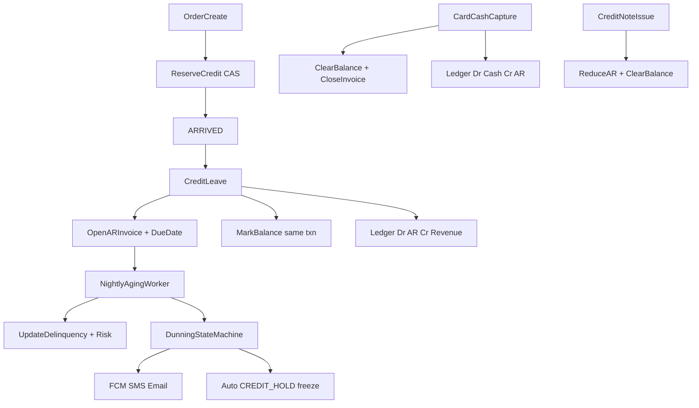

# Enterprise Credit & Collections Engine

## Verdict (current state)

Trade credit today is **limit + balance + freeze**, not collections:

- Real: [`RetailerCreditProfiles`](apps/backend-go/schema/spanner.ddl), [`credit.CheckOrder`](apps/backend-go/credit/service.go), credit-leave → `DELIVERED_ON_CREDIT` + `MarkBalance`, payment legs, collections desk UI (freeze/limit only), nightly scores (suggest-only), credit notes, cash recon.
- Broken / missing for prod AR: no payment terms / due dates / invoices, `DelinquencyCount` never increments, no aging/dunning, create-time check does not reserve, `MarkBalance` runs **after** the order txn, freeze blocks all creates (not credit-only), `ledger/` is unwired with no DDL, `MasterInvoices` is schema-only, notifications are FCM + `LogTransport` only.

**Default committed scope:** full AR open-item + collections + dunning transports + wire [`ledger/`](apps/backend-go/ledger) for AR journal postings. Not a full company GL chart — AR subledger + cash/card/credit-note offsets only.



---

## Policy layer (CREDIT_POLICY_V2) — companion to this plan

**Ownership:** credit book is `SupplierId`↔`RetailerId`. Warehouse finance uses the same supplier-scoped APIs (not a second ledger). Pegaus admin/support is the only actor who can set `CreditEnabled=false` after enable (audited, ticket required).

| Rule | Behavior |
|------|----------|
| Program / relationship ON | Self-serve enable with `warning_ack=true` + modal ack timestamp |
| OFF after ON | Not self-serve — `403 credit_disable_requires_support`; admin API only |
| Terms | Global defaults on `SupplierCreditPrograms` or per-retailer `RetailerPaymentTerms` override |
| Freeze ≠ disable | `FROZEN` / hold blocks new credit leave; relationship stays ON and visible |
| Due date | `dueAt = creditLeaveAt + TermsDays` (supplier timezone calendar days); open invoices keep original DueDate when terms change |

**Tables:** `SupplierCreditPrograms`, `RetailerPaymentTerms`, `CreditPolicyAudit`, `OrderCreditReservations`, `ArInvoices`, `ArLedgerEntries` (see `spanner.ddl`).  
**APIs:** `/v1/supplier/credit-program*`, `/v1/supplier/credit-relationships/*`, `/v1/retailer/credit-relationships`, `/v1/retailer/ar/invoices`, `/v1/admin/credit-*`.  
**Flags:** `CREDIT_POLICY_V2_ENABLED` → `AR_INVOICES_ENABLED` → `AR_DUNNING_ENABLED`; reserve at create via `CREDIT_RESERVE_AT_CREATE`.  
**Behavior doc:** [`docs/CREDIT_ECOSYSTEM_BEHAVIOR.md`](docs/CREDIT_ECOSYSTEM_BEHAVIOR.md).

---

## Phase 0 — Integrity fixes (must ship before new AR features)

These are correctness bugs in the existing spine; collections on a leaky balance is useless.

1. **Credit reservation at create** in [`order/service.go`](apps/backend-go/order/service.go) (~1195): after `CheckOrder`, call `credit.Reserve(ctx, retailer, supplier, orderID, total)` that atomically bumps `ReservedMinor` (new column) with Version CAS. Available = `Limit - Balance - Reserved`.
2. **Release reservation** on cancel / reject / non-credit terminal paths; **convert reserve → balance** on credit-leave (do not double-count).
3. **Same-txn mark**: move `MarkBalance` / reserve conversion into the Spanner read-write txn that writes `DELIVERED_ON_CREDIT` + `OrderPaymentLegs` in [`order/driver_edges.go`](apps/backend-go/order/driver_edges.go) (~390–464) and shop-closed worker. Same for `ClearBalance` on card capture after credit leave.
4. **Freeze semantics** (per [`credit-engine-compliance.md`](docs/big-platform-baseline/regulatory/credit-engine-compliance.md)): `StatusFrozen` / `CREDIT_HOLD` blocks **credit path only**; cash/card checkout and COD remain allowed. Split `CheckOrder` into `CheckCreditExposure` (create/reserve) vs `CheckCreditLeave` (delivery). Create for cash/card orders should not require a credit profile when payment method is non-credit — gate create-time check by intended settlement mode or make profile optional for COD with `require_credit_profile` supplier flag.
5. **Idempotent balance mutations**: key AdjustBalance emits by `(orderID, reason)` so retries cannot inflate AR.

---

## Phase 1 — Schema: terms, open items, aging, dunning, ledger DDL

New migration (e.g. `schema/migrations/YYYYMMDD_credit_collections_engine.ddl`) + fold into [`spanner.ddl`](apps/backend-go/schema/spanner.ddl):

**Extend profiles**

```sql
-- on RetailerCreditProfiles
ReservedMinor INT64 NOT NULL DEFAULT (0),
PaymentTermsDays INT64 NOT NULL DEFAULT (0),  -- denormalized default; source of truth below
GracePeriodDays INT64 NOT NULL DEFAULT (0),
EarlyPayDiscountBps INT64 NOT NULL DEFAULT (0),
AutoHoldEnabled BOOL NOT NULL DEFAULT (true),
```

**Terms**

```sql
CREATE TABLE RetailerPaymentTerms (
  RetailerId STRING(36) NOT NULL,
  SupplierId STRING(36) NOT NULL,
  TermsDays INT64 NOT NULL,           -- e.g. 0=COD, 7, 14, 30
  GracePeriodDays INT64 NOT NULL,
  EarlyPayDiscountBps INT64 NOT NULL,
  EarlyPayWindowDays INT64 NOT NULL,
  DunningPolicyId STRING(36),
  UpdatedAt TIMESTAMP NOT NULL,
  Version INT64 NOT NULL,
) PRIMARY KEY (RetailerId, SupplierId);
```

**Open-item AR (replace unused MasterInvoices usage)**

Extend `MasterInvoices` (keep PK) rather than invent a parallel table:

| Column | Purpose |
|--------|---------|
| `InvoiceKind` | `CREDIT_DELIVERY` / `ADJUSTMENT` / `CREDIT_NOTE_OFFSET` |
| `DueDate` | terms-derived |
| `GraceEndsAt` | due + grace |
| `OpenMinor` / `PaidMinor` / `CreditedMinor` | open-item amounts |
| `AgingBucket` | `CURRENT\|1_30\|31_60\|61_90\|90_PLUS` |
| `DunningState` | see Phase 3 |
| `DunningStateChangedAt` | |
| `LastDunnedAt` | |
| `PromiseToPayAt` / `PromiseNote` | collections desk |
| `SourceOrderId` | = OrderId (already present) |
| `IdempotencyKey` | unique per supplier |

Indexes: `(SupplierId, DunningState, DueDate)`, `(SupplierId, AgingBucket, OpenMinor DESC)`, `(RetailerId, SupplierId, Status)`.

**Reservations / allocations**

```sql
CREATE TABLE CreditReservations (
  ReservationId STRING(36) NOT NULL,
  OrderId STRING(36) NOT NULL,
  RetailerId STRING(36) NOT NULL,
  SupplierId STRING(36) NOT NULL,
  AmountMinor INT64 NOT NULL,
  Status STRING(16) NOT NULL, -- HELD|CONVERTED|RELEASED|EXPIRED
  CreatedAt TIMESTAMP NOT NULL,
  UpdatedAt TIMESTAMP NOT NULL,
) PRIMARY KEY (ReservationId);
CREATE UNIQUE INDEX UQ_CreditReservations_Order ON CreditReservations(OrderId);
```

```sql
CREATE TABLE ARPaymentAllocations (
  AllocationId STRING(36) NOT NULL,
  InvoiceId STRING(36) NOT NULL,
  OrderId STRING(36),
  PaymentLegId STRING(36),
  Method STRING(16) NOT NULL,
  AmountMinor INT64 NOT NULL,
  CreatedAt TIMESTAMP NOT NULL,
) PRIMARY KEY (AllocationId);
```

**Aging snapshot + dunning audit**

```sql
CREATE TABLE ARAgingSnapshots (
  SupplierId STRING(36) NOT NULL,
  RetailerId STRING(36) NOT NULL,
  AsOfDate DATE NOT NULL,
  CurrentMinor INT64, Bucket1_30Minor INT64, Bucket31_60Minor INT64,
  Bucket61_90Minor INT64, Bucket90PlusMinor INT64,
  OpenInvoiceCount INT64, DelinquencyCount INT64,
  ComputedAt TIMESTAMP NOT NULL,
) PRIMARY KEY (SupplierId, RetailerId, AsOfDate);

CREATE TABLE DunningEvents (
  EventId STRING(36) NOT NULL,
  InvoiceId STRING(36) NOT NULL,
  FromState STRING(32), ToState STRING(32) NOT NULL,
  Channel STRING(16), PayloadJson JSON,
  Actor STRING(64) NOT NULL, -- system|user
  CreatedAt TIMESTAMP NOT NULL,
) PRIMARY KEY (EventId);
```

**Ledger DDL** (activate orphan package)

```sql
CREATE TABLE LedgerAccounts (...);
CREATE TABLE LedgerTransactions (...);
CREATE TABLE LedgerEntries (...);
-- per-supplier system accounts: ar:{supplierId}, revenue:{supplierId},
-- cash:{supplierId}, gateway:{supplierId}, credit_notes:{supplierId}
```

---

## Phase 2 — Domain services (backend)

New package layout under [`apps/backend-go/`](apps/backend-go):

| Package | Responsibility |
|---------|----------------|
| `credit/` (extend) | Reserve / convert / release; freeze credit-only; delinquency updates; risk from live delinquency |
| `ar/` (new) | Invoice open/pay/credit/write-off; terms resolution; open-item invariants (`Open = Total - Paid - Credited`) |
| `collections/` (new) | Aging worker, dunning SM, promise-to-pay, auto-hold policy |
| `ledger/` (wire) | Bootstrap accounts; `PostAROpen`, `PostARSettle`, `PostARCreditNote`, `PostWriteOff` |
| `notifications/` (extend) | `SMSTransport`, `EmailTransport`, channel preference + fallback |

### Core algorithms

**Available credit**

```
available = max(0, limit - balance - reserved)
CheckCreditLeave: status ACTIVE && available >= amount && !scoreBlock
```

**Due date**

```
terms = RetailerPaymentTerms || supplier default
due = creditLeaveAt + terms.TermsDays (calendar, supplier TZ)
graceEnds = due + GracePeriodDays
```

**Aging bucket** (as-of UTC date)

```
daysPastDue = asOf - dueDate
CURRENT if daysPastDue <= 0
1_30 / 31_60 / 61_90 / 90_PLUS otherwise
```

**DelinquencyCount** (nightly, idempotent per invoice)

```
for each open invoice where now > graceEnds and not yet flagged:
  mark invoice delinquent_once
  profile.DelinquencyCount += 1
  recompute RiskTier; persist RiskScore
on full pay after delinquency: do not decrement historically (audit); 
  optional: rolling 90d delinquency window for score inputs only
```

**Dunning state machine** (per open invoice)

| State | Trigger | Actions |
|-------|---------|---------|
| `OPEN` | invoice created | schedule DUE_SOON |
| `DUE_SOON` | T−3 days | notify retailer + supplier ops |
| `OVERDUE` | T+1 past due | notify; bump collections priority |
| `ESCALATED_1` | T+7 | notify + supplier desk task |
| `ESCALATED_2` | T+14 | notify manager; suggest limit cut |
| `CREDIT_HOLD` | T+21 or policy | set profile FROZEN (credit-only); event |
| `COLLECTIONS` | T+30 or manual | desk ownership; stop auto soft dunning |
| `PROMISED` | desk sets PTP | pause auto escalate until PromiseToPayAt |
| `CLOSED` | OpenMinor==0 | stop |

Transitions emit `DunningEvents` + outbox domain events; deliveries go through notifications with channel waterfall: in-app/FCM → WhatsApp/SMS (UZ aggregator) → email.

**Early-pay discount** (optional Phase 2.5): if paid within `EarlyPayWindowDays`, allocate at `Open * (1 - bps/10000)`; remainder write-off to discount expense account via ledger.

### Wiring points (non-negotiable)

1. **Credit leave** ([`driver_edges.go`](apps/backend-go/order/driver_edges.go), shop-closed): one txn → status + CREDIT leg + reserve convert + `ar.OpenInvoice` + `ledger.PostAROpen` + outbox.
2. **Card/cash settle after credit** ([`order/service.go`](apps/backend-go/order/service.go) capture paths): allocate to invoice(s) FIFO by DueDate; `ClearBalance`; close invoice; `PostARSettle`.
3. **Credit note issue** ([`creditnote/service.go`](apps/backend-go/creditnote/service.go)): on ISSUE against `DELIVERED_ON_CREDIT` / open invoice → reduce `OpenMinor` / `CreditedMinor`, `ClearBalance` for credited gross, `PostARCreditNote`. Today credit notes do **not** touch credit balances — that is a financial hole.
4. **Claims store-credit settlement** ([`claims/settlement.go`](apps/backend-go/claims/settlement.go)): allocate against open AR before free-floating balance adjust.
5. **Control tower** freeze playbook: call collections `ApplyHold` with reason + dunning event.
6. **Segment priority** ([`segment/priority.go`](apps/backend-go/segment/priority.go)): feed aging bucket / dunning state (already boosts risk tier).
7. **Bootstrap** ([`bootstrap/bootstrap.go`](apps/backend-go/bootstrap/bootstrap.go)): construct `ar.Service`, `collections.Worker`, wire `ledger.NewService`, start aging+dunning ticker (alongside credit score worker). Ensure ledger system accounts seeded per supplier.
8. **AI auto-order** ([`apps/ai-worker/synthesis/engine.go`](apps/ai-worker/synthesis/engine.go)): must call real `order.Service.Create` (or shared credit reserve API) so synthesis cannot bypass credit.

### API surface (supplier-scoped, IDOR-safe via `claims.SupplierID`)

| Method | Path | Purpose |
|--------|------|---------|
| GET/PATCH | `/v1/supplier/retailer-payment-terms` | Terms CRUD |
| GET | `/v1/supplier/ar/invoices` | Filter by aging, dunning, retailer |
| GET | `/v1/supplier/ar/aging` | Snapshot + live rollup |
| POST | `/v1/supplier/ar/invoices/{id}/promise-to-pay` | Desk PTP |
| POST | `/v1/supplier/ar/invoices/{id}/write-off` | Finance write-off |
| POST | `/v1/supplier/ar/invoices/{id}/dunning/advance` | Manual escalate |
| POST | `/v1/supplier/ar/invoices/{id}/hold` | Force CREDIT_HOLD |
| GET | `/v1/retailer/ar/invoices` | Retailer open AR + due dates |
| POST | `/v1/retailer/ar/invoices/{id}/pay` | Pay specific invoice (unified checkout allocate) |
| GET | `/v1/supplier/ledger/accounts` | AR subledger balances |
| GET | `/v1/compliance/ar-overdue` | Extend compliance dashboard |

Upgrade existing collections list to return aging + oldest due + dunning state per profile.

---

## Phase 3 — Notifications (dunning prerequisite)

Extend [`notifications/`](apps/backend-go/notifications):

- `SMSTransport` — env-configured UZ aggregator / Twilio-compatible; secrets via existing Secret Manager pattern.
- `EmailTransport` — SMTP or SendGrid; template IDs for dunning stages.
- Preference table or reuse `preferences.go`: channel order per retailer contact.
- Dead-letter + retry via outbox; never block order txn on SMS failure (async after commit).
- Feature flags: `DUNNING_SMS_ENABLED`, `DUNNING_EMAIL_ENABLED`, default off in staging until smoke pass ([`STAGING_WIRING_MATRIX.md`](docs/gap-closure/STAGING_WIRING_MATRIX.md) pattern).

---

## Phase 4 — Client ecosystem integration

| Surface | Work |
|---------|------|
| [`supplier-portal/.../credit/collections`](apps/supplier-portal/app/(portal)/credit/collections/page.tsx) | Aging buckets, invoice drawer, PTP, hold, write-off, dunning timeline; drop freeze-only UX |
| Supplier Android/iOS Treasury | New AR / Aging screens; wire to new APIs (today Ledger/Payments are payment-event views) |
| Retailer apps + desktop | Show open invoices, due date, pay-now CTA; extend [`CreditProfileCard`](apps/retailer-app-desktop/components/CreditProfileCard.tsx) |
| Driver apps | Unchanged settlement UX; surface “on credit — due {date}” confirmation copy only |
| Warehouse treasury | Replace empty invoices stub in [`ops_portal.go`](apps/backend-go/warehouse/ops_portal.go) with `ar` list or deprecate in favor of supplier AR |
| [`packages/types`](packages/types/index.ts) + [`api-client`](packages/api-client/index.ts) | Types + client methods for terms/AR/dunning |
| Events | Add `AR_INVOICE_OPENED`, `AR_INVOICE_PAID`, `AR_DUNNING_TRANSITION`, `AR_CREDIT_HOLD` to shared event unions |

---

## Phase 5 — Risk score → enforcement (controlled)

- Nightly score worker already writes [`RetailerCreditScores`](apps/backend-go/credit/retailer_credit_score_worker.go); extend factors with aging buckets + delinquency.
- `CREDIT_SCORE_ENFORCEMENT_ENABLED`: when on, `CanLeaveOnCredit` / reserve uses score tier; **do not auto-overwrite limits** — write `SuggestedLimitMinor` to desk queue; optional `CREDIT_LIMIT_AUTO_APPLY` separate flag (default false).
- Auto-hold from dunning is independent and should ship earlier (policy-driven, reversible).

---

## Phase 6 — Prod readiness

**Tests (required)**

- Unit: reserve CAS races; open-item invariant; aging buckets; dunning transitions; freeze allows cash; credit note reduces AR; ledger balanced.
- Integration/Spanner emulator: credit-leave txn atomicity; double MarkBalance idempotency; FIFO allocation across two invoices.
- E2E smoke: extend [`cmd/ssmr-smokecheck/e2e_payment.go`](apps/backend-go/cmd/ssmr-smokecheck/e2e_payment.go) with credit → invoice → overdue simulate → hold → repay → close.

**Observability**

- Prometheus: `credit_reserve_total`, `ar_open_minor`, `ar_overdue_minor`, `dunning_transitions_total`, `dunning_delivery_failures`, `ledger_unbalanced_reject_total`.
- Structured slog with `invoice_id`, `retailer_id`, `dunning_state`.

**Flags / rollout**

| Flag | Staging default | Prod gate |
|------|-----------------|-----------|
| `AR_INVOICES_ENABLED` | false → true | after backfill |
| `CREDIT_RESERVE_ENABLED` | true | Phase 0 |
| `DUNNING_ENABLED` | false | after SMS creds |
| `DUNNING_AUTO_HOLD_ENABLED` | false | after desk trained |
| `LEDGER_AR_POSTINGS_ENABLED` | false → true | after reconcile job green |
| `CREDIT_SCORE_ENFORCEMENT_ENABLED` | false | last |

**Backfill**

- For existing `DELIVERED_ON_CREDIT` orders with open profile balance: create invoices with `DueDate = UpdatedAt + default terms`, `OpenMinor = remaining`, aging once; reconcile `sum(OpenMinor) == CurrentBalanceMinor` per retailer/supplier or open finance exceptions.

**Ops**

- Runbook: hold/unhold, PTP, write-off, SMS outage fallback, balance/invoice repair.
- Kill payment-bypass path that skips fiscal for credit AR orders, or forbid bypass when open invoice exists ([`supplier_ops.go`](apps/backend-go/order/supplier_ops.go)).

---

## Implementation order (execution)

1. Phase 0 integrity (reserve + same-txn + freeze semantics) — **1 week**
2. Phase 1 schema + `ar` open/pay + credit-leave/settle wiring + credit-note AR reduce — **1.5 weeks**
3. Ledger DDL + bootstrap + postings behind flag — **1 week** (parallel with 2)
4. Aging + DelinquencyCount + collections APIs + portal desk upgrade — **1 week**
5. SMS/Email transports + dunning SM + auto-hold — **1–1.5 weeks**
6. Retailer pay-invoice UX + mobile treasury parity + backfill + staging flags — **1 week**
7. Hardening: smoke, metrics, runbook, score-factor upgrade, enforcement flag — **0.5 week**

Rough total: **~7–8 weeks** to prod-ready AR/collections with ledger postings, staged by flags.

---

## Explicit non-goals (this plan)

- Marketplace multi-supplier split settlement platform float
- Full ERP GL / period close / tax books beyond AR subledger
- Replacing COD driver cash collection (instrumented, not removed)
- WhatsApp as hard dependency on day 1 (SMS+email first; WhatsApp as Phase 5.1 if aggregator ready)

---

## Implementation todos

1. Credit reserve/CAS, same-txn Mark/ClearBalance, freeze=credit-only, idempotent balance mutations
2. DDL: ReservedMinor, RetailerPaymentTerms, MasterInvoices AR columns, CreditReservations, ARPaymentAllocations, ARAgingSnapshots, DunningEvents, Ledger tables
3. Build `ar/` service: open invoice on credit-leave, FIFO allocate on repay, credit-note/claim reduce, write-off
4. Wire order credit-leave/settle, creditnote.Issue, claims store-credit, bootstrap, AI create path through credit
5. Activate ledger package: seed supplier AR accounts, PostAROpen/Settle/CreditNote/WriteOff behind flag
6. Nightly aging + DelinquencyCount + dunning SM + collections APIs + auto CREDIT_HOLD
7. SMS + Email transports, channel waterfall, dunning templates, staging flags
8. Supplier portal collections desk, retailer open-AR pay UX, mobile treasury, types/api-client/events
9. Backfill open credit orders, Spanner/e2e tests, metrics, runbooks, staged flag rollout
