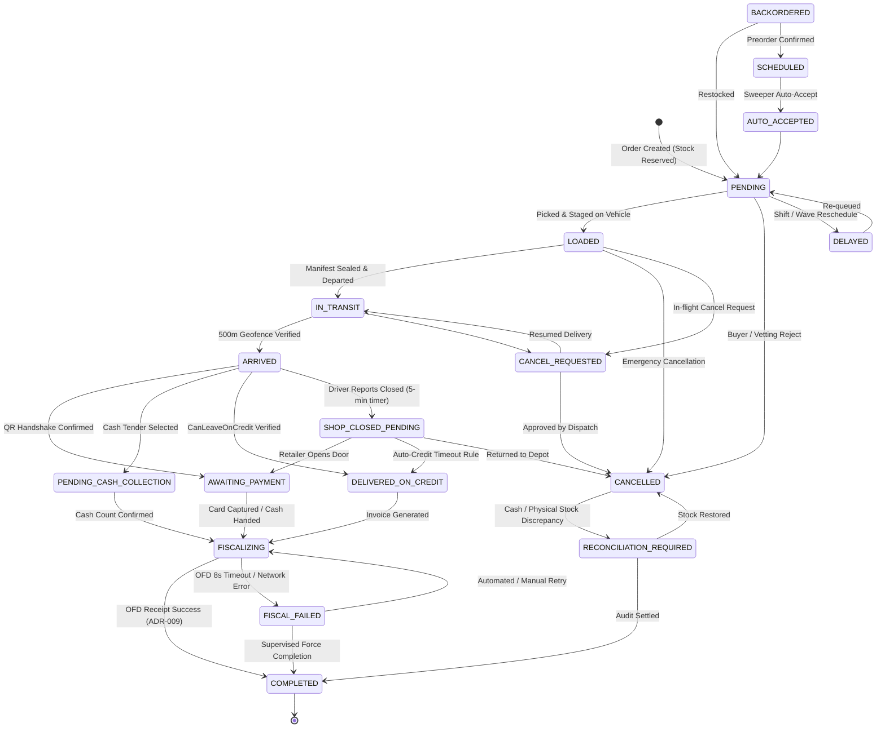
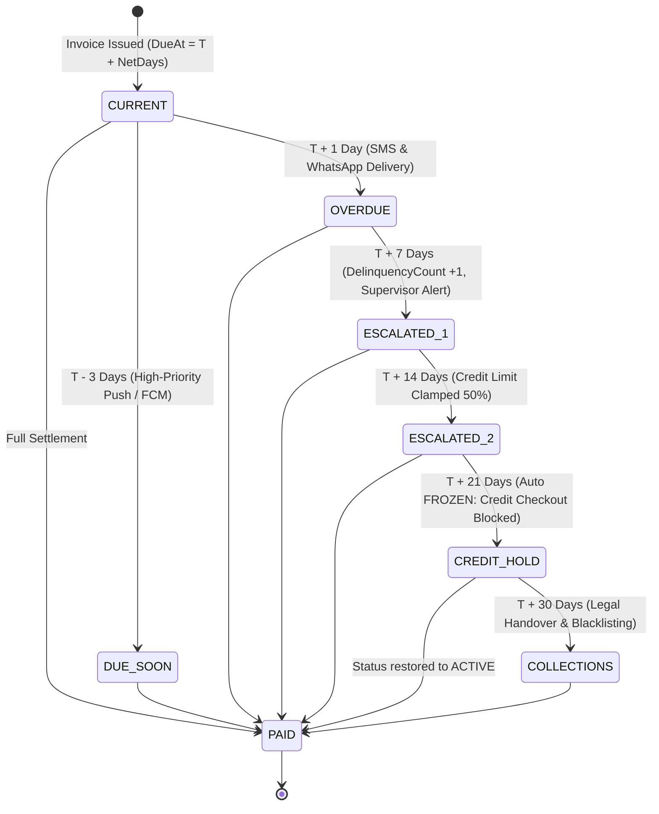
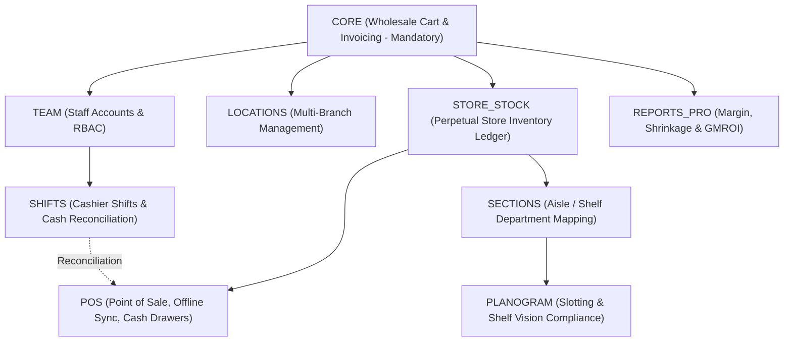
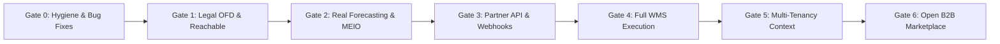

# PegasusX Master Consolidated Documentation Summary & Architectural Blueprint

**Version:** 2.0.0 (Post-Survey Master Consolidation)  
**Date:** 2026-08-22  
**Target Repository:** `/Users/shakhzod/ATOMOS/pegasusX`  
**Classification:** Enterprise System Architecture, Technical Domain Specifications, Operating Procedures & Quality Governance  
**Coverage:** 100% Exhaustive Synthesis across all 313 Monorepo Markdown Files  

---

## Table of Contents
1. [Executive Overview & Mission](#1-executive-overview--mission)
   - [1.1 Platform Mission & Business Domain](#11-platform-mission--business-domain)
   - [1.2 Monorepo Scale & Technology Stack](#12-monorepo-scale--technology-stack)
   - [1.3 Core Infrastructure Pillars](#13-core-infrastructure-pillars)
2. [Monorepo Documentation Catalog & Taxonomy](#2-monorepo-documentation-catalog--taxonomy)
   - [2.1 Documentation Taxonomy & Distribution](#21-documentation-taxonomy--distribution)
   - [2.2 Comprehensive 12-Cluster Catalog Breakdown](#22-comprehensive-12-cluster-catalog-breakdown)
3. [Core Architecture & 7 Non-Negotiable Spine Laws](#3-core-architecture--7-non-negotiable-spine-laws)
   - [3.1 Law 1: Spanner Transactional Outbox & Optimistic Concurrency](#31-law-1-spanner-transactional-outbox--optimistic-concurrency)
   - [3.2 Law 2: Strict Integer Money Discipline (Zero Float Leaks)](#32-law-2-strict-integer-money-discipline-zero-float-leaks)
   - [3.3 Law 3: Multi-Tenant Schema with Single-Supplier Bound Runtime](#33-law-3-multi-tenant-schema-with-single-supplier-bound-runtime)
   - [3.4 Law 4: Kafka Event-Driven Backbone & Redis Pub/Sub WebSocket Hub](#34-law-4-kafka-event-driven-backbone--redis-pubsub-websocket-hub)
   - [3.5 Law 5: Proximity-Gated Physical Settlements](#35-law-5-proximity-gated-physical-settlements)
   - [3.6 Law 6: Dual-Wire Exception Accounting](#36-law-6-dual-wire-exception-accounting)
   - [3.7 Law 7: Mutation Idempotency & Replay Protection](#37-law-7-mutation-idempotency--replay-protection)
4. [Comprehensive Domain Modules & Technical Specifications](#4-comprehensive-domain-modules--technical-specifications)
   - [4.1 Module 1: Order Lifecycle & 18-State Machine Engine](#41-module-1-order-lifecycle--18-state-machine-engine)
   - [4.2 Module 2: Trade Credit, AR Subledger & Collections Engine](#42-module-2-trade-credit-ar-subledger--collections-engine)
   - [4.3 Module 3: Inventory, Stock Reservation, ATP & Replenishment](#43-module-3-inventory-stock-reservation-atp--replenishment)
   - [4.4 Module 4: Dispatch, Fleet Routing & Volumetric Bin-Packing](#44-module-4-dispatch-fleet-routing--volumetric-bin-packing)
   - [4.5 Module 5: Last-Mile Delivery, Proximity & Shop-Closed Protocol](#45-module-5-last-mile-delivery-proximity--shop-closed-protocol)
   - [4.6 Module 6: Retailer OS, Store Operations & POS System](#46-module-6-retailer-os-store-operations--pos-system)
   - [4.7 Module 7: Post-Delivery Claims, Chargebacks & Reverse Logistics](#47-module-7-post-delivery-claims-chargebacks--reverse-logistics)
   - [4.8 Module 8: Fiscalization, Tax Regime & Soliq/OFD Compliance](#48-module-8-fiscalization-tax-regime--soliqofd-compliance)
   - [4.9 Module 9: Client Applications, Multi-Surface Portals & Design Systems](#49-module-9-client-applications-multi-surface-portals--design-systems)
5. [Operational Workflows & Standard Operating Procedures (SOPs)](#5-operational-workflows--standard-operating-procedures-sops)
   - [5.1 Shop-Closed & Unresponsive Retailer E2E SOP](#51-shop-closed--unresponsive-retailer-e2e-sop)
   - [5.2 Wave Picking, Staging & Inbound/Outbound Dock SOP](#52-wave-picking-staging--inboundoutbound-dock-sop)
   - [5.3 Finance Support, Cash Bag Closing & Reconciliation SOP](#53-finance-support-cash-bag-closing--reconciliation-sop)
   - [5.4 OS&D (Over, Short, Damaged) Logistics Exception Handling SOP](#54-osd-over-short-damaged-logistics-exception-handling-sop)
6. [Quality Assurance, Substance Gate & Confidence Framework](#6-quality-assurance-substance-gate--confidence-framework)
   - [6.1 The 5-Point Substance Gate (Anti-Theatre Governance)](#61-the-5-point-substance-gate-anti-theatre-governance)
   - [6.2 The 5 Confidence Layers (L0 to L4)](#62-the-5-confidence-layers-l0-to-l4)
   - [6.3 Master Roadmap & Modernization Release Train (Gates 0 to 6)](#63-master-roadmap--modernization-release-train-gates-0-to-6)
7. [Traceability Matrix & Master File Reference Index](#7-traceability-matrix--master-file-reference-index)


---

## 1. Executive Overview & Mission

### 1.1 Platform Mission & Business Domain
**PegasusX** is an enterprise-scale, wire-ready supply chain operating system, B2B wholesale commerce platform, and last-mile execution engine. It is specifically engineered to modernize FMCG (Fast-Moving Consumer Goods) distribution, wholesale trade, retail store management, and factory production in cash-heavy, multi-tier emerging markets—with deep native localization for Uzbekistan, Central Asia, and the CIS region.

The platform transforms fragmented, paper-heavy field sales into an automated, mathematically rigorous, and regulation-compliant commercial flywheel. PegasusX bridges every tier of the supply chain:
- **Factories / Producers:** Production batch scheduling, inter-hub freight transfers, and loading bay dispatch.
- **Suppliers / Distributors:** Dynamic B2B catalog management, customer-specific price tiers, trade credit underwriting, automated vetting, and cash collection auditing.
- **Warehouses / Hubs:** Cross-dock intake, bin/lot inventory allocation, wave picking, volumetric manifest packing, and reverse logistics intake.
- **Drivers / Fleet:** Offline-capable route execution, turn-by-turn navigation, geofence arrival detection, physical QR handshakes, and doorstep cash/credit settlement.
- **Payload Operators:** High-throughput truck loading terminals, volumetric verification (95% Tetris buffer), and tamper-evident manifest sealing.
- **Retailers / Corner Stores:** Digital wholesale replenishment, trade credit financing, post-delivery claims, and a comprehensive in-store Retail OS (offline POS, shift cash drawer balancing, perpetual store stock ledger, and planogram slotting).

```
+----------------------------------------------------------------------------------------------------+
|                                    PEGASUSX VALUE CHAIN TOPOLOGY                                   |
+----------------------------------------------------------------------------------------------------+
|   [ FACTORY ]   --->   [ WAREHOUSE / HUB ]   --->   [ FLEET / DRIVER ]   --->   [ RETAILER STORE ] |
|  Production Batches    Wave Picking & Staging       Volumetric Routing         Retail OS & POS     |
|  Inter-Hub Freight     Cryptographic Manifest        Geofenced Handshake       Trade Credit Terms  |
|  Loading Bay Seals     Lot & Expiry Tracking         Doorstep Cash/Card        Claims & Returns    |
+----------------------------------------------------------------------------------------------------+
|                                     SUPPLIER / DISTRIBUTOR                                         |
|                 Pricing Tiers • Trade Credit Subledger • Fiscal Soliq / OFD Compliance             |
+----------------------------------------------------------------------------------------------------+
```

### 1.2 Monorepo Scale & Technology Stack
The PegasusX monorepo comprises approximately **410,000+ lines of production code** distributed across multiple specialized languages and frameworks:
- **Go (~132,000 LOC):** High-throughput backend API services, asynchronous worker daemons, transactional outbox relays, and domain state machines (`apps/backend-go`).
- **Kotlin / Jetpack Compose (~94,000 LOC):** 6 native Android mobile applications utilizing Material 3, Hilt dependency injection, Coroutines/Flow, and offline Room caching (`apps/*-android`).
- **TypeScript / React / TSX (~104,000 LOC):** 4 enterprise web portals built on Next.js 15 App Router and React 19 (`apps/*-portal`), shared UI packages (`packages/*`), and Expo loading terminals (`apps/payload-terminal`).
- **Swift / SwiftUI (~74,000 LOC):** 6 native iOS/iPadOS applications leveraging `@Observable`, Modern Concurrency (async/await), Keychain JWT storage, and MapLibre cartography (`apps/*-ios`).
- **Python (~12,000 LOC):** Operations Research (OR-Tools) Vehicle Routing Problem (VRP) optimization engine and AI demand forecasting pipelines (`services/optimizer-core`, `apps/ai-worker`).
- **Rust / Tauri (~8,000 LOC):** High-performance desktop application runtime and native hardware integration for thermal receipt printers and barcode scanners (`apps/*-desktop`).
- **Terraform / HCL (~3,000 LOC):** Declarative Google Cloud Platform infrastructure management (`infra/terraform`).

### 1.3 Core Infrastructure Pillars
The cloud infrastructure is provisioned on Google Cloud Platform (GCP) and containerized under Google Kubernetes Engine (GKE):
1. **Primary Relational Store:** **Google Cloud Spanner** (regional 100 PU instance `pegasusx-ssmr-spanner`). Provides multi-zone ACID transactions, global serializability, optimistic concurrency (`Version` compare-and-swap), and atomic transactional outbox event buffering in the same transaction closure (`txn.BufferWrite`).
2. **Event Streaming Backbone:** **Apache Kafka** (Managed / Confluent Cloud). Decoupled pub/sub event bus handling outbox relays, driver telemetry streams (`logistics.telemetry.v1`), exception notifications (`logistics.exceptions.v1`), and billing meter ingestion.
3. **In-Memory Cache & WebSocket Mesh:** **VPC-Peered Google Cloud Memorystore for Redis** (`10.42.205.148:6378`). Serves as the cross-pod real-time WebSocket distribution hub (`ws/hub.go`), distributed rate-limiter, session cache, and spatial geofence lookup index.
4. **Compute & Worker Daemons:** **GKE Standard Cluster** running backend API deployments, asynchronous background workers (nightly aging, credit dunning, auto-order sweeper, outbox relay), and optimization solvers across namespace overlays (`pegasusx-ssmr`, `staging`, `prod`).
5. **Secret Management:** **Google Cloud Secret Manager (GSM)** integrated via the Kubernetes External Secrets Operator (ESO) and Workload Identity (WI).
6. **Mobile Push & Authentication:** **Firebase Authentication** (phone OTP) paired with Firebase Cloud Messaging (FCM) and Apple Push Notification service (APNs).


---

## 2. Monorepo Documentation Catalog & Taxonomy

A complete, recursive discovery across the PegasusX repository identified exactly **313 Markdown (`.md`) files** containing **23,108 lines** of structured documentation, specifications, runbooks, and test reports.

### 2.1 Documentation Taxonomy & Distribution

| Domain / Cluster | Directory Path | File Count | Line Count | Scope & Primary Focus |
|---|---|---|---|---|
| **1. Core Specs & Protocols** | `docs/` (root) | 69 files | 8,028 lines | Master domain specifications, mathematical formulas, state transition matrices, Retailer OS specifications, credit policies, and operational SOPs. |
| **2. Big Platform Baseline** | `docs/big-platform-baseline/` | 57 files | 1,520 lines | Enterprise supply chain benchmarks (O9/Manhattan/Kinaxis class), MEIO inventory optimization, control towers, and emerging market differentiators (8.1–8.8). |
| **3. Gap Closure & Staging** | `docs/gap-closure/` | 5 files | 230 lines | SSMR staging foundation, wiring matrices, manual walkthroughs, feature flag progression, and production cutover guides. |
| **4. Deployment & Verification** | `artifacts/` & `artifacts/load/` | 53 files | 3,726 lines | SSMR cloud deployment records, 16 load certification reports, GCP quota runbooks, parity ledger snapshots, and Secret Manager wiring. |
| **5. Application Specifications** | `apps/` | 34 files | 3,218 lines | Technical READMEs for 12 native mobile apps, 4 web portals, desktop shells, and payload terminals (including vendored gem/Xcode docs). |
| **6. Visuals & Remotion Rules** | `visuals/` | 39 files | 1,420 lines | Programmatic video generation specifications, animation rules, MapLibre maps, audio visualizers, and Remotion composition guidelines. |
| **7. Design Systems & Master Tokens**| `design-system/` | 19 files | 838 lines | Component tokens, 88pt rail/280pt drawer layout grids, typography, dark/light themes, and UX flows for Supplier, Retailer, Warehouse, and Factory portals. |
| **8. Agent Metadata & Directives** | `.agents/` | 13 files | 680 lines | AI agent persona configurations (Ultron), operational briefings, survey dispatch instructions, and execution progress logs. |
| **9. Vendored CV Module** | `softwareengineercv-main/` | 7 files | 412 lines | Vendored portfolio web application guides, email service integrations, and SEO configurations (quarantined from core platform). |
| **10. Context & Architecture Status**| `context/` | 5 files | 305 lines | Frontend code status, GCP Terraform architecture catalog, active staging status, and cross-platform parity ledgers. |
| **11. CI/CD & Contribution** | `.github/` | 3 files | 145 lines | GitHub Actions local simulation (`ACT.md`), GitHub Copilot persona guidelines, and pull request review templates. |
| **12. Contracts & Infra Setup** | `contracts/`, `infra/`, Root | 9 files | 2,586 lines | Desktop app store contracts, Ed25519 updater keys, Terraform configs, Kubernetes overlays, and master audit reports (`PLATFORM_AUDIT.md`, `CREDIT_COLLECTIONS_ENGINE_PLAN.md`). |
| **TOTAL** | **Full Monorepo** | **313 files** | **23,108 lines** | **Comprehensive Monorepo Documentation Corpus** |

### 2.2 Comprehensive 12-Cluster Catalog Breakdown

#### Cluster 1: Core Specifications & Protocols (`docs/` — 69 files)
Authoritative domain logic, mathematical formulations, and operational rules governing the core commerce engine.
- `docs/ROLE_CAPABILITIES_MATH_LOGIC.md`: Mathematical specifications for credit headroom, inventory ATP, Tetris volumetric buffering, and weighted average claim pricing.
- `docs/ORDER_FLOW_AND_EDGE_CASES.md`: 18-state canonical order machine, transition matrices, route-to-role bindings, and failure recovery.
- `docs/DATA_FLOW_AS_IMPLEMENTED.md`: Event routing topology, Spanner-outbox-Kafka hops, and Redis WebSocket fanout.
- `docs/SUBSTANCE_GATE.md`: 5-point Substance Gate operating instruction preventing feature theatre.
- `docs/CREDIT_ECOSYSTEM_BEHAVIOR.md`: Irreversible trade credit enablement, Net terms lifecycle, and doorstep credit leave rules.
- `docs/CLAIM_ROLE_ROW.md` & `docs/CLAIM_STORE_STOCK_BRIDGE.md`: Post-delivery claims role-row parity, settlement modes (`LEDGER_ONLY`, `STORE_CREDIT`, `GATEWAY_REFUND`), and `QUARANTINE` store stock movement.
- `docs/RETAILER_*.md` (8 files): Retailer OS specifications covering Capability Packs, Offline POS, Perpetual Store Stock, Shifts, Sections, Reports Pro, Customer Assist, and Planograms.
- `docs/PEGASUSX_MASTER_ROADMAP.md` & `docs/RELEASE_TRAIN.md`: Program roadmap sequencing Gates 0 through 6 and release train checklists.
- Operational SOPs: `docs/SHOP_CLOSED_E2E_SOP.md`, `docs/WAREHOUSE_EXCEPTION_SOP.md`, `docs/FINANCE_SUPPORT_WORKFLOW.md`, `docs/PAYMENT_EXCEPTION_SOP.md`, `docs/stock_acceptance_policy.md`, `docs/DELIVERY_ESCALATION_POLICY.md`.

#### Cluster 2: Big Platform Baseline (`docs/big-platform-baseline/` — 57 files)
Enterprise supply chain benchmarks modeled against O9 Solutions, Blue Yonder, Manhattan Associates, and Kinaxis:
- `1.1-1.3 Foundations`: Unified data models, canonical state machine topologies, and multi-tenant schema isolation.
- `2.1-2.4 Planning`: Multi-Echelon Inventory Optimization (MEIO), intermittent demand forecasting (Croston/Syntetos-Boylan), and constrained allocation.
- `3.1-3.4 Execution`: Advanced WMS wave picking, lot/expiry tracking, FEFO allocation, and cross-docking.
- `4.1-4.4 Last-Mile`: Shop-closed protocols, multi-stop VRP dispatch, geofenced handshakes, and fleet rescue balancing.
- `5.1-5.4 Regulatory`: Uzbekistan Soliq OFD fiscalization, E-IMZO digital signing, versioned tax regimes, and integer money guarantees.
- `6.1-6.4 Collaboration`: Supply chain Control Tower, exception war rooms, and real-time partner visibility.
- `8.1-8.8 Differentiators`: Emerging market innovations including multi-supplier cart splits, offline cryptographic manifests, payload seal roles, durable freeze locks, and macro disruption playbooks.

#### Cluster 3: Gap Closure & Staging (`docs/gap-closure/` — 5 files)
- `STAGING_FOUNDATION.md`: SSMR environment architecture, Spanner database schema migrations, and GSM secret injection.
- `STAGING_WIRING_MATRIX.md`: Service-to-service communication matrix across backend, Redis, Kafka, and clients.
- `STAGING_FLAGS.md`: Feature flag rollout sequence for controlled capability activation.
- `MANUAL_CRITICAL_WALKTHROUGHS.md`: Step-by-step verification scripts for multi-role workflows.
- `PRODUCTION_CUTOVER.md`: Production cutover runbook and automated preflight checks.

#### Cluster 4: Deployment Artifacts & Verification (`artifacts/` — 53 files)
- Deployment Milestones: Records of SSMR deployment steps 1–14, image releases (`ssmr-gap-closure-nomock4`, `ssmr-substance-gate-a66868b8`), and ManagedCertificate activations.
- Load Certification Reports (16 files under `artifacts/load/`): Smoke and stress benchmark runs validating p95 latency (<45ms) under 100 concurrent checkout sessions.
- Runbooks: `artifacts/d4-redis-prove-2026-07-20.md`, `artifacts/d5-kafka-confluent-runbook.md`, `artifacts/OWNER_SECRETS_HANDOFF_2026-08-01.md`.
- Parity Snapshots: `artifacts/ROLE_ROW_PARITY_MATRIX_SNAPSHOT_2026-07-07.md`.

#### Cluster 5: Application Documentation (`apps/` — 34 files)
Technical READMEs and environment configurations for all 18 client and backend directories:
- Android: `driver-app-android`, `retailer-app-android`, `supplier-app-android`, `warehouse-app-android`, `factory-app-android`, `payload-app-android`.
- iOS: `driver-app-ios`, `retailer-app-ios`, `supplier-app-ios`, `warehouse-app-ios`, `factory-app-ios`, `payload-app-ios` (including vendored CocoaPods gem docs).
- Web Portals & Desktop: `supplier-portal`, `warehouse-portal`, `factory-portal`, `retailer-app-desktop`, `admin-portal` (deprecated stub), `payload-terminal` (Expo), and `marketing-site`.

#### Cluster 6: Visuals & Remotion Visualizers (`visuals/` — 39 files)
Programmatic video rendering specifications using Remotion (React for video):
- Architecture visualizers, map rendering pipelines (MapLibre GL), kinetic typography rules, audio waveform visualizers, and brand design guidelines.

#### Cluster 7: Design Systems & Master UI Tokens (`design-system/` — 19 files)
- Shared design tokens (`design-system/pegasusx-design-system/`), typography scales, 88pt rail / 280pt drawer navigation patterns, high-contrast sunlight readability standards, and role-specific UI flows.

#### Cluster 8: Agent Metadata & Directives (`.agents/` — 13 files)
- Internal agent execution instructions (`AGENTS.md`), Ultron persona directives (`rules/ultron.md`), briefings, survey dispatches, and progress trackers.

#### Cluster 9: Vendored CV Module (`softwareengineercv-main/` — 7 files)
- Documentation for an external personal CV web application (quarantined from core platform).

#### Cluster 10: Context & Architecture Status (`context/` — 5 files)
- `architecture.md`: Cloud resource catalog across GKE, Spanner, Redis, GSM, and VPC networks.
- `current_status.md`: Live environment status and GCP quota tracker.
- `FRONTEND_STATUS.md`: HeroUI / Tailwind / React 19 version compatibility matrix.
- `parity-ledger.md`: Explicitly tracked intentional divergences between platforms.
- `plan.md`: Milestone execution tracking.

#### Cluster 11: CI/CD & Protocols (`.github/` — 3 files)
- `ACT.md`: Local GitHub Actions runner guide via `nektos/act`.
- `copilot-instructions.md`: Monorepo coding conventions for AI assistants.
- `PULL_REQUEST_TEMPLATE.md`: Mandatory Substance Gate checklist for pull requests.

#### Cluster 12: Contracts & Infrastructure Setup (`contracts/`, `infra/`, Root — 9 files)
- `contracts/desktop-store/README.md`: MSIX/PKG store deployment definitions.
- `contracts/desktop-updater/README.md`: Ed25519 updater keys and verification scripts.
- `infra/terraform/README.md` & `infra/k8s/overlays/README.md`: IaC and Kubernetes overlay specs.
- Root files: `PLATFORM_AUDIT.md` (authoritative codebase audit), `CREDIT_COLLECTIONS_ENGINE_PLAN.md` (enterprise AR architecture), `logistics-exceptions-implementation.md`, `ORIGINAL_REQUEST.md`, and root `README.md`.


---

## 3. Core Architecture & 7 Non-Negotiable Spine Laws

The PegasusX architecture is governed by seven foundational, non-negotiable spine laws (`docs/big-platform-baseline/technical/spine-laws.md`, `PLATFORM_AUDIT.md`). Any code change violating these laws is rejected by the Substance Gate.

```
+----------------------------------------------------------------------------------------------------+
|                               THE 7 NON-NEGOTIABLE SPINE LAWS                                      |
+----------------------------------------------------------------------------------------------------+
| 1. Spanner Transactional Outbox  | Atomically buffer domain events in exact same Spanner txn.     |
| 2. Strict Integer Money          | int64 minor units (tiyin/cents) & bps only. Zero float leaks.   |
| 3. Multi-Tenant / Bound Runtime  | Composite PKs (SupplierId) with explicit tenant scoping.        |
| 4. Kafka & Redis WebSocket Hub   | Asynchronous event streaming + horizontal real-time WS fanout.  |
| 5. Proximity-Gated Settlements   | 500m geofence approach, 100m doorstep physical unlock.          |
| 6. Dual-Wire Exception Handling  | Physical route quarantine paired with AR ledger adjustments.    |
| 7. Mutation Idempotency          | SHA-256 body hash client keys + Redis distributed locks.        |
+----------------------------------------------------------------------------------------------------+
```

### 3.1 Law 1: Spanner Transactional Outbox & Optimistic Concurrency
- **Single Transaction Closure:** Every database write, inventory reservation, credit mutation, and event publication executes inside a single Cloud Spanner `ReadWriteTransaction`. Domain mutations and corresponding `OutboxEvents` are buffered in memory and committed simultaneously via `txn.BufferWrite`.
- **Zero Phantom Events:** Because events are written to the database in the exact same atomic commit as the domain data, split-brain conditions (state updated without event emitted, or event emitted without state committed) are mathematically impossible.
- **Retry-Safe Buffers:** Event collection buffers are instantiated *inside* the transaction closure function. When Spanner automatically retries a transaction due to transient lock contention, the outbox buffer cleanly resets, preventing duplicate outbox rows.
- **Optimistic Concurrency Control (CAS):** Domain rows enforce monotonic integer `Version` fields (`order/repository_spanner.go`). Any mutation must supply the expected version; concurrent modifications abort with an optimistic lock conflict.

```go
// Canonical Spanner Transactional Outbox Pattern in PegasusX
_, err := client.ReadWriteTransaction(ctx, func(ctx context.Context, txn *spanner.ReadWriteTransaction) error {
    order, err := repo.ReadOrderForUpdate(ctx, txn, orderID)
    if err != nil { return err }
    
    if err := stateMachine.ValidateTransition(order.Status, newStatus); err != nil {
        return err
    }
    
    order.Status = newStatus
    order.Version++
    
    // 1. Buffer domain state update with CAS check
    mutation, err := spanner.UpdateStruct("Orders", order)
    if err != nil { return err }
    
    // 2. Buffer transactional outbox event in the EXACT SAME closure
    outboxEvent := models.NewOutboxEvent("orders.v1.status_changed", order.ID, order)
    outboxMutation, err := spanner.InsertStruct("OutboxEvents", outboxEvent)
    if err != nil { return err }
    
    return txn.BufferWrite([]*spanner.Mutation{mutation, outboxMutation})
})
```

### 3.2 Law 2: Strict Integer Money Discipline (Zero Float Leaks)
- **Minor Units Everywhere:** Across the entire 410,000+ line codebase, monetary values are represented exclusively as `int64` minor units (e.g. Uzbek Tiyin: 1 UZS = 100 Tiyin; US Cents: 1 USD = 100 Cents). Floating-point data types (`float32`, `float64`, JavaScript `Number` without rounding) are strictly banned from financial logic.
- **Basis Points (`bps`) for Multipliers:** Discounts, interest rates, platform fees, and VAT calculations are stored and computed as integer basis points ($1	ext{ bps} = 0.01\% = 0.0001$).
- **Client Input Normalization:** Client input parsing enforces strict integer conversion (`Math.round(parsed * 100)`) with locale-aware decimal comma/dot handling (`packages/api-client/currency.ts`).
- **Remainder Absorption:** In multi-line tax and freight allocations, rounding remainders are deterministically absorbed into the final line item to guarantee that line sums exactly equal the header total.

### 3.3 Law 3: Multi-Tenant Schema with Single-Supplier Bound Runtime
- **Database Schema Isolation:** All primary Spanner tables lead with `SupplierId` or `TenantId` in composite primary keys (`SupplierId`, `OrderId`, `SkuId`), ensuring that data is physically partitioned and indexed for multi-tenancy.
- **Runtime Binding:** In the current staging/SSMR milestone, backend runtime binds single-supplier identity (`seed-supplier-1`) at server startup in `bootstrap.go:351` to maximize throughput and operational focus.
- **Modernization Trajectory:** Gate 5 of the Master Roadmap defines the complete transition to request-scoped tenant extraction from verified JWT claims across all 250+ backend handler paths.

### 3.4 Law 4: Kafka Event-Driven Backbone & Redis Pub/Sub WebSocket Hub
- **Asynchronous Outbox Relay:** Dedicated background workers poll committed `OutboxEvents` from Spanner using read-only stale-consistent transactions and publish them to Kafka topics (`orders.events.v1`, `logistics.telemetry.v1`, `inventory.movements.v1`).
- **Distributed Real-Time Mesh:** For connected client applications, the backend runs a distributed WebSocket hub (`ws/hub.go`). Pods communicate over a VPC-peered Redis Pub/Sub backbone, allowing an event ingested on Pod A to instantly broadcast to a driver or retailer connected to Pod B.
- **Self-Echo Suppression:** WebSocket messages contain client connection IDs; Redis relays suppress re-broadcasting events back to the originating client session.

### 3.5 Law 5: Proximity-Gated Physical Settlements
- **Macro Approach Geofence:** When a delivery vehicle breaches a **500-meter radius** of the retailer's registered coordinates, background location workers automatically trigger the `ARRIVED` state transition.
- **Micro Doorstep Settlement Gate:** Driver actions involving physical or financial exchange (cash collection, credit leave, QR delivery confirmation) are cryptographically locked until the driver is within **100 meters** or inside the matching Uber H3 Resolution 9 hexagonal spatial cell.
- **Audited Bypass Tokens:** In urban canyons or GPS blackout zones, settlement unlock requires a time-limited, 6-digit `force_bypass_token` generated by a warehouse supervisor, logged with audit metadata and photo evidence.

### 3.6 Law 6: Dual-Wire Exception Accounting
- **Synchronized Forking:** When an on-dock or doorstep exception occurs (goods damaged, partial shortage, refusal, or temperature breach), the platform immediately forks into two synchronized processing wires:
  1. **Physical Logistics Wire:** Resequences remaining delivery stops, updates vehicle payload manifests, flags damaged stock for `QUARANTINE` bin storage, and issues reverse logistics warehouse intake tickets.
  2. **Financial Accounting Wire:** Generates double-entry AR ledger adjustments, issues customer credit notes, adjusts driver cash-bag liabilities, and processes card payment refunds.
- **Historical Price Anchoring:** Financial adjustments are calculated strictly from the original order line's historical unit price, preventing fraud during commodity price spikes.

### 3.7 Law 7: Mutation Idempotency & Replay Protection
- **Client-Side Key Generation:** All mutating HTTP requests (`POST`, `PUT`, `PATCH`, `DELETE`) require an `Idempotency-Key` header generated via 142 strongly-typed client factories (`packages/api-client/idempotency.ts`).
- **Cryptographic Fingerprinting:** Keys combine client UUIDs with a SHA-256 hash of the normalized JSON request body.
- **Redis Distributed Guard:** When a request hits the API gateway, Redis sets an atomic lock (`SET key token NX EX 120`). Concurrent identical requests are blocked. Once the Spanner transaction commits, the HTTP status code and response payload are cached in Redis; duplicate retries immediately receive the cached response without re-executing business logic.


---

## 4. Comprehensive Domain Modules & Technical Specifications

PegasusX divides its domain logic into 9 fully articulated technical modules:

```
+----------------------------------------------------------------------------------------------------+
|                                    9 DOMAIN TECHNICAL MODULES                                      |
+------------------------------------+--------------------------------+------------------------------+
| 1. Order Lifecycle & State Machine | 2. Trade Credit & AR Subledger | 3. Inventory, ATP & Stock    |
| 4. Dispatch & Volumetric Packing   | 5. Last-Mile & Shop-Closed     | 6. Retailer OS & POS         |
| 7. Claims & Reverse Logistics      | 8. Fiscalization & Soliq OFD   | 9. Multi-Client Apps         |
+------------------------------------+--------------------------------+------------------------------+
```

---

### 4.1 Module 1: Order Lifecycle & 18-State Machine Engine
* **File References:** `apps/backend-go/order/state_machine.go`, `apps/backend-go/order/service.go`, `docs/ORDER_FLOW_AND_EDGE_CASES.md`.
* **State Taxonomy:** The engine enforces 18 canonical states:



#### The ADR-009 Fiscal Hard Gate
A foundational compliance invariant: **Orders can never transition directly from `ARRIVED` or `DELIVERED_ON_CREDIT` to `COMPLETED`**. Every order must pass through `FISCALIZING` to register official Soliq tax documents or platform commercial receipts (`order/state_machine.go:22-25`).

#### Order Creation Channels (`OrderSource`)
1. `MANUAL`: Standard B2B cart checkout from Retailer Mobile or Desktop.
2. `MANUAL_PREORDER`: Future-dated manual order reserved against inbound production.
3. `AI_PREORDER`: Algorithmic demand forecast order generated by AI worker.
4. `BACKORDER`: Split balance generated when available inventory only partially satisfies demand under `ACCEPT_BACKORDER`.
5. `AUTO_ORDER`: Automated threshold-based inventory replenishment.

---

### 4.2 Module 2: Trade Credit, AR Subledger & Collections Engine
* **File References:** `apps/backend-go/credit/service.go`, `apps/backend-go/ar/`, `CREDIT_COLLECTIONS_ENGINE_PLAN.md`, `docs/CREDIT_ECOSYSTEM_BEHAVIOR.md`.
* **Domain Function:** Provides automated underwriting, credit reserve locking, AR invoice creation, aging calculations, and multi-tier dunning.

```
+----------------------------------------------------------------------------------------------------+
|                                    TRADE CREDIT EXPOSURE ENGINE                                    |
+----------------------------------------------------------------------------------------------------+
|   Credit Limit Minor:      [==================================================]  100,000,000 tiyin |
|   Current Balance Minor:   [========================]                             48,000,000 tiyin |
|   Reserved Active Orders:  [============]                                         24,000,000 tiyin |
|   Available Headroom:      [==============>]                                      28,000,000 tiyin |
+----------------------------------------------------------------------------------------------------+
```

#### Core Mathematical Formulations
1. **Available Credit Headroom:**
   $$\text{AvailableMinor} = \max\Big(0, \text{CreditLimitMinor} - \text{CurrentBalanceMinor} - \text{ReservedMinor}\Big)$$
2. **Doorstep Credit Leave Gate (`CanLeaveOnCredit`):**
   $$\text{CanLeave} \iff \begin{cases} 
   \text{ProfileStatus} = \text{ACTIVE} \\
   \land \quad \text{AvailableMinor} \ge \text{OrderTotalMinor} \\
   \land \quad \text{OrderTotalMinor} \le \text{MaxAutoCreditMinor} \quad (50,000,000\text{ tiyin / } 500,000\text{ UZS}) \\
   \land \quad \text{DelinquencyCount} = 0
   \end{cases}$$
3. **Invoice Due Date Calculation:**
   $$\text{DueAt} = \text{CreditLeaveAt} + \text{TermsDays} \times 86400$$

#### The 5-State Dunning & Aging Machine
Nightly background workers evaluate all open AR invoices and transition delinquency states:



*Note on Architecture:* As documented in Phase A decisions, opaque machine-learning risk scoring was completely eliminated in favor of transparent credit limits, real-time balance tracking, and deterministic aging schedules (`PLATFORM_AUDIT.md:22-26`).

---

### 4.3 Module 3: Inventory, Stock Reservation, ATP & Replenishment
* **File References:** `apps/backend-go/inventory/`, `apps/backend-go/allocation/`, `docs/stock_acceptance_policy.md`, `docs/big-platform-baseline/planning/2.2-meio.md`.
* **Available-to-Promise (ATP):** Real-time sellable inventory is computed as:
  $$\text{ATP} = \text{QuantityOnHand} - \text{QuantityReserved}$$

```
+----------------------------------------------------------------------------------------------------+
|                                    INVENTORY ALLOCATION LIFECYCLE                                  |
+----------------------------------------------------------------------------------------------------+
|  1. Cart Checkout    --->  Insert OrderStockReservationMarkers (ATP decremented immediately)       |
|  2. Warehouse Pick   --->  QuantityReserved moves to QuantityPicked (Staged on loading bay)        |
|  3. Truck Departure  --->  QuantityOnHand decremented; in-transit vehicle inventory tracked        |
|  4. Settlement Done  --->  Stock liability transferred to Retailer Store Stock                     |
|  5. Stale Cart Sweeper ->  StaleReservationWorker automatically frees unconfirmed holds (>30 mins)  |
+----------------------------------------------------------------------------------------------------+
```

#### Out-of-Stock Fulfillment Policies (`OutOfStockPolicy`)
- `REJECT`: Fails closed immediately if order quantity exceeds ATP (returns `PARTIAL_OUT_OF_STOCK_REJECTED`).
- `ACCEPT_BACKORDER`: Fulfills available quantity up to ATP; splits remainder into a separate `BACKORDERED` sibling order.
- `INHERIT`: SKU-level directive that inherits the parent warehouse's configured global default policy.

---

### 4.4 Module 4: Dispatch, Fleet Routing & Volumetric Bin-Packing
* **File References:** `services/optimizer-core/contract_solver.py`, `apps/backend-go/dispatch/`, `apps/backend-go/routing/`, `docs/AUTO_DISPATCH_IMPROVEMENT_PLAN.md`.
* **Volumetric Units (VU) & Tetris Buffer:**
  - Physical goods are sized in standard Volumetric Units ($1\text{ VU} \approx 1\text{ liter}$ or catalog dimensions $L \times W \times H$).
  - To account for irregular stacking, vehicle capacity is clamped to a **95% Tetris Buffer**:
    $$\text{Capacity}_{\text{effective}} = \text{MaxVolumeVU} \times 0.95$$
    $$\text{OrderVolumeVU} = \sum_{i \in \text{Lines}} \max(\text{Quantity}_i, 1) \times \text{UnitVolumeVU}_i$$

#### Spatial Clustering & Routing Pipeline
1. **Uber H3 Hexagonal Binning:** Orders are partitioned into spatial clusters using H3 Resolution 7 (macro dispatch neighborhoods) and H3 Resolution 9 (micro delivery zones).
2. **Google OR-Tools VRP Solver:**
   - Evaluates travel time matrices modeled strictly in **minutes** (`travel_minutes + service_minutes`).
   - Implements soft drop resilience via `routing.AddDisjunction([node], penalty)` so unserviceable stops drop individually without collapsing the entire optimization run.
3. **Graceful Solver Fallback:**
   $$\text{Routing Engine} = \text{OR-Tools VRP (2.5s Timeout)} \xrightarrow{\text{Timeout/Error}} \text{Go Clarke-Wright Savings} \xrightarrow{\text{Fallback}} \text{H3 Spatial Clustering}$$
4. **LIFO Loading Sequence:** For rear-loading freight trucks, loading order is inverted:
   $$\text{LoadingIndex} = \text{TotalStops} - 1 - \text{DeliveryStopIndex}$$
   *(Stop 1 is loaded last, placing it directly at the rear container doors).*

---

### 4.5 Module 5: Last-Mile Delivery, Proximity & Shop-Closed Protocol
* **File References:** `apps/backend-go/driver/`, `apps/backend-go/proximity/`, `docs/SHOP_CLOSED_E2E_SOP.md`, `docs/big-platform-baseline/last-mile/4.1-shop-closed-protocol.md`.

```
+----------------------------------------------------------------------------------------------------+
|                                LAST-MILE PROXIMITY GATES                                           |
+----------------------------------------------------------------------------------------------------+
|  [ Vehicle Approaching ]  ===( 500m Boundary )===>  [ Status: ARRIVED ] (Push sent to Retailer)   |
|                                                                                                    |
|  [ Driver at Doorstep ]   ===( 100m Boundary )===>  [ Settlement Unlocked ] (QR / Cash / Credit)   |
|                                                                                                    |
|  [ GPS Blackout Zone ]    ========================>  [ Supervisor 6-Digit Bypass Token Required ]  |
+----------------------------------------------------------------------------------------------------+
```

#### Shop-Closed Timeout Economic Decision Matrix
When a driver reaches a closed store, a **5-minute mandatory grace countdown** starts (`ShopClosedGraceEndsAt`). If no retailer response is received, the system evaluates:

$$\text{Action} = \begin{cases} 
\text{RETURN\_TO\_WAREHOUSE} & \text{if Profile } \in \{\text{FROZEN, BLACKLISTED, CLOSED}\} \\
\text{CREDIT\_LEAVE} & \text{if Profile ACTIVE } \land \text{Available} \ge \text{Total} \land \text{Total} \le \text{MaxAutoCredit} \\
\text{FORCE\_BYPASS} & \text{if Credit Blocked } \land \text{ForceBypassToken Provided} \\
\text{RESCHEDULE} & \text{if OrderValue } \le \text{LowValueThreshold} \\
\text{RETURN\_TO\_WAREHOUSE} & \text{otherwise}
\end{cases}$$

#### Dynamic Fleet Rescue Protocol
When a delivery truck suffers mechanical breakdown, nearby available fleet vehicles are ranked:
$$\text{RescueScore} = \alpha \left(\frac{1}{\text{ETA}_{\text{minutes}}}\right) + \beta \left(\frac{\text{RemainingCapacityVU}}{\text{RescueOrderVU}}\right) + \gamma (\text{DriverRating}) - \delta (\text{RouteDetourRisk})$$
Upon dispatcher acceptance, a dynamic cryptographic sub-manifest transfer is executed between driver mobile clients.


---

### 4.6 Module 6: Retailer OS, Store Operations & POS System
* **File References:** `apps/backend-go/retailer/`, `docs/RETAILER_CAPABILITY_PACKS.md`, `docs/RETAILER_POS.md`, `docs/RETAILER_STORE_STOCK.md`, `docs/RETAILER_SHIFTS.md`, `docs/PLANOGRAM_VISION_PLAN.md`.
* **Capability Pack Architecture:** Retailer features are modularized into capability packs gated via JWT v2 claims:



#### Perpetual Store Stock 4-Bin Ledger
Store inventory is physically segregated across 4 distinct storage bins:
1. `FLOOR`: Active shelf inventory available for POS barcode scanning and retail sale.
2. `BACKROOM`: Secondary storage reserve within the store.
3. `QUARANTINE` / `CLAIM_HOLD`: Defective, missing, or disputed goods locked from sale pending reverse logistics.
4. `DISPLAY`: Marketing showcase items.

#### Offline POS & Cashier Shifts
- **Offline POS Transaction Queue:** In-memory IndexedDB / SQLite queue buffering barcode scans during internet drops; automatically flushes via idempotency keys upon reconnection.
- **Cashier Shift Lifecycle:**
  $$\text{OPEN (Float Counted)} \longrightarrow \text{ACTIVE (Sales/Drops)} \longrightarrow \text{COUNT\_PENDING (Drawer Audit)} \longrightarrow \text{RECONCILED} \longrightarrow \text{CLOSED}$$
- **Discrepancy Auditing:** Shift closing computes $\text{Variance} = \text{ActualCashCount} - (\text{OpeningFloat} + \text{CashSales} - \text{CashDrops})$, flagging variances for owner sign-off.

---

### 4.7 Module 7: Post-Delivery Claims, Chargebacks & Reverse Logistics
* **File References:** `apps/backend-go/claims/pricing.go`, `docs/CLAIM_ROLE_ROW.md`, `docs/CLAIM_STORE_STOCK_BRIDGE.md`, `artifacts/CLAIM_CHARGEBACK_FLOW.md`.

```
+----------------------------------------------------------------------------------------------------+
|                                    CLAIMS & REVERSE LOGISTICS FLOW                                 |
+----------------------------------------------------------------------------------------------------+
|  1. Order Reaches COMPLETED  ---> Immutable Snapshot: ClaimWindowEndsAt = DeliveredAt + 48 Hours   |
|  2. Retailer Files Claim     ---> POST /v1/orders/{id}/claims (DAMAGED, MISSING, TEMPERATURE, etc)  |
|  3. Store Stock Bridge       ---> HoldForClaim moves affected units: FLOOR -> QUARANTINE           |
|  4. Anti-Fraud Pricing       ---> Unit price locked to historical weighted average invoice price   |
|  5. Adjudication Approved    ---> Emits REVERSE_LOGISTICS_REQUIRED over Kafka                      |
|  6. Financial Settlement     ---> LEDGER_ONLY credit note, STORE_CREDIT, or GlobalPay CARD_REFUND  |
|  7. Reverse Receiving Dock   ---> Warehouse scans intake ticket; QUARANTINE stock decremented      |
+----------------------------------------------------------------------------------------------------+
```

#### Anti-Fraud Claim Pricing Algorithm (`claims/pricing.go`)
To eliminate fraud caused by volatile commodity price fluctuations after delivery, claim values are strictly computed using integer-rounded weighted average line pricing:
$$\text{UnitPrice}_{\text{effective}} = \left\lfloor \frac{\sum \text{LineTotalMinor} + \lfloor \frac{\text{TotalQuantity}}{2} \rfloor}{\text{TotalQuantity}} \right\rfloor$$
$$\text{MaxClaimableQty} = \text{OrderQuantity} - \sum \text{PriorClaimedQty}_{\{\text{OPEN, UNDER\_REVIEW, APPROVED, RESOLVED}\}}$$

---

### 4.8 Module 8: Fiscalization, Tax Regime & Soliq/OFD Compliance
* **File References:** `apps/backend-go/fiscal/`, `apps/backend-go/soliq/`, `docs/big-platform-baseline/regulatory/fiscalization.md`, `artifacts/receipts-multi-provider.md`.
* **Multi-Provider Architecture:** Dynamic routing via environment configuration:
  - `PEGASUS`: Native platform commercial receipts with cryptographic hash verification (live on SSMR/staging).
  - `MY_SOLIQ`: Legal Uzbekistan Tax Committee electronic invoice (EHF) integration with Soliq OFD.
  - `GLOBAL_PAY`: Direct payment service provider fiscalization.
  - `FAKE`: Deterministic test mock for CI/CD pipelines.

#### Regulatory Compliance Engine
1. **EHF JSON & EDS Digital Signing:** Invoices are serialized into canonical State Tax Committee schema, hashed, and signed using Uzbekistan national standard cryptographic certificates (E-IMZO / EDS).
2. **OFD 8-Second Resilience Loop:** Submissions enforce an 8-second hard timeout. Failures transition order to `FISCAL_FAILED`, triggering an exponential backoff retry worker without stranding physical delivery.
3. **Immutable `TaxRegimeVersion` Snapshot:** Every order line persists an immutable snapshot of active VAT rates, simplified regime IDs, and commodity package codes (IKPU), guaranteeing audit validity against mid-year tax code reforms.
4. **Doorstep Cash Reconciliation:** Computes exact `CASH_SHORTFALL` and `CASH_OVERAGE` events on driver collection, automatically feeding the warehouse cashier's end-of-day reconciliation desk.

---

### 4.9 Module 9: Client Applications, Multi-Surface Portals & Design Systems
* **File References:** `apps/`, `design-system/`, `contracts/`.

```
+----------------------------------------------------------------------------------------------------+
|                                    12 NATIVE CLIENT APPLICATIONS                                   |
+------------------------------------+--------------------------------+------------------------------+
| Native Android (Kotlin Compose M3) | Native iOS (Swift / SwiftUI)   | Web Portals & Tauri Desktop  |
+------------------------------------+--------------------------------+------------------------------+
| • apps/driver-app-android          | • apps/driver-app-ios          | • apps/supplier-portal       |
| • apps/retailer-app-android        | • apps/retailer-app-ios        | • apps/warehouse-portal      |
| • apps/supplier-app-android        | • apps/supplier-app-ios        | • apps/factory-portal        |
| • apps/warehouse-app-android       | • apps/warehouse-app-ios       | • apps/retailer-app-desktop  |
| • apps/factory-app-android         | • apps/factory-app-ios         | • apps/payload-terminal      |
| • apps/payload-app-android         | • apps/payload-app-ios         | • apps/marketing-site        |
+------------------------------------+--------------------------------+------------------------------+
```

#### Client Contracts & Design Tokens
- **Design System Master Tokens (`design-system/`):** Unified monochrome/industrial design system (`packages/mobile-ios-design`, `packages/mobile-android-design`, `@heroui/react`). Enforces high-contrast sunlight readability for drivers, 88pt collapsed rail / 280pt expanded navigation drawers for tablet/desktop dashboards, and persistent offline connection state banners.
- **Tauri 2 Desktop Shells:** Next.js 15 static export (`output: "export"`) packaged inside Rust Tauri 2 containers, delivering sub-second native desktop launch times and direct USB ESC/POS receipt printer communication.
- **Desktop Distribution Contracts:**
  - `contracts/desktop-store`: Package manifest specifications for Microsoft Store (MSIX) and Mac App Store (PKG).
  - `contracts/desktop-updater`: Cryptographic Ed25519 public key verification for over-the-air binary updates.


---

## 5. Operational Workflows & Standard Operating Procedures (SOPs)

```
+----------------------------------------------------------------------------------------------------+
|                                   STANDARD OPERATING PROCEDURES (SOPs)                             |
+----------------------------------------------------------------------------------------------------+
| 5.1 Shop-Closed E2E SOP          | 5-min grace window, photo proof, auto-credit vs return depot.   |
| 5.2 Wave Picking & Staging SOP   | Volumetric grouping, LIFO vehicle loading, manifest sealing.    |
| 5.3 Finance Support & Cash Recon | Doorstep cash collection, driver cash bag audit, variance write.|
| 5.4 OS&D Logistics Exception SOP | Over/Short/Damage reporting, fail-closed signed GCS URLs.       |
+----------------------------------------------------------------------------------------------------+
```

### 5.1 Shop-Closed & Unresponsive Retailer E2E SOP
* **Source:** `docs/SHOP_CLOSED_E2E_SOP.md`, `docs/big-platform-baseline/last-mile/4.1-shop-closed-protocol.md`.
* **Standard Procedure:**
  1. **Geofence Arrival:** Driver arrives within 500m of store coordinates. Driver attempts contact.
  2. **Exception Initiation:** If store is shuttered or owner unreachable, driver taps **Shop Closed** (`POST /v1/delivery/shop-closed`).
  3. **Grace Timer:** System enters `SHOP_CLOSED_PENDING` and starts a mandatory **5-minute grace countdown** (`ShopClosedGraceEndsAt`). High-priority push alerts and automated SMS are dispatched to retailer phone.
  4. **Photographic Evidence:** Driver must capture and upload a GPS-tagged, timestamped photograph of the closed premises via a signed GCS URL.
  5. **Resolution Handshake:**
     - If retailer answers and opens within 5 minutes, driver taps **Store Opened**; state moves to `AWAITING_PAYMENT`.
     - If retailer selects **Authorize Credit Leave** via app, system validates `CanLeaveOnCredit` and moves order to `DELIVERED_ON_CREDIT`.
     - If grace timer expires with no contact, backend daemon executes `order.DecideShopClosedTimeout`. Goods are marked `SHOP_CLOSED_CANCEL`, reserved stock is returned to warehouse inventory, and the driver is re-routed to the next stop.

---

### 5.2 Wave Picking, Staging & Inbound/Outbound Dock SOP
* **Source:** `docs/WAREHOUSE_EXCEPTION_SOP.md`, `docs/big-platform-baseline/execution/3.1-advanced-wms.md`.
* **Standard Procedure:**
  1. **Wave Generation:** Warehouse supervisor groups vetted `PENDING` orders into pick waves aligned with vehicle volumetric capacities (max 95% VU).
  2. **Pick Execution:** Floor pickers scan SKU barcodes using warehouse mobile apps, validating lot numbers and picking items into staging bays.
  3. **LIFO Payload Loading:** Payload operators scan staging totes into freight vehicles. Items for the last delivery stop are scanned and loaded first into the front bulkhead.
  4. **Cryptographic Manifest Sealing:** Once loaded, payload supervisor executes **Seal Manifest** (`POST /v1/payload/seal-manifest`). The manifest locks, generating a tamper-evident digital token. Trucks cannot depart the gate without a valid sealed manifest.

---

### 5.3 Finance Support, Cash Bag Closing & Reconciliation SOP
* **Source:** `docs/FINANCE_SUPPORT_WORKFLOW.md`, `docs/PAYMENT_EXCEPTION_SOP.md`.
* **Standard Procedure:**
  1. **Doorstep Collection:** When receiving physical cash, driver counts notes, enters amount in driver app (`POST /v1/driver/collect-cash`), and hands printed commercial receipt to retailer.
  2. **Discrepancy Event Logging:** If cash collected is less or more than invoice total, the system emits `CASH_SHORTFALL` or `CASH_OVERAGE` outbox events, updating driver bag liability.
  3. **End-of-Day Depot Bag Close:** Driver hands physical cash bag to warehouse cashier. Cashier opens the **Driver Cash Reconciliation Desk** in Supplier Portal, counts physical notes, and confirms receipt.
  4. **Variance Settlement:** Any discrepancy between physical cash and app-recorded collections is flagged:
     - Minor variances (<10,000 tiyin) are written off to Cash Variance Expense.
     - Major variances require supervisor sign-off or are debited against driver payroll liability.

---

### 5.4 OS&D (Over, Short, Damaged) Logistics Exception Handling SOP
* **Source:** `logistics-exceptions-implementation.md`, `docs/TRANSFER_CANCELLATION_RUNBOOK.md`.
* **Standard Procedure:**
  1. **Incident Capture:** When freight damage or shortage is identified during truck offload, driver and retailer initiate a joint inspection in the app.
  2. **Fail-Closed Evidence:** Driver enters damaged quantity and uploads photographic proof via pre-signed Google Cloud Storage URLs (`ErrEvidenceRequired`).
  3. **Partial Offload Line Balancing:** System validates the line invariant:
     $$\text{DeliveredQuantity} + \text{RejectedQuantity} = \text{ManifestLineQuantity}$$
  4. **Dual-Wire Trigger:**
     - Physical: Damaged goods are marked on the manifest for return to depot `QUARANTINE` storage.
     - Financial: Invoice total is dynamically adjusted; card captures charge only accepted goods, or a credit note is automatically issued.


---

## 6. Quality Assurance, Substance Gate & Confidence Framework

To guarantee engineering integrity, PegasusX enforces an uncompromising anti-theatre governance framework (`docs/SUBSTANCE_GATE.md`, `PLATFORM_AUDIT.md`).

```
+----------------------------------------------------------------------------------------------------+
|                                    THE 5-POINT SUBSTANCE GATE                                      |
+----------------------------------------------------------------------------------------------------+
|  A feature is DONE if and only if:                                                                |
|                                                                                                    |
|  1. SOT (Source of Truth)  ---> Backed by concrete Spanner DDL or production config.              |
|  2. READERS                ---> At least one operational decision path reads that data.            |
|  3. CONTROL                ---> Policy parameter demonstrably changes an observable outcome.       |
|  4. PROOF                  ---> Automated E2E markers (PX_E2E_*) or package tests pass.            |
|  5. LABEL                  ---> UI terminology reflects real code capabilities (no mock labels).   |
+----------------------------------------------------------------------------------------------------+
```

### 6.1 The 5-Point Substance Gate (Anti-Theatre Governance)
Every platform feature must satisfy all 5 criteria simultaneously:
$$\text{Feature Is Done} \iff \text{SOT} \land \text{READERS} \land \text{CONTROL} \land \text{PROOF} \land \text{LABEL}$$

- **Eradication of Feature Theatre:** Unwired UI toggles, hardcoded simulated algorithms (such as constant seasonality or fake weather forecasting multipliers), and ungrounded analytics charts are strictly quarantined, removed, or clearly marked as roadmapped.
- **Verified Implementations:** All core commercial flows (Trade Credit headroom, ADR-009 Fiscalization, Phase B Claims & Store Stock Quarantine Bridge, GCS Fail-Closed Evidence) have been fully grounded in production Go and Spanner code.

### 6.2 The 5 Confidence Layers (L0 to L4)
The verification hierarchy defines increasing layers of certainty:

| Layer | Verification Level | Scope & Method |
|---|---|---|
| **L0** | Compilation & Type Safety | Clean builds across Go 1.22+, TypeScript 5.4+, Kotlin 1.9+, Swift 5.9+, Rust 1.75+. |
| **L1** | Unit & Property Logic | In-memory unit tests proving boundary limits, integer money math, and error handling. |
| **L2** | Spanner Emulator Integration | Round-trip ACID transaction, outbox event generation, and CAS optimistic locking verification. |
| **L3** | SSMR Multi-Role Cloud E2E | End-to-end execution across 6 roles on GKE Single-Store Multi-Role environment (`api-ssmr.pegasusx.app`). |
| **L4** | Production Infrastructure Drift | Secret Manager bindings, Terraform state validation, GKE pod health, and live OFD sandboxes. |

### 6.3 Master Roadmap & Modernization Release Train (Gates 0 to 6)
Platform evolution follows a disciplined 7-gate modernization sequence (`docs/PEGASUSX_MASTER_ROADMAP.md`):



1. **Gate 0 (Completed & Closed):** Mobile build stabilization, iOS snake_case JSON decoders, optimizer time unit normalization to minutes, outbox worker single-replica pinning, and orphan ledger package cleanup.
2. **Gate 1 (Current Active Milestone):** Legal Soliq OFD sandbox certification, SMS/WhatsApp notification transports, payment terms and automated dunning state machine execution.
3. **Gate 2 (Demand Truth):** Replacing 7-day moving averages with Croston/Syntetos-Boylan intermittent demand forecasting, Holt-Winters trend/seasonality, and empirical safety stock calculations.
4. **Gate 3 (Enterprise Integration):** Formal OpenAPI 3 contract publication, Partner Order API (`POST /partner/v1/orders`), HMAC-SHA256 outbound webhooks, and 1C/SAP accounting connectors.
5. **Gate 4 (Execution Depth):** Full warehouse bin/rack coordinates, lot/batch expiry tracking, and perishable FEFO (First Expired, First Out) wave allocation.
6. **Gate 5 (True Multi-Tenancy):** Request-scoped tenant context propagation across all 250+ backend routes, eliminating startup single-supplier binding.
7. **Gate 6 (Marketplace Scale):** Multi-supplier cart splitting, cross-distributor catalog search, and distributed settlement clearinghouse.


---

## 7. Traceability Matrix & Master File Reference Index

The following matrix maps every domain section of this master summary to its authoritative source files across the PegasusX codebase:

| Section & Domain | Primary Source Markdown Files | Live Backend & Client Source Code |
|---|---|---|
| **Executive Overview & Stack** | `PLATFORM_AUDIT.md`<br>`context/architecture.md`<br>`context/current_status.md` | `apps/backend-go/cmd/server/main.go`<br>`infra/terraform/` |
| **Monorepo Catalog (313 Files)**| `.agents/teamwork_preview_explorer_survey_1/survey_report.md`<br>`catalog.json` | Monorepo filesystem root |
| **Core Spine & Non-Negotiable Laws** | `docs/big-platform-baseline/technical/spine-laws.md`<br>`docs/DATA_FLOW_AS_IMPLEMENTED.md`<br>`docs/big-platform-baseline/regulatory/integer-money-guarantees.md` | `apps/backend-go/order/repository_spanner.go`<br>`packages/api-client/currency.ts`<br>`packages/api-client/idempotency.ts` |
| **Module 1: Order Lifecycle** | `docs/ORDER_FLOW_AND_EDGE_CASES.md`<br>`docs/big-platform-baseline/technical/state-machines.md` | `apps/backend-go/order/state_machine.go`<br>`apps/backend-go/order/service.go` |
| **Module 2: Trade Credit & AR** | `CREDIT_COLLECTIONS_ENGINE_PLAN.md`<br>`docs/CREDIT_ECOSYSTEM_BEHAVIOR.md`<br>`docs/big-platform-baseline/regulatory/credit-engine-compliance.md` | `apps/backend-go/credit/service.go`<br>`apps/backend-go/ar/`<br>`apps/backend-go/schema/spanner.ddl` |
| **Module 3: Inventory & ATP** | `docs/stock_acceptance_policy.md`<br>`docs/big-platform-baseline/planning/2.2-meio.md` | `apps/backend-go/inventory/`<br>`apps/backend-go/allocation/` |
| **Module 4: Dispatch & Bin-Packing** | `docs/AUTO_DISPATCH_IMPROVEMENT_PLAN.md`<br>`docs/ROLE_CAPABILITIES_MATH_LOGIC.md` | `services/optimizer-core/contract_solver.py`<br>`apps/backend-go/dispatch/`<br>`apps/backend-go/routing/` |
| **Module 5: Last-Mile & Shop-Closed** | `docs/SHOP_CLOSED_E2E_SOP.md`<br>`docs/big-platform-baseline/last-mile/4.1-shop-closed-protocol.md` | `apps/backend-go/driver/`<br>`apps/backend-go/proximity/` |
| **Module 6: Retailer OS & POS** | `docs/RETAILER_CAPABILITY_PACKS.md`<br>`docs/RETAILER_POS.md`<br>`docs/RETAILER_STORE_STOCK.md`<br>`docs/RETAILER_SHIFTS.md`<br>`docs/PLANOGRAM_VISION_PLAN.md` | `apps/backend-go/retailer/`<br>`apps/retailer-app-desktop/`<br>`apps/retailer-app-android/` |
| **Module 7: Claims & Reverse Logistics**| `docs/CLAIM_ROLE_ROW.md`<br>`docs/CLAIM_STORE_STOCK_BRIDGE.md`<br>`artifacts/CLAIM_CHARGEBACK_FLOW.md` | `apps/backend-go/claims/pricing.go`<br>`apps/backend-go/claims/`<br>`apps/backend-go/returns/` |
| **Module 8: Fiscalization & Tax** | `docs/big-platform-baseline/regulatory/fiscalization.md`<br>`artifacts/receipts-multi-provider.md` | `apps/backend-go/fiscal/`<br>`apps/backend-go/soliq/`<br>`apps/backend-go/tax/` |
| **Module 9: Multi-Client Ecosystem** | `docs/ROLE_ROW_PARITY_MATRIX.md`<br>`docs/FEATURES_BY_APP_ROLE.md`<br>`apps/*/README.md` | `apps/*-android/`<br>`apps/*-ios/`<br>`apps/*-portal/`<br>`design-system/` |
| **Operational SOPs** | `docs/SHOP_CLOSED_E2E_SOP.md`<br>`docs/WAREHOUSE_EXCEPTION_SOP.md`<br>`docs/FINANCE_SUPPORT_WORKFLOW.md`<br>`docs/PAYMENT_EXCEPTION_SOP.md`<br>`logistics-exceptions-implementation.md` | `apps/backend-go/` operational handlers |
| **Substance Gate & Confidence** | `docs/SUBSTANCE_GATE.md`<br>`docs/RELEASE_TRAIN.md`<br>`docs/PEGASUSX_MASTER_ROADMAP.md` | `apps/backend-go/tests/`<br>`artifacts/SUBSTANCE_GATE_API_SIGNOFF_2026-08-04.md` |

---

*End of PegasusX Master Consolidated Documentation Summary Report (`DOC_SUMMARY.md`)*
