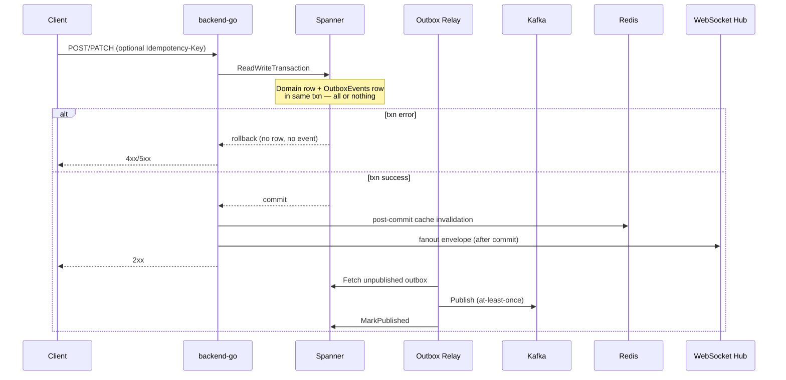
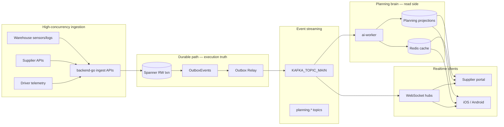

# PlanDigitalBrain — Enterprise Planning Layer (o9-inspired)

Last updated: 2026-07-01 (synced with PX91 enterprise implementation)

**Authority:** Subordinate to [`plan.md`](plan.md). Extends [`plan_90.md`](plan_90.md) with the full enterprise feature baseline, Kafka integration contract, edge-case gates, and UI labeling spec for the digital planning brain.

**Scope boundary:**
- **pegasusX** — single-supplier planning brain; all analytics scoped by `supplier_id`. **PX90 + PX91 shipped in code**; local SSMR green 2026-07-01; cloud staging proof **pending** (PX-ECS-5).
- **pegasus** (reference) — multi-tenant federation backend (P1 **shipped**); tenant supplier UI + downstream role parity **pending** (P2–P4). See [§ XI pegasus parity track](#xi-pegasus-multi-supplier-parity-track).

**Audience:** Backend engineers, ai-worker, supplier portal + native, warehouse insight surfaces. Driver row stays execution-only; planning **consumes** telemetry and order outcomes.

---

## Implementation snapshot (2026-07-01)

| Track | Theme | Overall | Notes |
|---|---|---|---|
| **PX90** | MEIO, control tower, demand brain, EKG, agents | **shipped** | Waves 1–3; see [`plan_90.md`](plan_90.md) |
| **PX91** | Ingest, gates, confidence UI, promo sandbox, shadow | **shipped** (code) | Migration `20260701_plan91_digital_brain.ddl`; SSMR markers **green locally** |
| **pegasus P1** | Federation admin APIs | **shipped** | `admin/planning_federation.go` + `/planning` page |
| **pegasus P2–P4** | Tenant supplier UI + platform rollup | **pending** | No admin-portal supplier planning parity yet |

**Apply before SSMR:** `schema/migrations/20260630_plan90_planning_brain.ddl` + `schema/migrations/20260701_plan91_digital_brain.ddl`.

**Infra verify:** `make test-ssmr-infra` — PX90/PX91 + full `PX_E2E_*` markers **green locally** (2026-07-01); staging proof pending `PX-ECS-5D`.

### Ecosystem sync closures (PX-ECS-3, 2026-07-01)

| Surface | Anchor | Status |
|---------|--------|--------|
| Promo P&L sandbox UI | PX-ECS-3A, 4D | **shipped** — supplier portal + Android/iOS `POST .../planning/promotions/simulate` |
| Planning outcomes panel (baseline → insights → touchless → MEIO) | PX-ECS-3B | **shipped** — supplier portal dashboard |
| Baseline vs actual demand chart + MAPE/variance | PX-ECS-3C | **shipped** — portal + native demand analytics |
| Replenishment traceability (`SourceInsightId` → factory transfer) | PX-ECS-3D | **shipped** — `GET .../replenishment/traceability` + ops panel |
| Signal ingest ops (lag, projection count, last ingest) | PX-ECS-3E | **shipped** — `GET .../planning/signals/status` + planning settings panel |
| Signal ingest → baseline projection | PX-ECS-1D | **shipped** — ingest with `product_id` + `warehouse_id` writes baseline + `DEMAND_BASELINE_UPDATED` |
| Dispatch fingerprint mismatch warning | PX-ECS-4F | **shipped** — supplier portal + native when supplier vs warehouse preview diverge |
| Supplier network pulse on native | PX-ECS-4C | **shipped** — Android `SupplierPulseStrip` + iOS `NetworkPulseStrip` |
| Handoff timeline (preorder → seal) | PX-ECS-4E | **shipped** — warehouse dispatch + factory loading-bay on portal + Android + iOS |

## I. How pegasusX handles rollbacks and failed transactions today

Before wiring the planning brain to Kafka, every slice must inherit the operational ecosystem's durability contract. pegasusX does **not** use distributed two-phase commit or saga orchestrators. Instead it uses **Spanner ACID + transactional outbox + idempotent consumers + client session reconcile**.

### 1. Server-side: atomic write or full rollback

All mutating domain paths follow one pattern:

**Key files:**
- `apps/backend-go/outbox/outbox.go` — transactional outbox; domain row + `OutboxEvents` in one RW txn
- `apps/backend-go/spannerutils/retry.go` — retries `Aborted` / `Unavailable` with bounded exponential backoff (max 5 attempts)
- `apps/backend-go/spannerutils/chunker.go` — large writes split into chunks; **partial commit is possible**; callers must be idempotent

When a logistics app drops mid-request:
- If the HTTP response never arrives → **no Spanner commit** → state unchanged on server
- If commit succeeded but response lost → client retries with same `Idempotency-Key` → cached 2xx replay, no duplicate side effects
- If commit failed → Spanner auto-rollback; idempotency key **released** on non-2xx so client can safely retry

### 2. HTTP idempotency guard

`apps/backend-go/idempotency/middleware.go`:
- Mutating requests with `Idempotency-Key` / `X-Idempotency-Key` are deduplicated by key + body hash
- **2xx responses** cached for 24h — replays return identical response
- **Non-2xx responses** release the key — safe to retry after connection drop
- **409** `idempotency_key_payload_mismatch` when same key, different body
- **409** `request_in_progress` when concurrent duplicate in flight

Planning brain ingestion APIs **must** require idempotency keys on all write paths.

### 3. Partial commit recovery (warehouse dispatch exemplar)

`docs/PARTIAL_DISPATCH_RECOVERY_SOP.md` documents the operational pattern when chunked writes succeed partially:
- HTTP **409** `dispatch_partial_commit` — earlier chunks committed, later chunk failed
- Idempotency key released — operator re-runs with scoped execute
- **Do not** cancel committed orders to "reset"
- Clients call `reconcileSession` before retrying

This is the canonical model for any planning-brain batch writer that uses `RunChunkedTransaction`.

### 4. Kafka consumer failure handling

`apps/backend-go/kafka/consumer.go` + `kafka/workerpool/workerpool.go`:
- Handler retries with jittered backoff (`MaxAttempts`)
- Exhausted retries → **DLQ** topic
- DLQ routing failure → **offset not committed** (`ErrSkipCommit`) — message reprocessed
- Cross-pod dedup: `kafka/redis_event_dedup.go` — Redis `SETNX` with 7d TTL

Planning brain consumers (ai-worker, notification dispatcher) must:
- Treat all handlers as **at-least-once** — dedupe by `event_id` or aggregate+sequence
- Never write Spanner directly from Kafka without idempotency guard
- Prefer **read-model projection** tables over mutating operational aggregates

### 5. Client-side: connection drop ≠ state corruption

Every role row implements **reconnect + reconcile**:

| Layer | Pattern | Authority |
|---|---|---|
| WebSocket | Exponential backoff reconnect; `onReconnect` callback | `DriverWebSocket.kt`, `WarehouseRealtimeClient.swift`, etc. |
| Session reconcile | Parallel refetch of server-authoritative snapshots **before** retrying queued mutations | `packages/api-client/session-reconcile.ts` |
| Pending sync | WorkManager / background flush for offline mutations | `PendingOrderSyncWorker.kt`, `pending-checkout.ts` |
| Stale/live labeling | UI shows `live` vs `stale` vs `reconnecting` connection state | All realtime clients |

`reconcileSession` endpoints per role (from `session-reconcile.ts`):
- **driver:** `/v1/fleet/orders`, `/v1/driver/manifest`
- **warehouse:** dispatch preview, dispatch locks, `/v1/warehouse/demand/forecast`, `/v1/warehouse/replenishment/insights`
- **factory:** manifests
- **payload:** manifests, trucks
- **supplier:** dispatch preview, manifests, `/v1/supplier/analytics/demand/today`, `/v1/supplier/meio/network-summary`, `/v1/supplier/planning/s-and-op`
- **retailer:** active fulfillment, pending payments, tracking

**Planning brain client rule:** After WS reconnect, refetch planning dashboards from read APIs — never assume last-rendered forecast is current.

### 6. Payment and ledger: append-only, no in-place rollback

`docs/PAYMENT_EXCEPTION_SOP.md`, `docs/INCIDENT_RESPONSE_RUNBOOK.md`:
- Ledger rows are **immutable** — corrections use reversing entries
- Webhook replays collapse via `idempotency.Guard`
- No distributed rollback across payment gateway + Spanner

Promotion P&L simulation (Phase 3) must use **sandbox tables** or read-only projections — never mutate live ledger for what-if.

### 7. Summary: integration contract for the planning brain

| Concern | pegasusX pattern | Planning brain MUST |
|---|---|---|
| State mutation | Spanner RW txn + outbox in same txn | Same — no direct Kafka→Spanner writes |
| Event delivery | At-least-once via outbox relay | Consume idempotently; project to planning tables |
| Client disconnect | Reconcile then retry | Dashboard refetch on reconnect |
| Partial failure | 409 + idempotency release + SOP | Chunked writers document partial state |
| Rollback | Spanner txn abort (automatic) | No compensating transactions; use append-only audit |
| Realtime | Post-commit WS fanout | Subscribe to planning envelopes; never block execution path |

---

## II. Enterprise feature baseline (o9-inspired)

Maps user requirements to pegasusX delivery status. See [`plan_90.md`](plan_90.md) for anchor-level detail.

| Module | Enterprise capability | pegasusX scope | Status |
|---|---|---|---|
| **IBP** | Unified financial + commercial + supply chain planning | Treasury (PX3-A2) + S&OP API only | **deferred** — full IBP is pegasus platform |
| **Demand Planning** | Multi-horizon AI forecasting, collaborative forecast | `DemandForecastBaseline` + ingest + predictive push | **shipped** — baseline + outbox; **partial** — full ML training (PX91-C1 deferred) |
| **Revenue Growth / Promotions** | Pre-event P&L, closed-loop eval, causal analysis | `planning/promo_eval.go` sandbox | **shipped** — simulate + closed-loop API; causal analysis **deferred** |
| **Commercial & Category** | CDT, cannibalization, halo | Not in pegasusX (supplier owns catalog) | **skipped** |
| **Control Tower** | Real-time visibility + supplier collaboration | Zone overrides + dispatch integration + WS fanout | **shipped** |
| **EKG** | Knowledge graph of supply chain entities | `GET /v1/supplier/knowledge-graph` | **shipped** — drivers, vehicles, retailers, active orders |

---

## III. Custom architecture & real-time data flow

### Event topology

### Kafka topic contract (planning brain)

**Execution path (existing):** `KAFKA_TOPIC_MAIN` — all transactional outbox events (`ORDER_STATUS_CHANGED`, `INVENTORY_SYNC_COMPLETE`, `planning.meio.recommendation.v1`, `DEMAND_BASELINE_UPDATED`, etc.)

**Planning ingestion (shipped PX91):**

| Topic | Producer | Consumer | Payload contract | Status |
|---|---|---|---|---|
| `planning.signal.ingest.v1` | backend-go ingest API | ai-worker | Normalized demand/inventory signals | **shipped** |
| `planning.forecast.request.v1` | supplier portal / API | ai-worker | Forecast run request (idempotent) | **deferred** — topic only |
| `planning.forecast.result.v1` | ai-worker | backend-go projector | Baseline write (idempotent by `forecast_run_id`) | **deferred** — topic only |

**Rules:**
1. Ingest APIs validate + publish to Kafka — **no Spanner write on hot ingest path** for analytics-only signals
2. Operational mutations still use outbox → `TopicMain` (never bypass)
3. Planning projections written via dedicated RW txn in `planning/` package with outbox for `DEMAND_BASELINE_UPDATED`
4. JSON schemas in `contracts/events.schema.json`; gate via `make gen-contracts-gate`

### Redis cache keys (planning)

| Key pattern | TTL | Content |
|---|---|---|
| `planning:seasonal:{supplier_id}:{template_id}` | 24h | Hard-coded seasonal templates |
| `planning:forecast:agg:{supplier_id}:{granularity}:{window}` | 15m | Regional/macro aggregates |
| `planning:promo:active:{supplier_id}` | 5m | Active promotion snapshot |
| `planning:scenario:{supplier_id}:{hash}` | 15m | Scenario sandbox result (existing) |
| `dedup:event:{event_id}` | 7d | Cross-pod Kafka dedup (existing) |

### Dynamic data granularity

API query params on all planning read endpoints:

| Granularity | Scope | Example endpoint |
|---|---|---|
| `macro` | Supplier-wide / country | `GET /v1/supplier/analytics/demand?granularity=macro` |
| `regional` | Warehouse zone / H3 region | `?granularity=regional&region_id=...` |
| `micro` | Per-retailer / per-store | `?granularity=micro&retailer_id=...` |

Backend serves pre-aggregated payloads from `DemandForecastBaseline` + Redis — never scans raw `Orders` on dashboard switch. **Status:** `granularity=macro|regional|micro` on `GET /v1/supplier/analytics/demand/today` **shipped** (`warehouse_id` / `region_id` for regional, `retailer_id` for micro).

### WebSocket envelopes (planning)

Existing (live):
- `DEMAND_BASELINE_UPDATED`
- `planning.meio.recommendation.v1`
- `REPLENISHMENT_AUTO_APPROVED`
- `DISPATCH_ZONE_OVERRIDE`

New (**shipped** PX91):
- `PLANNING_FORECAST_UPDATED` — range + confidence score
- `PLANNING_PROMO_SIMULATION_READY` — pre-event P&L result
- `PLANNING_CONFIDENCE_DOWNGRADED` — sparsity gate or seasonal fallback triggered

Fanout rooms: `supplier:{supplier_id}`, `warehouse:{home_node_id}` — via `notification_dispatcher.handlePlanningEvent`.

---

## IV. Edge cases, logic gates & front-end labeling

### PX91-A1: Data sparsity gate (zero/one order rule) — **shipped**

**Rule:** Block predictive analytics for any retailer with fewer than **2 completed orders**.

| Condition | Backend behavior | UI label |
|---|---|---|
| `completed_order_count < 2` | Return `403 forecast_insufficient_history` or `confidence: "blocked"` | **"Insufficient history"** badge; hide ML forecast |
| `completed_order_count == 2` | Allow baseline; cap confidence at 60% | **"Early signal"** badge |
| `completed_order_count >= 10` | Full model confidence | Standard confidence display |

**Implementation:**
- `planning/sparsity_gate.go` — `CanForecast(retailerID) (allowed bool, reason string)`
- Check in `DemandSignalProvider`, scenario sandbox, promo P&L
- SSMR: `PX_E2E_SPARSITY_GATE_OK`

### PX91-A2: Hard-coded seasonal fallbacks — **shipped**

**Rule:** Known seasonal surges use template curves, not ML extrapolation.

| Template ID | Window | Source |
|---|---|---|
| `holiday_peak` | Nov 15 – Jan 5 | Hard-coded multiplier curve |
| `summer_surge` | Jun 1 – Aug 31 | Regional default |
| `custom:{id}` | User-defined dates | Admin override (PX91-A4) |

When active template applies:
- ML model **disabled** for that window
- UI shows **"Seasonal template active"** chip
- Confidence floor: 75% (template-backed)

**Implementation:**
- `planning/seasonal_templates.go` + Redis cache
- `SeasonalTemplateOverrides` DDL (supplier_id, template_id, start_date, end_date)
- Warehouse + supplier dashboards read `baseline_source: "seasonal_template" | "ml" | "moving_average"`

### PX91-A3: Confidence labeling — **shipped**

**All forecast displays show ranges, not point estimates.** Server returns `confidence` on `GET /v1/supplier/analytics/demand/today`; warehouse replenishment insights enrich `demand_breakdown` from baseline when absent.

| Element | Format | Example |
|---|---|---|
| Demand range | `{low} – {high} units` | `4,000 – 4,500 units` |
| Confidence score | Percentage + color band | `85% confidence` (green ≥80, amber 60–79, red <60) |
| Source badge | `ML` / `Baseline` / `Seasonal` / `Blocked` | Pill next to range |
| Staleness | `Updated {relative_time}` | `Updated 12m ago` when WS stale |

**Portal components:** `ForecastConfidenceCard.tsx`
**Native:** `ForecastConfidenceView` on supplier, warehouse, factory iOS/Android
**Contracts:** `DemandForecastBaseline` extended in `packages/types` with `low_units`, `high_units`, `confidence_pct`, `baseline_source`, `blocked_reason`

### PX91-A4: Custom date range overrides — **shipped**

**Rule:** Admins define custom seasons that override global calendar.

- `POST /v1/supplier/planning/seasonal-overrides` — create custom window
- `GET /v1/supplier/planning/seasonal-overrides` — list active
- Isolated forecast model for that block (does not affect global baseline)
- UI: date picker on supplier portal Settings → Planning → Custom Seasons

---

## V. 90-day execution plan

Aligned with [`plan_90.md`](plan_90.md) waves. **PX90 + PX91 are shipped in code** (2026-07-01). Infra verify remains **pending**.

### Phase 1: Foundation & ingestion (Days 1–30) — **shipped**

| Task | Owner | Status | Notes |
|---|---|---|---|
| EKG schema (entities + edges) | `planning/service.go` | **shipped** | v2: drivers, vehicles, retailers, active orders |
| Kafka event contracts for planning | `contracts/events.schema.json` | **shipped** | MEIO, demand baseline, ingest, promo events |
| Ingest APIs → Kafka (no hot-path Spanner) | `planning/ingest.go` | **shipped** | `POST /v1/supplier/planning/signals/ingest` |
| ai-worker signal projector | `ai-worker/planningingest/` | **shipped** | → `PlanningSignalProjections` |
| Spanner planning tables DDL | `schema/migrations/` | **shipped** | `20260630_plan90` + `20260701_plan91` |
| Outbox + idempotency on planning mutations | `planning/` | **shipped** | `WriteBaselineWithOutbox`; scenario cache |

**SSMR:** `PX_E2E_PLANNING_INGEST_OK` — **wired** in `e2e_plan90.go`.

### Phase 2: Baseline math & user views (Days 31–60) — **shipped**

| Task | Owner | Status | Notes |
|---|---|---|---|
| Moving average / trend baseline | `predictivepush/`, ai-worker | **shipped** | Writes `DemandForecastBaseline` via outbox |
| Seasonal templates + custom date pickers | `planning/seasonal_templates.go` | **shipped** | `holiday_peak`, `summer_surge`, custom overrides |
| Sparsity gate | `planning/sparsity_gate.go` | **shipped** | ≥2 completed orders rule |
| Confidence labeling UI | supplier portal + native | **shipped** | API `confidence` on `demand/today`; clients prefer server fields |
| WebSocket + multi-tier dashboards | portal + native | **shipped** | MEIO, control tower, PlanningBrain |
| WS reconnect reconcile for planning | `session-reconcile.ts` | **shipped** | Supplier demand + S&OP + MEIO paths |

**SSMR:** `PX_E2E_SPARSITY_GATE_OK`, `PX_E2E_CONFIDENCE_LABEL_OK` — **wired**.

### Phase 3: AI training & advanced analytics (Days 61–90) — **partial**

| Task | Owner | Status | Notes |
|---|---|---|---|
| AI model training on historical pipeline | ai-worker | **deferred** | PX91-C1 — shadow mode only (`PLANNING_BRAIN_SHADOW`) |
| Pre-event P&L simulation (promotions) | `planning/promo_eval.go` | **shipped** | `POST .../planning/promotions/simulate` |
| Closed-loop performance evaluation | `planning/promo_eval.go` | **shipped** | `GET .../planning/promotions/{id}/performance` |
| Causal factor analysis | ai-worker | **deferred** | pegasus platform |
| Load testing + error handling | SSMR + `scripts/planning_ingest_load.sh` | **shipped** | Load script + DLQ replay in runbook |
| Shadow deployment (planning beside execution) | ai-worker | **shipped** | `PLANNING_BRAIN_SHADOW=true` env gate |

**SSMR:** `PX_E2E_PROMO_PL_SIM_OK`, `PX_E2E_CLOSED_LOOP_EVAL_OK` — **wired**.

---

## VI. PX91 anchors (planning brain extension)

| Anchor | Scope | Phase | Status |
|---|---|---|---|
| `PX91-A1` | Data sparsity gate (≥2 completed orders) | 2 | **shipped** |
| `PX91-A2` | Hard-coded seasonal fallbacks | 2 | **shipped** |
| `PX91-A3` | Confidence labeling (range + score UI) | 2 | **shipped** |
| `PX91-A4` | Custom date range seasonal overrides | 2 | **shipped** |
| `PX91-B1` | High-concurrency ingest API → Kafka | 1 | **shipped** |
| `PX91-B2` | ai-worker signal projector | 1 | **shipped** |
| `PX91-B3` | EKG v2 (drivers, retailers, orders) | 1 | **shipped** |
| `PX91-C1` | AI forecast model training pipeline | 3 | **deferred** — shadow mode only |
| `PX91-C2` | Pre-event promotion P&L simulation | 3 | **shipped** |
| `PX91-C3` | Closed-loop promo performance eval | 3 | **shipped** |
| `PX91-C4` | Planning session reconcile on reconnect | 2 | **shipped** |
| `PX91-C5` | Shadow-mode load test + deploy | 3 | **shipped** |

---

## VII. Ecosystem blast-radius checklist (every PX91 slice)

- [x] `schema/spanner.ddl` + migration DDL for new planning tables
- [x] Canonical owner package (`planning/`) + `supplierroutes/routes.go`
- [x] Outbox in same RW txn as row write (planning projections only)
- [x] Post-commit Redis invalidation (`planning:*` keys)
- [x] WS fanout via `notification_dispatcher`
- [x] `packages/types` + `packages/api-client` + idempotency keys
- [x] `contracts/events.schema.json` (manual PX91 envelopes; run `make gen-contracts-gate`)
- [x] Role-row UI — supplier portal + iOS + Android; warehouse/factory/retailer confidence reads
- [x] Focused `*_test.go` in touched packages (`sparsity_gate_test.go`, etc.)
- [x] SSMR markers in `e2e_plan90.go` + `contracts/ssmr_ecosystem_markers.json`
- [x] `docs/ROLE_ROW_PARITY_MATRIX.md` PX91 rows
- [x] **Never** mutate operational aggregates from Kafka consumer without idempotency
- [x] **Never** block execution path on planning compute

---

## VIII. Explicit deferrals

| Feature | Reason |
|---|---|
| Full IBP / financial scenario planning | pegasus platform; treasury sufficient for pegasusX |
| Consumer Decision Trees / cannibalization | Retail assortment — pegasus retail scope |
| Cross-supplier collaboration workspace | pegasus multi-tenant |
| Causal factor decomposition (full) | Phase 3+ / pegasus AI suite |
| Retailer-facing planning surfaces | Retail row = order/track only |
| Distributed saga / compensating transactions | pegasusX uses outbox + idempotency instead |

---

## IX. Success criteria (planning brain v1)

| # | Criterion | Target | Status |
|---|---|---|---|
| 1 | Kafka ingest handles 1000 concurrent signal updates without Spanner hot-path writes | Phase 1b | **shipped** — `scripts/planning_ingest_load.sh` |
| 2 | Retailer with <2 orders sees blocked forecast, not hallucinated demand | PX91-A1 | **shipped** |
| 3 | Holiday peak uses seasonal template, not ML extrapolation | PX91-A2 | **shipped** |
| 4 | All forecast UI shows range + confidence, never bare integer | PX91-A3 | **shipped** |
| 5 | Custom season override generates isolated forecast block | PX91-A4 | **shipped** |
| 6 | WS reconnect triggers planning dashboard reconcile | PX91-C4 | **shipped** |
| 7 | Pre-event promo P&L returns margin/volume projection without ledger mutation | PX91-C2 | **shipped** |
| 8 | Closed-loop eval compares actual vs predicted promo outcome | PX91-C3 | **shipped** |
| 9 | Planning brain runs shadow mode with zero execution regressions | PX91-C5 | **shipped** |
| 10 | All PX91 SSMR markers green under `make test-ssmr-infra` | Infra verify | **shipped** — local green 2026-07-01; cloud staging pending |

---

## X. Reference: durability patterns by failure mode

| Failure mode | What happens | Safe client action |
|---|---|---|
| HTTP timeout mid-mutation | Txn may or may not have committed | Retry with same `Idempotency-Key` |
| WS disconnect mid-dashboard | Server state unchanged; UI stale | Reconnect → `reconcileSession` → refetch |
| Kafka consumer crash mid-handler | Offset not committed; redelivery | Idempotent handler + Redis dedup |
| Spanner `Aborted` conflict | Auto-retry (≤5 attempts) | Transparent to client |
| Chunked write partial success | Earlier chunks committed | 409 + SOP; reconcile before retry |
| Duplicate webhook / event | Idempotency guard / SETNX dedup | No-op |
| Payment failure | Append-only ledger; no rollback | Reversing entry via treasury SOP |
| Planning ingest flood | Kafka buffers; ai-worker projects async | Dashboard shows `stale` until projection catches up |

---

## XI. pegasus multi-supplier parity track

pegasusX is **single-supplier execution + planning**. pegasus adds tenant isolation and federation without reshaping pegasusX Spanner tables.

| Phase | Scope | pegasusX | pegasus | Status |
|---|---|---|---|---|
| **P1** | Federation read APIs + admin control tower | Emits events pegasus subscribes to | `admin/planning_federation.go`, `GET /v1/admin/planning/*`, `/planning` page | **shipped** |
| **P2** | Tenant supplier planning UI | Supplier portal + native (full PX91) | `admin-portal/app/supplier/*` — MEIO, PlanningBrain, confidence, seasonal, EKG | **pending** |
| **P3** | Platform IBP + cross-supplier collaboration | N/A (deferred) | Executive scenario library, tenant rollup | **pending** |
| **P4** | Federated EKG + downstream role parity | Warehouse/factory/retailer confidence wired | Same surfaces per tenant in admin-portal | **pending** |

**P2 recommended next slice:** Port pegasusX supplier planning APIs (`/meio`, `/planning/*`, `/knowledge-graph`) to pegasus `supplierplanningroutes` + admin-portal supplier planning screens. Driver/payload rows remain execution-only.

**pegasus backend (P1 shipped):**
- `GET /v1/admin/planning/baseline` — federated baseline rollup
- `GET /v1/admin/planning/meio` — MEIO stub per tenant
- `GET /v1/admin/planning/knowledge-graph` — EKG federation
- `GET /v1/admin/planning/control-tower` — zone override rollup

---

## Related documents

- [`plan_90.md`](plan_90.md) — PX90 anchor status and shipped waves
- [`plan.md`](plan.md) — master execution plan (PX0–PX12)
- [`architecture.md`](architecture.md) — transactional outbox, WS relay, reliability matrix
- [`technology-inventory.md`](technology-inventory.md) — event catalog freeze, reliability acceptance
- [`docs/PARTIAL_DISPATCH_RECOVERY_SOP.md`](../docs/PARTIAL_DISPATCH_RECOVERY_SOP.md) — partial commit recovery
- [`docs/INCIDENT_RESPONSE_RUNBOOK.md`](../docs/INCIDENT_RESPONSE_RUNBOOK.md) — rollback and DLQ replay
- [`docs/ROLE_ROW_PARITY_MATRIX.md`](../docs/ROLE_ROW_PARITY_MATRIX.md) — client parity ledger
