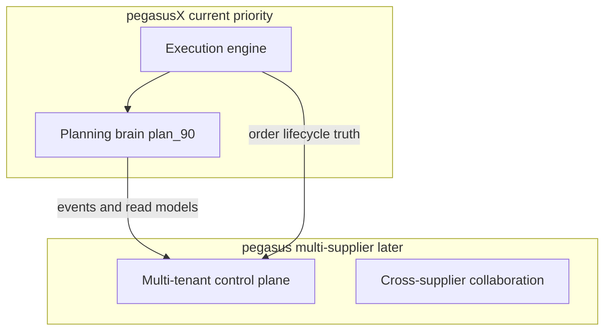

# pegasusX plan_90 — Planning Brain (o9-inspired, Pegasus-ready)

Last updated: 2026-06-30

**Authority:** Subordinate to [`plan.md`](plan.md). Does not replace execution-phase anchors (PX0–PX12). This track adds the **planning brain** on top of the existing execution muscle.

**Scope boundary:**
- **pegasusX** (this repo) — single-supplier priority; all features scoped by `supplier_id`.
- **pegasus** (reference, `../pegasus/`) — multi-supplier ecosystem; consumes pegasusX events/read models later. Do not port pegasus ~59-route multi-tenant admin into pegasusX ([`SUPPLIER_PHASE.md`](SUPPLIER_PHASE.md)).

## Program goal

Ship o9-class **planning and visibility** on pegasusX without slowing execution: MEIO, touchless replenishment, actionable control tower, one-number demand, scenario sandbox, EKG-lite, and governed agent hooks — each as a complete ecosystem slice (schema, backend, contracts, realtime, role-row UI, SSMR).

---

## Feature matrix (o9 audit → plan_90)

| Capability | pegasusX (90d) | pegasus (later) | Verdict |
|---|---|---|---|
| Actionable Control Tower | Upgrade PX1-A3 → map + zone override | Per-tenant command center | **P0** |
| MEIO | Network inventory optimization | Per-tenant MEIO | **P0** |
| AI demand sensing / predictive push | Extend ai-worker | Per-tenant + cross-tenant signals | **P0** |
| Touchless exception planning | Auto-approve stable SKUs | Tenant policy knobs | **P0** |
| One-number forecast | `DemandForecastBaseline` table | Reconciled tenant baseline | **P1** |
| Scenario sandbox | Read-only what-if API | Tenant admin scenarios | **P1** |
| Lightweight S&OP | Factory vs warehouse capacity | Optional rollup | **P1** |
| EKG-lite | Graph read API | Federated graph | **P1** |
| Supplier collaboration & risk | N/A | Cross-supplier | **Defer pegasus** |
| Live IBP | Treasury only (PX3-A2) | Full IBP | **Defer** |
| Merchandise / assortment | Skip | pegasus retail | **Skip** |
| ESG | Route-mileage hook note | Reporting module | **Defer** |
| Neuro-symbolic agents | Governed allowlist hooks | Full agent suite | **P2 pegasus; hooks P1** |

---

## Current baseline (extend, do not rebuild)

| Area | Anchor | Gap |
|---|---|---|
| Replenishment | `replenishment/engine.go`, `ReplenishmentInsights` | Per-warehouse; not network MEIO |
| Predictive push | `ai-worker/predictivepush/` | History-only; insights stay PENDING |
| Demand forecast | `warehouse/demand_products.go` | Divergent from supplier analytics |
| Control tower v1 | Supplier dashboard, fleet live map | No polygon reroute |
| Realtime | Kafka → WS | No `DISPATCH_ZONE_OVERRIDE` |

---

## PX90 anchors

### Wave 1 — Days 1–30: MEIO + touchless (P0)

| Anchor | Scope | Status |
|---|---|---|
| `PX90-A1` | `ReplenishmentPolicies` DDL + default seed | `implemented` |
| `PX90-A2` | `MEIOEngine` network scan (`replenishment/mei_engine.go`) | `implemented` |
| `PX90-A3` | Touchless auto-approve + `REPLENISHMENT_AUTO_APPROVED` outbox | `implemented` |
| `PX90-A4` | `GET /v1/supplier/meio/network-summary` | `implemented` |
| `PX90-A5` | Supplier portal MEIO panel on dashboard | `implemented` |
| `PX90-A6` | SSMR: `PX_E2E_MEIO_NETWORK_OK`, `PX_E2E_TOUCHLESS_REPLENISH_OK` | `implemented` |

### Wave 2 — Days 31–60: Actionable control tower (P0)

| Anchor | Scope | Status |
|---|---|---|
| `PX90-B1` | `ControlTowerZoneOverrides` DDL | `implemented` |
| `PX90-B2` | `POST/GET /v1/supplier/control-tower/zone-overrides` | `implemented` |
| `PX90-B3` | `DISPATCH_ZONE_OVERRIDE` event + WS fanout | `implemented` |
| `PX90-B4` | Dispatch preview respects active overrides | `implemented` |
| `PX90-B5` | Supplier portal control-tower command UI on fleet | `implemented` |
| `PX90-B6` | SSMR: `PX_E2E_CONTROL_TOWER_OVERRIDE_OK` | `implemented` |

### Wave 3 — Days 61–90: Demand brain + EKG (P1)

| Anchor | Scope | Status |
|---|---|---|
| `PX90-C1` | `DemandForecastBaseline` DDL + writer | `implemented` |
| `PX90-C2` | `DemandSignalProvider` stub in ai-worker | `implemented` |
| `PX90-C3` | One-number: warehouse forecast reads baseline | `implemented` |
| `PX90-C4` | `POST /v1/supplier/planning/scenarios/run` | `implemented` |
| `PX90-C5` | `GET /v1/supplier/planning/s-and-op` lightweight capacity | `implemented` |
| `PX90-C6` | `GET /v1/supplier/knowledge-graph` EKG-lite | `implemented` |
| `PX90-C7` | Governed agent allowlist (`planning/agents.go`) | `implemented` |
| `PX90-C8` | SSMR: `PX_E2E_DEMAND_BASELINE_OK`, `PX_E2E_SCENARIO_SANDBOX_OK`, `PX_E2E_KG_READ_OK` | `implemented` |

---

## Explicit deferrals (not in 90d)

| Feature | Reason |
|---|---|
| Full IBP / financial scenario planning | Distraction; treasury (PX3-A2) sufficient |
| External supplier risk management | Wrong model for single-supplier pegasusX |
| Merchandise / assortment planning | Supplier owns catalog |
| ESG module | Defer; route CO₂ hook noted for pegasus |
| pegasus multi-tenant admin parity | Out of scope per SUPPLIER_PHASE |
| Cross-tenant forecast sharing | pegasus platform feature |

---

## Ecosystem blast-radius checklist (every PX90 slice)

- [x] `schema/spanner.ddl` + `schema/migrations/20260630_plan90_planning_brain.ddl`
- [x] Canonical owner package + `*routes/routes.go`
- [x] Outbox in same RW txn as row write
- [x] Post-commit cache invalidation where applicable
- [x] WS fanout via `notification_dispatcher`
- [x] `packages/types` + `packages/api-client`
- [x] `contracts/events.schema.json` via `make gen-contracts-gate`
- [x] Role-row UI — supplier portal + iOS + Android; warehouse portal + iOS + Android (driver excluded)
- [x] Focused `*_test.go`
- [x] SSMR marker in `cmd/ssmr-smokecheck/e2e_check.go`
- [x] `docs/ROLE_ROW_PARITY_MATRIX.md` row update

---

## SSMR marker registry (PX90)

| Marker | Proves |
|---|---|
| `PX_E2E_MEIO_NETWORK_OK` | MEIO cycle returns network summary with ≥1 warehouse |
| `PX_E2E_TOUCHLESS_REPLENISH_OK` | Policy auto-approves STABLE/PREDICTIVE_PUSH insight |
| `PX_E2E_CONTROL_TOWER_OVERRIDE_OK` | Zone override created + listed + event path |
| `PX_E2E_DEMAND_BASELINE_OK` | Baseline rows written and readable |
| `PX_E2E_SCENARIO_SANDBOX_OK` | Scenario run returns SLA/stockout projection |
| `PX_E2E_KG_READ_OK` | Knowledge graph returns nodes + edges |

---

## pegasus handoff (multi-supplier ecosystem)

Events and read APIs pegasus should subscribe to (versioned, tenant-scoped):

| Surface | pegasusX emit/read | pegasus use |
|---|---|---|
| `planning.meio.recommendation.v1` | MEIO cycle completion payload | Aggregate per supplier tenant |
| `REPLENISHMENT_AUTO_APPROVED` | Touchless approval | Planner audit trail |
| `DISPATCH_ZONE_OVERRIDE` | Control tower action | Cross-tenant ops visibility |
| `GET /v1/supplier/knowledge-graph` | EKG-lite | Federate graphs at platform layer |
| `DemandForecastBaseline` rows | One-number forecast | Tenant planning workspace |
| `POST /v1/supplier/planning/scenarios/run` | What-if sandbox | Executive scenario library |

pegasusX remains **execution + single-supplier planning**. pegasus adds tenant isolation, cross-supplier collaboration, and IBP — without reshaping pegasusX Spanner tables.

---

## Success criteria (day 90)

1. MEIO recommends network transfers; touchless runs on stable SKUs; humans only on exceptions.
2. Supplier draws a map zone and publishes dispatch override via WS within seconds.
3. One demand baseline powers warehouse forecast + supplier analytics.
4. Scenario sandbox answers factory-down / demand-spike without mutating production.
5. EKG-lite documents the supplier network for pegasus federation.
6. All PX90 SSMR markers green under `make test-ssmr-infra`.
