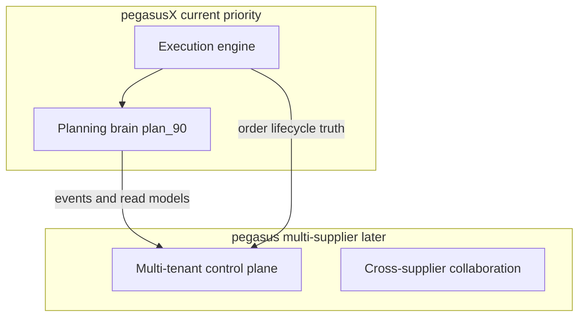

# pegasusX plan_90 — Planning Brain (o9-inspired, Pegasus-ready)

Last updated: 2026-07-01

**Authority:** Subordinate to [`plan.md`](plan.md). Does not replace execution-phase anchors (PX0–PX12). This track adds the **planning brain** on top of the existing execution muscle.

**Scope boundary:**
- **pegasusX** (this repo) — single-supplier priority; all features scoped by `supplier_id` (supplier-owner / CEO planning — **not** retailer-facing).
- **pegasus** (reference, `../pegasus/`) — multi-supplier ecosystem; consumes pegasusX events/read models later. Do not port pegasus multi-tenant admin into pegasusX ([`SUPPLIER_PHASE.md`](SUPPLIER_PHASE.md)).

**Audience:** Supplier portal + supplier native (iOS/Android). Warehouse portal + native get **read/action** surfaces for replenishment insights. Driver row stays execution-only; planning **consumes** driver telemetry and order outcomes.

---

## Implementation snapshot (2026-07-01)

| Wave | Theme | Overall | Notes |
|---|---|---|---|
| **Wave 1** | MEIO + touchless | **shipped** | Touchless opens factory transfer + events; WARNING path in replenishment cycle |
| **Wave 2** | Actionable control tower | **shipped** | Zone override API + dispatch integration + portal command UI; native **read-only** override status on fleet |
| **Wave 3** | Demand brain + EKG | **shipped** | EKG v2 graph, governed agent executor, scenario + S&OP portal panel on analytics |

**SSMR migration:** `schema/migrations/20260630_plan90_planning_brain.ddl` is applied automatically by `backend-setup` in `make test-ssmr-infra`. Full marker green run is **pending** until unrelated e2e blocker (`MaxRedemptions` catalog query) is fixed.

**Not in scope (unchanged):** Retail planning UI, full IBP, cross-supplier collaboration, merchandise planning.

---

## Program goal

Ship o9-class **planning and visibility** on pegasusX without slowing execution: MEIO, touchless replenishment, actionable control tower, one-number demand, scenario sandbox, EKG-lite, and governed agent hooks — each as a complete ecosystem slice (schema, backend, contracts, realtime, role-row UI, SSMR).

---

## Feature matrix (o9 audit → plan_90)

| Capability | pegasusX (90d) | pegasus (later) | Verdict | Status |
|---|---|---|---|---|
| Actionable Control Tower | Upgrade PX1-A3 → map + zone override | Per-tenant command center | **P0** | **shipped** — portal + native publish (map viewport polygon) |
| MEIO | Network inventory optimization | Per-tenant MEIO | **P0** | **shipped** |
| AI demand sensing / predictive push | Extend ai-worker | Per-tenant + cross-tenant signals | **P0** | **shipped** — order history + baseline + seasonality/weather/POS stub drivers |
| Touchless exception planning | Auto-approve stable SKUs | Tenant policy knobs | **P0** | **shipped** — policy gate + auto-approve + factory transfer + outbox |
| One-number forecast | `DemandForecastBaseline` table | Reconciled tenant baseline | **P1** | **shipped** — warehouse forecast + supplier analytics |
| Scenario sandbox | Read-only what-if API | Tenant admin scenarios | **P1** | **shipped** — API + `PlanningBrainPanel` on supplier analytics |
| Lightweight S&OP | Factory vs warehouse capacity | Optional rollup | **P1** | **shipped** — API + portal panel |
| EKG-lite | Graph read API | Federated graph | **P1** | **shipped** — factories, warehouses, SKUs, drivers, vehicles, retailers, active orders |
| Neuro-symbolic agents | Governed allowlist hooks | Full agent suite | **P2 pegasus; hooks P1** | **shipped** — `planning/executor.go` runs approve_insight, open_supply_request, broadcast_template |
| Supplier collaboration & risk | N/A | Cross-supplier | **Defer pegasus** | deferred |
| Live IBP | Treasury only (PX3-A2) | Full IBP | **Defer** | deferred |
| Merchandise / assortment | Skip | pegasus retail | **Skip** | skipped |
| ESG | Route-mileage hook note | Reporting module | **Defer** | deferred |

---

## Baseline → current state (gaps closed)

| Area | Was (gap) | Now |
|---|---|---|
| Replenishment / MEIO | Per-warehouse only | `replenishment/mei_engine.go` network pass + policies |
| Predictive push | Insights stay PENDING | Insights + `DemandForecastBaseline` write from allocator |
| Demand forecast | Divergent warehouse vs supplier | Shared `DemandForecastBaseline`; supplier `baseline_source` |
| Control tower v1 | Charts only | Zone overrides + dispatch filter + WS `DISPATCH_ZONE_OVERRIDE` |
| Realtime | No planning envelopes | `REPLENISHMENT_AUTO_APPROVED`, `DISPATCH_ZONE_OVERRIDE`, `planning.meio.recommendation.v1`, `DEMAND_BASELINE_UPDATED` |
| Warehouse insights | No “why” | `demand_breakdown` on replenishment API + portal + native |
| Contracts | Missing PX90 types | `packages/types`, `packages/api-client`, `events.schema.json` |
| Role rows | Supplier portal only | Supplier + warehouse: portal, iOS, Android (driver excluded) |

---

## PX90 anchors

### Wave 1 — Days 1–30: MEIO + touchless (P0) — **shipped**

| Anchor | Scope | Status |
|---|---|---|
| `PX90-A1` | `ReplenishmentPolicies` DDL + default seed | **implemented** — `schema/migrations/20260630_plan90_planning_brain.ddl`, `replenishment/policies.go` |
| `PX90-A2` | `MEIOEngine` network scan (`replenishment/mei_engine.go`) | **implemented** — runs after per-warehouse cycle |
| `PX90-A3` | Touchless auto-approve + `REPLENISHMENT_AUTO_APPROVED` outbox | **shipped** — `replenishment/touchless.go` opens `FactoryInternalTransfers` + `WAREHOUSE_TRANSFER_CREATED` |
| `PX90-A4` | `GET /v1/supplier/meio/network-summary` | **implemented** |
| `PX90-A5` | Supplier MEIO on dashboard (portal + iOS + Android); warehouse insight **why** | **implemented** |
| `PX90-A6` | SSMR: `PX_E2E_MEIO_NETWORK_OK`, `PX_E2E_TOUCHLESS_REPLENISH_OK` | **wired** — `e2e_plan90.go`; **pending** full `make test-ssmr-infra` green (blocked by unrelated catalog e2e) |

### Wave 2 — Days 31–60: Actionable control tower (P0) — **shipped**

| Anchor | Scope | Status |
|---|---|---|
| `PX90-B1` | `ControlTowerZoneOverrides` DDL | **implemented** |
| `PX90-B2` | `POST/GET /v1/supplier/control-tower/zone-overrides` | **implemented** |
| `PX90-B3` | `DISPATCH_ZONE_OVERRIDE` event + WS fanout | **implemented** — supplier, warehouse, driver rooms |
| `PX90-B4` | Dispatch preview/execute respects active overrides | **implemented** — `dispatch/zone_override.go`, warehouse dispatch paths |
| `PX90-B5` | Control-tower UI | **shipped** — portal `ControlTowerCommandPanel`; iOS/Android publish from fleet live map |
| `PX90-B6` | SSMR: `PX_E2E_CONTROL_TOWER_OVERRIDE_OK` | **wired**; **pending** infra verify |

### Wave 3 — Days 61–90: Demand brain + EKG (P1) — **shipped**

| Anchor | Scope | Status |
|---|---|---|
| `PX90-C1` | `DemandForecastBaseline` DDL + writer | **implemented** — predictive push allocator + warehouse insight seed path |
| `PX90-C2` | `DemandSignalProvider` stub in ai-worker | **implemented** — `predictivepush/signals.go` (order history + seasonality stub) |
| `PX90-C3` | One-number: warehouse + supplier analytics read baseline | **implemented** — `warehouse/demand_products.go`, `supplier/analytics_baseline.go` |
| `PX90-C4` | `POST /v1/supplier/planning/scenarios/run` | **shipped** — API + portal + iOS/Android analytics; uses driver delivery history in signals |
| `PX90-C5` | `GET /v1/supplier/planning/s-and-op` | **shipped** — API + portal + iOS/Android analytics |
| `PX90-C6` | `GET /v1/supplier/knowledge-graph` EKG-lite | **shipped** — topology, SKUs, drivers, vehicles, retailers, active orders |
| `PX90-C7` | Governed agent allowlist (`planning/agents.go`) | **shipped** — `planning/executor.go` synchronous allowlisted mutations |
| `PX90-C8` | SSMR: `PX_E2E_DEMAND_BASELINE_OK`, `PX_E2E_SCENARIO_SANDBOX_OK`, `PX_E2E_KG_READ_OK` | **wired**; **pending** infra verify |

---

## Explicit deferrals (not in 90d)

| Feature | Reason |
|---|---|
| Full IBP / financial scenario planning | Distraction; treasury (PX3-A2) sufficient |
| External supplier risk management | Wrong model for single-supplier pegasusX |
| Merchandise / assortment planning | Supplier owns catalog |
| ESG module | Defer; route CO₂ hook noted for pegasus |
| pegasus multi-tenant admin parity | Out of scope per SUPPLIER_PHASE |
| Cross-tenant forecast sharing | pegasus platform feature |
| Retailer-facing planning surfaces | Retail row = order/track only; planning consumes demand signals |

---

## Ecosystem blast-radius checklist (every PX90 slice)

- [x] `schema/spanner.ddl` + `schema/migrations/20260630_plan90_planning_brain.ddl`
- [x] Canonical owner package + `*routes/routes.go` (`replenishment/`, `planning/`, `supplier/plan90_handlers.go`)
- [x] Outbox in same RW txn as row write
- [x] WS fanout via `notification_dispatcher` (`handlePlanningEvent`)
- [x] `packages/types` + `packages/api-client` + idempotency keys
- [x] `contracts/events.schema.json` via `make gen-contracts-gate`
- [x] Role-row UI — supplier portal + iOS + Android; warehouse portal + iOS + Android (driver excluded)
- [x] Focused `*_test.go` (replenishment, planning, dispatch zone, agents)
- [x] SSMR markers in `cmd/ssmr-smokecheck/e2e_plan90.go` + `contracts/ssmr_ecosystem_markers.json`
- [x] `docs/ROLE_ROW_PARITY_MATRIX.md` PX90 rows

---

## SSMR marker registry (PX90)

| Marker | Proves | Code | Infra verify |
|---|---|---|---|
| `PX_E2E_MEIO_NETWORK_OK` | MEIO network summary API | **wired** | **pending** |
| `PX_E2E_TOUCHLESS_REPLENISH_OK` | Replenishment policies readable | **wired** | **pending** |
| `PX_E2E_CONTROL_TOWER_OVERRIDE_OK` | Zone override create + list | **wired** | **pending** |
| `PX_E2E_DEMAND_BASELINE_OK` | Supplier demand today (baseline path) | **wired** | **pending** |
| `PX_E2E_SCENARIO_SANDBOX_OK` | Scenario run returns projection | **wired** | **pending** |
| `PX_E2E_KG_READ_OK` | Knowledge graph returns nodes + edges | **wired** | **pending** |

Migration applies in SSMR `backend-setup`. Full green blocked (2026-07-01) by unrelated retailer catalog e2e (`MaxRedemptions` column missing in emulator schema).

---

## pegasus handoff (multi-supplier ecosystem)

Events and read APIs pegasus should subscribe to (versioned, tenant-scoped):

| Surface | pegasusX emit/read | pegasus use | Status |
|---|---|---|---|
| `planning.meio.recommendation.v1` | MEIO cycle completion payload | Aggregate per supplier tenant | **live** |
| `REPLENISHMENT_AUTO_APPROVED` | Touchless approval | Planner audit trail | **live** |
| `DISPATCH_ZONE_OVERRIDE` | Control tower action | Cross-tenant ops visibility | **live** |
| `GET /v1/supplier/knowledge-graph` | EKG-lite | Federate graphs at platform layer | **live** (v1 subset) |
| `DemandForecastBaseline` rows | One-number forecast | Tenant planning workspace | **live** |
| `POST /v1/supplier/planning/scenarios/run` | What-if sandbox | Executive scenario library | **live** |

pegasusX remains **execution + single-supplier planning**. pegasus adds tenant isolation, cross-supplier collaboration, and IBP — without reshaping pegasusX Spanner tables.

---

## Success criteria (day 90)

| # | Criterion | Status |
|---|---|---|
| 1 | MEIO recommends network transfers; touchless on stable SKUs; humans on exceptions | **shipped** — CRITICAL auto-transfer; WARNING touchless path; humans on dismiss |
| 2 | Supplier draws zone and publishes dispatch override via WS within seconds | **shipped** (portal + native fleet publish) |
| 3 | One demand baseline powers warehouse forecast + supplier analytics | **shipped** |
| 4 | Scenario sandbox answers factory-down / demand-spike without production mutation | **shipped** |
| 5 | EKG-lite documents supplier network for pegasus federation | **shipped** |
| 6 | All PX90 SSMR markers green under `make test-ssmr-infra` | **pending** — markers wired; migration auto-applies; full run blocked by unrelated e2e failure |

---

## Remaining work (post-v1, optional)

| Item | Owner | Priority |
|---|---|---|
| Fix `MaxRedemptions` schema drift so `make test-ssmr-infra` reaches plan90 markers | promotions / schema | P0 ops |
| Replace weather/POS stubs with live pegasus ingest feeds | ai-worker/predictivepush | P3 |
| Native map polygon draw UX polish (corner taps vs viewport bbox) | supplier iOS/Android | P3 |
