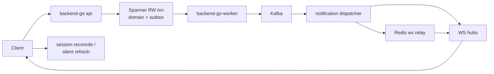

# pegasusX — Ecosystem Data Flow & Realtime Sync Plan

Last updated: 2026-07-01

**Authority:** Subordinate to [`plan.md`](plan.md). Implements the 2026-07-01 cross-ecosystem audit (backend, all role rows, planning brain, infra).

**North star:** Every mutation that one role depends on must reach every other dependent role **within SLO** — via Spanner truth, outbox → Kafka → WS, cache invalidation, and client silent refresh. Planning (o9-style math v1) and execution (orders/dispatch/manifests/payments) must tell one coherent story on a single-supplier deployment.

**Scope (locked):**
- Single-supplier `pegasusX` only; pegasus multi-tenant P2–P4 out of scope
- Math-only forecast in hot path; ML collect-later unchanged
- Retailer row stays thin (preorder suggestions, not full planning brain)

**Related:**
- [`ROLE_ROW_PARITY_MATRIX.md`](../docs/ROLE_ROW_PARITY_MATRIX.md) — screen-level parity
- [`PlanDigitalBrain.md`](PlanDigitalBrain.md) — planning brain contracts
- [`plan_production_scale.md`](plan_production_scale.md) — cloud cutover (PX-PROD-*)
- [`PHASE_0_CLOUD_FOUNDATION_RUNBOOK.md`](../docs/PHASE_0_CLOUD_FOUNDATION_RUNBOOK.md) — staging wire

---

## Realtime spine (canonical)



**Hard dependencies for cross-role sync:**
1. `backend-go` (api) **and** `backend-go-worker` (worker) both running
2. Managed Kafka + Memorystore Redis with `REQUIRE_INFRA_ADAPTERS=true`
3. Clients use `packages/ws-refresh-contract` + role session reconcile on reconnect

**SSMR status:** `make test-ssmr-infra` green locally (PX90/PX91 + full `PX_E2E_*` markers). Cloud staging proof **pending** (PX-PROD-0).

---

## Program phases

### Phase 1 — Backend data-flow correctness (P0)

**Goal:** Spanner writes, cache, and side effects stay aligned; no silent stale lists or inflated reservations.

| Anchor | Work | Exit |
|--------|------|------|
| `PX-ECS-1A` | Cache invalidation on supplier vet approve/reject (`supplier:orders`, `retailer:orders`) | Unit test + SSMR vet flow |
| `PX-ECS-1B` | Inventory release inside cancel/reject RW txn (warehouse + retailer cancel; align with supplier vet reject) | `PX_E2E_INVENTORY_RELEASE_*` still green; no post-commit-only release |
| `PX-ECS-1C` | Call `ForecastAggInvalidationPrefixes` after every `WriteBaselineWithOutbox` | Demand agg cache fresh within 1 relay tick |
| `PX-ECS-1D` | Signal ingest projector → baseline write or documented batch projector + `DEMAND_BASELINE_UPDATED` | Ingest changes forecast on supplier/warehouse surfaces |
| `PX-ECS-1E` | Predictive push / allocator emits replenishment WS when creating `ReplenishmentInsights` | Warehouse replenishment silent refresh without poll |
| `PX-ECS-1F` | Expand order Kafka consumer beyond `PAYMENT_CLEARED` (failures, chargeback hooks) | Idempotent handlers + tests |
| `PX-ECS-1G` | Outbox backlog metric `void_outbox_unpublished_count` + alert | Stuck events visible in monitoring |

**Anchor:** `PX-ECS-1` — backend mutation paths invalidate cache and complete side effects in txn or compensating saga.

---

### Phase 2 — Client realtime parity (P0)

**Goal:** All role-row clients refresh state silently on WS; no full-screen reload anti-patterns.

| Anchor | Role | Work | Exit |
|--------|------|------|------|
| `PX-ECS-2A` | Retailer | Android silent WS refresh + `SESSION_RECONCILE_ENDPOINTS.retailer` on reconnect | Matches iOS/desktop `load(silent:)` |
| `PX-ECS-2B` | Driver | Adopt `RealtimeRefreshEffect` / `silentRealtimeRefresh`; remove negotiation stubs (410) | Shared contract across screens |
| `PX-ECS-2C` | Factory | Expand session reconcile: replenishment insights + analytics overview | Insights refresh after supplier trigger |
| `PX-ECS-2D` | Payload | Uniform `load(silent:)` on mobile manifest lists | Parity with terminal WS+reconcile |
| `PX-ECS-2E` | Supplier | Unify `ForecastConfidence` via `packages/types` mapper on all native surfaces | Same labels as portal for same API payload |
| `PX-ECS-2F` | Retailer | Desktop dashboard sparsity-blocked badge (parity with `/insights`) | `isPredictionBlocked` visible on dashboard |

**Anchor:** `PX-ECS-2` — no role-row client uses full reload as default WS handler.

---

### Phase 3 — Planning ↔ execution coherence (P1)

**Goal:** o9-style math planning visibly drives warehouse/factory execution; docs match code.

| Anchor | Work | Exit |
|--------|------|------|
| `PX-ECS-3A` | Supplier portal: Promo P&L sandbox UI (`POST /planning/promotions/simulate`) | Matrix row no longer API-only |
| `PX-ECS-3B` | Supplier: Planning outcomes panel (baseline → insights → touchless transfers → MEIO) | One dashboard connects brain to muscle |
| `PX-ECS-3C` | Supplier: Baseline vs actual chart on demand history | Honest math-only v1 narrative |
| `PX-ECS-3D` | Traceability: replenishment insight ID → factory transfer ID on supplier ops | Touchless closed loop visible |
| `PX-ECS-3E` | Signal ingest ops panel (lag, projection count, last ingest) | PX-PROD-3 collect story without ML inference |
| `PX-ECS-3F` | Retailer copy: rename “Planning” → “Reorder suggestions” (native + desktop) | No o9 confusion on retailer row |
| `PX-ECS-3G` | Update `ROLE_ROW_PARITY_MATRIX` + `PlanDigitalBrain.md` for ingest/promo truth | Doc/code alignment |

**Deferred (do not block):** retailer full planning brain, IBP, causal, ML inference (`PX-PROD-ML-*`).

**Anchor:** `PX-ECS-3` — planning outputs are visible and traceable into transfers and dispatch.

---

### Phase 4 — Execution UX & visualization gaps (P1)

**Goal:** Floor and ops staff see the same horizons on every client in the role row.

| Anchor | Role | Work | Exit |
|--------|------|------|------|
| `PX-ECS-4A` | Warehouse | Tomorrow board in portal nav + native screen (`GET /v1/warehouse/ops/board`) | API no longer orphan |
| `PX-ECS-4B` | Warehouse | `ForecastConfidenceView` on replenishment portal table | Parity with demand-forecast page |
| `PX-ECS-4C` | Supplier | Network Pulse on Android/iOS | Parity with portal `NetworkPulsePanel` |
| `PX-ECS-4D` | Supplier | Promo P&L on native (after 3A portal) | Role-row promo parity |
| `PX-ECS-4E` | Cross-role | Handoff timeline extension (preorder → accept → dispatch → seal) | Optional pulse strip on warehouse/factory |
| `PX-ECS-4F` | Cross-role | Dispatch fingerprint mismatch warning when supplier vs warehouse preview differ | Prevents divergent commits |

**Anchor:** `PX-ECS-4` — execution horizon and confidence UI consistent per role row.

---

### Phase 5 — Infra & staging proof (P0 for cloud)

**Goal:** Local SSMR green implies staging green; realtime works under api+worker split.

| Anchor | Work | Exit |
|--------|------|------|
| `PX-ECS-5A` | Attach `pegasusx-ws-backendconfig` (3600s) to ingress WS path | WS idle timeout fixed |
| `PX-ECS-5B` | Align `OPTIMIZER_BASE_URL` to `optimizer-core` in staging ConfigMap | VRP same as local SSMR |
| `PX-ECS-5C` | Ensure ai-worker in pilot/prod overlay (document mandatory overlay) | Import/planning consumers live |
| `PX-ECS-5D` | Full SSMR e2e against staging `PUBLIC_BASE_URL` (not just `cloud-smoke-ssmr`) | `PX_E2E_CROSS_ROLE_WS_OK` on cloud |
| `PX-ECS-5E` | Staging: 2+ API replicas + fire drill Drill A (worker scale-to-zero) | Multi-pod WS relay proven |
| `PX-ECS-5F` | Worker HPA or lag-based scale guidance | Consumer lag auto-heals |
| `PX-ECS-5G` | Kafka lag + outbox metrics in worker scrape config | Observability per `OBSERVABILITY_FIRE_DRILL_RUNBOOK.md` |

**Anchor:** `PX-ECS-5` — staging reproduces SSMR realtime markers under production-shaped deploy.

---

## Cross-role desync risk registry

| ID | Risk | Roles | Mitigation anchor |
|----|------|-------|-------------------|
| `DESYNC-01` | Worker down → no WS | All | PX-ECS-5E, PX-PROD-4 drill |
| `DESYNC-02` | Retailer Android full reload | Retailer ↔ warehouse | PX-ECS-2A |
| `DESYNC-03` | Supplier vet no cache invalidation | Supplier ↔ retailer | PX-ECS-1A |
| `DESYNC-04` | Post-commit inventory release fail | Retailer checkout | PX-ECS-1B |
| `DESYNC-05` | Signal ingest no baseline | Supplier ↔ warehouse | PX-ECS-1D |
| `DESYNC-06` | Factory reconcile thin | Supplier ↔ factory | PX-ECS-2C |
| `DESYNC-07` | Staging topology ≠ SSMR | All (cloud) | PX-ECS-5D |
| `DESYNC-08` | WS ingress 120s timeout | All portals | PX-ECS-5A |
| `DESYNC-09` | Dispatch fingerprint mismatch | Supplier ↔ warehouse | PX-ECS-4F |
| `DESYNC-10` | Confidence client-derived drift | Supplier row | PX-ECS-2E |

---

## Role-row work packages

### Supplier
- **P0:** PX-ECS-1A, 2E
- **P1:** PX-ECS-3A–3D, 4C, 4D
- **Verify:** `GET /v1/supplier/analytics/demand/today` confidence matches portal + native after WS `DEMAND_BASELINE_UPDATED`

### Retailer
- **P0:** PX-ECS-2A, 2F
- **P1:** PX-ECS-3F
- **Verify:** Pre-order propose → Android accepts without UI interrupt; checkout caps match warehouse reject

### Warehouse
- **P0:** (benefits from 1B, 1E)
- **P1:** PX-ECS-4A, 4B
- **Verify:** Tomorrow board + replenishment confidence on all three clients

### Factory
- **P0:** PX-ECS-2C
- **P1:** PX-ECS-3D traceability
- **Verify:** Supplier replenishment trigger → factory insights refresh on reconnect

### Driver
- **P0:** PX-ECS-2B
- **Verify:** Manifest assignment WS → silent map refresh

### Payload
- **P1:** PX-ECS-2D
- **Verify:** Terminal remains reference; mobile matches silent refresh

---

## Doc ↔ code corrections (same PR as fix)

| Doc location | Current claim | Corrected truth |
|--------------|---------------|-----------------|
| `ROLE_ROW_PARITY_MATRIX` signal ingest | Wired → affects forecast | Wired → baseline when payload includes `product_id` + `warehouse_id` |
| `ROLE_ROW_PARITY_MATRIX` promo P&L | Wired | API + supplier portal sandbox UI (PX-ECS-3A) |
| `PlanDigitalBrain.md` SSMR | Pending | Local green 2026-07-01; staging pending |
| `plan_90.md` “AI demand sensing” | Shipped | Math heuristic (predictive push); ML deferred |

---

## Verification loops

```bash
# Loop A — data flow (every PR touching mutations)
cd pegasusX && make test-ssmr-infra

# Loop B — role-row contracts
bash scripts/parity/role_row_contract_check.sh

# Loop C — ecosystem markers
make ssmr-ecosystem-marker-gate LOG=path/to/ssmr-e2e.log

# Loop D — staging (after PX-PROD-0)
PUBLIC_BASE_URL=https://api.staging.example.com go run ./apps/backend-go/cmd/ssmr-smokecheck e2e

# Loop E — launch bundle
make validate-launch-readiness
```

**Definition of done (program):**
1. All `PX-ECS-1*` and `PX-ECS-2*` anchors **shipped**
2. `PX-ECS-5D` green on staging
3. Desync registry items `DESYNC-01`–`DESYNC-06` mitigated or documented
4. Matrix + PlanDigitalBrain updated for ingest/promo/SSMR truth

---

## Anchor registry

| Anchor | Phase | Scope | Status |
|--------|-------|-------|--------|
| `PX-ECS-1` | 1 | Backend data-flow correctness | **in progress** |
| `PX-ECS-1A` | 1 | Supplier vet cache invalidation | **shipped** |
| `PX-ECS-1B` | 1 | In-txn inventory release | **shipped** |
| `PX-ECS-1C` | 1 | Forecast agg cache invalidation | **shipped** |
| `PX-ECS-1D` | 1 | Ingest → baseline projection | **shipped** |
| `PX-ECS-1E` | 1 | Replenishment WS on predictive push | **shipped** |
| `PX-ECS-1F` | 1 | Order consumer expansion | **pending** |
| `PX-ECS-1G` | 1 | Outbox metrics | **pending** |
| `PX-ECS-2` | 2 | Client realtime parity | **in progress** |
| `PX-ECS-2A` | 2 | Retailer Android silent refresh | **shipped** |
| `PX-ECS-2B` | 2 | Driver silent refresh + stub cleanup | **partial** — manifest silent refresh already wired |
| `PX-ECS-2C` | 2 | Factory session reconcile expand | **shipped** |
| `PX-ECS-2D` | 2 | Payload mobile silent refresh | **pending** |
| `PX-ECS-2E` | 2 | Supplier confidence mapper unify | **pending** |
| `PX-ECS-2F` | 2 | Retailer desktop sparsity badge | **pending** |
| `PX-ECS-3` | 3 | Planning ↔ execution coherence | **in progress** |
| `PX-ECS-3A`–`3G` | 3 | Planning UI + docs (see phase table) | **partial** — 3A portal shipped |
| `PX-ECS-4` | 4 | Execution UX gaps | **in progress** |
| `PX-ECS-4A`–`4F` | 4 | Visualization (see phase table) | **partial** — 4A portal + native shipped |
| `PX-ECS-5` | 5 | Infra staging proof | **pending** |
| `PX-ECS-5A`–`5G` | 5 | Cloud realtime parity (see phase table) | **pending** |

---

## Suggested execution order

1. **Week 1 (P0):** `PX-ECS-1A`, `1B`, `1C`, `2A`, `2B` — highest desync impact, no cloud required
2. **Week 2 (P1 backend):** `PX-ECS-1D`, `1E`, `1G`, `2C`, `2E`
3. **Week 3 (P1 UI):** `PX-ECS-3A`, `4A`, `4B`, `3B`
4. **Week 4 (cloud):** `PX-PROD-0` + `PX-ECS-5*` after billing live

---

## Non-goals (explicit)

- pegasus multi-supplier admin UI (P2–P4)
- Full retailer planning brain / IBP / causal decomposition
- ML inference in production hot path (`PX-PROD-ML-*`)
- Re-enabling negotiation (ecosystem 410)
