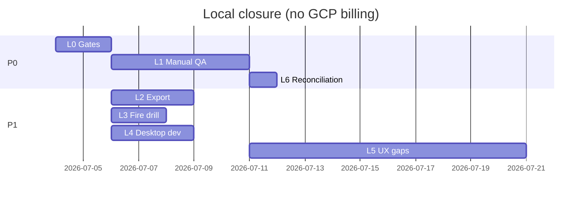

# pegasusX — Local Closure Plan (No GCP Billing)

Last updated: 2026-07-03

**Authority:** Subordinate to [`plan.md`](plan.md). Closes every **pegasusX** anchor that can be finished on a developer machine using Docker SSMR, local builds, and optional free-tier/sandbox credentials — **without** Terraform apply, GKE, Memorystore, managed Spanner, GSM, or any step that requires an active Google Cloud billing account.

**Explicitly deferred (requires GCP billing or prod ops):**
- `PX-PROD-0`, `PX-ECS-5`, `PX-ECS-5A`–`5G` — cloud staging proof
- `PX12-M1` LC-01, LC-06 — Terraform + staging sign-off
- `PX-PROD-5` — 30-day production traffic ramp
- `PX-DESK-0A` prod updater keys in GSM / paid GCS buckets
- pegasus multi-tenant P2–P4 (`PEGASUS_REFERENCE.md`) — out of pegasusX scope

**North star:** Mark pegasusX **locally production-candidate** — all automated gates green, manual QA runbooks executed on SSMR, known code gaps either shipped or explicitly `deferred` with ledger entries. Cloud cutover becomes a **separate, billing-gated** program (`plan_production_scale.md` Phase 0).

---

## Current snapshot (what is already done)

| Track | Status |
|-------|--------|
| PX0–PX12 code anchors | **implemented** (except `PX12-M1` staging sign-off) |
| PX90 / PX91 planning brain | **shipped** in code; SSMR markers green locally |
| PX-ECS-1..4 | **shipped** |
| PX-DESK-1..5 | **shipped** |
| PX-PROD-2 math-only contract | **shipped** |

**Remaining work is proof, polish, and a handful of execution UX gaps — not missing apps or backend packages.**

---

## Program phases

### Phase L0 — Gate hardening (P0, ~2 days)

**Goal:** Every repo-local automated gate passes reliably on CI and dev laptops.

| Anchor | Maps to | Work | Exit |
|--------|---------|------|------|
| `PX-LC-0A` | `PX12-M1`, `PX-PROD-1` | Run and fix until green: `make px12-preflight` | `px12-preflight-ok` |
| `PX-LC-0B` | `PX-PROD-1` | Run and fix until green: `make test-ssmr-infra` | `__SSMR_OK__` + full `PX_E2E_*` set |
| `PX-LC-0C` | `PX-PROD-1` | Run and fix until green: `make validate-launch-readiness` | `launch-readiness-ok` |
| `PX-LC-0D` | `PX12-D2` | CI: confirm `.github/workflows/ssmr-infra.yml` green on `main` | Green workflow on latest merge |
| `PX-LC-0E` | hygiene | Regenerate stale generated artifacts: `make gen-contracts-gate`; i18n inventory paths for `driver-app-ios/driverappios` | No broken path refs in `packages/i18n/generated/inventory.json` |

**Commands:**
```bash
cd pegasusX
make px12-preflight
make test-ssmr-infra
make validate-launch-readiness
make gen-contracts-gate
```

**Anchor:** `PX-LC-0` — automated local proof loop is non-flaky.

---

### Phase L1 — Manual QA & war-story closure (P0, ~1 week)

**Goal:** Complete the **local** half of `PX12-M1` without staging credentials.

| Anchor | Maps to | Work | Exit |
|--------|---------|------|------|
| `PX-LC-1A` | `PX12-M1` | Execute [`docs/qa/PX12_MANUAL_QA_RUNBOOK.md`](../docs/qa/PX12_MANUAL_QA_RUNBOOK.md) against SSMR (`localhost:8180`) | Checklist signed per role row |
| `PX-LC-1B` | `PX12-M1` | Execute [`docs/qa/PX12_ROLE_ROW_QA.md`](../docs/qa/PX12_ROLE_ROW_QA.md) | All six roles ticked |
| `PX-LC-1C` | `PX-DESK-5` | Execute [`docs/qa/PX-DESK_MANUAL_QA.md`](../docs/qa/PX-DESK_MANUAL_QA.md) on Windows (or document macOS-only deferral) | Install + offline checkout + wedge scan tested |
| `PX-LC-1D` | `PX12-M1` | War-story Phase C from [`REAL_WORLD_CASE_MATRIX.md`](../docs/REAL_WORLD_CASE_MATRIX.md): shop-closed, partial dispatch, barcode go-live paths on SSMR | Matrix rows marked verified locally |
| `PX-LC-1E` | `PX-PROD-1` | LC-04 **local subset**: Firebase OTP with test tokens / demo PIN paths per role (no prod Firebase project required if `FIREBASE_TEST_*` env set) | `PX_E2E_*_FIREBASE_OTP_OK` when tokens configured |
| `PX-LC-1F` | `PX-PROD-1` | LC-05 **local subset**: OSRM in SSMR compose + `GET /v1/fleet/route/{routeID}/geometry` smoke | Geometry polyline returned in SSMR e2e |

**Do not block on:** LC-02 Global Pay live staging, LC-03 Payme/Click sandbox with real merchant accounts, LC-06 staging URL.

**Anchor:** `PX-LC-1` — Boss can sign “local PROD_CANDIDATE” table; staging column stays open.

---

### Phase L2 — ML collect-later proof (P1, ~3 days)

**Goal:** Close `PX-PROD-3` **locally** — export pipeline works; no BigQuery/GCS sink required.

| Anchor | Maps to | Work | Exit |
|--------|---------|------|------|
| `PX-LC-2A` | `PX-PROD-3` | With SSMR up: `make planning-training-export` → `artifacts/planning-export.jsonl` (or documented path) | Export completes with `rows > 0` after SSMR seed + planning markers |
| `PX-LC-2B` | `PX-PROD-3` | `make planning-export-validate FILE=artifacts/planning-export.jsonl MIN_ROWS=1` | Validator prints `OK` |
| `PX-LC-2C` | `PX-PROD-3` | Add `scripts/planning_export_local_cron.sh` — run export + validate daily for 7 consecutive local days (cron or manual log) | `artifacts/planning-export-audit.log` shows 7× `OK` |
| `PX-LC-2D` | `PX-PROD-3` | Document in runbook: staging CronJob is **promotion step** after billing; local script satisfies v1 collect-later proof | `plan_production_scale.md` PX-PROD-3 note updated |

**Anchor:** `PX-LC-2` — ML data collection proven without cloud scheduler.

---

### Phase L3 — Observability fire drill (local SSMR) (P1, ~2 days)

**Goal:** Close `PX-PROD-4` **locally** using docker-compose SSMR instead of GKE.

| Anchor | Maps to | Work | Exit |
|--------|---------|------|------|
| `PX-LC-3A` | `PX-PROD-4` | Add `scripts/fire_drill_ssmr.sh` — Drill A: `docker compose stop backend-go-worker`, observe lag metric / WS stall, restart, verify fanout | Script exits 0; log artifact in `artifacts/fire-drill-a.log` |
| `PX-LC-3B` | `PX-PROD-4` | Drill B: publish malformed `planning.signal.ingest.v1` to SSMR Kafka → DLQ; verify demand/today still 200 math-only | `artifacts/fire-drill-b.log` |
| `PX-LC-3C` | `PX-PROD-4` | Drill C: run `planning-training-export` after worker pause/resume | Tied to PX-LC-2 |
| `PX-LC-3D` | `PX-PROD-4` | Drill D: `docker compose restart backend-go` rollback simulation | `/health` recovery < 5m in SSMR |
| `PX-LC-3E` | `PX-PROD-4` | Append local drill section to [`OBSERVABILITY_FIRE_DRILL_RUNBOOK.md`](../docs/OBSERVABILITY_FIRE_DRILL_RUNBOOK.md) | Runbook has “SSMR local” path distinct from staging |

**Anchor:** `PX-LC-3` — on-call path exercised without kubectl.

---

### Phase L4 — Desktop release (dev signing only) (P1, ~3 days)

**Goal:** Close `PX-DESK-0` **except** prod Authenticode/notarization tied to paid certs/GSM.

| Anchor | Maps to | Work | Exit |
|--------|---------|------|------|
| `PX-LC-4A` | `PX-DESK-0B` | Verify `desktop-windows-build.yml` artifacts on release branch | `.msi` for all four apps downloadable from CI |
| `PX-LC-4B` | `PX-DESK-0A` | Document dev signing path: committed dev pubkey + `make validate-desktop-updater` against local manifest | Updater check passes in CI |
| `PX-LC-4C` | `PX-DESK-0C` | Run unsigned/debug MSI install smoke on clean Windows VM **or** document as manual QA step with screenshot evidence | QA entry in `PX-DESK_MANUAL_QA.md` |
| `PX-LC-4D` | gap | Register `plugin-fs` / `plugin-dialog` on **factory-portal** Tauri (supplier + warehouse already wired) | Factory CSV export uses native dialog on Windows |
| `PX-LC-4E` | `PX-DESK-0` | Mark `PX-DESK-0A`/`0C` prod cert values as **deferred until GCP billing** in `plan_desktop.md` | No false “partial” on shipped dev path |

**Anchor:** `PX-LC-4` — desktop shippable on dev channel; prod signing explicitly billing-gated.

---

### Phase L5 — Execution UX gaps (P1, ~1–2 weeks)

**Goal:** Close open items in [`architecture.md`](architecture.md) § Implementation gap ledger and remaining **partial** phase rows — pegasusX-only, no Pegasus port.

| Anchor | Gap | Work | Exit |
|--------|-----|------|------|
| `PX-LC-5A` | Manual truck + order selection UI | Supplier portal + warehouse dispatch: MANUAL path UI (backend exists) | SSMR marker or manual QA row |
| `PX-LC-5B` | `UnitVolumeVU` + catalog volume | DDL if needed + dispatch qty from catalog VU, not qty-sum stub | `PX_E2E_DISPATCH_CAPACITY_OK` still green; volume matches catalog |
| `PX-LC-5C` | Manual capacity warning | Surface warning when manual selection exceeds truck VU | UI banner + 409 or warn per existing policy |
| `PX-LC-5D` | Driver on-shift / active-manifest in fleet query | Complete `GET /v1/supplier/fleet/live-map` filter for on-shift drivers | Fleet map hides off-shift; test in `supplier` package |
| `PX-LC-5E` | Warehouse `import_freshness` partial | [`WAREHOUSE_ANALYTICS_PARITY.md`](WAREHOUSE_ANALYTICS_PARITY.md) — session-based freshness or document intentional proxy | Parity doc closed or gap logged |
| `PX-LC-5F` | Supplier SP1-03 lanes | Either wire supply-lanes write UI or document topology-only ownership in `SUPPLIER_PHASE.md` | Phase ledger consistent with code |

**Anchor:** `PX-LC-5` — architecture gap ledger has no “Missing” without a `deferred` decision.

---

### Phase L6 — Plan reconciliation & closure (P0, ~1 day)

**Goal:** Update canonical plans so “not implemented” is honest and billing-gated work is separated.

| Anchor | Work | Exit |
|--------|------|------|
| `PX-LC-6A` | Update `plan.md`: `PX12-M1` → split status: `implemented (local)` + `deferred (staging LC-01–06, requires GCP)` | Snapshot reflects reality |
| `PX-LC-6B` | Update `plan_production_scale.md`: PX-PROD-1/3/4 local proof via PX-LC-*; PX-PROD-0/5 remain billing-gated | Anchor registry accurate |
| `PX-LC-6C` | Update `plan_ecosystem_sync.md`: PX-ECS-5 remains pending; add “local equivalent: PX-LC-3 fire drill + PX-LC-0 gates” | No false pending on shipped ECS 1–4 |
| `PX-LC-6D` | Update `plan_desktop.md`: PX-DESK-0 → `implemented (dev)` / prod certs `deferred` | Desktop program closed for local |
| `PX-LC-6E` | Update `PlanDigitalBrain.md` § infra verify: local green; cloud pending | Doc/code aligned |
| `PX-LC-6F` | Add PX-LC SSMR markers to `contracts/ssmr_ecosystem_markers.json` if any new e2e paths added in L5 | `make ssmr-ecosystem-marker-gate` green |

**Anchor:** `PX-LC-6` — all plan files agree on what “done” means without GCP.

---

## Anchor registry

| Anchor | Phase | Scope | Target status |
|--------|-------|-------|---------------|
| `PX-LC-0` | L0 | Automated gates | **shipped** after L0 complete |
| `PX-LC-1` | L1 | Manual QA + war stories | **shipped** after checklists done |
| `PX-LC-2` | L2 | Planning export local | **shipped** after 7-day local audit |
| `PX-LC-3` | L3 | Fire drill SSMR | **shipped** after script + runbook |
| `PX-LC-4` | L4 | Desktop dev release | **shipped** (prod certs deferred) |
| `PX-LC-5` | L5 | Execution UX gaps | **shipped** or per-item **deferred** |
| `PX-LC-6` | L6 | Plan reconciliation | **shipped** |

---

## Suggested execution order



1. **Days 1–2:** L0 (unblock everything)
2. **Days 3–7:** L1 manual QA in parallel with L2/L3/L4
3. **Days 8–17:** L5 UX gaps (can parallelize by role row)
4. **Day 18:** L6 plan sync + Boss local sign-off table

---

## Definition of done (local v1)

1. `make px12-preflight` + `make test-ssmr-infra` + `make validate-launch-readiness` green
2. PX12 + PX-DESK manual QA checklists completed on SSMR
3. Planning export + validate green; 7-day local export audit log
4. SSMR fire-drill script green for drills A–D
5. Desktop CI produces MSI; dev updater validates; factory portal fs/dialog wired
6. Architecture gap ledger: each “Missing” row either **implemented** or **deferred** with reason
7. `plan.md` and sub-plans updated: billing-gated items explicitly deferred, not “in progress” forever

---

## What moves to “GCP billing required” (do not start here)

| Item | When billing is available |
|------|---------------------------|
| `PX-PROD-0` / `PX-ECS-5` | `make phase0-apply` + staging SSMR e2e |
| `PX12-M1` LC-01–06 | [`V1_STAGING_CLOSURE_CHECKLIST.md`](../docs/V1_STAGING_CLOSURE_CHECKLIST.md) |
| `PX-DESK-0A` prod signing | GSM + `sync_desktop_release_secrets.sh` |
| `PX-PROD-5` | Post-launch 30-day review |
| pegasus P2–P4 | Separate pegasus program |

---

## Related documents

- [`plan.md`](plan.md) — canonical roadmap
- [`plan_production_scale.md`](plan_production_scale.md) — cloud track (billing-gated)
- [`plan_ecosystem_sync.md`](plan_ecosystem_sync.md) — ECS 1–4 shipped; ECS 5 cloud
- [`plan_desktop.md`](plan_desktop.md) — desktop program
- [`V1_STAGING_CLOSURE_CHECKLIST.md`](../docs/V1_STAGING_CLOSURE_CHECKLIST.md) — staging only
