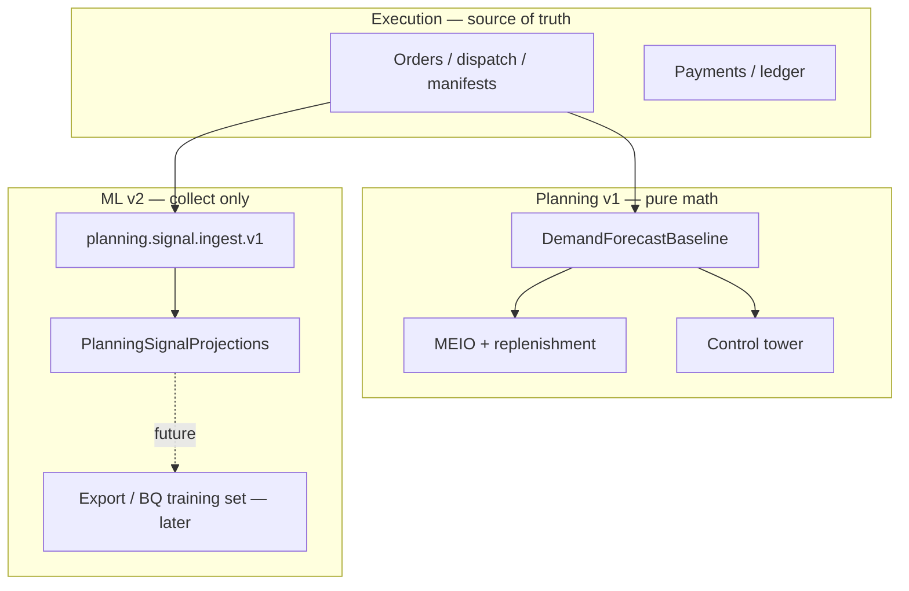

# pegasusX — Hands-Off Enterprise Production at Scale

Last updated: 2026-07-01

**Authority:** Subordinate to [`plan.md`](plan.md). Complements [`plan_90.md`](plan_90.md) and [`PlanDigitalBrain.md`](PlanDigitalBrain.md) with the **production cutover and scale** track.

**Scope (locked):**
- **Single-supplier ecosystem only** — one `supplier_id` deployment; no multi-tenant control plane, no pegasus admin-portal migration, no cross-supplier federation in this program.
- **Planning + execution together** — MEIO, control tower, demand baseline, dispatch, order lifecycle, payments, all role rows.
- **Forecast = pure math now** — moving average, seasonal templates, sparsity gates, confidence ranges; no ML inference in the hot path.
- **ML = collect now, train later** — persist signals and outcomes for a future training tranche; do not block launch on model training.

**Non-goals:**
- pegasus multi-supplier UI/API port (P2–P4)
- Full IBP, causal decomposition, retailer planning surfaces
- PX91-C1 model training pipeline in production v1

---

## Target state (definition of “hands-off at scale”)

| Dimension | Bar |
|---|---|
| **Availability** | 99.9% monthly for API + WS; execution paths survive single-zone loss |
| **Durability** | Spanner ACID + outbox; no silent data loss on client disconnect |
| **Scale** | 1M+ API requests/day, bursty dispatch windows, Kafka consumer lag < 60s P99 |
| **Planning** | Math baseline refreshes without human ops; touchless replenishment on policy-stable SKUs |
| **Forecast truth** | One `DemandForecastBaseline` per supplier/day/warehouse/SKU; UI never shows bare integers |
| **Ops** | Alert → runbook → auto-mitigate or page; no manual Spanner/Kafka surgery for routine incidents |
| **Proof** | Green SSMR + staging credential sign-off + load-cert SLOs before `PEGASUSX_ENV=production` |

---

## Program phases

### Phase 0 — Cloud foundation (P0, ~1–2 weeks)

**Goal:** Production-shaped infra with real adapters; no emulator fallbacks.

**Runbook:** [`PHASE_0_CLOUD_FOUNDATION_RUNBOOK.md`](../docs/PHASE_0_CLOUD_FOUNDATION_RUNBOOK.md)

| Task | Owner | Exit |
|---|---|---|
| Terraform apply + GSM secrets sync | Platform | `make phase0-apply` + `make phase0-sync-secrets` → `phase0-secrets-ok` |
| Spanner prod instance + migrations through `20260702` | Backend | `make phase0-migrate` → `phase0-migrate-ok` |
| Managed Kafka + Redis (or Memorystore) | Platform | `REQUIRE_INFRA_ADAPTERS=true` boot succeeds |
| K8s deploy backend-go + ai-worker + optimizer-core | Platform | `make validate-ai-worker-k8s` green |
| Staging URL + TLS + `PUBLIC_BASE_URL` | Platform | `validate_staging_credentials.sh` → `staging-credentials-ok` |

**Makefile:** `phase0-preflight` → `phase0-plan` → `phase0-apply` → `phase0-sync-secrets` → `phase0-migrate` → `render-k8s-from-terraform`

**Anchor:** `PX-PROD-0` — infra adapters live on staging.

---

### Phase 1 — Proof loops (P0, ~1 week)

**Goal:** Repeatable gates that block bad releases without human judgment.

| Gate | Command / artifact | Must pass |
|---|---|---|
| Local SSMR | `make test-ssmr-infra` | Full e2e + PX90/PX91 markers |
| Preflight bundle | `make p0-preflight` | SSMR + k8s + launch-readiness |
| Launch readiness | `make validate-launch-readiness` | `launch-readiness-ok` |
| Load cert (staging) | `make load-cert-ssmr` or cluster `load-cert` | `__LOAD_CERT_OK__` in [`LOAD_TEST_REPORT.md`](../docs/LOAD_TEST_REPORT.md) |
| Manual QA | [`PX12_MANUAL_QA_RUNBOOK.md`](../docs/qa/PX12_MANUAL_QA_RUNBOOK.md) | Boss sign-off per role row |

**Credential gates (boss + finance):**
- LC-02 Global Pay perform + webhook
- LC-03 Payme/Click sandbox round-trip
- LC-04 Firebase OTP per role (real device)
- LC-05 Maps geocode + OSRM dispatch geometry
- LC-06 Staging sign-off table complete

**Anchor:** `PX-PROD-1` — staging sign-off blocks production env flip.

---

### Phase 2 — Math-only planning contract (P0, code freeze)

**Goal:** Document and enforce that **all forecast/demand in production v1 is deterministic math**, not ML.

| Surface | Production behavior | `baseline_source` |
|---|---|---|
| Supplier demand today | Aggregate baseline + AI recs as **hints only**; confidence from API | `moving_average`, `seasonal_template`, `mixed` |
| Warehouse forecast | `DemandForecastBaseline` rows | same |
| MEIO / replenishment | Uses baseline qty + policies; touchless on stable SKUs | — |
| Scenario sandbox | Read-only projection; no ledger mutation | — |
| Promo P&L | Sandbox simulate + closed-loop **math** compare | — |
| Sparsity gate | ≥2 completed orders or blocked UI | `insufficient_history` |

**Runtime flags (production):**
- `PLANNING_BRAIN_SHADOW=false` (or unset) — baseline writes participate in replenishment
- Do **not** enable ML inference endpoints in prod until PX-PROD-ML train tranche ships
- Seasonal templates + custom overrides: **on**
- `planning.signal.ingest.v1`: **on** (write projections only; no execution mutation)

**Code hygiene (single PR if drift exists):**
- Remove or gate any code path that labels `baseline_source: ml` when source is heuristic math
- Ensure `predictivepush` writes `BaselineSource` = `moving_average` / `seasonal_template`, not `ml`

**Anchor:** `PX-PROD-2` — planning hot path is math-only; documented in [`PlanDigitalBrain.md`](PlanDigitalBrain.md) § VIII deferrals.

---

### Phase 3 — ML data collection (P1, parallel to launch)

**Goal:** Collect training-grade data without affecting execution or forecast truth.

| Stream | What to persist | Retention | Future use |
|---|---|---|---|
| `PlanningSignalProjections` | Ingested signals (POS, weather stubs, manual) | 24 months | Feature store |
| `DemandForecastBaseline` + actuals | Predicted vs `Orders` completed qty | Indefinite in Spanner | Label generation |
| `PlanningPromoSimulations` | Pre-event P&L vs post-event actuals | 24 months | Promo model |
| Order / dispatch events | Kafka `KAFKA_TOPIC_MAIN` archive | GCS or BQ sink | Sequence models |
| Audit | `baseline_source`, `confidence_pct`, sparsity outcomes | Spanner | Model governance |

**Deliverables (no training in v1):**
1. **Daily export job** (Cloud Scheduler → Dataflow or `bq load`): `DemandForecastBaseline` ⋈ completed `Orders` by `supplier_id`, `warehouse_id`, `product_id`, `forecast_date`
2. **Ingest contract freeze** — `planning.signal.ingest.v1` schema versioned in `contracts/events.schema.json`
3. **Data quality checks** — row counts, null rate on `BaselineQty`, ingest lag < 15m P99
4. **Privacy** — single supplier; no cross-tenant fields
5. **K8s CronJob** — [`infra/k8s/planning_training_export_cronjob.yaml`](../infra/k8s/planning_training_export_cronjob.yaml) (02:30 UTC daily; binary in backend image)
6. **Post-export QA** — `make planning-export-validate FILE=export.jsonl`; export cmd supports `-min-rows`

**Anchor:** `PX-PROD-3` — BQ (or GCS parquet) daily export green for 7 consecutive days on staging.

---

### Phase 4 — Observability & hands-off ops (P0, ~1 week)

**Goal:** Incidents resolve from alerts + runbooks without tribal knowledge.

| Area | Requirement |
|---|---|
| **Metrics** | API latency P50/P99, WS connect rate, Kafka lag, Redis hit rate, Spanner aborted txns |
| **Alerts** | ai-worker down, Kafka lag > 5m, payment webhook failure rate, dispatch partial-commit spike |
| **Runbooks** | [`INCIDENT_RESPONSE_RUNBOOK.md`](../docs/INCIDENT_RESPONSE_RUNBOOK.md), planning DLQ replay, [`PARTIAL_DISPATCH_RECOVERY_SOP.md`](../docs/PARTIAL_DISPATCH_RECOVERY_SOP.md) |
| **SLO dashboard** | Launch dashboard per [`LAUNCH_READINESS_RUNBOOK.md`](../docs/LAUNCH_READINESS_RUNBOOK.md) |
| **On-call** | Named rotation; finance + delivery playbooks staffed for first 30 days |

**Anchor:** `PX-PROD-4` — fire-drill: simulated Kafka lag → DLQ replay → dashboard green within 30m. Runbook: [`OBSERVABILITY_FIRE_DRILL_RUNBOOK.md`](../docs/OBSERVABILITY_FIRE_DRILL_RUNBOOK.md).

---

### Phase 5 — Pilot → scale ramp (P1, 30–90 days post-cutover)

| Week | Traffic | Planning | Execution focus |
|---|---|---|---|
| 1–2 | 1 warehouse, ≤50 retailers | Math baseline daily; humans on MEIO exceptions | Order → dispatch → deliver happy path |
| 3–4 | Full supplier topology | Touchless on policy-stable SKUs | Payment webhooks live |
| 5–8 | 2× order volume | Control tower zone overrides in prod | Dispatch AUTO + capacity modal |
| 9–12 | Load-cert target | Ingest volume test | 1M req/day sustained |

**Scale knobs (no code changes):**
- HPA on backend-go / ai-worker
- Kafka partition count (planning topics = 3 min; raise if ingest > 10k/min)
- Spanner processing units autoscale
- Redis cluster mode if perimeter cache misses spike

**Anchor:** `PX-PROD-5` — 30-day post-launch review: zero P0 incidents, SLO met, ML export 100% complete days.

---

## PX-PROD anchor registry

| Anchor | Phase | Scope | Status |
|---|---|---|---|
| `PX-PROD-0` | 0 | Cloud infra + staging adapters | **in progress** — runbook + `make phase0-*`; needs GCP apply |
| `PX-PROD-1` | 1 | SSMR + credential + QA sign-off | **in progress** — `make test-ssmr-infra` green locally (PX90/PX91 markers); staging LC-01–LC-06 pending |
| `PX-PROD-2` | 2 | Math-only planning contract enforced | **shipped** — `NormalizeBaselineSource`; warehouse badges; predictive-push breakdown |
| `PX-PROD-3` | 3 | ML data export pipeline (no training) | **in progress** — export cmd, CronJob, `planning-export-validate`; needs 7 green days on staging |
| `PX-PROD-4` | 4 | Observability + fire-drill | **in progress** — [`OBSERVABILITY_FIRE_DRILL_RUNBOOK.md`](../docs/OBSERVABILITY_FIRE_DRILL_RUNBOOK.md); execute on staging |
| `PX-PROD-5` | 5 | 30-day scale ramp complete | **pending** |

---

## Definition of done (production v1)

1. `PEGASUSX_ENV=production` with LC-01–LC-06 signed off
2. `make test-ssmr-infra` green in CI on every merge to main
3. Math-only forecast on all role-row planning surfaces; sparsity gate live
4. Execution: order → payment → dispatch → manifest → delivery without manual DB intervention
5. ML: daily export job running; **no** production inference dependency
6. On-call + runbooks exercised once in staging fire-drill
7. [`plan_production_scale.md`](plan_production_scale.md) anchors updated in same PR as any prod-affecting change

---

## Future tranche (explicitly after v1 — do not block launch)

| ID | When | What |
|---|---|---|
| `PX-PROD-ML-1` | Q+1 after 90d export | Offline model training on BQ export |
| `PX-PROD-ML-2` | After offline eval | Shadow deploy `PLANNING_BRAIN_SHADOW=true` in prod |
| `PX-PROD-ML-3` | After shadow SLO clean | Flip `baseline_source: ml` for eligible SKUs only |

pegasus multi-supplier remains **out of scope permanently** for this pegasusX deployment.

---

## Related documents

- [`plan.md`](plan.md) — execution anchors PX0–PX12
- [`plan_90.md`](plan_90.md) — planning brain shipped scope
- [`PlanDigitalBrain.md`](PlanDigitalBrain.md) — durability + PX91 detail
- [`LAUNCH_READINESS_RUNBOOK.md`](../docs/LAUNCH_READINESS_RUNBOOK.md) — release evidence
- [`DEPLOYMENT_READINESS_GAP_LEDGER.md`](../docs/DEPLOYMENT_READINESS_GAP_LEDGER.md) — gap closure
- [`PRODUCTION_CREDENTIAL_VALIDATION_RUNBOOK.md`](../docs/PRODUCTION_CREDENTIAL_VALIDATION_RUNBOOK.md) — LC gates
