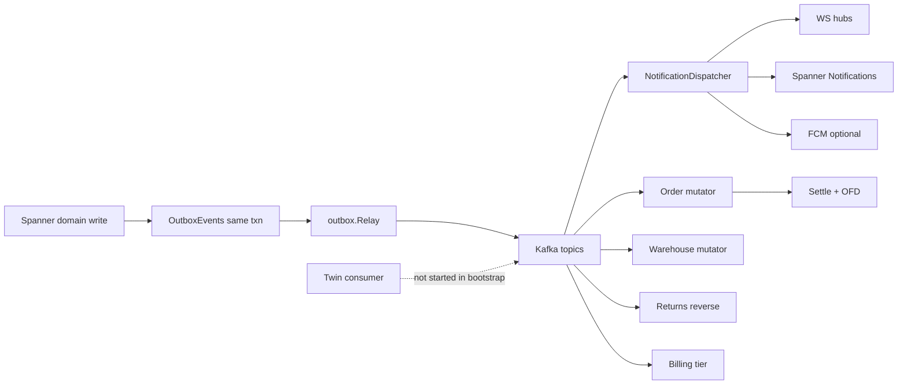
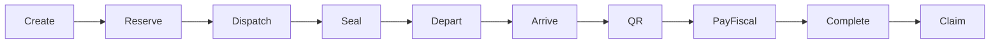
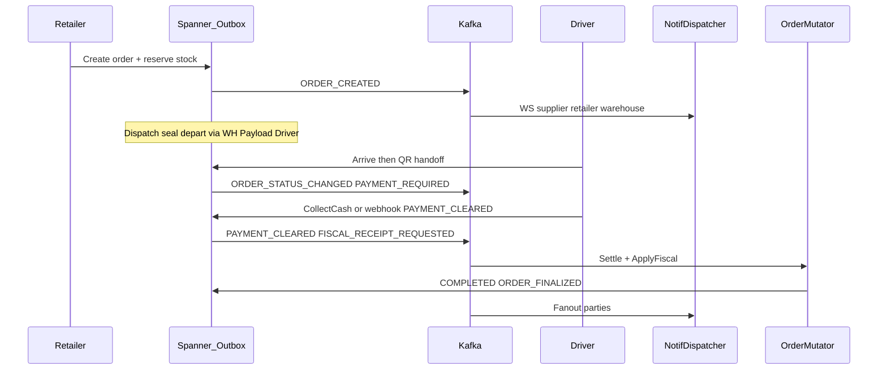
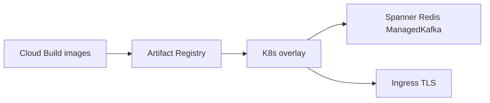

# PegasusX Data Flow — As Implemented

**SOURCE OF TRUTH: CODE** (`apps/backend-go`, `infra/`, `cloudbuild*.yaml`) — not aspirational ecosystem docs.

Interactive canvases (open beside chat):

1. [pegasusx-data-plane.canvas.tsx](/Users/shakhzod/.cursor/projects/Users-shakhzod/canvases/pegasusx-data-plane.canvas.tsx)
2. [pegasusx-order-lifecycle.canvas.tsx](/Users/shakhzod/.cursor/projects/Users-shakhzod/canvases/pegasusx-order-lifecycle.canvas.tsx)
3. [pegasusx-role-integrations.canvas.tsx](/Users/shakhzod/.cursor/projects/Users-shakhzod/canvases/pegasusx-role-integrations.canvas.tsx)
4. [pegasusx-devops-cloud.canvas.tsx](/Users/shakhzod/.cursor/projects/Users-shakhzod/canvases/pegasusx-devops-cloud.canvas.tsx)

**Depth legend:** `wired` = live path · `partial` = narrow/conditional · `gap` = logic missing · `config` = env/keys only

---

## Thesis

Persistent Spanner + outbox + Kafka + WS/inbox is the supply-chain OS kernel. Features without clean hops become UI/API islands. Closing silent mutations (emit + consume + fanout) enables future end-to-end features more than adding screens alone.

---

## 1. Data-plane mermaid

### Topics (`events/topic_routing.go`, `events.go`)

| Const | Default | Notes |
|-------|---------|-------|
| TopicMain | pegasusx-main | Default consume |
| TopicOrders | pegasusx-orders | Dual-write / domain consume |
| TopicDispatch | pegasusx-dispatch | Dispatch/manifest |
| TopicRealtime | pegasusx-realtime | Telemetry fan-in |
| TopicWebhooks | pegasusx-webhooks | **Retired (W1)** — do not emit; payment/partner use TopicMain/Orders |
| TopicExceptions | logistics.exceptions.v1 | Claims / reverse logistics |
| TopicFreezeLocks | pegasusx-freeze-locks | Emit; AI worker |
| TopicInventoryImportEvents | pegasusx-inventory-import | Emit; import worker |

Env: `KAFKA_TOPIC_DUAL_WRITE`, `KAFKA_TOPIC_CONSUME_DOMAIN`.

### Consumers started (`runtime_workers` / bootstrap)

| Consumer | Started | Scope |
|----------|---------|-------|
| NotificationDispatcher | yes if kafka | WS + inbox + FCM |
| Order mutator | yes | PAYMENT_CLEARED, FISCAL_RECEIPT_REQUESTED, PAYMENT_FAILED |
| Warehouse mutator | yes | **Only** SUPPLY_REQUEST_ACCEPTED |
| Returns reverse | yes | TopicExceptions |
| Billing tier | yes | ORDER_FINALIZED |
| Twin EventConsumer | **yes (W1)** | Route/location/order status → route twin |

When Kafka unavailable: `loggingOutboxPublisher` acks without publish (bootstrap).

---

## 2. Order lifecycle mermaid

### Stage hop summary

| Stage | Writer | Events | Depth |
|-------|--------|--------|-------|
| Create | RETAILER | ORDER_CREATED | wired |
| Reserve | same txn | stock none; credit profile; ORDER_ALLOCATED silent | **partial** |
| Dispatch | WH/ADMIN | ORDER_ASSIGNED, ROUTE_*, MANIFEST_DRAFT_* | wired |
| Seal | PAYLOAD | MANIFEST_LOADING_STARTED, MANIFEST_SEALED | wired |
| Depart | DRIVER | status → IN_TRANSIT, MANIFEST_DISPATCHED | wired |
| Arrive / QR | DRIVER | status ARRIVED; SETTLEMENT/PAYMENT_REQUIRED | wired |
| Pay / fiscal | DRIVER / webhooks | PAYMENT_CLEARED, FISCAL_* | wired |
| Complete | fiscal worker | ORDER_FINALIZED (ADR-009) | wired |
| Claim | RETAILER / ADMIN|WH_ADMIN | CLAIM_*; REVERSE_LOGISTICS_* | partial (dual open path) |

### ADR-009

Capture → `FISCALIZING` → only then `COMPLETED` / `ORDER_FINALIZED`. Soft ARRIVED→COMPLETED forbidden (`order/state_machine.go`).

### Auth envelope

JWT roles + scope from claims (`auth/claims.go`). `PendingOrgSelect` blocks business routes. Not part of money hops.

---

## 3. Role integration checklist

**Wired cross-role bus:** checkout, dispatch, seal, doorstep payment/fiscal, claims file/approve, cash recon, supply accept → warehouse mutator, returns inbound.

**Logic gaps (close the bus):**

- [ ] Inventory reserve/release → outbox event + dispatcher fanout
- [ ] Credit convert/release → non-nil emit + profile WS
- [ ] Consumer for `ORDER_ALLOCATED` (or stop emitting)
- [ ] Start twin consumer in bootstrap **or** delete dead path
- [x] Decide TopicWebhooks: **retired** (W1) — keep const for infra; no producers
- [x] Start twin consumer (W1)
- [x] Search decision: Spanner LIKE ([`SEARCH_DECISION.md`](./SEARCH_DECISION.md))
- [ ] Unify claim reverse-logistics open (sync vs Kafka dual)

**Config gaps (deployable):**

- [ ] Firebase for FCM
- [ ] Global Pay / PSP keys
- [ ] Fiscal Soliq creds if legal OFD required
- [ ] PUBLIC_BASE_URL matches ingress DNS for webhooks

**Role-row client gaps (examples):** supplier CT playbooks portal-only; retailer HQ desktop-only; reverse-logistics gated `WAREHOUSE` not `WAREHOUSE_ADMIN`.

---

## 4. DevOps / cloud mermaid

| Overlay | Reality |
|---------|---------|
| staging | Closest wired: real Spanner/Redis/Managed Kafka env |
| prod | Placeholder images / incomplete secrets-TLS |
| ssmr | Ingress + ESO + supplier-portal; API workloads outside overlay |
| Cloud Build | Push only — no CD apply |

Orphaned: in-cluster Kafka/OSRM YAMLs not in overlay resources. Local: `infra/docker-compose.ssmr.yml`.

---

## 5. Deploy config ≠ logic

| Soft fail (boots) | Hard incomplete |
|-------------------|-----------------|
| FCM NoOp | Prod placeholder images |
| loggingOutboxPublisher | Empty GSM versions → ESO fail |
| GP stub without keys | WI namespace mismatches |
| Fiscal PEGASUS/FAKE | Catalog GCS bucket name without TF |

---

## Evidence roots

- `apps/backend-go/outbox/*`, `kafka/*`, `ws/*`, `events/*`, `order/{state_machine,consumer,fiscal}.go`
- `apps/backend-go/bootstrap` / `runtime_workers`
- `infra/terraform`, `infra/k8s/overlays/*`, `cloudbuild*.yaml`

*End. Prefer canvases for navigation; this file for mermaid export / PDF.*
