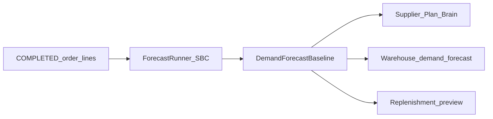

# Demand-class honesty (o9 map, one slice)

**Date:** 2026-08-18  
**Status of this file:** **PLAN**, not wiring. Re-verify in code before claiming REAL.  
**Tree:** `pegasusX/`  
**Approved first slice:** persist + show Syntetos–Boylan demand class already computed by `ForecastSeries`. Do not add new forecast engines.

o9’s videos are CPG IBP SaaS (Graph Cube, consensus layers, Jupyter, SAP). PegasusX is a logistics ecosystem with Plan & Brain, forecast engines, replenishment, and a control tower. **Do not clone o9.** Factory planning **place** and retailer auto-order **place** stay default-off (`.agents/memory/GOAL.md`, GS-U10).

Related living docs: [`FORECAST_ALGO.md`](./FORECAST_ALGO.md), [`GLOBAL_SCALE_CLIENT_UI.md`](./GLOBAL_SCALE_CLIENT_UI.md) §11 Plan & Brain.

Parent catalog (plan, not status): [`PegasusX_o9_Digital_Brain_Feature_Extraction_Integration_Blueprint.md`](./PegasusX_o9_Digital_Brain_Feature_Extraction_Integration_Blueprint.md) and [`PegasusX_o9_Demand_Planning_Problems_Extraction.md`](./PegasusX_o9_Demand_Planning_Problems_Extraction.md). This file is **Phase 0 / first code slice** of that blueprint (demand-class persist + show). Do not implement the rest of the blueprint in the same PR.

---

## Logistics problems in the o9 transcripts

- **Silos:** commercial / finance / ops each have a plan; IBP wants one business question (“what is good for the business”).
- **VUCA / distorted history:** post-pandemic series and treating all SKUs as one forecast engine. o9’s answer is **demand flows** (high/med/low forecastability via CoV). We already classify with **SBC ADI + CV²** (`smooth` / `erratic` / `intermittent`) in `apps/backend-go/planning/forecast/classify.go` — keep that taxonomy; do not replace it with o9’s 0.3 / 0.7 CoV cutoffs.
- **Wrong KPI:** MAPE/WAPE report error; they do not say whether planners improved the forecast (**FVA**). We have WAPE/bias/tracking signal — **no FVA** (needs an override layer first). Defer.
- **Bullwhip:** customer **orders** are crazy while **sellout** is stable. Forecast actuals today are **COMPLETED order lines** (`apps/backend-go/planning/actuals.go`); POS flywheel is a **separate** analytics feed. Defer POS-as-actuals.
- **Cadence:** monthly S&OP misses weekly consumer shifts. We already have a daily forecast runner (flag-gated: `FORECAST_ALGO_ENABLED`).
- **Overrides degrade quality:** exception-based review. Control tower exists; no planner-override FVA. Defer.
- **S&OE disruptions:** plant down → cost vs lost revenue. Control tower playbooks exist; scenario engine is **two knobs** (downtime hours + demand Δ%) and publish **does not** mutate inventory (`planning/scenarios.go` `PublishScenario`). Keep that honesty.
- **People/culture > tech; CEO owns IBP.** Product law: supplier `ADMIN` owns Plan & Brain; CSCO/CFO can orchestrate. No new app.

---

## Honest map (opened 2026-08-18 — re-verify before status)

- **Demand-flow classification** — PARTIAL. `ForecastSeries` classifies and picks Holt–Winters / SES / Croston (`planning/forecast/fit.go`). **Class is discarded on write** — `DemandForecastBaseline` in `schema/spanner.ddl` has qty/source/bands/blocked, **no** `DemandClass` / `ADI` / `CV2`. Brain never lists flows.
- **Engines + baseline persist** — PARTIAL. `planning/forecast_runner.go` writes baseline when `FORECAST_ALGO_ENABLED`. Same-txn `DEMAND_BASELINE_UPDATED`.
- **Accuracy** — REAL for WAPE/MAPE/bias/TS (`ForecastAccuracyDaily`); FVA **GONE**.
- **S&OP** — PARTIAL. Capacity vs **open supply-request `ProjectedUnits`**, not forecast baseline (`planning/service.go` `GetSAndOP`). Not a unified P&L plan.
- **Scenarios** — PARTIAL. Two shocks; optional twin projector; publish = DRAFT→PUBLISHED + outbox only.
- **“Digital Brain” / Graph Cube** — THEATRE vs o9. `GetKnowledgeGraph` is an **entity projection** (owned_by / catalogs). Do not build Hadoop/Jupyter/graph-cube.
- **Warehouse forecast GET** — PARTIAL. Series = preorders by delivery window (`order/preorder_service.go` `WarehouseDemandForecast`); products = stock + replenishment insight + baseline (`warehouse/demand_products.go`). Two meanings of “forecast” already; add class on **products**, do not invent a series.
- **Replenishment / MEIO / control tower / POS flywheel** — KEEP as-is this slice.
- **Factory planning / auto-order place** — stay **off**. Preview 409 `factory_planning_disabled` remains.

Publish scenario and predictive-push **place** are not on this slice’s write path.

---

## Role × surface (this slice only)

- **Supplier ADMIN** — Plan tab unchanged; **Brain** lists SKUs by `smooth` / `erratic` / `intermittent`. Portal `apps/supplier-portal/components/DigitalBrainPanel.tsx` + iOS `apps/supplier-app-ios/SupplierApp/Views/Planning/PlanningBrainView.swift` + Android `apps/supplier-app-android/.../planning/PlanningBrainScreen.kt`.
- **Warehouse** — node Plan: class chip on SKU table. Portal `apps/warehouse-portal/app/demand-forecast/page.tsx` + iOS `apps/warehouse-app-ios/.../DemandForecastView.swift` + Android `DemandForecastScreen`. **No** scenario publish.
- **Factory / retailer / driver / payload** — no demand-class UI. Retailer “DemandForecast” samples are **AI preorders**, not this SoT.
- **Platform admin** — accuracy table unchanged (no class column this slice).

---

## Phase 1 — persist + show class (approved)

1. **DDL** — add nullable `DemandClass STRING(16)`, `ADI FLOAT64`, `CV2 FLOAT64` to `DemandForecastBaseline` in `apps/backend-go/schema/spanner.ddl` + a dated migration under `apps/backend-go/schema/migrations/`. Empty class on old rows = **unknown**, never inferred in the API.

2. **Write** — extend `BaselineWriteInput` and `WriteBaselineWithOutbox` (`planning/baseline_write.go`). `ForecastRunner` copies `res.Class.String()`, `res.ADI`, `res.CV2`. Signal-ingest writes leave class empty (honest unknown).

3. **Read — warehouse products** — `productDemandFromSpanner` attaches `demand_class` (and adi/cv2 if present) from the latest baseline for that SKU. Scaffold/empty paths omit the field. Types: `WarehouseDemandForecastProduct` in `packages/types/index.ts`.

4. **Read — supplier Brain** — new thin GET `GET /v1/supplier/planning/demand-flows` mounted next to existing planning routes in `apps/backend-go/supplierroutes/routes.go`. Latest `ForecastDate` per supplier (optional `warehouse_id`). Body: `source` (`empty`|`spanner`), `as_of`, `counts` for the three classes + `unknown`, `items[]` with product/warehouse/qty/source/blocked/class. Empty tenant → empty items, zeros, `source: empty`. **Do not** invent a pie from missing columns.

5. **Clients** — Brain: three stacks (or StatusStack-style chips) from `counts`; tap lists `items` filtered by class; blocked SKUs keep `blocked_reason` (no invented forecast line). Warehouse SKU table: class chip; missing class = hide chip, not “smooth”.

6. **Copy** — UI label may say “high / medium / low forecastability” as a gloss; wire value stays `smooth|erratic|intermittent`.

### Implementation todos

- [ ] Add `DemandClass` / `ADI` / `CV2` to `DemandForecastBaseline` (ddl + migration)
- [ ] Persist class from `ForecastSeries` in `BaselineWriteInput` + `ForecastRunner`; signal-ingest leaves unknown
- [ ] Attach `demand_class` on warehouse forecast products from latest baseline; update `packages/types`
- [ ] `GET /v1/supplier/planning/demand-flows` honest empty + counts/items; mount on `supplierroutes`
- [ ] Brain + warehouse forecast UI on portal, iOS, Android; no invented class
- [ ] Go persist/GET tests + portal/native decode; re-read edited files

---

## Explicitly out of this slice

- o9 Graph Cube, JupyterHub, SAP/SFTP connectors, Google Trends / ILI drivers.
- FVA (naive vs system vs planner).
- POS sellout as forecast actuals; S&OP demand = baseline; consensus layers / R&O repository.
- Sustainability KPIs on the plan; flipping `FACTORY_PLANNING_ENABLED` / `AUTO_ORDER_PLACE_ENABLED`.
- Changing S&OP, scenarios, knowledge-graph, MEIO, control tower.

---

## Verify-before-done

- `go test ./planning/ ./warehouse/ ./supplier/ -count=1` (runner persist class; GET empty vs live; warehouse product field).
- Portal vitest: blocked/empty flows do not invent class; chips match `counts`.
- Android/iOS decode tests for optional `demand_class`.
- Re-read every edited file. Verdict: **PARTIAL** until class is on the live write+read+role-row path; then **REAL** for this slice only.

---

## Later (not this PR)

- S&OP `ProjectedDemandUnits` from baseline (one-number).
- POS flywheel as actuals when present.
- FVA after a traced override layer.
- Align replenishment tactics to class (exception-only review on `smooth`).
