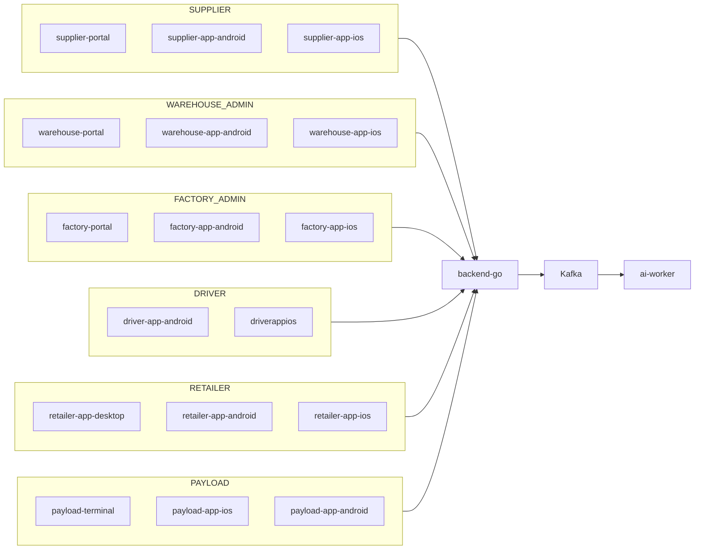

# Pegasus X — Full System Parity & Ecosystem Interoperability Master Plan

**Canonical tree:** `pegasusX/` · **Reference UI:** `pegasus/` (graft only; do not copy source)  
**Last updated:** 2026-06-14 · **Owner:** Boss / F.R.I.D.A.Y. engineering  
**Status model:** `TODO` → `IN_PROGRESS` → `WIRED` → `E2E_SSMR_GREEN` → `PROD`

This document is the **single source of truth** for how every role, app, feature, edge case, and inter-app contract must behave before payment gateways and premium cloud cutover. Update this file on every feature touch; mark proof (SSMR marker, test output, commit).

**Related docs:** [ROLE_ROW_PARITY_MATRIX.md](./ROLE_ROW_PARITY_MATRIX.md) · [BACKEND_ECOSYSTEM_READINESS.md](./BACKEND_ECOSYSTEM_READINESS.md) · [DEPLOYMENT_READINESS_GAP_LEDGER.md](./DEPLOYMENT_READINESS_GAP_LEDGER.md) · [LAUNCH_READINESS_RUNBOOK.md](./LAUNCH_READINESS_RUNBOOK.md)  
**Diagrams:** [../assets/diagrams/](../assets/diagrams/) (`pegasusx-*.mmd`)

---

## 0. Executive summary

Pegasus X is a **single-tenant** logistics OS (one primary SUPPLIER / CEO scope; scalable to multiple warehouses and factories; thousands of retailers). Every role row must ship **backend-first**, then **all clients per role** (web + native + desktop where applicable), with verified interop via REST, WebSocket, Kafka/outbox, webhooks, telemetry, push, and cache invalidation.

**Success =** Docker SSMR `make test-ssmr-infra` green with all `PX_E2E_*` markers + `parity-contract-full` + `gap-hunter-gate` + `validate-launch-readiness`, then minimal GCP staging under **$1500/mo** with budget alerts.

---

## 1. Architecture overview



See [pegasusx-system-parity-ecosystem.mmd](../assets/diagrams/pegasusx-system-parity-ecosystem.mmd) and [pegasusx-replenishment-colocate-flow.mmd](../assets/diagrams/pegasusx-replenishment-colocate-flow.mmd).

---

## 2. Role → clients → backend matrix

| Role | JWT | Clients (must stay in sync) | REST prefix | WS rooms |
|------|-----|----------------------------|-------------|----------|
| SUPPLIER | `ADMIN` | supplier-portal, supplier-app-android, supplier-app-ios | `/v1/supplier/*`, `/v1/auth/supplier/*` | `supplier:{id}`, `telemetry:supplier:{id}` |
| WAREHOUSE_ADMIN | `ADMIN` + `WAREHOUSE_ADMIN` | warehouse-portal, warehouse-app-android, warehouse-app-ios | `/v1/warehouse/*` | `warehouse:{home_node}`, `supplier:{id}` |
| FACTORY_ADMIN | `ADMIN` + `FACTORY_ADMIN` | factory-portal, factory-app-android, factory-app-ios | `/v1/factory/*` | `factory:{home_node}`, `supplier:{id}` |
| DRIVER | `DRIVER` | driver-app-android, driverappios | `/v1/driver/*`, `/v1/telemetry/location` | `driver:{id}`, `telemetry:driver:{id}` |
| RETAILER | `RETAILER` | retailer-app-desktop, retailer-app-android, retailer-app-ios | `/v1/retailer/*`, `/v1/order/*`, `/v1/catalog/*` | `retailer:{id}` |
| PAYLOAD | `PAYLOAD` | payload-terminal, payload-app-ios, payload-app-android | `/v1/payloader/*`, `/v1/payload/*` | `payload:{subject}`, `payload:{supplier_id}` |

---

## 3. Per-role feature contracts

### 3.1 SUPPLIER (CEO — full ecosystem access except direct order execution)

**Purpose:** Own topology, catalog, pricing, fleet, treasury, analytics, exceptions; observe and override; trigger replenishment; do **not** execute warehouse dispatch or touch orders directly.

| Feature | Acceptance | Platforms | Backend | Comms | Status |
|---------|------------|-----------|---------|-------|--------|
| Onboarding 4-step + billing gate | Register → topology → business → categories → `/setup/billing` | portal + native | `POST /v1/auth/supplier/register`, topology PUT | WS supplier room | E2E_SSMR_GREEN |
| Topology (warehouses + factories + **co-locate**) | `transfer_mode`: `TRUCK` \| `INTERNAL`; `co_locate_with_factory_id` when INTERNAL | portal step 2 | `PUT /v1/supplier/topology` | — | WIRED |
| Fleet live map | Animated drivers, route geometry, stale flags | portal + native | `GET /v1/supplier/fleet/live-map` | WS telemetry | E2E_SSMR_GREEN |
| Dispatch oversight | Preview only; execute at warehouse | portal | supplier dispatch routes | Kafka MANIFEST_* | WIRED |
| Replenishment trigger | Manual cycle opens supply request | portal + native ops | `POST /v1/supplier/replenishment/trigger` | outbox + WS | WIRED |
| Treasury / earnings / analytics | Drill-down KPIs | portal primary | payment + analytics | Kafka PAYMENT_* | WIRED |
| Exceptions | shop-closed, negotiation, returns | portal + native More hub | order/* + supplier ops | WS + Kafka | E2E_SSMR_GREEN |

**Edge cases:** co-located warehouse creation; multi-warehouse scale; payment bypass (portal-only v1); broadcast (portal-only v1).

**Viz:** Bento dashboard (portal); org-fleet map; H3 geo-report; sparklines on KPIs.

### 3.2 WAREHOUSE_ADMIN

**Purpose:** Catalog/inventory at node, smart + manual dispatch, supply requests to factory, receive transfers, fleet live map, order interventions.

| Feature | Acceptance | Platforms | Backend | Comms | Status |
|---------|------------|-----------|---------|-------|--------|
| Supply request create | State `SUBMITTED`; factory_id resolved; items/qty in body (v2) | all 3 | `POST /v1/warehouse/supply-requests` | `SUPPLY_REQUEST_UPDATE` WS + outbox | WIRED |
| Supply request list/detail/cancel | Full state machine filters | all 3 | GET/PATCH supply-requests | WS `SUPPLY_REQUEST_UPDATE` | WIRED |
| Dispatch preview/execute/locks | Freeze lock + auto-dispatch worker | all 3 | `/v1/warehouse/ops/dispatch/*` | Kafka + WS | E2E_SSMR_GREEN |
| Fleet live map | MapLibre/MapKit + animated markers | all 3 | `GET /v1/warehouse/ops/fleet/live-map` | WS telemetry | E2E_SSMR_GREEN |
| Transfer receive | Inventory credit on RECEIVED; variance (v2) | portal + native | `/v1/warehouse/transfers/*` | outbox WAREHOUSE_TRANSFER_* | WIRED |
| Replenishment insights | Durable Spanner rows (not demo) | all 3 | `/v1/warehouse/replenishment/insights` | — | IN_PROGRESS |
| Co-locate receive | INTERNAL transfer auto-received at factory fulfill | all 3 | linked transfer | WS + Kafka | WIRED |

**Edge cases:** concurrent supply requests; cancel mid-production; receipt variance; offline dispatch; dispatch lock vs AI worker.

### 3.3 FACTORY_ADMIN

**Purpose:** Execute supply requests; loading bay; manifests; payload override; transfers to warehouse (truck or internal).

| Feature | Acceptance | Platforms | Backend | Comms | Status |
|---------|------------|-----------|---------|-------|--------|
| Supply queue (Spanner) | Read `WarehouseSupplyRequests` for linked warehouses | all 3 | `GET /v1/factory/supply-requests` | WS `FACTORY_SUPPLY_REQUEST_UPDATE` | WIRED |
| Supply transitions | ACKNOWLEDGE → IN_PRODUCTION → READY → FULFILL | all 3 | `PATCH /v1/factory/supply-requests/{id}` | outbox SUPPLY_REQUEST_* | WIRED |
| FULFILL → transfer | Creates `FactoryInternalTransfers`; links `SupplyRequestId` | all 3 | factory + warehouse repos | Kafka | WIRED |
| Manifest lifecycle | DRAFT → LOADING → SEALED → DISPATCHED → COMPLETED | all 3 | factory manifest routes | MANIFEST_* | E2E_SSMR_GREEN |
| Payload override | Rebalance across manifests | all 3 | factory override API | WS | E2E_SSMR_GREEN |
| Payloader integration | Factory controls graph; PAYLOAD executes scan/gate | factory apps + payload row | payloaderroutes | MANIFEST_* | E2E_SSMR_GREEN |

### 3.4 DRIVER

Missions, planned geometry, telemetry, geofence COMPLETE, shop-closed, negotiation, manifest gate, offline queue. **Platforms:** Android + iOS only. **Status:** E2E_SSMR_GREEN for core delivery path.

### 3.5 RETAILER

Catalog, my-suppliers, unified checkout, tracking, receiving windows, auto-order scaffold. **Platforms:** desktop + Android + iOS. **Status:** E2E_SSMR_GREEN.

### 3.6 PAYLOAD

Manifest lifecycle, reassign, device token, driver gate. Supply manifests when factory FULFILL (truck path). **Platforms:** Expo + iPad + Android tablet. **Status:** E2E_SSMR_GREEN.

---

## 4. Replenishment & co-location (priority vertical)

### 4.1 State machine (canonical)

```
SUBMITTED → ACKNOWLEDGED → IN_PRODUCTION → READY → FULFILLED
         ↘ CANCELLED (warehouse/factory policy)
```

Warehouse creates at **SUBMITTED** (legacy `OPEN` mapped in API responses for backward compatibility).

### 4.2 Transfer modes

| Mode | When | Factory FULFILL | Driver | Payloader | Warehouse receive |
|------|------|-----------------|--------|-----------|-------------------|
| `TRUCK` (default) | Factory and warehouse geographically separate | Creates transfer `APPROVED` → manifest path | Yes | Load/seal | `receiveTransfer` |
| `INTERNAL` | `co_locate_with_factory_id` set on warehouse topology | Creates transfer → `RECEIVED` + inventory credit | No | Optional log-only | Automatic |

### 4.3 Sequence

See [pegasusx-replenishment-colocate-flow.mmd](../assets/diagrams/pegasusx-replenishment-colocate-flow.mmd).

### 4.4 E2E markers

| Marker | Proof |
|--------|-------|
| `PX_E2E_REPLENISH_OK` | WH create → factory ACK → FULFILL → WH receive → inventory |
| `PX_E2E_REPLENISH_COLOCATE_OK` | Topology INTERNAL → fulfill → auto-received |
| `PX_E2E_FACTORY_SUPPLY_REQUEST_OK` | Factory PATCH acknowledge (existing) |

---

## 5. Inter-app communication matrix

See [pegasusx-comms-matrix.mmd](../assets/diagrams/pegasusx-comms-matrix.mmd).

| Mechanism | Producers | Consumers / targets | Gaps closed |
|-----------|-----------|---------------------|-------------|
| REST | All `*routes` | Role-scoped clients | — |
| WS (7 hubs) | Handlers + dispatcher | Per-room clients | `SUPPLY_REQUEST_UPDATE` envelope |
| Outbox → TopicMain | Mutating handlers | notification_dispatcher, order consumer, warehouse consumer | Factory accept on TopicMain |
| TopicFreezeLocks | dispatch freeze | **ai-worker consumer (v2)** | P1 follow-up |
| Webhooks | payment/* | outbox → order settle | — |
| Telemetry HTTP | driver | TelemetryHub + retailer approach | By design not Kafka |
| Cache invalidate | Post-commit mutators | Redis Pub/Sub | — |
| FCM | dispatcher | driver + retailer | — |

**Warehouse consumer:** started from `main.go`; handles `SUPPLY_REQUEST_ACCEPTED` on TopicMain.

---

## 6. Infrastructure & cost (<$1500/mo initial)

See [pegasusx-costed-deployment.mmd](../assets/diagrams/pegasusx-costed-deployment.mmd) and [CLOUD_BUDGET_MODEL.md](./CLOUD_BUDGET_MODEL.md).

| Layer | Service | Minimal config | Est. monthly |
|-------|---------|----------------|--------------|
| Compute | GKE Autopilot | 2–3 backend replicas, 2 ai-worker | $200–400 |
| Data | Cloud Spanner | 1 node, autoscale cap 2 | $400–650 |
| Cache | Memorystore Redis | 1 GB BASIC | $35–50 |
| Events | Confluent / managed Kafka | Dev cluster / low tier | $0–150 (trial) |
| Registry | Artifact Registry | Standard | $5–20 |
| Portals | Cloud Run / Firebase | 3 Next.js apps | $20–80 |
| Desktop CDN | GCS + Cloud CDN | Signed installers | $10–30 |
| Observability | Cloud Monitoring | Alerts + dashboard | $0–50 |
| **Total** | | | **~$700–1400** |

**Controls:** `monthly_budget_usd` Terraform variable; billing budget alert at 80%/100%; SSMR for all dev/test (free).

---

## 7. Verification gates

```bash
cd pegasusX
make test-ssmr-infra          # __SSMR_OK__ + PX_E2E_*
make parity-contract-full
make gap-hunter-gate
make validate-launch-readiness
make load-cert               # optional local SLO
```

**SSMR markers (required):** `PX_E2E_ORDER_OK`, `PX_E2E_PAYMENT_OK`, `PX_E2E_WAREHOUSE_OK`, `PX_E2E_FACTORY_OK`, `PX_E2E_DELIVERY_OK`, `PX_E2E_TELEMETRY_OK`, `PX_E2E_PAYLOAD_OK`, `PX_E2E_SHOP_CLOSED_OK`, `PX_E2E_NEGOTIATION_OK`, `PX_E2E_CATALOG_OK`, `PX_E2E_REPLENISH_OK`, `PX_E2E_REPLENISH_COLOCATE_OK`.

Manual QA: [qa/PX12_MANUAL_QA_RUNBOOK.md](./qa/PX12_MANUAL_QA_RUNBOOK.md), [qa/PX12_ROLE_ROW_QA.md](./qa/PX12_ROLE_ROW_QA.md).

---

## 8. Feature tracking matrix (living)

| ID | Flow | Status | Proof |
|----|------|--------|-------|
| PX-ECO-001 | Order lifecycle E2E | E2E_SSMR_GREEN | `PX_E2E_ORDER_OK` |
| PX-ECO-002 | Payment webhook → ledger | E2E_SSMR_GREEN | `PX_E2E_PAYMENT_OK` |
| PX-ECO-003 | Warehouse dispatch + fleet map | E2E_SSMR_GREEN | `PX_E2E_WAREHOUSE_*` |
| PX-ECO-004 | Factory manifest + supply | E2E_SSMR_GREEN | `PX_E2E_FACTORY_*` |
| PX-ECO-005 | Payload manifest lifecycle | E2E_SSMR_GREEN | `PX_E2E_PAYLOAD_*` |
| PX-ECO-006 | Replenishment truck path | E2E_SSMR_GREEN | `PX_E2E_REPLENISH_OK` |
| PX-ECO-007 | Replenishment co-locate path | E2E_SSMR_GREEN | `PX_E2E_REPLENISH_COLOCATE_OK` |
| PX-ECO-008 | Supply WS event shape | WIRED | contract check |
| PX-ECO-009 | Warehouse Kafka consumer | WIRED | consumer started |
| PX-ECO-010 | Factory supply Spanner (not demo L1) | WIRED | factory list from Spanner |
| PX-ECO-011 | Transfer receive → inventory | WIRED | receive credits VU |
| PX-ECO-012 | TopicFreezeLocks consumer | TODO | ai-worker sprint |
| PX-ECO-013 | Durable replenishment insights | TODO | Spanner table |
| PX-ECO-014 | Notification inbox from Kafka | TODO | dispatcher hook |
| PX-FLEET-001 | Warehouse fleet CRUD + assign guard | WIRED | `PX_E2E_WAREHOUSE_FLEET_MGMT_OK` |
| PX-DISP-002 | Dispatch capacity recs + force audit | WIRED | `PX_E2E_DISPATCH_CAPACITY_OK` |
| PX-PAY-003 | Payload aggregate seal-completed | WIRED | `PX_E2E_PAYLOAD_SEAL_FLOWS_OK` |
| PX-REAS-004 | Payload durable reassign | WIRED | `PX_E2E_REASSIGN_FLOWS_OK` |
| PX-DRV-005 | Driver assign detection on profile | WIRED | `PX_E2E_DRIVER_ASSIGN_DETECTION_OK` |

---

## 9. Implementation playbook (backend-first)

1. DDL / topology fields (`TransferMode`, `CoLocateWithFactoryId`, supply request columns).
2. Backend: unify supply state, Spanner factory list, outbox events, WS envelopes, consumer start, co-locate fulfill path, inventory on receive.
3. `packages/types` + `api-client` alignment.
4. Role-row clients (same PR or flagged).
5. SSMR markers + update this tracker.
6. Cloud cutover per [CLOUD_CUTOVER_RUNBOOK.md](./CLOUD_CUTOVER_RUNBOOK.md).

**On touch:** if code diverges from this plan (demo data, wrong event type, missing invalidation), fix in the same change set.

---

## 10. Known intentional deltas (v1)

- Supplier portal ~26 routes vs Pegasus ~59 (P2).
- No Rust optimizer sidecar (P2).
- Supplier native: broadcast/payment-bypass portal-only.
- Factory analytics native screen missing (P3).
- FCM: driver + retailer only.

---

## 11. References (audit ground truth)

- State drift: `warehouse-portal` filters `SUBMITTED..FULFILLED` vs backend `OPEN` — **fixed → SUBMITTED**.
- Demo insights: `warehouse/replenishment_insights.go` — tracked PX-ECO-013.
- Factory demo queue: `factory/service.go` — **fixed → Spanner list**.
- Consumer shadowing: `bootstrap/bootstrap.go:829` — **fixed**.
- Mock proximity: `warehouse/service.go` — **replaced with transfer_mode check**.
- Transfer inventory: `warehouse/transfers.go` — **credit on receive**.
