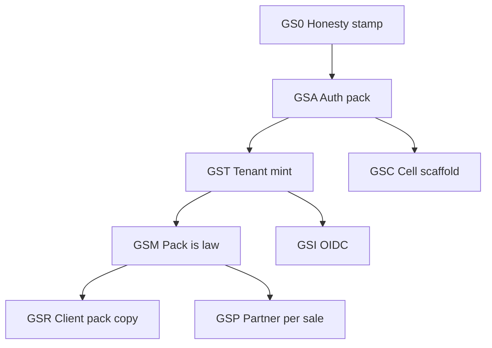

# PegasusX — Every backend feature, classified for global scale

**Date:** 2026-08-16  
**SoT:** `pegasusX/apps/backend-go`. Docs are hypotheses; this file is a **code inventory + action tag**, not a go-live certificate.  
**Companions:** [`GLOBAL_SCALE_PROGRAM.md`](./GLOBAL_SCALE_PROGRAM.md) · [`GLOBAL_SCALE_BACKEND_INFRA.md`](./GLOBAL_SCALE_BACKEND_INFRA.md) · [`FEATURES_BY_APP_ROLE.md`](./FEATURES_BY_APP_ROLE.md) · [`ROLE_FEATURES_DOCS_VS_CODE.md`](./ROLE_FEATURES_DOCS_VS_CODE.md)

| Part | What |
|------|------|
| **I — Execution plan** | Phased modules × exits × BF lists (same grain as [`ROLE_FEATURES_DOCS_VS_CODE.md`](./ROLE_FEATURES_DOCS_VS_CODE.md) P0–P16) |
| **II — Feature inventory** | BF-001…BF-359 tagged KEEP / ADAPT / RESHAPE / LOCAL / DEFER |

```
VERDICT: PARTIAL
EVIDENCE: main.go:164–489 mounts; every *routes/RegisterRoutes + partner/payout/billing/mfa/flags; runtime_workers.go
DOCS vs CODE: FEATURES_BY_APP_ROLE lists routes. MarketPack is advertised (GET /v1/auth/session, GET /v1/platform/market-packs). T1–T5 + **M1–M7** + **C1–C5** + **GS-I** + **GS-R** bind shipped (C1–C5 plan-only). Checkout reads currency/PSP. Fiscal fail-closes planned/PEPPOL/FAKE-in-prod. Doorstep/approach use one pack `breach_radius_meters` (UZ 150; 500 deleted). Shop-closed / labor / weather / factory SLA / calendar TZ read the shipped pack (no `UZDefault()` / `FixedZone("Asia/Tashkent")` / hardcoded `city:Tashkent` worker). Empty order/payment currency reads the shipped pack (NewService / picker / refund / PSP empty no longer invent `UZS`). Payout reads pack `payout_rail` (UZ `bank-file`; unknown+live → `no_live_rail`; no invented PSP). Tax stamp uses pack country (no `countryFromCurrency` KZT→KZ else UZ). `checkout_reads_this` stays false (SSMR cell default is still PEGASUS/FAKE; UZ pack tax adapter is MY_SOLIQ). Factory/warehouse register needs invite or ADMIN+node; bcrypt only; driver/payload login from table rows, not `+998` defaults. TF root is cell-safe: `cells/{uz,eu}/` + project factory `cells/eu/project/` (`pegasusx-cell-eu`, `europe-west1`). Empty adapters OK (commercial fiscal, new JWT, no UZ restore). C4 isolation proof is written. C5: session `api_url` from `home_cell`; global DNS/AR plan (`pegasusx/global`); portals pin JWT cell (localhost stays local). EU/global GCP projects are **not** created from this catalog.
BLOCKERS (ranked): (1) flag still false  (2) one live cell (EU + global DNS/AR not applied)  (3) extra PSPs / live PEPPOL AP (dialect gates shipped)
NEXT: GS-A0–A2 + T1–T5 + M1–M7 + C1–C5 + I + R bind + **GS-P** shipped (C plan-only). No next phase from this catalog. Leftover only when asked: flip checkout_reads_this; terraform/kubectl apply; live PEPPOL AP; live Stripe/Adyen executor; SAML/SCIM; deep UZS screens. Do not implement 250 inventory rows. Do not invent GS-Q.
```

**Scan (this session):** 36 `RegisterRoutes` + partner/payout/billing/planning/fx/import mounts. ~700 unique method+path pairs under `/v1`, `/partner/v1`, `/sim`, health. Grain here is **product feature** (one capability), not one HTTP verb.

**Do not:** second tenant key; merge factory/payload tables; flip factory planning / auto-order place globally; treat planned EU/US/KZ packs as live; apply Terraform from this file; invent a live PSP.

---

# Part I — Phased modular plan

Implement **phases**, not 250 BF rows. Code starts only when a numbered slice is picked after this stamp. P15 is not cloud. P16 is not store. No `terraform apply` / kubectl from this catalog.



**Dependency** (from [`GLOBAL_SCALE_PROGRAM.md`](./GLOBAL_SCALE_PROGRAM.md)): GS-A → GS-T → GS-M before any second-country **claim**. GS-C may scaffold in parallel (plan only). GS-I after GS-T. GS-R continuous. GS-P never blocks register.

## I.0 Doctrine

| Rule | Meaning |
|------|---------|
| **One module = one PR-sized slice** | Independent tests. Proof greps + `go test` on the touched packages. |
| **Tenant key stays `SupplierId`** | Pack and cell are attributes, not a second RLS key. |
| **Honesty** | REAL persist or 410/403/501. Never `{status:ok}` / silent `[]` for unwired claims. |
| **Class A mutators** | JWT → PreferTenant → RW txn + outbox → cache invalidate → hub. |
| **KEEP the Class A loop** | H3 dispatch, WMS, seal, doorstep SM, fiscal hard-gate, dual planes, integer minor, outbox. |
| **`checkout_reads_this` stays false** | Until GS-M1 and GS-M2 agree with the shipped UZ pack. |
| **P15 not cloud · P16 not store** | No `terraform apply` / kubectl from this catalog. |

## I.1 Program map

```
GS-0  Honesty stamp          ── docs only (this PR)
GS-A  Auth + session pack    ── A0–A2 done
GS-T  Self-serve tenant      ── T1–T5 done
GS-M  Pack is law            ── M1–M7 done; leftover flag (`checkout_reads_this` false)
GS-C  Cell scaffold          ── C1–C5 done (plan only)
GS-I  OIDC per supplier org  ── done (SAML/SCIM later)
GS-R  Client pack copy       ── bind done (deep UZS leftover continuous)
GS-P  Partner per sale       ── done (never blocks register)
```

| Phase | Goal | Effort | Gate |
|-------|------|--------|------|
| **GS-0** | Part II + PROGRAM/INFRA match leftover-close code | S | Loyalty not 410; factory dispatch not STUB; countrycfg not a Spanner table |
| **GS-A** | Session JWT carries pack + cell | S–M | A0–A2 done. Live login JWT has `market_code` + `home_cell`; session `source: claim\|profile\|env`; empty row ≠ chosen UZ. `checkout_reads_this` still false |
| **GS-T** | Company registers a non-seed tenant | M | T1–T5 done |
| **GS-M** | Pack is live law | L | M1–M7 done. Flip `checkout_reads_this` only when SSMR fiscal matches pack MY_SOLIQ |
| **GS-C** | Second cell possible on paper | M | **C1–C5 done** — DNS/AR plan + session `api_url`. EU/global not applied |
| **GS-I** | Buyer SSO | M | **Done** — per-supplier OIDC attach + exchange. Process-global Auth0 wrap removed. SAML/SCIM later |
| **GS-R** | Pack-visible fields on every client that role uses | L | **Bind done** — session splash + native pin. Deep POS UZS leftover continuous |
| **GS-P** | EDI/PEPPOL/1C/AS2 | **Done** — catalog + fail-closed gates | Never blocks register |

## I.2 GS-0 — Honesty pass (docs only; first)

Stale Part II rows vs leftover-close code. Fixed in this stamp **before** anyone plans from BF-067 / §17.

| ID | Was | Now (code) |
|----|-----|------------|
| **BF-067 / BF-101 / §17 Loyalty** | 410 DEFER | Live `GET /v1/retailer/loyalty/tier` `{enrolled:false}` + earn; supplier `GET/PATCH /v1/supplier/loyalty/program`. Tag **KEEP** (same program worldwide) / earn bps from pack later. Burn still out of scope. Saved cards stay **DEFER**. |
| **BF-184** | STUB in-memory | Live Spanner factory dispatch = warehouse solver class → `FactoryTruckManifests` only; nil-Spanner tests still `pick_n_created_v1`. Tag **KEEP** (not STUB). |
| **BF-083** | Two catalogs / implied `CountryConfigs` table | countrycfg is AUTH_COUNTRIES in-memory catalog, **not** a `CountryConfigs` table. One law remains MarketPack at GS-A3+M; ops knobs may keep countrycfg until then. |
| **BF-100 / BF-132** | API-only extras | CRM `lines[]` + entity-resolution UI exist; still **KEEP**. |

Align [`GLOBAL_SCALE_PROGRAM.md`](./GLOBAL_SCALE_PROGRAM.md) §1.3 / §1.5 / §7 and [`GLOBAL_SCALE_BACKEND_INFRA.md`](./GLOBAL_SCALE_BACKEND_INFRA.md) A3 / KEEP: cards 410; loyalty live; factory dispatch not “stub in-memory”.

## I.3 GS-A — Auth + session pack (code after stamp)

| Slice | Goal | BF | Exit |
|-------|------|----|------|
| **A0** | Catalog + session | BF-012 | **Done** — `auth/market_pack.go`, `GET /v1/auth/session`, `GET /v1/platform/market-packs`. UZ shipped; others planned; `checkout_reads_this: false` |
| **A1** | Stamp pack on every `auth.Issue` | BF-002–011 | **Done** — `StampMarketClaims` inside `Issue` (claim → profile lookup → env). Refresh copies claims. Tests in `./auth/` |
| **A2** | Persist on `Suppliers` | BF-091 | **Done** — nullable `MarketCode` / `HomeCell`. `WireMarketProfileLookup`. Session `source: claim\|profile\|env`. Empty ≠ silent “user chose UZ” |
| **A3** | One catalog law | BF-083 | Docs + resolve path: MarketPack is product law; countrycfg ops-only until GS-M. Unknown pack 404. Do not add a CountryConfigs Spanner table |

**A0–A2 shipped.** T1–T5 + M1–M7 + C1–C5 + I + R bind + **GS-P** shipped. No next phase from this catalog. Do not flip `checkout_reads_this`. Do not apply terraform.

## I.4 GS-T — Self-serve tenant (RESHAPE)

| Slice | Goal | BF | Exit |
|-------|------|----|------|
| **T1** | `POST /v1/platform/tenants/register` | BF-001, BF-014 | **Done** — new UUID. Never seed-overwrite register. 404 planned pack |
| **T2** | Freeze old supplier register | BF-001 | **Done** — 409 `legacy_register_frozen` + Location T1 once seed registered. Never overwrites registered seed. ALLOW_MULTI ignored |
| **T3** | KYB | BF-024 | **Done** — missing row ≠ active. APPROVE needs two actors + shipped pack+cell. `system:` seed is one-step |
| **T4** | Retailer attach | BF-003, BF-045 | **Done** — `supplier_id` or invite required. Seed attach forbidden outside ssmr. Demo `"1234"` only in ssmr |
| **T5** | Staff invite | BF-006–009, BF-150, BF-164, BF-180, BF-186, BF-210 | **Done** — invite or ADMIN+node; bcrypt only; driver/payload from table rows; `+998` not a login default |

T1–T5 shipped. M1–M7 shipped. #1 leftover in §18 is flag only. Do not flip `checkout_reads_this`.

## I.5 GS-M — Pack is law (ADAPT + LOCAL)

Do **not** flip `checkout_reads_this` until M1–M2 match UZ (catalog MY_SOLIQ vs SSMR often PEGASUS).

| Slice | Reader | BF | Fail-closed |
|-------|--------|----|-------------|
| **M1** | Checkout quote/unified/card | BF-046–050, BF-072, BF-080, BF-240–241, BF-260–261 | **Done** — quote/unified/preview/card/cash read shipped `currency_code` + `psp_adapters`. Planned/unknown pack 404. Unknown gateway / currency mismatch 422. `checkout_reads_this` still false |
| **M2** | Fiscal | BF-243, BF-247, BF-352 | **Done** — collect/retry/worker/receipts read shipped `fiscal_adapter`. Planned pack 404. PEPPOL unimplemented 422. FAKE forbidden in prod. Buyer poller only if UZ MY_SOLIQ. Cell env remains SSMR default (PEGASUS/FAKE); flag stays false |
| **M3** | Proximity | BF-221 | **Done** — one `breach_radius_meters` from shipped pack (UZ 150). Doorstep / approach / telemetry fail-closed on planned pack or radius ≤ 0. 500 m dual deleted. Settlement stays 100 m. Flag still false |
| **M4** | Shop-closed / labor / TZ | BF-052, BF-058, BF-157, BF-189, BF-283–284, BF-341, BF-345, BF-355–356 | **Done** — calendar TZ, shop-closed grace, weather scope, factory SLA hours, labor max shift from shipped pack. Planned pack fail-closed. `UZDefault()` / `FixedZone("Asia/Tashkent")` / worker `city:Tashkent` no longer product law. Flag still false |
| **M5** | Order/payment defaults | BF-240, BF-241, BF-245 | **Done** — empty currency from shipped pack (`order.NewService`, picker, currencies GET, refunds, payment NewService / refund / chargeback). Planned pack fail-closed. No `"UZS"` invent. Flag still false |
| **M6** | Payout | BF-131 | **Done** — pack `payout_rail` (UZ `bank-file`; EU/US catalog `sepa-file`/`ach-file`). Planned pack 404. Unknown name does not fall through to bank-file. Unknown+live → `no_live_rail`. No live PSP invented. Flag still false |
| **M7** | Tax stamp | BF-249 | **Done** — `stampTaxRegimeTxn` / receipts use shipped pack country. `countryFromCurrency` KZT→KZ else UZ deleted. Planned pack 404. Missing regime still fails the txn. Flag still false |

Adapters stay LOCAL: one new country = pack + 1–3 adapters (fiscal, PSP, SMS). Stripe/Adyen executors stay theatre (**BF-269 DEFER**).

## I.6 GS-C — Cell scaffold (infra, no apply)

From [`GLOBAL_SCALE_BACKEND_INFRA.md`](./GLOBAL_SCALE_BACKEND_INFRA.md). **Plan only.**

| Slice | Work | Exit |
|-------|------|------|
| **C0** | Written contract: cell = project+region+stack | Inventory live `pegasus-503013` objects |
| **C1** | Cell-safe same TF root (`cell_id`, per-cell state prefix, regional GSM) | **Done** (plan only) — `backend-ssmr.hcl` vs `backend-cell.example.hcl`; `europe-west1` check rejects `pegasusx/ssmr`. No apply |
| **C2** | `make cell-plan CELL=eu` | **Done** (plan only) — `cells/{uz,eu}/` + isolated `TF_DATA_DIR`. No apply. No live GCS write |
| **C3** | New project `pegasusx-cell-eu` | **Done** (plan only) — `cells/eu/project/` + empty adapters OK + same DDL + new JWT + no UZ restore. Project not applied |
| **C4** | Isolation proof | **Done** (written) — `make cell-isolation-proof`. Live gcloud deny waits for apply |
| **C5** | DNS / `home_cell` API URL | **Done** (plan only) — `make global-plan` + `make cell-api-proof`. Native pin closed in GS-R |

**Reject:** two cells in `pegasus-503013`; one global Spanner; GSM `auto {}` for EU.

## I.7 GS-I / GS-R / GS-P (after T/M)

| Phase | BF | Rule |
|-------|----|------|
| **GS-I** | BF-015 | **Done** — `SupplierOIDC` + `/v1/auth/oidc/{discovery,exchange}` + `/v1/supplier/oidc`. AUTH0_DOMAIN wrap removed. SAML/SCIM later. |
| **GS-R** | — | **Bind done** — `GET /v1/auth/session` chip (currency + receipts) on portal+Android+iOS; native `pinApiBaseUrl`. Deep UZS / maps SDK leftover continuous. |
| **GS-P** | BF-069, BF-130, BF-300–311 | **Done** — `GET /v1/platform/partner-dialects` + `AllowPartnerDialect`. 1C CIS-only; PEPPOL planned/not live; X12/SAP sold_only; AS2 transport (no VAN). Empty 1C currency from pack. Register unblocked. |

## I.8 KEEP / DEFER (do not retag as global work)

**KEEP without geo work:** WMS, freeze, seal/inject/seal-all, doorstep SM, H3 dispatch + factory solver adapter, MEIO heuristic, dual planes, CRM/entity-resolution, loyalty earn/tier (burn out of scope), workers BF-330–359 except weather/TZ ADAPT.

**DEFER:** saved cards, B2B checkout, negotiate qty, payload capacity GET, GP initiate, inventory audit list, Stripe/Adyen execute, **open discovery marketplace**, factory planning **default on**, auto-order **place**. Multi-supplier register / attach / ParentOrders are **in-goal**, not this DEFER row.

## I.9 Next code slice

1. **GS-A1** — **Done.** Every `auth.Issue` stamps `market_code` + `home_cell` (claim → profile → env).  
2. **GS-A2** — **Done.** `Suppliers.MarketCode` / `HomeCell` + `WireMarketProfileLookup`. Session `source`.  
3. **GS-T1** — **Done.** `POST /v1/platform/tenants/register` mints UUID + pack.  
4. **GS-T2** — **Done.** Freeze `/v1/auth/supplier/register` once seed registered.  
5. **GS-T3** — **Done.** Missing KYB row ≠ active; dual-control APPROVE pack+cell.  
6. **GS-T4** — **Done.** Retailer attach: invite / trading-partner id; not PreferTenant(seed).  
7. **GS-T5** — **Done.** Invite-only staff; bcrypt; kill +998 demo defaults.  
8. **GS-M1** — **Done.** Checkout reads shipped-pack currency + PSP. Flag stays false.  
9. **GS-M2** — **Done.** Fiscal fail-closes on shipped pack adapter. Flag stays false.  
10. **GS-M3** — **Done.** One breach radius from shipped pack. Flag stays false.  
11. **GS-M4** — **Done.** Shop-closed / labor / TZ / weather / factory SLA from shipped pack. Flag stays false.  
12. **GS-M5** — **Done.** Empty currency from shipped pack, not `UZS`. Flag stays false.  
13. **GS-M6** — **Done.** Pack `payout_rail`; unknown+live → `no_live_rail`. Flag stays false.  
14. **GS-M7** — **Done.** Tax stamp from pack country. `countryFromCurrency` deleted. Flag stays false.  
15. **GS-C1** — **Done** (plan only). Per-cell `backend-*.hcl`; `cell_id` / `api_hostname` / `k8s_namespace`; Kafka from `cell_id`; GSM regional path; WI from namespace; instance-level IAM; custom VPC path; `overlays/cells/uz`. `make cell-backend-guard`. No apply.
16. **GS-C2** — **Done** (plan only). `infra/terraform/cells/{uz,eu}/` + `make cell-plan CELL=eu`. Isolated data dir; no apply; no `pegasusx/ssmr` open.
17. **GS-C3** — **Done** (plan only). Project factory `pegasusx-cell-eu`; empty adapters OK; same DDL; new JWT; no UZ restore. No apply.
18. **GS-C4** — **Done** (written evidence). UZ JWT 401 on EU; IAM/Kafka/GSM isolation. `make cell-isolation-proof`. No apply.
19. **GS-C5** — **Done** (plan only). Global DNS/AR; session `api_url`; portals pin `home_cell`. `make global-plan` + `make cell-api-proof`. No apply.
20. **GS-I** — **Done.** Per-supplier OIDC; HS256 staff JWT unchanged. SAML/SCIM later.
21. **GS-R** — **Done (bind).** Session pack splash + native cell pin. `make pack-client-proof`. Deep UZS leftover continuous.
22. **GS-P** — **Done.** Dialect catalog + fail-closed gates. `make partner-dialect-proof`. Never blocks register.

No next phase from this catalog. Leftover only when asked: flip `checkout_reads_this`; terraform/kubectl apply; live PEPPOL AP; live Stripe/Adyen executor; SAML/SCIM; EDI codec empty-currency defaults; deep UZS screens. Do not invent GS-Q.

---

# Part II — Feature inventory

## 0. How to read

| Tag | Meaning |
|-----|---------|
| **KEEP** | Same logic worldwide. Config/env only. Do not rewrite. |
| **ADAPT** | Same state machine; numbers/labels from MarketPack or cell env. |
| **RESHAPE** | Grain is wrong for multi-market (seed register, demo phones, process-global fiscal). |
| **LOCAL** | Market adapter (fiscal, PSP, SMS, payout rail, EDI dialect). One pack + 1–3 adapters. |
| **DEFER** | Not required for register+run. Leave 410 / flag-off. Do not globalize theatre. |

Honesty (code, not docs): **REAL** durable path · **PARTIAL** mounted but incomplete · **GONE** honest 410/501 · **STUB** exists but is not the advertised engine · **THEATRE** 200 that does not persist the claim.

**Tech** = first code change. **Non-tech** = legal / ops / contract. **Phase** = GS-A…GS-P from the program doc.

---

## 1. Counts

| Domain | Features | Dominant tags |
|--------|----------|---------------|
| Auth / session / tenancy | 15 | RESHAPE + ADAPT |
| Platform / PA / flags / MFA / health | 13 | KEEP + ADAPT |
| Retailer OS | 33 | KEEP + ADAPT + DEFER |
| Catalog (shared) | 4 | ADAPT + DEFER |
| Supplier portal | 49 | ADAPT + LOCAL + KEEP |
| Warehouse / WMS / dispatch | 23 | KEEP + ADAPT |
| Factory | 11 | KEEP + RESHAPE + ADAPT |
| Payload / dual-plane | 7 | KEEP + LOCAL |
| Driver / doorstep | 19 | ADAPT + RESHAPE |
| Order / fiscal / claims / tax / returns | 11 | ADAPT + LOCAL + KEEP |
| Payment / checkout / webhooks | 11 | LOCAL + DEFER |
| Credit admin / CT / demand / labor / ETA | 9 | KEEP + ADAPT |
| Partner / EDI / 1C / AS2 | 12 | LOCAL |
| Realtime / telemetry / WS | 3 | KEEP |
| Workers / consumers | 30 | KEEP + ADAPT |
| **Total classified (BF-001…BF-359, 250 unique IDs)** | **250** | KEEP 132 · ADAPT 76 · LOCAL 23 · RESHAPE 6 · DEFER 13 |

Gone-on-purpose (do not port, do not “fix for EU”): saved cards, B2B checkout, negotiate qty, payload vehicle-capacity GET, GP initiate, inventory audit list, family POST after migrate. Loyalty is **live** (KEEP; burn out of scope).

---

## 2. Auth, session, tenancy

| ID | Feature | Mounts | Honesty | Tag | Tech first change | Non-tech | Phase |
|----|---------|--------|---------|-----|-------------------|----------|-------|
| BF-001 | Supplier register | `POST /v1/auth/supplier/register` | REAL — unregistered seed may complete; registered seed 409 + Location T1 | **KEEP** | T2 done. Mint is T1 | KYB fields per pack (INN/VAT/EIN) | GS-T2 done |
| BF-002 | Supplier login / refresh | `POST /v1/auth/supplier/{login,refresh}` | REAL | **ADAPT** | A1 stamps via `Issue`; A2 reads supplier row | — | GS-A1–A2 done |
| BF-003 | Retailer register | `POST /v1/auth/retailer/register` | REAL — `supplier_id` or invite; no silent seed | **KEEP** | T4 done. Seed attach only in ssmr | Invite SOP | GS-T4 done |
| BF-004 | Retailer login / refresh | `POST /v1/auth/retailer/{login,refresh}` | REAL — demo `"1234"` only in ssmr | **ADAPT** | A1 stamps pack. T4 killed demo master key outside ssmr | — | GS-A1+T4 done |
| BF-005 | Retailer multi-org | `GET …/memberships` `POST …/{select,switch}-org` `POST …/switch-location` | REAL | **KEEP** | Model for multi-cell later; do not add cell as RLS key | — | — |
| BF-006 | Factory register / login / refresh | `POST /v1/auth/factory/{register,login,refresh}` `POST /v1/supplier/staff-invites` | REAL — invite or ADMIN+node; bcrypt on write | **KEEP** | T5 done. Demo login only in ssmr with explicit env | Staff are rows | GS-T5 done |
| BF-007 | Warehouse register / login / refresh | `POST /v1/auth/warehouse/{register,login,refresh}` | REAL — invite or ADMIN+node; bcrypt only | **KEEP** | T5 done. Plaintext compare removed | — | GS-T5 done |
| BF-008 | Driver login | `POST /v1/auth/driver/login` | REAL — `Drivers` row + bcrypt PinHash | **KEEP** | T5 done. No `+998` default. SSMR demo only if `DRIVER_DEMO_PHONE` set | SIM / phone E.164 per pack | GS-T5 done |
| BF-009 | Payloader login / refresh | `POST /v1/auth/payloader/{login,refresh}` | REAL — SupplierUsers PAYLOADER row | **KEEP** | T5 done. No `+998` default | — | GS-T5 done |
| BF-010 | Platform-admin login | `POST /v1/auth/platform-admin/login` | REAL | **KEEP** | Break-glass; GS-I does not wrap PA JWT | PA is not a customer tenant | KEEP |
| BF-011 | Shared refresh / logout | `POST /v1/auth/{refresh,logout}` | REAL | **KEEP** | Refresh must copy pack claims | — | GS-A1 |
| BF-012 | Session + MarketPack catalog | `GET /v1/auth/session` `GET /v1/platform/market-packs[/{code}]` | PARTIAL — advertises; M1–M7 read pack; flag false (SSMR PEGASUS ≠ MY_SOLIQ) | **ADAPT** | Keep `checkout_reads_this=false` until SSMR fiscal matches pack. Leftover is flag only | Do not sell EU/US/KZ as live | GS-A0 + M1–M7 |
| BF-013 | TenantContext / PreferTenant / seed fail-closed | middleware (`auth/tenant.go`) | REAL in ssmr/prod | **KEEP** | One `SupplierId`; pack is attribute | Seed never in prod | — |
| BF-014 | Self-serve company register | `POST /v1/platform/tenants/register` | REAL — mints UUID + pack; 404 planned | **RESHAPE** | T1 done. ToS/DPA later; T2 freezes old path | ToS / DPA / home-cell pick | GS-T1 done |
| BF-015 | OIDC / SAML / SCIM | `GET/POST /v1/auth/oidc/*` `GET/PUT/DELETE /v1/supplier/oidc` | PARTIAL — OIDC attach+exchange REAL; SAML/SCIM not mounted | **RESHAPE** | SAML/SCIM later. Do not remount process-global Auth0 | Buyer SSO contract | GS-I done |

---

## 3. Platform, PA, flags, MFA, health

| ID | Feature | Mounts | Honesty | Tag | Tech | Non-tech | Phase |
|----|---------|--------|---------|-----|------|----------|-------|
| BF-020 | Client policy / config | `GET/PUT /v1/platform/client-policy` `GET /v1/platform/client-config` | REAL | **ADAPT** | Min-version + store URLs per cell | App-store listings per market | GS-C |
| BF-021 | Media upload ticket | `GET /v1/media/upload-ticket` | REAL | **ADAPT** | GCS bucket per cell | Photo retention / GDPR | GS-C |
| BF-022 | Device token (FCM/APNs) | `POST /v1/user/device-token` | REAL | **LOCAL** | Firebase project per cell | Apple/Google app ids | GS-C / LC-04 |
| BF-023 | Geocode | `GET/POST /v1/platform/geocode/*` | PARTIAL — Google key | **LOCAL** | Maps key + optional regional geocoder | Address format / GDPR | GS-M / LC-05 |
| BF-024 | PA tenants + transition | `GET /v1/platform-admin/tenants*` `POST …/transition` | REAL — missing ≠ active; APPROVE dual-control pack+cell | **KEEP** | T3 done. `system:` seed one-step | KYB SOP | GS-T3 done |
| BF-025 | PA audit | `GET /v1/platform-admin/audit` | REAL | **KEEP** | Per cell | Retention law | — |
| BF-026 | PA ops outbox / DLQ / runtime | `GET /v1/platform-admin/ops/*` | REAL | **KEEP** | Per cell; never cross-cell replay | On-call | GS-C |
| BF-027 | Feature flags + dual-control | `GET/PUT /v1/platform-admin/flags/{flagKey}` `POST …/approve` | REAL | **KEEP** | Planning/place stay default off | Change-control SOP | — |
| BF-028 | PA MFA | `/v1/platform-admin/mfa/{status,enroll,confirm,verify}` | REAL | **KEEP** | — | Break-glass SOP | — |
| BF-029 | Health / ready / metrics / capabilities | `/healthz` `/ready` `/metrics` `/debug/infra/redis` `GET /v1/health` `GET /v1/health/capabilities` | REAL | **KEEP** | Cell-local scrape | — | — |
| BF-030 | Desktop/iOS OTA | `GET /v1/updates/desktop/{app_id}/updater.json` `GET /v1/updates/ios/{app_id}/manifest.plist` | REAL | **ADAPT** | Signing keys may be global; feed URL per cell | Store review | — |
| BF-031 | Platform billing invoices / fees | `POST /v1/admin/billing/run-monthly` `GET …/invoices` `GET …/fee-schedules` | REAL | **ADAPT** | Fee currency = pack | SaaS price list per market | GS-C |
| BF-032 | Inbox + prefs | `GET/POST /v1/user/notifications*` `GET/PATCH /v1/user/notification-preferences` | REAL | **ADAPT** | Channels from pack (SMS/FCM/email) | Quiet hours / consent | GS-M |

---

## 4. Retailer

| ID | Feature | Mounts | Honesty | Tag | Tech | Non-tech | Phase |
|----|---------|--------|---------|-----|------|----------|-------|
| BF-040 | Me / capabilities | `GET /v1/retailer/me` `GET/POST /v1/retailer/capabilities*` | REAL | **KEEP** | Packs are product modules, not countries | Sell capability SKUs | — |
| BF-041 | Setup / profile | `POST /v1/retailer/setup` `GET/PUT /v1/retailer/profile` | REAL | **ADAPT** | Tax-id type from pack | Local business docs | GS-T4 |
| BF-042 | Org members | `/v1/retailer/org/members*` | REAL | **KEEP** | — | Labor / access SOP | — |
| BF-043 | Locations | `/v1/retailer/locations*` | REAL | **ADAPT** | TZ + address fields from pack | — | GS-M4 |
| BF-044 | Family members | `/v1/retailer/family-members*` | PARTIAL — POST 410 after migrate | **DEFER** | Keep migrate→team; do not globalize family | — | — |
| BF-045 | Attach suppliers | `/v1/retailer/suppliers*` `POST /v1/supplier/retailer-invites` | REAL — add rejects seed outside ssmr | **KEEP** | T4 done | Commercial contract | GS-T4 done |
| BF-046 | Cart sync | `/v1/retailer/cart/*` | REAL | **ADAPT** | Currency minor from pack | — | GS-M1 |
| BF-047 | Checkout quote / promotions watch | `POST /v1/retailer/checkout/quote` `POST /v1/retailer/promotions/watch` | REAL — quote stamps shipped-pack currency | **ADAPT** | Quote currency = pack. Flag still false | Promo legal copy | GS-M1 done |
| BF-048 | Order list / parent order | `GET /v1/orders` `GET /v1/retailers/{id}/orders` `GET /v1/retailer/parent-orders/{id}` | REAL | **KEEP** | — | — | — |
| BF-049 | Cancel / request-cancel | `POST /v1/order/cancel` `POST /v1/orders/request-cancel` | REAL | **KEEP** | — | Cancel window policy | — |
| BF-050 | Cash / card checkout aliases | `POST /v1/order/{cash,card}-checkout` | REAL (pay-after-offload) — pack PSP ∩ policy | **LOCAL** | PSP from pack; PEGASUS aliases GLOBAL_PAY; CASH must be on pack | Merchant agreement | GS-M1 done |
| BF-051 | Tracking / active fulfillment / pending pay | `GET /v1/retailer/{tracking,active-fulfillment,pending-payments}` | REAL | **ADAPT** | Maps + copy from pack | Promise language | GS-R |
| BF-052 | Shop-closed respond | `POST /v1/retailer/shop-closed-response` `POST …/orders/{id}/shop-closed/respond` | REAL — grace from shipped pack (UZ 10 min) | **ADAPT** | Grace minutes from pack. Planned pack 404. countrycfg `UZDefault()` is not the law | Retailer SOP | GS-M4 done |
| BF-053 | Control-tower pulse | `GET /v1/retailer/control-tower/pulse` | REAL (honest empty) | **KEEP** | No demo supplier | — | — |
| BF-054 | Store stock + receive + count | `/v1/retailer/stock*` | REAL | **KEEP** | Locale/qty only | Cycle-count SOP | — |
| BF-055 | POS registers / sessions / scan / sale / void / refund | `/v1/retailer/registers*` `/v1/retailer/pos/*` | REAL | **ADAPT** | Receipt tax + currency from pack | POS fiscal if market requires in-store OFD | GS-M / LOCAL |
| BF-056 | POS holds | `/v1/retailer/pos/holds*` | REAL (flag) | **KEEP** | Expired = 410 | — | — |
| BF-057 | Local SKUs | `/v1/retailer/local-skus*` | REAL | **KEEP** | — | — | — |
| BF-058 | Shifts / time clock | `/v1/retailer/time/*` `/v1/retailer/shifts*` | REAL — max hours from pack (UZ 12) | **ADAPT** | Labor max shift hours from shipped pack | Labor law | GS-M4 done |
| BF-059 | Sections / planogram | `/v1/retailer/sections*` `GET /v1/retailer/me/sections` | REAL | **KEEP** | — | — | — |
| BF-060 | Reports pro + export | `/v1/retailer/reports/*` | REAL | **ADAPT** | Currency / date format | — | GS-R |
| BF-061 | HQ franchise analytics | `/v1/retailer/hq/*` | REAL (flag) | **KEEP** | — | Franchise contract | — |
| BF-062 | Sell-through + reorder suggestions | `GET /v1/retailer/insights/sell-through` `GET /v1/retailer/reorder-suggestions` | REAL | **KEEP** | Heuristic stays | — | — |
| BF-063 | Assist tickets | `/v1/retailer/assist/tickets*` | REAL | **ADAPT** | SLA clock in pack TZ | Staffing | GS-M4 |
| BF-064 | Auto-order settings + shadow + soak | `/v1/retailer/settings/auto-order*` | PARTIAL — place flag-off | **KEEP** | Never global default on | Pilot waiver | DEFER place |
| BF-065 | AI predictions / preorder | `/v1/retailer/ai/*` `/v1/ai/*` `POST /v1/retailer/orders/{confirm,reject}-ai` `POST /v1/orders/{edit,confirm,reject}-preorder` `POST /v1/orders/{accept,reject}-delivery-proposal` | REAL (flag) | **KEEP** | Auto-confirm sweeper stays env-off | — | DEFER |
| BF-066 | Saved cards | `/v1/retailer/cards` `/v1/retailer/card/*` | **GONE** 410 | **DEFER** | Do not build vault for “global” | PCI | — |
| BF-067 | Loyalty tier / ledger | `/v1/retailer/loyalty/*` | REAL — `{enrolled:false}` + earn; never fake Bronze | **KEEP** | Same program worldwide; earn bps from pack later. Burn out of scope | — | — |
| BF-068 | Credit profile / relationships / AR (retailer) | `GET /v1/retailer/credit-profile` `GET /v1/retailer/credit-relationships` `GET /v1/retailer/ar/invoices` | REAL | **ADAPT** | Terms days + dunning channel from pack | Credit contract | GS-M |
| BF-069 | Retailer partner keys | `/v1/retailer/partner-keys*` | REAL | **LOCAL** | Sandbox vs live per cell | API ToS | GS-P |
| BF-070 | Analytics expenses / detailed | `GET /v1/retailer/analytics/*` | REAL | **ADAPT** | Currency | — | GS-R |
| BF-071 | WS session / pulse | `GET /v1/retailer/ws-session` `GET /v1/retailer/pulse` | REAL | **KEEP** | — | — | — |
| BF-072 | Pricing rule read | `GET /v1/retailer/pricing/rules` | REAL | **ADAPT** | Currency | — | GS-M1 |

---

## 5. Catalog (shared)

| ID | Feature | Mounts | Honesty | Tag | Tech | Non-tech | Phase |
|----|---------|--------|---------|-----|------|----------|-------|
| BF-080 | Categories / products / search | `GET /v1/catalog/*` `GET /v1/products` `POST/PUT` catalog mutations | REAL | **ADAPT** | Price minor + locale | Allergen / labeling law via GS1 | GS-M1 |
| BF-081 | Barcode lookup | `GET /v1/catalog/barcode/{ean}` | REAL | **KEEP** | GTIN already | — | — |
| BF-082 | Global products + match queue | `GET /v1/global-products/{id}[/offers]` `GET/POST /v1/admin/product-match-queue*` | PARTIAL | **DEFER** | Not required to register+run | Master-data team | GS-P |
| BF-083 | Countrycfg vs MarketPack | `GET /v1/country-configs/{code}` `GET/PATCH /v1/supplier/country-overrides/{code}` | PARTIAL — AUTH_COUNTRIES in-memory; **not** a `CountryConfigs` table; `checkout_reads_this` false | **RESHAPE** | One law: MarketPack at GS-A3+M. countrycfg stays ops knobs until then. Unknown pack 404. Do not add a CountryConfigs Spanner table | Do not sell two product catalogs | GS-A3+M |

---

## 6. Supplier

| ID | Feature | Mounts | Honesty | Tag | Tech | Non-tech | Phase |
|----|---------|--------|---------|-----|------|----------|-------|
| BF-090 | Configure / business setup / billing setup | `POST /v1/supplier/{configure,business/setup,billing/setup}` | PARTIAL — UZ tax/billing | **RESHAPE** | Pack onboarding wizard | Bank + tax docs | GS-T1 |
| BF-091 | Profile / settings | `GET/PUT /v1/supplier/profile` `GET /v1/supplier/settings` | REAL | **ADAPT** | A2 persists nullable `MarketCode` `HomeCell`; empty ≠ chosen UZ | — | GS-A2 done |
| BF-092 | Pricing rules + retailer overrides | `/v1/supplier/pricing/*` | REAL | **ADAPT** | Currency; integer minor | Price-discrimination law | GS-M1 |
| BF-093 | Topology | `GET/PUT /v1/supplier/topology` | REAL | **KEEP** | Nodes stay in one cell | — | — |
| BF-094 | Org members | `/v1/supplier/org/members*` | REAL | **KEEP** | — | — | — |
| BF-095 | Fleet drivers / vehicles | `/v1/supplier/fleet/{drivers,vehicles}` | REAL | **ADAPT** | Phone E.164; labor TZ | Driver labor contract | GS-T5 |
| BF-096 | Dashboard / activity / earnings | `GET /v1/supplier/{dashboard,activity,earnings}` | REAL | **ADAPT** | Currency | — | GS-R |
| BF-097 | Manifest list (supplier plane) | `GET /v1/supplier/manifests` | REAL | **KEEP** | Dual plane — do not merge | — | — |
| BF-098 | Dispatch preview / execute / tracking | `/v1/supplier/dispatch/*` | REAL | **ADAPT** | OSRM/maps URL per cell; H3 + Rule of 25 stay | — | GS-M / C |
| BF-099 | Supply lanes | `GET /v1/supplier/supply-lanes` | REAL | **KEEP** | — | — | — |
| BF-100 | CRM retailers | `GET /v1/supplier/crm/retailers*` | REAL — `Retailers.Email` + order `lines[]` | **KEEP** | Portal + native CRM bind lines | — | — |
| BF-101 | Loyalty program (supplier) | `GET/PATCH /v1/supplier/loyalty/program` | REAL — unconfigured `source: unconfigured`; PATCH requires `reason` | **KEEP** | Same program worldwide; earn bps from pack later. Burn out of scope | — | — |
| BF-102 | Network mode | `GET/PUT /v1/supplier/network-mode` | REAL | **KEEP** | — | — | — |
| BF-103 | Factory planning triggers | `POST /v1/supplier/planning/{pull-matrix,predictive-push,kill-switch}` | REAL engines; **flags default off** | **KEEP** | Per-tenant soak; no global flip | Pilot waiver | DEFER |
| BF-104 | Exceptions + resolve + map | `/v1/supplier/exceptions*` `GET /v1/supplier/ops/exception-map` `GET /v1/supplier/manifest-exceptions` | REAL | **KEEP** | — | Exception SOP | — |
| BF-105 | Inventory + policy + import wizard | `/v1/supplier/inventory*` `/v1/supplier/inventory/imports*` | REAL import; **audit GET = 410** | **KEEP** / audit **DEFER** | Do not fake audit | — | — |
| BF-106 | Analytics velocity / revenue / demand / flywheel | `/v1/supplier/analytics/*` | REAL | **ADAPT** | Currency | — | GS-R |
| BF-107 | Orders + vet | `GET /v1/supplier/orders` `POST /v1/supplier/orders/vet` | REAL | **KEEP** | — | — | — |
| BF-108 | AI recommendations | `GET/POST /v1/supplier/ai/recommendations` | PARTIAL | **DEFER** | — | — | — |
| BF-109 | Shop-closed resolve + payment bypass | `/v1/supplier/shop-closed/*` `POST /v1/supplier/orders/payment-bypass` | REAL | **ADAPT** | Grace from pack | Bypass SOP | GS-M4 |
| BF-110 | Negotiate qty | `GET /v1/supplier/negotiations/pending` `POST /v1/supplier/negotiate/resolve` | **GONE** 410 | **DEFER** | Keep 410 | — | — |
| BF-111 | Early-complete approve | `POST /v1/supplier/route/approve-early-complete` | REAL | **KEEP** | — | — | — |
| BF-112 | Compliance fiscal-open / force / claims / freezes / dashboard / export | `/v1/compliance/*` | REAL | **ADAPT** | Fiscal labels from pack | Audit retention | GS-M2 |
| BF-113 | Reassign / recommend | `POST /v1/supplier/{reassign-order,recommend-reassign}` | REAL | **KEEP** | Dual-plane aware | — | — |
| BF-114 | Empathy adoption | `GET /v1/supplier/empathy/adoption` | PARTIAL | **DEFER** | — | — | — |
| BF-115 | Broadcast | `POST /v1/supplier/broadcast` | REAL | **ADAPT** | SMS/FCM adapter | Comms consent | GS-M |
| BF-116 | Replenishment trigger / policies / trace / suggestions | `/v1/supplier/replenishment/*` `/v1/replenishment/suggestions*` | REAL | **KEEP** | Heuristic; money fields use pack currency | — | — |
| BF-117 | Digital twin routes | `/v1/twin/routes*` | REAL | **KEEP** | — | — | — |
| BF-118 | Segmentation | `/v1/supplier/segmentation/*` | REAL | **KEEP** | — | — | — |
| BF-119 | MEIO network summary | `GET /v1/supplier/meio/network-summary` | REAL heuristic | **KEEP** | `cost_aware_v2`; no formula change | — | — |
| BF-120 | CT zone overrides | `/v1/supplier/control-tower/zone-overrides` | REAL | **ADAPT** | Dispatch polygons — not doorstep `breach_radius_meters`. M3 does not close this | — | — |
| BF-121 | Planning scenarios / S&OP / seasonal / signals / promo sim / sparsity / agent hook | `/v1/supplier/planning/*` | REAL; flags off | **KEEP** | Do not turn on for “global” | — | DEFER default |
| BF-122 | Knowledge graph | `GET /v1/supplier/knowledge-graph` | PARTIAL | **DEFER** | — | — | — |
| BF-123 | Fleet orders / live map | `GET /v1/supplier/fleet/{orders,live-map}` | REAL | **ADAPT** | Maps key per cell | — | GS-C |
| BF-124 | Returns list / resolve | `GET /v1/supplier/returns` `POST …/resolve` `GET …/returns/history` | REAL | **KEEP** | — | Returns law | — |
| BF-125 | Return policy | `GET/PUT /v1/supplier/return-policy` | REAL | **ADAPT** | Window days from pack | Consumer law | GS-M |
| BF-126 | Promotions CRUD | `/v1/supplier/promotions*` | REAL | **ADAPT** | Currency | Promo advertising law | GS-M |
| BF-127 | Reconciliation | `GET /v1/supplier/reconciliation` `POST …/resolve` | REAL | **ADAPT** | Currency | Finance SOP | — |
| BF-128 | Route performance | `GET /v1/supplier/route-performance` | REAL | **KEEP** | — | — | — |
| BF-129 | FX rates (supplier read) | `GET /v1/supplier/fx-rates` | REAL | **ADAPT** | Cell default currency | — | GS-M |
| BF-130 | Partner keys / webhooks / SFTP / exports / EDI / COA / AS2 | `/v1/supplier/partner-*` | REAL adapters in-tree; **GS-P** pack gates | **LOCAL** | 1C CIS only (EU 422); PEPPOL planned/not live; SAP/X12 sold_only; AS2 transport no VAN | Certs / AS2 identity | GS-P done |
| BF-131 | Payout policy + batches + rail + settlement hook | `/v1/supplier/payout*` `POST /v1/webhooks/payouts/settlement` | REAL file rail; live rail `no_live_rail`; pack `payout_rail` | **LOCAL** | UZ `bank-file`. Planned pack 404. Unknown name ≠ bank-file fallthrough. Unknown+live → no_live_rail. No invented PSP | Bank file / SEPA / ACH contract | GS-M6 done |
| BF-132 | Entity resolution | `POST /v1/supplier/entity-resolution/{explain,resolve}` | REAL — portal + Android/iOS UI | **KEEP** | — | — | — |
| BF-133 | Credit program / relationships / scores / profiles | `/v1/supplier/credit-*` `PATCH /v1/supplier/retailer-credit-profile` | REAL | **ADAPT** | Terms + currency from pack | Credit policy | GS-M |
| BF-134 | AR invoices (supplier) | `GET /v1/supplier/ar/invoices` | REAL | **ADAPT** | — | Collections SOP | — |
| BF-135 | Credit notes | `/v1/supplier/credit-notes*` | REAL | **ADAPT** | Currency | Tax credit-note rules | LOCAL |
| BF-136 | Cash recon accept / write-off | `/v1/supplier/cash-reconciliations*` | REAL | **ADAPT** | Custody hours from pack | Cash SOP | GS-M |
| BF-137 | Claim chargebacks list | `GET /v1/supplier/claim-chargebacks` | REAL | **LOCAL** | PSP partial refund adapter | Chargeback SOP | — |
| BF-138 | Pulse / WS | `GET /v1/supplier/{pulse,ws-session}` | REAL | **KEEP** | — | — | — |

---

## 7. Warehouse / WMS / dispatch

| ID | Feature | Mounts | Honesty | Tag | Tech | Non-tech | Phase |
|----|---------|--------|---------|-----|------|----------|-------|
| BF-150 | Warehouse CRUD + setup | `/v1/warehouses*` `POST /v1/warehouse/setup` | REAL — public register closed (T5) | **KEEP** | Create is JWT ADMIN/warehouse; register is invite | Node ownership | GS-T5 done |
| BF-151 | Transfers emergency / force-receive / receive | `/v1/warehouse/transfers*` | REAL | **KEEP** | Dual plane | — | — |
| BF-152 | Ops dashboard / inventory / policy | `/v1/warehouse/ops/dashboard` `/v1/warehouse/ops/inventory*` | REAL | **KEEP** | — | — | — |
| BF-153 | Bins / lots / putaway / FEFO | `/v1/warehouse/ops/{bins,lots}*` | REAL | **KEEP** | — | Lot traceability law | — |
| BF-154 | Pick waves + confirm + waive shorts | `/v1/warehouse/ops/pick-waves*` | REAL | **KEEP** | — | Short SOP | — |
| BF-155 | Cycle counts + ABC enqueue + adjustments + accuracy + reconcile | `/v1/warehouse/ops/cycle-counts*` `…/inventory-adjustments*` `…/inventory-accuracy` `…/inventory-reconcile` | REAL | **KEEP** | — | — | — |
| BF-156 | Cold-chain temperature | `/v1/warehouse/ops/temperature-readings*` | REAL | **ADAPT** | °C/°F display from pack | Food-safety cert | LOCAL |
| BF-157 | Ops settings / location | `/v1/warehouse/ops/{settings,location}` | REAL — location GET stamps pack timezone | **ADAPT** | TZ from shipped pack | — | GS-M4 done |
| BF-158 | Ops orders + delay / reject / overflow / propose | `/v1/warehouse/ops/orders*` | REAL | **KEEP** | — | Exception SOP | — |
| BF-159 | Preorders edit / reject / propose | `/v1/warehouse/ops/preorders*` | REAL | **KEEP** | Flag-off auto-confirm stays | — | — |
| BF-160 | Stock commitments | `/v1/warehouse/ops/stock-commitments*` | REAL | **KEEP** | — | — | — |
| BF-161 | Dispatch preview / execute / tracking / settings / runs / locks | `/v1/warehouse/ops/dispatch/*` `/v1/warehouse/dispatch*` | REAL | **ADAPT** | Maps/OSRM per cell; freeze stays | Dispatch SOP | GS-C |
| BF-162 | Rescue preview / propose | `POST /v1/warehouse/ops/dispatch/rescue/*` | REAL | **KEEP** | — | Rescue SOP | — |
| BF-163 | Board / exceptions / broadcast | `/v1/warehouse/ops/{board,exceptions,broadcast}*` | REAL | **ADAPT** | Comms adapter | — | GS-M |
| BF-164 | Drivers / vehicles / staff / products / manifests | `/v1/warehouse/ops/{drivers,vehicles,staff,products,manifests}*` | REAL — staff PIN bcrypt, returned once | **KEEP** | T5 done | — | GS-T5 done |
| BF-165 | Labels / ship-units | `/v1/warehouse/manifests/{id}/{ship-units,labels}` | REAL | **LOCAL** | GS1 FNC1 stay; label language from pack | Label law | GS-P |
| BF-166 | Live map / analytics / CRM / returns / treasury / financials / payment-config | `/v1/warehouse/ops/{fleet/live-map,analytics,crm,returns,treasury,financials,payment-config}` | REAL reads | **ADAPT** | Currency; payment-config must not invent Stripe | — | GS-M |
| BF-167 | Demand forecast (warehouse) | `GET /v1/warehouse/demand/forecast` | REAL honest empty | **KEEP** | No scaffold in prod | — | — |
| BF-168 | Supply requests + QC | `/v1/warehouse/supply-requests*` | REAL | **KEEP** | Process, not geography | QC SOP | — |
| BF-169 | Replenishment insights | `/v1/warehouse/replenishment/insights*` | REAL | **KEEP** | — | — | — |
| BF-170 | Return policy (WH) | `GET/PUT /v1/warehouse/return-policy` | REAL | **ADAPT** | Pack window | — | GS-M |
| BF-171 | Reassign / recommend | `POST /v1/warehouse/{reassign-order,recommend-reassign}` | REAL | **KEEP** | — | — | — |
| BF-172 | Pulse / WS | `GET /v1/warehouse/{ops/pulse,ws-session}` | REAL | **KEEP** | — | — | — |

---

## 8. Factory

| ID | Feature | Mounts | Honesty | Tag | Tech | Non-tech | Phase |
|----|---------|--------|---------|-----|------|----------|-------|
| BF-180 | Factory CRUD + setup | `/v1/factories*` `POST /v1/factory/setup` | REAL — public register closed (T5) | **KEEP** | Create is JWT; register is invite | — | GS-T5 done |
| BF-181 | Dashboard / analytics / profile / location | `/v1/factory/{dashboard,analytics/overview,profile,ops/location}` | REAL — ops/location stamps pack timezone | **ADAPT** | Location TZ from pack. Dashboard clocks leftover | — | GS-M4 |
| BF-182 | Loading-bay manifests (factory plane) | `/v1/factory/manifests*` start-loading / seal / complete / dispatch / rebalance / cancel | REAL | **KEEP** | **Do not merge** with supplier truck tables | — | — |
| BF-183 | Manifest exceptions | `/v1/factory/manifest-exceptions*` | REAL GET Spanner-first | **KEEP** | — | — | — |
| BF-184 | Default dispatch | `POST /v1/factory/dispatch` | REAL Spanner — warehouse solver class → `FactoryTruckManifests` only; nil-Spanner tests still `pick_n_created_v1` | **KEEP** | Not pick-N; not `FACTORY_BATCHER_ENABLED` gate. Never write `SupplierTruckManifests` | — | — |
| BF-185 | Fleet / live-map / drivers / vehicles | `/v1/factory/fleet*` | REAL | **ADAPT** | Maps per cell | — | GS-C |
| BF-186 | Staff + set-password | `/v1/factory/staff*` | REAL — bcrypt on create + set-password | **KEEP** | T5 done | — | GS-T5 done |
| BF-187 | Transfers create / transition | `/v1/factory/transfers*` | REAL | **KEEP** | Dual plane | — | — |
| BF-188 | Supply requests + QC + fulfill-options + accept | `/v1/factory/supply-requests*` | REAL | **KEEP** | — | — | — |
| BF-189 | SLA board | `GET /v1/factory/sla-board` | REAL — default hours from pack (UZ 48; planned → N/A) | **ADAPT** | Default hours from pack, not hardcoded 48 | SLA contract | GS-M4 done |
| BF-190 | Pulse / WS | `GET /v1/factory/{pulse,ws-session}` | REAL | **KEEP** | — | — | — |

---

## 9. Payload (supplier-truck plane)

| ID | Feature | Mounts | Honesty | Tag | Tech | Non-tech | Phase |
|----|---------|--------|---------|-----|------|----------|-------|
| BF-200 | Trucks / orders / manifests list | `GET /v1/payloader/{trucks,orders,manifests}` | REAL | **KEEP** | SupplierTruckManifests | — | — |
| BF-201 | Start-load / inject / seal / seal-all / seal-completed | `/v1/payloader/manifests*` + `/v1/payload/seal` + supplier aliases | REAL | **KEEP** | — | Seal SOP | — |
| BF-202 | Load ledger scan + variance approve | `/v1/payloader/manifests/{id}/load-ledger*` | REAL | **KEEP** | — | Variance SOP | — |
| BF-203 | Ship-units / GS1 labels | `…/ship-units` `…/labels` (payload + supplier + warehouse aliases) | REAL | **LOCAL** | FNC1 stay; language from pack | Label law | GS-P |
| BF-204 | Exceptions + reassign | `/v1/payload/manifest-exception` `/v1/payloader/manifest-exceptions` `{recommend,reassign}-order` `POST /v1/fleet/reassign` | REAL | **KEEP** | — | — | — |
| BF-205 | Vehicle capacity GET | `GET /v1/payload/capacity/{vehicleID}` | **GONE** 410 (VU lives on manifest) | **DEFER** | Keep 410 | — | — |
| BF-206 | WS / pulse / inbox | `GET /v1/payload/ws-session` `GET /v1/payloader/pulse` notifications | REAL | **KEEP** | — | — | — |

---

## 10. Driver / doorstep

| ID | Feature | Mounts | Honesty | Tag | Tech | Non-tech | Phase |
|----|---------|--------|---------|-----|------|----------|-------|
| BF-210 | Driver / vehicle CRUD | `/v1/drivers*` `/v1/vehicles*` | REAL — login identity is table row, not `+998` | **KEEP** | T5 done | License / labor | GS-T5 done |
| BF-211 | Profile / history / earnings / availability | `/v1/driver/{profile,history,earnings,availability}` | REAL | **ADAPT** | Currency; labor TZ | — | GS-M |
| BF-212 | Manifest + gate + open-fiscal + pending collections | `GET /v1/driver/{manifest,manifest-gate,open-fiscal,pending-collections}` | REAL | **KEEP** | Fiscal fail-closed stays | Shift SOP | — |
| BF-213 | Rescue request / respond | `POST /v1/driver/ops/rescue/*` | REAL | **KEEP** | — | — | — |
| BF-214 | Shop-closed / partial-offload / credit-leave (driver-scoped) | `POST /v1/driver/orders/{id}/{shop-closed,partial-offload,credit-leave}` | REAL | **ADAPT** | Grace + currency | Credit leave legal | GS-M |
| BF-215 | Supply-transfer arrive | `/v1/driver/supply-transfers*` | REAL | **KEEP** | Factory plane | — | — |
| BF-216 | Cash recon (driver) | `/v1/driver/cash-reconciliations*` | REAL | **ADAPT** | Custody hours from pack | Cash bag SOP | GS-M |
| BF-217 | Return-goods summary | `GET /v1/driver/return-goods` | REAL | **KEEP** | — | — | — |
| BF-218 | Fleet depart / return-complete / orders / geometry / reorder / early-complete | `/v1/fleet/*` | REAL | **ADAPT** | Maps; shift freeze + open fiscal 409 stay | — | GS-C |
| BF-219 | Order get / state / validate-QR / amend | `/v1/orders/{id}` `PATCH …/state` `POST /v1/order/{validate-qr,amend}` | REAL | **KEEP** | Offline cannot invent COMPLETED | — | — |
| BF-220 | Reassign handshake | `POST /v1/fleet/orders/{id}/reassign-handshake` | REAL | **KEEP** | — | — | — |
| BF-221 | Doorstep: arrive / proximity / offload / deliver / confirm / collect / complete | `/v1/delivery/arrive` `…/proximity-unlock` `…/partial-offload` `…/shop-closed` `/v1/order/{deliver,confirm-offload,collect-cash,complete}` | REAL — one pack radius (UZ 150); 500 deleted | **ADAPT** | **One** `breach_radius_meters` from shipped pack. Planned/unknown 404. Settlement unlock stays 100 m | Geofence SOP | GS-M3 done |
| BF-222 | Scan QR / confirm-cash / confirm-bypass | `POST /v1/delivery/{scan-qr,confirm-cash,confirm-payment-bypass}` | REAL | **KEEP** | Pay-at-delivery law (ADR-001) | — | — |
| BF-223 | Credit delivery / missing items / exception / split-pay / bypass-offload | `/v1/delivery/{credit-delivery,missing-items,exception-report,split-payment,bypass-offload}` | REAL | **ADAPT** | Currency | Exception SOP | GS-M |
| BF-224 | Negotiate (driver) | `POST /v1/delivery/negotiate` | **GONE** 410 | **DEFER** | Keep 410 | — | — |
| BF-225 | Damage / condition reports | `POST /v1/delivery/report-{damage,condition}` `GET /v1/order/{id}/condition-reports` | REAL | **KEEP** | — | — | — |
| BF-226 | In-delivery update / handshake (order service) | `POST /v1/delivery/{update-order-during-delivery,verify-handshake}` | REAL | **KEEP** | — | — | — |
| BF-227 | Offline sync batch | `POST /v1/sync/batch` | REAL | **KEEP** | Reject invented COMPLETED | — | — |
| BF-228 | WS ack / pulse | `POST /v1/ws/ack` `GET /v1/driver/pulse` | REAL | **KEEP** | — | — | — |

---

## 11. Order spine, fiscal, claims, tax, receipts

| ID | Feature | Mounts | Honesty | Tag | Tech | Non-tech | Phase |
|----|---------|--------|---------|-----|------|----------|-------|
| BF-240 | Create order | `POST /v1/order/create` | REAL — empty currency from shipped pack | **ADAPT** | NewService / resolve no longer invent `UZS`. Planned pack 404 | — | GS-M5 done |
| BF-241 | Currencies list | `GET /v1/order/currencies` | REAL — operating from shipped pack | **ADAPT** | Planned JWT 404, not advertise UZS | — | GS-M5 done |
| BF-242 | Status / assign / timeline / status-context | `PATCH /v1/order/{id}/status` `POST /v1/orders/{id}/assign` `GET …/{timeline,status-context}` | REAL | **KEEP** | SM + fiscal hard-gate stay | — | — |
| BF-243 | Fiscal retry | `POST /v1/order/{id}/fiscal/retry` | REAL — pack fail-closed | **LOCAL** | Planned/PEPPOL rejected. MY_SOLIQ without EDS still hard-fails. FAKE forbidden in prod | OFD contract / EDS | GS-M2 done |
| BF-244 | Force-complete | `POST /v1/order/{id}/force-complete` | REAL | **KEEP** | Roles ADMIN+WAREHOUSE_ADMIN; reason required | Force SOP + audit retention | N2 |
| BF-245 | Refunds | `POST /v1/order/{id}/refunds` | REAL — empty order currency from pack | **LOCAL** | PSP adapter; empty → pack, not `UZS`. Planned pack 404 | Refund law | GS-M5 done |
| BF-246 | QR payload (retailer) | `GET /v1/order/{id}/qr-payload` | REAL | **KEEP** | — | — | — |
| BF-247 | Platform / role receipts | `GET /v1/platform/receipts/{id}` `GET /v1/{retailer,supplier,warehouse}/orders/{id}/receipt` | REAL — stamps pack `market_code` + `fiscal_adapter` | **LOCAL** | Fiscal QR vs commercial (`tax_ofd` only when provider is MY_SOLIQ) | Receipt legal form | GS-M2 done |
| BF-248 | Claims file / list / eligibility / approve / reject | `/v1/orders/{id}/claims*` `/v1/claims/{id}/{approve,reject}` `GET /v1/supplier/claims` | REAL | **ADAPT** | Windows from pack | Claims policy | GS-M |
| BF-249 | Tax regimes CRUD | `/v1/admin/tax-regimes*` | REAL — stamp uses pack country | **RESHAPE** | `countryFromCurrency` deleted. Stamp + receipts use shipped pack country. Missing regime fails txn. Planned pack 404 | Tax counsel | GS-M7 done |
| BF-250 | Returns inbound / scan / confirm / history | `/v1/returns/*` | REAL | **KEEP** | — | — | — |

**Money invariants (do not retag):** integer minor only; credit-leave + AR same txn; no COMPLETED without SUCCESS or audited FORCE; FAKE fiscal forbidden in prod; worker must be deployed.

---

## 12. Payment / checkout / webhooks / payers

| ID | Feature | Mounts | Honesty | Tag | Tech | Non-tech | Phase |
|----|---------|--------|---------|-----|------|----------|-------|
| BF-260 | Unified checkout | `POST /v1/checkout/unified` | REAL — reads shipped currency/PSP | **LOCAL** | Reads shipped pack. `checkout_reads_this=true` only after M1=M2 agree | Merchant of record | GS-M1 done |
| BF-261 | Checkout preview | `POST /v1/checkout/preview` | REAL — same pack reader | **ADAPT** | Same | — | GS-M1 done |
| BF-262 | B2B checkout | `POST /v1/checkout/b2b` | **GONE** 410 | **DEFER** | Keep 410 | — | — |
| BF-263 | Chargeback + reversal | `POST /v1/payment/chargeback*` | REAL | **LOCAL** | PSP adapter | Chargeback SOP | — |
| BF-264 | Ledger / settlement authority / recon mismatches | `GET /v1/payment/{ledger,settlement/authority,reconciliation/mismatches}` | REAL | **ADAPT** | Currency | Finance SOP | — |
| BF-265 | Deprecated GP initiate | `POST /v1/payment/global_pay/initiate` | **GONE** 410 | **DEFER** | Keep 410 | — | — |
| BF-266 | Payers CRUD | `/v1/payers*` | REAL | **ADAPT** | — | — | — |
| BF-267 | Webhook Global Pay | `POST /v1/webhooks/global-pay` | REAL | **LOCAL** | HMAC; UZ pack | GP merchant | LC-02 |
| BF-268 | Webhook Payme / Click | `POST /v1/webhooks/{payme,click}` | REAL | **LOCAL** | UZ-only adapters | Local PSP contracts | LC-03 |
| BF-269 | Webhook Stripe / Adyen | `POST /v1/webhooks/{stripe,adyen}` | PARTIAL — Stripe/Adyen **executors theatre** | **DEFER** until real executor | Do not flip pack to STRIPE until executor is real | EU/US merchant | GS-M / P |
| BF-270 | GP simulator | `/sim/globalpay/*` | REAL local only | **KEEP** | Never mount in staging/prod | — | — |

---

## 13. Credit admin, AR dunning, control tower, demand, labor, ETA

| ID | Feature | Mounts | Honesty | Tag | Tech | Non-tech | Phase |
|----|---------|--------|---------|-----|------|----------|-------|
| BF-280 | Admin disable credit program / relationship | `POST /v1/admin/credit-*` | REAL | **KEEP** | — | Collections policy | — |
| BF-281 | Dunning run-once / status | `/v1/admin/ar/dunning/*` | REAL | **ADAPT** | Channel SMS/WhatsApp/email from pack | Collections law / consent | GS-M |
| BF-282 | Control tower playbooks / evaluate / runs | `/v1/control-tower/*` | REAL | **KEEP** | — | Playbook ownership | — |
| BF-283 | Demand signals + adjustments | `/v1/demand/*` | REAL — weather fallback scope from pack | **KEEP** | Weather worker uses pack `weather_scope`; planned pack skips worker | — | GS-M4 done |
| BF-284 | Labor capacity / driver-score / availability | `/v1/labor-capacity/*` | REAL — snapshot TZ from pack | **ADAPT** | TZ from shipped pack; SQL DATE() uses pack IANA | Labor law | GS-M4 done |
| BF-285 | ETAs | `/v1/etas/*` | REAL | **ADAPT** | Maps/OSRM per cell | — | GS-C |
| BF-286 | Admin FX rates | `GET/PUT /v1/admin/fx-rates` | REAL | **ADAPT** | — | — | — |
| BF-287 | Planning accuracy / forecast run-once / safety-stock replay | `/v1/admin/planning/*` | REAL | **KEEP** | Flag / admin only | — | DEFER default |
| BF-288 | Pulse (all roles) | `GET /v1/{retailer,supplier,warehouse/ops,driver,payloader,factory}/pulse` | REAL | **KEEP** | — | — | — |

---

## 14. Partner API (`/partner/v1`)

| ID | Feature | Mounts | Honesty | Tag | Tech | Non-tech | Phase |
|----|---------|--------|---------|-----|------|----------|-------|
| BF-300 | OAuth client-credentials | `POST /partner/v1/oauth/token` | REAL | **KEEP** | — | API ToS | GS-P |
| BF-301 | AS2 receive + config | `POST /partner/v1/as2` `GET/PUT /partner/v1/as2/config` | REAL; DTO `van_live: false` | **LOCAL** | Transport only; receive env-gated; no invented VAN | AS2 legal identity | GS-P done |
| BF-302 | Partner orders | `POST /partner/v1/orders` `GET …/{id}` | REAL | **ADAPT** | Currency/pack | EDI MSA | GS-P |
| BF-303 | Partner catalog / prices / inventory / POS feed | `/partner/v1/catalog*` `/inventory*` `POST /demand/pos-feed` | REAL | **ADAPT** | — | — | GS-P |
| BF-304 | Partner webhooks + DLQ | `/partner/v1/webhooks*` | REAL | **KEEP** | — | — | — |
| BF-305 | Exports | `/partner/v1/exports*` | REAL | **KEEP** | — | — | — |
| BF-306 | EDI documents + profile | `/partner/v1/edi/*` + `GET /v1/platform/partner-dialects` | REAL; PUT gated | **LOCAL** | UZ `edifact_lite_v1` live; PEPPOL/X12/SAP 422 | VAN contract | GS-P done |
| BF-307 | Masterdata parties / plants / DLQ | `/partner/v1/masterdata/*` | REAL | **KEEP** | — | — | — |
| BF-308 | WMS ASN | `POST /partner/v1/wms/asn` | REAL | **KEEP** | — | — | — |
| BF-309 | 1C import | `POST /partner/v1/adapters/onec/import` | REAL; EU 422 | **LOCAL** | CIS only (UZ/KZ). Empty currency from pack, not invented UZS | 1C partner | GS-P done |
| BF-310 | COA | `GET/PUT /partner/v1/coa` | REAL | **ADAPT** | Chart mapping | Accounting standard | GS-P |
| BF-311 | Admin partner keys / SFTP / COA / AS2 | `/v1/admin/partner-*` | REAL + MFA step-up | **KEEP** | — | — | — |

---

## 15. Realtime, telemetry, notifications bus

| ID | Feature | Mounts / runtime | Honesty | Tag | Tech | Non-tech | Phase |
|----|---------|------------------|---------|-----|------|----------|-------|
| BF-320 | WebSocket hub | `GET /v1/ws` | REAL | **KEEP** | Cell-local Redis pubsub | — | GS-C |
| BF-321 | Driver location ingest | `POST /v1/telemetry/location` | REAL | **ADAPT** | Throttled bus copy stays | Privacy / GPS consent | GS-C |
| BF-322 | WS session mint (all roles) | `GET /v1/{role}/ws-session` | REAL | **KEEP** | — | — | — |

---

## 16. Workers and consumers (not optional “features”)

These are product. API-only deploy leaves orders in `FISCALIZING`.

| ID | Worker | Start site | Honesty | Tag | Global note |
|----|--------|------------|---------|-----|-------------|
| BF-330 | Outbox relay | `runtime_workers.go` | REAL | **KEEP** | Per cell |
| BF-331 | Outbox supplier_id backfill | same | REAL | **KEEP** | One-shot |
| BF-332 | Cache invalidation subscriber | same | REAL | **KEEP** | Per cell Redis |
| BF-333 | Notification consumer (FCM/inbox) | same + api safety-net | REAL | **LOCAL** | FCM/APNs per cell |
| BF-334 | Order event consumer | same | REAL | **KEEP** | Fiscal path |
| BF-335 | Warehouse event consumer | same | REAL | **KEEP** | |
| BF-336 | Returns consumer | same | REAL | **KEEP** | |
| BF-337 | Auto-dispatch + plan warmer | same | REAL | **KEEP** | Flags stay |
| BF-338 | Webhook inbox reconciler + stuck-session reconciler | same | REAL | **LOCAL** | Skip stub gateway refs |
| BF-339 | Replenishment cron | same | REAL | **KEEP** | Env disable |
| BF-340 | Factory planning cron | same | REAL | **KEEP** | Default off |
| BF-341 | Labor score + capacity snapshot | same | REAL — capacity snapshot uses pack TZ | **ADAPT** | TZ from pack |
| BF-342 | Route analytics nightly | same | REAL | **KEEP** | |
| BF-343 | Cash recon escalation | same | REAL | **ADAPT** | Custody hours |
| BF-344 | Reorder suggestion batch | same | REAL | **KEEP** | Seed-supplier default today → scoped supplier |
| BF-345 | Weather ingest | same | REAL — pack `weather_scope`; planned pack skips worker | **RESHAPE** | Pack geo / disable off-UZ |
| BF-346 | Demand density + sensing | same + `main.go` sensing | REAL | **KEEP** | |
| BF-347 | Control-tower playbook worker | same | REAL | **KEEP** | |
| BF-348 | Billing tier consumer | same | REAL | **ADAPT** | Currency |
| BF-349 | Partner event / webhook delivery / export / EDI in-out | same | REAL | **LOCAL** | |
| BF-350 | Twin event consumer | same | REAL | **KEEP** | |
| BF-351 | AR dunning worker | same | REAL | **ADAPT** | Channel + consent |
| BF-352 | Soliq buyer-acceptance poller | same | REAL MySoliq only — nil unless shipped UZ MY_SOLIQ pack | **LOCAL** | Nil unless UZ pack |
| BF-353 | Auto-confirm preorders | env-off | REAL | **DEFER** | Stay off |
| BF-354 | POS holds sweeper / assist SLA / auto-order draft | retailer | REAL flag | **KEEP** | Place stays off |
| BF-355 | Factory SLA breach | factory | REAL — default hours from pack | **ADAPT** | Hours from pack |
| BF-356 | Shop-closed worker | `main.go` | REAL — ends_at written from pack grace | **ADAPT** | Grace from pack |
| BF-357 | SLO collector | `main.go` | REAL | **KEEP** | Per cell |
| BF-358 | WS hub relays | `startHubRelaySubscribers` | REAL | **KEEP** | Fail-open |
| BF-359 | Worker heartbeat | same | REAL | **KEEP** | Prevents double consumer |

---

## 17. Gone / theatre — do not globalize

Loyalty is **not** in this table. Live `GET /v1/retailer/loyalty/tier` `{enrolled:false}` + earn; supplier `GET/PATCH /v1/supplier/loyalty/program`. Tag **KEEP**. Burn still out of scope.

| Feature | Code | Action |
|---------|------|--------|
| Saved cards | 410 `saved_cards_not_product` | **DEFER** |
| Loyalty **burn** | not mounted | **DEFER** — earn/tier are live KEEP |
| B2B checkout | 410 | **DEFER** |
| Quantity negotiate | 410 `feature_disabled` | **DEFER** |
| Payload capacity GET | 410 | **DEFER** |
| GP initiate | 410 deprecated | **DEFER** |
| Inventory audit list | 410 `audit_unwired` | **DEFER** |
| Stripe/Adyen execute | theatre redirect | **DEFER** until real executor |
| Marketplace / discovery | not a product | **DEFER** |
| Factory planning / auto-order **place** | flags off | **DEFER** default-on |

---

## 18. What actually blocks “companies worldwide register and use”

Not missing WMS. Not missing MEIO. Not missing another forecast.

| Rank | Gap | Features | Phase |
|------|-----|----------|-------|
| 1 | Flag still false (M1–M7 read checkout + fiscal + geofence + TZ + currency + payout_rail + tax country) | BF-012 | GS-M (flag) |
| 2 | One live GCP project / region / JWT (C1–C5 plan-only done; EU + global not applied) | infra GS-C | GS-C |
| 3 | Extra PSPs / live PEPPOL AP | BF-269; PEPPOL execute | After a sale (dialect gates shipped) |

**KEEP the Class A loop as-is:** dispatch H3, WMS, seal, doorstep SM, fiscal hard-gate, dual manifests, integer money, outbox.

---

## 19. First implementation slice (do not start at BF-121)

See **Part I §I.9**. Do not implement this inventory as 250 rows.

1. **GS-A1** — **Done.** Every `auth.Issue` stamps `market_code` + `home_cell` (claim → profile → env).  
2. **GS-A2** — **Done.** `Suppliers.MarketCode` / `HomeCell` + `WireMarketProfileLookup`. Session `source`.  
3. **GS-T1** — **Done.** `POST /v1/platform/tenants/register` mints UUID + pack.  
4. **GS-T2** — **Done.** Freeze `/v1/auth/supplier/register` once seed registered.  
5. **GS-T3** — **Done.** Missing KYB row ≠ active; dual-control APPROVE pack+cell.  
6. **GS-T4** — **Done.** Retailer attach: invite / trading-partner id; not PreferTenant(seed).  
7. **GS-T5** — **Done.** Invite-only staff; bcrypt; kill +998 demo defaults.  
8. **GS-M1** — **Done.** Checkout reads shipped-pack currency + PSP.  
9. **GS-M2** — **Done.** Fiscal fail-closes on shipped pack adapter.  
10. **GS-M3** — **Done.** One breach radius from shipped pack.  
11. **GS-M4** — **Done.** Shop-closed / labor / TZ / weather / factory SLA from shipped pack.  
12. **GS-M5** — **Done.** Empty currency from shipped pack, not `UZS`.  
13. **GS-M6** — **Done.** Pack `payout_rail`; unknown+live → `no_live_rail`.  
14. **GS-M7** — **Done.** Tax stamp from pack country. `countryFromCurrency` deleted.  
15. **GS-C1** — **Done** (plan only). Cell-safe TF root; EU prefix ≠ `pegasusx/ssmr`. No apply.
16. **GS-C2** — **Done** (plan only). `make cell-plan CELL=eu`. No apply.
17. **GS-C3** — **Done** (plan only). Project factory + empty adapters. No apply.
18. **GS-C4** — **Done** (written). `make cell-isolation-proof`. No apply.
19. **GS-C5** — **Done** (plan only). `make global-plan` + `make cell-api-proof`. No apply.
20. **GS-I** — **Done.** Per-supplier OIDC. No process-global Auth0 wrap.
21. **GS-R** — **Done (bind).** Session pack splash + native pin. Deep UZS leftover continuous.
22. **GS-P** — **Done.** `make partner-dialect-proof`. Never blocked register.

---

## 20. Proof this file is from code

Opened this session:

- `apps/backend-go/main.go` (all mounts; AUTH0_DOMAIN wrap not mounted)
- `orgoidc/` (GS-I attach + discovery + exchange), `supplierroutes/routes.go`, `retailerroutes/routes.go`, `warehouseroutes/routes.go`, `factoryroutes/routes.go`, `payloaderoutes/routes.go`, `driverroutes/routes.go`, `orderroutes/routes.go`, `paymentroutes/routes.go`, `webhookroutes/routes.go`, `creditroutes/routes.go`, `partner/routes.go`, `platformroutes/routes.go`, `platformadmin/handlers.go`, `runtime_workers.go`, `auth/market_pack.go`

Route dump: 766 method+path pairs parsed from 72 Go files (relative `/partner/v1` and `/v1/platform-admin` prefixes included). Feature IDs above cover every mounted group.

**This catalog is not implemented by existing.** It is the map. Implement **Part I phases**, not 250 inventory rows in one PR.
