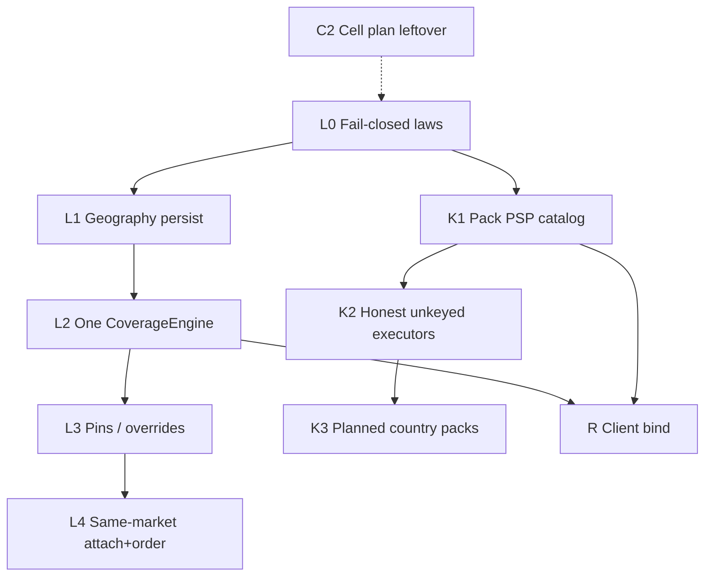

# GS-L / GS-K — Local multi-supplier ecosystem (backend + infra)

**Final goal (2026-08-16):** this file + [`GLOBAL_SCALE_PROGRAM.md`](./GLOBAL_SCALE_PROGRAM.md) are the destination. Agent load: `.agents/memory/GOAL.md`. Not status.

**Date:** 2026-08-16 (rev 2 — warehouse gaps closed into slices)  
**Tree:** `pegasusX/` (not `pegasus/`)  
**Ask:** Turn backend + infra into a multi-supplier, multi-country, multi-city, multi-region ecosystem that is **local-first**, **pack-smart** (currency / PSP / fiscal), and **easy to clone** into a new country by adding adapters + keys — without building cross-border commerce yet.

This plan **extends** the existing GS program ([`GLOBAL_SCALE_PROGRAM.md`](./GLOBAL_SCALE_PROGRAM.md)). It does not replace GS-A/T/M/C and does not implement 250 `BF-*` rows. Client visualization of these reads is [`GLOBAL_SCALE_CLIENT_UI.md`](./GLOBAL_SCALE_CLIENT_UI.md) (GS-U) — U0+U1+UN+UF+U2+U3+U4+U5+U6+U7+U8+U9 shipped.

**Rev 2:** Every warehouse gap from the live-path audit is a numbered **W-item** mapped to a GS-L / GS-K slice. Nothing warehouse-shaped stays “later / implied.” Class A warehouse ops (WMS, dispatch, freeze) stay KEEP.

---

## 0. Honest verdict (code this session)

```
VERDICT: PARTIAL
DOCS vs CODE: GS-A0–A2, T1–T5, M1–M7, C1, L0–L4, K1–K3, R supplier-portal
  + R warehouse-portal + R retailer clients + R POS/orders/insights
  + R claims/tracking/local-SKU + R role-portal currency bind
  + R maps camera bind + GS-U0 visualization contract + GS-U1
  StatusStack kit + GS-UN primary nav ≤5 + GS-UF freshness
  + GS-U2 supplier command + GS-U3 Plan & Brain + GS-U4
  warehouse command + GS-U5 factory command + GS-U6 retailer
  command + GS-U7 field (payload board + driver stepper)
  + GS-U8 platform admin (dead_letter_count = COUNT(*))
  + GS-U9 role-row lock (chip → same status key) are
  real readers.
  checkout_reads_this remains open. Stripe/Adyen checkout-init
  is not a fake redirect.
BLOCKERS (ranked):
  1. checkout_reads_this still false (SSMR PEGASUS ≠ pack MY_SOLIQ)
CLOSED THIS SLICE:
  GS-U9 — StatusStack onSelect; supplier/retailer/warehouse/
    factory chips jump to the same status/state key. Dated
    skips in gs-u9-role-row-lock.test.ts. Place stays off.
NEXT: leftovers (GS-M flag, cells apply, live PSP). Not Layer B.
  checkout_reads_this still false. Not terraform apply, not
  Stripe keys, not flipping the flag, not swapping MapLibre
  for Google Maps.
```

**Isolation key stays `SupplierId`.** Market pack, home cell, country, city, region are attributes. Do not invent a second RLS key.

---

## 1. Product laws (lock before code)

These are product law, not UI preferences.

| # | Law | Meaning |
|---|-----|---------|
| L1 | **One tenant key** | Every durable row except `Retailers` is scoped by `SupplierId`. Pack/cell/country are attributes. |
| L2 | **Market owns money** | Currency, decimal places, PSP list, fiscal adapter, payout rail come from **shipped** `MarketPack`. Retailer / warehouse / factory **cannot** set currency. Keep `ORDER_CURRENCY_PICKER_ENABLED` off. |
| L3 | **Same-market orders only** | An order is legal only when retailer location country, warehouse country, factory country (if used), and supplier `MarketCode` country are the same ISO-3166-1. Cross-country order / attach / payout / card capture → `422 cross_market_deferred`. |
| L4 | **Local-first default** | Retailer store → **closest covering warehouse** of that supplier. Warehouse replenish → **closest factory** on a `SupplyLane` (or same-country factories if no lanes). |
| L5 | **Supplier override wins** | When adding/editing a warehouse or factory, supplier may pin: city set, region, or **specific store/location**. Resolution order is in §3. |
| L6 | **Empty geography fail-closed** | Missing `CountryCode` on a warehouse/factory/store used for matching is **not** "worldwide." It is `422 geography_incomplete`. L0: `WarehouseCoversRetailer` rejects empty country. L1: writers stamp pack country so matching rows are not empty. |
| L7 | **Pack filters PSP UI** | GET available gateways = pack `psp_adapters` ∩ registered executors. A UZ warehouse must never see Stripe/Adyen/US-only rails as selectable. A CA warehouse must never see Global Pay / Payme as selectable. |
| L8 | **Unkeyed ≠ success** | Missing PSP/fiscal/SMS keys → honest `501` / `no_live_keys` / `adapter_unkeyed`. Never a 200 redirect to `/v1/payment/redirect/stripe/{id}`. |
| L9 | **One country = one pack + 1–3 adapters** | Adding Canada is: `CA` MarketPack + PSP + fiscal + SMS (+ cell later). Not a fork. Not a new tenant key. |
| L10 | **Class A stays** | Integer minor money, fiscal hard-gate, pay-at-delivery, dual factory/supplier manifests, H3 res **7**, outbox-in-txn, factory planning / auto-order **place** flag-off. |

**Explicit defer (this program):**

- Cross-country **orders, payments, payouts, fiscal, credit, FX checkout**. FX table may stay for display/metering; it must not open a PK→UZ order.
- Open-world public discovery / ads marketplace.
- `terraform apply` / second live cell (GS-C2 plan-only remains; C3+ is Boss/infra later).
- Flip `checkout_reads_this` until SSMR fiscal runtime matches UZ pack `MY_SOLIQ`.
- OIDC, PEPPOL live, Stripe/Adyen live executors (keys are Layer B).
- Retailer- or warehouse-chosen currency.

---

## 2. What already exists (opened this session)

### 2.1 Market / tenancy (REAL, leftover is honesty flag)

- `MarketPack` in `auth/market_pack.go:25` — UZ **shipped** (`UZS`, `GLOBAL_PAY`+`CASH`, `MY_SOLIQ`, `cell-uz`). EU/US/CA/AU/GB/KZ/PK **planned** (checkout fail-closed).
- Session + catalog: `GET /v1/auth/session`, `GET /v1/platform/market-packs`.
- JWT stamps `market_code` + `home_cell` (`auth/jwt.go`).
- `Suppliers.MarketCode` / `HomeCell` nullable (`schema/spanner.ddl:18`).
- Tenant register `POST /v1/platform/tenants/register` mints UUID + shipped pack.
- Retailer attach requires `supplier_id` or invite (`retailer/attach_test.go`).
- `ParentOrders` + child `Orders.SupplierId` — multi-supplier cart split **schema + backend**.
- Checkout/fiscal/radius/TZ/currency/payout/tax **read shipped pack** (M1–M7). `CheckoutReadsThis: false` on purpose (`market_pack.go:131`).

### 2.2 Local matching (PARTIAL — two engines)

**Order path (closer to the product):**

- `order.SpannerWarehouseResolver.ResolveNearestWarehouseID` (`order/warehouse_resolver_spanner.go:23`) — active + on-shift warehouses, hybrid cover, then Haversine closest.
- Hybrid cover (`order/coverage.go:99`): **L0** empty country **returns false**; countries must match **even when cells are set**; no cells → whole warehouse country.
- Order create uses this resolver (`order/service.go:1256`). Empty result → `no_eligible_warehouse` / zone miss.
- Coverage persist exists: `WarehouseCoverageCells` + `WarehouseCoverageCities` (`spanner.ddl:458–477`). `CoverageMutations` expands city → compacted H3 disk k=4 (`order/coverage.go:11`, `coverage_persist.go:13`).
- Supplier topology write accepts `country_code`, `coverage_cities`, `assigned_factory_ids` (`supplier/portal_handlers.go:169`, `repository_spanner.go:1073–1088`).

**Catalog stock path (different, drift):**

- `catalog/stock.go:91` `resolveNearestWarehouse` uses **`CoverageRadiusKm` only**. Ignores country, coverage cells, on-shift, store pins. Reads `Retailers.Latitude/Longitude` (`:77`) while DDL columns are `Lat`/`Lng` (`spanner.ddl:137`) — likely silent miss.

**Warehouse self-setup gap:**

- `POST /v1/warehouse/setup` (`warehouse/setup.go:87`) inserts name/address/lat/lng/radius/primary factory. **Does not write** `CountryCode`, `H3Cell`, coverage cells, `RegionId`.

### 2.3 Factory (PARTIAL)

- `Warehouses.PrimaryFactoryId` / `SecondaryFactoryId` + `SupplyLanes` (`spanner.ddl:429`, `:3134`).
- Replenish / transfer resolve factory from **primary only** (`warehouse/transfers.go:266`). Missing primary → error, not closest.
- `SupplyLaneMutations` writes edges on topology save. No "closest factory in same country" reader.

### 2.4 Regions / cities (THEATRE schema)

- `Regions` + `RegionalConfigs` (`spanner.ddl:1098`) — **no Go INSERT/SELECT** this tree. Dead table. Also **no `SupplierId`** — unusable as product geography without a reshape.
- `Warehouses.RegionId`, `Retailers.RegionId` exist; unused as matching keys.
- `RetailerLocations` (`:2153`) has lat/lng/H3, **no `CountryCode`**.

### 2.5 Payments (PARTIAL — honesty executors, not live charges)

- Pack intersection at checkout: `applyPackToGatewayPolicy` (`payment/policy.go:132`). UZ rejects `STRIPE` (`auth/checkout_pack_test.go:47`).
- Warehouse / supplier payment POST allowlists **deleted (K1)**. GET/POST use `payment.AvailablePSPs` + `auth.AssertPackPSP`. Empty config = live pack adapters (UZ: CASH+GLOBAL_PAY). STRIPE/ADYEN on UZ → 422.
- `NormalizeGatewayPolicy(nil)` still invents CASH+GP for legacy tests; product paths use `NormalizeGatewayPolicyForPack`.
- Router (`payment/execution.go:139-152`): `GLOBAL_PAY` is a real adapter; `STRIPE`/`ADYEN`/`PAYME`/`CLICK` are `catalogHonestyExecutor` (`adapter_planned` / `no_live_keys` → HTTP 501). CASH/INTERNAL/CREDIT stay manual `staticProviderExecutor` without a redirect URL.
- Payme/Click are on the UZ pack as **unkeyed** catalog rows (K1). Checkout execute returns `501 no_live_keys` (K2).
- `countrycfg` lists US with `GLOBAL_PAY` (`countrycfg/catalog.go:24`) — contradicts MarketPack US=`STRIPE`. Checkout must **not** read countrycfg (already documented; keep that).

### 2.6 Infra (C1 REAL plan-only; C2 files already on disk)

- Live: one project `pegasus-503013`, `asia-south1`, state `pegasusx/ssmr`.
- C1: per-cell `backend-*.hcl`. C2 **tfvars already exist**: `infra/terraform/cells/{uz,eu}/` (`cells/eu/cell.tfvars` — `pegasusx-cell-eu`, `europe-west1`, empty JWT). **Do not apply from this plan.**
- Cross-cell = partner/EDI, never shared Spanner/Kafka/JWT.

### 2.7 Warehouse gap register (close these — do not leave implied)

Warehouse is the local hub. Class A ops are KEEP. These **W-items** are the geography / matching / money gaps. Each has an owner slice in §4. A slice is not done until every W-item it owns has a test.

| ID | Gap (code) | Severity | Owner slice |
|----|------------|----------|-------------|
| **W1** | `POST /v1/warehouse/setup` does not write `CountryCode`, `H3Cell`, coverage (`warehouse/setup.go:87`) | P0 | **L1 done** |
| **W2** | `PATCH /v1/warehouse/ops/location` updates lat/lng/address only — no pack country, no H3 res 7, no coverage (`warehouse/location_ops.go:31`) | P0 | **L1 done** |
| **W3** | Supplier topology persists H3 at **res 9**; checkout matching is **res 7** (`supplier/repository_spanner.go:1043` vs `order/unified_checkout.go:18`) | P0 | **L1 done** |
| **W4** | Warehouse CRUD does not derive `H3Cell`; empty if client omits it (`warehouse/repository_crud.go`) | P1 | **L1 done** |
| **W5** | Three writers (setup / CRUD / topology) persist different columns — no single `StampWarehouseGeography` | P0 | **L1 done** |
| **W6** | `WarehouseCoversRetailer`: empty country **returns true** (`order/coverage.go:107`) | P0 | **L0 done** |
| **W7** | If coverage cells exist, **country is not checked** — cells can match a foreign store (`coverage.go:102–104`) | P0 | **L0 done** |
| **W8** | Catalog stock picker ≠ checkout picker (`catalog/stock.go:91` uses radius only; ignores country, cells, on-shift) | P0 | **L2** |
| **W9** | Catalog loads `Retailers.Latitude/Longitude` — live columns are `Lat`/`Lng` (`catalog/stock.go:77`) | P0 | **L2** |
| **W10** | Unified checkout fallback reads `Latitude`/`Longitude` (`order/unified_checkout.go:441`) | P0 | **L2** |
| **W11** | Checkout ignores JWT `active_location_id` and `RetailerLocations` — uses body pin or broken fallback | P0 | **L2** |
| **W12** | `CoverageRadiusKm` stored (setup default 25) and **ignored** at checkout; only catalog uses it | P1 | **L2** — checkout law is cells/country/pins, not radius. Radius becomes display / optional soft hint, or is deleted from matching. Do not keep two catchment models. |
| **W13** | Warehouse `H3Cell` unused by resolver | P2 | **L2** — resolver ranks from lat/lng; persist res-7 cell for indexes only |
| **W14** | `Warehouses.RegionId` / `Retailers.RegionId` unused; `Regions` table has **no Go read/write** | P1 | **L3** — do not reuse `Regions`; new `SupplierRegions` if needed |
| **W15** | No store → warehouse pin table; client cannot (and must not) pass `warehouse_id` on create | P0 | **L3** |
| **W16** | Factory resolve is `PrimaryFactoryId` only (`warehouse/transfers.go:266`, `supply_topology.go:18`) | P0 | **L2** |
| **W17** | `SupplyLanes` written, never read for nearest factory | P1 | **L2** |
| **W18** | `HandleSupplyRequestAccepted` falls back warehouse to `"wh-1"` if payload omits it (`warehouse/service.go:486`) | P0 | **L1 done** — fail-closed, no seed id |
| **W19** | Warehouse payment POST allowlist `GLOBAL_PAY\|ADYEN\|AIRWALLEX\|CASH` (`payment_config.go:36`); GET not pack-filtered | P0 | **K1 done** |
| **W20** | `warehouse.NewService` and `DeliveryFeeRules.Currency` invent `UZS` when empty (`warehouse/service.go:214`, `ops_policy.go:97`) | P0 | **L1 done** + **K1** (pack currency only) |
| **W21** | Redis `ssmr:delivery_perimeter` / per-supplier keys exist; **Create never calls** `IsRetailerInZone` | P1 | **L2** follow-up — derive perimeter from same coverage cells; do not keep a second truth |
| **W22** | Checkout preview is single-supplier (`checkout_preview.go:146`); create-split is per child | P1 | **L2** — preview must resolve warehouse **per supplier group** |
| **W23** | Supplier billing `allowedGateways` same hardcoded set as warehouse (`supplier/service.go:653`) | P0 | **K1 done** |
| **W24** | `available_card_gateways` on payment-required events is **unfiltered**; empty invents `GLOBAL_PAY` (`order/service.go:3258`) | P0 | **K1 done** |
| **W25** | Executor empty gateway defaults to `GLOBAL_PAY` (`payment/execution.go:225`) | P1 | **K2 done** |
| **W26** | Factory setup / ops location omit country (same as W1/W2 on factory side) | P0 | **L1 done** |

**Not a gap (product law):** retailer/warehouse must **not** send `warehouse_id` on checkout. Assignment is engine + supplier pins only.

**KEEP (do not rebuild):** WMS bins/lots/pick-waves, dispatch execute/freeze, dual manifests, pay-at-delivery, return QC, treasury read paths that already exist.

---

## 3. Target architecture (one picture)

```
Company register
  └─ SupplierId  +  MarketCode (UZ|CA|…)  +  HomeCell (cell-uz|…)
           │
           │  MarketPack is LAW: currency, psp[], fiscal, sms, tz, maps, payout
           │
     ┌─────┴──────────────────────────────────┐
     │           same-market only             │
     │                                        │
  Factories ──SupplyLanes──► Warehouses ──coverage/pins──► Retailer stores
     (local)                   (local)                      (local)
```

**Matching resolution (single function, every reader):**

```
ResolveServingWarehouse(supplier, store):
  1. Reject if any CountryCode empty                    → geography_incomplete
  2. Reject if store.country ≠ warehouse-candidate.country
       ≠ pack.country                                    → cross_market_deferred
  3. Pin on RetailerLocations.LocationId                → that warehouse
  4. Pin on RetailerId                                  → that warehouse
  5. Pin on supplier RegionId                           → closest among pinned set
  6. WarehouseCoverageCells non-empty                   → H3 membership, then closest
  7. Else same-country warehouses                       → closest Haversine
  8. None                                               → zone_miss
```

**Factory resolution:**

```
ResolveSupplyFactory(warehouse):
  1. PrimaryFactoryId if same country and active
  2. Else highest-priority active SupplyLane in same country
  3. Else closest same-country factory
  4. None                                               → factory_unassigned
```

**Override UX (supplier adding warehouse/factory):**

| Mode | What they set | Stored as |
|------|----------------|-----------|
| Default (recommended) | Pin on map only | `CountryCode` + H3; empty coverage = whole country, closest wins |
| City / region | Selected cities (already `coverage_cities`) or a supplier region | `WarehouseCoverageCities/Cells` or pin `REGION` |
| Specific stores | Multi-select retailer locations | `ServicePins` (`TARGET_LOCATION`) |

Retailer "fetch closest warehouse" and warehouse "fetch closest factory" are the **same engine**, not two queries.

---

## 4. Phased modules

One module = one PR-sized slice. Independent tests. No `terraform apply`. Do not implement later phases "while we're here."



L and K streams may run in parallel after L0. R (clients) starts after L2+K1 contracts exist. C2 stays plan-only.

---

### GS-L0 — Fail-closed laws (S, first)

**Goal:** Stop silent worldwide matching and dual-catalog confusion. Docs + small code.

**Closes:** W6, W7

**Code**

- Change `WarehouseCoversRetailer` so empty warehouse or retailer country is **false** (`order/coverage.go:107`).
- **Also when cells are set:** require `warehouse.CountryCode == retailer.CountryCode` (both non-empty) **and** H3 membership. Cells never override country.
- Add sentinels: `ErrGeographyIncomplete`, `ErrCrossMarketDeferred` in `order/` (or `auth/` if pack-level).
- Stamp in `GLOBAL_SCALE_PROGRAM.md` / this plan: countrycfg is **signup picker only**; MarketPack is product law. Do **not** add a `CountryConfigs` Spanner table.
- Do not enable `ORDER_CURRENCY_PICKER`.

**Exit**

- `go test ./order/ -count=1` — empty country no longer covers; UZ warehouse + PK retailer false even if cells overlap; UZ+UZ + empty cells true.
- Proof grep: no new `UZDefault()` / hardcoded `city:Tashkent` product law.

**Non-goal:** new tables, new packs, UI.

---

### GS-L1 — Geography persist on every node (M)

**Shipped 2026-08-16.** Helper `proximity.StampNodeGeography`. Writers stamp pack country + H3 res 7. Topology `country_code=US` on UZ → 422. Supply accept missing id → `warehouse_id_required`. Empty warehouse currency → `auth.PackCurrency`. Schema: `RetailerLocations.CountryCode` + `schema/migrations/20260816_gs_l1_retailer_location_country.ddl`. Unit tests lock the helper and 422 paths; no live Spanner apply this slice.

**Goal:** Every warehouse / factory / store used for matching has `CountryCode` + H3 **res 7**, inherited from pack if omitted, **rejected** if it disagrees with pack country.

**Closes:** W1, W2, W3, W4, W5, W18, W20 (warehouse currency default), W26

**Schema**

- `RetailerLocations.CountryCode STRING(2)` (migration).
- Optional later: `Admin1` / `Locality` strings for display — not tenant keys.
- Do **not** reuse `Regions` as-is (no SupplierId). If supplier-defined regions are needed in L3, new table `SupplierRegions (SupplierId, RegionId, CountryCode, Name, …)`.

**One helper, every writer:** `StampNodeGeography(pack, lat, lng, requestedCountry) → {CountryCode, H3CellRes7}`. Call it from **all** warehouse/factory write paths so W5 cannot recur.

**Writers that must stamp country + H3 res 7**

| Writer | Today | After |
|--------|-------|-------|
| `POST /v1/warehouse/setup` | no country/H3 (W1) | pack country + H3-7; reject mismatch |
| `PATCH /v1/warehouse/ops/location` | lat/lng/address only (W2) | same stamp; do not wipe coverage unless lat moved out of city disk |
| `POST/PUT /v1/warehouses` | H3 only if client sends (W4) | always derive H3-7 |
| Supplier topology upsert | H3 **res 9** (W3) | H3-7; country required or default pack; reject mismatch |
| Factory setup / factory ops location / factory CRUD / topology | omit country (W26) | same helper |
| Retailer register / setup / location create | country optional, not pack-checked | default pack country of attached supplier; reject mismatch |
| Supply accept missing warehouse | `"wh-1"` seed (W18) | error `warehouse_id_required` (async consumer) |

Geocode is best-effort (Maps adapter from pack). If geocode is down: require explicit country and still reject ≠ pack.

**Currency leak (W20):** `warehouse.NewService` and `DeliveryFeeRules` empty currency → pack currency via `auth.PackCurrency`, never invent `"UZS"`.

**Exit**

- Setup without country on UZ pack → persisted `UZ` + H3 res 7.
- Topology `country_code=US` on UZ supplier → `422 cross_market_deferred`.
- After setup, `Warehouses.CountryCode` and `H3Cell` non-empty in Spanner.
- Supply accept without warehouse id → `warehouse_id_required`, not `wh-1`.
- Warehouse delivery fee with empty currency → pack `UZS` (from pack, not a string literal in ops_policy).
- Tests: `./warehouse/` `./supplier/` `./factory/` `./retailer/` `./order/`.

---

### GS-L2 — One CoverageEngine (M)

**Shipped 2026-08-16.** `proximity.ResolveServingWarehouse` + `ResolveSupplyFactory` + `CoverageStore`. Catalog/order/preview/factory call the same engine. Active store from JWT `active_location_id`. PK vs UZ → `cross_market_deferred`.

**Goal:** Catalog, quote, unified checkout, preview, order create, retailer "nearest warehouse", and warehouse "nearest factory" all call **one** engine.

**Closes:** W8, W9, W10, W11, W12, W13, W16, W17, W21, W22

**Code**

- Lift `ResolveNearestWarehouseID` + cover rules into e.g. `pegasusX/apps/backend-go/proximity/coverage_engine.go` (or `order/` exported). Doctrine: H3 res 7, `GridDisk` + membership, Haversine only to rank an already-filtered candidate set. No `ST_Distance`.
- Delete `catalog/stock.go` private resolver. Fix `Latitude/Longitude` → `Lat`/`Lng` (W9). Same fix in `unified_checkout.go` fallback (W10).
- **Active store (W11):** resolve pin from JWT `active_location_id` → `RetailerLocations` (lat/lng/H3/country) → else `Retailers.Lat/Lng`. Body lat/lng may refine; they cannot change country.
- Include `IsOnShift` consistently (order already does; catalog does not).
- **W12:** checkout does **not** use `CoverageRadiusKm` as a second catchment. Matching is country + cells + pins + closest. Keep the column for display / seed only, or stop writing it as if it were law. Document in `warehouse/doc.go`.
- **W13:** persist warehouse `H3Cell` at res 7 for `Idx_Warehouses_ByH3Cell`; resolver does not require it if lat/lng present.
- Factory: `ResolveNearestFactoryID` per §3. Wire `resolveWarehouseFactory` **and** `resolveWarehouseSupplyContext` (W16). Read `SupplyLanes` for priority + closest fallback (W17). Same-country required.
- **W22:** `checkout_preview` groups lines by supplier the same way create does; each group runs the engine.
- **W21 (same PR or immediate follow-up):** if perimeter Redis is still published, write cells from `WarehouseCoverageCells` / country disk — same set the engine uses. Do not leave `ssmr:delivery_perimeter` as a third matcher. Create still does **not** SISMEMBER as a second veto until that publish is the same set.

**Scale note:** current resolver scans all active warehouses per supplier. Fine for tens–low hundreds per supplier. Before thousands: index `Warehouses(SupplierId, CountryCode)` and optional H3 disk prefilter (`Idx_Warehouses_ByH3Cell` already exists). Not this PR unless a test proves it.

**Exit**

- Same fixture: two UZ warehouses, store nearer B, coverage empty → B on **order create, preview, and catalog stock**.
- Coverage city around A only → A even if B is closer.
- Active location in city A, JWT set, body omits lat → still A’s warehouse.
- PK retailer vs UZ warehouses → zone_miss (after L0).
- Two factories, no primary → closest same-country; `SupplyLanes` priority respected when present.
- Grep: `Latitude` / `Longitude` must not appear as `Retailers` columns in `catalog/` or `order/`.
- `go test ./order/ ./catalog/ ./warehouse/ ./proximity/ -count=1`.

**Non-goal:** store pins (L3), new countries.

---

### GS-L3 — Supplier overrides: region + specific store (M)

**Goal:** Override the default closest algorithm.

**Closes:** W14, W15

**New table** (do not abuse unused `Regions`):

```
ServicePins (
  PinId, SupplierId, WarehouseId,
  TargetType,   -- LOCATION | RETAILER | REGION | CITY
  TargetId,     -- location_id / retailer_id / supplier_region_id / city key
  Priority INT64,
  CreatedAt, UpdatedAt
)
PRIMARY KEY (PinId)
UNIQUE (SupplierId, WarehouseId, TargetType, TargetId)
INDEX (SupplierId, TargetType, TargetId)
```

Optional `SupplierRegions` if the supplier wants named regions ("Tashkent metro", "Ferghana valley") as groups of cities/H3 — still **inside** pack country.

**API (supplier ADMIN)**

- `PUT /v1/supplier/warehouses/{id}/coverage` — cities (already conceptually exist on topology) + pins.
- `PUT /v1/supplier/warehouses/{id}/pins` — replace pins for that warehouse (idempotent).
- GET returns effective mode: `COUNTRY_CLOSEST` | `CITY_CELLS` | `PINNED`.

**Engine:** insert steps 3–5 from §3. Pin to a location in another country → `422`.

**Factory override:** already `PrimaryFactoryId` + `SupplyLanes`. L3 only adds same-country assert + closest fallback from L2.

**Exit**

- Pin store S to warehouse A; store is geographically closer to B → order + catalog use A.
- Unpin → back to closest.
- Pin across country → 422.
- Tests in `./order/` `./supplier/`.

**Clients:** supplier portal first; Android/iOS supplier in GS-R. Warehouse portal may **view** pins + “stores I serve” (engine read). Warehouse must **not** re-pin another warehouse’s stores. Optional later: warehouse requests a pin; supplier ADMIN confirms.

**W14:** stop PATCHing `Warehouses.RegionId` to a global `Regions` id. Either ignore the field or point it at `SupplierRegions`. No `/v1/region*` against the dead table.

**Shipped 2026-08-16:** schema + engine + supplier ADMIN GET/PUT pins, coverage, regions. Create/update warehouse also reject unknown `region_id`. Backend API only — portal editor is GS-R.

---

### GS-L4 — Same-market attach + order hard gate (S–M)

**Goal:** System "detects" Uzbekistan vs Pakistan at the **relationship**, not after checkout.

**Code**

- Retailer register / attach: load supplier `MarketCode` → pack country; retailer `CountryCode` must match. Invite tokens carry pack; redeem in another country → 422.
- Order create / unified checkout / quote: after warehouse resolve, assert pack country == retailer country == warehouse country. Defense in depth (L0+L2 already filter).
- ParentOrders: every child supplier must share the **same** pack country. Mixed UZ+KZ cart → 422 `cross_market_deferred` (do not split into two countries).
- Credit / payout / fiscal: refuse if order already violated (should be unreachable).

**Exit**

- Attach UZ retailer to KZ planned supplier → 404/422 (planned pack already 404 on checkout; attach should not succeed either).
- Mixed-country parent cart → 422, no child rows.
- Tests: `./retailer/` `./order/` `./payment/`.

**Non-goal:** FX conversion path for those orders.

**Shipped 2026-08-16:** attach + invite + parent-cart + create/unified defense. Planned child on a parent cart is 404 `market_pack_not_shipped` (KZ is planned; no second shipped pack exists). That still inserts no parent row.

---

### GS-K1 — Pack-owned payment catalog (M)

**Goal:** When a supplier or warehouse configures card acceptance, they only see **this market's** options.

**Closes:** W19, W20 (PSP/currency lists), W23, W24

**Code**

- Single registry, e.g. `payment/catalog.go`:

```go
type PSPAdapter struct {
  Code        string   // GLOBAL_PAY, STRIPE, ADYEN, PAYME, CLICK, …
  Markets     []string // ISO / pack codes that may list it
  Status      string   // live | unkeyed | planned
  NationalCards bool
}
```

- `AvailablePSPs(pack) []PSP` = adapters whose `Markets` contain pack code **and** pack.PSPAdapters contains code.
- Warehouse GET/POST (`warehouse/payment_config.go`) and supplier `SelectedGatewaysJson` **must** `AssertPackPSP`. Delete hardcoded `allowedWarehouseGateways` Adyen/Airwallex (**W19**). Same delete on supplier billing allowlist (**W23**).
- Empty policy default = pack `psp_adapters` (always include `CASH` if pack allows), **not** hardcoded Global Pay.
- `available_card_gateways` on payment-required / checkout events = pack-filtered list; never invent `GLOBAL_PAY` if pack forbids it (**W24**).
- GET response honesty: `{ code, status: live|unkeyed|planned, selectable: status!=planned }`.

**UZ first list (shipped):** `CASH`, `GLOBAL_PAY` (live adapter, keys may still be Layer B). Optional catalog rows `PAYME`, `CLICK` as `unkeyed` **only if** added to UZ `PSPAdapters` — today they are webhook files but not on the pack. Decision: **add them as unkeyed UZ-local card rails** so the UI is country-true; selecting them without keys → K2 501.

**Exit**

- UZ GET never returns STRIPE/ADYEN as selectable.
- POST STRIPE on UZ → 422 `pack_gateway_forbidden`.
- Empty warehouse config on UZ → CASH + GLOBAL_PAY (pack), not Adyen.
- `go test ./payment/ ./warehouse/ ./auth/`.

---

### GS-K2 — Honest placeholder executors (M)

**Shipped 2026-08-16.** `catalogHonestyExecutor` for STRIPE/ADYEN (`adapter_planned`) and PAYME/CLICK (`no_live_keys` → HTTP 501). Empty gateway resolves through `LivePackGateways` (UZ still GLOBAL_PAY). CASH/INTERNAL/CREDIT stay manual `staticProviderExecutor` without `urlPrefix`. Chargeback record/reversal on planned rails is local ledger only.

**Goal:** Architecture can accept any country's PSP; missing keys never look like a charge.

**Code (shipped)**

- `catalogHonestyExecutor` on STRIPE/ADYEN/PAYME/CLICK (`payment/execution.go:149-152`, `:363-387`):
  - `planned` → `adapter_planned` (no redirect URL)
  - `unkeyed` → `501 no_live_keys`
- Empty gateway uses `LivePackGateways` (UZ: GLOBAL_PAY + CASH), not a hardcoded GLOBAL_PAY string (**W25**).
- Keep `ProviderExecutor` interface. New country = pack row + honesty or live executor.
- Live path remains Global Pay + cash + credit (existing).
- Fiscal already fail-closes PEPPOL/planned (`auth/fiscal_pack.go:67`). Same shape for SMS/maps later.

**Exit**

- Checkout init STRIPE (if somehow requested) does **not** return a redirect URL.
- Tests lock theatre closed: `./payment/` asserts no `urlPrefix` success for Stripe/Adyen.

**Non-goal:** implement Stripe/Adyen APIs. That is Layer B + legal entity in that country.

---

### GS-K3 — Planned packs for clone-ready countries (S)

**Shipped 2026-08-16.** CA/AU/GB/PK planned on `ListMarketPacks`. EU/US include ADYEN. countrycfg `PaymentGatewaysListed` is empty. Checkout stays fail-closed.

**Goal:** Catalog is wider than UZ/EU/US/KZ so "add Canada" is keys + ship-the-pack, not a schema project.

Add **planned** packs (checkout stays fail-closed until `status=shipped` **and** at least cash works):

| Pack | Cell | Currency | Fiscal (placeholder) | PSP listed | Payout | Why these PSPs |
|------|------|----------|----------------------|------------|--------|----------------|
| UZ shipped | cell-uz | UZS | MY_SOLIQ | GLOBAL_PAY, CASH, (+ PAYME/CLICK unkeyed) | bank-file | Existing; local cards via GP / Payme / Click |
| EU planned | cell-eu | EUR | PEPPOL / COMMERCIAL | STRIPE, ADYEN, CASH | sepa-file | Adyen local acquiring EU; Stripe national cards + wallets |
| US planned | cell-us | USD | COMMERCIAL | STRIPE, ADYEN, CASH | ach-file | Same; US card networks |
| CA planned | cell-ca | CAD | COMMERCIAL | STRIPE, ADYEN, CASH | eft-file | Same; Interac later as extra adapter |
| AU planned | cell-au | AUD | COMMERCIAL | STRIPE, ADYEN, CASH | becs-file | Adyen AU acquiring; Stripe AU cards |
| GB planned | cell-gb | GBP | COMMERCIAL | STRIPE, ADYEN, CASH | bacs-file | Strong local card + Faster Payments later |
| KZ planned | cell-kz | KZT | PLANNED | CASH | bank-file | Cash-first until local PSP chosen |
| PK planned | cell-pk | PKR | PLANNED | CASH | bank-file | JazzCash/Easypaisa/PayFast as **named unkeyed** later — no fake live |

**Rule:** `planned` pack → register 404 (already T1), checkout 404 (already M1). Shipping a pack requires: currency locked, cash path green, fiscal adapter either COMMERCIAL (allowed) or a real adapter, PSP list filtered.

Do **not** mark CA/AU/PK shipped in this phase.

Align `countrycfg` listed gateways with pack or stop returning gateway lists from countrycfg (preferred: countrycfg returns geography/TZ only).

**Exit**

- `GET /v1/platform/market-packs` includes CA/AU/GB/PK as `planned`.
- `RequireCheckoutPack(CA)` → not shipped.
- `go test ./auth/`.

---

### GS-R — Client bind (continuous, after L2+K1)

Doctrine role rows. Minimum for this program:

| Role | Must show |
|------|-----------|
| Supplier portal | Coverage mode, city/pin editor, pack currency read-only, PSP list from GET catalog |
| Supplier Android/iOS | Same or "manage on desktop" with deadline |
| Warehouse portal | Payment config = pack list only (W19); nearest factory **read-only from engine**; coverage/pins **view**; no currency picker; location editor shows pack country locked |
| Retailer desktop/Android/iOS | Currency from session pack; nearest warehouse implicit; no currency/PSP from another country |
| Driver | Currency/fiscal labels from pack (already M path) |

No web-only currency. No "Stripe" button on UZ.

**Shipped 2026-08-16 (supplier portal row):** payment-catalog GET, pin/coverage editor, pack currency lock, UZ catalog has no Stripe. Mobile handoff deadline 2026-09-16.

**Shipped 2026-08-16 (warehouse portal row):** ops coverage/supply-factory GET, pack PSP catalog + locked country/currency on portal+iOS+Android.

**Shipped 2026-08-16 (retailer clients row):** payment-catalog GET; desktop/iOS/Android checkout + payment-required filter pack rails; no currency picker; no Adyen default on empty card list.

**Shipped 2026-08-16 (POS·orders·insights leftover):** POS/shift open stamp pack currency; HQ insights coalesce pack; desktop/iOS/Android POS+orders+insights labels use pack.

**Shipped 2026-08-16 (claims·tracking·local-SKU leftover):** local-SKU create/list/PATCH stamp pack currency; desktop/iOS/Android claims + tracking labels + local-SKU create/display use pack.

**Shipped 2026-08-16 (role-portal UZS leftover):** supplier analytics/import + warehouse analytics/treasury stamp pack currency; supplier/warehouse portal+iOS+Android leftover labels use pack. Maps SDK leftover is continuous.

---

### GS-C2 — Cell scaffold leftover (plan only, when asked)

Already on disk: `infra/terraform/cells/{uz,eu}/`. Next **when asked**: `make cell-plan CELL=eu` artifact. **No apply.** C3 (new GCP project, new JWT, no Soliq on EU) is Boss/infra after a sold EU cell.

A new **country** does not require a new cell on day one (a planned pack can live in `cell-uz` **only** as catalog — checkout still 404). A **shipped** second country needs its own cell (data residency + JWT + PSP secrets). Cross-cell writes stay forbidden.

---

## 5. Technical case matrix (must have tests)

| Case | Expected |
|------|----------|
| One supplier, one city, one warehouse, no coverage rows | All same-country stores resolve to that warehouse |
| Two warehouses same city | Closest wins; tie → stable WarehouseId `<` (already `isCloserWarehouse`) |
| Coverage cities on A, store in B's city | A only if cell membership; else closest remaining same-country |
| Store pin to farther warehouse | Pin wins |
| Unpin | Back to closest |
| Warehouse off-shift | Skipped (order path today; catalog must match) |
| Empty warehouse country | `geography_incomplete`, not worldwide |
| UZ store + UZ supplier + PK warehouse row | Impossible after L1; if present, resolve skips |
| Retailer attaches two UZ suppliers | ParentOrders split; each child nearest **that** supplier's warehouse |
| Mixed UZ+US cart | 422 deferred; no children |
| Catalog stock vs checkout warehouse | Same id |
| Factory missing primary, two factories | Closest same-country |
| Primary set to other-country factory | 422 on write (L1); resolve ignores |
| UZ warehouse GET PSPs | No Stripe |
| UZ POST Adyen | 422 |
| Stripe checkout init | 501/422, no redirect |
| Planned pack checkout | 404 |
| Currency in body `USD` on UZ | 422 `pack_currency_mismatch` (already M1) |
| `ORDER_CURRENCY_PICKER` on | Out of scope; do not ship on |
| Perimeter Redis vs coverage engine | W21: publish from coverage cells; Create does not SISMEMBER a different set |
| Setup warehouse, no country | W1: row has pack `CountryCode` + H3-7 |
| PATCH ops location | W2: country remains pack; H3-7 updated |
| Topology then checkout | W3: same res-7 cell membership |
| Catalog vs checkout warehouse id | W8/W9: identical |
| Body omits lat; JWT has active location | W11: that store’s warehouse |
| CoverageRadiusKm=1 but store 5 km in same country, no cells | W12: still assigned (closest), radius is not law |
| Cells drawn across border | W7: country still rejects |
| Supply accept, no warehouse in payload | W18: `warehouse_id_required`, not `wh-1` |
| Warehouse GET payment-config on UZ | W19: no Adyen/Stripe selectable |
| Payment-required event card list | W24: pack-filtered |
| Delivery fee currency empty | W20: pack currency |

---

## 6. Non-technical case matrix (not solved by Go)

These are **N-track**. Code can only fail closed and show the right catalog. Boss/legal/ops own the rest.

| ID | Country / topic | What must exist before `status=shipped` |
|----|-----------------|----------------------------------------|
| N1 | Legal entity | Local company or registered foreign merchant; cannot take national cards as a UZ TIN in Canada |
| N2 | PSP contract | Global Pay (UZ); Stripe/Adyen merchant account **in that country**; Payme/Click merchant IDs |
| N3 | Fiscal / tax | UZ: MY_SOLIQ + EDS + TIN. EU: PEPPOL or commercial-receipt policy + VAT. US/CA/AU: commercial + sales-tax decision. PK: FBR/POS integration is a **new adapter**, not Soliq |
| N4 | KYB fields | Pack required tax-id type (INN / VAT / EIN / BN / ABN / NTN) — T3 already dual-controls pack+cell |
| N5 | Data residency | GDPR/PIPEDA/AU Privacy → **own cell** (own Spanner/Kafka/JWT). Do not serve EU PII from `asia-south1` as a shipped claim |
| N6 | Payout rail | UZ bank-file; EU SEPA; US ACH; CA EFT; AU BECS; GB BACS. File format + bank agreement |
| N7 | SMS / OTP | PlayMobile UZ; Twilio elsewhere; Firebase SHA/APNs **per cell** |
| N8 | Maps | Google/Apple keys per cell; geocoding country must match pack |
| N9 | Labor / cash custody | Pack hours already M4; local labor law is display + soft gate, not payroll SoT |
| N10 | Support SOP | Force-complete, cash shortfall, PSP chargeback — per language + fiscal authority |
| N11 | Cross-border legal | Customs, dual VAT, correspondent banking, sanctions — **why L3 law defers orders** |
| N12 | National card schemes | UZ Uzcard/Humo via GP/Payme/Click; EU local debit via Adyen/Stripe; US Visa/MC/Amex; CA Interac (later adapter); AU eftpos (often via Stripe/Adyen); PK 1LINK / JazzCash — list in catalog **before** keys |

**Cloud day for a new country:** secrets in GSM + flip pack to shipped + cell env. If any T-item from §4 is open, verdict is **NOT READY FOR LAYER B**.

---

## 7. Infra / cloud (what changes, what does not)

**Do now (code only):** pack catalog, coverage engine, pins, fail-closed country, honest PSP registry.

**Do not from this plan:** `terraform apply`, second GKE, copy UZ JWT to EU, default `FISCAL_PROVIDER=MY_SOLIQ` on a non-UZ cell, one global Spanner.

**When a second country is actually sold:**

1. Ship pack only after cash + geography + PSP catalog (K1–K3, L1–L4) are green on fakes.
2. C3: new project, new JWT, regional GSM, empty adapters OK.
3. C4: isolation proof (EU GSA cannot read UZ Spanner).
4. Layer B: PSP + fiscal + SMS + Maps keys for **that** cell only.

---

## 8. Implementation order (PRs)

| PR | Slice | Closes | Depends | Proof |
|----|-------|--------|---------|-------|
| 1 | L0 fail-closed cover + country-even-with-cells | W6 W7 | — | `go test ./order/` |
| 2 | K1 pack PSP catalog + warehouse/supplier/event filter | W19 W23 W24 | — | `./payment/ ./warehouse/ ./supplier/ ./auth/` |
| 3 | K2 unkeyed executors + no GP default **shipped** | W25 + theatre | K1 | `./payment/` |
| 4 | L1 `StampNodeGeography` on **all** warehouse/factory writers + kill `wh-1` + pack currency default **shipped** | W1–W5 W18 W20 W26 | L0 | `./warehouse/ ./supplier/ ./factory/ ./retailer/` |
| 5 | L2 CoverageEngine + active store + preview-per-supplier + factory/lanes **shipped** | W8–W13 W16 W17 W21 W22 | L1 | `./order/ ./catalog/ ./warehouse/ ./proximity/` |
| 6 | L3 ServicePins + SupplierRegions (not dead `Regions`) **shipped** | W14 W15 | L2 | `./order/ ./supplier/ ./proximity/ ./warehouse/` |
| 7 | L4 attach + parent-cart same-market **shipped** | — | L1 | `./retailer/ ./order/ ./payment/ ./auth/` |
| 8 | K3 planned CA/AU/GB/PK packs **shipped** | — | K1 | `./auth/` |
| 9 | R supplier portal coverage + pin editor + pack PSP **shipped** | W15 UI | L3+K1 | `supplier-portal` vitest + `./supplier/` |
| 10 | R warehouse portal: pack PSP, locked country, factory view, pins view **shipped** | W19 UI W16 UI | K1+L2 | warehouse portal + Android/iOS |

C2 `make cell-plan` only if explicitly asked. No apply.

---

## 9. Key decisions

1. **Extend GS, do not start a parallel "global rewrite."** Next *claimed* country still requires GS-M leftover (flag) + a shipped pack. This program adds **intra-country topology** (L) and **honest multi-PSP catalog** (K).
2. **Local-first, override-second.** Default is closest same-country node. Pins/cities are explicit supplier writes.
3. **One engine.** Order vs catalog drift is a P0 correctness bug for multi-warehouse suppliers.
4. **Empty country is a defect, not "global."**
5. **Currency is pack-owned.** No warehouse/retailer currency setup. FX stays display/metering; not checkout.
6. **Cross-border commerce deferred** with a stable error code so clients can localize "not available yet."
7. **Unused `Regions` table is not the product model.** New `SupplierRegions` / `ServicePins` if needed.
8. **Stripe/Adyen are the right *catalog* defaults for EU/US/CA/AU/GB** (local acquiring + national cards). They stay unkeyed/planned until a legal entity + keys exist. UZ stays Global Pay (+ optional Payme/Click).
9. **Placeholder adapters are first-class** (`planned` / `unkeyed`), not fake 200s.
10. **`SupplierId` remains the only tenant key.** Cloning Canada is pack + adapters + (later) cell.
11. **One warehouse geography helper.** Setup, ops location, CRUD, and topology all call `StampNodeGeography`. A fourth writer is a P0 if it skips it.
12. **`CoverageRadiusKm` is not catchment law.** Cells + country + pins + closest are. Radius stays decorative or is dropped from matching.

---

## 10. Open questions (defaults if unanswered)

| Q | Default in this plan | Alternative |
|---|----------------------|-------------|
| Add Payme/Click to UZ pack as unkeyed? | **Yes** — country-true catalog | Keep UZ = GP+CASH only |
| Supplier-defined regions in L3 or cities-only? | Cities + store pins first; `SupplierRegions` if a second warehouse group appears | Build regions in L3 |
| Off-shift warehouse: skip or still assign? | **Skip** (match order resolver) | Assign but flag |
| Pin conflict (two warehouses pin same store)? | **Lowest WarehouseId** + 409 on second pin write | Last-write-wins |
| Perimeter Redis vs coverage | Derive perimeter from coverage cells in a follow-up PR after L2 | Keep SSMR global key until EH1.1 |

---

## 11. What "done" is not

- Not "we listed 50 countries therefore we operate in 50 countries."
- Not cloud-ready, not Stripe-live, not Pakistan-fiscal-live.
- Not a second tenant key, not multi-region Spanner, not cross-border checkout.
- Not flipping `checkout_reads_this`.
- Not applying `cells/eu`.

**Done for this program:** every **W1–W26** item has an owner slice and a passing test; one CoverageEngine; fail-closed same-market law; supplier pin/city override; pack-filtered PSP catalog (warehouse + supplier + events); honest unkeyed adapters; planned packs for CA/AU/GB/PK/EU/US/KZ; clients not offering foreign currency or foreign PSPs.

A slice is **not done** if its W-items still reproduce on the live path.

After that, a new country is: legal entity + keys + `status=shipped` + (if residency requires) a new cell. The code path does not change.
