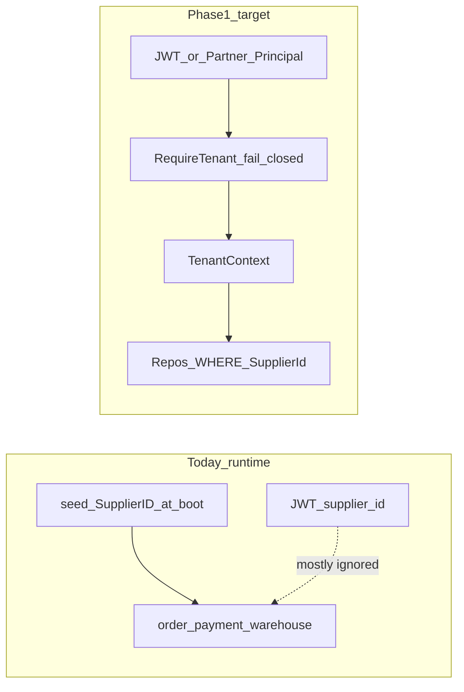

# ADR: Gate 5 / §8.10 Phase 1 — Request-scoped multi-tenancy

**Status:** Accepted — Phase 1 **Wired (Done)** (2026-08-11 live `tenant` smokecheck green); Outbox `SupplierId` NOT NULL closed; RoutePerformanceAnalytics column tenancy Wired
**Date:** 2026-08-07 (Done 2026-08-11)  
**Deciders:** Platform engineering  
**Related:** [PLATFORM_AUDIT.md](../PLATFORM_AUDIT.md) §8.10 + Gate 5; [privacy-multi-tenant.md](./big-platform-baseline/regulatory/privacy-multi-tenant.md); original Pegasus claim-scoped tenancy  

---

> **Runtime (post-Done, 2026-08-12):** Request-scoped tenancy is **live** — `TenantContext`, `RequireTenant`, `PreferTenantSupplierID`, outbox `SupplierId`, tenant rate limits. Seed remains bootstrap **fallback** only. Phase 2 ParentOrders + Phase 3 GlobalProducts are Wired (backend). Do **not** re-plan from the historical “1/10 / single-supplier by construction” narrative below.

## Context (historical motivation — pre–2026-08-11)

pegasusX’s Spanner schema is multi-tenant-shaped (`SupplierId` leads most keys). **Before Phase 1 shipped**, the request plane was single-supplier by construction:

- [`bootstrap/bootstrap.go`](../apps/backend-go/bootstrap/bootstrap.go) injected one seed `SupplierID` into many domain constructors.
- JWT `SupplierID` existed but many services preferred constructor seed fields.
- Multi-supplier registration could mint rows the request plane could not isolate.

**Pre-wire audit score was ~1/10.** Phase 1 was deliberately sequenced (not soft-flipped mid-flight) so fail-closed tenant middleware landed with domain migration.

### Behavioral reference

Original **Pegasus**: tenant = `SupplierId` from JWT (`claims.ResolveSupplierID()`), application-enforced `WHERE SupplierId = …`, shared Spanner DB (not RLS / not DB-per-tenant). pegasusX Phase 1 copies that model — it must not invent a second tenant key.

---

## Decision

Execute **§8.10 Phase 1 only** as a sequenced 12-week program:

1. **Freeze** multi-supplier registration until request tenancy is proven.
2. Introduce a shared **`TenantContext`** + **`RequireTenant`** fail-closed middleware.
3. Migrate domains in vertical slices (order/payment → warehouse/dispatch → driver/payload/factory/returns/credit → portal/workers).
4. Soft-partition **`OutboxEvents`** by `SupplierId` with fair worker leases.
5. Key **rate limits / quotas** primarily by tenant (not JWT `sub` alone).
6. Remove bootstrap-injected `supplierID` from domain services; seed remains fixtures-only.
7. Prove with IDOR suites + SSMR markers before marking audit Phase 1 Wired.

Phases 2–5 (multi-supplier cart, global product master, marketplace, platform admin console) stay **out of scope**.

---

## Non-goals (Phase 1)

| Out | Why |
|-----|-----|
| Phase 2 `ParentOrders` / cart split | Separate 30–50 file program after Phase 1 green |
| Phases 3–5 marketplace / KYB console | Gate 6 / product evidence |
| Per-supplier PSP / fiscal merchant accounts | Ops isolation track (**Phase 1.5 residual**) |
| Per-tenant `FxRates` | Rates stay global; conversion uses each supplier’s operating currency profile |
| Spanner RLS / interleaved tenant DB rewrite | App-enforced filters match Pegasus and schema already |
| Client multi-supplier UX | Retailer keeps one active trading-partner `SupplierID` until Phase 2 |

---

## Target architecture

| Concern | Decision |
|---------|----------|
| Tenant key | `SupplierId` string (unchanged) |
| Source of truth | Request context from JWT `supplier_id` (human) or `partner.Principal.TenantID` (machine) |
| Enforcement | `auth.RequireTenant` on authenticated HTTP; workers take tenant from job payload / row |
| Service structs | Delete constructor-bound `supplierID` (or demote to internal unscoped tools only); handlers use `TenantFromContext` |
| Operating currency | Lookup from supplier profile / env for seed fixtures — **not** a process-global substitute for tenant |
| Retailer role | JWT carries active trading-partner `SupplierID` until Phase 2; retailer lists filter by retailer; prove no seed-default cross-supplier leakage |
| Break-glass | Future `PLATFORM_ADMIN` with explicit audit — document placeholder only; **no console in Phase 1** |
| Dual context | Partner principal maps into the same `TenantContext` key; never mix human/partner without an explicit bridge |
| Flag | `TENANT_CONTEXT_ENFORCED` — off in prod until IDOR suite green; on in SSMR |

---

## Safety freeze (Week 0 — mandatory before request-derived tenancy)

DoD before any path trusts request tenant over seed:

1. Freeze multi-supplier mint: `MAX_SUPPLIERS=1` **or** `resolveRegistrationSupplierID` always returns seed / rejects new UUIDs.
2. Align stale package comments (“do not create new suppliers”) with actual behavior.
3. Test/SSMR: second register → cap/reject; no orphan supplier happy path.
4. Commit the inventory checklist below (bootstrap + `s.supplierID` sites).

**Policy preference:** keep registration frozen until Week 11 (bootstrap cleanup) is green, even if early verticals work — reopening mint mid-migration recreates the attribution bug.

---

## Bootstrap / seed injection inventory (starting checklist)

| Site | Location | Seed fields |
|------|----------|-------------|
| Seed ensure | `bootstrap.go` `seed.EnsureSupplier` | `SupplierID`, country, currency |
| Retailer service | `retailer.NewService` | `SupplierID` |
| Retailer repo | `retailer.NewSpannerRepository(..., seed)` | constructor ID |
| Supplier service | `supplier.NewService` | `SupplierID`, `SeedSupplierID`, `Currency`, `MaxSuppliers` |
| Order service | `order.NewService` | `SupplierID`, `Currency` (+ allowlist) |
| Factory service + repo | `factory.NewService` / `NewSpannerRepository` | `SupplierID`, `Currency` |
| Payload service + repo | `payload.NewService` / `NewSpannerRepository` | `SupplierID`, `Currency` |
| Driver service | `driver.NewService` | `SupplierID`, `Currency` |
| Payment service | `payment.NewService` | `SupplierID`, `Currency` |
| Warehouse service | `warehouse.NewService` | `SupplierID`, `Currency` |
| Credit-note handlers | `creditnote.Handlers.SupplierID` closure | seed |
| Analytics handlers | `analytics.Handlers.SupplierID` closure | seed |
| Cashrecon escalation | worker `SupplierID` | seed |
| FX / billing | `OperatingCurrency` / `WithFx` | seed currency (profile later) |
| Control tower sim | `StartControlTowerSimulation` | seed |
| Demo scope links | `auth.EnsureDemoScopeLinks` | seed |

Also audit: `supplier.ScopedSupplierID` seed fallback ([`session_scope.go`](../apps/backend-go/supplier/session_scope.go)); every `s.supplierID` use in domain packages; WS room / cache key builders.

---

## Multi-week program

### Week 0 — Freeze + inventory + this ADR

- Publish this ADR; implement freeze policy (when coding starts); finish inventory.
- Cross-link from PLATFORM_AUDIT / current_status / privacy doc.

### Week 1 — Tenant context spine

- Add `TenantContext`, `WithTenant`, `TenantFromContext`, `RequireTenant` (fail closed → 401/403).
- Populate from claims in the existing auth middleware chain; partner middleware maps `Principal.TenantID` into the same context key.
- Ship `TENANT_CONTEXT_ENFORCED` (default off in prod until IDOR green; on in SSMR).
- Unit tests: missing/empty tenant rejected.
- **Do not** remove service `supplierID` fields yet.

### Weeks 2–3 — Vertical A: order + payment

- Migrate `order.Service` create / unified checkout / supplier-scoped lists to context tenant.
- Migrate payment checkout init paths that stamp currency/supplier.
- Fail-closed on those route groups; seed unused on hot path.
- IDOR: tenant A cannot read/mutate B’s order IDs.
- Marker: `PX_E2E_TENANT_ORDER_ISOLATION_OK` / `_SKIPPED`.

### Weeks 4–5 — Vertical B: warehouse + dispatch + inventory

- `warehouse/`, dispatch locks, supply requests: context authoritative (cache keys already often include supplier).
- Align `auth/warehouse_scope.go`, `warehouse_ops_scope.go`, `factory_scope.go`, `replenishment_scope.go` so claim scope **must match** context tenant.

### Weeks 6–7 — Vertical C: driver + payload + factory + returns + credit/AR

- Remove seed defaults from list/get; WS fanout rooms use context tenant.
- Credit/AR already supplier-scoped in schema — prove filters and chargeback paths.

### Week 8 — Supplier portal + analytics + creditnote + cashrecon

- Replace `ScopedSupplierID` seed fallback.
- Bootstrap handler closures take tenant from claim/job/row, not seed capture.

### Week 9 — Outbox partitioning by tenant

**Today:** global `OutboxEvents` — one noisy tenant delays everyone.

**Design (locked):** soft partition via `SupplierId` column + claim-check worker leases — **no** Spanner interleaved PK rewrite in Phase 1.

1. Add `SupplierId` on outbox rows at emit sites (derive from aggregate / event payload).
2. Migration window: claim query `WHERE SupplierId = @leaseTenant OR SupplierId IS NULL`; then require non-null.
3. Fair scheduling: round-robin (or weighted) leases across distinct `SupplierId` values so one tenant cannot starve others.
4. Backfill: NULL → parse `supplier_id` from event JSON where present.
5. Marker: `PX_E2E_OUTBOX_TENANT_PARTITION_OK` / `_SKIPPED`.

### Week 10 — Per-tenant rate limits + quotas

**Today:** many limiters key on JWT `sub` (N users ⇒ N× quota) or process-global; partner keys already have `RateLimitClass`.

**Target:**

- Primary key: `tenant:{supplierId}` (+ optional secondary `sub` for single-actor abuse).
- Surfaces: HTTP middleware for human JWT; partner continues class-based limits; WS ingress ([`ws/limits.go`](../apps/backend-go/ws/limits.go)).
- Config: `TENANT_RATE_LIMIT_RPS` / burst.
- Tests: two subjects same tenant share budget; two tenants isolated.

### Week 11 — Bootstrap cleanup

- Delete `SupplierID` from domain `ServiceConfig`s.
- Currency/operating profile via **supplier-profile lookup**, not constructor constant.
- Seed used only by `seed.EnsureSupplier` / SSMR fixtures.
- Production profile validation: `TENANT_CONTEXT_ENFORCED=true`.

### Week 12 — Proof gate + docs close

- Full IDOR suite: orders, warehouses, drivers, invoices, partner resources.
- Register SSMR markers in [`contracts/ssmr_ecosystem_markers.json`](../contracts/ssmr_ecosystem_markers.json).
- PLATFORM_AUDIT: multi-tenancy runtime Partial→**Wired (Phase 1)**; Phases 2–5 residual.
- Update copilot / single-tenant instructions to “request-scoped multi-tenant”.

---

## Domain migration checklist (appendix)

For each domain, coding PRs must list: constructor sites, hot paths using `s.supplierID`, cache/WS key shapes, owner package, proof test.

| Domain | Notes |
|--------|--------|
| `order` | Create, unified checkout, status, reconciliation; discard UI-picked supplier only after context is authoritative |
| `payment` | Checkout init, webhooks stamp currency/supplier from order row + context check |
| `warehouse` | Ops board, locks, supply requests, inventory |
| `dispatch` / routing | Locks and preview must not fall back to seed |
| `driver` | Auth login already stamps seed today — switch to claim; assignment lists filtered |
| `payload` | Manifest/load scoped to warehouse + supplier |
| `factory` | Supply requests, transfers, S&OP |
| `supplier` | Register freeze; `ScopedSupplierID`; portal session |
| `retailer` | Catalog/cart still one trading partner; auto-order workers need explicit supplier per SKU/org |
| `credit` / `ar` / `creditnote` | Schema ready; kill handler closures on seed |
| `returns` / `claims` | Prove order-tenant match on file/approve |
| `promotion` / `pricing` | Supplier-scoped rules |
| `analytics` | Handler `SupplierID` closure |
| `partner` | Verify principal → `TenantContext` bridge; CreateOrder already forces supplier tenant |
| Workers | `auto_order`, `cashrecon`, billing GMV, EDI inbound/outbound — tenant from row/config |

---

## Consequences

### Positive

- Runtime matches schema intent; second supplier can eventually be safe.
- Partner and human JWT share one enforcement model.
- Fair outbox + tenant quotas protect noisy-neighbor failure modes.

### Negative / costs

- ~150–250 files; ~12 engineering weeks before Phase 1 Done.
- Half-migrated state is **more dangerous** than today’s single-tenant constant — sequencing is mandatory.
- Process-global PSP/fiscal secrets remain until a separate ops track (not Phase 1 DoD).

### Rules

1. Coding order: **freeze → spine → verticals → remove seed**. Never remove seed first.
2. Retailer multi-supplier cart is **Phase 2**.
3. Do not invent a tenant key other than `SupplierId`.
4. Prefer Pegasus list/get filter patterns over new abstractions.

---

## Success criteria (Phase 1 Done)

1. No domain service depends on bootstrap-injected supplier ID for request handling.
2. Authenticated routes fail closed without tenant context (`TENANT_CONTEXT_ENFORCED=true` in prod).
3. Multi-supplier registration frozen **or** proven safe (prefer freeze until Week 11 green).
4. Outbox fair-partitioned by `SupplierId`.
5. Rate limits keyed primarily by tenant.
6. IDOR + SSMR markers green.
7. Audit §8.10 Phase 1 marked Wired; Phases 2–5 still open.

---

## Explicit residuals after Phase 1

- §8.10 Phase 2 — multi-supplier cart / `ParentOrders`
- §8.10 Phases 3–5 — global products, marketplace, platform admin KYB
- Phase 1.5 — per-tenant PSP / fiscal / webhook secrets
- Desktop cache tenant scoping (retailer gap in audit role table)
- `PLATFORM_ADMIN` break-glass console

---

## Suggested SSMR markers (register when coding)

| Marker | Meaning |
|--------|---------|
| `PX_E2E_TENANT_REGISTER_FROZEN_OK` / `_SKIPPED` | Second supplier mint rejected |
| `PX_E2E_TENANT_ORDER_ISOLATION_OK` / `_SKIPPED` | Cross-tenant order IDOR denied |
| `PX_E2E_OUTBOX_TENANT_PARTITION_OK` / `_SKIPPED` | Outbox rows carry `SupplierId`; fair claim |
| `PX_E2E_TENANT_RATE_LIMIT_OK` / `_SKIPPED` | Shared tenant budget across subjects |

---

## References

- [PLATFORM_AUDIT.md](../PLATFORM_AUDIT.md) §1 finding #1, §8.10, Gate 5
- [privacy-multi-tenant.md](./big-platform-baseline/regulatory/privacy-multi-tenant.md)
- [PARTNER_API.md](./PARTNER_API.md) (tenant-keyed edge already)
- [`auth/claims.go`](../apps/backend-go/auth/claims.go) — `SupplierID`, `ResolveSupplierID`
- [`bootstrap/bootstrap.go`](../apps/backend-go/bootstrap/bootstrap.go) — seed injection sites
- [`supplier/service.go`](../apps/backend-go/supplier/service.go) — `resolveRegistrationSupplierID`, `MAX_SUPPLIERS`
