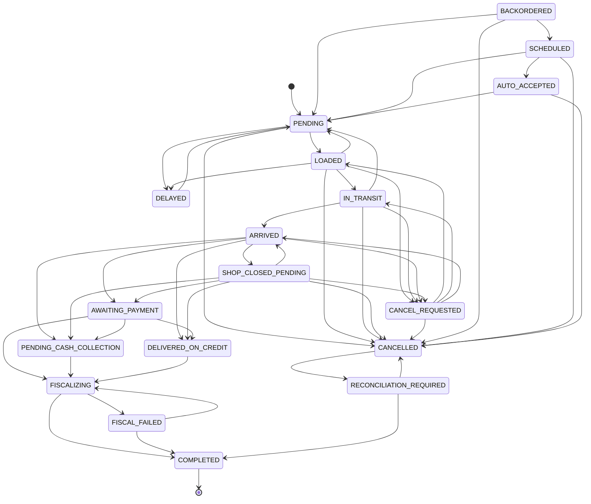

# PegasusX — Order Flow & Edge Cases (CODE)

**SOURCE OF TRUTH:**

- Statuses: [`apps/backend-go/order/service.go`](../apps/backend-go/order/service.go) (`Status*` constants)
- Transitions: [`apps/backend-go/order/state_machine.go`](../apps/backend-go/order/state_machine.go) (`ValidateStatusTransition`)
- Triggers: [`apps/backend-go/orderroutes/routes.go`](../apps/backend-go/orderroutes/routes.go), [`driverroutes/routes.go`](../apps/backend-go/driverroutes/routes.go), [`retailerroutes/routes.go`](../apps/backend-go/retailerroutes/routes.go)
- Tests: `order/state_machine_test.go`, `simulator/order_lifecycle_test.go`, `order/fiscal_test.go`

Not derived from other markdown.

---

## 1. Status constants (`order/service.go`)

```
PENDING
LOADED
IN_TRANSIT
ARRIVED
SHOP_CLOSED_PENDING
AWAITING_PAYMENT
PENDING_CASH_COLLECTION
DELIVERED_ON_CREDIT
FISCALIZING          // ADR-009: payment captured, OFD in flight
FISCAL_FAILED
COMPLETED
CANCELLED
CANCEL_REQUESTED
RECONCILIATION_REQUIRED
DELAYED
BACKORDERED
SCHEDULED
AUTO_ACCEPTED
```

**ConfirmationStatus:** `CONFIRMED`, `DRAFT`, `PENDING`, `REJECTED`, `AUTO_CONFIRMED`, `PENDING_WAREHOUSE`

**OrderSource:** `MANUAL`, `MANUAL_PREORDER`, `AI_PREORDER`, `BACKORDER`, `AUTO_ORDER`

**Sentinel errors (subset):** `invalid_status_transition`, `geofence_violation`, `zone_miss`, `inventory_exhausted`, `credit_limit_breached`, `proximity_required`, `force_complete_forbidden`, `cash_amount_required`, …

---

## 2. Exact transition table (`ValidateStatusTransition`)

Same `from == to` → allow (idempotent). Otherwise:

| From | Allowed `to` (code) |
|------|---------------------|
| PENDING | LOADED, CANCELLED, DELAYED |
| LOADED | IN_TRANSIT, CANCELLED, CANCEL_REQUESTED, DELAYED, PENDING |
| DELAYED | PENDING |
| IN_TRANSIT | ARRIVED, CANCELLED, CANCEL_REQUESTED, PENDING |
| ARRIVED | AWAITING_PAYMENT, PENDING_CASH_COLLECTION, DELIVERED_ON_CREDIT, CANCEL_REQUESTED, SHOP_CLOSED_PENDING |
| SHOP_CLOSED_PENDING | AWAITING_PAYMENT, PENDING_CASH_COLLECTION, DELIVERED_ON_CREDIT, CANCELLED, ARRIVED, CANCEL_REQUESTED |
| DELIVERED_ON_CREDIT | FISCALIZING |
| AWAITING_PAYMENT | FISCALIZING, PENDING_CASH_COLLECTION, DELIVERED_ON_CREDIT |
| PENDING_CASH_COLLECTION | FISCALIZING |
| FISCALIZING | COMPLETED, FISCAL_FAILED |
| FISCAL_FAILED | FISCALIZING, COMPLETED |
| CANCEL_REQUESTED | CANCELLED, LOADED, IN_TRANSIT, ARRIVED |
| COMPLETED | *(none)* |
| CANCELLED | RECONCILIATION_REQUIRED |
| RECONCILIATION_REQUIRED | COMPLETED, CANCELLED |
| BACKORDERED | PENDING, SCHEDULED, CANCELLED |
| SCHEDULED | AUTO_ACCEPTED, PENDING, CANCELLED, CANCEL_REQUESTED |
| AUTO_ACCEPTED | PENDING, CANCELLED, CANCEL_REQUESTED |
| default | deny |

Comments in `state_machine.go`:

- ADR-009: no soft ARRIVED → COMPLETED  
- Credit leave only reaches COMPLETED via FISCALIZING after money  
- CANCEL_REQUESTED must have exits or it bricks the order  



---

## 3. Who triggers what (mounted routes)

### 3.1 Create / early lifecycle

| Action | Route | Roles (from RequireRole) |
|--------|-------|--------------------------|
| Create | `POST /v1/order/create` | RETAILER |
| Checkout | `POST /v1/checkout/{unified,preview,b2b}` | paymentroutes |
| Cash/card checkout | `POST /v1/order/{cash,card}-checkout` | retailerroutes |
| Patch status | `PATCH /v1/order/{orderID}/status` | ADMIN, RETAILER |
| Assign | `POST /v1/orders/{orderID}/assign` | ADMIN, WAREHOUSE_ADMIN, FACTORY_ADMIN |
| Supplier vet | `POST /v1/supplier/orders/vet` | ADMIN |
| WH delay/reject/overflow/propose | `/v1/warehouse/ops/orders/{id}/*` | WAREHOUSE_ADMIN, ADMIN |

### 3.2 Doorstep (`orderroutes` + `driverroutes`)

| Action | Route | Role |
|--------|-------|------|
| Arrive | `POST /v1/delivery/arrive` | DRIVER |
| Proximity unlock | `POST /v1/delivery/proximity-unlock` | DRIVER |
| Shop closed | `POST /v1/delivery/shop-closed` (+ driver alias `…/orders/{id}/shop-closed`) | DRIVER |
| Partial offload | `POST /v1/delivery/partial-offload` (+ driver alias) | DRIVER |
| Scan QR | `POST /v1/delivery/scan-qr` | DRIVER |
| Deliver | `POST /v1/order/deliver` | DRIVER |
| Confirm offload | `POST /v1/order/confirm-offload` | DRIVER |
| Confirm cash | `POST /v1/delivery/confirm-cash` | RETAILER |
| Collect cash | `POST /v1/order/collect-cash` | DRIVER |
| Complete | `POST /v1/order/complete` | DRIVER |
| Fiscal retry | `POST /v1/order/{id}/fiscal/retry` | DRIVER, ADMIN, WAREHOUSE_ADMIN |
| Force complete | `POST /v1/order/{id}/force-complete` | ADMIN, WAREHOUSE_ADMIN |
| Credit leave | `POST /v1/driver/orders/{id}/credit-leave`, `POST /v1/delivery/credit-delivery` | DRIVER |
| Bypass / payment bypass confirm | `POST /v1/delivery/bypass-offload`, `confirm-payment-bypass` | DRIVER |
| Damage / condition | `POST /v1/delivery/report-damage`, `report-condition` | DRIVER (+ others on condition) |
| Missing / exception / split / negotiate | driverroutes delivery* | DRIVER |
| Sync batch | `POST /v1/sync/batch` | DRIVER |
| Retailer shop-closed | `POST /v1/retailer/shop-closed-response`, `…/orders/{id}/shop-closed/respond` | RETAILER |
| Supplier shop-closed resolve | `POST /v1/supplier/shop-closed/resolve` | ADMIN |

### 3.3 Post-delivery

| Action | Route | Role |
|--------|-------|------|
| File claim | `POST /v1/orders/{id}/claims` | RETAILER, ADMIN |
| Eligibility / list | GET claim-eligibility, claims | RETAILER, ADMIN, WAREHOUSE_ADMIN (list) |
| Approve / reject claim | `POST /v1/claims/{id}/{approve,reject}` | ADMIN, WAREHOUSE_ADMIN |
| Reconciliation | `/v1/supplier/reconciliation*` | ADMIN |

---

## 4. Happy paths (composed from transitions + routes)

### 4.1 Cash COD

1. Checkout → `PENDING` (+ `ReserveLineItemsInTxn`)  
2. Dispatch/seal/depart → `LOADED` → `IN_TRANSIT`  
3. `POST /v1/delivery/arrive` → `ARRIVED`  
4. Scan/deliver/confirm-offload → `AWAITING_PAYMENT` (or cash choice → `PENDING_CASH_COLLECTION`)  
5. `POST /v1/order/collect-cash` → `FISCALIZING` (+ cash variance if expected≠received)  
6. Fiscal worker SUCCESS → `COMPLETED`  

### 4.2 Card

Same through `AWAITING_PAYMENT` → `POST /v1/order/complete` → `FISCALIZING` → `COMPLETED`.

### 4.3 Credit leave

`ARRIVED` / `AWAITING_PAYMENT` / `SHOP_CLOSED_PENDING` → `DELIVERED_ON_CREDIT` (gate `CanLeaveOnCredit`) → later money capture → `FISCALIZING` → `COMPLETED`.  
**Illegal:** `DELIVERED_ON_CREDIT` → `COMPLETED` directly (`state_machine.go`).

### 4.4 Preorder

Create → `SCHEDULED` (`MANUAL_PREORDER` / `AI_PREORDER`). Sweeper may → `AUTO_ACCEPTED`. Promote → `PENDING`. Then §4.1.

### 4.5 Backorder

`BACKORDERED` → `PENDING` or `SCHEDULED` or `CANCELLED` (no reserve path for backorder source in reservation guards).

---

## 5. Edge cases (asserted or implemented in code)

### 5.1 State machine

| Edge | Behavior | Where |
|------|----------|-------|
| Idempotent same status | OK | `ValidateStatusTransition` |
| COMPLETED → anything | Denied | state_machine + tests |
| Soft complete from ARRIVED/AWAITING/PENDING_CASH | Denied | ADR-009 comment + `state_machine_test.go` |
| Credit → COMPLETED | Denied | state_machine + simulator |
| CANCEL_REQUESTED exits | CANCELLED or resume LOADED/IN_TRANSIT/ARRIVED | state_machine |
| LOADED/IN_TRANSIT → PENDING | Allowed (rollback) | state_machine + simulator |

### 5.2 Inventory

| Edge | Behavior | Where |
|------|----------|-------|
| `qoh - qr < qty` | `inventory_exhausted` | `ReserveLineItemsInTxn` |
| Duplicate SKUs | Aggregated before write | same |
| Missing SKU row | exhausted | same |
| Stale PENDING | Cancel path release | `inventory_stale_release.go` |
| SCHEDULED without marker | Backfill reserve | `BackfillScheduledReservations` |

### 5.3 Geofence / proximity

| Edge | Behavior | Where |
|------|----------|-------|
| Approach radius | 500 m constant | `proximity/geofence.go` |
| Settlement | unlock or live ~100 m / H3 (service comment) | `order/service.go` CollectCash area |
| Missing proximity | `proximity_required` | service errors |

### 5.4 Cash / fiscal

| Edge | Behavior | Where |
|------|----------|-------|
| Variance | shortfall/overage events | `emitCashVariance` |
| OFD timeout | 8s | `FiscalOFDTimeout` |
| Retry | FISCAL_FAILED → FISCALIZING | fiscal/retry route |
| Force-complete roles | ADMIN, WAREHOUSE_ADMIN only | orderroutes |
| Force from credit leave | Not via DELIVERED_ON_CREDIT→COMPLETED | state_machine comment |
| Idempotent collect-cash | key + body hash | `idempotency_guard.go` |

### 5.5 Shop closed

| Edge | Behavior | Where |
|------|----------|-------|
| Report | ARRIVED → SHOP_CLOSED_PENDING | shop-closed handlers |
| Default grace | 5 minutes if unset | `NewService` |
| Timeout credit | `CanLeaveOnCredit` + MaxAutoCredit 50_000_000 | `worker_shop_closed.go` |
| Retailer respond | routes in retailerroutes | `retailer_shop_closed.go` |
| Bypass | TransitionOpts PhotoURL / SupervisorToken | state_machine opts + bypass route |

### 5.6 Partial offload

| Edge | Behavior | Where |
|------|----------|-------|
| Qty mismatch | `partial_qty_mismatch` | `ApplyPartialOffloadLines` |
| Invalid status | `partial_invalid_status` | apply path status guard |
| Totals | delivered_minor / remaining_minor | partial_offload.go |

### 5.7 Cancel

| Edge | Behavior | Where |
|------|----------|-------|
| request-cancel / cancel | retailerroutes | cancel_service.go |
| Mid-leg | CANCEL_REQUESTED then approve/resume | state_machine |
| CANCELLED → recon | RECONCILIATION_REQUIRED | state_machine |

### 5.8 Claims

| Edge | Behavior | Where |
|------|----------|-------|
| Only COMPLETED | eligibility | `claims/eligibility.go` |
| Default window 48h | const | `claims/service.go` |
| Price from order lines | aggregate + half-up avg | `claims/pricing.go` |
| Prior qty statuses | OPEN/UNDER_REVIEW/APPROVED/RESOLVED | `ClaimedQtyBySKU` |

### 5.9 Tests to re-run when changing graph

- `order/state_machine_test.go`  
- `simulator/order_lifecycle_test.go`  
- `order/fiscal_test.go`  
- `order/shop_closed_timeout_test.go`  

---

## 6. Side fields on `Order` affecting flow

From repository/select columns (non-exhaustive): `FiscalStatus`, fiscal receipt/attempt ids, `ShopClosedAt/Reason/GraceEndsAt/Resolution`, `PartialDelivery`, `ProximityUnlockedAt/Method`, claim window fields, preorder lock/reminder fields, delivery proposal fields, `Version` (optimistic concurrency).

---

## 7. Rebuild rule

1. Diff against `ValidateStatusTransition` switch — table must match line-for-line.  
2. Add triggers only if present in `*routes/routes.go` with `RequireRole`.  
3. Do not copy edge lists from other docs.
