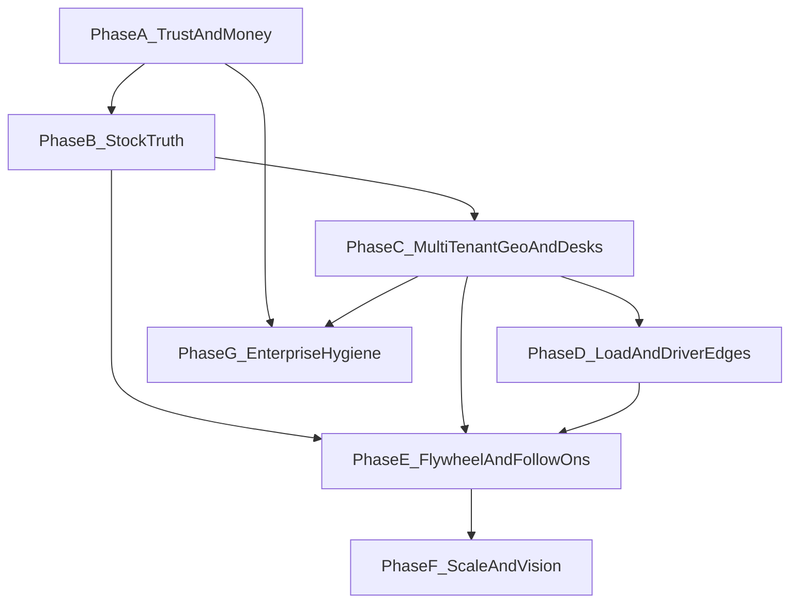

# PegasusX Master Roadmap (Everything, Sequenced)

**Status:** Program roadmap (order of battle)  
**Repo:** `/Users/shakhzod/ATOMOS/pegasusX` (canonical working tree; Desktop `V.O.I.D` is not the execution root)  
**Date:** 2026-08-04  
**Role:** Sequences all major plans; detail stays in linked docs — do not duplicate every epic here.

---

## Decision

Build **one program sequence**, not a second copy of every epic. This file is the **order of battle** and exit criteria.

| Existing plan | Role here |
|---------------|-----------|
| Retail OS / capability packs (in-repo) | Prerequisite product track for retailer scale |
| [`NEXT_LAYER_ECOSYSTEM_PLAN.md`](./NEXT_LAYER_ECOSYSTEM_PLAN.md) | L1–L11 flywheel / fiscal / local SKU / scale |
| [`RETAILER_RECEIVE_STOCK_CLAIMS_PLAN.md`](./RETAILER_RECEIVE_STOCK_CLAIMS_PLAN.md) | G1–G25 receive ↔ stock ↔ claims ↔ windows |
| [`PLANOGRAM_VISION_PLAN.md`](./PLANOGRAM_VISION_PLAN.md) | Deferred PG1–PG3 |
| [`ECOSYSTEM_HARDENING_GAP_PLAN.md`](./ECOSYSTEM_HARDENING_GAP_PLAN.md) | E1–E16 other roles / geo / ops |
| Credit-score removal (all risk scoring) | Delete scoring; keep limits + status only |
| Enterprise debt / hygiene | Auth, observability, DR, monorepo cleanup |

**Hard rule:** no competing greenfield “rewrite the monorepo” until Phases A–C exit green.

---

## Phase A — Trust and money (do first)

**Goal:** Field/auth/payment truth; remove confusing half-features.

| Work | Source | Exit |
|------|--------|------|
| Global Pay SUCCESS + Firebase real OTP | L1 | Card SUCCESS marker; OTP on device; no emulator in release |
| Remove **all** credit risk scoring | Credit-score removal | **Done** — no worker / score desk; CREDIT_LEAVE = status + available only (`RetailerCreditScores` table orphaned, no writers) |
| Kill supplier `sup-demo-1` CT/Compliance | E1 | **Done** — session-scoped supplier; honest empty |
| Apply shop-closed Spanner DDL on SSMR | E3 | **Done** — DDL on SSMR+staging; schema-drift CI gate |
| GCS evidence fail-closed (no placehold.co in SSMR/prod) | G16/G21 | **Done** — fail-closed ticket + URI reject; `PX_E2E_CLAIM_MEDIA_GCS_OK` |

**Parallel OK:** docs/plan link cleanup only.

---

## Phase B — Store stock truth (retailer integrity)

**Goal:** Dock + stock + claims share one liability spine.

| Work | Source | Exit |
|------|--------|------|
| TEAM claim auth (`retailer_org_id`) + `claim.file` | G6/G7 / RS0 | **Done** — org resolve + `claim.file`; cashier 403 |
| Claim → QUARANTINE hold + approve/reject dispositions | G8/G24 / RS3 | **Done (fail-closed)** — hold error → compensate REJECTED; single-Apply txn follow-up |
| Receive excludes driver-excepted qty | G9 / RS2 | **Done** — `ReceivableQty` caps delivered − residual − open claims |
| Idempotency on file claim + client keys | G11/G25 | **Done** — Redis guard + stable `claim-file:` keys; `PX_E2E_CLAIMS_IDEMPOTENCY_OK` |
| Stock “Request return” UX (3 clients) | G1 | **Done** — stock CTA → COMPLETED picker → existing FileClaim (+ optional SKU prefill) on desktop/Android/iOS |
| Claim eligibility / countdown API | G2 | **Done** — `GET …/claim-eligibility` + retailer CTA countdown (3 clients); `PX_E2E_CLAIM_ELIGIBILITY_OK` |
| Supplier/WH claim window settings + order snapshot | G3/G10 / RS1 | **Backend Done** — policy tables + COMPLETED snapshot; FileClaim/eligibility use `ClaimWindowEndsAt`; GET/PUT `/v1/supplier|warehouse/return-policy`. Portal/mobile settings UX still open |
| Reverse open retry + CLAIM_FILED → WH | G12/G22 | **Done** — returns Kafka consumer + `warehouse_id` on CLAIM_FILED; metric on sync fail |
| Concealed+stock+WH e2e markers | G20 | **Done** — receive→CONCEALED→hold→inbound markers in gate |

Detail: [`RETAILER_RECEIVE_STOCK_CLAIMS_PLAN.md`](./RETAILER_RECEIVE_STOCK_CLAIMS_PLAN.md).

---

## Phase C — Multi-tenant desks and geo

**Goal:** Second supplier can onboard without shared-zone lies.

| Work | Source | Exit |
|------|--------|------|
| Per-supplier delivery perimeter Redis keys | E2 | **Design+helper ready** — see `E2_PER_SUPPLIER_PERIMETER_DESIGN.md`; prod still global key |
| Zone publish API + supplier topology UI | E2 | Two suppliers, two perimeters, smoke green |
| Control Tower playbooks staging (manual) | E12 | After E1; AUTO_EXECUTE off |
| ConfigMap claim/CN/evidence flags explicit | G19 | No silent defaults |

---

## Phase D — Load path and driver edges

**Goal:** Warehouse/truck truth and last-mile money edges.

| Work | Source | Exit |
|------|--------|------|
| Payload/factory Spanner-only seal (no dual overlay in prod) | E6 | Multi-replica consistent board |
| Pick wave MVP + seal gate | E7 | Short pick found at dock |
| Rescue capacity state machine | E8 | Accept respects VU residual |
| Offline single-use nonces | E9 | Replay rejected |
| Cash shortfall → bag recon seed | E10 | EOD line auto-present |
| Condition/temp → claim + reverse | E11 | Cold-chain hits dock OPEN |

---

## Phase E — Flywheel and strong follow-ons

**Goal:** Differentiator + logistics completeness after stock/POS stable.

| Work | Source | Exit |
|------|--------|------|
| CORE hardening leftovers (family migrate, CT de-demo retailer, AutoOrderWorker) | L2 | No RAM family; no mock CT; execution audit |
| Sell-through → reorder → supplier signals | L3 | Suggestions move on POS/stock |
| Re-enable quantity negotiations (delivery propose/resolve) | L4 | E2E PASS; distinct from claims→QUARANTINE |
| Local/manual POS SKUs | L6 | Non-Pegasus sellable; not in supplier demand |
| Soliq OFD when legally required | L5 | Sandbox SUCCESS; PEGASUS remains non-legal path |

**Note:** Negotiations ≠ claims→QUARANTINE (order qty at stop vs store bin after receive).

---

## Phase F — Mode L scale (later)

| Work | Source |
|------|--------|
| Multi-org staff phones | L8 |
| Franchise / HQ analytics | L9 |
| Offline count + parked POS carts (not offline card sales) | L10 |
| CUSTOMER_ASSIST polish | L11 assist |
| Planogram structure → human audit → vision sidecar | PG1–PG3 |
| PLATFORM_ADMIN break-glass | E16 |

---

## Phase G — Enterprise hygiene (parallel after A; deepen after C)

Not a product epic — **make the platform operable**.

| Work | Exit |
|------|------|
| Enable observability (Terraform) + fiscal/outbox alerts | E13 |
| DR restore-to-scratch drill + runbook | E14 |
| Staging cost schedule / right-size | E15 |
| Integer billing meter (kill float64 milestones stub) | E5 |
| Credit scoring — removed; keep status/limit only | — |
| Auth: production posture (keys rotation, WI) | Documented + CI |
| Split worst god-service hotspots (`order` packages) — incremental | No big-bang rewrite |
| Root hygiene: quarantine `patch_*.sh`, CV site, committed binaries out of main path | Clean `make` / CI |
| Fill real ADRs for fiscal, outbox, money; delete empty stub SOPs or flesh them | `docs/adr/` non-empty |
| Harden parity gates toward typed contracts (reduce greppy-only) | Incremental |

---

## Production flip policy

Do **not** set `PEGASUSX_ENV=production` until:

1. Phase **A** green (GP SUCCESS, Firebase OTP still open; demo desks / shop-closed DDL / GCS evidence code **Done** — SSMR media marker needs TokenCreator IAM)  
2. Phase **B** P0 green (claim auth, quarantine, receive exclude, idempotency, reverse/WH fanout, G20 markers, G1–G3 backend — **code Done**; G3 supplier/WH settings portal UX still open)  
3. `ValidateProductionProfile` passes (no GP stubs)

CORE-only retailers may pilot earlier; multi-scale retail marketing needs Retail OS packs parity-tested.

---

## What this master plan is not

- Not a rewrite of Go into microservices  
- Not forcing POS on pure B2B buyers  
- Not forking OSS planogram apps  
- Not building a second chargeback product (claims remain SoT)  
- Not re-adding credit risk scoring  

---

## Immediate next 5 engineering moves

1. ~~Credit-score removal~~ **Done**.  
2. ~~E1 `sup-demo-1` + E3 shop-closed DDL~~ **Done**.  
3. ~~GCS fail-closed + RS0 + G8 + G9~~ **Done** (SSMR media e2e still needs WI `roles/iam.serviceAccountTokenCreator` for signBlob).  
4. ~~E2 perimeter key design + helper~~ **Done** (prod reads still global; EH1.1 cutover later).  
5. ~~Phase B G11/G25 + G12/G22 + G20 + G1 + G2 + G3 backend~~ **Done**. **Next eng:** Phase C E2 cutover / G19 ConfigMap / G3 portal claim-window UX as product allows. **Owner/ops:** **L1** GP password + Firebase Phone/SHA + WI TokenCreator for GCS smoke.

---

## Tracking

- Use existing plan IDs (L*, G*, E*, RS*, PG*, EH*) in PRs.  
- Living status: [`context/current_status.md`](../context/current_status.md), [`artifacts/PegasusX_Ecosystem_Status_Report.md`](../artifacts/PegasusX_Ecosystem_Status_Report.md), [`context/parity-ledger.md`](../context/parity-ledger.md).  
- After each phase exit: update those three + [`REAL_WORLD_CASE_MATRIX.md`](./REAL_WORLD_CASE_MATRIX.md).  
- Anti-theatre / E2E proof: [`SUBSTANCE_GATE.md`](./SUBSTANCE_GATE.md) + [`contracts/ssmr_ecosystem_markers.json`](../contracts/ssmr_ecosystem_markers.json).

---

*End of master roadmap.*
