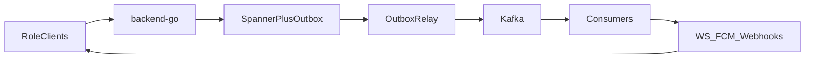

# PegasusX — Production Ecosystem Goal

**Date:** 2026-08-12  
**Status:** Source of truth for what “prod ready” means for the ATOMOS / PegasusX ecosystem.

**Companions (evidence + backlog, not the goal itself):**

- [`DOCS_SOURCE_OF_TRUTH.md`](./DOCS_SOURCE_OF_TRUTH.md) — living vs frozen documentation map
- [`PROD_READINESS_SEQUENCE.md`](./PROD_READINESS_SEQUENCE.md) — **ordered post–W0–W5 residuals** (R0–R6) for enterprise prod readiness
- [`session-2026-08-07/ECOSYSTEM_GAP_REGISTER_2026-08-12.md`](./session-2026-08-07/ECOSYSTEM_GAP_REGISTER_2026-08-12.md) — open gaps with evidence
- [`session-2026-08-07/MASTER_ALIGNMENT_DATAFLOW_2026-08-12.md`](./session-2026-08-07/MASTER_ALIGNMENT_DATAFLOW_2026-08-12.md) — docs↔code↔data-flow truth
- [`PLATFORM_SLOS.md`](./PLATFORM_SLOS.md) — ops SLI targets
- [`session-2026-08-07/END_PRODUCT_REALITY_REPORT_2026-08-11.md`](./session-2026-08-07/END_PRODUCT_REALITY_REPORT_2026-08-11.md) — historical only (stale for planning)

---

## 1. Locked decisions

| Decision | Choice |
|----------|--------|
| SoT tree | `pegasusX` only (`pegasus` = legacy / secondary) |
| Architecture | Keep Spanner → same-txn outbox → Kafka → WS / FCM / webhooks; enforce coverage, do not redesign the bus |
| Desktop | Keep Next.js + Tauri 2 |
| Phase 6 marketplace | Out of this prod bar until W3–W4 evidence exists |

---

## 2. North star

Ship a multi-tenant B2B logistics operating system where **factory → warehouse → payload → driver → retailer → AR / fiscal / payout** is one **Class A** loop: real money, real tenants, real partner rails; no silent Spanner mutations; autonomy only on soak evidence.

A retail chain can adopt without re-keying. Routine replenishment may go touchless only after measured shadow acceptance and dual-control flip.

---

## 3. Coverage rule (definition of done)

> Every Spanner state mutation emits an in-transaction outbox event; every event has a declared consumer (WS and/or push and/or webhook and/or domain mutator); no cross-role loop ends at an API with no client on the platforms that role actually uses.

Feature classes (from master alignment): only **Class A** (Spanner write + outbox + consumer + role clients) is shippable enterprise product. No new Class C screens without a backend hop.

---

## 4. Prod success pillars

| Pillar | Exit when |
|--------|-----------|
| Money and law | EDS Soliq **contract** proven in CI (sign→submit→poll); live legal OFD needs owner EDS; capture/refund/AR fail-closed in-tree; payout bank-file permanent settlement; off-app dunning **code-wired** (keys/templates residual) |
| Data-flow | Coverage rule holds; twin consumer started (W1); TopicWebhooks retired; DEMAND_SIGNAL atomic with sell-through; search = Spanner LIKE ([`SEARCH_DECISION.md`](./SEARCH_DECISION.md)); run-mode never silently drops push / inbox |
| Cross-role Class A | Factory↔payload, retailer AR / HQ on mobile, supplier planning on web, warehouse WMS floor screens |
| Trust | Detail-IDOR sweep closed (W0 2026-08-12); JWT revocation / denylist landed (`jti` + logout) |
| Autonomy | 30-day soak artifact generated; dual-control `place` flip wired; real optimizer image + replicas ≥1 in prod |
| Partner | GS1 DataMatrix FNC1-conformant + label path (W5); AS2 MDN/MIC verified (W5); partner Go SDK in go.work (W5); admin partner / match UI (W2); EDI-lite breadth + sandbox keys (W5). Drummond / certified EDIFACT still open. |
| Ops | SLOs from [`PLATFORM_SLOS.md`](./PLATFORM_SLOS.md) alertable (outbox lag, relay restarts, DLQ depth, fiscal / capture / webhook success) — stubs + collectors Wired 2026-08-12; enable via `enable_observability_resources` |

---

## 5. Execution waves

Roadmap order mapped to gap-register IDs. Closing gaps is separate work; this section is the sequence.

| Wave | Goal | Gap anchors |
|------|------|-------------|
| **W0 Trust** | Detail IDORs + JWT revocation — **closed 2026-08-12** | Gap register § Security; P1-11 ✅ |
| **W1 Data-flow hygiene** | Twin start + TopicWebhooks retire + search decision + atomic DEMAND_SIGNAL — **closed 2026-08-12** | P2-11 ✅, P2-12 ✅, P2-13 decided |
| **W2 Class A loops** | Close broken / half-wired cross-role product surfaces — **closed 2026-08-12** | P1-16 ✅, P1-17 ✅, P1-18 ✅, P2-24 ✅, P2-26 ✅ |
| **W3 Money legality** | EDS fiscal **contract** proof + payout-rail decision + GP **simulator** refund proof — **closed in-tree 2026-08-12** (live Soliq/GP keys = owner residual) | P1-7 ✅; P0-2 bank-file decision ✅; P2-10 ✅ |
| **W4 Autonomy** | Prod optimizer; soak artifact; dual-control place; CronJobs / autonomy flags — **closed 2026-08-12** | P1-1 ✅, P1-2 ✅, P1-3 ✅, P1-4 ✅, P1-5 ✅ |
| **W5 Partner cert** | GS1 / AS2 / SDK + EDIFACT breadth / sandbox — **closed 2026-08-12** | P1-13 ✅, P1-14 ✅, P1-15 ✅; P2-20 ✅, P2-21 ✅ |

**Post-wave residuals (ordered):** [`PROD_READINESS_SEQUENCE.md`](./PROD_READINESS_SEQUENCE.md) — R0 SoT hygiene → R1 live money/law keys → R2 ops/SLO → R3 autonomy scale + place → R4 Class A client parity → R5 partner cert → R6 deferred.

---

## 6. Explicit non-goals (this prod bar)

- Complete field-agent replacement (acquisition, credit negotiation, and physical cash hand-off stay human)
- Phase 6 marketplace (RFQ, supplier scorecards, escrow, BI sink) before W3–W4 evidence
- Desktop stack rewrite (Electron, pure Go UI, Flutter desktop)
- Planning or shipping from the legacy `pegasus/` tree alone

---

## 7. Operating rule

> No feature ships to prod unless it is Class A on the roles and platforms that use it, and every Spanner write is evented and consumed.

When a P0/P1 gap closes in code, update the gap register in the same PR. Do not use the 2026-08-11 reality report as planning SoT.
