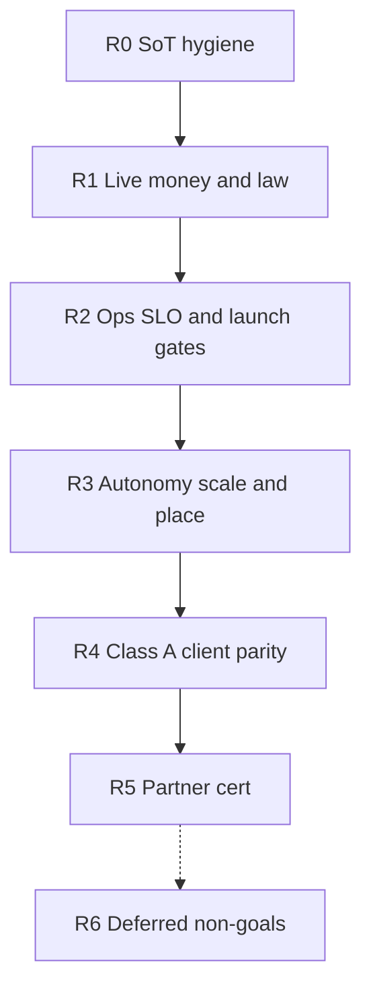

# PegasusX — Enterprise Prod-Readiness Sequence (post W0–W5)

**Date:** 2026-08-12  
**Status:** Source of truth for **ordered residuals** after in-tree waves W0–W5 closed.  
**Goal SoT:** [`PROD_ECOSYSTEM_GOAL.md`](./PROD_ECOSYSTEM_GOAL.md)  
**Evidence backlog:** [`session-2026-08-07/ECOSYSTEM_GAP_REGISTER_2026-08-12.md`](./session-2026-08-07/ECOSYSTEM_GAP_REGISTER_2026-08-12.md)

W0–W5 are **closed in code/simulator**. What remains is **Class D ops enablement** plus a short **Class B/C client parity** list. This order matches prod pillars: money/law before touchless place; ops truth before scale; Class A before partner cert theater.

---

## Prod-ready definition (this sequence)

| Bar | Required |
|-----|----------|
| **Legal single-distributor launch** | R1 + R2 + R3.1–R3.2 |
| **Touchless place pilot** | + R3.3–R3.5 |
| **Warehouse floor cold-chain** | + R4.1 ✅ |
| **Enterprise ERP customers** | + R5 (optional for single-tenant launch) |
| **Never blocks launch** | R6 |

---

## R0 — SoT hygiene (eng)

Stop planning from stale prose.

| Item | Owner | Exit |
|------|-------|------|
| Supersede frozen bullets in [`PLATFORM_AUDIT.md`](../PLATFORM_AUDIT.md) that contradict code | Eng | No SoT doc claims a closed capability is missing |
| Plan from gap register + this sequence; reality report historical only | Eng | Pointers live |

---

## R1 — Live money and law (ops-first; blocks “legal prod”)

Code is wired; **owner keys** unlock the pillar.

| Order | Item | Owner | Exit |
|-------|------|-------|------|
| R1.1 | E-IMZO PKCS#12 + `FISCAL_PROVIDER=MY_SOLIQ` sandbox SUCCESS | Tax/ops | Live OFD path per [`FISCAL_EDS_PROOF.md`](./FISCAL_EDS_PROOF.md) |
| R1.2 | Global Pay merchant password; live capture/refund soak | Finance/ops | Live GP (not simulator) — [`GLOBAL_PAY_REFUND_PROOF.md`](./GLOBAL_PAY_REFUND_PROOF.md) |
| R1.3 | Twilio / PlayMobile / SendGrid + WhatsApp Content SID + sender | Collections/ops | Off-app dunning fires in staging; unskip `PX_E2E_COLLECTIONS_DUNNING_OK` with flags |
| R1.4 | Firebase Phone SHA-1 / APNs entitlements / real SMS | Mobile ops | OTP/push release-ready |

**Do not** enable place or scale optimizer before R1.1–R1.3 are green in staging.

---

## R2 — Ops truth and launch gates (SRE + eng)

| Order | Item | Owner | Exit |
|-------|------|-------|------|
| R2.1 | `enable_observability_resources` + confirm TF alerts (relay restarts, DLQ, webhook success) | SRE | [`PLATFORM_SLOS.md`](./PLATFORM_SLOS.md) alertable in prod project |
| R2.2 | Real GSM secrets (JWT, internal-api-key, Maps, redis AUTH) + ManagedCert Active | SRE | Prod overlay applyable |
| R2.3 | [`LAUNCH_READINESS_RUNBOOK.md`](./LAUNCH_READINESS_RUNBOOK.md) + [`P0_LAUNCH_CHECKLIST.md`](./P0_LAUNCH_CHECKLIST.md) vs staging then prod URL | Eng/SRE | `p0-preflight` + `staging_smoke` green |
| R2.4 | Worker heartbeat / api-only push parity smoke | Eng | No silent inbox/FCM loss |

---

## R3 — Autonomy scale (after money rails exist)

| Order | Item | Owner | Exit |
|-------|------|-------|------|
| R3.1 | Publish real optimizer-core AR image | Cloud ops | Image digest in Artifact Registry |
| R3.2 | Bump **prod** optimizer `replicas` 0 → ≥1 | Cloud ops | `"optimizer_source":"optimizer"` in live dispatch |
| R3.3 | Keep shadow soak (`SHADOW`+`WORKER` on, `PLACE` off) until 30d evidence | Ops + retailer | Desktop/mobile soak-gate pass |
| R3.4 | Dual-control approve `AUTO_ORDER_PLACE_ENABLED` per pilot org + flip-check | Platform admin | Per [`AUTO_ORDER.md`](./AUTO_ORDER.md) / [`AUTO_ORDER_PLACE_FLIP.md`](./AUTO_ORDER_PLACE_FLIP.md) |
| R3.5 | Pilot place → rollback drill | Ops | Fail-closed to draft/shadow proven |

Do not env-flip place without R3.3–R3.4.

---

## R4 — Class A client parity (eng; parallelizable after R2)

| Order | Item | Owner | Why this order |
|-------|------|-------|----------------|
| R4.1 ✅ | Warehouse Android/iOS: cold-chain + labor-capacity + typed Control Tower scored list | Eng | Shipped 2026-08-12 screens; typed CT list 2026-08-14 |
| R4.2 ✅ | Retailer desktop: add `/control-tower` to `RetailerShell` nav | Eng | Shipped 2026-08-12 — discoverability; API already live |
| R4.3 ✅ | Admin billing list APIs + portal tab (P12) | Eng | `GET /v1/admin/billing/invoices` + fee-schedules; CronJob YAML **unapplied**; worker still needs `AR_INVOICES_ENABLED` |
| R4.4 ✅ | Payload `seal-all` on terminal+Android+iOS (P13-A). Capacity stays **GONE** `410 capacity_unwired` | Eng | No half-advertised live capacity API |
| R4.5 ✅ | Retailer Control Tower tile navigation (P13-E) | Eng | Android/iOS tiles match desktop hrefs (2026-08-14) |

Each item must ship Class A (API + clients + gap-register update).

---

## R5 — Partner certification (procurement-heavy)

| Order | Item | Owner | Note |
|-------|------|-------|------|
| R5.1 | Drummond / certified EDIFACT | Partner/ops | After EDI-lite breadth (W5) |
| R5.2 | Certified 1C exchange package | Partner/ops | Beyond journals CSV/XML |
| R5.3 | Multi-currency AR aging ledger + live Airwallex FX | Finance/eng | Residual from FX wave |

Not required for single-distributor legal launch if R1–R3 pass.

---

## R6 — Explicitly deferred (not prod blockers)

- Phase 6 marketplace (RFQ, scorecards, escrow, BI)
- Quantity negotiation (`QUANTITY_NEGOTIATION_ENABLED` stays off)
- Credit risk scoring re-add
- Full field-agent replacement / cash collection automation
- Electron / desktop rewrite

---

## Parallelism rules

- **R0** — immediately (docs).
- **R1** and **R2** — may overlap (different owners).
- **R3** — only after R1.1–R1.3 staging green.
- **R4** — after R2; may run in parallel with R3 soak wait.
- **R5** — after partner keys exist; does not block single-tenant launch.

---

## Next eng slice after this SoT

Default after R4.5: ops **R1–R2** in parallel, or partner **R5** when keys exist. **P15 not cloud-ready. P16 not store.**
