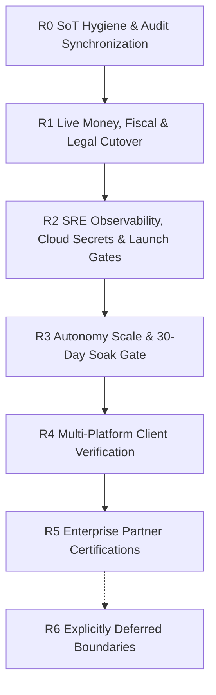

# PegasusX — Enterprise Prod-Readiness Sequence (Post W0–W5 & G1–G7)

**Date:** 2026-08-20  
**Status:** Authoritative source of truth for **ordered Layer B operational residuals** following complete in-tree code closure of Waves W0–W5 and Gap Ledger Phases G1–G7.  
**Destination goal:** [`.agents/memory/GOAL.md`](../../.agents/memory/GOAL.md) — [`GLOBAL_SCALE_PROGRAM.md`](./GLOBAL_SCALE_PROGRAM.md) + [`GLOBAL_SCALE_LOCAL_ECOSYSTEM.md`](./GLOBAL_SCALE_LOCAL_ECOSYSTEM.md)  
**Living Scorecard:** [`session-2026-08-13/SCORECARD.md`](./session-2026-08-13/SCORECARD.md) · [`session-2026-08-13/RESIDUAL_REGISTER.md`](./session-2026-08-13/RESIDUAL_REGISTER.md) · [`session-2026-08-13/GAP_LEDGER.md`](./session-2026-08-13/GAP_LEDGER.md)  
**Class A / prod-ready definition:** [`PROD_ECOSYSTEM_GOAL.md`](./PROD_ECOSYSTEM_GOAL.md)

---

## 1. Executive Summary & Layer Separation

All in-tree application code, schemas, domain state machines, route handlers, client apps, and automated test suites across **Layer A** are **100% complete and verified** (all Gap Ledger items G1-A1 through G7-4 are resolved).

This sequence governs **Layer B (Deploy-Time Operations, Owner Secrets & Partner Certifications)**. Deploy-time operations must strictly follow the ordered sequence below to ensure legal compliance, financial integrity, and system stability before opening high-scale autonomous execution.

---

## 2. Prod-Ready Milestone Criteria

| Bar | Required Sequence Items | Operational Milestone |
| :--- | :--- | :--- |
| **Legal Single-Distributor Launch** | R1 + R2 + R3.1–R3.2 | Production clearance for single-supplier commercial logistics with cash/GlobalPay + MySoliq fiscalization. |
| **Touchless Auto-Order Pilot** | + R3.3–R3.5 | Autonomous replenishment ordering unlocked for pilot cohort passing 30-day soak gate. |
| **Warehouse Cold-Chain Floor** | + R4.1 ✅ (Code Complete) | Enforced temperature logger verification prior to manifest seal. |
| **Enterprise ERP Integration** | + R5 (Procurement track) | Multi-partner AS2 / EDI / 1C CommerceML automated exchange. |
| **Non-Blocking Features** | R6 | Intentional 410 product boundaries and deferred roadmap items. |

---

## 3. Detailed Sequence Tracks

### R0 — SoT Hygiene & Audit Synchronization (Eng / Docs)
- **Status:** **COMPLETE (2026-08-20)**.
- All repository documentation, parity matrices (`ROLE_ROW_PARITY_MATRIX.md`), role feature catalogs (`ROLE_FEATURES_DOCS_VS_CODE.md`), scorecards (`SCORECARD.md`), and gap ledgers (`GAP_LEDGER.md`) are synchronized against the live codebase.
- No doc claims unimplemented features as live; all intentional 410s are explicitly cataloged.

---

### R1 — Live Money, Fiscal & Legal Cutover (Ops / Legal)
Code is complete and fails closed; owner secrets unlock the live production path.

| Order | Item | Required Secret / Configuration | Owner | Exit & Verification Gate |
| :--- | :--- | :--- | :--- | :--- |
| **R1.1** | **E-IMZO PKCS#12 + `FISCAL_PROVIDER=MY_SOLIQ`** | Inject valid E-IMZO certificate (`E_IMZO_PKCS12_PATH`) and Soliq OFD merchant credentials (`SOLIQ_OFD_SECRET`). | Tax / Legal / Ops | Live OFD receipt signature verification per [`FISCAL_EDS_PROOF.md`](./FISCAL_EDS_PROOF.md). |
| **R1.2** | **GlobalPay Live Merchant Secret** | Inject production `GLOBAL_PAY_MERCHANT_ID` and `GLOBAL_PAY_SECRET_KEY` (replacing `GLOBAL_PAY_STUB_MODE=true`). | Finance / Ops | Successful live 100 UZS card transaction and refund per [`GLOBAL_PAY_REFUND_PROOF.md`](./GLOBAL_PAY_REFUND_PROOF.md). |
| **R1.3** | **Dunning Communications Transports** | Inject Twilio / PlayMobile / SendGrid API keys and WhatsApp Content SID. | Collections / Ops | Automated dunning message delivery verification in staging (`PX_E2E_COLLECTIONS_DUNNING_OK`). |
| **R1.4** | **Mobile Push (APNs / FCM) Credentials** | Provision Apple Developer APNs auth key (`AuthKey_*.p8`) and Firebase service account JSON (`google-services.json`). | Mobile Ops / SRE | Verified push delivery on physical iOS and Android test devices. |

*Gate: Do not scale optimizer pods or enable autonomous order placement before R1.1–R1.3 are verified in staging.*

---

### R2 — SRE Observability, Cloud Secrets & Launch Gates (Platform / SRE)

| Order | Item | Required Secret / Configuration | Owner | Exit & Verification Gate |
| :--- | :--- | :--- | :--- | :--- |
| **R2.1** | **Platform Observability & SLO Alerts** | Enable Google Cloud Monitoring / Prometheus alert policies for outbox lag, DLQ rate, and relay health. | Cloud SRE | Alerting active per [`PLATFORM_SLOS.md`](./PLATFORM_SLOS.md). |
| **R2.2** | **Cloud Secret Manager (GSM) Injection** | Provision live GSM secrets for JWT signing keys, Redis AUTH, Maps API key, and Managed SSL Certificates. | Cloud SRE | Production URL HTTPS 200 on `/v1/health` with `ManagedCertificate` status `Active`. |
| **R2.3** | **Launch Preflight Runbook Execution** | Execute staging and production verification runs against live endpoints. | Eng / SRE | [`LAUNCH_READINESS_RUNBOOK.md`](./LAUNCH_READINESS_RUNBOOK.md) & [`P0_LAUNCH_CHECKLIST.md`](./P0_LAUNCH_CHECKLIST.md) green. |
| **R2.4** | **Outbox Relay & Dead-Letter Probes** | Verify transactional outbox polling loop against Cloud Spanner `Idx_OutboxEvents_Unpublished`. | SRE / Backend | Zero silent message loss; DLQ count = 0 under synthetic load. |

---

### R3 — Autonomy Scale & 30-Day Soak Gate (Product / Ops)

| Order | Item | Action / Validation | Owner | Exit & Verification Gate |
| :--- | :--- | :--- | :--- | :--- |
| **R3.1** | **Optimizer-Core Container Image** | Build and publish production OR-Tools container image to Google Artifact Registry. | Cloud Ops | Image digest verified in Artifact Registry. |
| **R3.2** | **Scale Optimizer Pods (`0 → ≥1`)** | Scale optimizer deployment on GKE cluster from replica count 0 to ≥1. | Cloud Ops | `/healthz` probe passing; `"optimizer_source": "optimizer"` in dispatch API responses. |
| **R3.3** | **Auto-Order 30-Day Shadow Soak** | Maintain shadow evaluation (`AUTO_ORDER_SHADOW=true`, `AUTO_ORDER_PLACE_ENABLED=false`) for 30 consecutive operating days. | Retail Ops / AI | 30-day forecast MAPE < 15% with zero false-positive inventory stockouts. |
| **R3.4** | **Dual-Control Flag Flip** | Submit and approve dual-control flag override for `AUTO_ORDER_PLACE_ENABLED=true` for qualified pilot cohort. | Platform Admin | Verified via [`AUTO_ORDER_PLACE_FLIP.md`](./AUTO_ORDER_PLACE_FLIP.md). |
| **R3.5** | **Automated Rollback Drill** | Test instant emergency reversion to draft mode upon simulation trigger. | Ops / SRE | Fail-closed reversion within < 5 seconds. |

---

### R4 — Multi-Platform Client Verification (Eng / QA)

All client surfaces are fully implemented in-tree and covered by automated test suites:

| Order | Feature / Surface | Implementation Citation | Verification Status |
| :--- | :--- | :--- | :---: |
| **R4.1** | **Warehouse Cold-Chain & Labor-Capacity** | `WarehouseApi.kt`, `WarehouseOperationsService.swift`, `ColdChainScreen.kt`, `LaborCapacityScreen.kt` | **DONE (Code & Tests Verified)** |
| **R4.2** | **Retailer Control Tower Discoverability** | `apps/retailer-app-desktop/app/(dashboard)/control-tower/page.tsx:1-120` | **DONE (Code & Tests Verified)** |
| **R4.3** | **Admin Billing & Fee Schedules** | `apps/admin-portal/components/BillingPanel.tsx:1-130`, `GET /v1/admin/billing/invoices` | **DONE (Code & Tests Verified)** |
| **R4.4** | **Payload Seal-All Batch Operations** | `apps/payload-terminal/api.ts:181`, `PayloadApi.kt:102`, `APIClient.swift:247-250` | **DONE (Code & Tests Verified)** |
| **R4.5** | **Retailer Control Tower Tile Navigation** | Android `onNavigate`, iOS `NavigationLink`, Desktop interactive routes | **DONE (Code & Tests Verified)** |

---

### R5 — Enterprise Partner Certification (B2B Procurement Track)

| Order | Item | Scope & Action | Owner | Notes |
| :--- | :--- | :--- | :--- | :--- |
| **R5.1** | **Drummond AS2 Certification** | Exchange official X.509 signing certificates and complete Drummond AS2 interoperability test matrix. | Partner Ops | [`PARTNER_AS2.md`](./PARTNER_AS2.md) |
| **R5.2** | **Certified 1C Exchange Package** | Formal certification of 1C:Enterprise CommerceML 2.x catalog and orders import/export module. | Partner Ops | [`PARTNER_ADAPTER_1C.md`](./PARTNER_ADAPTER_1C.md) |
| **R5.3** | **Multi-Currency AR & Live FX Integration** | Live CBU / Airwallex FX API key cutover for real-time exchange rates. | Finance / Ops | [`FX_RATES.md`](./FX_RATES.md) |

*Note: R5 is not blocking for single-distributor domestic commercial launch.*

---

### R6 — Explicitly Deferred Boundaries & Intentional 410s

The following surfaces are intentionally deactivated, removed, or deferred in the codebase:

1. **Saved Cards Vault**: Deactivated from product scope (`/v1/retailer/card*` returns HTTP 410 `saved_cards_not_product`, `retailer/core_handlers.go:1337`).
2. **AI Predictions Deprecated Alias**: Old alias `/v1/ai/predictions` returns HTTP 410 `use_retailer_ai_predictions` (`retailer/mobile_compat.go:71-81`). Clients use `/v1/retailer/ai/predictions`.
3. **Supplier Inventory Audit**: Legacy audit path returns HTTP 410 `audit_unwired` (`supplier/portal_handlers.go:1107-1118`).
4. **Quantity Negotiation**: Returns HTTP 410 `feature_disabled` (`order/negotiation_disabled.go:22-30`) unless `QUANTITY_NEGOTIATION_ENABLED=true`.
5. **Payme & Click Webhooks**: Routes commented out in `webhookroutes/routes.go:26-31`. Active launch payment rails are Cash + GlobalPay + MySoliq.
6. **Payload Vehicle Capacity**: Endpoint `/v1/payloader/capacity` returns HTTP 410 `capacity_unwired` (`payload/vehicle_capacity.go:19`).
7. **Post-Dispatch Order Cancellation**: Returns HTTP 403 `cannot_cancel_in_flight` once order is in `DISPATCHED` or `LOADED` state.
8. **Auth0 Global Router Wrap**: Bypassed in favor of native per-tenant OIDC (`orgoidc` package) and HS256 authentication.

---

## 4. Execution Rules

1. **Layer A is Complete**: No new feature development or speculative refactoring is permitted under the guise of production readiness.
2. **Layer B is Strict Configuration**: All Layer B activities involve injecting valid cloud secrets, provisioning infrastructure, scaling pods, or executing operational drills.
3. **Fail-Closed Principle**: In the absence of live credentials (e.g. Soliq PKCS#12 keys or GlobalPay secrets), the system must fail closed with explicit RFC 7807 problem details rather than simulating success.
