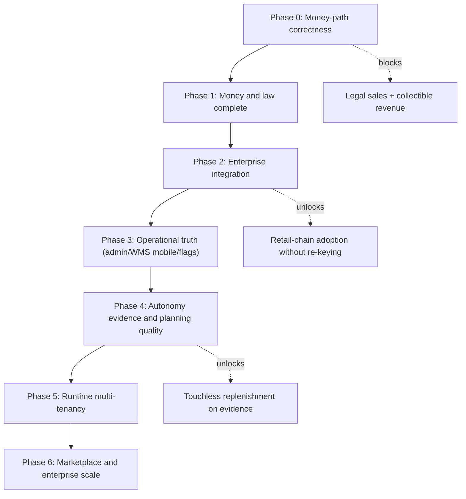

<!-- 7cbf327a-1262-48ab-b381-682788c012cb -->
---
todos:
  - id: "phase-0"
    content: "Phase 0: Money-path correctness and legal safety (capture bug, stubs, idempotency DB indexes, Kafka HA, hygiene)"
    status: pending
  - id: "phase-1"
    content: "Phase 1: Money and law complete (fiscal flip-readiness, AR activation + off-app dunning, refunds/payouts, fee schedule)"
    status: pending
  - id: "phase-2"
    content: "Phase 2: Enterprise integration (master-data API, webhook coverage, EDI ACKs, AS2/SFTP enablement, DataMatrix, SDK)"
    status: pending
  - id: "phase-3"
    content: "Phase 3: Operational truth (admin console, flag service, WMS mobile execution, client parity, SLO observability)"
    status: pending
  - id: "phase-4"
    content: "Phase 4: Autonomy on evidence (optimizer deploy, shadow soak, place flip criteria, partial allocation, real S&OP)"
    status: pending
  - id: "phase-5"
    content: "Phase 5: Runtime multi-tenancy Phase 1 per ADR (tenant context, fail-closed middleware, outbox partition, IDOR proof)"
    status: pending
  - id: "phase-6"
    content: "Phase 6: Marketplace and enterprise scale (decision-gated on evidence: product master, certified EDI/1C, BI sink)"
    status: pending
isProject: false
---
# PegasusX — Enterprise-Grade Execution Plan

## Assumptions (validated against the tree)

- **Credential reality:** no Global Pay merchant keys, no Soliq/OFD credentials. All such work is built flip-ready behind the existing provider interfaces and proven against simulators (`apps/backend-go/simulator/global_pay.go` already mirrors the GP URL surface) and recorded-contract tests. Credential procurement is tracked as owner tasks, never as code blockers.
- **GCP is available via CLI:** GKE, Spanner, Secret Manager (GSM), Artifact Registry (AR), Cloud Build, Managed Service for Apache Kafka, Cloud Monitoring are all in scope for real work.
- **Execution model:** one phase at a time, deep-dive per phase, nothing merges without its executable gate. Docs follow code, never lead it (the repo's doc-drift failure mode).
- **Promotion path is always:** implement → SSMR deploy → gate green → prod overlay update → owner-controlled prod apply. No direct-to-prod changes.

## Sequencing rationale

Why this order: money correctness gates trust and legality; integration gates who you can sell to; admin/flags gate safe operation of everything above; autonomy flips only on measured evidence; tenancy last because partner APIs designed single-tenant would be rebuilt (audit §8.10).

---

## Phase 0 — Money-path correctness and legal safety (1–2 weeks)

**Goal:** the ledger never asserts money that did not move; no silent stubs; financial idempotency DB-enforced.

- Fix capture routing `"GLOBALPAY"` → `"GLOBAL_PAY"` and remove the in-txn optimistic `CAPTURED` leg: record legs as `AUTHORIZED→CAPTURE_PENDING→CAPTURED|FAILED` only after PSP confirmation, synchronously. This is how Stripe/Adyen model it — **payment as a state machine with provider-confirmation transitions, never optimistic ledger writes.** Files: `apps/backend-go/payment/service.go:653`, `payment/execution.go:140`, `order/service.go:1899-1929`, `order/backorder_sweeper.go:51-55`.
- Delete or env-jail every `gp_*_stub_*` success path (`payment/global_pay_executor.go:112-320`); guard the dormant `WebhookReconciler` against stub refs (`payment/reconciliation.go:57`). Best practice: **fail-closed PSP clients** — unknown/missing credentials are errors, not fabricated success.
- Shop-closed worker: fail the transition when the credit profile is unreadable; use `credit.Available()` incl. `ReservedMinor` instead of inline math (`order/worker_shop_closed.go:91-165`).
- Unique indexes on `OrderPaymentLegs.IdempotencyKey` and `PaymentLedgerEntries` idempotency column; honor `Idempotency-Key` on `POST /partner/v1/orders` (`partner/handlers.go:37-63`). Best practice: **idempotency is a database guarantee; Redis TTL is only a latency layer** (Stripe IETF-style idempotency).
- Kafka HA: move to GCP Managed Kafka (the client auth already supports it: `kafkautil/auth.go`) or Strimzi 3-broker RF=3; add outbox-relay DLQ (exhausted publishes currently log-and-lose, `outbox/relay.go:135-152`).
- Fail loudly on negative stock (`inventory/repository.go:166-169`); role-gate `POST /v1/payers` and fail-closed payer ownership (`payment/crud_handlers.go:52-81`).
- Repo/legal hygiene: rotate secrets in committed `.env.local`, purge tracked binaries (90MB `backend-go`), delete `.bak`/`.orig` artifacts and root `patch_*.sh` scripts; activate GCS Terraform state (`infra/terraform/backend.gcs.tf`) and delete local `terraform.tfstate`.
- Warehouse Android scanner: wire to `WarehouseApi` or delete the orphaned screen (`ScannerViewModel.kt:22,47`); add CI grep for `TODO: Inject`.
- Env-gate the random-data Control Tower simulator to demo builds (`simulator/control_tower.go:53-79`).

**Exit gate:** new `make money-path-gate` — Spanner-emulator tests proving (a) capture failure never writes CAPTURED, (b) duplicate idempotency key never double-records, (c) empty GP creds produce hard errors, (d) shop-closed credit debt always recorded; `gitleaks` clean; SSMR smoke + marker gate green.

## Phase 1 — Money and law complete (2–4 weeks)

**Goal:** credit revenue is collectible and sales are fiscally closable the moment credentials arrive.

- **Fiscal flip-readiness:** inject an EDS signer abstraction into `MY_SOLIQ` (field never assigned today, `order/fiscal_provider.go:129`); record/replay contract tests against Soliq's documented EHF protocol so the adapter is testable without creds; receipt vault (immutable storage of issued receipts — already have `OrderFiscalReceipts`); honest PEGASUS receipts until OFD creds land. Owner task: Soliq sandbox + production credentials.
- **Activate AR in staging:** `AR_INVOICES_ENABLED` + `AR_DUNNING_ENABLED` on; rule: credit leave-behind is rejected when AR is off (`ar/service.go:88-96`). Add **off-app dunning transports**: SMS (PlayMobile/Twilio) and email (SendGrid) behind a per-channel provider interface — the pattern every collections platform uses; FCM/inbox already exist.
- **Refunds and payouts:** refund initiation (full/partial, capped at captured − refunded, reversal legs, fiscal corrective chain via `CreditNotes.OriginalEhfId/CorrectiveEhfId` schema); supplier payout batches = Σcaptured − Σrefunds − commission, executed via bank-file export until a payout rail exists. Best practice: **immutable ledger + explicit reversal legs, never mutation** (already the codebase's style).
- **Billing monetization:** fee schedule (per-order / GMV-bps / subscription) per tier on top of the wired meter (`internal/services/billing/meter_worker.go`); monthly invoices as AR open items, reusing the dunning engine.
- Owner tasks in parallel: Global Pay merchant password + webhook registration (unblocks `PX_E2E_PAYMENT_CARD_SUCCESS_OK`), Firebase Phone SMS/SHA-1/APNs.

**Exit gate:** staging runs with AR on end-to-end (credit leave → invoice → aging → dunning → hold → payment → release); refund and payout happy paths proven against the GP simulator; Soliq adapter passes recorded-contract suite; `PX_E2E_COLLECTIONS_DUNNING_OK` unskipped.

## Phase 2 — Enterprise integration: adopt without re-keying (3–5 weeks)

**Goal:** a retail chain running 1C can integrate programmatically; nothing about the partner surface is second-class.

- **Master-data sync API:** partner-key upsert endpoints for products/prices/stock (machines read-only today, `partner/routes.go:27`), reusing the proven 9-state import-wizard staging core (`supplier/import_sessions.go`); batch + idempotent per external ID.
- **Webhook coverage:** configurable per-subscription event filters over the 155-type catalog (only 4 exposed today, `partner/kafka_handler.go:26-31`); signing secret rotation; self-serve sandbox keys.
- **EDI completeness:** CONTRL/APERAK functional acknowledgments (one-legged loop today); inbound ORDRSP/INVOIC; enable AS2/SFTP in shipped manifests (both default off and absent from `kustomize.yaml` configmap); SFTP host-key pinning (`partner/sftp.go:67,136` currently `InsecureIgnoreHostKey`).
- **GS1 DataMatrix** encoder (UZ/CIS marking regimes) alongside existing GTIN/GLN/SSCC/ZPL (`gs1/`).
- **Generated SDK:** replace the 164-method hand-written client with OpenAPI-generated clients for partner surface (contracts exist: `contracts/partner.openapi.yaml`); keep hand client for human JWT core until coverage expands.
- **1C path:** documented CommerceML 2.x exchange package design + reference import script; journals enriched (VAT breakout, returns/credit-note legs) beyond the current two-leg mapping (`partner/export_journals.go:32-57`).
- POS demand-feed endpoint (retail chain POS → demand signal), the auto-order chain's weakest input.

**Exit gate:** scripted reference integration — a synthetic "1C chain" pushes 5k SKUs, receives ORDERS→ORDRSP→DESADV→INVOIC over SFTP+webhooks, reconciles journals — run in CI against SSMR; `partner-openapi-gate` extended to assert idempotency coverage.

## Phase 3 — Operational truth: admin console, flags, floor execution (4–6 weeks)

**Goal:** the platform can be governed, and the warehouse capability that exists in the backend is executable in the aisle.

- **Platform admin console** (new surface, or a first-class section of supplier-portal): `PLATFORM_ADMIN` break-glass role in `auth/`; tenant lifecycle `PENDING→APPROVED→SUSPENDED→OFFBOARDED` with KYB documents; audit row per admin action. Until this exists, freeze multi-supplier registration (`supplier/service.go:433-447` mints untenants today).
- **Feature-flag service:** OpenFeature-style evaluation — env default → tenant override, audited changes, two-person rule for money-affecting flags (AR, auto-order `place`, fiscal provider). Replaces the current env-only flag sprawl.
- **WMS mobile floor execution:** pick waves, putaway, cycle counts on warehouse Android/iOS (portal-only today); scanner via the proven barcode kit; FEFO/cold-chain operator surfaces (expiry lists, breach quarantine actions — backend `stocklots/coldchain.go` exists).
- **Client parity debt:** supplier mobile offline (only role with none), warehouse Room-parity queue, iOS telemetry buffer + server ACK frame, payload item-level scan verification and terminal seal-all/reassign.
- **Observability (Google SRE practice):** SLI/SLO definitions with error budgets; Cloud Monitoring dashboards for outbox lag, relay watchdog, DLQ depth, fiscal failure rate, capture success rate; alert policies as Terraform (`infra/terraform/observability.tf` exists as pilot).

**Exit gate:** admin can onboard→suspend a tenant with zero DB edits; a picker completes a full wave on Android against SSMR; flags flip per-tenant without redeploy; SLO dashboard live with paging alerts.

## Phase 4 — Autonomy on evidence: planning and optimization (4–8 weeks, mostly soak)

**Goal:** flip automation defaults only when measured, not asserted.

- **Deploy optimizer-core for real:** AR image + `replicas ≥ 1` in SSMR then prod (currently 0, `infra/k8s/overlays/prod/kustomization.yaml:44-50`); OSRM map extract PVC pipeline; exit criterion already defined: `"optimizer_source":"optimizer"` + `PX_E2E_OPTIMIZER_CONSTRAINT_OK`.
- **Shadow-mode evidence program:** turn on `FORECAST_ALGO_ENABLED`, `SAFETY_STOCK_V2_ENABLED`, `FORECAST_ACCURACY_ENABLED`, auto-order `shadow` for pilot retailers; weekly WAPE/bias/TS + shadow acceptance report from `RetailerAutoOrderShadowProposals`; **flip to `place` only at ≥80% unmodified acceptance over 30 days + human + flag-console signoff** (two-person rule from Phase 3).
- **Partial allocation / backorder queue:** insufficient stock is a hard error today (`allocation/service.go`) — add per-line partial fills + backorder states feeding replenishment.
- **Real S&OP capacity model** replacing `factories × 700 × 7` (`planning/service.go:252`) and delete `sku-projection-%d` literals (`:212`).
- Weather-signal tuning (Open-Meteo ingest exists); POS feed consumption once Phase 2 ships it.

**Exit gate:** optimizer live in prod with fallback proven by chaos test; 30-day shadow report archived as `artifacts/`; acceptance-driven `place` flip executed for pilot cohort with rollback flag.

## Phase 5 — Runtime multi-tenancy (10–16 weeks, per accepted ADR)

Execute `docs/MULTI_TENANCY_GATE5_PHASE1.md` exactly: request-scoped `TenantContext` + fail-closed middleware; delete constructor-bound seed IDs (~20 sites in `bootstrap/bootstrap.go`); every repository tenant-aware; per-tenant rate limits; outbox partition by tenant; IDOR/SSMR proof suite. ~150–250 files. **Cannot start before Phase 2** (single-tenant-shaped partner APIs would be rebuilt). Phase 2 of tenancy (cross-supplier cart, `ParentOrders` split engine) follows immediately.

**Exit gate:** two suppliers fully isolated on SSMR with IDOR proof suite green; per-tenant rate limit and outbox partition demonstrated under load.

## Phase 6 — Marketplace and enterprise scale (decision-gated)

Only on evidence from Phases 1–4: global product master (GTIN-keyed + offers + match queue), supplier scorecards, RFQ, certified EDIFACT/1C exchange package, Drummond AS2, BI sink (BigQuery), escrow/sub-merchant payments (likely forces a second gateway). Reference the market reality: survivors monetize credit and data — Phase 1 billing + Phase 4 evidence determine whether this phase is justified.

---

## Cross-cutting working agreements

- Every phase ends with a `make` gate or CI workflow — no prose runbooks as evidence (the repo's own failure mode).
- Status docs updated in the same commit as the code they describe, with date stamps; CI stales claims >30 days old.
- Owner-procurement ledger tracked in the plan: Global Pay keys, Soliq creds, Firebase SMS/APNs, Drummond/certification bodies.
- Security items from the audit §8.8 fold into the phases that touch those surfaces (Keychain flags + cert pinning in Phase 3 mobile work; CSP + HttpOnly cookies in Phase 3 admin work).